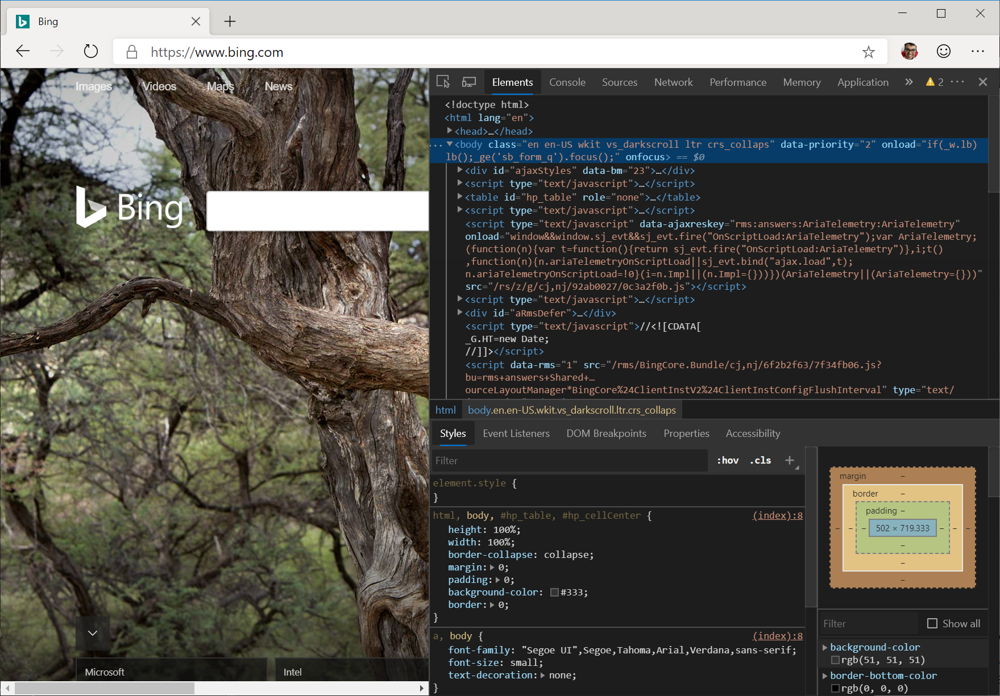

# <span data-ttu-id="cd540-104">Microsoft Edge (Chromium) DevTools の新機能</span><span class="sxs-lookup"><span data-stu-id="cd540-104">What's new in the Microsoft Edge (Chromium) DevTools</span></span>

<span data-ttu-id="cd540-105">新しい Microsoft Edge のプレビューを試してみていただき、ありがとうございました。</span><span class="sxs-lookup"><span data-stu-id="cd540-105">Thank you so much for trying out a preview of the new Microsoft Edge!</span></span> <span data-ttu-id="cd540-106">このリリースでは、Chromium open source プロジェクトを採用することで、Microsoft Edge の基盤となる web プラットフォームでの大きなシフトを実施しました。</span><span class="sxs-lookup"><span data-stu-id="cd540-106">With this release, we've undertaken a major shift in the underlying web platform of Microsoft Edge by adopting the Chromium open source project.</span></span> <span data-ttu-id="cd540-107">この変更により、Microsoft Edge で web サイトを構築およびテストして、ユーザーが Google Chrome、Vivaldi、Opera、Brave などの別の Chromium ベースのブラウザーで参照している場合でも、引き続き期待どおりに動作することができます。</span><span class="sxs-lookup"><span data-stu-id="cd540-107">With this change, it will be easier for you to build and test your web sites in Microsoft Edge and ensure they will still work as expected even if your users are browsing in a different Chromium-based browser, like Google Chrome, Vivaldi, Opera, or Brave.</span></span>

## <span data-ttu-id="cd540-108">新しい Microsoft Edge (Chromium) DevTools</span><span class="sxs-lookup"><span data-stu-id="cd540-108">The new Microsoft Edge (Chromium) DevTools</span></span>

<span data-ttu-id="cd540-109">Microsoft Edge をチェックしていて、Chromium ベースのブラウザーで主に開発している場合は、自宅で適切なことを考えてください。</span><span class="sxs-lookup"><span data-stu-id="cd540-109">If you are checking out Microsoft Edge and you mainly develop in a Chromium-based browser, you should feel right at home.</span></span> <span data-ttu-id="cd540-110">Microsoft Edge (Chromium) 開発者ツールは、既に知っていて使用している開発者ツールとまったく同じです。</span><span class="sxs-lookup"><span data-stu-id="cd540-110">The Microsoft Edge (Chromium) Developer Tools are exactly like the developer tools you already know and use!</span></span>



<span data-ttu-id="cd540-112">新しい Microsoft Edge をチェックアウトしていて、主に Microsoft Edge (EdgeHTML) で開発している場合は、Microsoft Edge で web サイトを構築およびテストするために、より簡単かつ速くなるようになる新しいツールがいくつか用意されています。</span><span class="sxs-lookup"><span data-stu-id="cd540-112">If you are checking out the new Microsoft Edge and you mainly developed in Microsoft Edge (EdgeHTML), we have got some great new tools that we hope will make it easier and faster for you to build and test your web sites in Microsoft Edge!</span></span> <span data-ttu-id="cd540-113">これらの新しいツールについて詳しくは、 [Microsoft Edge (Chromium) DevTools のガイド](../devtools-guide-chromium.md)をご覧ください。</span><span class="sxs-lookup"><span data-stu-id="cd540-113">To learn more about these new tools, check out [The Microsoft Edge (Chromium) DevTools Guide](../devtools-guide-chromium.md).</span></span>

## <span data-ttu-id="cd540-114">DevTools 用の新しい濃色とライトのテーマ</span><span class="sxs-lookup"><span data-stu-id="cd540-114">New dark and light themes for the DevTools</span></span>

<span data-ttu-id="cd540-115">お客様にとって気に入っていると考えている DevTools のために、新しいダークテーマと軽量テーマを開発しました。</span><span class="sxs-lookup"><span data-stu-id="cd540-115">We've designed some new dark and light themes for the DevTools that we think you'll love!</span></span> <span data-ttu-id="cd540-116">既定では、Microsoft Edge (Chromium) DevTools は濃色テーマを使用します。</span><span class="sxs-lookup"><span data-stu-id="cd540-116">By default, the Microsoft Edge (Chromium) DevTools will use the Dark theme.</span></span> <span data-ttu-id="cd540-117">Devtools のテーマを変更するには、 `Fn`  +  `F1` Windows または Mac を押すか、 `...` devtools の右上隅にあるボタンを使用して [設定] に移動します。</span><span class="sxs-lookup"><span data-stu-id="cd540-117">To change the theme of the DevTools, press `Fn` + `F1` on Windows or Mac or navigate to Settings using the `...` button in the top right corner of the DevTools.</span></span>


<span data-ttu-id="cd540-119">[設定] から、DevTools のテーマを変更することができます。</span><span class="sxs-lookup"><span data-stu-id="cd540-119">From Settings, you can change the theme of the DevTools.</span></span> <span data-ttu-id="cd540-120">Chromium ベースのブラウザーでの DevTools の表示方法が気に入った場合は、[ **ダーク (Chromium)** ] または [ **Light (Chromium)** ] のテーマをそれぞれ選ぶことにより、Microsoft Edge (Chromium) の devtools をまったく同じように見せることができます。</span><span class="sxs-lookup"><span data-stu-id="cd540-120">If you liked the way the DevTools looked in your Chromium-based browser, you can make the Microsoft Edge (Chromium) DevTools look exactly like them by selecting the **Dark (Chromium)** or **Light (Chromium)** themes respectively.</span></span> 

## <span data-ttu-id="cd540-121">VS コードから Microsoft Edge (Chromium) をデバッグする</span><span class="sxs-lookup"><span data-stu-id="cd540-121">Debug Microsoft Edge (Chromium) from VS Code</span></span>

<span data-ttu-id="cd540-122">Microsoft Edge とコード拡張 [用のデバッガー](https://marketplace.visualstudio.com/items?itemName=msjsdiag.debugger-for-edge) を使うと、microsoft Edge (EdgeHTML) と microsoft Edge (Chromium) の両方を VS コードから直接デバッグできるようになりました。</span><span class="sxs-lookup"><span data-stu-id="cd540-122">With the [Debugger for Microsoft Edge](https://marketplace.visualstudio.com/items?itemName=msjsdiag.debugger-for-edge) VS Code extension, you can now debug both Microsoft Edge (EdgeHTML) and Microsoft Edge (Chromium) directly from VS Code!</span></span>


<span data-ttu-id="cd540-124">VS コードから microsoft Edge (EdgeHTML) の代わりに Microsoft Edge (Chromium) を起動するには、 `version` (、、または) を起動するバージョンの Microsoft edge (Chromium) を使用して、構成 \*\* 上の\*\* 既存のlaunch.jsに属性を追加する必要があり `dev` `beta` `canary` ます。</span><span class="sxs-lookup"><span data-stu-id="cd540-124">To launch Microsoft Edge (Chromium) instead of Microsoft Edge (EdgeHTML) from VS Code, you need to add a `version` attribute to your existing **launch.json** configuration with the version of Microsoft Edge (Chromium) you want to launch (`dev`, `beta`, or `canary`).</span></span> <span data-ttu-id="cd540-125">次に示すのは、Chromium (Microsoft Edge) のカナリアバージョン () を[bing.com](https://www.bing.com/)に起動する構成**のサンプルlaunch.js**です。</span><span class="sxs-lookup"><span data-stu-id="cd540-125">Here's a sample **launch.json** configuration that will launch the Canary version of Microsoft Edge (Chromium) to [bing.com](https://www.bing.com/):</span></span>

```json
{
    "type": "edge",
    "request": "launch",
    "version": "canary",
    "name": "Launch Microsoft Edge (Chromium) Canary against Bing",
    "url": "https://bing.com"
}
```

<span data-ttu-id="cd540-126">詳細については、「 [Microsoft Edge (Chromium) を VS コードからデバッグする方法](../visual-studio-code/debugger-for-edge.md)」を参照してください。</span><span class="sxs-lookup"><span data-stu-id="cd540-126">For more information, check out [how to debug Microsoft Edge (Chromium) from VS Code](../visual-studio-code/debugger-for-edge.md).</span></span>

## <span data-ttu-id="cd540-127">Edge DevTools プロトコル更新プログラム</span><span class="sxs-lookup"><span data-stu-id="cd540-127">Edge DevTools Protocol update</span></span>

<span data-ttu-id="cd540-128">Microsoft Edge の基になる web プラットフォームのシフトでは、Edge DevTools プロトコルは今後の更新プログラムを受け取りません。</span><span class="sxs-lookup"><span data-stu-id="cd540-128">With the shift in the underlying web platform of Microsoft Edge, the Edge DevTools Protocol will not be receiving any further updates.</span></span> <span data-ttu-id="cd540-129">Microsoft Edge (Chromium) DevTools は、Chrome DevTools プロトコルまたは CDP を使います。</span><span class="sxs-lookup"><span data-stu-id="cd540-129">The Microsoft Edge (Chromium) DevTools will use the Chrome DevTools Protocol or CDP.</span></span> <span data-ttu-id="cd540-130">CDP のドメインとメソッドに関するドキュメントを参照するには、 [cdp ビューアー](https://chromedevtools.github.io/devtools-protocol/tot/Accessibility)を参照してください。</span><span class="sxs-lookup"><span data-stu-id="cd540-130">To reference documentation on the domains and methods in CDP, please refer to [the CDP viewer](https://chromedevtools.github.io/devtools-protocol/tot/Accessibility).</span></span>

<span data-ttu-id="cd540-131">新しい Microsoft Edge では、プレフィックスの付いたメソッドは `ms` サポートされません。</span><span class="sxs-lookup"><span data-stu-id="cd540-131">In the new Microsoft Edge, any methods that are prefixed with `ms` will not be supported.</span></span> <span data-ttu-id="cd540-132">Microsoft Edge (Chromium) での CDP の使い方の詳細については、「 [Devtools Protocol (Chromium)](../devtools-protocol-chromium.md)」を参照してください。</span><span class="sxs-lookup"><span data-stu-id="cd540-132">To learn more about how to use CDP in Microsoft Edge (Chromium), please refer to [DevTools Protocol (Chromium)](../devtools-protocol-chromium.md).</span></span>

## <span data-ttu-id="cd540-133">既知の問題</span><span class="sxs-lookup"><span data-stu-id="cd540-133">Known issues</span></span>

<span data-ttu-id="cd540-134">サードパーティサイト上でホストされているコンテンツへの Microsoft Edge (Chromium) DevTools からの多くのリンクが一時的に削除されました。</span><span class="sxs-lookup"><span data-stu-id="cd540-134">Many links from the Microsoft Edge (Chromium) DevTools to content hosted on third-party sites have been removed temporarily.</span></span> <span data-ttu-id="cd540-135">これらのリンクを置き換えるとすぐに、開発ツールに再び追加されます。</span><span class="sxs-lookup"><span data-stu-id="cd540-135">As soon as we can replace these links, we will add them back to the DevTools.</span></span>


<span data-ttu-id="cd540-136">Microsoft Edge (Chromium) から Android デバイスで web コンテンツをデバッグする場合、**リモートデバイス**ツールの [**検査**] ボタンをクリックしたときに起動する Devtools のバージョンが Android デバイスのブラウザーのバージョンと一致しない可能性があります。</span><span class="sxs-lookup"><span data-stu-id="cd540-136">When debugging web content on an Android device from Microsoft Edge (Chromium), the version of the DevTools that launches when you click the **Inspect** button from the **Remote devices** tool may not match the version of the browser on your Android device.</span></span> <span data-ttu-id="cd540-137">このため、Android デバイスのブラウザーで動作しない、DevTools の新機能が表示されることがあります。</span><span class="sxs-lookup"><span data-stu-id="cd540-137">As a result, you may see new features in the DevTools that will not work against the browser on your Android device.</span></span> <span data-ttu-id="cd540-138">この問題が発生した場合は、ファイルに関する [フィードバック](../devtools-guide-chromium.md#getting-in-touch-with-the-microsoft-edge-devtools-team)をお寄せください。</span><span class="sxs-lookup"><span data-stu-id="cd540-138">If this is something you encounter, we'd love to hear about it so please [file feedback](../devtools-guide-chromium.md#getting-in-touch-with-the-microsoft-edge-devtools-team)!</span></span>

<span data-ttu-id="cd540-139">最後に、Windows と Mac の Visual Studio では、Microsoft Edge (Chromium) はまだサポートされていません。</span><span class="sxs-lookup"><span data-stu-id="cd540-139">Finally, Visual Studio on Windows and Mac does not yet support Microsoft Edge (Chromium).</span></span> <span data-ttu-id="cd540-140">[ここ](https://visualstudio.microsoft.com/vs/preview/)にサインアップして、ASP.NET プロジェクト用の Microsoft Edge (Chromium) 内で JavaScript のデバッグをサポートする Visual Studio のプレビューバージョンがある場合に、最初にご確認ください。</span><span class="sxs-lookup"><span data-stu-id="cd540-140">Sign up [here](https://visualstudio.microsoft.com/vs/preview/) to be the first to know when we have a preview version of Visual Studio that supports JavaScript debugging inside Microsoft Edge (Chromium) for ASP.NET projects!</span></span>  
