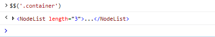
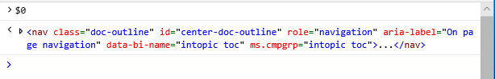
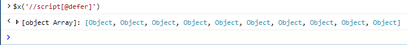
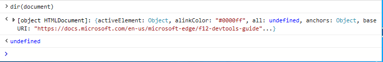

# コンソールコマンドラインConsole command line

本体のコマンドラインを使って、ページ上の値を表示して変更し、その場でデバッグコードを実行します。 Visual Studio の[*IntelliSense*](/visualstudio/ide/javascript-intellisense)では、自動コード補完が利用されます。Use the Console command line to view and change values on a page and execute debug code on the fly, all while taking advantage of Visual Studio [*IntelliSense*](/visualstudio/ide/javascript-intellisense) auto code completion. 

コマンドラインプロンプトで任意の有効な JavaScript を入力し、を押して `Enter` 実行します。Simply enter any valid JavaScript at the command line prompt and press `Enter` to execute. 複数行入力の場合は、 `Shift+Enter` 改行を追加するために使用します。For multi-line input use `Shift+Enter` to add a line-break. 現在の `Up` `Down` devtools セッション中に入力した前のコンソールコマンドの間を移動するには、および方向キーを使用します。Use the `Up` and `Down` arrow keys to navigate through previous console commands you entered during the current  DevTools session. コンソールは、標準の JavaScript や[コンソール API](./console-api.md)に加えて、次のコマンドもサポートします。In addition to standard JavaScript and the [Console API](./console-api.md), the Console also supports the following commands for:

 - [DOM オブジェクトの選択Selecting DOM objects](#dom-selectors)
 - [オブジェクトのプロパティを検査するInspecting object properties](#object-inspection)
 - [特定のオブジェクトのすべてのイベントリスナーを検索するFinding all the event listeners on a given object](#event-listeners)

コマンドラインで入力したスクリプトは、ページがブレークポイントで一時停止されていない限り、現在選択されているウィンドウの[グローバルスコープ](/scripting/javascript/advanced/variable-scope-javascript)で実行されます。Script entered in the command line executes in the [global scope](/scripting/javascript/advanced/variable-scope-javascript) of the currently selected window, unless the page is paused at a breakpoint. ページが一時停止している間に入力されたコンソールコマンドは、呼び出し履歴内の現在の関数の[ローカルスコープ](/scripting/javascript/advanced/variable-scope-javascript)で実行されます。Console commands entered while the page is paused will execute in the [local scope](/scripting/javascript/advanced/variable-scope-javascript) of the current function within the call stack.

本体には本体の出力領域のすぐ上に**ターゲット**の実行コンテキストのドロップダウンがあります。The Console has a **Target** execution context drop-down just above the Console output area. 既定では、[ **_top**] のトップレベルのドキュメントが選択されています。The default selection is the top-level document, **_top**. ドキュメント内または実行可能な拡張機能もオプションとして表示され、それらのスコープ内でコマンドを実行することができます。Any iframes in the document or running extensions will also appear as options, allowing you to alternately run commands within those scopes.

## DOM セレクターDOM selectors
以下のコンソールセレクターでは、DOM 内のオブジェクトにすばやくアクセスするためのシンプルな shorthands を提供しています。These console selectors provide simple shorthands for quickly accessing objects within the DOM:

### $ (*CSS セレクター文字列*)$(*CSS selector string*)
指定された[CSS セレクター](https://developer.mozilla.org/docs/Learn/CSS/Introduction_to_CSS/Selectors) (または、複数のセレクターのグループ) 文字列に一致する、文書内の最初の要素を返します。Returns the first element within the document matching the specified [CSS selector](https://developer.mozilla.org/docs/Learn/CSS/Introduction_to_CSS/Selectors)  (or comma-separated group of selectors) string. [Document selector ()](https://developer.mozilla.org/docs/Web/API/Document/querySelector)の短縮形。Shorthand for [document.querySelector()](https://developer.mozilla.org/docs/Web/API/Document/querySelector).

例: 本体を開き、 `$('#main')` このページで div オブジェクトを返すために type を入力し `id='main'` ます。Example: Open the console and type `$('#main')` to return the div object with `id='main'` on this page.

### $ $ (*CSS セレクター文字列*)$$(*CSS selector string*)
指定された[CSS セレクター](https://developer.mozilla.org/docs/Learn/CSS/Introduction_to_CSS/Selectors) (または、コンマ区切りのセレクター) 文字列に一致する、文書内の要素の配列を返します。Returns an array of elements within the document matching the specified [CSS selector](https://developer.mozilla.org/docs/Learn/CSS/Introduction_to_CSS/Selectors)  (or comma-separated group of selectors) string. [QuerySelectorAll ()](https://developer.mozilla.org/docs/Web/API/Document/querySelectorAll)の短縮形。Shorthand for [document.querySelectorAll()](https://developer.mozilla.org/docs/Web/API/Document/querySelectorAll).

例: 本体を開いて、 `$$('.container')` このページにあるすべての div オブジェクトを返すように入力し `class='container'` ます。Example: Open the console and type `$$('.container')` to return all the div objects with `class='container'` on this page.

### $0、$1、$2,...$0, $1, $2,...
[**要素**](../elements.md)パネルで選択されている最後の要素を返します。ここでは、現在選択されている項目を示し、その前に選択されている項目が含まれてい `$0` `$1` ます。Returns the last elements selected in the [**Elements**](../elements.md) panel, where `$0` represents the currently selected item, `$1` was the selected item before that, and so on.

例: DevTools を開いて [**要素**] タブに移動し、を押して `CTRL + B` **[要素の選択**] ツールをアクティブ化し、マウスでこのページの一部の領域をクリックします。Example: Open  DevTools to the **Elements** tab, press `CTRL + B` to activate the **Select element** tool and click some area on this page with your mouse. 次に、コンソールを開いて、 `$0` クリックしたばかりの要素を返すように入力します。Now open the Console and type `$0` to return the element you just clicked.

### $x (*XPath 式*)$x(*XPath expression*)
指定された[XPath](https://developer.mozilla.org/docs/Introduction_to_using_XPath_in_JavaScript)式に一致する要素の配列を返します。Returns an array of elements matched by the specified [XPath](https://developer.mozilla.org/docs/Introduction_to_using_XPath_in_JavaScript) expression. 

例: 本体を開き、 `$x('//script[@defer]')` `<script>` 属性を含むこのページのすべての要素を返すには、「...」と入力し `defer` ます。Example: Open the console and type `$x('//script[@defer]')` to return all the `<script>` elements on this page that contain a `defer` attribute.

## オブジェクト検査Object inspection

以下のコマンドを使うと、オブジェクトのプロパティを簡単に調べることができます。These commands provide quick ways to inspect the properties of an object. 指定したオブジェクトは、グローバル名前空間またはデバッガーの現在のスコープで定義されている必要があります。The specified object must either be defined in the global namespace or the current scope of the debugger.

### dir (*オブジェクト*)dir(*object*)
指定されたオブジェクトのプロパティのツリービューのリストを返します。Returns a tree view list of properties for the specified object.

例: 本体を開き、 `dir(document)` このページを表すドキュメントオブジェクトのオブジェクトプロパティを表示するには「」と入力します。Example: Open the console and type `dir(document)` to see the object properties for the document object representing this page.

### キー (*オブジェクト*)keys(*object*)
指定されたオブジェクトに結び付けられているプロパティ名の配列を返します。Returns an array of property names attached to the specified object.

例: 本体と type を開き、 `keys(window)` グローバルウィンドウオブジェクトで定義されているすべてのプロパティを返します。Example: Open the console and type `keys(window)` to return all of the properties defined on the global window object.

### 値 (*オブジェクト*)values(*object*)
指定されたオブジェクトに結び付けられているプロパティ値の配列を返します。Returns an array of property values attached to the specified object.

例: 本体を開き、 `values(window)` グローバルウィンドウオブジェクトで定義されているすべてのプロパティ (キー) の値を返すには、「type」と入力します。Example: Open the console and type `values(window)` to return the values of all the properties (keys) defined on the global window object.

## イベントリスナーEvent listeners

このコマンドを使うと、指定したオブジェクトに登録されているイベントリスナーを調べることができます。This command allows you to inspect the event listeners registered to a given object. 指定したオブジェクトは、グローバル名前空間またはデバッガーの現在のスコープで定義されている必要があります。The specified object must either be defined in the global namespace or the current scope of the  debugger.

### getEventListeners (*object*)getEventListeners(*object*)
指定されたオブジェクトに登録されている各イベントの種類について、キーを含むオブジェクトを返します。Returns an object containing a key for each registered event type on the given object. 各キーの値は、イベントリスナーとそれに関連する情報の配列です。The value of each key is an array of event listeners and their related info. 

例: 本体と type を開き、 `getEventListeners(document)` このページのドキュメントオブジェクトに登録されているすべてのイベントリスナーを表示します。Example: Open the console and type `getEventListeners(document)` to see all the event listeners registered on the document object of this page.

