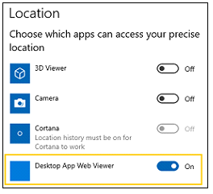

# <span data-ttu-id="e5118-104">Microsoft Edge 開発者ガイド</span><span class="sxs-lookup"><span data-stu-id="e5118-104">Microsoft Edge Developer Guide</span></span>

> [!TIP]
> <span data-ttu-id="e5118-105">他のブラウザー[](https://blogs.windows.com/msedgedev/2017/10/18/documenting-web-together-mdn-web-docs/)や Web コミュニティと提携し[、MDN Web Docs](https://developer.mozilla.org/)を、現在および新たな標準ベースの Web テクノロジに関する有用で、未確定のブラウザーに依存しないドキュメントの決定的な場所として採用しています。</span><span class="sxs-lookup"><span data-stu-id="e5118-105">We've [partnered](https://blogs.windows.com/msedgedev/2017/10/18/documenting-web-together-mdn-web-docs/) with other browsers and the web community in adopting [MDN Web Docs](https://developer.mozilla.org/) as the definitive place for useful, unbiased, browser-agnostic documentation for current and emerging standards-based web technologies.</span></span> <span data-ttu-id="e5118-106">EdgeHTML API のサポートに関する詳細は、MDN Web リファレンス ライブラリの各ページ [で直接確認できます](https://developer.mozilla.org/docs/Web)。</span><span class="sxs-lookup"><span data-stu-id="e5118-106">You can find details about EdgeHTML API support directly in each page of the [MDN web reference library](https://developer.mozilla.org/docs/Web).</span></span> <span data-ttu-id="e5118-107">Microsoft Edge でサポートされている最新 [の](https://developer.microsoft.com/microsoft-edge/platform/status/?q=edge%3AShipped%20edge%3APrefixed%20edge%3A'Preview%20Release) 機能については、Microsoft Edge のプラットフォームの状態にアクセスしてください。</span><span class="sxs-lookup"><span data-stu-id="e5118-107">Visit Microsoft Edge's [Platform status](https://developer.microsoft.com/microsoft-edge/platform/status/?q=edge%3AShipped%20edge%3APrefixed%20edge%3A'Preview%20Release) for the latest features supported in Microsoft Edge.</span></span> 

## <span data-ttu-id="e5118-108">EdgeHTML 18 の新機能</span><span class="sxs-lookup"><span data-stu-id="e5118-108">What's new in EdgeHTML 18</span></span>

<span data-ttu-id="e5118-109">EdgeHTML 18 には [、Windows 10 October 2018 Update (10/2018、](/windows/uwp/whats-new/windows-10-build-17763) ビルド 17763) の現在のリリースでリリースされた次の新機能と更新された機能が含まれています。</span><span class="sxs-lookup"><span data-stu-id="e5118-109">EdgeHTML 18 includes the following new and updated features shipped in the current release of the Microsoft Edge platform, as of the [Windows 10 October 2018 Update](/windows/uwp/whats-new/windows-10-build-17763) (10/2018, Build 17763).</span></span> <span data-ttu-id="e5118-110">特定の [Windows Insider](https://insider.windows.com/) Preview ビルドの変更については [、Microsoft Edge の変更ログ](https://developer.microsoft.com/microsoft-edge/platform/changelog/) と EdgeHTML の新機能に関するページ [をご覧ください](./whats-new.md)。</span><span class="sxs-lookup"><span data-stu-id="e5118-110">For changes in specific [Windows Insider](https://insider.windows.com/) Preview builds, see the [Microsoft Edge Changelog](https://developer.microsoft.com/microsoft-edge/platform/changelog/) and [What's New in EdgeHTML](./whats-new.md).</span></span>

<span data-ttu-id="e5118-111">次の変更の一覧の permalink を次に示します [https://aka.ms/devguide_edgehtml_18](./whats-new.md) 。</span><span class="sxs-lookup"><span data-stu-id="e5118-111">Here's the permalink for the following list of changes: [https://aka.ms/devguide_edgehtml_18](./whats-new.md).</span></span>

## <span data-ttu-id="e5118-112">新機能と更新された機能</span><span class="sxs-lookup"><span data-stu-id="e5118-112">New and updated features</span></span>

### <span data-ttu-id="e5118-113">自動再生のポリシー</span><span class="sxs-lookup"><span data-stu-id="e5118-113">Autoplay policies</span></span>

<span data-ttu-id="e5118-114">Windows 10 October 2018 Update を使用すると、Microsoft Edge では、Web 上の気を散らさないようにし、帯域幅を節約するために、メディアをサウンドで自動再生する Web サイトの閲覧設定をカスタマイズできます。</span><span class="sxs-lookup"><span data-stu-id="e5118-114">With the Windows 10 October 2018 Update, Microsoft Edge provides customers with the ability to personalize their browsing preferences on websites that autoplay media with sound in order to minimize distractions on the web and conserve bandwidth.</span></span> <span data-ttu-id="e5118-115">ユーザーは、グローバル自動再生コントロールとサイトごとの自動再生コントロールの両方でメディアの動作をカスタマイズできます。</span><span class="sxs-lookup"><span data-stu-id="e5118-115">Users can customize media behavior with both global and per-site autoplay controls.</span></span> <span data-ttu-id="e5118-116">さらに、Microsoft Edge では、バックグラウンド タブでのメディアの自動再生が自動的に抑制されます。</span><span class="sxs-lookup"><span data-stu-id="e5118-116">Additionally, Microsoft Edge automatically suppresses autoplay of media in background tabs.</span></span>

<span data-ttu-id="e5118-117">サイトでホスト [されているメディアに](./browser-features/autoplay-policies.md) 関する優れたユーザー エクスペリエンスを確保するための詳細とベスト プラクティスについては、自動再生ポリシー ガイドを参照してください。</span><span class="sxs-lookup"><span data-stu-id="e5118-117">Check out the [Autoplay policies](./browser-features/autoplay-policies.md) guide for details and best practices to ensure a good user experience with media hosted on your site.</span></span>

### <span data-ttu-id="e5118-118">チャクラの機能強化</span><span class="sxs-lookup"><span data-stu-id="e5118-118">Chakra improvements</span></span>

<span data-ttu-id="e5118-119">EdgeHTML 18 には、パフォーマンスと相互運用性の向上に加えて、新しい ES および WASM 機能をサポートするために、Chakra JavaScript エンジンの更新プログラムが含まれています。</span><span class="sxs-lookup"><span data-stu-id="e5118-119">EdgeHTML 18 includes updates to the Chakra JavaScript engine to support new ES and WASM features in addition to performance and interoperability improvements.</span></span> <span data-ttu-id="e5118-120">詳細については [、ChakraCore 1.11 リリース ノート](https://github.com/Microsoft/ChakraCore/wiki/Roadmap#chakracore-111) を参照してください。</span><span class="sxs-lookup"><span data-stu-id="e5118-120">Check out the [ChakraCore 1.11 Release Notes](https://github.com/Microsoft/ChakraCore/wiki/Roadmap#chakracore-111) for details.</span></span>

### <span data-ttu-id="e5118-121">CSS の更新</span><span class="sxs-lookup"><span data-stu-id="e5118-121">CSS updates</span></span>

<span data-ttu-id="e5118-122">マスクコンポジット、マスク位置、マスク繰り返しのサポートが追加され、実験的[](https://developer.mozilla.org/docs/Web/CSS/mask-repeat)な[CSS](https://developer.mozilla.org/docs/Web/CSS/CSS_Masking)マスクの実装 *(ENABLE CSS Masking*フラグの背後) に関するさらなる進歩が行われた。 [](https://developer.mozilla.org/docs/Web/CSS/mask-composite) [](https://developer.mozilla.org/docs/Web/CSS/mask-position)</span><span class="sxs-lookup"><span data-stu-id="e5118-122">We've made further progress on our experimental [CSS Masking](https://developer.mozilla.org/docs/Web/CSS/CSS_Masking) implementation (behind the *Enable CSS Masking* flag) with added support for [mask-composite](https://developer.mozilla.org/docs/Web/CSS/mask-composite), [mask-position](https://developer.mozilla.org/docs/Web/CSS/mask-position), and [mask-repeat](https://developer.mozilla.org/docs/Web/CSS/mask-repeat).</span></span> <span data-ttu-id="e5118-123">サイト互換性のために、Microsoft Edge は次の *-webkit-* プロパティもサポートしています。-webkit-mask、-webkit-mask-composite、-webkit-mask-image、-webkit-mask-position、-webkit-mask-position-x、-webkit-mask-position-y、-webkit-mask-repeat、-webkit-mask-size。</span><span class="sxs-lookup"><span data-stu-id="e5118-123">For site compatibility, Microsoft Edge also supports the following *-webkit-* properties: -webkit-mask, -webkit-mask-composite, -webkit-mask-image, -webkit-mask-position, -webkit-mask-position-x, -webkit-mask-position-y, -webkit-mask-repeat, -webkit-mask-size.</span></span>

<span data-ttu-id="e5118-124">さらに、Microsoft Edge では、オーバーフロー[](https://developer.mozilla.org/docs/Web/CSS/overflow-wrap
)ラップとオーバースクロール動作[(および](https://developer.mozilla.org/docs/Web/CSS/overscroll-behavior)値) の部分的なサポートが `auto` サポート `contain` されています。</span><span class="sxs-lookup"><span data-stu-id="e5118-124">Additionally, Microsoft Edge now has support for [overflow-wrap](https://developer.mozilla.org/docs/Web/CSS/overflow-wrap
) and partial support for [overscroll-behavior](https://developer.mozilla.org/docs/Web/CSS/overscroll-behavior) (`auto` and `contain` values).</span></span>

### <span data-ttu-id="e5118-125">開発者ツール</span><span class="sxs-lookup"><span data-stu-id="e5118-125">Developer Tools</span></span>

<span data-ttu-id="e5118-126">Microsoft Edge DevTools の最新の更新プログラムでは、UI とセキュリティの両方に多くの利便性が追加されています。たとえば、サービス ワーカーとストレージ用の新しい専用パネル、デバッガーのソース ファイル検索ツール、スタイル/レイアウトのデバッグとコンソール API 用の新しい Edge DevTools プロトコル ドメインが含まれます。</span><span class="sxs-lookup"><span data-stu-id="e5118-126">The latest update to Microsoft Edge DevTools adds a number of conveniences both to the UI and under the hood, including new dedicated panels for Service Workers and Storage, source file search tools in the Debugger, and new Edge DevTools Protocol domains for style/layout debugging and console APIs.</span></span>

<span data-ttu-id="e5118-127">[最新の Windows 10 更新プログラム (EdgeHTML 18) の DevTools](../devtools-guide/whats-new.md) には、すべての詳細があります。</span><span class="sxs-lookup"><span data-stu-id="e5118-127">[DevTools in the latest Windows 10 update (EdgeHTML 18)](../devtools-guide/whats-new.md) has all the details.</span></span>

### <span data-ttu-id="e5118-128">フィードバックの聞き取り</span><span class="sxs-lookup"><span data-stu-id="e5118-128">Listening to your feedback</span></span>

<span data-ttu-id="e5118-129">お客様からのフィードバックを受け取り、EdgeHTML 18 で要求された API のサポートを実装しました。たとえば、ドラッグ アンド ドロップ時にカスタム イメージを設定するために使用されるメソッドや、ブラウザーがハンドシェイク プロセスを開始する直前にタイムスタンプを返して現在の接続をセキュリティで保護するために使用できる Performance [`DataTransfer.setDragImage()`](https://developer.mozilla.org/docs/Web/API/DataTransfer/setDragImage) Resource Timing API のプロパティが含まれます。 [`secureConnectionStart`](https://developer.mozilla.org/docs/Web/API/PerformanceResourceTiming/secureConnectionStart)</span><span class="sxs-lookup"><span data-stu-id="e5118-129">We listen to your feedback and have implemented support for several requested APIs in EdgeHTML 18, including the [`DataTransfer.setDragImage()`](https://developer.mozilla.org/docs/Web/API/DataTransfer/setDragImage) method used to set a custom image when dragging and dropping, and [`secureConnectionStart`](https://developer.mozilla.org/docs/Web/API/PerformanceResourceTiming/secureConnectionStart), a property of the Performance Resource Timing API, which can be used for returning a timestamp immediately before the browser starts the handshake process to secure the current connection.</span></span> 

<span data-ttu-id="e5118-130">また、属性コレクションの列挙を好む人はいないので、要素の属性名を文字列の配列として返すだけでなく、ブール属性を切り替えるサポートも追加しました (存在する場合は削除し、ない場合は追加します [`Element.getAttributeNames`](https://developer.mozilla.org/docs/Web/API/Element/getAttributeNames) [`Element.toggleAttribute`](https://developer.mozilla.org/docs/Web/API/Element/toggleAttribute) )。</span><span class="sxs-lookup"><span data-stu-id="e5118-130">In addition, no one likes enumerating the attributes collection, so we've added support for [`Element.getAttributeNames`](https://developer.mozilla.org/docs/Web/API/Element/getAttributeNames) to return the attribute names of the element as an Array of strings, as well as, [`Element.toggleAttribute`](https://developer.mozilla.org/docs/Web/API/Element/toggleAttribute) to toggle a boolean attribute (removing if present and adding if not).</span></span>

### <span data-ttu-id="e5118-131">プログレッシブ Web アプリ</span><span class="sxs-lookup"><span data-stu-id="e5118-131">Progressive Web Apps</span></span>

#### <span data-ttu-id="e5118-132">有効期間バックグラウンド スクリプト</span><span class="sxs-lookup"><span data-stu-id="e5118-132">Lifetime background script</span></span>

<span data-ttu-id="e5118-133">Windows 10 JavaScript アプリ \* (WWAHost.exe\* プロセスで実行される Web アプリ) では、任意のビューがアクティブ化され、プロセスの期間中実行される前に開始される、アプリケーションごとのオプションのバックグラウンド スクリプトがサポートされます。</span><span class="sxs-lookup"><span data-stu-id="e5118-133">Windows 10 JavaScript apps (web apps running in a *WWAHost.exe* process) now support an optional per-application background script that starts before any views are activated and runs for the duration of the process.</span></span> <span data-ttu-id="e5118-134">これにより、ナビゲーションの監視と変更、ナビゲーション全体の状態の追跡、ナビゲーション エラーの監視、およびビューがアクティブ化される前のコードの実行を行えます。</span><span class="sxs-lookup"><span data-stu-id="e5118-134">With this, you can monitor and modify navigations, track state across navigations, monitor navigation errors, and run code before views are activated.</span></span> 

<span data-ttu-id="e5118-135">アプリ マニフェストで指定すると、アプリの各ビュー (ウィンドウ) が新しいクラスのインスタンスとしてスクリプトに公開され、一般的な [`StartPage`](/uwp/schemas/appxpackage/appxmanifestschema2010-v2/element-application) [](/uwp/schemas/appxpackage/appx-package-manifest) [`WebUIView`](/uwp/api/windows.ui.webui.webuiview) (Win32) [WebView](/uwp/api/windows.web.ui.iwebviewcontrol)と同じイベント、プロパティ、およびメソッドが提供されます。</span><span class="sxs-lookup"><span data-stu-id="e5118-135">When specified as the [`StartPage`](/uwp/schemas/appxpackage/appxmanifestschema2010-v2/element-application) in your [app manifest](/uwp/schemas/appxpackage/appx-package-manifest), each of the app's views (windows) are exposed to the script as instances of the new [`WebUIView`](/uwp/api/windows.ui.webui.webuiview) class, providing the same events, properties, and methods as a general (Win32) [WebView](/uwp/api/windows.web.ui.iwebviewcontrol).</span></span> <span data-ttu-id="e5118-136">スクリプトは、新しいビュー [`NewWebUIViewCreated`](/uwp/api/windows.ui.webui.newwebuiviewcreatedeventargs) のナビゲーションの制御を傍受するイベントをリッスンできます。</span><span class="sxs-lookup"><span data-stu-id="e5118-136">Your script can listen for the [`NewWebUIViewCreated`](/uwp/api/windows.ui.webui.newwebuiviewcreatedeventargs) event to intercept control of the navigation for a new view:</span></span>

```JavaScript
Windows.UI.WebUI.WebUIApplication.addEventListener("newwebuiviewcreated", newWebUIViewCreatedEventHandler);
```

 <span data-ttu-id="e5118-137">バックグラウンド スクリプトを使ったアプリのアクティブ化は、ナビゲーションの `StartPage` スクリプト自体に依存します。</span><span class="sxs-lookup"><span data-stu-id="e5118-137">Any app activation with the background script as the `StartPage` will rely on the script itself for navigation.</span></span>

#### <span data-ttu-id="e5118-138">テキストの拡大縮小</span><span class="sxs-lookup"><span data-stu-id="e5118-138">Text scaling</span></span>

<span data-ttu-id="e5118-139">Windows 10 October 2018 Update[\*\*](/windows/uwp/design/input/text-scaling#user-experience)では、エンド ユーザーのアクセシビリティを強化するためにテキストを大きくする設定が導入され、Windows (UWP とほとんどのデスクトップ アプリに加えて) にインストールされている PAS は、この機能を自動的にサポートします。</span><span class="sxs-lookup"><span data-stu-id="e5118-139">The Windows 10 October 2018 Update introduces the [*Make text bigger*](/windows/uwp/design/input/text-scaling#user-experience) setting for improved end-user accessibility, and PWAs installed on Windows (in addition UWP and most desktop apps) now support this feature automatically.</span></span> <span data-ttu-id="e5118-140">PAS コントロールと WebView コントロールの場合、テキストスケールは DPI スケーリングと同じように動作します。</span><span class="sxs-lookup"><span data-stu-id="e5118-140">For PWAs and WebView controls, text scale works the same way as DPI scaling.</span></span> <span data-ttu-id="e5118-141">ユーザーがテキスト スケールと DPI スケールの両方を変更すると、結果は 2 つの製品になります。</span><span class="sxs-lookup"><span data-stu-id="e5118-141">If a user changes both text scale and DPI scale, the result is the product of the two.</span></span>

 <span data-ttu-id="e5118-142">設計ガイダンスについては、Windows デベロッパー センターの [テキストスケーリング](/windows/uwp/design/input/text-scaling) UWP ガイド *をご覧ください*。</span><span class="sxs-lookup"><span data-stu-id="e5118-142">For design guidance, check out the [Text scaling](/windows/uwp/design/input/text-scaling) UWP guide on *Windows Dev Center*.</span></span>

### <span data-ttu-id="e5118-143">サービス ワーカーの更新プログラム</span><span class="sxs-lookup"><span data-stu-id="e5118-143">Service Worker updates</span></span> 

<span data-ttu-id="e5118-144">サービス ワーカーの概要と動作の詳細については、パートナーが MDN で書いたサービス ワーカー [API]( https://developer.mozilla.org/docs/Web/API/Service_Worker_API) の概要を確認してください。</span><span class="sxs-lookup"><span data-stu-id="e5118-144">For a refresher on what Service Workers are and how they work, check out the [Service Worker API]( https://developer.mozilla.org/docs/Web/API/Service_Worker_API) summary written by our partners over at MDN.</span></span>  <span data-ttu-id="e5118-145">EdgeHTML 18 のサービス ワーカーをサポートする Microsoft Edge には、いくつかの更新プログラムが含まれています。</span><span class="sxs-lookup"><span data-stu-id="e5118-145">There were several updates to Microsoft Edge supporting Service Workers in EdgeHTML 18.</span></span> <span data-ttu-id="e5118-146">サービス ワーカーが応答を約束するために使用し、現在のサービス ワーカーが制御しているクライアントの `fetchEvent` [`preloadResponse`]( https://developer.mozilla.org/docs/Web/API/FetchEvent) ID [`resultingClientId`]( https://developer.mozilla.org/docs/Web/API/FetchEvent/clientId) を返します。</span><span class="sxs-lookup"><span data-stu-id="e5118-146">The `fetchEvent` enables the Service Worker to use [`preloadResponse`]( https://developer.mozilla.org/docs/Web/API/FetchEvent) to promise a response, and the [`resultingClientId`]( https://developer.mozilla.org/docs/Web/API/FetchEvent/clientId) to return the ID of the Client that the current service worker is controlling.</span></span>  
<span data-ttu-id="e5118-147">このインターフェイスは、リソースのプリロードを管理するためのメソッドを提供し、サービス ワーカーが起動している間に並行して要求を行い、時間遅延を回避 [`NavigationPreloadManager`]( https://developer.mozilla.org/docs/Web/API/NavigationPreloadManager) できます。</span><span class="sxs-lookup"><span data-stu-id="e5118-147">The [`NavigationPreloadManager`]( https://developer.mozilla.org/docs/Web/API/NavigationPreloadManager) interface provides methods for managing the preloading of resources, allowing you to make a request in parallel while a service worker is booting-up, avoiding any time delay.</span></span> <span data-ttu-id="e5118-148">Service Worker の [プリロード メソッド](#new-apis-in-edgehtml-18) とプロパティの一覧で、新しくサポートされている API プロパティを確認してください。</span><span class="sxs-lookup"><span data-stu-id="e5118-148">Check out the [newly supported API properties](#new-apis-in-edgehtml-18) for the list of Service Worker preload methods and properties.</span></span> 

### <span data-ttu-id="e5118-149">Web 認証</span><span class="sxs-lookup"><span data-stu-id="e5118-149">Web Authentication</span></span>

<span data-ttu-id="e5118-150">Microsoft Edge では、新しい Web 認証 API (別名[WebAuthN)](https://w3c.github.io/webauthn/)に対[する](https://blogs.windows.com/msedgedev/2018/07/30/introducing-web-authentication-microsoft-edge/)固定されていないサポートが追加されました。</span><span class="sxs-lookup"><span data-stu-id="e5118-150">Microsoft Edge now includes [unprefixed support for the new Web Authentication API](https://blogs.windows.com/msedgedev/2018/07/30/introducing-web-authentication-microsoft-edge/) (aka [WebAuthN](https://w3c.github.io/webauthn/)).</span></span> <span data-ttu-id="e5118-151">Web 認証は、オープンでスケーラブルで相互運用可能なソリューションを提供し、認証を簡素化し、パスワードをより強力なハードウェアにバインドされた資格情報に置き換え、より優れたセキュリティで保護されたユーザー エクスペリエンスを実現します。</span><span class="sxs-lookup"><span data-stu-id="e5118-151">Web Authentication provides an open, scalable, and interoperable solution to simplify authentication, enabling better and more secure user experiences by replacing passwords with stronger hardware-bound credentials.</span></span> <span data-ttu-id="e5118-152">Microsoft Edge の実装により、ユーザーは[Windows Hello](https://www.microsoft.com/windows/windows-hello)を使用して、FIDO2 セキュリティ キーや FIDO U2F セキュリティ キーのような外部認証システムに加えて、顔認証、指紋認証、PIN を使用して Web サイトに安全に認証できます。 [](https://fidoalliance.org)</span><span class="sxs-lookup"><span data-stu-id="e5118-152">The implementation in Microsoft Edge allows the use of [Windows Hello](https://www.microsoft.com/windows/windows-hello) enabling users to sign in with their face, fingerprint, or PIN, in addition to [external authenticators](https://fidoalliance.org) like FIDO2 Security Keys or FIDO U2F Security Keys, to securely authenticate to websites.</span></span>

<span data-ttu-id="e5118-153">詳細については、Microsoft Edge での Web 認証の紹介に [関するブログ投稿にアクセスしてください](https://blogs.windows.com/msedgedev/2018/07/30/introducing-web-authentication-microsoft-edge)。</span><span class="sxs-lookup"><span data-stu-id="e5118-153">For more information, head over to the blog post [Introducing Web Authentication in Microsoft Edge](https://blogs.windows.com/msedgedev/2018/07/30/introducing-web-authentication-microsoft-edge).</span></span>

### <span data-ttu-id="e5118-154">WebDriver</span><span class="sxs-lookup"><span data-stu-id="e5118-154">WebDriver</span></span>

<span data-ttu-id="e5118-155">WebDriver は [Windows](/windows-hardware/manufacture/desktop/features-on-demand-v2--capabilities) オンデマンド機能 (FoD) になったので、Microsoft Edge でのテストを自動化し、デバイスに適切なバージョンを取得する作業がこれまで以上に簡単になりました。</span><span class="sxs-lookup"><span data-stu-id="e5118-155">WebDriver is now a [Windows Feature on Demand](/windows-hardware/manufacture/desktop/features-on-demand-v2--capabilities) (FoD) making it easier than ever to automate testing in Microsoft Edge and get the right version for your device.</span></span> <span data-ttu-id="e5118-156">WebDriver のインストール時に手動でビルド/分岐/インストールを一致する必要がなくなりました [。WebDriver](https://www.w3.org/TR/webdriver) は、新しい Windows 10 の更新プログラムに合わせて自動的に更新されます。</span><span class="sxs-lookup"><span data-stu-id="e5118-156">You will no longer need to match the build/branch/flavor manually when installing WebDriver, your [WebDriver](https://www.w3.org/TR/webdriver) will automatically update to match any new Windows 10 updates.</span></span> 

<span data-ttu-id="e5118-157">開発者モードを有効にすることで WebDriver をインストールするか、[設定] > Apps > Apps & 機能>オプション機能の管理に移動してスタンドアロンとしてインストールできます。</span><span class="sxs-lookup"><span data-stu-id="e5118-157">You can install WebDriver by turning on Developer Mode, or install it as a standalone by going to Settings > Apps > Apps & features > Manage optional features.</span></span> <span data-ttu-id="e5118-158">詳細については、Windows ブログ サイトの [WebDriver アナウンスを確認してください](https://blogs.windows.com/msedgedev/2018/06/14/webdriver-w3c-recommendation-feature-on-demand)。</span><span class="sxs-lookup"><span data-stu-id="e5118-158">For more information, check out the [WebDriver announcement on the Windows Blog site](https://blogs.windows.com/msedgedev/2018/06/14/webdriver-w3c-recommendation-feature-on-demand).</span></span>

### <span data-ttu-id="e5118-159">Web 通知のプロパティ</span><span class="sxs-lookup"><span data-stu-id="e5118-159">Web Notification properties</span></span>
<span data-ttu-id="e5118-160">Web 通知では、プラットフォームに依存しないまま、既存の通知システムと互換性のある Web 上で通知を作成する機能が強化され、4 つの新しいプロパティがサポートされます。 [`actions`](https://developer.mozilla.org/docs/Web/API/notification/actions) [`badge`](https://developer.mozilla.org/docs/Web/API/notification/badge) [`image`](https://developer.mozilla.org/docs/Web/API/notification/image) `maxActions`</span><span class="sxs-lookup"><span data-stu-id="e5118-160">Four new properties are now supported for web notifications: [`actions`](https://developer.mozilla.org/docs/Web/API/notification/actions), [`badge`](https://developer.mozilla.org/docs/Web/API/notification/badge), [`image`](https://developer.mozilla.org/docs/Web/API/notification/image), and `maxActions`, improving our ability to create notifications on the web that are compatible with existing notification systems, while remaining platform-independent.</span></span>

### <span data-ttu-id="e5118-161">WebView</span><span class="sxs-lookup"><span data-stu-id="e5118-161">WebView</span></span>

#### <span data-ttu-id="e5118-162">サービス ワーカー</span><span class="sxs-lookup"><span data-stu-id="e5118-162">Service workers</span></span>
<span data-ttu-id="e5118-163">[サービス ワーカーは](https://developer.mozilla.org/docs/Web/API/Service_Worker_API) 、Microsoft Edge ブラウザーと Windows 10 JavaScript アプリに加えて、WebView コントロールでサポートされる予定です。</span><span class="sxs-lookup"><span data-stu-id="e5118-163">[Service workers](https://developer.mozilla.org/docs/Web/API/Service_Worker_API) are now supported in the WebView control, in addition to the Microsoft Edge browser and Windows 10 JavaScript apps.</span></span> <span data-ttu-id="e5118-164">すべての種類の Microsoft Edge Webview ([PWA](../hosting/webview/index.md)、 [UWP](/uwp/api/Windows.UI.Xaml.Controls.WebView)、 [Win32](/windows/communitytoolkit/controls/wpf-winforms/webview)) はサービス ワーカーをサポートしますが、プッシュ [API](https://developer.mozilla.org/docs/Web/API/Push_API) はまだ UWP バージョンと Win32 バージョンで利用できない点に注意してください。</span><span class="sxs-lookup"><span data-stu-id="e5118-164">All flavors of the Microsoft Edge webview ([PWA](../hosting/webview/index.md), [UWP](/uwp/api/Windows.UI.Xaml.Controls.WebView), [Win32](/windows/communitytoolkit/controls/wpf-winforms/webview)) support service workers, however please be aware that the [Push API](https://developer.mozilla.org/docs/Web/API/Push_API) is not yet available for the UWP and Win32 versions.</span></span>

<span data-ttu-id="e5118-165">サービス ワーカーは WoW64 プロセスでサポートされていないので、x64 アプリ アーキテクチャにはニュートラル *(Any* CPU) パッケージまたは *x64* パッケージが必要です。</span><span class="sxs-lookup"><span data-stu-id="e5118-165">x64 app architectures require *Neutral* (Any CPU) or *x64* packages, as service workers are not supported in WoW64 processes.</span></span> <span data-ttu-id="e5118-166">(ディスク領域を節約するために、必要な DLL の WoW バージョンは Windows にネイティブに含まれていません)。</span><span class="sxs-lookup"><span data-stu-id="e5118-166">(To conserve disk space, the WoW version of the required DLLs are not natively included in Windows.)</span></span>

#### <span data-ttu-id="e5118-167">Win32 WebView の更新プログラム</span><span class="sxs-lookup"><span data-stu-id="e5118-167">Win32 WebView updates</span></span>

<span data-ttu-id="e5118-168">Windows デスクトップ (Win32) 用 EdgeHTML [WebViewControl](/windows/communitytoolkit/controls/wpf-winforms/webview)アプリは、ページ上の他のスクリプトが実行される前に、ページの読み込み時にスクリプトを挿入する機能 () や、特定の [`AddInitializeScript`](/uwp/api/windows.web.ui.interop.webviewcontrol.addinitializescript) WebViewControl がいつフォーカスを受け取ったのか失ったのか () を知る機能など、いくつかの新機能で更新されました。 [`GotFocus`](/uwp/api/windows.web.ui.interop.webviewcontrol.gotfocus) / [`LostFocus`](/uwp/api/windows.web.ui.interop.webviewcontrol.lostfocus)</span><span class="sxs-lookup"><span data-stu-id="e5118-168">The EdgeHTML [WebViewControl](/windows/communitytoolkit/controls/wpf-winforms/webview) for Windows desktop (Win32) apps has been updated with several new features, including the ability to inject script upon page load before any other scripts on the page are run ([`AddInitializeScript`](/uwp/api/windows.web.ui.interop.webviewcontrol.addinitializescript)) and know when a particular WebViewControl receives or loses focus ([`GotFocus`](/uwp/api/windows.web.ui.interop.webviewcontrol.gotfocus)/[`LostFocus`](/uwp/api/windows.web.ui.interop.webviewcontrol.lostfocus)).</span></span>

<span data-ttu-id="e5118-169">さらに、開いているウィンドウとして新しい WebViewControl を作成できます [`window.open`](https://developer.mozilla.org/docs/Web/API/Window/open) 。</span><span class="sxs-lookup"><span data-stu-id="e5118-169">Additionally, you can now create a new WebViewControl as the opened window from [`window.open`](https://developer.mozilla.org/docs/Web/API/Window/open).</span></span> <span data-ttu-id="e5118-170">WebViewControl 内のスクリプトが window.open を呼び出す場合でも、このイベントはアプリに通知します。ただし、EdgeHTML 18 では、ウィンドウのターゲットとして新しい WebViewControl ( ) を設定するために保留 ( ) を取る機能が含まれます [`NewWindowRequested`](/uwp/api/windows.web.ui.iwebviewcontrol.newwindowrequested) [`NewWindowRequestedEventArgs`](/uwp/api/windows.web.ui.webviewcontrolnewwindowrequestedeventargs) [`GetDeferral`](/uwp/api/windows.web.ui.webviewcontrolnewwindowrequestedeventargs.getdeferral) [`NewWindow`](/uwp/api/windows.web.ui.webviewcontrolnewwindowrequestedeventargs.newwindow) 。open:</span><span class="sxs-lookup"><span data-stu-id="e5118-170">The [`NewWindowRequested`](/uwp/api/windows.web.ui.iwebviewcontrol.newwindowrequested) event still notifies an app when script inside the WebViewControl calls window.open as it always has, but with EdgeHTML 18 its [`NewWindowRequestedEventArgs`](/uwp/api/windows.web.ui.webviewcontrolnewwindowrequestedeventargs) include the ability to take a deferral ([`GetDeferral`](/uwp/api/windows.web.ui.webviewcontrolnewwindowrequestedeventargs.getdeferral)) in order to set a new WebViewControl ([`NewWindow`](/uwp/api/windows.web.ui.webviewcontrolnewwindowrequestedeventargs.newwindow)) as the target for the window.open:</span></span>

```csharp
WebViewControlProcess wvProc;
WebViewControl webView;

void OnWebViewControlNewWindowRequested(WebViewControl sender, WebViewControlNewWindowRequestedEventArgs args)
{

    if (args.Uri.Domain == "mydomain.com")
    {
        using deferral = args.GetDeferral();
        args.NewWindow = await wvProc.CreateWebViewControlAsync(
            parentWindow, targetWebViewBounds);
        deferral.Complete();
    }
    else
    {
        // Prevent WebView from launching in the default browser.
        args.Handled = true;
    }
}

String htmlContent = "<html><script>window.open('http://mydomain.com')</script><body></body></html>";

webView.NavigateToString(htmlContent);
```  

<span data-ttu-id="e5118-171">最後に、パワー ユーザーは、次の場所で、Win32 *WebView* を表す内部システム アプリである Desktop App Web Viewer (以前の *Win32WebViewHost)* の外観に気付く場合があります。</span><span class="sxs-lookup"><span data-stu-id="e5118-171">Lastly, power users might notice the appearance of the *Desktop App Web Viewer* (previously named *Win32WebViewHost*), an internal system app representing the Win32 WebView, in the following places:</span></span>
- <span data-ttu-id="e5118-172">In the *Windows 10 Action Center*.</span><span class="sxs-lookup"><span data-stu-id="e5118-172">In the *Windows 10 Action Center*.</span></span> <span data-ttu-id="e5118-173">これらの通知のソースは、Win32 アプリからホストされている WebView からと見なされる必要があります。</span><span class="sxs-lookup"><span data-stu-id="e5118-173">The source of these notifications should be understood as from a WebView hosted from a Win32 app.</span></span>
- <span data-ttu-id="e5118-174">デバイス アクセス設定 UI (*Settings->Privacy->Camera/Location/Microphone*)。</span><span class="sxs-lookup"><span data-stu-id="e5118-174">In the device access settings UI (*Settings->Privacy->Camera/Location/Microphone*).</span></span> <span data-ttu-id="e5118-175">これらの設定を無効にすると、Win32 アプリでホストされているすべての WebView からのアクセスが拒否されます。</span><span class="sxs-lookup"><span data-stu-id="e5118-175">Disabling any of these settings denies access from all WebViews hosted in Win32 apps.</span></span>



## <span data-ttu-id="e5118-177">非推奨の機能</span><span class="sxs-lookup"><span data-stu-id="e5118-177">Deprecated features</span></span>

### <span data-ttu-id="e5118-178">XSS フィルターは廃止されました</span><span class="sxs-lookup"><span data-stu-id="e5118-178">XSS Filter now retired</span></span>

<span data-ttu-id="e5118-179">EdgeHTML 18 では、Microsoft Edge で XSS フィルターを廃止します。</span><span class="sxs-lookup"><span data-stu-id="e5118-179">With EdgeHTML 18, we are retiring the XSS filter in Microsoft Edge.</span></span> <span data-ttu-id="e5118-180">お客様は、コンテンツ インジェクション攻撃から保護する強力で高性能で安全なメカニズムを提供し、最新のブラウザー間で高い互換性を持つコンテンツ セキュリティ ポリシー [(CSP)](https://developer.mozilla.org/docs/Web/HTTP/CSP)などの最新の標準により、引き続き保護されています。</span><span class="sxs-lookup"><span data-stu-id="e5118-180">Our customers remain protected thanks to modern standards like [Content Security Policy (CSP)](https://developer.mozilla.org/docs/Web/HTTP/CSP), which provide more powerful, performant, and secure mechanisms to protect against content injection attacks, with high compatibility across modern browsers.</span></span>

## <span data-ttu-id="e5118-181">EdgeHTML 18 の新しい API</span><span class="sxs-lookup"><span data-stu-id="e5118-181">New APIs in EdgeHTML 18</span></span>

<span data-ttu-id="e5118-182">EdgeHTML 18 の新しい API の完全な一覧をご覧ください。</span><span class="sxs-lookup"><span data-stu-id="e5118-182">Check out the full list of new APIs in EdgeHTML 18.</span></span> <span data-ttu-id="e5118-183">これらは [インターフェイス名] の形式で表示されます。[api name].</span><span class="sxs-lookup"><span data-stu-id="e5118-183">They are listed in the format of [interface name].[api name].</span></span>

> [!NOTE] 
> <span data-ttu-id="e5118-184">次の API は DOM で公開されています。ただし、一部の API のエンドツーエンドの動作は、まだ開発中であり、試験的なフラグの背後に隠れている可能性があります。</span><span class="sxs-lookup"><span data-stu-id="e5118-184">Although the following APIs are exposed in the DOM, the end-to-end behavior of some might still be in development and hidden behind an experimental flag.</span></span> <span data-ttu-id="e5118-185">機能の  [サポートに関する公式](https://developer.microsoft.com/microsoft-edge/platform/status/) の単語については、Microsoft Edge プラットフォームの状態を参照してください。</span><span class="sxs-lookup"><span data-stu-id="e5118-185">Refer to  [Microsoft Edge platform status](https://developer.microsoft.com/microsoft-edge/platform/status/) for the official word on feature support.</span></span>

<iframe height='580' scrolling='no' title='<span data-ttu-id="e5118-186">EdgeHTML 18 の新しい API</span><span class="sxs-lookup"><span data-stu-id="e5118-186">New APIs in EdgeHTML 18</span></span>' src='//codepen.io/MSEdgeDev/embed/5d7be9404d82575162b486e79d0dd58f
/?height=608&theme-id=23401&default-tab=result&embed-version=2' frameborder='no' allowtransparency='true' allowfullscreen='true' style='width: 100%;'><span data-ttu-id="e5118-187">CodePen の <a href='https://codepen.io/MSEdgeDev/pen/5d7be9404d82575162b486e79d0dd58f'> EdgeHTML 18 by MSEdgeDev ( @MSEdgeDev ) の Pen New API </a> <a href='https://codepen.io/MSEdgeDev'> </a> を <a href='https://codepen.io'> 参照してください </a> 。</span><span class="sxs-lookup"><span data-stu-id="e5118-187">See the Pen <a href='https://codepen.io/MSEdgeDev/pen/5d7be9404d82575162b486e79d0dd58f'>New APIs in EdgeHTML 18</a> by MSEdgeDev (<a href='https://codepen.io/MSEdgeDev'>@MSEdgeDev</a>) on <a href='https://codepen.io'>CodePen</a>.</span></span></iframe>

## <span data-ttu-id="e5118-188">以前の EdgeHTML リリース</span><span class="sxs-lookup"><span data-stu-id="e5118-188">Previous EdgeHTML releases</span></span>

[<span data-ttu-id="e5118-189">EdgeHTML 13 / Windows ビルド 10586 (11/2015)</span><span class="sxs-lookup"><span data-stu-id="e5118-189">EdgeHTML 13 / Windows build 10586 (11/2015)</span></span>](./whats-new/edgehtml-13.md)

[<span data-ttu-id="e5118-190">EdgeHTML 14 / Windows ビルド 14393 (8/2016)</span><span class="sxs-lookup"><span data-stu-id="e5118-190">EdgeHTML 14 / Windows build 14393 (8/2016)</span></span>](./whats-new/edgehtml-14.md)

[<span data-ttu-id="e5118-191">EdgeHTML 15 / Windows ビルド 15063 (4/2017)</span><span class="sxs-lookup"><span data-stu-id="e5118-191">EdgeHTML 15 / Windows build 15063 (4/2017)</span></span>](./whats-new/edgehtml-15.md)

[<span data-ttu-id="e5118-192">EdgeHTML 16 / Windows ビルド 16299 (10/2017)</span><span class="sxs-lookup"><span data-stu-id="e5118-192">EdgeHTML 16 / Windows build 16299 (10/2017)</span></span>](./whats-new/edgehtml-16.md)

[<span data-ttu-id="e5118-193">EdgeHTML 17 / Windows ビルド 17134 (04/2018)</span><span class="sxs-lookup"><span data-stu-id="e5118-193">EdgeHTML 17 / Windows build 17134 (04/2018)</span></span>](./whats-new/edgehtml-17.md)
