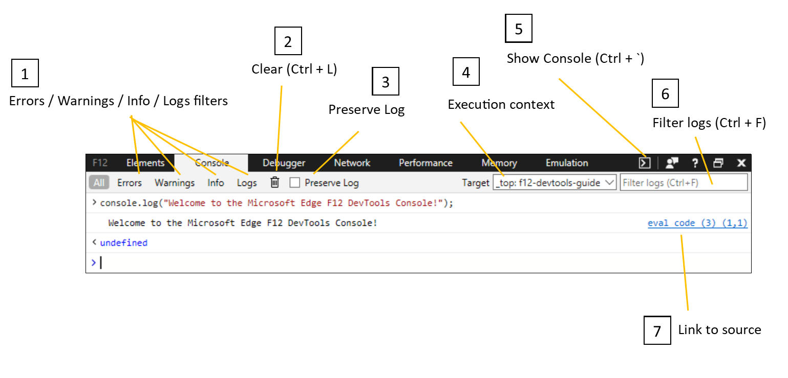

# コンソール

Microsoft Edge のコンソール開発者ツールは、JavaScript、ネットワーク要求、セキュリティ エラーなど、Web ページに関連付けられている情報をログに記録します。 コンソールを使用して、対話型デバッグとアドホック テストを実行できます。 

Microsoft Edge でコンソール ツールを開く場合は、F12 キーを押して開発者ツール ウィンドウにアクセスします (または、ページを右クリックして[ **要素**の検査] を選択します)。 次に、ウィンドウ **の** 上部にある [コンソール] タブを選択します。 

コンソール ツールを使用して、実行中の Web ページと通信することもできます。 コンソールを使用すると、次の機能を実行できます。

- コードの [実行中に、標準のエラー コード](./console/error-and-status-codes.md) と状態コード、および情報メッセージをポストします。
- コードに含めるコンソール [API 呼び出](./console/console-api.md) しからカスタム デバッグ ログを生成します。
- 主要な [変数と関数](./console/command-line.md) の現在の戻り値を検査するコマンド ラインと対話型のツリー ビューを提供します。

## 本体のパーツ

次の図は、コンソールの主要な部分を示しています。

1. **エラー**  / **警告**  / **情報**  / **ログ**ボタン: コンソール出力を指定された種類でフィルター処理します。 Ctrl キーを押しながらボタンを **複数選択できます** 。 [ **すべて] ボタン** は、すべてのフィルターをクリアします。

2. **[クリア**] ボタン (**Ctrl + L**): [クリア] ボタンは、現在のコンソール表示をクリアします。 ****

3. **[ログの**保持] チェック**** ボックス: [ログの保持] チェック ボックスをオンにすると、ページが更新され、DevTools を閉じて再度開く間、コンソール出力が保持されます。 本体の履歴は、タブが閉じている場合、または手動で本体をクリアした場合にのみ消去されます。

4. **ターゲット**: [ **ターゲット]** ドロップダウン メニューを使用して、ページ内や実行中の拡張機能など、別の実行コンテキスト `<iframe>` に切り替えます。 既定では、ページのトップ レベル フレームが選択されます。 選択したフレームにカーソルを合わせると、そのリソースの完全な URL を示すヒントが表示されます。

5. **コンソールの表示**  / **[コンソールの**非表示] ボタン (**Ctrl** ): コンソール パネルに加えて、[コンソールを非表示にする] ボタンを押すと、他の DevTools パネルの下部からコンソール +  **&grave;** ****  /  **を使用**できます。 DevTools がコンソール パネルを開いている場合、ボタンは効果がありません。
 
6. **フィルター ログ** (**Ctrl + F**) : 検索ボックスで特定のテキスト文字列を使用してログをフィルター処理することもできます。

7. **デバッガー**: 青色のソース リンクを選択して、DevTools デバッガーをその特定のコード行に開き、さらに詳しい検査を行います。

## ショートカット

操作                                            | ショートカット               
:-------------------------------------------------| :----------------------
コンソールにフォーカスがある DevTools を起動する             | **Ctrl**  + **Shift**  + **J** 
コンソールに切り替える                                 | **Ctrl**  + **2**           
別の DevTools タブで本体を表示/非表示にする       | ****  +  Ctrl **&grave;**(バック ティック)  
実行 (単一行コマンド)                     | **Enter**                
実行せずに行を折り返す (複数行のコマンド) | **Shift**  + **Enter キー**または**Ctrl キーを**  +  **押す**      
すべてのメッセージのコンソールをクリアする                 | **Ctrl**  + **L**           
フィルター ログ (フォーカスを検索ボックスに設定)             | **Ctrl**  + **F**           
オートコンプリート候補を受け入れる (フォーカスがある場合) | **Enter** キーまたは **Tab キー**       
前/次の自動完了候補          | **上方向キー** /**下方向キー**   
