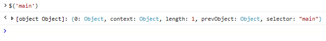
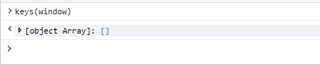
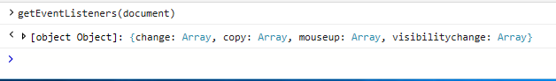

# コンソール コマンド ラインConsole command line

コンソール のコマンド ラインを使用して、ページ上の値を表示および変更し、デバッグ コードをオンザフライで実行します。同時に、自動コードVisual Studio IntelliSense利用できます。Use the Console command line to view and change values on a page and execute debug code on the fly, all while taking advantage of Visual Studio [*IntelliSense*](/visualstudio/ide/javascript-intellisense) auto code completion. 

コマンド ライン プロンプトで有効な JavaScript を入力し、押して `Enter` 実行します。Simply enter any valid JavaScript at the command line prompt and press `Enter` to execute. 複数行入力の場合は、 `Shift+Enter` 行間を追加するために使用します。For multi-line input use `Shift+Enter` to add a line-break. 現在の DevTools セッション中に入力した以前のコンソール コマンドを移動するには、方向キーと `Up` `Down` 方向キーを使用します。Use the `Up` and `Down` arrow keys to navigate through previous console commands you entered during the current  DevTools session. 標準の JavaScript とコンソール [API](./console-api.md)に加えて、コンソールは次のコマンドもサポートしています。In addition to standard JavaScript and the [Console API](./console-api.md), the Console also supports the following commands for:

 - [DOM オブジェクトの選択Selecting DOM objects](#dom-selectors)
 - [オブジェクト プロパティの検査Inspecting object properties](#object-inspection)
 - [特定のオブジェクトのすべてのイベント リスナーを検索するFinding all the event listeners on a given object](#event-listeners)

コマンド ラインに入力されたスクリプトは、ページがブレークポイントで一時停止されていない限り、現在選択されているウィンドウのグローバル スコープで実行されます。Script entered in the command line executes in the [global scope](/scripting/javascript/advanced/variable-scope-javascript) of the currently selected window, unless the page is paused at a breakpoint. ページが一時停止している間に入力されたコンソール コマンドは、呼び出し履歴内の現在の関数のローカル スコープで実行されます。Console commands entered while the page is paused will execute in the [local scope](/scripting/javascript/advanced/variable-scope-javascript) of the current function within the call stack.

コンソールには、コンソール **出力領域** の上にターゲット実行コンテキストドロップダウンがあります。The Console has a **Target** execution context drop-down just above the Console output area. 既定の選択範囲は、トップ レベルの文書 **_top。**The default selection is the top-level document, **_top**. ドキュメント内の iframe や実行中の拡張機能もオプションとして表示され、これらの範囲内でコマンドを別の方法で実行できます。Any iframes in the document or running extensions will also appear as options, allowing you to alternately run commands within those scopes.

## DOM セレクターDOM selectors
次のコンソール セレクターは、DOM 内のオブジェクトにすばやくアクセスする簡単な短い方法を提供します。These console selectors provide simple shorthands for quickly accessing objects within the DOM:

### $(*CSS セレクター文字列*)$(*CSS selector string*)
指定された [CSS](https://developer.mozilla.org/docs/Learn/CSS/Introduction_to_CSS/Selectors)  セレクター (またはセレクターのコンマ区切りグループ) 文字列に一致するドキュメント内の最初の要素を返します。Returns the first element within the document matching the specified [CSS selector](https://developer.mozilla.org/docs/Learn/CSS/Introduction_to_CSS/Selectors)  (or comma-separated group of selectors) string. [document.querySelector() の簡単な説明です](https://developer.mozilla.org/docs/Web/API/Document/querySelector)。Shorthand for [document.querySelector()](https://developer.mozilla.org/docs/Web/API/Document/querySelector).

例: コンソールを開き、このページ `$('#main')` で div オブジェクトを返 `id='main'` すコマンドを入力します。Example: Open the console and type `$('#main')` to return the div object with `id='main'` on this page.

### $$(*CSS セレクター文字列*)$$(*CSS selector string*)
指定された [CSS](https://developer.mozilla.org/docs/Learn/CSS/Introduction_to_CSS/Selectors)  セレクター (またはセレクターのコンマ区切りグループ) 文字列に一致するドキュメント内の要素の配列を返します。Returns an array of elements within the document matching the specified [CSS selector](https://developer.mozilla.org/docs/Learn/CSS/Introduction_to_CSS/Selectors)  (or comma-separated group of selectors) string. [document.querySelectorAll() の簡単な説明です](https://developer.mozilla.org/docs/Web/API/Document/querySelectorAll)。Shorthand for [document.querySelectorAll()](https://developer.mozilla.org/docs/Web/API/Document/querySelectorAll).

例: コンソールを開き、このページに含 `$$('.container')` まれるすべての div オブジェクトを返 `class='container'` す型を入力します。Example: Open the console and type `$$('.container')` to return all the div objects with `class='container'` on this page.

### $0、$1、$2,...$0, $1, $2,...
要素パネルで選択された最後の要素を返します。現在選択されている項目を表し、その前に選択された項目だったなど `$0` `$1` です。Returns the last elements selected in the [**Elements**](../elements.md) panel, where `$0` represents the currently selected item, `$1` was the selected item before that, and so on.

例: DevTools を **[要素**] タブで開き、Select 要素ツールを押してアクティブ化し、このページの一部の領域をマウス `CTRL + B` でクリックします。 Example: Open  DevTools to the **Elements** tab, press `CTRL + B` to activate the **Select element** tool and click some area on this page with your mouse. コンソールを開き、クリック `$0` した要素を入力して返します。Now open the Console and type `$0` to return the element you just clicked.

### $x(*XPath 式*)$x(*XPath expression*)
指定した XPath 式と一致する要素の [配列を返](https://developer.mozilla.org/docs/Introduction_to_using_XPath_in_JavaScript) します。Returns an array of elements matched by the specified [XPath](https://developer.mozilla.org/docs/Introduction_to_using_XPath_in_JavaScript) expression. 

例: コンソールを開き、属性を含むこのページのすべての要素を返 `$x('//script[@defer]')` `<script>` す型を入力 `defer` します。Example: Open the console and type `$x('//script[@defer]')` to return all the `<script>` elements on this page that contain a `defer` attribute.

## オブジェクト検査Object inspection

これらのコマンドは、オブジェクトのプロパティを簡単に検査する方法を提供します。These commands provide quick ways to inspect the properties of an object. 指定したオブジェクトは、デバッガーのグローバル名前空間または現在のスコープで定義する必要があります。The specified object must either be defined in the global namespace or the current scope of the debugger.

### dir(*object*)dir(*object*)
指定したオブジェクトのプロパティのツリー ビューリストを返します。Returns a tree view list of properties for the specified object.

例: コンソールを開き、入力して、このページを表すドキュメント オブジェクトの `dir(document)` オブジェクト プロパティを表示します。Example: Open the console and type `dir(document)` to see the object properties for the document object representing this page.

### keys(*object*)keys(*object*)
指定したオブジェクトに関連付けられたプロパティ名の配列を返します。Returns an array of property names attached to the specified object.

例: コンソールを開き、グローバル ウィンドウ オブジェクトで定義されているプロパティ `keys(window)` を返す型を入力します。Example: Open the console and type `keys(window)` to return all of the properties defined on the global window object.

### values(*object*)values(*object*)
指定したオブジェクトに関連付けられたプロパティ値の配列を返します。Returns an array of property values attached to the specified object.

例: コンソールを開いて入力し、グローバル ウィンドウ オブジェクトで定義されているプロパティ (キー) の値 `values(window)` を返します。Example: Open the console and type `values(window)` to return the values of all the properties (keys) defined on the global window object.

## イベント リスナーEvent listeners

このコマンドを使用すると、特定のオブジェクトに登録されているイベント リスナーを検査できます。This command allows you to inspect the event listeners registered to a given object. 指定したオブジェクトは、デバッガーのグローバル名前空間または現在のスコープで定義する必要があります。The specified object must either be defined in the global namespace or the current scope of the  debugger.

### getEventListeners(*object*)getEventListeners(*object*)
特定のオブジェクトに登録されている各イベントの種類のキーを含むオブジェクトを返します。Returns an object containing a key for each registered event type on the given object. 各キーの値は、イベント リスナーとその関連情報の配列です。The value of each key is an array of event listeners and their related info. 

例: コンソールを開き、入力して、このページのドキュメント オブジェクトに登録されているイベント リスナー `getEventListeners(document)` を表示します。Example: Open the console and type `getEventListeners(document)` to see all the event listeners registered on the document object of this page.

