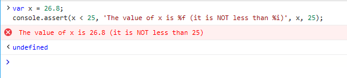
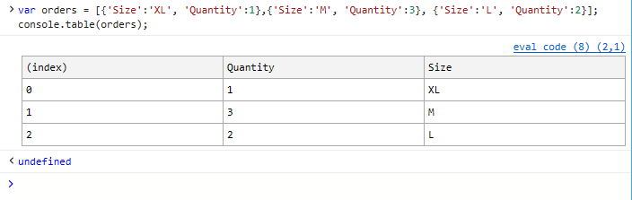

# <span data-ttu-id="e6fe7-104">コンソール API</span><span class="sxs-lookup"><span data-stu-id="e6fe7-104">Console API</span></span>

<span data-ttu-id="e6fe7-105">コンソール *API は* 、グローバル オブジェクトを介して DevTools コンソールへのコマンドラインおよびプログラムによるアクセスを提供し、次の操作 `console` を実行できます。</span><span class="sxs-lookup"><span data-stu-id="e6fe7-105">The *Console API* provides command-line and programmatic access to the  DevTools Console through the global `console` object, allowing you to:</span></span>

 - <span data-ttu-id="e6fe7-106">[コードからのカスタム メッセージ](#logging-custom-messages) をログに記録する</span><span class="sxs-lookup"><span data-stu-id="e6fe7-106">[Log custom messages](#logging-custom-messages) from you code</span></span>
 - <span data-ttu-id="e6fe7-107">[オブジェクトと要素を検査し](#inspecting-objects-and-elements) 、その情報を記録する</span><span class="sxs-lookup"><span data-stu-id="e6fe7-107">[Inspect objects and elements](#inspecting-objects-and-elements) and log their information</span></span>
 - <span data-ttu-id="e6fe7-108">[アサーション、タイマー、カウンターを](#testing-and-measuring) 設定してコードをテストおよび測定する</span><span class="sxs-lookup"><span data-stu-id="e6fe7-108">[Test and measure your code](#testing-and-measuring) by setting assertions, timers and counters</span></span>
 - <span data-ttu-id="e6fe7-109">[ヒープのスナップショットを作成して](#taking-heap-snapshots) 実行中のコードのメモリ消費量を評価し、メモリ リークを特定する</span><span class="sxs-lookup"><span data-stu-id="e6fe7-109">[Take snapshots of the heap](#taking-heap-snapshots) to assess the memory consumption of your running code and identify memory leaks</span></span>
 - <span data-ttu-id="e6fe7-110">[呼び出し履歴をトレース](#tracing-callstacks) して、コードの呼び出し先を把握する</span><span class="sxs-lookup"><span data-stu-id="e6fe7-110">[Trace your callstacks](#tracing-callstacks) to understand where your code is being called from</span></span> 
 - <span data-ttu-id="e6fe7-111">[ログ出力を整理して](#organizing-log-output) デバッグを効率化する</span><span class="sxs-lookup"><span data-stu-id="e6fe7-111">[Organize your log output](#organizing-log-output) to streamline your debugging</span></span>

<span data-ttu-id="e6fe7-112">Microsoft Edge で現在サポートされているコマンドと書式設定パラメーターを次に示します。</span><span class="sxs-lookup"><span data-stu-id="e6fe7-112">The following are the commands and formatting parameters currently supported by Microsoft Edge.</span></span> <span data-ttu-id="e6fe7-113">主要なブラウザーでも同様に動作します。</span><span class="sxs-lookup"><span data-stu-id="e6fe7-113">They work similarly on major browsers.</span></span>

## <span data-ttu-id="e6fe7-114">カスタム メッセージのログ記録</span><span class="sxs-lookup"><span data-stu-id="e6fe7-114">Logging custom messages</span></span>

<span data-ttu-id="e6fe7-115">コードは、次に示すいくつかの種類のカスタム メッセージをコンソールに送信できます。</span><span class="sxs-lookup"><span data-stu-id="e6fe7-115">Your code can send several types of custom messages to the console, including:</span></span>

<span data-ttu-id="e6fe7-116">メッセージの種類</span><span class="sxs-lookup"><span data-stu-id="e6fe7-116">Message type</span></span>  | &nbsp;   |
:------------------- | :------ |
<span data-ttu-id="e6fe7-117">[**error()**](https://developer.mozilla.org/docs/Web/API/Console/error) と [**exception()**](https://developer.mozilla.org/docs/Web/API/Console/error)</span><span class="sxs-lookup"><span data-stu-id="e6fe7-117">[**error()**](https://developer.mozilla.org/docs/Web/API/Console/error) and [**exception()**](https://developer.mozilla.org/docs/Web/API/Console/error)</span></span>| <span data-ttu-id="e6fe7-118">重大なエラーとエラー</span><span class="sxs-lookup"><span data-stu-id="e6fe7-118">Critical errors and failures</span></span>
[**<span data-ttu-id="e6fe7-119">warn()</span><span class="sxs-lookup"><span data-stu-id="e6fe7-119">warn()</span></span>**](https://developer.mozilla.org/docs/Web/API/Console/warn) | <span data-ttu-id="e6fe7-120">考えられるエラーまたは予期しない動作</span><span class="sxs-lookup"><span data-stu-id="e6fe7-120">Possible errors or unexpected behavior</span></span> 
[**<span data-ttu-id="e6fe7-121">info()</span><span class="sxs-lookup"><span data-stu-id="e6fe7-121">info()</span></span>**](https://developer.mozilla.org/docs/Web/API/Console/info) | <span data-ttu-id="e6fe7-122">有用だが重要ではない情報</span><span class="sxs-lookup"><span data-stu-id="e6fe7-122">Useful, but non-critical information</span></span>
<span data-ttu-id="e6fe7-123">[**log()**](https://developer.mozilla.org/docs/Web/API/Console/log) と [**debug()**](https://developer.mozilla.org/docs/Web/API/Console/log)</span><span class="sxs-lookup"><span data-stu-id="e6fe7-123">[**log()**](https://developer.mozilla.org/docs/Web/API/Console/log) and [**debug()**](https://developer.mozilla.org/docs/Web/API/Console/log)</span></span> | <span data-ttu-id="e6fe7-124">一般的なデバッグ (コンソールでシステム通知アイコンを生成しない)</span><span class="sxs-lookup"><span data-stu-id="e6fe7-124">General debugging (without generating a system alert icon in the console)</span></span>

   
<span data-ttu-id="e6fe7-125">コンソール パネルから Microsoft Edge から生成された他のメッセージと共に、これらをグループ化してフィルター処理できます。</span><span class="sxs-lookup"><span data-stu-id="e6fe7-125">You can group and filter these along with the other messages generated from Microsoft Edge from the  Console panel.</span></span> <span data-ttu-id="e6fe7-126">すべてのカスタム メッセージ メソッドには、文字列 (メッセージ) パラメーターとオプションの形式置換パラメーターが必要です。</span><span class="sxs-lookup"><span data-stu-id="e6fe7-126">All custom message methods require a string (message) parameter and optional format substitution parameters.</span></span> <span data-ttu-id="e6fe7-127">Microsoft Edge では、次の書式設定オプションがサポートされています。</span><span class="sxs-lookup"><span data-stu-id="e6fe7-127">Microsoft Edge supports the following formatting options:</span></span>

<span data-ttu-id="e6fe7-128">Format パラメーター</span><span class="sxs-lookup"><span data-stu-id="e6fe7-128">Format parameter</span></span> | &nbsp;
:------------------- | :--- |
**<span data-ttu-id="e6fe7-129">%b</span><span class="sxs-lookup"><span data-stu-id="e6fe7-129">%b</span></span>** | <span data-ttu-id="e6fe7-130">バイナリ</span><span class="sxs-lookup"><span data-stu-id="e6fe7-130">Binary</span></span>
**<span data-ttu-id="e6fe7-131">%c</span><span class="sxs-lookup"><span data-stu-id="e6fe7-131">%c</span></span>** | <span data-ttu-id="e6fe7-132">インライン CSS スタイル (下記の例を参照)</span><span class="sxs-lookup"><span data-stu-id="e6fe7-132">Inline CSS style (see example below)</span></span>
<span data-ttu-id="e6fe7-133">**%d** **、%i**</span><span class="sxs-lookup"><span data-stu-id="e6fe7-133">**%d**, **%i**</span></span> | <span data-ttu-id="e6fe7-134">Integer</span><span class="sxs-lookup"><span data-stu-id="e6fe7-134">Integer</span></span> 
**<span data-ttu-id="e6fe7-135">%f</span><span class="sxs-lookup"><span data-stu-id="e6fe7-135">%f</span></span>** | <span data-ttu-id="e6fe7-136">Float</span><span class="sxs-lookup"><span data-stu-id="e6fe7-136">Float</span></span>  
**<span data-ttu-id="e6fe7-137">%s</span><span class="sxs-lookup"><span data-stu-id="e6fe7-137">%s</span></span>** | <span data-ttu-id="e6fe7-138">String</span><span class="sxs-lookup"><span data-stu-id="e6fe7-138">String</span></span> 
**<span data-ttu-id="e6fe7-139">%x</span><span class="sxs-lookup"><span data-stu-id="e6fe7-139">%x</span></span>** | <span data-ttu-id="e6fe7-140">16 進数</span><span class="sxs-lookup"><span data-stu-id="e6fe7-140">Hexadecimal</span></span> 
**<span data-ttu-id="e6fe7-141">%e</span><span class="sxs-lookup"><span data-stu-id="e6fe7-141">%e</span></span>** | <span data-ttu-id="e6fe7-142">Exponent</span><span class="sxs-lookup"><span data-stu-id="e6fe7-142">Exponent</span></span> 

<span data-ttu-id="e6fe7-143">たとえば、ログ メッセージに文字列変数と整数変数を含める方法を次に示します。</span><span class="sxs-lookup"><span data-stu-id="e6fe7-143">For example, here's how you would include string and integer variables in your log message:</span></span>

```javascript
var myText = 'pieces';
var myVal = 5;
console.log("The number of %s is %d.", myText, myVal);
```

>`The number of pieces is 5.`

<span data-ttu-id="e6fe7-144">インライン CSS ( ) を使用してログ メッセージに緑色の強調表示効果を追加する方法を次に示します `%c` 。</span><span class="sxs-lookup"><span data-stu-id="e6fe7-144">And here's how you might add a green highlight effect to a log message with inline CSS (`%c`):</span></span>

```javascript
console.log("%cHighlight this log message in green", "background-color: #10ff00; text-transform: uppercase;");
```


## <span data-ttu-id="e6fe7-146">オブジェクトと要素の検査</span><span class="sxs-lookup"><span data-stu-id="e6fe7-146">Inspecting objects and elements</span></span>

<span data-ttu-id="e6fe7-147">検査可能なオブジェクトは、展開可能なノードを持つ折りたたみツリー ビューのコンソールに表示されます。</span><span class="sxs-lookup"><span data-stu-id="e6fe7-147">Inspectable objects appear in the console in a collapsed tree view with expandable nodes.</span></span> <span data-ttu-id="e6fe7-148">コンソールは、DOM ノード (div など) または JavaScript オブジェクト (イベントなど) を送信するかどうかを検出し、検出された型として自動的に表示します。</span><span class="sxs-lookup"><span data-stu-id="e6fe7-148">The console detects whether you are sending a DOM node (like a div) or a JavaScript object (like an event) and displays them as the detected type automatically.</span></span>

<span data-ttu-id="e6fe7-149">特定の出力を強制できます。</span><span class="sxs-lookup"><span data-stu-id="e6fe7-149">You can also force a specific output:</span></span>

<span data-ttu-id="e6fe7-150">コマンド</span><span class="sxs-lookup"><span data-stu-id="e6fe7-150">Command</span></span> | &nbsp;
:------------------- | :--- |
[**<span data-ttu-id="e6fe7-151">dir()</span><span class="sxs-lookup"><span data-stu-id="e6fe7-151">dir()</span></span>**](https://developer.mozilla.org/docs/Web/API/Console/dir) | <span data-ttu-id="e6fe7-152">検査可能な JavaScript オブジェクトとして表示</span><span class="sxs-lookup"><span data-stu-id="e6fe7-152">Displays as inspectable JavaScript object</span></span>
[**<span data-ttu-id="e6fe7-153">dirxml()</span><span class="sxs-lookup"><span data-stu-id="e6fe7-153">dirxml()</span></span>**](https://developer.mozilla.org/docs/Web/API/Console/dirxml) | <span data-ttu-id="e6fe7-154">検査可能な DOM ノードとして表示</span><span class="sxs-lookup"><span data-stu-id="e6fe7-154">Displays as inspectable DOM node</span></span>

<span data-ttu-id="e6fe7-155">たとえば、コンソールを開いて、このページの要素について次の `<div id='main'>` 出力を比較してみてください。</span><span class="sxs-lookup"><span data-stu-id="e6fe7-155">For example, try opening the console and compare the following outputs for the `<div id='main'>` element on this page:</span></span>

```javascript
console.dir(document.querySelector('#main'));
console.dirxml(document.querySelector('#main'));
```


### <span data-ttu-id="e6fe7-157">[要素] パネルで要素 **を選択** する</span><span class="sxs-lookup"><span data-stu-id="e6fe7-157">Selecting an element in the **Elements** panel</span></span>

<span data-ttu-id="e6fe7-158">ページの HTML ツリー コンテキスト内の要素をコンソールから直接選択して、すぐにレイアウトとスタイルをデバッグできます。</span><span class="sxs-lookup"><span data-stu-id="e6fe7-158">You can select an element within the HTML tree context of the page directly from the console for immediate layout and style debugging.</span></span>

<span data-ttu-id="e6fe7-159">コマンド</span><span class="sxs-lookup"><span data-stu-id="e6fe7-159">Command</span></span> | &nbsp;
:------------------- | :--- |
**<span data-ttu-id="e6fe7-160">select()</span><span class="sxs-lookup"><span data-stu-id="e6fe7-160">select()</span></span>** | <span data-ttu-id="e6fe7-161">要素パネルに **切り替** え、指定した要素にフォーカスを設定します。</span><span class="sxs-lookup"><span data-stu-id="e6fe7-161">Switches to the **Elements** panel and sets focus to the specified element.</span></span>

<span data-ttu-id="e6fe7-162">たとえば、このページでコンソールを開き、次のコマンドを入力します。</span><span class="sxs-lookup"><span data-stu-id="e6fe7-162">For example, if you open the console on this page and type:</span></span>

```javascript
console.select(document.querySelector("body"));
```

<span data-ttu-id="e6fe7-163">DevTools は、要素パネル(現在のパネルではない場合) に切り替わり[*、HTML*](../elements.md#html-tree-view)ツリー ビューで指定された要素にフォーカスを設定します。</span><span class="sxs-lookup"><span data-stu-id="e6fe7-163">The DevTools will switch to the **Elements** panel (if its not already the current) and set focus in the [*HTML tree view*](../elements.md#html-tree-view) to the specified element.</span></span>


## <span data-ttu-id="e6fe7-165">テストと測定</span><span class="sxs-lookup"><span data-stu-id="e6fe7-165">Testing and measuring</span></span>

### <span data-ttu-id="e6fe7-166">コードのテスト</span><span class="sxs-lookup"><span data-stu-id="e6fe7-166">Testing your code</span></span>

<span data-ttu-id="e6fe7-167">本体 API テスト アサーションをコードに追加して、コードをブラウザーで実行する場合の単体テストとデバッグを行います。</span><span class="sxs-lookup"><span data-stu-id="e6fe7-167">Add Console API test assertions to your code for unit testing and debugging your code as it runs in the browser.</span></span>

<span data-ttu-id="e6fe7-168">コマンド</span><span class="sxs-lookup"><span data-stu-id="e6fe7-168">Command</span></span> | &nbsp;
:------------ | :-------------
[**<span data-ttu-id="e6fe7-169">assert()</span><span class="sxs-lookup"><span data-stu-id="e6fe7-169">assert()</span></span>**](https://developer.mozilla.org/docs/Web/API/Console/assert) | <span data-ttu-id="e6fe7-170">指定された式が false と評価された場合、コンソール エラー メッセージをログに記録 *します*。</span><span class="sxs-lookup"><span data-stu-id="e6fe7-170">Logs a console error message if the provided expression evaluates to *false*.</span></span>

<span data-ttu-id="e6fe7-171">テスト可能なアサーションとして指定する論理式に加えて、他のカスタム コンソール メッセージと同様に、オプションのメッセージおよび書式設定パラメーター [を追加できます](#logging-custom-messages)。</span><span class="sxs-lookup"><span data-stu-id="e6fe7-171">In addition to the logical expression you supply as the testable assertion, you can add an optional message and formatting parameters as you would use with other [custom console messages](#logging-custom-messages).</span></span> <span data-ttu-id="e6fe7-172">次に、例を示します。</span><span class="sxs-lookup"><span data-stu-id="e6fe7-172">For example:</span></span>

```javascript
var x = 26.8;
console.assert(x < 25, 'The value of x is %f (it is NOT less than %i)', x, 25);
```



### <span data-ttu-id="e6fe7-174">コード内の実行をカウントする</span><span class="sxs-lookup"><span data-stu-id="e6fe7-174">Counting executions in your code</span></span>

<span data-ttu-id="e6fe7-175">コード内にカウンターを設定して、周囲のコードが実行された回数を追跡できます。</span><span class="sxs-lookup"><span data-stu-id="e6fe7-175">You can set counters in your code to keep track of how many times the surrounding code gets executed.</span></span> <span data-ttu-id="e6fe7-176">カウンターを設定すると、コードが期待通り実行され、パフォーマンスのボトルネックの診断に役立ちます。</span><span class="sxs-lookup"><span data-stu-id="e6fe7-176">Setting counters can help ensure your code is running as expected and assist you in diagnosing performance bottlenecks.</span></span>

<span data-ttu-id="e6fe7-177">コマンド</span><span class="sxs-lookup"><span data-stu-id="e6fe7-177">Command</span></span> | &nbsp;
:------------ | :-------------
[**<span data-ttu-id="e6fe7-178">count()</span><span class="sxs-lookup"><span data-stu-id="e6fe7-178">count()</span></span>**](https://developer.mozilla.org/docs/Web/API/Console/count) | <span data-ttu-id="e6fe7-179">指定されたラベルのカウント *()* が実行された回数を増分し、ログに記録します。</span><span class="sxs-lookup"><span data-stu-id="e6fe7-179">Increments and logs the number of times *count()* for the given label has been executed.</span></span>
[**<span data-ttu-id="e6fe7-180">countReset()</span><span class="sxs-lookup"><span data-stu-id="e6fe7-180">countReset()</span></span>**](https://developer.mozilla.org/docs/Web/API/Console/countReset) | <span data-ttu-id="e6fe7-181">指定したカウンター ラベルのカウントを 0 にリセットします。</span><span class="sxs-lookup"><span data-stu-id="e6fe7-181">Resets the count to zero for the given counter label.</span></span>

<span data-ttu-id="e6fe7-182">たとえば、コンソールで次の行を実行します。</span><span class="sxs-lookup"><span data-stu-id="e6fe7-182">For example, executing the following lines in console:</span></span>

```javascript
console.count('My Counter');
console.count('My Counter');
console.countReset('My Counter');
console.count('My Counter');
```

 <span data-ttu-id="e6fe7-183">.</span><span class="sxs-lookup"><span data-stu-id="e6fe7-183">.</span></span> <span data-ttu-id="e6fe7-184">.</span><span class="sxs-lookup"><span data-stu-id="e6fe7-184">.</span></span> <span data-ttu-id="e6fe7-185">.</span><span class="sxs-lookup"><span data-stu-id="e6fe7-185">.</span></span> <span data-ttu-id="e6fe7-186">結果は次の結果になります。</span><span class="sxs-lookup"><span data-stu-id="e6fe7-186">will result in:</span></span>
> <span data-ttu-id="e6fe7-187">マイ カウンター: 1</span><span class="sxs-lookup"><span data-stu-id="e6fe7-187">My Counter: 1</span></span>

### <span data-ttu-id="e6fe7-188">コードのタイミングを設定する</span><span class="sxs-lookup"><span data-stu-id="e6fe7-188">Timing your code</span></span>

<span data-ttu-id="e6fe7-189">ラベル付きタイマーを使ってコードをインストルメント化し、特定の操作を完了するのにかかる時間を測定します。</span><span class="sxs-lookup"><span data-stu-id="e6fe7-189">Instrument your code with labeled timers to measure how long it takes to complete a given operation.</span></span>

<span data-ttu-id="e6fe7-190">コマンド</span><span class="sxs-lookup"><span data-stu-id="e6fe7-190">Command</span></span> | &nbsp;
:------------ | :-------------
[**<span data-ttu-id="e6fe7-191">time()</span><span class="sxs-lookup"><span data-stu-id="e6fe7-191">time()</span></span>**](https://developer.mozilla.org/docs/Web/API/Console/time) | <span data-ttu-id="e6fe7-192">指定されたラベルでタイマーを開始します。</span><span class="sxs-lookup"><span data-stu-id="e6fe7-192">Starts a timer with the given label.</span></span>
[**<span data-ttu-id="e6fe7-193">timeEnd()</span><span class="sxs-lookup"><span data-stu-id="e6fe7-193">timeEnd()</span></span>**](https://developer.mozilla.org/docs/Web/API/Console/timeEnd) | <span data-ttu-id="e6fe7-194">指定されたラベルでタイマーを終了し、経過時間 (ミリ秒) を報告します。</span><span class="sxs-lookup"><span data-stu-id="e6fe7-194">Ends the timer with the given label and reports the time elapsed (in milliseconds).</span></span>
[**<span data-ttu-id="e6fe7-195">timeStamp()</span><span class="sxs-lookup"><span data-stu-id="e6fe7-195">timeStamp()</span></span>**](https://developer.mozilla.org/docs/Web/API/Console/timeStamp) | <span data-ttu-id="e6fe7-196">現在のシステム時間をミリ秒単位で報告します。</span><span class="sxs-lookup"><span data-stu-id="e6fe7-196">Reports the current system time (in milliseconds).</span></span>

<span data-ttu-id="e6fe7-197">たとえば、コンソールで次の行を実行してみてください。</span><span class="sxs-lookup"><span data-stu-id="e6fe7-197">For example, try executing the following lines in console:</span></span>

```javascript
console.time('My Timer');
console.timeEnd('My Timer');
```

### <span data-ttu-id="e6fe7-198">ヒープ スナップショットの取得</span><span class="sxs-lookup"><span data-stu-id="e6fe7-198">Taking heap snapshots</span></span>

<span data-ttu-id="e6fe7-199">ヒープのスナップショットを作成して、実行中のコードのメモリ消費量を評価し、メモリ リークを特定します。</span><span class="sxs-lookup"><span data-stu-id="e6fe7-199">Take snapshots of the heap to assess the memory consumption of your running code and identify memory leaks.</span></span>

<span data-ttu-id="e6fe7-200">コマンド</span><span class="sxs-lookup"><span data-stu-id="e6fe7-200">Command</span></span> | &nbsp;
:------------ | :-------------
**<span data-ttu-id="e6fe7-201">takeHeapSnapshot()</span><span class="sxs-lookup"><span data-stu-id="e6fe7-201">takeHeapSnapshot()</span></span>** | <span data-ttu-id="e6fe7-202">現在の JavaScript ヒープとその割り当てられたオブジェクトに関する詳細をキャプチャします。</span><span class="sxs-lookup"><span data-stu-id="e6fe7-202">Captures details about the current JavaScript heap and its allocated objects.</span></span>

<span data-ttu-id="e6fe7-203">ヒープ スナップショットを取得 [するには、DevTools](../memory.md#toolbar) メモリ プロファイラーが実行されている必要があります。</span><span class="sxs-lookup"><span data-stu-id="e6fe7-203">The  DevTools [memory profiler](../memory.md#toolbar) must be running in order to take heap snapshots.</span></span> <span data-ttu-id="e6fe7-204">各スナップショットは、メモリ パネルの [*[Snapshot]*](../memory.md#snapshot-summary) (スナップショット) の概要にタイルとして表示され、 [**さらに詳しい**](../memory.md) 調査が行えます。</span><span class="sxs-lookup"><span data-stu-id="e6fe7-204">Each snapshot will appear as a tile in the [*Snapshot summary*](../memory.md#snapshot-summary) of the [**Memory**](../memory.md) panel for further inspection.</span></span>

## <span data-ttu-id="e6fe7-205">呼び出し履歴のトレース</span><span class="sxs-lookup"><span data-stu-id="e6fe7-205">Tracing callstacks</span></span>

<span data-ttu-id="e6fe7-206">コードの呼び出しの場所、実行されているコード、および実行にかかる時間を把握すると、速度の低下や予期しない動作の分析に役立ちます。</span><span class="sxs-lookup"><span data-stu-id="e6fe7-206">Understanding where your code is being called from, what code is running, and how long that execution takes can be useful in analyzing slowness or unexpected behavior.</span></span> <span data-ttu-id="e6fe7-207">スタック トレースは、トレース要求からパスの上方向に向かって、コードが到達するためにかかった実行パスを示します。</span><span class="sxs-lookup"><span data-stu-id="e6fe7-207">A stack trace shows you the execution path your code took to reach it, from the trace request upward through the path.</span></span> 

<span data-ttu-id="e6fe7-208">コマンド</span><span class="sxs-lookup"><span data-stu-id="e6fe7-208">Command</span></span> | &nbsp;
:------------ | :-------------
[**<span data-ttu-id="e6fe7-209">trace()</span><span class="sxs-lookup"><span data-stu-id="e6fe7-209">trace()</span></span>**](https://developer.mozilla.org/docs/Web/API/Console/trace) | <span data-ttu-id="e6fe7-210">現在のスクリプト実行コールスタックのトレースを出力します。</span><span class="sxs-lookup"><span data-stu-id="e6fe7-210">Outputs a trace of the current script execution callstack.</span></span>

<span data-ttu-id="e6fe7-211">たとえば、コンソールで次のコードを実行します。</span><span class="sxs-lookup"><span data-stu-id="e6fe7-211">For example, running the following code in the console:</span></span>

```javascript
function a(){
  c();
}
function b(){
  c();
}
function c(){
  console.trace()
}
function d(){
  b();
}

a();
d();
```

<span data-ttu-id="e6fe7-212">.</span><span class="sxs-lookup"><span data-stu-id="e6fe7-212">.</span></span> <span data-ttu-id="e6fe7-213">.</span><span class="sxs-lookup"><span data-stu-id="e6fe7-213">.</span></span> <span data-ttu-id="e6fe7-214">.</span><span class="sxs-lookup"><span data-stu-id="e6fe7-214">.</span></span> <span data-ttu-id="e6fe7-215">は、次のスタック トレースを出力します。</span><span class="sxs-lookup"><span data-stu-id="e6fe7-215">will output the following stack traces:</span></span>
> <span data-ttu-id="e6fe7-216">console.trace() at c (eval code:8:3) at a (eval code:2:3) at eval code (eval code:14:1)</span><span class="sxs-lookup"><span data-stu-id="e6fe7-216">console.trace() at c (eval code:8:3) at a (eval code:2:3) at eval code (eval code:14:1)</span></span>
> 
> <span data-ttu-id="e6fe7-217">console.trace() at c (eval code:8:3) at b (eval code:5:3) at d (eval code:11:3) at eval code (eval code:15:1)</span><span class="sxs-lookup"><span data-stu-id="e6fe7-217">console.trace() at c (eval code:8:3) at b (eval code:5:3) at d (eval code:11:3) at eval code (eval code:15:1)</span></span>

## <span data-ttu-id="e6fe7-218">ログ出力を整理する</span><span class="sxs-lookup"><span data-stu-id="e6fe7-218">Organizing log output</span></span>

<span data-ttu-id="e6fe7-219">以前のすべてのコンソール出力をクリアするには *、console.clear() (または) を* 使用します `CTRL + L` 。</span><span class="sxs-lookup"><span data-stu-id="e6fe7-219">To simply clear all previous console output, use *console.clear()* (or `CTRL + L`).</span></span> <span data-ttu-id="e6fe7-220">これにより、コンソール コマンド履歴のバックスタックはクリアされません (上方向キーと下方向キーを使用してスキャンできます)。</span><span class="sxs-lookup"><span data-stu-id="e6fe7-220">This does not clear the backstack of your console command history (you can still traverse it with the up and down arrow keys).</span></span>

<span data-ttu-id="e6fe7-221">コマンド</span><span class="sxs-lookup"><span data-stu-id="e6fe7-221">Command</span></span> | &nbsp;
:------------ | :-------------
[**<span data-ttu-id="e6fe7-222">clear()</span><span class="sxs-lookup"><span data-stu-id="e6fe7-222">clear()</span></span>**](https://developer.mozilla.org/docs/Web/API/Console/clear) | <span data-ttu-id="e6fe7-223">以前のすべてのコンソール出力をクリアします。</span><span class="sxs-lookup"><span data-stu-id="e6fe7-223">Clears all previous console output.</span></span>

<span data-ttu-id="e6fe7-224">コードで多くのコンソール メッセージを出力する場合は、次のコマンドを使用して、入れ子になったブロックに視覚的に整理できます。</span><span class="sxs-lookup"><span data-stu-id="e6fe7-224">If your code outputs a lot of console messages, you can visually organize them into nested blocks with the following commands:</span></span>

 <span data-ttu-id="e6fe7-225">コマンド</span><span class="sxs-lookup"><span data-stu-id="e6fe7-225">Command</span></span> | &nbsp;
:------------ | :-------------
[**<span data-ttu-id="e6fe7-226">group()</span><span class="sxs-lookup"><span data-stu-id="e6fe7-226">group()</span></span>**](https://developer.mozilla.org/docs/Web/API/Console/group) | <span data-ttu-id="e6fe7-227">指定された (オプションの) ラベルを使用して、コンソール出力の新しいレベルの入れ子を開始します。</span><span class="sxs-lookup"><span data-stu-id="e6fe7-227">Starts a new level of nesting for console output with the specified (optional) label.</span></span>
[**<span data-ttu-id="e6fe7-228">groupCollapsed()</span><span class="sxs-lookup"><span data-stu-id="e6fe7-228">groupCollapsed()</span></span>**](https://developer.mozilla.org/docs/Web/API/Console/groupCollapsed) | <span data-ttu-id="e6fe7-229">指定された (オプション) ラベルを使用してコンソール出力の新しいレベルの入れ子を開始しますが、グループ化コントロールは既定で折りたたみ、(矢印コントロールをクリックして) 展開して子出力を表示する必要があります。</span><span class="sxs-lookup"><span data-stu-id="e6fe7-229">Starts a new level of nesting for console output with the specified (optional) label, however the grouping control is collapsed by default and must be expanded (by clicking on the arrow control) to display the child output.</span></span>
[**<span data-ttu-id="e6fe7-230">groupEnd()</span><span class="sxs-lookup"><span data-stu-id="e6fe7-230">groupEnd()</span></span>**](https://developer.mozilla.org/docs/Web/API/Console/groupEnd) | <span data-ttu-id="e6fe7-231">指定したラベルのネスト グループを終了します。</span><span class="sxs-lookup"><span data-stu-id="e6fe7-231">Ends the nesting group for the specified label.</span></span>

<span data-ttu-id="e6fe7-232">たとえば、コンソールに次のコマンドを入力してみてください。</span><span class="sxs-lookup"><span data-stu-id="e6fe7-232">For example, try entering the following commands in the console:</span></span>

```javascript
console.groupCollapsed('Group 1');
console.log('In Group 1');
console.groupCollapsed('Group 1.1');
console.log('In Group 1.1');
console.groupEnd('Group 1.1');
console.groupEnd('Group 1');
console.log('No longer in a group');
```

<span data-ttu-id="e6fe7-233">.</span><span class="sxs-lookup"><span data-stu-id="e6fe7-233">.</span></span> <span data-ttu-id="e6fe7-234">.</span><span class="sxs-lookup"><span data-stu-id="e6fe7-234">.</span></span> <span data-ttu-id="e6fe7-235">.</span><span class="sxs-lookup"><span data-stu-id="e6fe7-235">.</span></span> <span data-ttu-id="e6fe7-236">次に、 *グループ 1* とグループ *1.1* のコントロールを展開して、ログ コメントがどのように入れ子になっているか確認します。</span><span class="sxs-lookup"><span data-stu-id="e6fe7-236">and then expand the *Group 1* and *Group 1.1* controls to see how the log comments are nested:</span></span>


<span data-ttu-id="e6fe7-238">場合によっては、フラットリストではなく、表形式で JavaScript オブジェクトまたは配列を視覚化する方が簡単な場合があります。</span><span class="sxs-lookup"><span data-stu-id="e6fe7-238">Sometimes its easier to visualize a JavaScript object or array in tabular form, rather than a flat list.</span></span> <span data-ttu-id="e6fe7-239">このためには *、console.table() コマンドを使用* できます。</span><span class="sxs-lookup"><span data-stu-id="e6fe7-239">For that, you can use the *console.table()* command:</span></span>

<span data-ttu-id="e6fe7-240">コマンド</span><span class="sxs-lookup"><span data-stu-id="e6fe7-240">Command</span></span> | &nbsp;
:------------ | :-------------
[**<span data-ttu-id="e6fe7-241">table()</span><span class="sxs-lookup"><span data-stu-id="e6fe7-241">table()</span></span>**](https://developer.mozilla.org/docs/Web/API/Console/table) | <span data-ttu-id="e6fe7-242">指定された配列またはオブジェクトを表形式でコンソールに出力します。</span><span class="sxs-lookup"><span data-stu-id="e6fe7-242">Outputs the supplied array or object to the console in tabular form.</span></span>

<span data-ttu-id="e6fe7-243">たとえば、次のオブジェクト配列です。</span><span class="sxs-lookup"><span data-stu-id="e6fe7-243">For example, the following object array:</span></span>

```javascript
var orders = [{'Size':'XL', 'Quantity':1},{'Size':'M', 'Quantity':3}, {'Size':'L', 'Quantity':2}];
console.table(orders);
```

<span data-ttu-id="e6fe7-244">.</span><span class="sxs-lookup"><span data-stu-id="e6fe7-244">.</span></span> <span data-ttu-id="e6fe7-245">.</span><span class="sxs-lookup"><span data-stu-id="e6fe7-245">.</span></span> <span data-ttu-id="e6fe7-246">.</span><span class="sxs-lookup"><span data-stu-id="e6fe7-246">.</span></span> <span data-ttu-id="e6fe7-247">コンソールで次の表としてレンダリングされます。</span><span class="sxs-lookup"><span data-stu-id="e6fe7-247">will render as this table in the console:</span></span>


