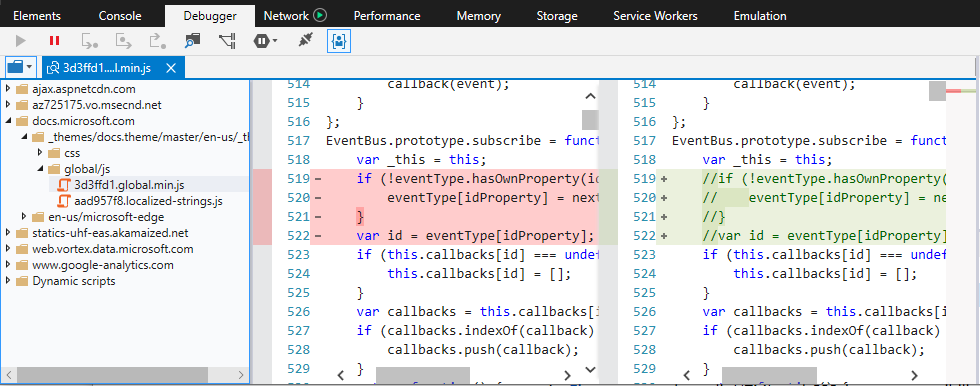
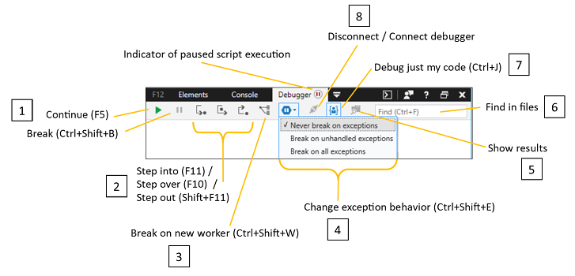

# デバッガー - DevTools (EdgeHTML)

デバッガーを **使って** 、コードのステップ実行、ウォッチとブレークポイントの設定、コードのライブ 編集、キャッシュの検査を行います。 次の方法でコードをテストおよびトラブルシューティングします。

- [読み込](#resource-picker)[まれたソース ファイル](#file-search)からのコードの参照と検索
- [コードをステップ実行する場合](#toolbar) の実行フローの制御
- [サービス ワーカーとキャッシュ、Cookie、Web](./storage.md#cache-manager)ストレージなど、ページ ストレージ[リソース](./storage.md#cookies-list)[の管理](./storage.md#local-and-session-storage-managers)[](./service-workers.md)  
- [ブレークポイントを設定し、コードの実行](#debug-window) に合ったライブ編集を行う
- [デバッグ時のローカル変数の追跡](#watches) と編集
- [必要に応じて、呼び出し履歴](#call-stack) の非同期コードとライブラリ コードを非表示または表示する
- [XmlHttpRequests、](#breakpoints) イベント、DOM の変更に特化 [したブレークポイントを追加する](#dom-breakpoints)


デバッグ セッションを開始するには、3 つの方法があります。

1. **ブレークポイントを設定します。** コードの実行が到達すると、デバッガーを入力し、コードをステップ実行できます。
2. **コードのブレークを開始します。** Click the [**Break**](#toolbar) *(pause* icon) toolbar button or `Ctrl+Shift+B` . デバッガーは、次の実行ステートメントでブレークします。
3. **例外の動作を設定します。** コードで [**例外がスロー**](#toolbar) された場合にデバッガーに割り込むには、[例外動作の変更] メニュー ( `Ctrl+Shift+E` ) を使用します。 既定では、デバッガーは例外でブレーク** しないに設定されますが、コンソールに記録されます。

## リソースピッカー

多くの場合、デバッグの最初の手順は、トラブルシューティングを行うコードにブレークポイントを設定します。 ページによって現在読み込まれているすべてのコード ファイルは、.html、.css、.js ファイルなど、[リソースの選択] ウィンドウ*から検索*できます。 ** **

 ファイル エントリをクリックすると、そのファイルのタブが [[デバッグ](#debug-window) ] ウィンドウに開き、ファイル名のテキストが太字で表示されます *(devtools ガイド* のファイル名は上記の図を参照)。 その後、[デバッグ] ウィンドウからそのファイル内にブレークポイントを [設定できます](#debug-window)。


リソース*ピッカー*のコンテキスト メニューから、ファイルをライブラリ コード **(** ) としてマークすることもできます。デバッガーでこのコードをスキップして、[呼び出し履歴] ウィンドウで非表示にすることもできます `Ctrl+L` [](#debug-window)。 [ **** ](#call-stack) (または) を再びクリックすると、ファイルをコードまたはライブラリ コードとして以前の値 `Ctrl+L` *に**戻します*。

### ファイル検索

ソースで*検索しようとしている*特定のコード文字列がある場合は、[ファイル内の検索] コマンド ( `Ctrl` + `Shift` + `F` ) を使用します。 ツール バーには、正規表現を含むさまざまな検索オプションがあります。 検索結果をクリックすると、指定したファイルと行 *に* [デバッグ] ウィンドウがフォーカスされます。


## [デバッグ] ウィンドウ

[ *デバッグ] ウィンドウ* では、ブレークポイントの設定、コードのステップ実行、デバッグ時のスクリプトのライブ 編集を行います。 任意のスクリプト コマンドの左側をクリックして、ブレークポイントを追加 (または削除) **します**。 右クリックのコンテキスト メニューまたは [[**ブレークポイント**](#breakpoints)]** ウィンドウを使用して、デバッガーが*True*と評価された場合にデバッガーがブレークする論理式を指定して、ブレークポイントに条件を追加します。


デバッグ ウィンドウのその他の機能には、次のコントロールがあります。

### 1. コード編集

デバッグ セッション中に JavaScript ライブを編集できます。 変更を行った後、[保存 ( ) ] をクリックして、コードのそのセクションが次に実行される時 <strong> </strong> に変更 `Ctrl+S` をテストします。 保存されていないコード変更がある場合は、[デバッグ] ウィンドウタブのファイル名の前にアスタリスク (\*) *が表示* されます。

[元 **のドキュメントと比較] ボタン** をクリックして、変更した変更の違いを表示します。



次の制約に注意してください。

- スクリプトの編集は、外部 *の .js ファイル* でのみ機能します (.html に `<script>` 埋め込 *まれているのではなく*)
- 編集内容はメモリに保存され、ドキュメントが再読み込みされた場合にフラッシュされます。そのため、ハンドラー内で編集を実行できません。たとえば、 `DOMContentLoaded`
- 現在、DevTools からディスクに編集**** 内容を保存する方法 ([名前を付けて保存] オプションなど) はありません。

### 2. コードの書式設定

以下のコントロールを使用して、デバッグ時に読みやすさを向上するために、コードの形式を変更します。

#### Pretty print ( `Ctrl+Shift+P` ) 
JavaScript の規則に従って改行と中かっこの配置を追加します。 このオプションで読み取りが可能な圧縮コードでも、元のソース コードとは大きな違いがある関数名、セレクター名、変数名を持つ場合があります。 このような場合は、[ソース マップの [*切り替え*](#source-maps) ] オプションを使用できます。

#### Word の折り返し ( `Alt+W` )
デバッグ ウィンドウの現在の余白に収まるコードを調整します (水平方向のスクロールは不要です)。

### 3. コードのスコープ

[ライブラリ コード ( ) としてマーク****] ボタンを使用して、特定のファイルを無視するようにデバッガー `Ctrl+L` に指示できます。 既定では、[デバッグ[****](#toolbar)] ツール バー ボタンがオンになっています。つまり、デバッガーはライブラリ コードとしてマークしたファイル** をスキップし、デバッガー呼び出しスタックに表示[されません](#call-stack)。 ボタン ([**コードとしてマーク])** を押すと `Ctrl+L` 、このフラグが削除されます。

デバッグ セッション全体でライブラリを追跡するには、これらのファイルを編集して既定のリストを維持するか、ドメインまたはファイルの種類に対するワイルドカードを追加します。

```JavaScript
%APPDATA%\..\LocalLow\Microsoft\F12\header\MyCode.json and %APPDATA%\..\Local\Microsoft\F12\header\MyCode.json
```

#### ソース マップ

JavaScript または**** CSS にコンパイルされ、ソース マップ *(元*のソースへの中間ファイル マッピング) を提供する言語で記述されたコードに対して、[ソース マップの切り替え] ボタンが有効になります。 このオプションは、デバッグに使用する元のソース (ブラウザーで実際に実行されているコンパイル済みファイルではなく)** をデバッガーに表示します。

DevTools は、JavaScript ファイルを生成したコンパイラに、マップ ファイルの名前のコメントが含まれているか確認します。 たとえば、コンパイラが *myfile.js* から *myfile.min.js*に圧縮されている場合は、次のようなマップ ファイル *myfile.min.js.map* を生成し、圧縮ファイルにコメントを含めることができるようになりました。

```JavaScript
//# sourceMappingURL=myfile.min.js.map
```

![[デバッグ ファイル] タブのショートカット メニュー](./media/debug_file_contextmenu.png)

DevTools がマップを自動的に見つからない場合は、そのファイルのソース マップを選択できます。 ファイルのタブを右クリックして、[ソース マップの選択 **] オプションを探** します。 

## ツール バー

デバッガーツール バー *を使用* して、コードのステップ実行方法と、ステップ実行または無視するコードを制御します。 ここから、コード ファイル全体で特定の文字列を検索するフルテキスト検索を実行することもできます。



### 1. 続行 ( `F5` ) / ブレーク ( `Ctrl+Shift+B` )
 **Continue** ( `F5` ) は、コードの実行を次のブレークポイントまで続行します。 押し続 `F5` けすると、解放されるまで、過去の区切りが繰り返し移動します。 

 **Break** ( `Ctrl+Shift+B` ) は、次のステートメントの実行後にデバッガーに割り込みます。

### 2. ステップ関数 ( `F11` , `Ctrl+F10` , `Shift+F11` )
 **呼び出** される `F11` 関数に () ステップ 実行します。 

 **呼び** 出される `Ctrl+F10` 関数をステップ オーバー () します。 

 **ステップ アウト** ( `Shift+F11` ) は、現在の関数から呼び出し元の関数にステップ アウトします。 

 デバッガーは、これらのコマンドが使用されている場合に関数に含されていない場合は、次のステートメントにステップ実行します。

### 3. 新しいワーカーを壊す ( `Ctrl+Shift+W` )
 新しい Web ワーカーの作成を [行います](https://developer.mozilla.org/docs/Web/API/Web_Workers_API/Using_web_workers)。

### 4. 例外コントロール
**例外の動作** を変更する ( `Ctrl+Shift+E` ) オプションを開き、デバッガーが例外に対応する方法を変更します。 既定では、デバッガーによって例外が無視され、コンソールに記録 [**されます**](./console.md)。 すべての例外に対して *Break*を実行するか、コード内のステートメントによって処理されない例外 (未処理の例外でブレーク) を `try...catch` *選択できます*。

### 5. 検索結果を表示する
(現在無効になっています。) **結果の表示/非表示を切** り替えるには、ファイルの [*検索結果で検索の表示を*](#6-find-in-files-ctrlf) 切り替える。

### 6. ファイル内の検索 ( `Ctrl+F` )
 **Find in files** ( `Ctrl+F` ) runs a text search through all the loaded files within the Resource [*picker*](#resource-picker). テキストが見つかった場合は、検索文字列に一致する最初のファイルが開きます。 次 `Enter` のマッチ `F3` に移動するか押します。

### 7. 自分のコード ( ) をデバッグする `Ctrl+J`
 **デバッグ専用のコード**( ) は、デバッガーをステップ実行する間にライブラリ コードとしてマークされているファイルを含めるか除外するかの切り `Ctrl+J` 替えとして機能します。 [](#3-code-scoping)

### 8. デバッガー接続
**切断/接続デバッガーは** 、基本的にデバッガーのオン/オフ スイッチです。

## ウォッチ

ウォッチ ウィンドウを **使用** して、デバッガーの現在のブレークのフォーカスであるステートメントで使用できる、ローカル スコープとグローバル スコープの両方のすべてのオブジェクトと変数 (**ローカル**) のカタログを参照します。

![[ウォッチ] ウィンドウ](./media/debugger_watches.png)

特定の変数の値をスコープ外に渡す場合は、ウォッチ **(** ウォッチの追加 , ) を追加し、編集可能な値を変更するには、変数をダブルクリックするか、コンテキスト メニューから [値の編集] を選択します。 `Ctrl+W` **** ** Delete ( ) / **Delete** all buttons or from the context menu を使ってウォッチ `Ctrl+D` をクリアします。 **** 

## 詳細

[*詳細]* ウィンドウには、[[**コールスタック] タブ、[ブレークポイント**](#call-stack)[**] タブ、[DOM**](#breakpoints) [**ブレークポイント] タブがあります**](#dom-breakpoints)。

### コール スタック

[ **呼び出し履歴** ] タブには、現在の実行ポイントに導いた関数のチェーンが表示されます。 現在の関数は一番上に表示され、呼び出し元の関数は逆の順序でその下に表示されます。


[ **ライブラリ フレームの表示/非表示]** ボタン ( ) は、呼び出し履歴からライブラリ コードの `Ctrl+Shift+J` [出力を](#3-code-scoping) 切り替えます。 右クリック**のコンテキスト メニュー**の [ライブラリ コード] オプション ( ) を使用して、選択したフレームのソースをライブラリ コードとしてマーク (またはマーク解除 `Ctrl+L` )** します。 

非同期 **関数呼び出しのルート** の表示を切り替えるには、[非同期フレームの表示/非表示] ボタンを使用します。

### ブレークポイント

[ **ブレークポイント]** タブでは、ブレークポイントとイベント トレースポイント (条件の設定、無効化、削除など) を管理できます。

![[ブレークポイント] タブ](./media/debugger_breakpoints.png)

デバッグに使用できるさまざまな種類のブレークポイントの概要を次に示します。

ブレークポイントの種類 | 説明 | 設定方法
:------------ | :------------ | :--------
**ブレークポイント** | 指定したコード行が実行される直前にデバッガーに割り込みます。 1 行に 1 つのステートメントがある場合は、通常のブレークポイントを設定するのが最も簡単です。 | [ [デバッグ] ウィンドウで](#debug-window)、コード内の任意の行番号の横にある左余白をクリックします。 赤いドットが表示され、ブレークポイントが設定されます。 ブレークポイントのソースにジャンプするには、その青いテキストをクリックします。
**条件付きブレークポイント** | 指定した条件が true と評価された場合に区切 *りを返します*。 これは、基本的に `if(condition)`  デバッガーを分割する場合の 1 つの方法です。  | [ブレークポイント[](#breakpoints)] タブで、既存のブレークポイントをポイントし、[鉛筆] ボタン *(この*ブレークポイントに条件を追加) をクリックし、既存のブレークポイントを右クリックし、コンテキスト メニューから [**条件**] を選択します。 ブレークポイントの場所で評価する "if" 条件を指定します。 
**XMLHttpRequest ブレークポイント** (オプションの条件) | XMLHttpRequest (XHR) 要求が満たされるたびに、このイベントが発生します。 [ウォッチ] ウィンドウから XHR `response` オブジェクト [**を検査**](#watches) できます。 | [[ブレークポイント] タブで](#breakpoints)*、[XMLHttpRequest*ブレークポイント] ボタン (上矢印/下矢印付きの円) をクリックします。 上記のように、 *条件付きブレークポイント* に変換できます。
**イベント トレースポイント** | 特定 [`console.log()`](./console/console-api.md#logging-custom-messages) のイベントへの応答として、指定された文字列を使用して呼び出します。 これは、イベント ハンドラー コードに直接保存しない一時的なコンソール ログ ステートメントに使用します。 | [ [ブレークポイント] タブで](#breakpoints) 、[ *イベント* トレースポイント] ボタン (稲妻付きひし形) をクリックします。 トリガーの **イベントの** 種類とログ記録用 **の Trace** ステートメントを選択します。
**イベントのブレークポイント** (オプションの条件) | 指定したイベントが発生するたびに発生します。 | [ブレークポイント[] タブで](#breakpoints)、[イベント** のブレークポイント] ボタン (稲妻付き円) をクリックします。 トリガーの **イベントの** 種類を選択し、必要に応じて Condition ステートメントを **指定** します。 
**DOM ブレークポイント** | サブツリーが変更された場合、その属性が変更された場合、DOM からデタッチされた場合など、ページ上の指定した要素が変更されるたびに、区切ります。 | [ [要素] タブ](./elements/dom-breakpoints.md) で、ソース要素を右クリックし *、[DOM ブレークポイント] オプションから選択* します。 ブレークポイントを[**管理するには、**](#dom-breakpoints)デバッガー パネルまたは***要素*パネルの [DOM ブレークポイント] タブを使用します。 

条件付きブレークポイントとトレースポイントは、デバッガーに割り込むときに、現在スコープ内のすべてのローカル変数とグローバル変数にアクセスできます。

### DOM ブレークポイント

DOM のブレークポイントの無効化、削除、再バインドなど **、DOM** のブレークポイント タブからブレークポイントを管理します。  [DOM のブレークポイントは、[要素](./elements/dom-breakpoints.md) ] パネルの *HTML* ツリー ビューから **設定** できます。

![[DOM ブレークポイント] タブ](./media/debugger_dom_breakpoints.png)

デバッガー *の [DOM ブレークポイント* ] タブは、[ **要素** ] パネルの *[DOM ブレークポイント**] タブと同等の機能 **を提供** します。

DOM のブレークポイントの種類の詳細 [を次に示します](./elements/dom-breakpoints.md)。

## ショートカット

### ツール バーのショートカット

操作 | ショートカット
:------------ | :-------------
検索 | `Ctrl` + `F`
続行 (ブレークポイントから) | `F5` または `F8`
高速続行 | 保留 `F5` または `F8`
続行して更新する | `Ctrl` + `Shift` + `F5`
Break | `Ctrl` + `Shift` + `B`
ステップ 実行 | `F11`
ステップ オーバー | `F10`
ステップ アウト | `Shift` + `F11`
新しいワーカーで作業を行う | `Ctrl` + `Shift` + `W`
例外の動作を変更する (メニューを開く) | `Ctrl` + `Shift` + `E`
自分のコードをデバッグする | `Ctrl` + `J`

### リソース ピッカーのショートカット

操作 | ショートカット
:------------ | :-------------
自分のコード/ライブラリ コードとしてマークする | `Ctrl` + `L`
ファイルを開く | `Ctrl` + `O`, `Ctrl` + `P`
すべてのファイルを検索する | `Ctrl` + `Shift` + `F`

### デバッグ ウィンドウのショートカット

操作 | ショートカット
:------------ | :-------------
ブレークポイントを削除する | `F9`
ブレークポイントを無効にする | `Ctrl` + `F9`
条件付きブレークポイント | `Alt` + `F9`
コピー | `Ctrl` + `C`
Save | `Ctrl` + `S`
行... に移動します。 | `Ctrl` + `G`
次のステートメントを表示する | `Alt` + `Num` + `*`
カーソル位置まで実行 | `Ctrl` + `F10`
Set next ステートメント | `Ctrl` + `Shift` + `F10`
ファイル ピッカーに表示する | `Ctrl` + `Alt` + `P`
ファイル内の定義に移動する | `Ctrl`+`D`
ファイル内の参照を検索する | `Ctrl` + `Shift` + `D`
印刷が美しい | `Ctrl` + `Shift` + `P`
Word の折り返し | `Alt` + `W`
コード/ライブラリ コードとしてマークする | `Ctrl` + `L`
エディターでタブを無効または有効にします。 **注:** キーボードを使ってデバッガー内を移動している場合は、タブ移動を無効にするまでエディターからタブアウトできません。 | `Ctrl` + `M`

### [ウォッチ] ウィンドウのショートカット

操作 | ショートカット
:------------ | :-------------
ウォッチを追加する | `Ctrl` + `W`
ウォッチを削除する | `Ctrl` + `D`

### [詳細] ウィンドウのショートカット

| 操作                             | ショートカット                 |
|:-----------------------------------|:-------------------------|
| ライブラリ コードのフレームの表示/非表示 | `Ctrl` + `Shift` + `J`   |
| すべてのブレークポイントを有効にする             | `Ctrl` + `Shift` + `F11` |
