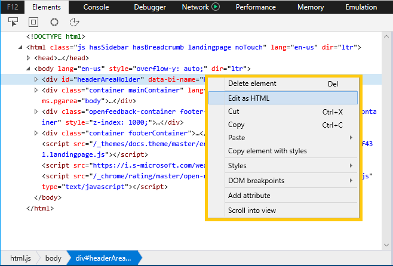

# 要素Elements

要素 **パネルは** 、次の操作を行うのに役立ちます。The **Elements** panel helps you to:

* [現在のページの HTML ツリー内の要素を](#html-tree-view) 識別および編集する[Identify and edit elements in the HTML tree](#html-tree-view) of the current page
* [ページ上の CSS (擬似](./elements/styles.md) 状態と擬似要素を含む) を検査および変更する[Inspect and modify CSS](./elements/styles.md) on the page, including pseudo-states and pseudo-elements
* [ページ上で発生する CSS レイアウトとスタイルカスケード](./elements/computed.md) について理解する[Understand the CSS layout and style cascade](./elements/computed.md) happening on the page
* [悪意のあるイベント ハンドラーを追跡して](./elements/events.md) デバッグできる[Track down rogue event handlers](./elements/events.md) so you can debug them
* [予期しない視覚的な変更が原因のコードに](./elements/dom-breakpoints.md) ジャンプするためにデバッグブレークポイントを設定する[Set debugging breakpoints for unexpected visual changes](./elements/dom-breakpoints.md) to jump into the code causing them
* [ページで使用されるフォントと、](./elements/fonts.md) そのフォントの読み込み場所に関する詳細情報を取得する[Get detailed information about the fonts used on the page](./elements/fonts.md) and where they're loading from
* [スクリーン リーダーの視点から](./elements/accessibility.md) ページを表示し、アクセシビリティを確認してテストする[View your page from a screen reader's point of view](./elements/accessibility.md) to verify and test accessibility 
* [ページの UI をデバッグする場合に加](./elements/changes.md) える CSS の変更の実行中の違いを確認する[Review a running diff of the CSS changes](./elements/changes.md) you make as you debug the UI of your page

## HTML ツリー ビューHTML tree view

1. Select**要素**( ) ツールを使用して、ページ内で要素をクリックして HTML ツリー ビュー `Ctrl+B` で要素を見つける。 \*\*\*\*Use the **Select element** (`Ctrl+B`) tool to locate an element in the **HTML tree view** by clicking on it in the page.

2. 要素の **強調表示** ( ) ツールを使用して、HTML ツリー ビューで要素をポイントして、ページ `Ctrl+Shift+L` **上の要素を検索します**。Use the **Element highlighting** (`Ctrl+Shift+L`) tool to locate an element on the page by hovering over it in the **HTML tree view**.

3. 色の **選択 ()** ツールを開き、現在のページで使用されている色 `Ctrl+K` の一覧を表示します。Open the **Color picker** (`Ctrl+K`) tool to see a list of the colors in use on the current page. 一覧の色をクリックすると、詳細 (色相、彩度、明度、アルファ) が表示されます。Clicking on a color on the list will provide further details (Hue, Saturation, Lightness, Alpha). [*スタイル*] ウィンドウで色の値の横にある色付き正方形をクリックすると、色\*\*\*\* の選択も開き、ページ要素の色を編集してすぐに結果を表示できます。The *Color picker* also opens when you click on the colored square next to a color value in the **Styles** pane, allowing you to edit the color of a page element and immediately see the results.

4. アクセシビリティ**ツリー** ( ) ボタンをクリックすると、[アクセシビリティ ツリー] ウィンドウが開き `Ctrl+Shift+A` [、Windows](https://support.microsoft.com/help/22798/windows-10-narrator-get-started)ナレーター スクリーンリーダーなどの支援技術に表示されるページの構造が表示されます。 The **Accessibility tree** (`Ctrl+Shift+A`) button will open the [Accessibility tree](./elements/accessibility.md) pane showing the structure of your page as it would appear to an assistive technology, such as the [Windows Narrator](https://support.microsoft.com/help/22798/windows-10-narrator-get-started) screenreader.

5. また、HTML **ツリー** ビューで要素のタグ名、属性、またはテキスト コンテンツを検索して、要素 `Ctrl+F` を検索することもできます。You can also **Find** (`Ctrl+F`) an element in the HTML tree view by searching for its tag name, attributes, or text content.

### 要素の編集Editing elements

HTML ツリー ビュー内で要素を右クリックし、コンテキスト メニューから **[HTML** として編集] を選択すると、要素を編集できます。You can edit an element by right-clicking on it within the HTML tree view and selecting **Edit as HTML** from the context menu. コンテキスト メニューには、削除、切り取り、コピー、貼り付け、CSS 擬似クラス *(:active* *、:focus 、:hover* *、:visited)* の設定、属性の追加を行うオプションも用意されています。 \*\*The context menu also provides options to delete, cut, copy, paste, set CSS pseudo-classes (*:active*, *:focus*, *:hover*, *:visited*) and add attributes. 属性や値を編集するもう 1 つの方法は、HTML ツリー ビューからダブルクリックする方法です。Another way to edit an attribute and/or its value is to double-click it from the HTML tree view.

> [!NOTE]
> HTML ツリーを編集しても、基になるソース マークアップには影響を与え得ない。Editing the HTML tree does not affect the underlying source markup. ページを更新すると、変更が元に戻り、ページ ソースによって決定されたレイアウトだけがレンダリングされます。Refreshing the page will revert your changes and render only the layout determined by the page source. 変更した\*\*\*\* HTML をクリップボードにコピーするには、目的の要素 (またはページ全体が必要な場合はグローバル要素) を右クリックして、コンテキスト メニューを `html` 開きます。You can **Copy** your modified HTML to the clipboard by right-clicking the desired element (or the global `html` element, if you want the entire page) to open up the context menu. (**切り取** り **および貼り付** けオプションも使用できます)。(**Cut** and **Paste** options are also available).

[スタイル [] ウィンドウから](./elements/styles.md) 、CSS 擬似状態と擬似要素を追加/削除/編集することもできます。From the [Styles](./elements/styles.md) pane you can also add/delete/edit CSS pseudo-states and pseudo-elements.

## ツール ウィンドウTool Panes

目的のページ要素を選択したら、ツール ウィンドウを使用して、さまざまなスタイルとアクセシビリティ プロパティをさらに調査し、そのイベント リスナーを表示し、DOM のブレークポイントを設定できます。Once you have selected a page element of interest, you can use the tool panes to further inspect its different styles and accessibility properties, view its event listeners, and set DOM mutation breakpoints.

![[要素] パネルの [ツール] ウィンドウ](./media/elements_toolpanes.png)

1. [**スタイル**](./elements/styles.md): 現在適用されているスタイルをスタイルシート別に整理[**Styles**](./elements/styles.md): Currently applied styles organized by stylesheet

2. [**計算:**](./elements/computed.md)現在適用されているスタイルを CSS 属性別に整理[**Computed**](./elements/computed.md): Currently applied styles organized by CSS attributes

3. [**イベント**](./elements/events.md): 現在の要素と先祖要素に登録されているイベント リスナー[**Events**](./elements/events.md): Event listeners registered on the current element and ancestor elements

4. [**DOM ブレークポイント**](./elements/dom-breakpoints.md): DOM のブレークポイント[**DOM breakpoints**](./elements/dom-breakpoints.md): DOM Mutation Breakpoints 

5. [**フォント**](./elements/fonts.md): 選択した要素に現在適用されているフォント[**Fonts**](./elements/fonts.md): Currently applied fonts for a selected element

6. [**アクセシビリティ**](./elements/accessibility.md): アクセシビリティ プロパティ[**Accessibility**](./elements/accessibility.md):  Accessibility properties

7. [**変更**](./elements/changes.md): 診断セッション中に行われた CSS の変更[**Changes**](./elements/changes.md): CSS changes made during diagnostic session  

## ショートカットShortcuts

| 操作Action               | ショートカットShortcut               |
|:---------------------|:-----------------------|
| 要素パネルElements panel       | `Ctrl` + `1`           |
| 要素の強調表示Element highlighting | `Ctrl` + `Shift` + `L` |
| Select 要素Select element       | `Ctrl` + `B`           |
| カラー ピッカーColor picker         | `Ctrl` + `K`           |
| アクセシビリティ ツリーAccessibility tree   | `Ctrl` + `Shift` + `A` |
