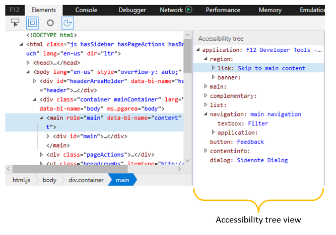

# アクセシビリティ - DevTools (EdgeHTML)  

選択した要素に割り当てられているアクセス可能なプロパティを表示します。 支援技術による使い方の説明については、プロパティ名の上にカーソルを合わせる必要があります。 また、任意のプロパティを右クリックして、その値をクリップボードにコピーすることもできます。

![[アクセシビリティ] ウィンドウ](../media/elements_accessibility.png)

アクセシビリティ ツリーを開いて、スクリーン リーダーと同じ方法でページ内を移動し、[アクセシビリティ] ウィンドウ**** を使用して、関心のあるアクセシビリティ プロパティに関する詳細を確認すると便利です。

## アクセシビリティ ツリー  

[ **アクセシビリティ] ツリー** ウィンドウには [、Windows](https://support.microsoft.com/help/22798/windows-10-narrator-get-started) ナレーター スクリーン リーダーなどの支援技術のように表示されるページの構造が表示されます。

ツリー ビューでノードをクリックすると [**、HTML**](../elements.md#html-tree-view)ツリーでもノードが選択され、その逆も選択されます。 *HTML*ビューまたはアクセシビリティ ツリー ビューからアクセシビリティ** 対応の要素を選択すると、アクセシビリティ ツール ウィンドウにアクセシビリティ プロパティの詳細**が**表示されます。 

<!--  Here are further resources on [Accessibility with Microsoft Edge](../../accessibility.md).  -->  
