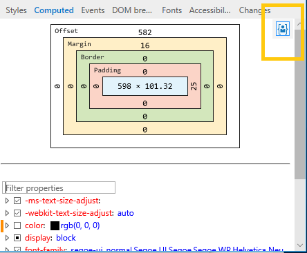

# 計算済み

選択した要素のボックス モデル図 (幅、パディング、境界線、余白、オフセット値) を参照してください。 要素の強調表示ツール****( ) をオンにした場合、図内の同じ色の領域 (幅、パディングなど) は、レンダリングされた要素をページ上で選択するときにオーバーレイします。 `Ctrl+Shift+L` ダイアグラム内の任意の値をクリックして編集できます。 

ボックス モデル図の下には、計算されたスタイル プロパティのフィルター処理可能で編集可能なリストがあります。 現在アクティブなプロパティをオフにした場合は、カスケード内の次のプロパティがアクティブになります。 変更は、[変更] ウィンドウで [**確認**](./changes.md) できます。

[ **ユーザー スタイルのみを表示]** ボタンは既定でオンになっています。 ボタンを押すと、計算されたスタイル** リストに Microsoft Edge の既定のスタイルシートのスタイルが含まれます。

