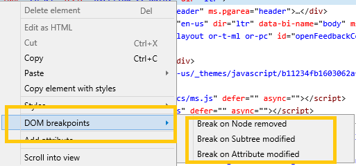
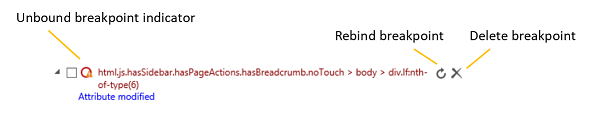

# DOM ブレークポイントDOM breakpoints

DOM のブレークポイントを無効、削除、再バインドなど、このウィンドウから管理します。Manage your DOM mutation breakpoints from this pane, including disabling, deleting and rebinding them.

DOM のブレークポイントを使用すると、選択した要素ノードが変更されるたびにデバッガーにブレークポイントを割り込みます。You can use DOM mutation breakpoints to break into the debugger whenever a selected element node changes. これは、このような変更をトリガーできる *EdgeHTML* の 450+ DOM API それぞれに個別のブレークポイントを設定することなく、UI で視覚的な不具合を引き起こす原因となるコードを追跡する場合に役立ちます。This is helpful for tracking down the code responsible for causing visual glitches with your UI without having to set individual breakpoints on each of the 450+ DOM APIs in *EdgeHTML* that can trigger such changes. 

DOM のブレークポイントを設定するには、[要素] パネルの\*\*\*\*\*HTML\*ツリー ビューで任意の要素を右クリックしてコンテキスト メニューを開きます。To set a DOM breakpoint, right-click on any element in the **Elements** panel *HTML tree view* to open the context menu.

次のブレークポイントを設定できます。You can set any of the following breakpoints:

 - **削除されたノードで**ブレーク : 選択した要素がドキュメント (DOM ツリー) から削除されると、デバッガーに割り込みます。**Break on Node removed**: Break into the debugger when the selected element is removed from the document (DOM tree).

 - **変更されたサブツリー**でのブレーク : 選択した要素の子孫が変更された場合 (追加、削除、またはサブツリーが変更された場合) にデバッガーに割り込みます。**Break on Subtree modified**: Break into the debugger when any of the descendants of the selected element are changed (added, removed, or their subtrees are modified). これは、属性が変更された場合に壊れる可能性はありません (その次のオプションを参照してください)。This will not break when attributes are modified (see the next option for that).

 - **Break on Attribute modified:** Break into the debugger when an attribute of the selected element is added, removed or changed in value.**Break on Attribute modified**: Break into the debugger when an attribute of the selected element is added, removed or changed in value.

**DOM**のブレークポイント ウィンドウには、選択した要素 (DOM 内での位置を示すセレクターを生成) と、設定したブレークポイントの種類 (ノードの削除、サブツリーの変更、*属性*の変更) が一覧表示されます。The **DOM breakpoints** pane will then list the selected element (by generating a selector describing its location in the DOM) and the types of breakpoints you have set (*Node removed, Subtree modified, Attribute modified*). ここから、ブレークポイントを個別に**(rt-click コンテキスト** メニューから) 再バインド、無効化、または削除したり、または一度にすべて (ボタンを使用) することもできます。 \*\*From here, you can also *rebind*, *disable*, or *delete* your breakpoints, individually (from the rt-click context menu) or all at once (using the buttons).

![[DOM ブレークポイント] ウィンドウ](../media/elements_dom_breakpoints.png)

## ブレークポイントの永続性Breakpoint persistence

ブレークポイントは、DevTools の設定の一部として格納されます (また、ブレークポイントが設定されているページの URL にスコープが設定されます)。Breakpoints are stored (and scoped to the URL of the page they're set within) as part of your DevTools settings. ページを再読み込みするか、ツールを閉じてから再度開くと、DevTools はブレークポイントを関連する要素に再バインドします。When the page is reloaded or the tools are closed and reopened, DevTools will attempt to rebind your breakpoints to their associated elements.

自動的に再バインドできなかったブレークポイントは、ブレークポイント の円に警告アイコンで示されます。Breakpoints that couldn't be automatically rebinded are indicated with a warning icon on the breakpoint circle. このため、DOM に対応する要素が表示されたら ([再バインド\*\*\*\* されたブレークポイント] ボタンやコンテキスト メニュー オプションを使用して) 要素を手動で再バインドするのを待つ (ブレークポイント アイコンに警告インジケーターが\*\*\*\* 表示されなくなった) か、ブレークポイントを完全に削除することができます。For these, you can wait to rebind the element manually (using the **Rebind breakpoint** button and/or context menu option) once a corresponding element appears in the DOM (and the breakpoint icon no longer shows the warning indicator), or **Delete** the breakpoint altogether.

この DOM のブレークポイント ウィンドウに *加* えて、デバッガー内から [DOM](../debugger.md#dom-breakpoints) のブレークポイントを管理 **することもできます**。In addition to this *DOM breakpoints* pane, you can also manage your [DOM breakpoints](../debugger.md#dom-breakpoints) from within the **Debugger**.

## 現在の制限事項Current limitations

Edge DevTools での DOM ブレークポイント デバッグの次の制限事項に注意してください。Please be aware of the following limitations of DOM breakpoint debugging in Edge DevTools:

- Edge DevTools では、現在、ブレークポイント内のブレークポイントの再バインドはサポート[ `<iframe>` されていません](https://developer.mozilla.org/docs/Web/HTML/Element/iframe)。Edge DevTools don't currently support rebinding breakpoints inside of [`<iframe>`s](https://developer.mozilla.org/docs/Web/HTML/Element/iframe). iframe にブレークポイントを設定して Edge DevTools を閉じるか、ページを更新すると、ブレークポイントは失われます。If you set a breakpoint in an iframe and close Edge DevTools or refresh the page, the breakpoint will be lost.

- DOM が完了する前に同期的に実行されたブレークポイントがスクリプトで検出された場合、デバッガーが一時停止している間は DOM のブレークポイントを [`readyState`](https://developer.mozilla.org/docs/Web/API/Document/readyState) 設定できません。If your script encounters a synchronously-executed breakpoint before the DOM [`readyState`](https://developer.mozilla.org/docs/Web/API/Document/readyState) is completed, you won't be able to set a DOM breakpoint while the debugger is paused. 通常、この状況を解決するには、スクリプト属性 [`defer`](https://developer.mozilla.org/docs/Web/HTML/Element/script#Attributes) またはスクリプト属性 [`async`](https://developer.mozilla.org/docs/Web/HTML/Element/script#Attributes) を設定します。You can typically remedy this situation by setting the [`defer`](https://developer.mozilla.org/docs/Web/HTML/Element/script#Attributes) or [`async`](https://developer.mozilla.org/docs/Web/HTML/Element/script#Attributes) script attributes.

- 同期スクリプトの場合、イベントが呼び出されるとブレークポイントの自動再バインド [`window.onload`](https://developer.mozilla.org/docs/Web/API/GlobalEventHandlers/onload) がトリガーされます。For synchronous scripts, we trigger automatic rebinding of breakpoints when the [`window.onload`](https://developer.mozilla.org/docs/Web/API/GlobalEventHandlers/onload) event is called. この場合、DOM のスクリプト駆動型の初期ビルド時にトリガーされるバインド ブレークポイントが見つからない可能性があります。In this case, we may miss binding breakpoints that would trigger during initial script-driven build-up of the DOM. 非同期スクリプトの場合、最初のスクリプトが実行される前に再バインドの試行がトリガーされます。そのため、ブレークポイントが再バインドされ、必要に応じてトリガーされる可能性があります。For asynchronous scripts, we trigger a rebind attempt before the first script executes, so your breakpoints may rebind and trigger as desired.
