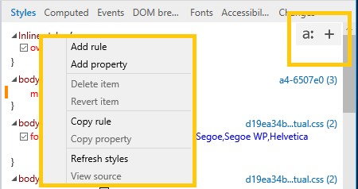

# スタイルStyles

現在適用されているスタイルをスタイルシートごとに表示および編集します。View and edit the currently applied styles, organized by stylesheet.  プロパティを変更すると、変更された (黄色)、追加された (緑)、削除された (赤) プロパティに色付きインジケーター バーが表示されます。As you make changes to your properties, a colored indicator bar will appear for changed (yellow), added (green), and deleted (red) properties.

![[スタイル] ウィンドウ](../media/elements_styles.png)

"a: " ボタンをクリックすると、擬似**状態パネルを**表示できます。You can display the pseudo states panel by clicking the "**a:**" button. 新しいスタイル ルールを定義するには、[スタイル] ボタンをクリックするか、[スタイル] ウィンドウの任意の場所を右クリックしてコンテキスト **+** メニューを開きます。 \*\*\*\*Define a new style rule by clicking the "**+**" button or right-clicking anywhere in the **Styles** pane to open the context menu.

## 擬似要素の編集Editing pseudo elements

[スタイル] ウィンドウを使用して、擬似要素と擬似状態を追加、編集、削除します。Use the Styles pane to add, edit, and delete pseudo elements and pseudo states. 選択した要素に CSS 擬似状態を適用するには、 *擬似* 状態パネル **(a:** ボタン) を開き、目的のクラスをチェックします。To apply a CSS pseudo state to the selected element, open the *Pseudo states panel* (**a:** button) and tick the desired class.

![[スタイル] ウィンドウの擬似クラス](../media/elements_styles_pseudo_states.png)

擬似要素を追加するには、[(新しいスタイル ルール) ] ボタンをクリックし、通常のスタイルシートと同 **+** じ方法で編集します。\*\*To add a pseudo element, click the **+** (*New style rule*) button and edit as you would a regular stylesheet.

![[スタイル] ウィンドウから擬似要素を追加する](../media/elements_styles_pseudo_element.png)

擬似要素は、[スタイル] ウィンドウの独自の見出しの下に *グループ化* されます。Pseudo elements are grouped under their own headings in the *Styles* pane.
