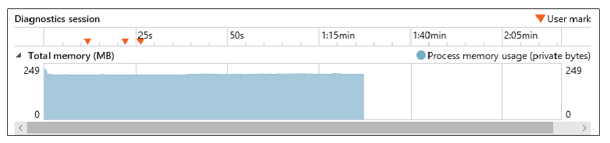
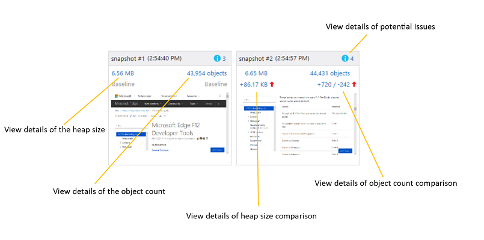
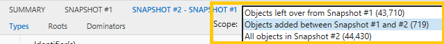

# メモリMemory

メモリ パネル **を使用** して、システム リソースの使用を測定し、さまざまな状態のコード実行でヒープ スナップショットを比較します。Use the **Memory** panel to measure your use of system resources and compare heap snapshots at different states of code execution. この方法を使用すると、次の方法を行います。With it, you can:

- [ページのメモリ消費量をリアルタイムでグラフ化し](#memory-usage-timeline) 、ヒープのスナップショットを取得する[Graph the memory consumption of your page in real time](#memory-usage-timeline) and take snapshots of the heap
- [DOM に接続されていない保持](#snapshot-summary) オブジェクトなど、コード内の潜在的なメモリの問題を特定する[Identify potential memory issues](#snapshot-summary) in your code, such as retained objects not attached to the DOM
- [オブジェクトの種類、インスタンス](#snapshot-details) 数、サイズ、参照別にメモリ使用量データを確認し、問題を特定するのに役立ちます[Review memory usage data](#snapshot-details) by object type, instance count, size, and references to help isolate issues
- [スナップショット データ フィルターを適用](#filters) して操作できない情報のノイズを減らす[Apply snapshot data filters](#filters) to reduce the noise of non-actionable information
- [特定のオブジェクトのメモリ コストと](#object-references) 、それを維持する参照を特定する[Identify the memory cost of a specific object](#object-references) and the references keeping it alive
- [調査の異なるフェーズで](#snapshot-comparison) ヒープを比較し、メモリ リークの原因や他の問題を追跡する[Diff the heap at different phases of your investigation](#snapshot-comparison) to track down the source of memory leaks and other problems

## ツール バーToolbar

1. **プロファイリング セッションの開始/停止 (Ctrl + E)**: プロファイラーを有効にすることで、メモリ使用量を追跡し、ヒープのスナップショットを取得できます。**Start/Stop profiling session (Ctrl+E)**: Turning on the profiler enables you to track memory usage and take snapshots of the heap.
2. **プロファイリング セッションのインポート (Ctrl + O)**: 保存された DevTools メモリ診断セッションを読み込む。**Import profiling session (Ctrl+O)**: Load a saved  DevTools memory diagnostic session.
3. **プロファイリング セッションのエクスポート (Ctrl + S)**: 現在の診断セッションをディスクに保存します。**Export profiling session (Ctrl+S)**: Save the current diagnostic session to disk.
4. **ヒープ スナップショットを取得する (Ctrl + Shift + T)**: 特定の時点での現在のメモリ割り当てを記録します。**Take heap snapshot (Ctrl+Shift+T)**: Record current memory allocations for a given point of time.

## メモリ使用量のタイムラインMemory usage timeline

メモリの問題は、パフォーマンスの問題の主要な原因となる可能性があります。その結果、ページの応答が低下し、時間の長い時間が続きます。Memory problems can be a major culprit of performance issues, causing your page to become increasingly unresponsive and laggy over time.

ページのメモリ使用量を分析する最初の手順は、ヒープのスナップショットの前/後にプロファイリング セッションを開始し、メモリが大きかったり、メモリ リークの疑いがあるステップを再生成したりします。The first step to analyzing the memory usage of your page is to [start a profiling session](#toolbar) in order to take before/after snapshots of the heap as you repro the steps causing memory bloat or a suspected memory leak.

メモリ プロファイラーを起動すると、プロセス メモリ グラフが表示されます。これにより、プライベート ワーキング セット全体 (ページによって消費されるメモリの量) を時間の中で確認できます。When you start the memory profiler, you will see a process memory graph that allows you to observe the overall private working set (the amount of memory consumed by the page) over time. メモリ グラフには、プライベート バイト、ネイティブ メモリ、JavaScript ヒープを含むタブのプロセス メモリのライブ ビューが表示されます。The memory graph shows you a live view of the tab's process memory, which includes private bytes, native memory, and the JavaScript heap. 

 グラフには、ページのメモリ傾向が示されます。これにより、予期しないメモリ保持期間が発生した場合など、後で比較するためにヒープ スナップショットを取得する適切な時期を判断できます。The graph gives you an indication of the memory trend for the page which enables you to judge when it is appropriate to [take a heap snapshot](#toolbar) for later comparison, such as when you see periods of unexpected memory retention.

### Performance.mark()Performance.mark()

コードまたは DevTools コンソールからメソッドを呼び出すことによって、分析セッションの過程で重要なイベントを識別するのに役立つカスタム ユーザー マークをタイムラインに [`Performance.mark()`](https://developer.mozilla.org/docs/Web/API/Performance/mark) 追加[**できます**](./console.md)。You can add custom **User marks** to the timeline to help identify  key events during the course of your analysis session by calling the [`Performance.mark()`](https://developer.mozilla.org/docs/Web/API/Performance/mark) method from within your code or the  DevTools [**Console**](./console.md).

### Console.takeheapSnapshot()Console.takeheapSnapshot()

DOM の大規模な解析の直前など、非常に特定の時点でスナップショットを取得する必要がある場合があります。Sometimes you need to take snapshots at very specific points in time, such as immediately before a large mutation of the DOM. このような場合は、プログラムでスナップショットを取得できます [`Console.takeHeapSnapshot()`](./console/console-api.md#taking-heap-snapshots) 。In these cases,you can take snapshots programmatically with [`Console.takeHeapSnapshot()`](./console/console-api.md#taking-heap-snapshots).

## スナップショットの概要Snapshot summary

[スナップショットを作成](#toolbar) すると、スナップショットが作成された時点での JavaScript ヒープのサイズと、割り当てられたオブジェクトの数とページのスクリーンショットを示す概要タイルが生成されます。[Taking a snapshot](#toolbar) will generate a summary tile that indicates the size of the JavaScript heap at the time the snapshot was taken, along with the number of objects allocated and a screenshot of the page. 分析が必要なユーザー シナリオを実行すると、いつでもスナップショットを取得できます。You can continue to take snapshots at any time as you run through the user scenario requiring analysis. スナップショットは追加のタイルを生成し、それぞれのタイルは前のスナップショットからの JavaScript メモリの違いを示します。The snapshots generate additional tiles, each of which indicates the difference in JavaScript memory from the previous snapshot.

概要タイルの値をクリックすると、スナップショット データの詳細を表示するウィンドウ [に切り替えます](#snapshot-details)。Clicking on the values in the summary tile will switch to the pane showing [details of the snapshot data](#snapshot-details). 潜在的 [なメモリの問題は、青色の](#snapshot-details) 情報 ("i") アイコンで示されます。Potential [memory issues are indicated](#snapshot-details) with a blue informational ("i") icon.

## スナップショットの詳細Snapshot details

[Snapshot] ウィンドウ *の* データには、ページによって作成されたオブジェクトと、使用している可能性のある JavaScript フレームワークによって割り当てられたメモリが表示されます。The data in the *Snapshot* pane shows the objects created by your page along with any memory allocated by JavaScript frameworks you may be consuming.

3 つのタブは、データの異なるビューを表します。The three tabs represent different views of the data:

#### 型Types

ヒープ上のオブジェクトのインスタンス数と合計サイズを、オブジェクトの種類別にグループ化して示します。Shows the instance count and total size of objects on the heap, grouped by object type. 既定では、これらはインスタンス数で並べ替えされます。By default, these are sorted by instance count.

上部の [種類] ウィンドウ でオブジェクトを選択すると、下枠の [オブジェクト参照] テーブルに、そのオブジェクトをポイントしているすべてのオブジェクトが一覧表示されます。When you select an object in the upper *Types* pane, the [Object references](#object-references) table in the lower pane will list all the objects that point to that object.

#### ルートRoots

オブジェクトがグローバル オブジェクトにルート化され、ガベージ コレクションが実行されるのを防ぐ方法を説明する子参照の階層ビューを示します。Shows a hierarchical view of child references to describe how objects are rooted to the global object, thus preventing them from being garbage-collected.

既定では、子ノードは保持されたサイズの列で並べ替えされ、最も大きいノードが一番上に表示されます。By default, the child nodes are sorted by the retained size column, with the largest at the top.

#### ドミネータDominators

他のオブジェクトへの排他参照を持つヒープ上のオブジェクトの一覧を表示します。Shows a list of objects on the heap that have exclusive references to other objects. リミネータは保持されたサイズで並べ替え、解放するのが最も簡単な可能性のあるメモリを消費するオブジェクトを示します。Dominators are sorted by retained size to indicate the objects consuming the most memory that are potentially easiest to free.

型、ルート、およびドミネータ ビューの列を*解釈する方法を次に示*します。Here's how to interpret the columns in the *Types, Roots* and *Dominators* views:

列Column | 説明Description
:------------ | :-------------
識別子Identifier(s) | オブジェクトを最も識別する名前。Name that best identifies the object. たとえば、HTML 要素の場合、スナップショットの詳細には ID 属性値 (使用されている場合) が表示されます。For example, for HTML elements the snapshot details show the ID attribute value, if one is used.
型Type | オブジェクトの種類 *(HTMLDivElement など*)。Object type (for example, *HTMLDivElement*).
SizeSize | オブジェクト のサイズ 。参照されるオブジェクトのサイズは含め)。Object size, not including the size of any referenced objects.
保持サイズRetained size | オブジェクト のサイズと、他の親を持たないすべての子オブジェクトのサイズ。Object size plus the size of all child objects that have no other parents. 実際には、これはオブジェクトによって保持されるメモリの量です。したがって、オブジェクトを削除すると、指定したメモリ量を解放します。For practical purposes, this is the amount of memory retained by the object, so if you delete the object you reclaim the specified amount of memory.
CountCount | オブジェクト インスタンスの数。Number of object instances. この値は、[種類] ビューにのみ表示されます。This value appears only in the Types view.

上部の [主ウィンドウ] ウィンドウでオブジェクトを選択すると、下枠の [オブジェクト参照] テーブルに、そのオブジェクトをポイントしているすべてのオブジェクトが一覧表示されます。When you select an object in the upper *Dominators* pane, the [Object references](#object-references) table in the lower pane will list all the objects that point to that object.

### フィルターFilters

次の機能を使用して、表のデータをさらに調整できます。You can further adjust data in the table with the following:

1. **識別子フィルター**: 特定のオブジェクト識別子を検索してデータをフィルター処理する**Identifier filter**: Filter out data by searching for a particular object identifier
2. **ドミネー**タによるグループ化: 他のオブジェクトへの排他的な参照を持つオブジェクトだけが、オブジェクトのトップ レベル ビューに表示されます (これは *[デ*ミネータ] タブの既定のビューです)。**Group by dominator**: Only objects with *exclusive* references to other objects are shown in the top-level view of objects (this is the default view in the *Dominators* tab).
3. **組み込み/ID フィルター**: 既定では [、JavaScript](https://developer.mozilla.org/docs/Web/JavaScript/Reference/Global_Objects) の組み込みオブジェクトがリストに含まれています。**Built-ins / IDs filter**: By default, [JavaScript built-in objects](https://developer.mozilla.org/docs/Web/JavaScript/Reference/Global_Objects) are included in the list. オブジェクトの一覧は、区別する必要がある匿名オブジェクトが複数ある場合に便利です。Listing object IDs can be useful if there are multiple anonymous objects which need to be differentiated.

種類 *ビュー、ルート* ビュー、および *ディ* ミネータ ビューにはそれぞれ独自のフィルターが設定されています。したがって、別のビューに切り替えてもフィルターは保持されません。The *Types, Roots* and *Dominators* views each has its own filter, so the filter isn't preserved when you switch to another view.

### オブジェクト参照Object references

[型[**] ビューと [**](#types)[**管理**](#dominators)ウィンドウ] ビューの下枠には、共有参照を表示する**オブジェクト**参照リストが表示されます。In the [**Types**](#types) and [**Dominators**](#dominators) views, the lower pane contains an **Object references** list that displays shared references. 上部のウィンドウでオブジェクトを選択すると、そのオブジェクトをポイントしているすべてのオブジェクト (つまり、選択したオブジェクトを維持しているオブジェクト) が表示されます。When you choose an object in the upper pane, this list displays all objects that point to that object--in other words, the objects that are keeping the selected object alive.

循環参照はアスタリスク (\*) と情報ヒントと一緒に表示され、展開できません。Circular references are shown with an asterisk (\*) and informational tooltip, and cannot be expanded. そうしないと、参照ツリーを上がってメモリを保持しているオブジェクトを識別する妨げになります。Otherwise, they would prevent you from walking up the reference tree and identifying objects that are retaining memory.

同等のオブジェクトをすばやく識別するには、[表示オブジェクト [*ID]*](#filters) フィルター オプションをオンにし、[識別子] 列のオブジェクト名の横にオブジェクト ID *を表示* します。To quickly identify equivalent objects, tick the [*Display object IDs*](#filters) filter option to display object IDs next to object names in the *Identifier(s)* column. 同じ ID を持つオブジェクトは共有参照です。Objects that have the same ID are shared references.

### スナップショットの比較Snapshot comparison

[スナップショットの比較[] タブ](#snapshot-details)または [スナップショットの概要] タイルの比較リンクをクリックすると、2 つのスナップショット間の情報の違いが表示されます。Clicking on a [snapshot comparison tab](#snapshot-details) or comparison link on the [snapshot summary tile](#snapshot-summary)  will show a diff of information between the two snapshots. 比較ウィンドウでは、1 つのスナップショットに対 して表示されるのと同じスナップショットの詳細が、*次*の追加の値で提供されます。In the comparison pane, the *Dominators, Types* and *Roots* views provide the same [*snapshot details*](#snapshot-details) you would see for a single snapshots, with these additional values:

列Column | 説明Description
:------------ | :-------------
サイズの違い。Size diff. | 現在のスナップショット内のオブジェクトのサイズと前のスナップショットのサイズの違い。参照されるオブジェクトのサイズは含め)。Difference between the size of the object in the current snapshot and its size in the previous snapshot, not including the size of any referenced objects.
保持サイズの差分。Retained size diff. | 現在のスナップショット内のオブジェクトの保持サイズと、前のスナップショットの保持サイズの違い。Difference between the retained size of the object in the current snapshot and its retained size in the previous snapshot. 保持されるサイズには、オブジェクト のサイズと、他の親を持たないすべての子オブジェクトのサイズが含まれます。The retained size includes the object size plus the size of all its child objects that have no other parents. 実際には、保持されるサイズはオブジェクトによって保持されるメモリの量です。したがって、オブジェクトを削除すると、指定したメモリ量を解放します。For practical purposes, the retained size is the amount of memory retained by the object, so if you delete the object you reclaim the specified amount of memory.

[範囲] ドロップダウンを **使用** すると、スナップショット間の差分情報をフィルター処理できます。You can use the **Scope** dropdown to filter differential info between snapshots:

- <strong>Snapshot # から残されたオブジェクト: ヒープに追加され、ヒープからベースライン スナップショットから以前のスナップショットに削除されたオブジェクトの違い <number></strong> を示します。Objects left over from Snapshot #<number></strong>: Shows the diff between the objects added to the heap and removed from the heap from the baseline snapshot to the previous snapshot. たとえば、スナップショットサマリーのオブジェクト数が <em> +205 / -195 の場合、このフィルターは追加されたが削除されていない 10 個のオブジェクト </em> を表示します。For example, if the snapshot summary shows <em>+205 / -195</em> in the object count, this filter will show you the ten objects that were added but not removed.

- <strong>Snapshot # と # の間に追加されたオブジェクト: 前のスナップショットからヒープに追加 <number> <number></strong> されたオブジェクトすべてが表示されます。Objects added between Snapshot #<number> and #<number></strong>: Shows all objects added to the heap from the previous snapshot.

- <strong>Snapshot # 内のすべてのオブジェクト: ヒープ上のすべてのオブジェクト (つまり、フィルター処理されていないビュー <number></strong> <em> ) を表示 </em> します。All objects in Snapshot #<number></strong>: Shows all objects on the heap (in other words, an <em>unfiltered</em> view).

既定では、" *一* 致しない参照の表示" フィルターは、現在の範囲フィルターと一致しないオブジェクト参照を示すために比較ビューに適用されます。By default, the *Show non-matching references* filter is applied to the comparison view to indicate object references that don't match the current Scope filter. ドロップダウン メニューからオフにできます。You can turn it off from the dropdown menu:

## ショートカットShortcuts

 操作Action | ショートカットShortcut
:------------ | :-------------
プロファイリング セッションの開始/停止Start / Stop profiling session  | `Ctrl` + `E`
プロファイリング セッションのインポートImport profiling session | `Ctrl` + `O`
プロファイリング セッションのエクスポートExport profiling session | `Ctrl` + `S`
ヒープ スナップショットを取得するTake heap snapshot | `Ctrl` + `Shift` + `T`

## 既知の問題Known Issues

### プロファイリング セッションの開始中にエラーが発生しましたAn error occurred while starting the profiling session

このエラー メッセージが表示された **場合:** メモリ ツールでプロファイリング セッションの開始中にエラーが発生した場合は、次の手順に従って回避策を確認してください。If you see this error message: **An error occurred while starting the profiling session** in the Memory tool, follow these steps for a workaround.

1. を押 `Windows Key`  +  `R` します。Press `Windows Key` + `R`.

2. [ファイル名を指定して実行] ダイアログボックスに **、「services.msc」と入力します**。In the Run dialog, enter **services.msc**.

3. Microsoft **(R) Diagnostics Hub Standard Collector Service** を見つけて右クリックします。Locate the **Microsoft (R) Diagnostics Hub Standard Collector Service** and right-click it.

4. Microsoft **(R) Diagnostics Hub Standard Collector Service を再起動します**。Restart the **Microsoft (R) Diagnostics Hub Standard Collector Service**.

5. Microsoft Edge 開発者ツールとタブを閉じます。新しいタブを開き、ページに移動して、押します `F12` 。Close the Microsoft Edge Developer Tools and the tab. Open a new tab, navigate to your page, and press `F12`.

6. これで、プロファイリングを開始できます。You should now be able to begin profiling. 

それでも問題が発生しますか?Still running into problems? フィードバックの送信アイコンを使用して、フィードバック **をお送り** ください。Please send us your feedback using the **Send feedback** icon! 

