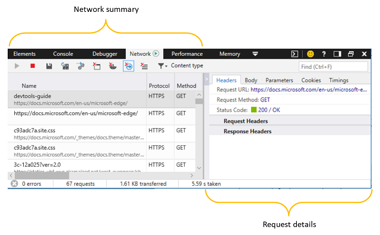
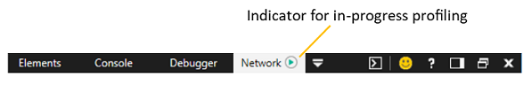
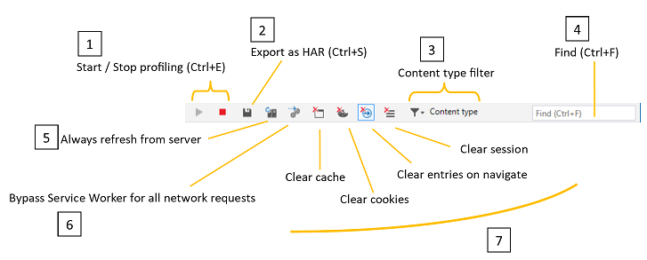
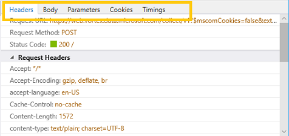
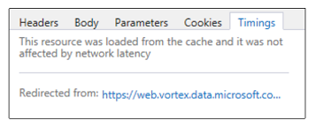

# ネットワーク

ネットワーク パネル **を使用** して、ネットワークを使用して送信された要求と応答を監視、検査、プロファイルします。 この方法を使用すると、次の方法を行います。

 - [ページによって行われたすべてのリソース要求の](#network-summary) レコードを参照する
 - [新規ユーザーと復帰ユーザーに対するサイト](#summary-bar) の読み込み時間を測定する 
 - [ページとネットワークの間で](#request-details) 交換されるヘッダー、メッセージのボディ、パラメーター、Cookie を検査する
 - [サイトの読み込み時間でボトルネックの](#timings) 原因となっているネットワーク イベントを特定する

## ネットワークの概要

DevTools を開いた場合、ネットワーク プロファイリングは既定で有効になっています。 Active Browser タブからのすべてのネットワーク トラフィックは、Network とは異なる DevTools パネルで作業している間でも、ネットワークの概要リストに記録 *されます*。

### ツール バー

ツール バーには、ページのネットワーク アクティビティをプロファイリングおよびフィルター処理するコントロールがあります。 

1. **プロファイリング セッションの開始/** 停止 : 既定では、ネットワーク プロファイリングが有効になっていて、ネットワーク トラフィックがネットワーク プロファイラーの一 [**覧に記録**](#network-request-list) されます。 [停止 ( ) ] ボタンを使用してネットワーク **キャプチャ** `Ctrl+E` をオフにできます。

2. **HAR としてエクスポート**: 現在のネットワーク プロファイリング セッション ( ) を JSON 形式の `Ctrl+S` HTTP アーカイブ [(HAR)](https://dvcs.w3.org/hg/webperf/raw-file/tip/specs/HAR/Overview.html) ファイルとして保存できます。 

3. **コンテンツ タイプ フィルター**: 特定のコンテンツ要求 (ドキュメント、スタイル シート、*イメージ、スクリプト、メディア、フォント、XHR、その*他) でネットワーク要求リストをフィルター処理します。 既定では、すべてのコンテンツ タイプが表示されます。

4. **Find**: Filter ( `Ctrl+F` ) the network request list by entry names (resource paths) containing a specified search string.

5. **常にサーバーから更新**: このボタンを押すと、ページ リソースがブラウザー キャッシュではなくネットワークから読み込まれる状態になります。 You can refresh the page from network a single time by pressing `Ctrl+F5` .

6. **すべてのネットワーク要求にサービス ワーカーをバイパス**する : 登録済みのサービス ワーカーをネットワーク プロキシとして無効にします。 

7. ボタンをクリアする

   - **キャッシュの**クリア: ブラウザー キャッシュに格納されているリソースをすべて削除します (また、ページの読み込みを初めて実行するエクスペリエンスをエミュレートします)。
   - **Cookie の**クリア : 特定のドメインのすべての Cookie を削除します (また、サイトの初回エクスペリエンスをエミュレートします)。
   - **移動時にエントリをクリア**する : 記録されたトラフィックは、ページ ナビゲーション時にクリアされます。 これは既定で有効になっています。
   - **セッションの**クリア: ネットワークの概要リストからすべてのネットワーク要求 **エントリをクリア** します。

### ネットワーク要求リスト

すべてのネットワーク トラフィックが一覧に記録されます (ナビゲーション時にクリアするか、手動でクリアするか、DevTools を閉じます)。 任意のエントリをクリックすると、要求のより [詳細なビューが開きます](#request-details)。

ネットワーク要求リストには、次の情報が含まれています。 

列 | 説明 
:------------ | :------------- 
**Name (名前)** | 要求の名前と URL パス
**プロトコル** |  要求のプロトコルの種類 *(HTTPS、HTTP/2 など*)
**メソッド** |    [要求に](https://developer.mozilla.org/docs/Web/HTTP/Methods) 使用される HTTP メソッド
**結果** |    [HTTP 応答状態](https://developer.mozilla.org/docs/Web/HTTP/Status)  コード
**コンテンツ タイプ** |  要求されたメディアの種類[(MIME タイプ](https://en.wikipedia.org/wiki/Media_type))
**受信** | サーバーによって配信される応答のサイズ (キャッシュされた応答では計算されません)
**時間** |  サーバー応答を読み込む時間 (キャッシュされた応答では計算されません)
**Initiator** | 要求を開始するサブシステム ( *パーサー、リダイレクト、スクリプト、その*他など)
**タイムライン** | 要求のネットワーク イベント *(Stalled、Resolving(DNS)、Connecting(TCP)、SSL、Sending、Waiting(TTFB)、Downloading*など) の視覚的なタイムライン。 グラフにカーソルを合わせると、ネットワーク ネットワークのタイミングの詳細 [が表示されます](#timings)。

### 概要バー

ネットワーク パネルの下部にある**** バーには、ネットワーク プロファイリング セッション中の HTTP ネットワーク エラー、要求、データ転送、および読み込み時間の合計が要約されます (DevTools が開いてネットワーク トラフィックを記録した後)。

**経過時間とは** 、プロファイリング セッションの開始から最後のリソースがネットワークからダウンロードされた時刻の間の時間を意味します。 ブラウザー キャッシュからフェッチされたリソースは、この数に時間が発生しない。 

**DOM** の読み込み時間とは、プロファイリング セッションの開始から [DOMContentLoaded](https://developer.mozilla.org/docs/Web/Events/DOMContentLoaded) イベントが発生して、ページ ドキュメントの構造が読み込まれ、解析された (必ずしもスタイルシート、イメージ、またはサブフレームではない) かどうかを示す時間を意味します。

**ページ読み**込み時間とは、プロファイリング セッションの開始から、ページ ドキュメント(およびすべてのリソース) が完全に読み込まれたと示す load イベントが発生した時刻の間の時間を意味します。

## 要求の詳細

[ネットワークの概要] ボックス[****](#network-summary)の一覧のエントリをクリック[****](#request-details)すると、[要求の詳細] ウィンドウが開き、次の各タブに詳細情報が表示されます。

### ヘッダー
サーバーに [送信およびサーバー](https://developer.mozilla.org/docs/Web/HTTP/Headers) から受信した HTTP ヘッダーを表示します。 任意のヘッダー エントリを右クリックして、クリップボードにコピー `Ctrl+C` します。 キーを押しながらエントリを複数選択したり、すべて () `Shift` を選択したりもできます `Ctrl+A` 。

### 本文
要求と応答のペイロードの本文データ (使用可能な場合) を表示します。

画像コンテンツは、サイズとサイズのデータと一緒に表示されます。

テキスト コンテンツは (読み取り専用) エディターに表示され、読み**** やすくするために、プレビュー印刷や**Word**の折り返しを使用して、最小化されたコンテンツを書式設定するためのオプションが表示されます。

![[要求の詳細] ウィンドウの [本文] タブ](./media/network_details_body.png)

### パラメーター
GET 要求のクエリ文字列パラメーターを表示します。 POST 要求のパラメーターはヘッダーで送信されるが、GET 要求はそれらを URL に含める。 読みやすくするために、この記事で取り上がっています。

任意の行を右クリックして、クリップボードにコピー `Ctrl+C` ( ) します。 キーを押しながらエントリを複数選択したり、すべて () `Shift` を選択したりもできます `Ctrl+A` 。

### Cookie
キーと値のペアとして送信または受信される Cookie を表示します。

任意の行を右クリックして、クリップボードにコピー `Ctrl+C` ( ) します。 キーを押しながらエントリを複数選択したり、すべて () `Shift` を選択したりもできます `Ctrl+A` 。

特定のドメインに保存されている Cookie は、ツールバー ([Cookie のクリア] ボタン)**から消去**できます。 

### タイミング

[ **タイミング] タブ** には、選択したリソースの読み込みに関係するネットワーク イベントのタイムラインが表示されます。 これは、ネットワーク要求リストの *[タイムライン*] 列にある情報に似ていますが、要求キューでの待機に費やされた時間 (*ス*トール) や DNS 解決、TCP 接続の確立など、ネットワークを通じて送信される要求に至るイベントも含まれます。 

![[要求の詳細] ウィンドウの [タイミング] タブ](./media/network_details_timings.png)

他のリソースとの間のリダイレクトが表示され、リンクをクリックすると、ネットワーク要求の詳細ウィンドウ内のそのリソース [にフォーカスが設定](#request details) されます。

キャッシュから読み込まれたリソースはネットワーク待機時間の影響を受けないので、ネットワーク *タイミング* チャートは表示されません。

特定のリソースに対して発生する可能性があるさまざまなネットワーク イベントを、時系列順に次に示します。

#### ストール

要求キューで利用可能なネットワーク接続を待機する時間。 HTTP 1.0/1.1 の場合、Microsoft Edge はホスト名ごとに最大 6 つの同時 TCP 接続を許可します。 

#### 解決 (DNS)

DNS (ドメイン ネーム システム) 内のリソースのホスト名の IP アドレスの検索に費やされた[時間](https://en.wikipedia.org/wiki/Domain_Name_System)。

#### 接続 (TCP)

TCP (伝送制御プロトコル) 接続の確立[に費](https://en.wikipedia.org/wiki/Transmission_Control_Protocol)やされた時間。

#### SSL

ホストのプロキシ サーバーとの SSL[(Secure Sockets Layer)](https://en.wikipedia.org/wiki/Transport_Layer_Security)接続のネゴ [シエート](https://en.wikipedia.org/wiki/Proxy_server) に費やされた時間。

#### 送信

リソース要求の送信に費やされた時間。

#### Waiting (TTFB)

ホスト サーバーからの応答の最初のバイト ("time to first byte"、または *TTFB)* を待機するために費やされた時間。

#### ダウンロード

サーバーからの応答の読み取りに費やされた時間。

## ショートカット

| 操作                         | ショートカット     |
|:-------------------------------|:-------------|
| プロファイリング セッションの開始/停止 | `Ctrl` + `E` |
| HAR としてエクスポート                  | `Ctrl` + `S` |
| 検索                           | `Ctrl` + `F` |
| コピー                           | `Ctrl` + `C` |

## 既知の問題

### ネットワーク コレクション エージェントの開始に失敗しました。

このエラー メッセージが表示された場合: **ネットワーク コレクション** エージェントがネットワーク ツールで起動できなかった場合は、次の手順に従って回避策を確認してください。

1. を押 `Windows Key`  +  `R` します。

2. [ファイル名を指定して実行] ダイアログボックスに **、「services.msc」と入力します**。

3. Microsoft **(R) Diagnostics Hub Standard Collector Service** を見つけて右クリックします。

4. Microsoft **(R) Diagnostics Hub Standard Collector Service を再起動します**。

5. Microsoft Edge 開発者ツールとタブを閉じます。新しいタブを開き、ページに移動して、押します `F12` 。

6. ネットワークと Web ページのネットワーク要求**** の横に再生バッジが表示されます。

それでも問題が発生しますか? フィードバックの送信アイコンを使用して、フィードバック **をお送り** ください。 

### ネットワーク コレクション エージェントの停止に失敗しました。

このエラー メッセージが表示された **場合:** ネットワーク コレクション エージェントがネットワーク ツールで停止できなかった場合は、次の手順に従って回避策を確認してください。

1. を押 `Windows Key`  +  `R` します。

2. [ファイル名を指定して実行] ダイアログボックスに **、「services.msc」と入力します**。

3. Microsoft **(R) Diagnostics Hub Standard Collector Service** を見つけて右クリックします。

4. Microsoft **(R) Diagnostics Hub Standard Collector Service を再起動します**。

5. Microsoft Edge 開発者ツールとタブを閉じます。新しいタブを開き、ページに移動して、押します `F12` 。

6. ネットワークと Web ページのネットワーク要求**** の横に再生バッジが表示されます。

それでも問題が発生しますか? フィードバックの送信アイコンを使用して、フィードバック **をお送り** ください。 

