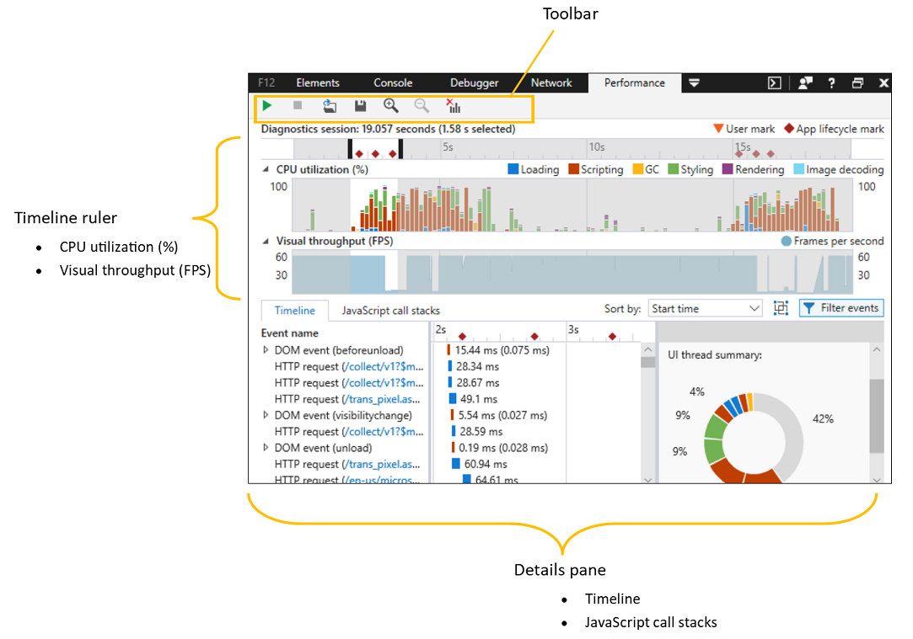
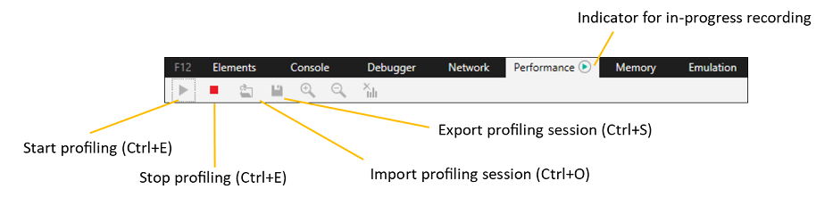
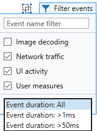
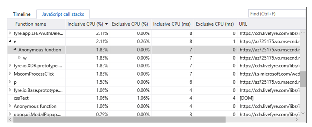

# パフォーマンスPerformance

パフォーマンス **パネル** には、ユーザー操作中の UI の応答性をプロファイリングおよび分析するためのツールが用意されています。The **Performance** panel offers tools for profiling and analyzing the responsiveness of your UI during the course of user interaction. この方法を使用すると、次の方法を行います。With it, you can:

 - [ページのさまざまなコンポーネント](#recording-a-profile) の実行時間を測定する[Measure execution times](#recording-a-profile) of the various components of your page 
 - [ページを実行するために最も多](#timeline-ruler) くの CPU サイクルを費やしている場所にドリルダウンし、結果としてユーザーに表示効果を与える[Drill down to where you're spending the most CPU cycles](#timeline-ruler) to run your page and the resulting visual effect for your users
 - [ページの実行時間を消費するプロセスの詳細を](#timeline-details) ステップバイステップで取得する[Get a step-by-step breakdown of the processes](#timeline-details) consuming page execution time 
 - [レイアウトの再計算が必要な](#javascript-call-stacks) 操作など、コストのかかる操作を識別するために JavaScript の呼び出し履歴を確認する[Walk your JavaScript call stacks](#javascript-call-stacks) to identify costly operations, such as those requiring layout recalculations 

## プロファイルの記録Recording a profile

ページのパフォーマンスを分析する最初の手順は、特定のユーザー シナリオを実行する際にプロファイルをキャプチャする手順です。たとえば、修正しようとしているパフォーマンス バグの再確認手順や、ユーザー エクスペリエンスを向上するために最適化する一般的な使用例です。The first step to analyzing the performance of your page is to capture a profile as you perform a particular user scenario, such as the repro steps of a performance bug you're trying to fix, or a typical use case you want to optimize for a better user experience. 

### ツール バーToolbar

パフォーマンス トレース**を**  /  **開始**および終了するには、ツール バー (または) の [開始停止] `Ctrl+E` ボタンを使用します。Use the **Start** / **Stop** buttons on the toolbar (or `Ctrl+E`) to initiate and conclude your performance trace. 緑色のインジケーターが [パフォーマンス] タブに表示されます。記録が進行中です。A green indicator will apear on the **Performance** tab to indicate a recording is in progress. 

プロファイルを停止すると、パフォーマンス レポートが生成されます。A performance report will generate upon stopping the profile. 後で DevTools でディスク ( ) に保存し、再読み込 `Ctrl+S` み ( `Ctrl+O` ) することができます。You can choose to save it to disk (`Ctrl+S`) and reload (`Ctrl+O`) in  DevTools at a later time.  DevTools 診断セッションは *、.diagsession 拡張機能と一緒に保存* されます。DevTools diagnostic sessions are saved with the *.diagsession* extension.

プロファイルを記録する際に注意する必要があるいくつかのことを次に示します。Here are some things to keep in mind when recording a profile:

- 分析しようとしているシナリオをキャプチャするために必要な操作を最も少なくします。Perform the fewest actions you need to capture the scenario you're trying to analyze. ページに対する余分な操作により、余分なデータが生成され、結果が乱雑になります。Extraneous actions with the page will produce extra data and clutter your results.

- プロファイラーは、ページ ナビゲーション [、DOMContentLoaded、](https://developer.mozilla.org/docs/Web/Events/DOMContentLoaded)ページ読み込みなど、レポート内の主要なアプリ ライフサイクル イベントを自動的にマーク [します](https://developer.mozilla.org/docs/Web/Events/load)。The profiler will automatically mark major app lifecycle events in the report, such as page navigation, [DOMContentLoaded](https://developer.mozilla.org/docs/Web/Events/DOMContentLoaded), and page [load](https://developer.mozilla.org/docs/Web/Events/load). カスタム マーカーを追加するには、コードまたはコンソール内から [Performance.mark()](https://developer.mozilla.org/docs/Web/API/Performance/mark) メソッドを呼び出します。You can add custom markers by calling the [Performance.mark()](https://developer.mozilla.org/docs/Web/API/Performance/mark) method from within your code or the console. 

- 初期ページの読み込み時間が分析に重要な場合は、(ネットワーク パネルから) ブラウザーのキャッシュをクリアして、すべてのページ リソースがネットワークから読み込み中である必要があります。If initial page load times are important to your analysis, make sure to clear your browser cache (from the [Network](./network.md) panel) to ensure all page resources are loading from the network.

- 場合によっては、複数のセッションを記録したり、異なるコンピューター間で同じシナリオをサンプルしたりして、パフォーマンスの問題を大自然に理解するのに役立つ場合があります。Sometimes it helps to record multiple sessions and/or sample the same scenario across different machines to better understand the performance issue in the wild.

## タイムライン ルーラーTimeline ruler

タイムラインはスライド ルーラーとして機能します。The timeline works as a sliding ruler. レポートの範囲を対象の特定の期間 (またはイベントの範囲) に制限するために使用します。Use it to limit the scope of the report to the particular timeframe (or span of events) of interest. 黒の **スライド** コントロールをドラッグして、調査する時間範囲を制限し、下部の [詳細] ウィンドウの [Timeline](#timeline-details) および [JavaScript](#javascript-call-stacks) コール スタック レポートから余分なプロファイリング データをフィルターで取り出 *します*。Drag the black **slide controls** to limit the time range you wish to investigate and filter out extraneous profiling data from the [Timeline](#timeline-details) and [JavaScript call stacks](#javascript-call-stacks) reports in the lower *Details pane*. 

ルーラーには次の 2 種類のマーカーが表示されます。You will see two types of markers on the ruler:

 - **タイムライン上のアプリ** のライフサイクル マーク (ページ ナビゲーション [、DOMContentLoaded、](https://developer.mozilla.org/docs/Web/Events/DOMContentLoaded)ページ読み込 [みなど)](https://developer.mozilla.org/docs/Web/Events/load)は、プロファイルを記録すると自動的に記録されます。**App lifecycle marks** on the timeline (such as page navigation, [DOMContentLoaded](https://developer.mozilla.org/docs/Web/Events/DOMContentLoaded), and page [load](https://developer.mozilla.org/docs/Web/Events/load)) are automatically logged as you record a profile.

 - **ユーザー マーク** は、コード内または DevTools コンソールから [Performance.mark()](https://developer.mozilla.org/docs/Web/API/Performance/mark) メソッドを呼び出して追加できるカスタム マーカー [**です**](./console.md)。**User marks** are custom markers you can choose to add  with calls to the [Performance.mark()](https://developer.mozilla.org/docs/Web/API/Performance/mark) method from within your code or the  DevTools [**Console**](./console.md). Performance.measure() メソッド*を使用すると*、開始マークと終了マークを 1 つの名前付[きのメジャーとしてグループ化](https://developer.mozilla.org/docs/Web/API/Performance/measure)できます。You can group *start* and *end* marks together as a single, named measure with the [Performance.measure()](https://developer.mozilla.org/docs/Web/API/Performance/measure) method. 

時間範囲を選択した後は、ツールバーからさらに拡大表示するか、ズームと選択解除 をリセットして パフォーマンス トレースの完全なビューに戻ります (時間範囲は選択されません)。 Once you have selected a time range, you can further **Zoom in** from the toolbar, or **Reset zoom** and **Clear selection** to return to the full view of the performance trace (with no time range selected). これらのコントロールは、右クリックのコンテキスト メニューから使用することもできます。These controls are also available from the right-click context menu.

### CPU 使用率CPU utilization

**CPU 使用率 % タイムライン**グラフは、ページの実行に必要なさまざまなブラウザー サブシステムによって消費される処理リソースを、カテゴリ別に示しています。The **CPU utilization %** timeline graph describes the processing resources consumed by the various browser subsystems required to run the page, broken out by category:

#### 読み込み中Loading
アプリ リソースの取得と HTML と CSS の解析に費やした時間を示します。Indicates time spent retrieving app resources and parsing HTML and CSS. これには、ネットワーク要求が含まれる場合があります。This can include network requests. タイムラインには、次の関連イベントが記録 [されます](#timeline-details)。The following associated events are logged in the [Timeline](#timeline-details):

イベントEvent | 説明Description
:------------ | :-------------
CssParsingCssParsing  | 解析が必要な新しい CSS コンテンツが検出されました。New CSS content was encountered that needed to be parsed.
HtmlParsingHtmlParsing | ノードに解析して DOM に挿入する必要がある新しい HTML コンテンツが検出されました。New HTML content was encountered that needed to be parsed into nodes and inserted into the DOM.
HttpRequestHttpRequest | DOM でリモート リソースが検出されたか、HTTP 要求を行う必要がある XMLHttpRequest が作成されました。A remote resource was encountered in the DOM or an XMLHttpRequest was created that required an HTTP request to be made.
HtmlSpeculativeDownloadingHtmlSpeculativeDownloading | ページの HTML コンテンツは、HTTP 要求を可能な限り迅速にスケジュールするために必要なリソースを検索しています。The page's HTML content was being searched for required resources so that the HTTP requests for them could be scheduled as quickly as possible.

#### スクリプトScripting
JavaScript の解析と実行に費やした時間を示します。Indicates time spent parsing and executing JavaScript. これには、DOM イベント、タイマー、スクリプト評価、およびアニメーション フレーム コールバックが含まれます。This includes DOM events, timers, script evaluation, and animation frame callbacks. タイムラインには、次の関連イベントが記録 [されます](#timeline-details)。The following associated events are logged in the [Timeline](#timeline-details):

イベントEvent | 説明Description
:------------ | :-------------
DomEventDomEvent | DOM オブジェクトでイベントが発生しました。An event was fired on a DOM object.
EvaluatingScriptEvaluatingScript | DOM `<script>` で新しい要素が検出され、解析と実行が必要でした。A new `<script>` element was encountered in the DOM and needed to be parsed and executed.
EventHandlerEventHandler | 登録されたイベント リスナーは、DOM イベントが発生した場合に応答してトリガーされました。A registered event listener was triggered in response to a DOM event being fired.
フレームFrame | 新しいフレームの準備中に、登録されたコールバックがトリガーされ、視覚的な変更が発生する可能性があります。While a new frame was being prepared a registered callback was triggered so that it could contribute visual changes.
測定値Measure | アプリ固有のシナリオは、このメソッドを使用して測定 `performance.measure()` されました。An app-specific scenario was measured using the `performance.measure()` method.
MediaQueryListenerMediaQueryListener | 登録されたメディア クエリが無効にされ、関連付けられたリスナーが実行されました。A registered media query was invalidated which resulted in the execution of its associated listener(s).
MutationObserverMutationObserver | 1 つ以上の確認済み DOM 要素が変更され、その結果、CallbackObserver に関連付けられたコールバックが実行されます。One or more observed DOM elements were modified which resulted in the execution of a MutationObserver's associated callback.
TimerFiredTimerFired | スケジュールされたタイマーが経過し、関連付けられたコールバックが実行されました。A scheduled timer elapsed which resulted in the execution of its associated callback.
WindowsRuntimeAsyncCallbackWindowsRuntimeAsyncCallback | 非同期操作は、コールバックをトリガーした Windows ランタイム オブジェクトによって完了 `Promise` しました。An async operation was completed by a Windows Runtime object which triggered a `Promise` callback.
WindowsRuntimeEventWindowsRuntimeEvent | 登録されたリスナーをトリガーした Windows ランタイム オブジェクトでイベントが発生しました。An event was fired on a Windows Runtime object which triggered a registered listener.

#### GCGC
使用されなくなったオブジェクトのメモリ収集に費やした時間を示します。Indicates time spent collecting memory for objects that are no longer in use. タイムラインには、次の関連イベントが記録 [されます](#timeline-details)。The following associated events are logged in the [Timeline](#timeline-details):

イベントEvent | 説明Description
:------------ | :-------------
ガベージ コレクションGarbageCollection | JavaScript ランタイムは、参照されなくなったオブジェクトを特定するために、アプリの現在のメモリ使用量を監査しました。そのため、どのオブジェクトが収集される可能性があります。The JavaScript runtime audited the app's current memory usage in order to determine which objects aren't being referenced anymore and could therefore be collected.

#### スタイル設定Styling
要素のプレゼンテーションとレイアウトの計算に費やした時間を示します。Indicates time spent calculating element presentation and layout. タイムラインには、次の関連イベントが記録 [されます](#timeline-details)。The following associated events are logged in the [Timeline](#timeline-details):

イベントEvent | 説明Description
:------------ | :-------------
AlignedBeatAlignedBeat | DOM に対して行われた保留中の視覚的な変更は、アプリの表示を更新するために処理されました。Pending visual changes that were made to the DOM were processed so that the app's display could be updated.
CssCalculationCssCalculation | DOM に変更が加えられたか、新しい CSS コンテンツが追加され、影響を受けるすべての要素のスタイル プロパティを再計算する必要がありました。Changes were made to the DOM or new CSS content was added, requiring the style properties of all affected elements to be recalculated.
レイアウトLayout | DOM に変更が加え、影響を受けるすべての要素のサイズや位置を計算する必要がありました。Changes were made to the DOM that required the size and/or position of all affected elements to be computed.

#### レンダリングRendering
画面の塗り分けに費やした時間を示します。Indicates time spent in painting the screen. タイムラインには、次の関連イベントが記録 [されます](#timeline-details)。The following associated events are logged in the [Timeline](#timeline-details):

イベントEvent | 説明Description
:------------ | :-------------
ペイントPaint | DOM に対して視覚的な変更が行われたので、ページの影響を受けるすべての部分を再描画する必要がありました。Visual changes were made to the DOM that required all affected portions of the page to be redrawn.
RenderLayerRenderLayer | DOM の個別にレンダリングされたフラグメント (レイヤーと呼ばれる) に対して視覚的な変更が行われたので、ページのそれぞれの部分を再描画する必要がありました。Visual changes were made to an independently rendered fragment of the DOM (called a layer) which required its respective portion of the page to be redrawn.

#### 画像のデコードImage decoding
イメージの解凍とデコードに費やした時間を示します。Indicates time spent decompressing and decoding images. タイムラインには、次の関連イベントが記録 [されます](#timeline-details)。The following associated events are logged in the [Timeline](#timeline-details):

イベントEvent | 説明Description
:------------ | :-------------
ImageDecodedImageDecoded | イメージは DOM に含まれており、元の形式からビットマップに解凍する必要がありました。An image was included into the DOM and needed be to decompressed from its original format into a bitmap.

### 視覚的なスループットVisual throughput

ビジュアル **スループット (FPS)** グラフは、プロファイリング シナリオの過程で 1 秒あたりの推定 *フレーム数* (FPS) を示します。60 FPS が理想的な表示速度です。The **Visual throughput (FPS)** graph shows the estimated *frames per second* (FPS) during the course of the profiling scenario, where 60 FPS is the ideal display rate. フレーム レートのディップはパフォーマンスのボトルネックを示し、フレーム レートがゼロの場合はフレームが完全にドロップされます。Dips in the frame rate indicate performance bottlenecks and a frame rate of zero means that frames are getting dropped entirely.

## タイムラインの詳細Timeline details

最も下の詳細ウィンドウを使用して、ページで発生した内容の詳細を取得します。Use the lowermost details pane to get the full breakdown of what happened on the page. [ **タイムラインの詳細]** タブには、さまざまなブラウザー サブシステム内で発生したイベントの詳細が表示されます。The **Timeline details** tab provides a breakdown of events that occurred within the various browser subsystems.

1. **イベント リストの並べ替えコントロールEvent list sort control**

    [並べ**替え]** ドロップダウン コントロールを使用して、[イベント リスト](#event-list)の順序を開始時刻と期間 (含む) の間*で切り替えてください*。Use the **Sort by** dropdown control to toggle the [Event list](#event-list) order between *Start time* or *Duration (inclusive*). これにより、選択したタイムラインの詳細 [のビューも変更されます](#selected-timeline-details)。This also changes the view of the [Selected timeline details](#selected-timeline-details).

2. **イベントをフレーム別にグループ化するGroup events by frame**

    フレームトグル でグループ トップ レベル イベントを使用して、アニメーションやビジュアル更新が発生していた期間中に、トップ レベル イベント (HTML 解析、*レイアウト、DOM*イベントなど) を対応する作業単位 (または "フレーム") にグループ化します。Use the **Group top level events by frames** toggle to group top-level events (*HTML parsing, Layout, DOM event,* etc.) into their corresponding unit of work (or "frame") during periods of time where animations/visual updates were occurring. フレームは他のイベントと同様に扱われるので、並べ替え/フィルター処理を 行い、イベント リストでクリックすると包括的な時刻の要約[を提供できます](#event-list)。The frames are treated like other events, so they can be sorted/filtered and provide an *Inclusive time* summary when clicked in the [Event list](#event-list).

3. **イベント リスト フィルター コントロールEvent list filter controls**

    [Filter **events] メニューを使用** して、タイムラインの詳細に表示されるイベントの種類を [構成します](#timeline-details)。Use the **Filter events** menu to configure the types of events shown in the [timeline details](#timeline-details). 

     

    次のフィルターを使用できます。The following filters are available:

   - **画像デコード**: バックグラウンド スレッドで発生したイベントを表示します (画像のデコード、GC など)。**Image decoding**: Show events which occurred on a background thread (e.g. Image decoding, GC). 
   - **ネットワーク トラフィック**: ネットワークにバインドされた HTTP 要求を表示します。**Network traffic**: Show HTTP requests which were network-bound.
   - **UI アクティビティ**: UI スレッドやレンダリング スレッド (DOM イベント ハンドラー、レイアウトなど) で発生したイベントを表示します。**UI activity**: Show events which occurred on the UI thread and/or render thread (e.g. DOM event handlers, Layout).
   - **ユーザーメジャー**: performance.measure() メソッドの呼び出しを示すカスタム イベントを表示します。**User measures**: Show custom events which indicate calls to the performance.measure() method.

     さらに、包括的な期間でトップ レベルのイベントをフィルター処理できます。You can further filter top-level events by their inclusive duration.

### イベント リストEvent list

イベント*リストには*、選択した期間中に発生したブラウザー サブシステム イベントの時系列リストが表示されます。The *Event list* gives you a chronological list of [browser subsystem events](#cpu-utilization) that occurred during the selected span of time. 

任意のエントリをクリックして、そのアイテムの **[選択したイベントの詳細** ] グラフに値を設定します。Click on any entry to populate the **Selected event details** chart for that item. 入れ子になったイベント/関数を含むエントリには、グラフに表示される包括的な時間(関数とその関数が呼び出した他の関数の実行に費やされた時間) と排他時間 (呼び出し元関数自体の本体内でのみ費やされた時間) が表示されます。Entries with nested events / functions will show their **inclusive** (time spent executing the function *and* any other functions it called) and **exclusive** (time spent only within the body of the calling function itself) times displayed in the chart.

任意のエントリを右クリックしてコンテキスト メニューを開き、タイムラインをそのイベントにのみフィルター処理し、イベントを担当するソース コードを[**デバッガー**](./debugger.md)  (該当する場合は [要素] パネル) に表示します。Right-click on any entry to open the context menu to filter the timeline to only that event and view the source code responsible for the event in the [**Debugger**](./debugger.md) (or [**Elements**](./elements.md) panel, if applicable).

### 選択したタイムラインの詳細Selected timeline details

選択 *したタイムラインの詳細は* 、選択した期間中の包括的/排他的なイベント時間の詳細な棒グラフを提供します。The *Selected timeline details* provides a detailed bar graph of inclusive/exclusive event times during the selected time span. イベント リストの並べ替えコントロールを 使用して*期間 (* 含む) で並べ替える場合、最も長い実行中のイベントは、このグラフで視覚的に目立っています。When you sort by *Duration (inclusive)* using the **Event list sort control**, the longest running events will visually stand out in this chart. 

### 選択したイベントの詳細Selected event details

このレポートでは、選択したイベントに関する詳細情報を 提供します。これには、開始時刻、実行中のスレッドの 種類 (ダウンロード *、UI、レンダリング*など)、特定のイベントの種類に固有のその他のコンテキスト詳細が含まれるものがあります。This report provides further information about the selected event, including *Start time*, the executing thread type (for example, *Download*, *UI*, *Render*), and other contextual details specific to the specific event type. たとえば、イベント リスナー *の種類は* 、コールバック関数とスケジュールの呼び出し履歴 *への* デバッガー *リンクを提供します*。For example, *Event listener* types provide debugger links to the *Callback function* and *Scheduling call stack*.

## JavaScript の呼び出し履歴JavaScript call stacks

**[JavaScript コール スタック]** タブは、選択した時間範囲内で実行されたスクリプト関数の CPU 使用率情報とタイミングを提供します。The **JavaScript call stacks** tab provides CPU usage information and timings for the script functions that ran during the selected time range:

 列Column | 説明Description
:------------ | :-------------
関数名Function name | ブラウザーまたはユーザー定義関数の名前。Name of browser or user-defined function.
包括 CPU (%)Inclusive CPU (%) | この関数およびこの関数によって呼び出される関数で選択された CPU アクティビティの割合。Percentage of selected CPU activity in this function and in functions called by this function.
排他 CPU (%)Exclusive CPU (%) | この関数で呼び出される関数のアクティビティを除く、この関数で選択された CPU アクティビティの割合。Percentage of selected CPU activity in this function, excluding activity in functions called by this function.
包括 CPU (ミリ秒)Inclusive CPU (ms) | この関数およびこの関数によって呼び出される関数でのコードの実行に費やされた CPU 時間。CPU time spent executing code in this function and in functions called by this function.
排他的 CPU (ミリ秒)Exclusive CPU (ms) | この関数で呼び出される関数の時間を除いて、この関数のコードの実行に費やされた CPU 時間。CPU time spent executing code in this function, excluding time in functions called by this function.
URLURL | スタック フレームが発生した URL。URL(s) where stack frame occurred. ブラウザー (標準ベースの Web API) から呼び出される関数呼び出しには *、[DOM] というラベルが付きます*。Function calls originating from the browser (standards-based web APIs) are labeled as *[DOM]*.

## ショートカットShortcuts

| 操作Action                         | ショートカットShortcut     |
|:-------------------------------|:-------------|
| プロファイリング セッションの開始/停止Start / Stop profiling session | `Ctrl` + `E` |
| プロファイリング セッションのインポートImport profiling session       | `Ctrl` + `O` |
| プロファイリング セッションのエクスポートExport profiling session       | `Ctrl` + `S` |

## 既知の問題Known Issues

### プロファイリング セッションの開始中にエラーが発生しましたAn error occurred while starting the profiling session

このエラー メッセージが表示された **場合:** パフォーマンス ツールでプロファイリング セッションの開始中にエラーが発生した場合は、次の手順に従って回避策を確認してください。If you see this error message: **An error occurred while starting the profiling session** in the Performance tool, follow these steps for a workaround.

1. を押 `Windows Key`  +  `R` します。Press `Windows Key` + `R`.

2. [ファイル名を指定して実行] ダイアログボックスに **、「services.msc」と入力します**。In the Run dialog, enter **services.msc**.

3. Microsoft **(R) Diagnostics Hub Standard Collector Service** を見つけて右クリックします。Locate the **Microsoft (R) Diagnostics Hub Standard Collector Service** and right-click it.

4. Microsoft **(R) Diagnostics Hub Standard Collector Service を再起動します**。Restart the **Microsoft (R) Diagnostics Hub Standard Collector Service**.

5. Microsoft Edge 開発者ツールとタブを閉じます。新しいタブを開き、ページに移動して、押します `F12` 。Close the Microsoft Edge Developer Tools and the tab. Open a new tab, navigate to your page, and press `F12`.

6. これで、プロファイリングを開始できます。You should now be able to begin profiling.

それでも問題が発生しますか?Still running into problems? フィードバックの送信アイコンを使用して、フィードバック **をお送り** ください。Please send us your feedback using the **Send feedback** icon! 

### プロファイリング セッションの停止中にエラーが発生しました。An error occurred while stopping the profiling session.

このエラー メッセージが表示された **場合:** パフォーマンス ツールでプロファイリング セッションを停止中にエラーが発生した場合は、次の手順に従って回避策を確認してください。If you see this error message: **An error occurred while stopping the profiling session** in the Performance tool, follow these steps for a workaround.

1. を押 `Windows Key`  +  `R` します。Press `Windows Key` + `R`.

2. [ファイル名を指定して実行] ダイアログボックスに **、「services.msc」と入力します**。In the Run dialog, enter **services.msc**.

3. Microsoft **(R) Diagnostics Hub Standard Collector Service** を見つけて右クリックします。Locate the **Microsoft (R) Diagnostics Hub Standard Collector Service** and right-click it.

4. Microsoft **(R) Diagnostics Hub Standard Collector Service を再起動します**。Restart the **Microsoft (R) Diagnostics Hub Standard Collector Service**.

5. Microsoft Edge 開発者ツールとタブを閉じます。新しいタブを開き、ページに移動して、押します `F12` 。Close the Microsoft Edge Developer Tools and the tab. Open a new tab, navigate to your page, and press `F12`.

6. これで、プロファイリングを開始できます。You should now be able to begin profiling.

それでも問題が発生しますか?Still running into problems? フィードバックの送信アイコンを使用して、フィードバック **をお送り** ください。Please send us your feedback using the **Send feedback** icon! 

