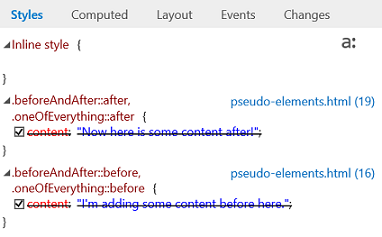
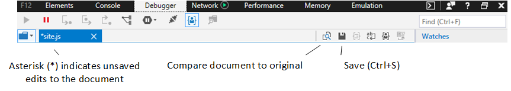

# Windows 10 Fall Creators Update の DevTools (EdgeHTML 16)

このリリースでは、堅牢性とパフォーマンスの向上に向けた主要な DevTools リファクタリング作業を開始し、今すぐ使用を開始できる一連の新機能も追加しました。 

[Windows 10 Fall Creators Update](/windows/uwp/whats-new/windows-10-build-16299) [(EdgeHTML 16)](https://aka.ms/devguide_edgehtml_16)に同梱されている Microsoft Edge DevTools の機能を次に示します。

## 先祖イベント リスナー 

[**イベント**] ウィンドウに、現在選択されている要素の先祖 (要素パネル) に登録されているイベント リスナー**** と、要素自体に登録されているイベント リスナーを表示するオプションが追加されました。 さらに、イベント リスナーの表示を Event または *Element* でグループ化 *できます*。 

## DOM のブレークポイント

DOM のブレークポイントを設定して、選択した要素ノードが変更されるたびにデバッガーにブレークすることができます。 [ **要素]** パネルで、DOM ツリー ビューの任意の要素を rt-click して、次の 1 つ以上を選択します。

 - ノードの削除時にブレーク
 - 変更されたサブツリーでブレーク
 - 属性の変更時にブレーク

[要素] パネルまたはデバッガー パネルの **[DOM** ブレークポイント] ウィンドウから、ブレークポイント **の** ブレークポイント **を管理** できます。

![[DOM ブレークポイント] ウィンドウ](../media/elements_dom_breakpoints.png)

## CSS のルールでのサポート

CSS "at" (@) ルールは、アニメーション ルール**** `@keyframes` (現在は読み取り専用に制限されています)、機能クエリ、クエリなど、スタイル ウィンドウの他の CSS ルール宣言の中で表されます。 `@supports` `@media`

## [CSS フォント] ウィンドウ

CSS ルールには、フォントの読み込み先 (ローカルまたはネットワーク) とそのフォントを使用している文字の数を表示する専用のフォント ウィンドウが `@font-face` 追加されました。 **** ** ** フォントがネットワークから読み込まれると、DevTools は、エイリアスとフォントの種類と共にインポートしたルールを表示します。

## CSS 擬似要素のサポート

スタイル **ウィンドウ** では、独自の見出しの下に擬似要素がグループ化され、そのコンテンツがクロスアウトとして表示されなくなりました。

**変更前:**
 

**変更後:**
 

## コンソールの機能強化

コンソール **パネル** では、操作性を向上し、Intellisense エクスペリエンスをより高速で充実させた UX オーバーホールを利用しました。

**前:** 

**後:** 

さらに、次の機能強化が追加されました。

 -  コマンド `Shift + Enter` を実行する前に、追加の行をコマンドに追加するために使用します `Enter` 。 (以前は、複数行モード *または単一行モードへの切り替えボタン* があります)。

 - 次の新しい API がサポートされています。
    - [ **console.table(**_object_*_)_*](../console/console-api.md#organizing-log-output)メソッド
    - [ **getEventListeners(**_object_*_)_*](../console/command-line.md#event-listeners)コマンド
    - [ **keys(**_object_*_)_*](../console/command-line.md#object-inspection)コマンド
    - [ **values(**_object_*_)_*](../console/command-line.md#object-inspection)コマンド
    - [ **$x(**_xpath 式_*_)_*](../console/command-line.md#dom-selectors)セレクター

 - [**%c()**](../console/console-api.md#logging-custom-messages)書式設定パラメーターがサポートされる

## デバッグの機能強化

[デバッガーは、PWA](#progressive-web-app-debugging)サービス ワーカーとキャッシュをデバッグする一部の新機能に加えて、次の機能を追加しました。

### 共有リソースの統合デバッグ

CDN から読み込まれたファイルなどのリソースがコード全体で複数回参照されている場合でも、DevTools はそのファイルに対して 1 つのデバッグ インスタンスを提供し、そのファイルが参照されている場所に関係なくヒットする一般的なブレークポイントを設定できます。 (以前は、各スクリプト参照は固有のリソースと見なされ、別のブレークポイントのセットにマップされます)。

### アイドル時編集を使用して JavaScript *をライブ編集する*

これで、デバッグ セッション中に JavaScript ライブを編集できます。 この機能は、[以前の](https://blogs.windows.com/buildingapps/2017/04/05/windows-10-creators-update-creators-update-sdk-released/#MMhK2OdcrR12Vi6u.97)*(Windows 10 Creators Update)* リリースで (フラグの背後で) 試験的に利用可能であり、現在は永続的な機能です。 デバッガー パネルから任意のスクリプト**** ファイルを選択し、編集し、[保存] **(または**) をクリックして、次にコードのセクションが実行される時に変更 `Ctrl+S` をテストします。 

 

[元 **のドキュメントと比較] ボタン** をクリックして、変更した変更の違いを表示します。

 

次の制約に注意してください。

- スクリプトの編集は、外部 *の .js ファイル* でのみ機能します (.html に `<script>` 埋め込 *まれているのではなく*)
- 編集内容はメモリに保存され、ドキュメントが再読み込みされた場合にフラッシュされます。そのため、ハンドラー内で編集を実行できません。たとえば、 `DOMContentLoaded`
- 現時点では、DevTools からディスクに**** 編集内容を保存する方法 ([名前を付けて保存] オプションなど) はありません。

## ショートカット

他の主要なブラウザーと同様に、DevTools を前回表示したパネル ( ) またはコンソール ( ) に直接 `Ctrl+Shift+I` `Ctrl+Shift+J` 起動できます。

## 段階的な Web アプリのデバッグ

Microsoft Edge と DevTools での段階的な Web アプリ (PAS) の**** 試験的なサポートをテストするには、[サービス ワーカーを有効にする] オプションを選択 `about:flags` し、Microsoft Edge を再起動します。 サイトでサービス ワーカーや**** キャッシュ**API**を利用する場合、Web ストレージや Cookie**** の検査の動作と同様に、各オリジンのデバッガー パネルにエントリが設定されます。

特定のサービス ワーカー エントリをクリックすると、 **サービス**ワーカーの概要が開き、指定したスコープのサービス ワーカー登録を管理し、テスト プッシュ通知を強制できます。 個々のサービス**ワーカー** / **を停止**し、個別**** のデバッガー ウィンドウから検査することもできます。

![[サービス ワーカーの概要] ウィンドウ](../media/debugger_sw_overview.png)

サービス ワーカーのデバッグについては、次の点に注意してください。

 - サービス ワーカーは複数のタブで共有できるので、サービス ワーカーをデバッグすると、ページのツールとは別に DevTools の新しいインスタンスが起動します。 
 - 要素[と](../elements.md)[エミュレーション](../emulation.md)パネルは、サービス ワーカーがバックグラウンドで実行され、アプリのフロントエンドを直接制御しなことを考えると、サービス ワーカー デバッガーから離れたものになります。
 - 現在、サービス ワーカーのネットワーク トラフィックは、そのワーカーの DevTools デバッグ インスタンスからのみ報告され、ページ自体の中央インスタンスからのみ報告されます。

特定のキャッシュ エントリをクリックすると、キャッシュ**** マネージャーが開き、キャッシュ エントリ *(要求*キーと応答キー/値** のペア) を検査し、必要に応じて削除できます。
