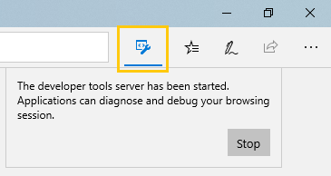

# <a name="microsoft-edge-edgehtml-devtools-protocol"></a>Microsoft Edge (EdgeHTML) DevTools プロトコル

> [!NOTE]
> Microsoft Edge (EdgeHTML) DevTools プロトコルは [、Windows 10 April 2018 Update](https://blogs.windows.com/windowsexperience/2018/04/30/how-to-get-the-windows-10-april-2018-update/#5VXkQMU41CJzZPER.97) 以降のビルドでのみ動作します。

開発者ツールは **、Microsoft Edge (EdgeHTML) DevTools プロトコル** を使用して、Microsoft Edge (EdgeHTML) ブラウザーを検査およびデバッグできます。 さまざまな [Domains](0.2/domains/index.md) of EdgeHTML エンジンインストルメンテーションに編成された一連のメソッドとイベントを提供します。

 ツール クライアントは、Microsoft Edge (EdgeHTML) または Windows デバイス ポータルによってホストされる *DevTools Server* と交換される JSON Web ソケット メッセージを使用して、これらのメソッドを呼び出し、これらのイベントを監視できます。 Microsoft Edge (EdgeHTML) DevTools は[](0.2/clients.md#microsoft-edge-devtools-preview)、このプロトコルを使用して[、Microsoft Store](https://www.microsoft.com/store/p/microsoft-edge-devtools-preview/9mzbfrmz0mnj)から利用できるスタンドアロンの DevTools クライアントから Microsoft Edge (EdgeHTML) を実行しているホスト マシンのリモート デバッグを有効にします。

Microsoft Edge (EdgeHTML) DevTools プロトコルは、このリリースでは相互運用性のギャップが既知ですが、Chrome DevTools プロトコルと密接に一致するように設計されています [(「W3C WICG for DevTools Protocols」](https://github.com/WICG/devtools-protocol/)を参照)。

## <a name="using-the-protocol"></a>プロトコルの使用

Microsoft Edge (EdgeHTML) の DevTools Server にカスタム ツール クライアントを接続する方法を次に示します。 Microsoft Edge DevTools [を](0.2/clients.md#microsoft-edge-devtools-preview) クライアントとして使用している場合は、リモート デバッグの手順を参照してください。

1. 開く URL を指定して、リモート デバッグ ポートを開いた Microsoft Edge (EdgeHTML) を起動します。 次に、例を示します。

    ```shell
    MicrosoftEdge.exe --devtools-server-port 9222 https://www.bing.com
    ```

    Edge が既に起動されている場合、URL パラメーターは省略可能です。 開発者ツール サーバーが起動したかどうかを示すボタンがブラウザーのアドレス バー **の横に** 表示されます。

     

2. 接続可能 [なページ ターゲット](0.2/http.md) の一覧を取得するには、次の HTTP エンドポイントを使用します。

    ```http
    http://localhost:9222/json/list
    ```

3. 目的のページの一覧に接続して、さらにプロトコル コマンドを発行し、devtools ソケット サーバーを介してイベント メッセージ `webSocketDebuggerUrl` を受信します。 [](0.2/domains/index.md)

## <a name="status-and-feedback"></a>状態とフィードバック

DevTools プロトコルのバージョン[0.2](0.2/index.md)には、バージョン[0.1](0.1/index.md)で導入されたコア スクリプト デバッグ機能に加えて、スタイルとレイアウト (読み取り専用) デバッグおよびコンソール API 用の新しいドメインが提供されています。 Microsoft Edge DevTools UI では、これは要素、コンソール、デバッガー[****](../devtools-guide/elements.md)パネルで使用できる[**機能**](../devtools-guide/console.md)に[**変換**](../devtools-guide/debugger.md)されます。

Edge DevTools プロトコルを試してありがとう! 次の場所でフィードバックをお寄せください。

<!-- - [**Microsoft Edge Developer UserVoice**](https://wpdev.uservoice.com/forums/257854-microsoft-edge-developer?category_id=84475): DevTools feature ideas and requests-->  

 - [**EdgeHTML Issue Tracker**](https://developer.microsoft.com/microsoft-edge/platform/issues/): プロトコル、DevTools、EdgeHTML プラットフォームのバグと問題

 - [**Microsoft Edge DevTools フィードバック ハブ**](feedback-hub:?referrer=microsoftEdge&tabID=2&newFeedback=true&ContextId=344): フィードバック ハブ アプリによるプロトコルと DevTools の問題と提案

## <a name="faq"></a>FAQ

#### <a name="can-multiple-clients-connect-to-the-same-devtools-server"></a>複数のクライアントが同じ DevTools Server に接続できますか?
いいえ、クライアントがデバッグする場合は同時ではありません。 接続する最後のクライアントは、前のクライアントを開始します。 今後、追加のツールがサポートされる場合、同時クライアント接続がサポートされる可能性があります。

#### <a name="do-i-have-to-use-9222-as-the-devtools-server-port"></a>DevTools Server ポートとして 9222 を使用する必要がありますか?
いいえ、 任意のポートを指定することができますが、まだ使用されていないポートを選択してください。 リモート デバッグ用のポート 9222 は、規則によって使用されます。

#### <a name="how-do-i-connect-my-custom-tooling-client-to-microsoft-edge-edgehtml-running-the-devtools-server"></a>DevTools Server を実行している Microsoft Edge (EdgeHTML) にカスタム ツール クライアントを接続する方法
ローカル [*コンピューターで実行されている*](#using-the-protocol) Microsoft Edge (EdgeHTML) に接続するには、上記のプロトコル手順を使用するを参照してください。 リモート デバッグをサポートする場合は、ホスト コンピューターの SSL 証明書をクライアントにインストールするユーザー ワークフロー ( [たとえば、Microsoft Edge DevTools Preview](./0.2/clients.md#microsoft-edge-devtools-preview) が使用するインストール ダイアログなど) を作成する必要があります。

#### <a name="if-im-remote-debugging-using-edge-devtools-do-i-need-to-start-the-host-browser-process-with---devtools-server-port-cmd-line-switch"></a>Edge DevTools を使用してリモート デバッグを行う場合 *、--devtools-server-port cmd* 行スイッチを使用してホスト ブラウザー プロセスを開始する必要がありますか? 
いいえ、 [Microsoft Edge DevTools Preview](./0.2/clients.md#microsoft-edge-devtools-preview)を使用してリモート デバッグを設定する場合、Edge の起動にはコマンド ライン スイッチ `--devtools-server-port` は必要ありません。 この場合、Windows *デバイス ポータルは* ブラウザーの代わりに DevTools Server をホストしています。

#### <a name="can-i-use-the-edge-devtools-protocol-to-remotely-debug-a-wwahostexe-or-webview-process"></a>Edge DevTools プロトコルを使用して、リモートでアプリケーション プロセスまたは webview プロセスWWAHost.exeデバッグできますか?
エッジ DevTools プロトコルは現在、ブラウザー タブのみをサポートしています。 WWAHost.exe Webview プロセスはサポートされていません。
