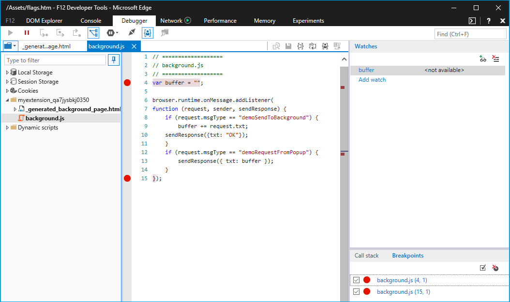
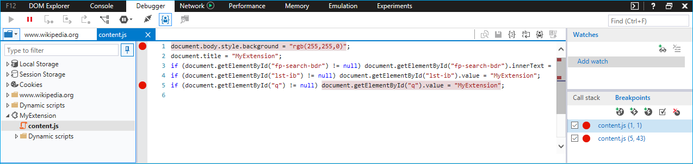
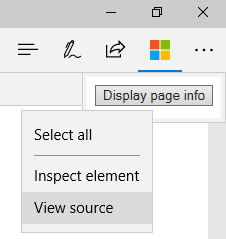

# 拡張機能のデバッグ  

[!INCLUDE [deprecation-note](../includes/deprecation-note.md)]  

F12 開発者ツールを使用して、Microsoft Edge で拡張機能をデバッグできます。

次のビデオでは、Microsoft Edge の拡張機能を利用して、それぞれのデバッグ シナリオを説明し、途中で修正します。 詳しくは、以下の詳しい手順をご覧ください。

> [!VIDEO https://channel9.msdn.com/Blogs/One-Dev-Minute/Debugging-Microsoft-Edge-Extensions/player]

> [!NOTE]
> F12 で拡張機能のデバッグを利用するには、まず about:flags で開発者向け機能を有効にする必要があります。 この [方法の詳細については、「拡張機能の追加](./adding-and-removing-extensions.md) と削除」を参照してください。

## バックグラウンド スクリプトのデバッグ
拡張機能のバックグラウンド スクリプトのデバッグを開始するには、次のコマンドを実行します。

1. [その他 **] (...)** の後に [拡張機能] を **クリックして、** 拡張機能ウィンドウに移動します。  
 ![[その他] ボタン](./../media/morebutton.png)
2. デバッグする拡張機能をクリックします。
3. [バックグラウンド] **ページのリンクをクリック** して、バックグラウンド プロセス用に F12 キーを表示します。  
 ![[inspect] リンクを含むオプションの選択された拡張機能ビュー](./../media/debug-inspect.png)
4. F12 **の [デバッガー** ] タブを選択します。
5. 拡張機能のバックグラウンド スクリプトに移動して選択します。
6. ソース コード行番号の左側をクリックして、デバッグ用のブレークポイントを配置します。  
 
7. [コンソール] **タブを** 選択し、コマンド " を実行します `location.reload()` 。 これにより、バックグラウンド スクリプトが再び実行され、コードをステップ実行できます。  
 

## コンテンツ スクリプトのデバッグ
拡張機能のコンテンツ スクリプトのデバッグを開始するには、次のコマンドを実行します。

1. [その他] **(...)** ボタンに移動して **[F12 開発者** ツール] を選択するか、キーボードで F12 キーを押して、F12 を起動します。
2. 拡張機能のコンテンツ スクリプトに移動して選択します。 現在実行されている拡張機能のコンテンツ スクリプトは、拡張機能ごとに異なるフォルダーで示されます。

    > [!NOTE]
    > 実行中のコンテンツ スクリプトだけが表示されます。

3. ソース コード行番号の左側をクリックして、デバッグ用のブレークポイントを配置します。  
 
4. ブラウザーのタブを更新して、コードのステップ実行を開始します。

## 拡張機能ページのデバッグ

デバッグのために拡張機能ページのソース コードにアクセスするために使用できるメソッドは 2 種類あります。 1 つのメソッドはさまざまなページに適用されます。もう 1 つのメソッドはポップアップ ページでのみ機能します。

### 拡張機能ページのデバッグ
次のメソッドは、オプション ページやポップアップなど、すべての拡張機能ページに対して機能します。

1. ページの背景を右クリックします。
2. [ソース **の表示] を選択します**。

   

3. F12 キーが開いたら、デバッグするファイル内にブレークポイントを配置します。

   
4. [コンソール] **タブを** 選択し、コマンドを実行します `location.reload()` 。 これにより、ページ スクリプトが再び実行され、コードをステップ実行できます。  

   

### ポップアップ拡張機能ページのデバッグ
拡張ページをデバッグする方法はポップアップ拡張ページにも適用されます。次の手順では、ポップアップをデバッグする別の方法の概要を示します。

1. 拡張機能のアイコンを右クリックします。
2. [ポップアップ **の検査] を選択します**。

   
3. ブレークポイントを配置してポップアップを再読み込みするには、上記の手順 3 と 4 に従います。
