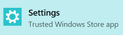

# 国際化  

[!INCLUDE [deprecation-note](../includes/deprecation-note.md)]  

さまざまなユーザーが拡張機能にアクセスしやすくするために、他の国を念頭に置いて開発することが重要です。 Microsoft Edge 拡張機能を使用すると、さまざまな言語文字列を拡張機能に追加して、言語を簡単に変更できます。

拡張機能の国際化について詳しくは、MDN の国際化ガイド [をご覧ください](https://developer.mozilla.org/Add-ons/WebExtensions/Internationalization)。

## 言語のテスト

言語文字列をテストするには、まず Windows 表示言語をテストする言語に設定する必要があります。

Windows 表示言語を変更するには、次の手順に従います。

1. 設定アプリを開きます。

   
2. [言語の時刻&選択します。
3. [地域の言語&選択します。
4. [+ 言語の追加] を選択して、使用できる言語の一覧に言語を追加します。
5. テストする言語の一覧から言語を選択します。
6. [既定として設定] ボタンを選択します (PC の再起動が必要な場合があります)。
7. Microsoft Edge を開き、ロケールに定義されている文字列が期待通り表示されるのを確認します。

[NavigatorLanguage.language](https://developer.mozilla.org/docs/Web/API/NavigatorLanguage/language)プロパティを使用すると、Microsoft Edge が Windows 表示言語と判断した言語が正しいか確認できます。

ブラウザーの表示言語を確認するには、以下の CodePen のボタンをクリックします。

<iframe height='300' scrolling='no' title='ロケールを取得する' src='//codepen.io/MSEdgeDev/embed/VaRWwR/?height=300&theme-id=23761&default-tab=result&embed-version=2&editable=true' frameborder='no' allowtransparency='true' allowfullscreen='true' style='width: 100%;'>CodePen で MSEdgeDev ( @MSEdgeDev ) による Pen Get ロケール   <a href='http://codepen.io'> を参照してください </a> 。
</iframe>
