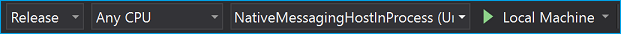
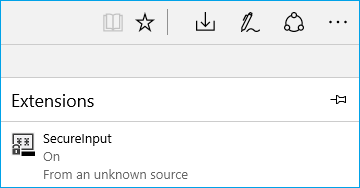
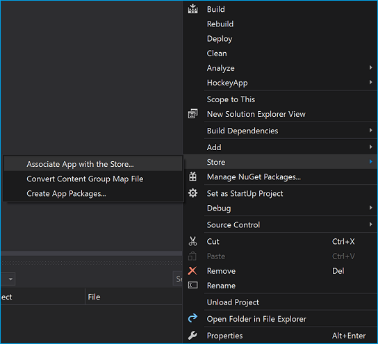

# <a name="native-messaging-in-microsoft-edge"></a>Microsoft Edge でのネイティブ メッセージング  

[!INCLUDE [deprecation-note](../includes/deprecation-note.md)]  

## <a name="native-messaging-architecture-overview"></a>ネイティブ メッセージング アーキテクチャの概要  

Windows 10 Creators Update を使用すると、Microsoft Edge 拡張機能はネイティブ メッセージングを使用して、コンパニオンユニバーサル Windows プラットフォーム \(UWP\) アプリと通信できます。  高レベルでは、Microsoft Edge 拡張機能は、Chrome 拡張機能や Firefox 拡張機能と同じ API をネイティブ メッセージングに使用します。  ただし、ネイティブ メッセージング ホストはユニバーサル Windows プラットフォームを使用して実装する必要があります。  

> [!NOTE]
> \(AppService\経由で UWP アプリに接続する) で説明するメソッドは、Microsoft Edge 拡張機能とネイティブ コンポーネント間の通信を有効にする唯一のサポートされるメカニズムです。  従来の[](#adding-a-desktop-bridge-component)Win32 コンポーネントとの通信を有効にする方法の詳細については、このガイドの「デスクトップ ブリッジ コンポーネントの追加」セクションを参照してください。  

Microsoft Edge のネイティブ メッセージング アーキテクチャは、既存の API を基になるプロセス間通信 [`AppService`](/uwp/api/Windows.ApplicationModel.AppService?view=winrt-19041&preserve-view=true) \(IPC\) インフラストラクチャとして活用します。  UWP アプリは API を `AppService` 使用して相互に通信します。  これにより、Microsoft Edge 拡張機能は UWP アプリと通信できます。  

  

### <a name="when-and-when-not-to-use-native-messaging"></a>ネイティブ メッセージングを使用しない場合と使用しない場合  

ネイティブ メッセージングは、拡張機能に新しいレイヤーを追加します。  拡張機能に UWP コンパニオン アプリを実装すると、次の可能性が利用できます。  

*   コンパニオン UWP アプリとデータ \(資格情報\など) を同期します。  
*   Web API では使用できない、より強力な暗号化/復号化アルゴリズムを実装します。  
*   ハードウェアや USB デバイスなど、Web API を介してアクセスできないリソースにアクセスする  

セキュリティまたはポリシーの制限のためにネイティブ メッセージングを使用しない場合は、次に示すいくつかの例があります。  

*   既定のブラウザーまたは検索プロバイダーの変更など、Microsoft Edge または Windows のユーザー設定を変更する。  
*   アプリと拡張機能の両方に対する Microsoft Store ポリシーに違反するアクション。  
*   ネイティブ メッセージ ホスト経由でリモート エンドポイントにデータを転送する。  
*   拡張機能の動作を変更するコンテンツを他のアプリがダウンロードすることを許可する。  

## <a name="demos"></a>デモ  

コンパニオン UWP アプリとデスクトップ ブリッジの両方を持つ Microsoft Edge ネイティブ メッセージング拡張機能の外観を確認するには、GitHub の [SecureInput](https://github.com/MicrosoftEdge/MicrosoftEdge-Extensions-Demos/tree/master/SecureInput) と [DigitalSigning (C++)](https://github.com/MicrosoftEdge/MicrosoftEdge-Extensions-Demos/tree/master/DigitalSigning) の例を参照してください。  

### <a name="how-it-works"></a>動作のしくみ  

サンプルの Microsoft Edge 拡張コンポーネントは、コンテンツ スクリプトを使用して、ユーザーが暗号化する必要がある情報を入力する際に検出します。  拡張機能は、ネイティブ メッセージングを介してデスクトップ ブリッジ コンポーネントにこれを通信します。  ユーザーがデータを送信する準備ができたら、拡張機能は暗号化された値を Web サイトに返します。  

> [!NOTE]
> このサンプルは、カスタム イベントを使用して拡張機能のコンテンツ スクリプトと通信する Web ページでのみ動作します。  サンプル フォルダーには、拡張子をテスト [する .html](https://github.com/MicrosoftEdge/MicrosoftEdge-Extensions-Demos/blob/master/SecureInput/SecureInput.html) ファイルが含まれています。  

この例では、UWP アプリを使用してデスクトップ ブリッジから Microsoft Edge に応答を渡し、コールバックを介して Microsoft Edge 拡張機能に送信されます。  この例では、メイン アプリでネイティブ メッセージング ホストを実行しますが、バックグラウンド タスクとして実行することもできます。  2 つを切り替えるには、内線の背景スクリプトを編集し、文字列をに変更する必要 `port = browser.runtime.connectNative("NativeMessagingHostInProcessService");` があります `"NativeMessagingHostOutOfProcess"` 。  

## <a name="chrome-vs-microsoft-edge-implementation"></a>Chrome と Microsoft Edge の実装  

Chrome では、拡張機能にメッセージを渡す API を使用してアプリと通信しますが、Microsoft Edge は API を利用して Microsoft Edge 拡張機能と UWP アプリの通信を可能 [`AppService`](/uwp/api/Windows.ApplicationModel.AppService?view=winrt-19041&preserve-view=true) にしています。  

このセクションでは、Chrome と Microsoft Edge がネイティブ メッセージングの実装を処理する方法の違いについて説明します。  

### <a name="registration-and-host-manifest"></a>登録マニフェストとホスト マニフェスト  

拡張機能でアプリをネイティブ メッセージング ホストとして認識するには、アプリを登録する必要があります。  

[Chrome ネイティブ メッセージング ホスト](https://developer.chrome.com/extensions/nativeMessaging)の登録では、アプリは、ネイティブ メッセージング ホスト構成を定義する Windows ファイル システムの任意の場所にマニフェスト ファイルをインストールする必要があります。  

次の JSON は、構成ファイルの設定の例です。  

```json
{
   "name": "com.my_company.my_application",
   "description": "My Application",
   "path": "C:\\ProgramFiles\\MyApplication\\chrome_native_messaging_host.exe",
   "type": "stdio",
   "allowed_origins": [
      "chrome-extension://knldjmfmopnpolahpmmgbagdohdnhkik/"
    ]
}
```  

このファイルをインストールするには、アプリで次の手順を実行する必要があります。  

1.  ホスト構成を定義するレジストリの定義済みの場所にマニフェスト ファイルを登録します。  
    *   `HKEY_LOCAL_MACHINE\SOFTWARE\Google\Chrome\NativeMessagingHosts\com.my_company.my_application`  
        
        or  
    *   `HKEY_CURRENT_USER\SOFTWARE\Google\Chrome\NativeMessagingHosts\com.my_company.my_application`  
        
1.  マニフェスト ファイルの完全パスに、そのキーの既定値を設定します。たとえば、 `[HKEY_CURRENT_USER\Software\Google\Chrome\NativeMessagingHosts\com.my_company.my_application] @="C:\\path\\to\\nmh-manifest.json"`  

Microsoft Edge の場合、\(ネイティブ メッセージング ホスト\) を登録するには、拡張子と同じパッケージに UWP コンパニオン アプリを含め、プロジェクトのファイルに [`AppService`](/uwp/api/Windows.ApplicationModel.AppService?view=winrt-19041&preserve-view=true) [AppService](/windows/uwp/launch-resume/how-to-create-and-consume-an-app-service)拡張機能を指定する必要があります。 `Package.appxmanifest`  属性 `EntryPoint` と `Name` 属性は、ユーザーが構成できます。  

```xml
...
<Applications>    
    <Application Id="App"         
        <Extensions>        
            <uap:Extension Category="windows.appService" EntryPoint="MyAppService.Inventory">          
            <uap:AppService Name="com.microsoft.inventory"/>        
            </uap:Extension>      
        </Extensions>      
        ...   
    </Application>
</Applications>
```  

また、サービスへの接続を許可する拡張機能を設定する必要があります。  Microsoft Edge には AppxManifest には同等のマニフェスト プロパティが存在しないので、UWP アプリによって実行時にこれを決定して適用する `"allowed_origins"` 必要があります。  Microsoft Edge は拡張機能の代わりに接続を確立しますので、アプリは呼び出し元のパッケージ ファミリ名を検索して、呼び出し元を制御または認証するために拡張機能が Microsoft Edge によって接続されているかどうかを判断します。  次に例を示します。   

```csharp
protected async override void
OnBackgroundActivated(BackgroundActivatedEventArgs args)
{
    IBackgroundTaskInstance taskInstance = args.TaskInstance;
    if (taskInstance.TriggerDetails is AppServiceTriggerDetails)
    {
        AppServiceTriggerDetails appService = taskInstance.TriggerDetails as AppServiceTriggerDetails;
        if (appService.CallerPackageFamilyName == EdgePFN)
        {
            // Establish the connection
        }
        else
        {
            // Reject the connection
        }
    }
}
```  

### <a name="message-sending"></a>メッセージの送信  

アプリと拡張機能が相互に通信するには、メッセージの送信と送信が必要です。  

Chrome 拡張機能は、API を使用してメッセージを開始し、永続的でないチャネルを使用してネイティブ ホスト [`runtime.sendNativeMessage`](https://developer.mozilla.org/Add-ons/WebExtensions/API/runtime/sendNativeMessage) にメッセージを配信します。  

```javascript
chrome.runtime.sendNativeMessage(string application, object message, function responseCallback)
```  

最初のパラメーターはネイティブ ホストの名前で、Chrome はマニフェストのレジストリで検索します。  マニフェストは、Chrome がサンドボックスで起動する .exe を指定し、メッセージは std i/o を使用して送信されます。  
拡張機能では、API を使用して永続的なチャネルも確立します。これはネイティブ ホストの名前を唯一の `runtime.connectNative` パラメーターとして受け取ります。  

Microsoft Edge では、Chrome のネイティブ メッセージング API と同じ構成を使用して、Microsoft Edge 拡張機能が接続先のアプリ サービスを指定できます。  最初のパラメーターは `runtime.sendNativeMessage` 、アプリ サービス名を指定します。  [登録と [ホスト マニフェスト] セクションで](#registration-and-host-manifest) 、次の値を指定します `"com.microsoft.inventory"` 。  Microsoft Edge 拡張機能プラットフォームは、ネイティブ メッセージング ホストを拡張機能と同じ AppX にパッケージ化された UWP アプリに制限します。  これにより、マニフェスト エントリを改ざんして Microsoft Edge を別のパッケージ ファミリ名に接続しようとする悪意のある攻撃に関連するセキュリティ リスクが軽減されます。  

つまり、Microsoft Edge は、API で指定された名前に加えて、拡張機能と同じパッケージ ファミリ名を使用して、アプリ サービスのプロバイダーを一意に `AppService` 識別します。  

> [!NOTE]
> これは、Microsoft Edge Extension ファイルによって簡単[に変換Toolkit。](./porting-chrome-extensions.md)  アクセス許可を指定する拡張機能には、このコンポーネントの手動変換が必要として `"nativeMessaging"` フラグが設定されます。  

### <a name="communication-protocol"></a>通信プロトコル  

ネイティブ メッセージングの通信プロトコルは、送信前にメッセージの書式設定方法を決定します。  

Chrome は、各ネイティブ メッセージング ホストを個別のプロセスで開始し、標準の入力と標準出力を使用してそのホストと通信します。  両方向にメッセージを送信するには、同じ形式が使用されます。各メッセージは JSON を使用してシリアル化され、UTF-8 エンコードされ、ネイティブ バイト順で 32 ビット のメッセージ長が先行します。  

Microsoft Edge では、アプリ サービスを実装するバックグラウンド タスク/メイン アプリがプラットフォームによって開始されます。  起動時に、 `Run` バックグラウンド タスクのメソッドが呼び出されます。  

```csharp
public void Run(IBackgroundTaskInstance taskInstance)    
{
    this.backgroundTaskDeferral = taskInstance.GetDeferral();
    // Get a deferral so that the service is not stopped and ended.
    taskInstance.Canceled += OnTaskCanceled;
    // Associate a cancellation handler with the background task.
    // Retrieve the app service connection and set up a listener for incoming app service requests.
    var details = taskInstance.TriggerDetails as AppServiceTriggerDetails;
    appServiceconnection = details.AppServiceConnection;
    appServiceconnection.RequestReceived += OnRequestReceived;
}
```  

拡張機能が UWP アプリにメッセージを送信すると、 [`onRequestReceived`](/uwp/api/Windows.ApplicationModel.AppService.AppServiceConnection?view=winrt-19041&preserve-view=true) イベントが発生します。  この JSON 形式のメッセージは、オブジェクトの最初の KeyValue ペアに文字列化 [`ValueSet`](/uwp/api/Windows.Foundation.Collections.ValueSet?view=winrt-19041&preserve-view=true) されます。  :  

```csharp
private async void OnRequestReceived(
AppServiceConnection sender,
AppServiceRequestReceivedEventArgs args)
{
    ...
}
```  

UWP アプリが拡張機能に応答を送信すると、オブジェクトに a [`KeyValuePair`](/dotnet/api/system.collections.generic.keyvaluepair-2?view=netcore-3.1&preserve-view=true) が追加 `ValueSet` されます。  プロパティ `Key` は Microsoft Edge では無視されますが、プロパティ `Value` には有効な JSON 文字列が含まれます。  

### <a name="callback"></a>コールバック  

コールバックの場合、Chrome はコールバック関数がメッセージの送信から非同期応答を処理 [`runtime.sendNativeMessage`](https://developer.mozilla.org/Add-ons/WebExtensions/API/runtime/sendNativeMessage) するために使用します。  

Microsoft Edge では、 [`SendResponseAsync`](/uwp/api/Windows.ApplicationModel.AppService.AppServiceRequest?view=winrt-19041&preserve-view=true) オブジェクトのメソッド [`AppServiceRequest`](/uwp/api/Windows.ApplicationModel.AppService.AppServiceRequest?view=winrt-19041&preserve-view=true) を使用して、アプリがオブジェクトを拡張機能 [`ValueSet`](/uwp/api/Windows.Foundation.Collections.ValueSet?view=winrt-19041&preserve-view=true) に戻します。  

### <a name="message-size-limit"></a>メッセージ サイズの制限  

拡張機能とアプリの間で送信されるメッセージには、Chrome と Microsoft Edge のメッセージ サイズの制限が異なります。  

Chrome には、次のメッセージ サイズの制限があります。  

*   ネイティブ メッセージング ホストからの 1 つのメッセージ制限: 1 MB  
*   ネイティブ メッセージング ホストに送信される 1 つのメッセージ制限: 4 GB  

Microsoft Edge の場合、メッセージ サイズ \(memory\に依存) は制限されませんが、Microsoft Edge は、次のメッセージ サイズの制限を課して、ネイティブ アプリの動作を誤って行うのを禁止 `AppService` します。  

*   UWP アプリから拡張機能への 1 つのメッセージ制限: 1 MB  
*   拡張機能から UWP アプリへの 1 つのメッセージ制限: 100 MB  

### <a name="native-messaging-connections"></a>ネイティブ メッセージング接続  

ネイティブ メッセージングには 2 種類の接続があります。永続的および非永続的。  
永続的 **な** 接続とは、ポートが破棄されるまで実行され続けた接続です。  非 **永続的な接続は** 、一度に 1 つのメッセージに対して開き、配信後に閉じる接続です。  

#### <a name="persistent"></a>永続的  

Chrome の場合、永続的な接続は、 を使用してメッセージング ポートを作成することで行います [`runtime.connectNative`](https://developer.mozilla.org/Add-ons/WebExtensions/API/runtime/connectNative) 。  ポートが作成されると、Chrome はネイティブ メッセージング ホスト プロセスを開始し、破棄されたポートまで実行を続ける。  

Microsoft Edge の場合、メッセージング ポートを使用して作成すると、Microsoft Edge はポートを起動し、ポートが破棄されるまで実行 `runtime.connectNative` [`AppServiceConnection`](/uwp/api/Windows.ApplicationModel.AppService.AppServiceConnection?view=winrt-19041&preserve-view=true) を続ける。  次のスニペットは、UWP アプリ内から永続的な接続が確立される方法を示しています。  

```csharp
this.inventoryService = new AppServiceConnection();  
// Here, we use the app service name provided via the runtime.connectNative API  
this.inventoryService.AppServiceName = "com.microsoft.inventory";  
// Use the same Package Family Name as the extension package
this.inventoryService.PackageFamilyName = "replace with the Package Family Name";  
var status = await
this.inventoryService.OpenAsync();
```  

#### <a name="non-persistent"></a>非永続的  

Chrome でメッセージング ポートを作成せずにメッセージを送信すると、メッセージごとに新しいネイティブ メッセージング ホスト プロセス [`runtime.sendNativeMessage`](https://developer.mozilla.org/Add-ons/WebExtensions/API/runtime/sendNativeMessage) が開始されます。  ホスト プロセスによって生成された最初のメッセージは、元の要求に対する応答として処理され、無視された後の他のすべてのメッセージが処理されます。  

Microsoft Edge は、各メッセージに対する応答が受信された後、接続を停止および終了します。  次のスニペットは、要求を受信して保存した後、UWP アプリ内で終了する非永続的な接続を `AppServiceConnection` 示しています [`AppServiceResponse`](/uwp/api/Windows.ApplicationModel.AppService.AppServiceResponse?view=winrt-19041&preserve-view=true) 。  

```csharp
using (var connection = new AppServiceConnection())
{    
    //Set up a new app service connection
    connection.AppServiceName = "com.microsoft.randomnumbergenerator";
    connection.PackageFamilyName = "Microsoft.SDKSamples.AppServicesProvider.CS_8wekyb3d8bbwe";
    AppServiceConnectionStatus status = await connection.OpenAsync();
    AppServiceResponse response = await connection.SendMessageAsync(inputs);
}
```  

### <a name="permission"></a>許可  

拡張機能でネイティブ メッセージングの使用を有効にするには、Chrome と Microsoft Edge の両方で、ファイルでアクセス許可 `"nativeMessaging"` を宣言する必要 `manifest.json` があります。  

## <a name="app-services"></a>アプリ サービス  

このセクションでは、アプリ サービスが Microsoft Edge ネイティブ メッセージングのパフォーマンスとメモリに与える影響について説明します。  

### <a name="performance"></a>パフォーマンス  

アプリ サービスは、ネイティブ メッセージングの目的で Microsoft Edge を呼び出すフォアグラウンド アプリによって "スポンサー" されます。  つまり、Microsoft Edge が実行されている限り、アプリ サービスを実行できます。  

待機時間に関して、アプリ サービスは名前付きパイプを使用し、最初の接続後に 2 つのアプリが直接通信できます。  この通信方法では、低遅延が発生します。  CPU が遅いデバイスでは、アプリ サービスをホストするプロセスを開始した後に初期待機時間が発生します \(~80ms)、一部のデバイスでバックグラウンド タスクを起動します\)。  起動後、低速の CPU デバイスのパフォーマンスは良好です。  

### <a name="memory"></a>メモリ  

アプリ サービスに割り当てられたメモリは、Microsoft Edge に割り当てられたクォータから取り出されます。  つまり、Microsoft Edge で開始されるアプリ サービスが多すぎると、メモリが使い切れる可能性があります。  通常のバックグラウンド タスクのメモリ上限は、アプリ サービスに適用されます。  たとえば、512 MB デバイスでは、アプリ サービスのバックグラウンド タスクを 16 MB 以下にできます。  この番号は、デバイスのスケール アップに合って上がっています。  

## <a name="creating-an-extension-with-native-messaging"></a>ネイティブ メッセージングを使用した拡張機能の作成  

ネイティブ メッセージングをテストするには、拡張機能にパッケージ ファミリ名が必要です。  Microsoft Edge では、これを使用してネイティブ メッセージ ホスト ID を決定します。つまり、拡張機能をパッケージ化する必要があります。  

ネイティブ メッセージングを使用して拡張機能を作成するには、次Visual Studio。  

1.  UWP プロジェクトを作成するには、Visual Studio。  
1.  [ `AppService` UWP アプリに追加します](/windows/uwp/launch-resume/how-to-create-and-consume-an-app-service)。  
    *   必要に応じて [、 `AppService` この](/windows/uwp/launch-resume/convert-app-service-in-process) 時点でバックグラウンド タスクとしてではなく、メイン アプリでホストされる構成を行います。  
1.  UWP プロジェクトをビルドしてテストします。  
    *   必要に応じて、デスクトップ ブリッジ [コンポーネントを追加できます](#adding-a-desktop-bridge-component)。  
1.  ネイティブ メッセージングを使用して UWP コンパニオン アプリと通信する Microsoft Edge 拡張機能を作成します。  拡張ファイルは、UWP プロジェクトの名前 `Extension` のフォルダーに追加できます。  このフォルダーの下のすべてのファイル (サブフォルダーを含む) は、そのプロパティを構成する必要 `Build Action=Content` があります `Copy to Output Directory=Copy Always` 。  これらのプロパティ `manifest.json` も構成されていることを確認します。  
1.  プロジェクト内のファイルを変更して拡張メタデータを含め、次の項目を追加してヘッドレス `package.manifest.xml` アプリに変換します `AppListEntry="none"` 。  
    
    ```xml
    <Package
    xmlns="http://schemas.microsoft.com/appx/manifest/foundation/windows10" 
    xmlns:rescap="http://schemas.microsoft.com/appx/manifest/foundation/windows10/restrictedcapabilities" 
    xmlns:mp="http://schemas.microsoft.com/appx/2014/phone/manifest" 
    xmlns:uap="http://schemas.microsoft.com/appx/manifest/uap/windows10" 
    xmlns:uap3="http://schemas.microsoft.com/appx/manifest/uap/windows10/3"
    IgnorableNamespaces="uap uap3 mp rescap build" 
    xmlns:build="http://schemas.microsoft.com/developer/appx/2015/build">
    
    <Dependencies>
        <TargetDeviceFamily Name="Windows.Desktop" MinVersion="10.0.15063.0" MaxVersionTested="10.0.15063.0" />
    </Dependencies>
       
       <Application Id="App" Executable="$targetnametoken$.exe" EntryPoint="NativeMessagingHostInProcess.App">
          <uap:VisualElements AppListEntry="none"
            DisplayName="SecureInput"
            Square150x150Logo="Assets\Square150x150Logo.png"
            Square44x44Logo="Assets\Square44x44Logo.png"
            Description="NativeMessagingHostInProcess"
            BackgroundColor="transparent">
          </uap:VisualElements>
          <Extensions>
            <uap3:Extension Category="windows.appExtension">
                <uap3:AppExtension
                    Name="com.microsoft.edge.extension"
                    Id="EdgeExtension"
                    PublicFolder="Extension"
                    DisplayName="ms-resource:DisplayName">
                </uap3:AppExtension>
            </uap3:Extension>
          </Extensions>
    </Application>
    ```  
    
1.  ネイティブ メッセージング `AppService` API で UWP 用に構成された名前を使用します。  
1.  UWP [プロジェクト](#deploying) \(オプションのデスクトップ ブリッジ コンポーネント\を使用して) をビルドして展開します。  
1.  [ストア](#packaging) 申請の準備ができたら、ネイティブ メッセージング拡張機能をパッケージ化する  
    
> [!NOTE]
> 完全な [ネイティブ メッセージング拡張機能](#demos) の例については、「Demos」セクションを参照してください。  

## <a name="adding-a-desktop-bridge-component"></a>デスクトップ ブリッジ コンポーネントの追加  

デスクトップ ブリッジ コンポーネントをパッケージに追加する場合は、Win32 プロジェクトを作成してビルドする必要Visual Studio。  win32 アプリを UWP に変換する方法については、「デスクトップ ブリッジ経由でアプリを [Windows 10](/windows/uwp/porting/desktop-to-uwp-root)に移植する」を参照してください。  ビルドが完了Visual Studio、次の手順を実行して、Win32 実行可能ファイルをパッケージに追加できます。  

1.  Win32 プロジェクトを UWP プロジェクトと同じソリューションに追加します。  
1.  Win32 プロジェクトを UWP プロジェクトの依存プロジェクトとして設定します。  
    
      
    
1.  `Win32`UWP プロジェクト内にフォルダーを作成します。  プロジェクトに必要なバイナリを `Win32` このフォルダーにコピーします。  など、すべてのバイナリのプロパティを `Build Action=Content` 構成します `Copy to Output Directory=Copy Always` 。  
    
      
    
1.  PostBuild イベント コマンドを使用して、プロジェクトに必要なすべてのバイナリをこのフォルダーにコピーするには、UWP プロジェクト ファイル `Win32` を変更します。  これにより、ソリューションが再構築される度に、更新されたバイナリがフォルダーにコピーされます。  
    
    ```xml
    <Target Name="AfterBuild">
    <Copy SourceFiles="..\PasswordInputProtection\bin\$(Configuration)\PasswordInputProtection.exe" DestinationFolder="win32" />
    <Copy SourceFiles="..\PasswordInputProtection\bin\$(Configuration)\PasswordInputProtection.exe.config" DestinationFolder="win32" />
    <Copy SourceFiles="..\PasswordInputProtection\bin\$(Configuration)\PasswordInputProtection.pdb" DestinationFolder="win32" />
    </Target>
    ```  
    
1.  要素 `package.manifest.xml` を要素に追加 `<desktop:Extension>` して変更 `<Extensions>` します。  
    
    ```xml
    <Extensions>
    <desktop:Extension Category="windows.fullTrustProcess"Executable="Win32\PasswordInputProtection.exe"
    xmlns:desktop="http://schemas.microsoft.com/appx/manifest/desktop/windows10" />
    </Extensions>
    ```  
    
## <a name="deploying"></a>展開  

上記で説明した UWP プロジェクト \(およびオプションで Win32 project\) を構成したら、ソリューションを展開する準備が整い、Visual Studio。  

  

ソリューションが正しく展開された後、Microsoft Edge に拡張機能が表示されます。  

  

## <a name="packaging"></a>パッケージ化  

> [!NOTE]
> Microsoft Edge 拡張機能を Microsoft Store に提出する機能は、現在制限付き機能です。  [Microsoft Store の一](https://developer.microsoft.com/microsoft-edge/extensions/requests/) 部として要求を送信し、将来の更新プログラムと見なします。  

組み込みの機能を使用して Windows デベロッパー センターに提出するためのストア パッケージをVisual Studioできます。  

  

## <a name="debugging"></a>デバッグ  

デバッグの手順は、テストするコンポーネントによって異なります。  

### <a name="debugging-the-extension"></a>拡張機能のデバッグ  

ソリューションを展開すると、拡張機能が Microsoft Edge にインストールされます。  拡張機能のデバッグ [方法については](./debugging-extensions.md) 、「デバッグ ガイド」を参照してください。  

### <a name="debugging-the-uwp-app"></a>UWP アプリのデバッグ  

拡張機能がネイティブ メッセージング API を使用して接続しようとすると、UWP アプリ [が起動します](https://developer.mozilla.org/Add-ons/WebExtensions/API/runtime/connectNative)。  プロセスが開始された後にのみ、UWP アプリをデバッグする必要があります。  これは、プロジェクトの [プロパティ] ページを使用して構成できます。  

1.  [Visual Studio UWP アプリ プロジェクトにマウス ポインターを置き、コンテキスト メニュー \(右クリック\) を開きます。  
1.  プロパティの **選択**  
1.  [起動 **しない] をオンにし、起動時にコードをデバッグする**  
    
    ![[起動しない] ボックスを選択する](../media/native-message-do-not-launch.png)  
    
このVisual Studio、デバッグするコードでブレークポイントを設定し、F5 キーを押してデバッガーを起動できます。  拡張機能を操作して UWP アプリに接続すると、Visual Studioプロセスに自動的に接続されます。  

### <a name="debugging-the-desktop-bridge"></a>デスクトップ ブリッジのデバッグ  

デスクトップ ブリッジ [\(](/windows/msix/desktop/desktop-to-uwp-debug) 変換された Win32 app\) をデバッグする方法はさまざまな場合でも、このシナリオに適用できる唯一の方法は PLMDebug オプションです。  また、デバッグ コードをスタートアップ関数に追加して、特定の時間の待機を実行し、プロセスにVisual Studioすることができます。  
