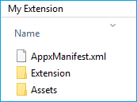
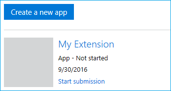
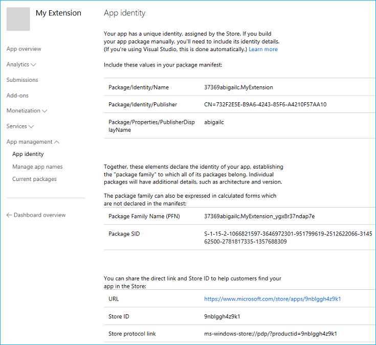
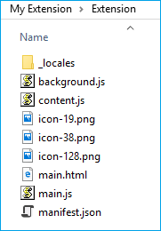

# <span data-ttu-id="07eb4-104">Microsoft Edge 拡張機能 AppX パッケージの作成とテスト</span><span class="sxs-lookup"><span data-stu-id="07eb4-104">Creating and testing a Microsoft Edge extension AppX package</span></span>  

[!INCLUDE [deprecation-note](../../includes/deprecation-note.md)]  

<span data-ttu-id="07eb4-105">Microsoft Edge 拡張機能は、ユニバーサル Windows アプリのパッケージ化と同様に、AppX としてパッケージ化されます。</span><span class="sxs-lookup"><span data-stu-id="07eb4-105">Microsoft Edge extensions are packaged as AppX, similar to how Universal Windows Apps are packaged.</span></span> <span data-ttu-id="07eb4-106">Windows 10 Anniversary Update では、AppX 用に新しいスキーマが導入され、AppX に Microsoft Edge 拡張機能をコンテンツとして含めさせることができます。</span><span class="sxs-lookup"><span data-stu-id="07eb4-106">As of Windows 10 Anniversary Update, a new schema has been introduced for AppX that allows an AppX to include a Microsoft Edge extension as its content.</span></span>

<span data-ttu-id="07eb4-107">Microsoft Edge 拡張機能の AppX の作成方法が既にわかっている場合は [、「ExtensionJS](./using-manifoldjs-to-package-extensions.md) を使って拡張機能をパッケージ化する」にスキップして、Node.js ベースのツールを使ってこのすべての手順を実行する方法について説明します。</span><span class="sxs-lookup"><span data-stu-id="07eb4-107">If you already know how Microsoft Edge extension AppXs are created, you can skip to [Using ManifoldJS to package extension](./using-manifoldjs-to-package-extensions.md) to learn how to use a Node.js based tool to do all of this for you!</span></span>

> [!NOTE]
> <span data-ttu-id="07eb4-108">Microsoft Store に Microsoft Edge 拡張機能を提出する機能は、現在制限されています。</span><span class="sxs-lookup"><span data-stu-id="07eb4-108">Submitting a Microsoft Edge extension to the Microsoft Store is currently a restricted capability.</span></span> <span data-ttu-id="07eb4-109">拡張機能を作成、パッケージ化、テストしたら、拡張機能の提出フォームで要求 [を送信してください](https://aka.ms/extension-request)。</span><span class="sxs-lookup"><span data-stu-id="07eb4-109">Once you've created, packaged and tested your extension, please submit a request on our [extension submission form](https://aka.ms/extension-request).</span></span>

## <span data-ttu-id="07eb4-110">提出フォルダーの準備</span><span class="sxs-lookup"><span data-stu-id="07eb4-110">Preparing the submission folder</span></span>

<span data-ttu-id="07eb4-111">提出用に拡張機能を準備するには、次の構造のフォルダーを作成する必要があります。</span><span class="sxs-lookup"><span data-stu-id="07eb4-111">To prepare your extension for submission, you need to create a folder with the following structure:</span></span>



<span data-ttu-id="07eb4-114">フォルダーのルートに、新しいファイルをAppXManifest.xmlがあります。</span><span class="sxs-lookup"><span data-stu-id="07eb4-114">At the root of the folder, you should include an AppXManifest.xml file.</span></span> <span data-ttu-id="07eb4-115">このファイルは、パッケージの内容とレイアウトを指定するために使用されます。</span><span class="sxs-lookup"><span data-stu-id="07eb4-115">This file is used to specify the contents and layout of the package.</span></span>

<span data-ttu-id="07eb4-116">また、Microsoft Store で使用する UI アセットを含む Assets フォルダーと、拡張機能のファイル (スクリプト、アイコンなど) を含む拡張フォルダーも必要です。</span><span class="sxs-lookup"><span data-stu-id="07eb4-116">You should also have an Assets folder which contains the UI assets to be used in the Microsoft Store, and an Extension folder that contains your extension's files (scripts, icons, etc).</span></span>

> [!IMPORTANT]
> <span data-ttu-id="07eb4-117">パッケージ用に別のフォルダー構造を作成できますが、フォルダー構造は AppXManifest の値と一致している必要があります。</span><span class="sxs-lookup"><span data-stu-id="07eb4-117">You can create a different folder structure for your package, but the folder structure must match the AppXManifest values.</span></span>

### <span data-ttu-id="07eb4-118">AppXManifest.xml</span><span class="sxs-lookup"><span data-stu-id="07eb4-118">AppXManifest.xml</span></span>
<span data-ttu-id="07eb4-119">AppXManifest ファイルは、システムが Windows アプリを展開、表示、または更新するために必要な情報を含む XML ドキュメントです。</span><span class="sxs-lookup"><span data-stu-id="07eb4-119">The AppXManifest file is an XML document that contains info the system needs to deploy, display, or update a Windows app.</span></span> <span data-ttu-id="07eb4-120">このファイルには、パッケージ ID、機能、ビジュアル要素も含まれています。</span><span class="sxs-lookup"><span data-stu-id="07eb4-120">This file also includes package identity, capabilities, and visual elements.</span></span> <span data-ttu-id="07eb4-121">すべてのアプリ パッケージには、1 つの AppXManifest ファイルを含める必要があります。</span><span class="sxs-lookup"><span data-stu-id="07eb4-121">Every app package must include one AppXManifest file.</span></span>

<span data-ttu-id="07eb4-122">開発者は、次のテンプレートを使用してファイルAppXManifest.xmlできます。</span><span class="sxs-lookup"><span data-stu-id="07eb4-122">Developers can use the following template for their AppXManifest.xml file:</span></span>

```xml
<?xml version="1.0" encoding="utf-8"?>
<Package
  xmlns="http://schemas.microsoft.com/appx/manifest/foundation/windows10"
  xmlns:uap="http://schemas.microsoft.com/appx/manifest/uap/windows10"
  xmlns:uap3="http://schemas.microsoft.com/appx/manifest/uap/windows10/3"
  IgnorableNamespaces="uap3">

  <Identity
    Name="[REPLACE WITH PACKAGE/IDENTITYNAME]"
    Publisher="[REPLACE WITH PACKAGE/IDENTITY/PUBLISHER]"
    Version="[REPLACE WITH PACKAGE VERSION in the form X.X.X.0]"/>

  <Properties>
    <DisplayName>[REPLACE WITH RESERVED STORE NAME]</DisplayName>
    <PublisherDisplayName>[REPLACE WITH PACKAGE/PROPERTIES/PUBLISHERDISPLAYNAME]</PublisherDisplayName>
    <Logo>[REPLACE WITH RELATIVE PATH TO 50x50 ICON]</Logo>
  </Properties>

  <Dependencies>
    <TargetDeviceFamily Name="Windows.Desktop"
      MinVersion="10.0.14393.0"
      MaxVersionTested="10.0.14800.0" />
  </Dependencies>

  <Resources>
    <Resource Language="en-us"/>
  </Resources>

  <Applications>
    <Application Id="App">
      <uap:VisualElements
        AppListEntry="none"
        DisplayName="[REPLACE WITH RESERVED STORE NAME]"
        Square150x150Logo="[REPLACE WITH RELATIVE PATH TO 150x150 ICON]"
        Square44x44Logo="[REPLACE WITH RELATIVE PATH TO 44x44 ICON]"
        Description="This is the description of the extension"
        BackgroundColor="white">
      </uap:VisualElements>
    <Extensions>
    <uap3:Extension Category="windows.appExtension">
    <uap3:AppExtension Name="com.microsoft.edge.extension"
        Id="EdgeExtension"
        PublicFolder="Extension"
      DisplayName="[REPLACE WITH RESERVED STORE NAME]">
    </uap3:AppExtension>
    </uap3:Extension>
    </Extensions>
 </Application>
</Applications>
</Package>
```  

#### <span data-ttu-id="07eb4-123">アプリ ID テンプレートの値</span><span class="sxs-lookup"><span data-stu-id="07eb4-123">App identity template values</span></span>
<span data-ttu-id="07eb4-124">Windows デベロッパー[](./extensions-in-the-windows-dev-center.md#name-reservation)センターで拡張機能の名前を予約すると、次の値を置き換えるのに必要なパッケージ ID 情報を検索AppXManifest.xml。</span><span class="sxs-lookup"><span data-stu-id="07eb4-124">Once you've [reserved the name of your extension](./extensions-in-the-windows-dev-center.md#name-reservation) through the Windows Dev Center, you'll be able to find the necessary package identity information needed to replace the following values in AppXManifest.xml:</span></span>

-   `Name`
-   `Publisher`
-   `DisplayName`
-   `PublisherDisplayName`

<span data-ttu-id="07eb4-125">次の手順を使用して、アプリ ID ページにアクセスできます。</span><span class="sxs-lookup"><span data-stu-id="07eb4-125">You can access your App identity page using the following steps:</span></span>

1.  <span data-ttu-id="07eb4-126">Windows デベロッパー [センターに移動します](https://developer.microsoft.com/windows/)。</span><span class="sxs-lookup"><span data-stu-id="07eb4-126">Navigate to [Windows Dev Center](https://developer.microsoft.com/windows/).</span></span>
2.  <span data-ttu-id="07eb4-127">開発者アカウントにサインインします。</span><span class="sxs-lookup"><span data-stu-id="07eb4-127">Sign in to your developer account.</span></span>
3.  <span data-ttu-id="07eb4-128">ダッシュボードに移動します。</span><span class="sxs-lookup"><span data-stu-id="07eb4-128">Navigate to the Dashboard.</span></span>
4.  <span data-ttu-id="07eb4-129">拡張機能の名前を選択します。</span><span class="sxs-lookup"><span data-stu-id="07eb4-129">Select the name of your extension.</span></span>
    
    
    
5.  <span data-ttu-id="07eb4-131">アプリの管理セクションの下にある [アプリ ID] ページに移動します (アプリを登録した後)。</span><span class="sxs-lookup"><span data-stu-id="07eb4-131">Navigate to the App identity page which is under the App management section (after you've registered your app).</span></span>
    
    
    
<span data-ttu-id="07eb4-133">これで、次のように、AppXManifest テンプレートにアプリ ID ページの値を設定できます。</span><span class="sxs-lookup"><span data-stu-id="07eb4-133">You can now populate the AppXManifest template with values from the App identity page, as indicated in the template:</span></span>

```xml
<Identity
  Name="37369abigailc.MyExtension"
  Publisher="CN=732F2E5E-B9A6-4243-85F6-A4210F57AA10"
  Version="[REPLACE WITH PACKAGE VERSION in the form X.X.X.0]" />

<Properties>
  <DisplayName>My Extension</DisplayName>
  <PublisherDisplayName>abigailc</PublisherDisplayName>
  <Logo>[REPLACE WITH RELATIVE PATH TO 50x50 ICON]</Logo>
</Properties>
```  

#### <span data-ttu-id="07eb4-134">JSON マニフェスト テンプレートの値</span><span class="sxs-lookup"><span data-stu-id="07eb4-134">JSON manifest template values</span></span>
<span data-ttu-id="07eb4-135">AppXManifest の一部の値は、JSON マニフェストで定義されている値と一致する必要があります。</span><span class="sxs-lookup"><span data-stu-id="07eb4-135">Some values in the AppXManifest need to match those that are defined in the JSON manifest.</span></span> <span data-ttu-id="07eb4-136">拡張機能の JSON マニフェストに基づいてappxmanifest.xmlの値を更新してください。</span><span class="sxs-lookup"><span data-stu-id="07eb4-136">Please update the following values in appxmanifest.xml based on your extension JSON manifest:</span></span>

-   `Version` <span data-ttu-id="07eb4-137">- これは拡張機能の JSON マニフェストに一覧表示されているバージョンです。</span><span class="sxs-lookup"><span data-stu-id="07eb4-137">- This is the version listed in your extension's JSON manifest.</span></span> <span data-ttu-id="07eb4-138">文字列は、最後の整数が 0 である必要がある X.X.X.X.X 形式と一致する必要があります。</span><span class="sxs-lookup"><span data-stu-id="07eb4-138">The string needs to match the X.X.X.X format where the last integer has to be 0.</span></span> <span data-ttu-id="07eb4-139">例:</span><span class="sxs-lookup"><span data-stu-id="07eb4-139">E.g.</span></span> <span data-ttu-id="07eb4-140">1.2.3.0</span><span class="sxs-lookup"><span data-stu-id="07eb4-140">1.2.3.0</span></span>
    
    ```xml
    <Identity
         Name="37369abigailc.MyExtension"
         Publisher="CN=732F2E5E-B9A6-4243-85F6-A4210F57AA10"
         Version="1.0.0.0" />
    ```  
    
-   `Description` <span data-ttu-id="07eb4-141">- これは拡張機能の JSON マニフェスト内の説明のコピーです。</span><span class="sxs-lookup"><span data-stu-id="07eb4-141">- This is a copy of the description in your extension's JSON manifest.</span></span>
    
    ```xml
    <uap:VisualElements
         AppListEntry="none"
         DisplayName="My Extension"
         Square150x150Logo="[REPLACE WITH RELATIVE PATH TO 150x150 ICON]"
         Square44x44Logo="[REPLACE WITH RELATIVE PATH TO 44x44 ICON]"
         Description="This extension will allow you to quickly print by clicking the browser action."
         BackgroundColor="white">
    </uap:VisualElements>
    ```  
    
### <span data-ttu-id="07eb4-142">Assets フォルダー</span><span class="sxs-lookup"><span data-stu-id="07eb4-142">Assets folder</span></span>

<span data-ttu-id="07eb4-143">Assets フォルダー内には、3 つの異なるアイコン サイズが必要です。</span><span class="sxs-lookup"><span data-stu-id="07eb4-143">Within the Assets folder you will need three different icon sizes.</span></span> <span data-ttu-id="07eb4-144">これらのアイコンは、Microsoft Store と Windows UI で使います。</span><span class="sxs-lookup"><span data-stu-id="07eb4-144">These icons will be used in the Microsoft Store and the Windows UI.</span></span> <span data-ttu-id="07eb4-145">これらのアイコンについて詳しくは、デザイン ガイドをご [覧](./../design.md#icons-for-packaging) ください。</span><span class="sxs-lookup"><span data-stu-id="07eb4-145">For more information on these icons, see the [Design](./../design.md#icons-for-packaging) guide.</span></span>


<span data-ttu-id="07eb4-147">必要な UI アセットを作成したら、次のAppXManifest.xmlをポイントして更新します。</span><span class="sxs-lookup"><span data-stu-id="07eb4-147">Once you've created the necessary UI assets, update AppXManifest.xml to point to the correct files:</span></span>

-   <span data-ttu-id="07eb4-148">44 x 44</span><span class="sxs-lookup"><span data-stu-id="07eb4-148">44x44</span></span>
    
    ```xml
    Square44x44Logo="Assets/icon_44.png"
    ```  
    
-   <span data-ttu-id="07eb4-149">50x50</span><span class="sxs-lookup"><span data-stu-id="07eb4-149">50x50</span></span>
    
    ```xml
    <Logo>Assets/icon_50.png</Logo>
    ```  
    
-   <span data-ttu-id="07eb4-150">150 x 150</span><span class="sxs-lookup"><span data-stu-id="07eb4-150">150x150</span></span>
    
    ```xml
    Square150x150Logo="Assets/icon_150.png"
    ```  
    
### <span data-ttu-id="07eb4-151">拡張フォルダー</span><span class="sxs-lookup"><span data-stu-id="07eb4-151">Extension folder</span></span>
<span data-ttu-id="07eb4-152">(フォルダー構造を維持する) 拡張子ファイルを拡張フォルダーにコピーします。</span><span class="sxs-lookup"><span data-stu-id="07eb4-152">Copy your extension files (keeping the folder structure) into the Extension folder.</span></span> <span data-ttu-id="07eb4-153">ルートに `manifest.json` Extension フォルダーが設定されている必要があります。</span><span class="sxs-lookup"><span data-stu-id="07eb4-153">Make sure `manifest.json` is at the root your Extension folder.</span></span>



### <span data-ttu-id="07eb4-155">複数のロケールのサポート</span><span class="sxs-lookup"><span data-stu-id="07eb4-155">Supporting more than one locale</span></span>
<span data-ttu-id="07eb4-156">拡張機能が複数の言語をサポートしている場合は、適切なローカライズされたアイコンと説明が Microsoft Store に表示されるのに必要なすべてのロケールで AppX パッケージを構成できます。</span><span class="sxs-lookup"><span data-stu-id="07eb4-156">If your extension supports more than one language, you may want to configure the AppX package with all the locales that you need so that the correct localized icon and description appear in the Microsoft Store.</span></span> <span data-ttu-id="07eb4-157">詳細 [については、「拡張機能パッケージのローカライズ](./localizing-extension-packages.md) 」を参照してください。</span><span class="sxs-lookup"><span data-stu-id="07eb4-157">See [Localizing extension packages](./localizing-extension-packages.md) for more information.</span></span>

### <span data-ttu-id="07eb4-158">Appx の作成</span><span class="sxs-lookup"><span data-stu-id="07eb4-158">Creating an Appx</span></span>

<span data-ttu-id="07eb4-159">Appx を作成するには、makeappx のパスを見つける必要があります。</span><span class="sxs-lookup"><span data-stu-id="07eb4-159">To create an Appx, you'll need to find the path for makeappx.</span></span> <span data-ttu-id="07eb4-160">これは通常、64 ビット コンピューターを使用している場合は、次の場所に位置します。</span><span class="sxs-lookup"><span data-stu-id="07eb4-160">This is usually located in the following location if you're on a 64-bit machine.</span></span>

`C:\Program Files (x86)\Windows Kits\10\bin\x64`

<span data-ttu-id="07eb4-161">次のコマンドを実行して、拡張機能の AppX パッケージを作成します。</span><span class="sxs-lookup"><span data-stu-id="07eb4-161">Execute the following command to create the AppX package for your extension:</span></span>

`[Path to makeappx] makeappx pack /h SHA256 /d [Path to package folder created in #1] /p [Path to the appx file that you want to create]`

<span data-ttu-id="07eb4-162">パスを入力すると、次のように表示されます。</span><span class="sxs-lookup"><span data-stu-id="07eb4-162">This should look something like this once you've filled in the paths:</span></span>

`C:\Program Files (x86)\Windows Kits\10\bin\x64>makeappx.exe pack /h SHA256 /d "C:\Extension\My Extension" /p C:\Extension\MyExtension.appx`

### <span data-ttu-id="07eb4-163">Appx のアンパック</span><span class="sxs-lookup"><span data-stu-id="07eb4-163">Unpacking an Appx</span></span>
<span data-ttu-id="07eb4-164">以前に生成された AppX を展開して、拡張機能の次の反復の開始点として使用したり、AppX が正しく作成されていることを確認したりすることもできます。</span><span class="sxs-lookup"><span data-stu-id="07eb4-164">You may want to unpack a previously generated AppX and use it as a starting point for the next iteration of your extension or to confirm that the AppX was created correctly.</span></span>

<span data-ttu-id="07eb4-165">これを行うには、次のコマンドを実行して、Microsoft Edge 拡張機能の AppX パッケージを展開します。</span><span class="sxs-lookup"><span data-stu-id="07eb4-165">To do this, you can execute the following command to unpack the AppX package of your Microsoft Edge extension:</span></span>

```shell
[Path to makeappx] makeappx unpack /v /p [Path to appx file you want to unpack] /d [Path to the location where you want to create the package folder]
```  

<span data-ttu-id="07eb4-166">入力すると、次のように表示されます。</span><span class="sxs-lookup"><span data-stu-id="07eb4-166">This should look something like this when filled out:</span></span>

```text
C:\Program Files (x86)\Windows Kits\10\bin\x64>makeappx.exe unpack /v /p "C:\Extension\MyExtension.appx" /d "C:\Extension\My Extension"
```  

## <span data-ttu-id="07eb4-167">AppX パッケージのテスト</span><span class="sxs-lookup"><span data-stu-id="07eb4-167">Testing an AppX package</span></span>

<span data-ttu-id="07eb4-168">Microsoft Edge 拡張機能 AppX パッケージは、Microsoft Edge でサイドロードすることでテストできます。</span><span class="sxs-lookup"><span data-stu-id="07eb4-168">You can test your Microsoft Edge extension AppX package by sideloading it in Microsoft Edge.</span></span> <span data-ttu-id="07eb4-169">拡張 AppX パッケージのサイドローディングは、ユニバーサル Windows アプリのサイドローディングに似ています。</span><span class="sxs-lookup"><span data-stu-id="07eb4-169">Sideloading the extension AppX package is similar to sideloading a Universal Windows app.</span></span> <span data-ttu-id="07eb4-170">パッケージに署名する証明書を作成し、パッケージを Windows に追加する必要があります。</span><span class="sxs-lookup"><span data-stu-id="07eb4-170">You will need to create a certificate for signing the package, and then add the package to Windows.</span></span>

### <span data-ttu-id="07eb4-171">署名</span><span class="sxs-lookup"><span data-stu-id="07eb4-171">Signing</span></span>

<span data-ttu-id="07eb4-172">パッケージ [の署名と認定](https://msdn.microsoft.com/library/windows/desktop/jj835832.aspx) プロセスについて詳しくは、アプリ パッケージ署名証明書を作成する方法と [SignTool](https://msdn.microsoft.com/library/windows/desktop/jj835835.aspx) を使ってアプリ パッケージに署名する方法をご覧ください。</span><span class="sxs-lookup"><span data-stu-id="07eb4-172">See [How to create an app package signing certificate](https://msdn.microsoft.com/library/windows/desktop/jj835832.aspx) and [How to sign an app package using SignTool](https://msdn.microsoft.com/library/windows/desktop/jj835835.aspx) for info on the signing and certification process for packages.</span></span>

> [!NOTE]
> <span data-ttu-id="07eb4-173">Microsoft Store に提出する前に、拡張機能パッケージに署名する必要があります。ストアの取り込みプロセスで処理されます。</span><span class="sxs-lookup"><span data-stu-id="07eb4-173">You do not need to sign an extension package before submitting it to the Microsoft Store; the Store ingestion process will take care of that for you!</span></span>

<span data-ttu-id="07eb4-174">作成した証明書でパッケージに署名した後も、ローカル コンピューターの信頼された証明書ストアにインストールするまで、アプリ パッケージの展開に関して証明書はローカル コンピューターによって信頼されません。</span><span class="sxs-lookup"><span data-stu-id="07eb4-174">After you've signed the package with the certificate that you created, the certificate is still not trusted by the local machine for deployment of app packages until you install it into the trusted certificates store of the local computer.</span></span> <span data-ttu-id="07eb4-175">Windows に付属Certutil.exeを使用してこれを行います。</span><span class="sxs-lookup"><span data-stu-id="07eb4-175">You can use Certutil.exe, which comes with Windows to do this.</span></span>

<span data-ttu-id="07eb4-176">WindowsCertutil.exe証明書をインストールCmd.exe管理者として実行し、次のコマンドを実行します。</span><span class="sxs-lookup"><span data-stu-id="07eb4-176">To install certificates with WindowsCertutil.exe, run Cmd.exe as administrator and run the following command:</span></span>

```shell
Certutil -addStore TrustedPeople MyKey.cer
```  

<span data-ttu-id="07eb4-177">証明書が使用されなくなったら、管理者のコマンド プロンプトから次のコマンドを実行して、証明書を削除するようお勧めします。</span><span class="sxs-lookup"><span data-stu-id="07eb4-177">Once the certificates are no longer in use, it is recommended that you remove them by running the following command from an administrator command prompt:</span></span>

```shell
Certutil -delStore TrustedPeople certID
```  

<span data-ttu-id="07eb4-178">certID は証明書のシリアル番号です。</span><span class="sxs-lookup"><span data-stu-id="07eb4-178">The certID is the serial number of the certificate.</span></span> <span data-ttu-id="07eb4-179">証明書のシリアル番号を確認するには、次のコマンドを実行します。</span><span class="sxs-lookup"><span data-stu-id="07eb4-179">To determine the certificate serial number, run the following command:</span></span>

```shell
Certutil -store TrustedPeople
```  

### <span data-ttu-id="07eb4-180">展開</span><span class="sxs-lookup"><span data-stu-id="07eb4-180">Deploying</span></span>
<span data-ttu-id="07eb4-181">PowerShell で (管理者として) 次のコマンドを実行すると、Microsoft Edge Extension AppX パッケージを展開できます。</span><span class="sxs-lookup"><span data-stu-id="07eb4-181">You can deploy the Microsoft Edge Extension AppX package by running the following command in PowerShell (as administrator):</span></span>

```powershell
Add-AppxPackage [path to AppX]
```  

## <span data-ttu-id="07eb4-182">WebDriver を使用した自動テスト</span><span class="sxs-lookup"><span data-stu-id="07eb4-182">Automated testing with WebDriver</span></span>

<span data-ttu-id="07eb4-183">Anniversary Update では、WebDriver を使用して Microsoft Edge の拡張機能をプログラムでサイドロードして、Microsoft Edge を WebDriver モードで起動するときに拡張機能の自動テストを有効にできます。</span><span class="sxs-lookup"><span data-stu-id="07eb4-183">As of the Anniversary Update, you can programmatically sideload your extension in Microsoft Edge with WebDriver, enabling automated testing of extensions when Microsoft Edge is launched in WebDriver mode.</span></span> <span data-ttu-id="07eb4-184">これにより、ページ上のコンテンツを操作する拡張機能の自動テストを設定し、正しい動作が表示されていることを確認できます。</span><span class="sxs-lookup"><span data-stu-id="07eb4-184">This will allow you to set up automated tests for any extension that manipulates content on a page and verify that the correct behavior is exhibited.</span></span>

<span data-ttu-id="07eb4-185">自動テスト用に拡張機能をサイドロードするには、拡張機能のフォルダーを下に保存する必要があります `%LOCALAPPDATA%\Packages\Microsoft.MicrosoftEdge_8wekyb3d8bbwe\LocalState\` 。</span><span class="sxs-lookup"><span data-stu-id="07eb4-185">To sideload your extension for automated testing, you'll need to store your extension's folder under `%LOCALAPPDATA%\Packages\Microsoft.MicrosoftEdge_8wekyb3d8bbwe\LocalState\`.</span></span> <span data-ttu-id="07eb4-186">拡張機能がディレクトリに入った後、オブジェクトを作成し、そのオブジェクトに `LocalState` [`EdgeOptions`](https://seleniumhq.github.io/selenium/docs/api/dotnet/html/T_OpenQA_Selenium_Edge_EdgeOptions.htm) 機能を追加する `extensionPaths` 必要があります。</span><span class="sxs-lookup"><span data-stu-id="07eb4-186">Once your extension is in the `LocalState` directory, you'll need to create an [`EdgeOptions`](https://seleniumhq.github.io/selenium/docs/api/dotnet/html/T_OpenQA_Selenium_Edge_EdgeOptions.htm) object, and add the `extensionPaths` capability to it.</span></span> <span data-ttu-id="07eb4-187">この機能の値は、Microsoft Edge が WebDriver モードで起動するときにサイドロードする拡張機能 (ディレクトリ内) への絶対パス `LocalState` の配列です。</span><span class="sxs-lookup"><span data-stu-id="07eb4-187">The value of this capability is an array of absolute paths to the extensions (in the `LocalState` directory) you wish to have side loaded when Microsoft Edge starts in WebDriver mode.</span></span>

<span data-ttu-id="07eb4-188">WebDriver を使用して Microsoft Edge で拡張機能をサイドローディングする完全なサンプルについては、次の [C#](https://github.com/scottlow/Ignite2016/blob/master/Ignite%202016%20WebDriver%20Demo/IgniteWebDriverDemo/Program.cs) ファイルを参照してください。</span><span class="sxs-lookup"><span data-stu-id="07eb4-188">Check out the following [C# file](https://github.com/scottlow/Ignite2016/blob/master/Ignite%202016%20WebDriver%20Demo/IgniteWebDriverDemo/Program.cs) for a complete sample on side loading extensions in Microsoft Edge with WebDriver.</span></span>
