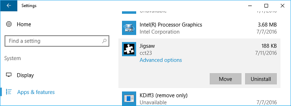
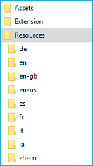

# Windows と Microsoft Store 向け Microsoft Edge 拡張機能のローカライズ  

[!INCLUDE [deprecation-note](../../includes/deprecation-note.md)]  

このガイドでは、Microsoft Edge 拡張機能をローカライズして、リリース時に複数のローカライズの準備が整う方法について説明します。 拡張機能を完全にローカライズするには、Windows と Microsoft Store の両方の手順に従う必要があります。

Microsoft Edge の拡張機能リソースをローカライズする場合は、国際化ガイドで i18n フレームワークを使用する方法 [について説明します](../internationalization.md)。


> [!NOTE]
> 拡張機能が複数の言語をサポートしない場合は、Microsoft Store のローカライズ名と説明 [にスキップできます](#localizing-name-and-description-in-the-microsoft-store)。


## ローカライズ プロセスの概要

幅広いユーザーが拡張機能を利用する最初の手順は、複数の言語用に [AppxManifest](#configuring-the-appxmanifest) を構成する方法です。 Microsoft Store では、拡張機能がサポートする言語がユーザーに表示されます。 拡張機能の名前を Windows UI と Microsoft Store にローカライズする場合は、AppxManifest の特定のフィールドも変更する [必要があります](#localizing-extension-resources-for-windows-and-the-microsoft-store)。


AppxManifest を構成したら、サポートされている言語の [JSON](#creating-json-string-resources) 文字列リソースを作成する必要があります。 これには、言語ごとに .resjson ファイルを作成する必要があります。各ファイルには、その言語のすべての UI 文字列が含まれます。


サポートされている言語の .resjson ファイルを作成した後、.pri リソース ファイル [を作成する必要があります](#creating-the-resources-file)。 これは[、Windows 10 SDK](https://developer.microsoft.com/windows/downloads/windows-10-sdk)に付属する**MakePRI**ツールの構成ファイルを使用して作成されます。 

> [!NOTE]
> MakePri.exe ツールを使用するために Windows 10 SDK のみをダウンロードする場合は、"Windows SDK Signing Tools for Desktop Apps" および "Windows SDK for UWP Managed Apps" の機能のみを選択して、ダウンロードを軽くすることができます。 このMakePri.exe C:\Program Files (x86)\Windows Kits\10\bin\10.0.17713.0 のサブフォルダーに表示されます。


拡張機能をアップロードしたら、最後の手順として、Microsoft Store の名前と [説明をローカライズします](#localizing-name-and-description-in-the-microsoft-store)。

> [!NOTE]
> Microsoft Store に Microsoft Edge 拡張機能を提出する機能は、現在制限されています。 Microsoft Store[の一](https://aka.ms/extension-request)部としてお客様からのリクエストをお問い合わせください。今後の更新について検討します。


## AppXManifest の構成

Microsoft Store の拡張機能の "サポートされている言語" リストは、AppXManifest の値に基づいて生成されます。 このリストは、要素を使用して指定 `Resource` します。


拡張機能でサポートされている言語の一覧を指定するには、次に示す形式で要素を追加できます (この要素では、Microsoft Store で英語、ドイツ語、およびフランス語のサポートが表示されます `Resource` `Resource` )。

```xml
<Resources>
    <Resource Language="en-us"/>
    <Resource Language="de-de"/>
    <Resource Language="fr-fr"/>
</Resources>
```

Microsoft Store [でサポートされている言語](https://msdn.microsoft.com/windows/uwp/publish/supported-languages) /言語コードについては、「サポートされている言語」をご覧ください。


AppxManifest で公開されている要素すべてについてローカライズされた文字列を指定するには、リソース識別子を次の形式で使用する必要があります `ms-resource:<resource id>` 。

次のスニペットは、完全な AppxManifest を作成します。 ローカライズされたリソース ファイルから次の値を取得する必要があります。

- Properties\DisplayName
- Properties\Description
- Properties\PublisherDisplayName


```xml
<Properties>
    <DisplayName>ms-resource:DisplayName</DisplayName>
    <Description>ms-resource:Description</Description>
    <Logo>Assets\PackageLogo.png</Logo>
    <PublisherDisplayName>ms-resource:PublisherName</PublisherDisplayName>
</Properties>
```

- Applications\Application\VisualElements\DisplayName
- Applications\Application\VisualElements\Description
- Applications\Application\Extensions\Extension\AppExtension\DisplayName

```xml
<Applications>
    <Application Id="App">
      <uap:VisualElements
        AppListEntry="none"
            DisplayName="ms-resource:DisplayName"
       Square150x150Logo="Assets\Square150x150Logo.png"
       Square44x44Logo="Assets\Square44x44Logo.png"
            Description="ms-resource:Description"
        BackgroundColor="transparent">
      </uap:VisualElements>
      <Extensions>
      <uap3:Extension Category="windows.appExtension">
        <uap3:AppExtension Name="com.microsoft.edge.extension"
            Id="MicrosoftTranslate"
            PublicFolder="Extension"
            DisplayName="ms-resource:DisplayName">
        </uap3:AppExtension>
      </uap3:Extension>
      </Extensions>
    </Application>
  </Applications>
```


## Windows と Microsoft Store の拡張機能リソースのローカライズ

AppxManifest が複数の言語に対して構成されたので、拡張機能内での UI のローカライズと、Windows と Microsoft Store の拡張機能のローカライズの間には、いくつかの重要な違いがあります。

Microsoft Edge 拡張機能は Microsoft Edge の外部では実行されませんが、Windows 内で管理できます。 たとえば、ユーザーは設定アプリで拡張機能を管理できます。





Windows の設定アプリに表示される拡張機能の名前は、AppXManifest から取得されます。 この値が英語でハードコードされている場合、英語バージョンの名前は英語以外の Windows デバイスに表示されます。 拡張機能のブランド化が英語のみである場合は、ハードコードされたままにしておいても問題ない。


> [!NOTE]
> Windows の Microsoft Edge Extension にローカライズされた名前を使用する場合は、AppXManifest ファイルを変更する前に、ローカライズされた名前も使用可能で予約済みである必要があります。 [](./extensions-in-the-windows-dev-center.md#name-reservation) 名前が予約されていない場合、最終的なパッケージを Windows デベロッパー センターにアップロードすると、次のエラーが表示されます。</br></br>

</br></br>


JavaScript 拡張機能用に定義された i18n ベースのローカライズ インフラストラクチャは、Microsoft Edge 環境内でのみ適用できます。

Microsoft Edge の外部、Windows および Microsoft Store 内でサポートされている唯一のローカライズ フレームワークは、ユニバーサル Windows プラットフォーム (UWP) ローカライズ フレームワークに基づいています。

HTML ベースの Windows アプリでは JSON ベースのリソースをサポートしますが、JSON リソースのスキーマは JavaScript 拡張機能に定義されているスキーマと一致しません。


HTML ベースの Windows アプリの主 [な違いを次に示します](https://msdn.microsoft.com/library/windows/apps/hh465228.aspx)。
-    リソースは .json ファイルではなく .resjson ファイルで指定されます。
-    サポートされるロケールは AppXManifest ファイルで指定する必要があります。最初のロケールは既定のロケールです。
-    HTML ベースの Windows アプリ リソースは、次のスキーマを使用します。
    ```json
    {
        "greeting"              : "Hello",
        "_greeting.comment"     : "A welcome greeting.",

        "farewell"              : "Goodbye",
        "_farewell.comment"     : "A goodbye."
    }
    ```
    アンダースコアで示される名前と値のペアは、対応する文字列リソースのコメントです。
-    .resjson ファイルは .pri ファイルにコンパイルされ、AppX パッケージの作成時に含める必要があります。


### JSON 文字列リソースの作成
AppxManifest が構成され、i18n と UWP のローカライズ フレームワークの違いが強調表示された状態で、リソース ファイルを作成する準備が整いました。

マニフェスト内のリソース文字列は、Microsoft Edge 拡張機能パッケージに 1 つしか適用できません。 文字列は一般に JavaScript 拡張機能にローカライズされ、Windows が期待する `DisplayName` .resjson ファイルに簡単にマップできます。 これがローカライズする唯一のリソースである場合、作成する必要があるサンプルの .resjson ファイルを次に示します。

```json
{
    "DisplayName"              : "Jigsaw",
    "_DisplayName.comment"     : "Name of extension."
}
```

各 .resjson ファイルのリソース ID は、AppXManifest で使用される ID と一致する必要があります。 上記の .resjson スニペットの例を使用すると、対応する AppXManifest エントリは次のようになります。

`DisplayName="ms-resource:DisplayName"`

拡張機能がサポートする各言語は、対応する resources.resjson ファイルを持ち、次のフォルダー構造に配置する必要があります。




### リソース ファイルの作成
すべての .resjson ファイルを作成したら、パッケージ リソース インデックス (PRI) ファイルを作成する準備が整います。 このファイルには、サポートされている言語のリソースすべてが格納されます。 これを行うには、Windows 10 SDK に付属の **MakePRI** ツールを使用できます。


最初に、構成ファイルを作成する必要があります。 これにより、リソースの既定の修飾子とプラットフォームが定義されます。 この例では、既定の言語を英語 (米国) とプラットフォーム Windows 10 に設定します。 これを行うには、[ルート フォルダー] priconfig.xml内容を含む新しいファイルを作成します。


```xml
<?xml version="1.0" encoding="UTF-8" standalone="yes"?>
<resources targetOsVersion="10.0.0" majorVersion="1">
    <index root="\" startIndexAt="\">
        <default>
            <qualifier name="Language" value="en-US"/>
            <qualifier name="Contrast" value="standard"/>
            <qualifier name="HomeRegion" value="001"/>
            <qualifier name="TargetSize" value="256"/>
            <qualifier name="LayoutDirection" value="LTR"/>
            <qualifier name="Theme" value="dark"/>
            <qualifier name="AlternateForm" value=""/>
            <qualifier name="DXFeatureLevel" value="DX9"/>
            <qualifier name="Configuration" value=""/>
            <qualifier name="DeviceFamily" value="Universal"/>
            <qualifier name="Custom" value=""/>
        </default>
        <indexer-config type="folder" foldernameAsQualifier="true" filenameAsQualifier="true" qualifierDelimiter="."/>
        <indexer-config type="resw" convertDotsToSlashes="true" initialPath=""/>
        <indexer-config type="resjson" initialPath=""/>
        <indexer-config type="PRI"/>
    </index>
</resources>
```

これで、構成ファイルと MakePRI ツールを使用して resources.pri ファイルを作成できます。 この例では、プロジェクトのルートの場所は [ルート フォルダー] です。


```cmd
MakePRI new /pr [Root folder] /cf [Root folder]\priconfig.xml /mn [Root folder]\AppxManifest.xml /of [Root folder]\resources.pri /o
```

これで、ルート フォルダーに resources.pri ファイルが 1 つ作成されます。


## Microsoft Store での名前と説明のローカライズ

ローカライズされた完全なパッケージをアップロードすると、Windows デベロッパー センターは複数の言語がサポートされているのを検出し、対応するローカライズされた名前と説明が用意されていないことを確認します。 ローカライズされた値が不足している場合、値を指定するまで申請はブロックされます。

(Windows ではなく) Microsoft Store のローカライズされた名前と説明のみを提供する場合は、拡張機能のローカライズされた名前を予約することで行 [います](./extensions-in-the-windows-dev-center.md#name-reservation)。


追加のローカライズされた名前を予約したら、更新された申請を作成できます。 説明セクションでは、Microsoft Store 登録情報の追加の言語を管理できます。


[追加の言語の管理] を選択すると、Microsoft Store 登録情報に追加する言語を選択できます。 新しい言語は、[説明] セクションに [追加の説明言語] として表示されます。

[説明] セクションの個々のリンクをクリックすると、各言語のローカライズされた名前と説明、リリース ノート、ビジュアル アセットを提供できます。 Microsoft Store の説明は、AppXManifest から抽出されません。 ローカライズされた説明は、Windows デベロッパー センターに手動で入力する必要があります。


ローカライズされた説明が提出され、拡張機能が公開されると、Microsoft Store で拡張機能のローカライズされたページにアクセスするユーザーには、次の UI が表示されます。


 

## AppxManifest サンプル

### ローカライズされていない AppxManifest
次の例は、ローカライズされていない AppxManifest を示しています。"en-us" ロケールのみをサポートしています。


```xml
<?xml version="1.0" encoding="utf-8"?>
<Package
    xmlns="http://schemas.microsoft.com/appx/manifest/foundation/windows10"
    xmlns:uap="http://schemas.microsoft.com/appx/manifest/uap/windows10"
    xmlns:uap3="http://schemas.microsoft.com/appx/manifest/uap/windows10/3"
    IgnorableNamespaces="uap3">
    <Identity
        Name="63533cct23.Jigsaw"
        Publisher="CN=932A7C4A-0308-4632-9E2F-5931E8F02B7C"
        Version="1.3.0.0" />

    <Properties>
        <DisplayName>Jigsaw</DisplayName>
        <PublisherDisplayName>cct23</PublisherDisplayName>
        <Logo>Assets\icon-50.png</Logo>
    </Properties>

    <Dependencies>
        <TargetDeviceFamily Name="Windows.Desktop" MinVersion="10.0.14393.0" MaxVersionTested="10.0.14800.0" />
    </Dependencies>

    <Resources>
        <Resource Language="en-us" />
    </Resources>

    <Applications>
        <Application Id="App">
            <uap:VisualElements
                AppListEntry="none"
                DisplayName="Jigsaw"
                Square150x150Logo="Assets\icon-150.png"
                Square44x44Logo="Assets\icon-44.png"
                Description="This is a jigsaw puzzle app"
                BackgroundColor="transparent">
            </uap:VisualElements>
            <Extensions>
                <uap3:Extension Category="windows.appExtension">
                    <uap3:AppExtension
                        Name="com.microsoft.edge.extension"
                        Id="EdgeExtension"
                        PublicFolder="Extension"
                        DisplayName="Jigsaw">
                        <uap3:Properties>
                            <Capabilities>
                                <Capability Name="websiteContent"/>
                                <Capability Name="websiteInfo"/>
                                <Capability Name="browserStorage"/>
                            </Capabilities>
                        </uap3:Properties>
                    </uap3:AppExtension>
                </uap3:Extension>
            </Extensions>
        </Application>
    </Applications>
</Package>
```


#### ローカライズされた AppxManifest
この AppxManifest サンプルは、"en-us" 以外の 8 つのロケールにローカライズされています。 次の状況 `ms-resource:<resource id>` に注意してください。


```xml
<?xml version="1.0" encoding="utf-8"?>
<Package
    xmlns="http://schemas.microsoft.com/appx/manifest/foundation/windows10"
    xmlns:uap="http://schemas.microsoft.com/appx/manifest/uap/windows10"
    xmlns:uap3="http://schemas.microsoft.com/appx/manifest/uap/windows10/3"
    IgnorableNamespaces="uap3">
    <Identity
        Name="63533cct23.Jigsaw"
        Publisher="CN=932A7C4A-0308-4632-9E2F-5931E8F02B7C"
        Version="1.3.0.0" />

    <Properties>
        <DisplayName>ms-resource:DisplayName</DisplayName>
        <PublisherDisplayName>cct23</PublisherDisplayName>
        <Logo>Assets\icon-50.png</Logo>
    </Properties>

    <Dependencies>
        <TargetDeviceFamily Name="Windows.Desktop" MinVersion="10.0.14393.0" MaxVersionTested="10.0.14800.0" />
    </Dependencies>

    <Resources>
        <Resource Language="en-us" />
        <Resource Language="de" />
        <Resource Language="en" />
        <Resource Language="en-gb" />
        <Resource Language="es" />
        <Resource Language="fr" />
        <Resource Language="it" />
        <Resource Language="ja" />
        <Resource Language="zh-cn" />
    </Resources>

    <Applications>
        <Application Id="App">
            <uap:VisualElements
                AppListEntry="none"
                DisplayName="ms-resource:DisplayName"
                Square150x150Logo="Assets\icon-150.png"
                Square44x44Logo="Assets\icon-44.png"
                Description="ms-resource:Description"
                BackgroundColor="transparent">
            </uap:VisualElements>
            <Extensions>
                <uap3:Extension Category="windows.appExtension">
                    <uap3:AppExtension
                        Name="com.microsoft.edge.extension"
                        Id="EdgeExtension"
                        PublicFolder="Extension"
                        DisplayName="ms-resource:DisplayName">
                        <uap3:Properties>
                            <Capabilities>
                                <Capability Name="websiteContent"/>
                                <Capability Name="websiteInfo"/>
                                <Capability Name="browserStorage"/>
                            </Capabilities>
                        </uap3:Properties>
                    </uap3:AppExtension>
                </uap3:Extension>
            </Extensions>
        </Application>
    </Applications>
</Package>
```
