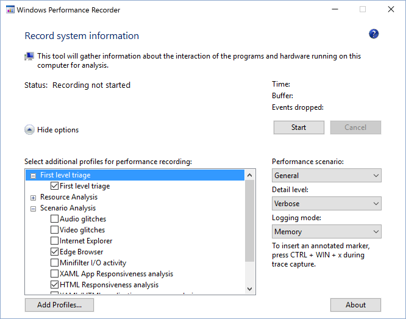
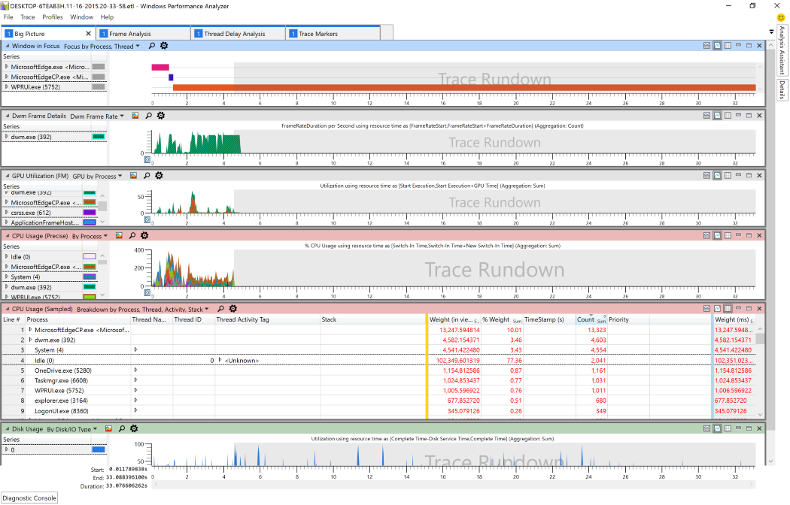

# パフォーマンス分析  

パフォーマンスを向上させるのが新しい場合は [、F12 DevTools ガイドを確認してください](../devtools-guide/index.md)。
Microsoft Edge [に組み込みの F12](../devtools-guide/index.md) ツールを使用して、Web サイトの一般的なパフォーマンスを分析できます。  これは、ブラウザー内から Windows のパフォーマンス と類似した (ただし [Toolkit)](/windows-hardware/test/wpt/index) 機能を提供します。  

ブラウザーのパフォーマンスの詳細な分析が必要な場合は、Microsoft Edge チームは [Windows Performance Toolkit](/windows-hardware/test/wpt/index) (WPT) を使用します。  WPT は、プログラムのパフォーマンスを詳細に分析するために Windows チームによって作成されました。  Web サイトの JavaScript と Microsoft Edge ネイティブ コードの境界をまたがって、両方を同じツール内で表示できます。  WPT は、次の場合に使用できます。  

*   ソフトウェアが作業を完了するために必要な CPU 時間を測定する  
*   ソフトウェアによって割り当てられたメモリを計算する  
*   リモート サーバーからファイルをダウンロードする詳細を表示する  
*   フレーム レートを測定します。  

Windows Performance Toolkit を使って Web サイトを分析するには、まず [Windows 10 Assessment and Deployment Kit (ADK)](https://developer.microsoft.com/windows/hardware/windows-assessment-deployment-kit)をダウンロードする必要があります。  インストール時 *に Windows パフォーマンス Toolkit* オプションを選択します。  

  

ここでは、パフォーマンス トレースを記録して分析する方法について取り上けます。  
Windows Performance Toolkit に含まれる機能の詳細については、WPT の全ドキュメント [を参照してください](/windows-hardware/test/wpt/index)。  

## トレースの記録  

次に、ユーザー シナリオを設定し、Windows Performance Recorder を使用してトレースを収集する準備をします。  
Windows Performance *Recorder (WPR)* を使用して Web シナリオをプロファイルする方法を次に示します。  

### 1. パフォーマンス トレースを収集する環境を準備する  

記録するトレースのノイズを回避するために、実行中のプログラムをできる限りシャットダウンします。  理想的には、実行されているソフトウェアは Windows Performance Recorder (WPR) とブラウザーのみです。  

### 2. Windows Performance Recorder (WPR) を起動し、オプションを選択する  

Windows Performance Recorder を起動し、[その他の **オプション] トグル** が展開されます。  エッジ ブラウザー *と* *HTML の応答性のシナリオ分析* のチェック ボックスをオンにします。  

  

#### トレース収集のヒントとコツ  

*   バックグラウンド アクティビティは最低限必要な状態に保つ必要があります。  バックグラウンド プロセスでは、認識されるパフォーマンスと実際のパフォーマンス特性の両方が歪み、結果に影響を与える可能性があります。  ブラウザーと WPR の横に他の実行中のアプリケーションがないのが理想的です。  
*   分析するシナリオを特定し、できるだけアトミックな状態に保ちます。  たとえば、ページの読み込み、スクロール、テーブル内の項目の選択時にサイトのパフォーマンスに問題がある場合は、次の 3 つのシナリオに問題を分け加えます。  
    *   ページの読み込み (ナビゲーションの開始からページの読み込み完了まで)  
    *   Scroll  
    *   表で何かを選択する  
*   シナリオにサイトへの移動が含まれる場合は、シナリオを about:blank から開始してください。  about:blank から開始すると、前のページのオーバーヘッドが回避されます。  サイトから移動する必要がある場合は、about:blank に移動してシナリオを完了します。  これにより、調査中のサイト間の特定のやり取りが問題である場合を限り、他のサイトのノイズを追跡し続ける必要があります。  

### 3. シナリオを記録する  

[スタート **] をクリック** してレコーディングを開始します。  ツールは、生成されたファイルのサイズを予測するために使用しているバッファーのサイズを報告します。  測定するユーザー シナリオを実行し、[保存]**** をクリックして記録を停止し、トレースを保存します。  シナリオが終了した直後に保存すると、トレース ファイルのサイズを最小限に抑えることができます。  

  

WPR ツールは、トレース情報が正常に保存されたことを示します。  

  

## トレースの分析  

これで、パフォーマンス データを収集し、Windows Performance Analyzer を使用してトレースを分析し、どの最適化を行えるのかを確認できます。  
Web シナリオのパフォーマンス データを分析する方法を次に示します。  

### 1. Windows Performance Analyzer (WPA) を開く  

Windows Performance Analyzer を起動し、分析するファイル `.etl` (ファイルを開****  >  **く... ) を開きます**。  

### 2. シンボルを読み込み *、HTML 分析プロファイルを適用* する  

> [!WARNING]
> シンボルを初めて読み込むには大量のダウンロードが必要で、一般的なインターネット接続ではかなりの時間が必要です。  

メニューから [トレース読み込み**記号]** を選択  >  **して、シンボル**を読み込む。  シンボルはディスクにキャッシュされ、今後のトレースではシンボルの読み込み速度がはるかに速くなります。  

Microsoft Edge と Web アプリのホストへの読み込みを制限することで、シンボルの読み込みを大幅に高速化できます。  [**トレースの**  >  **構成シンボル] を選択**し、読み込**み設定のみを**制限 `MicrosoftEdgeCP.exe` します `WWAHost.exe` 。  

  

シンボルの読み込みが開始された後 *、Html 分析プロファイル*(**プロファイル**  >  **が適用されます.**  > **カタログを参照します。**  > **HtmlResponsivenessAnalysis.wpaProfile**)  
プロファイルは、分析用に複数のグラフとテーブルを読み込む。  Web サイトの調査のほぼすべてについて、このプロファイルから開始することをお勧めします。  

  

#### Html の応答性分析プロファイル  

*Html の応答性分析プロファイルには*、次の 4 つのタブがあります。  

**大きな** 画像 - これは、CPU アクティビティの予期しないソースが発生せず、ブラウザーが使用可能なすべてのリソースを実際に使用している場合に役立ちます。  CPU 使用率を確認し、ブラウザー以外の CPU 使用率に大きく影響するプロセスがないか確認します。  

**フレーム分析** - このセクションは基本的な分析に使用されます。  CPU *使用率 (属性) グラフを使用* すると、CPU 使用率を担当するサブシステムを一目で把握できます。  *HTML UI*スレッドの CPU 使用率 *(Sampled)* テーブルのサンプルを分析すると、重大なパフォーマンスのボトルネックを特定するのに役立ちます。  

**トレース マーカー** - このセクションには、コードを測定するための正確なポイントを提供する *msWriteProfilerMark*など、ブラウザー (Microsoft Edge) からのすべてのトレース マーカーが表示されます。  *msWriteProfilerMark*トレースを表示するには、[Generic *Events]* グラフまでスクロール ダウンし、ドロップダウン メニューから**HTML msWriteProfilerMark**を選択します。  

**スレッド遅延分析** - このタブは、Microsoft Edge 開発者が、あるスレッドがブロックされ、別のスレッドで待機している状況を調査するためによく使用されます。  まれに、Web 開発者にも役立つ場合があります。  

### 3. ズームしてトレースの実行を削除する  

グラフの末尾に空の *トレース実行* セクションを削除することで、分析に集中できます。  現在表示されているグラフから:  
*   調査するグラフ データの開始時点で左クリック  
*   長押し、ドラッグ アンド リリースして目的の領域を選択する  
*   右クリックして [ズーム] を選択 **する**  

ズームは、アクティブなタブのすべてのグラフとグラフに適用されます。  

  

### 4. CPU サイクルを消費している原因を調査する  

 [**フレーム分析] タブの CPU** **** 使用率 (サンプリング) テーブルは、ほとんどの分析が発生する可能性が高い場所です。  さまざまなプロセスを拡張して、最も計算負荷の高い JavaScript とブラウザー コードを特定できます。  多くの場合、1 ビットの JavaScript がパフォーマンスの問題を引き起こします。最適化に時間を取って大きな違いを生み出す可能性があります。  

### 5. 実行が遅い JavaScript コードを詳細に確認する  

DOM 呼び出しの下位分析は、シナリオ中に大部分の時間を占める JavaScript を特定するのに役立ちます。  これは、多くのトップ レベル呼び出しで同じ JavaScript ライブラリを再使用する場合に特に役立ちます。  

まず、プロセス、スレッド、アクティビティ、スタック別の CPU 使用率 *(サンプリング) の内訳を見て説明します*。  スタック列の任意のセル **をクリック** します。  Ctrl *+ F キーを押* し *、ExternalFunctionThunk を検索します*。  

> [!NOTE] 
> これは、シンボルが正常に読み込まれた場合にのみ機能します。  

  

*ExternalFunctionThunk を使用して行を調査します*。  これは、Chakra JavaScript エンジンから Microsoft Edge エンジンへのインターフェイスです。  コードがブラウザーから JavaScript の実行にブリッジされる場所を示します。  行を右クリックし、[モジュールで呼び出し先を**表示**] を選択して、実行中のブラウザー エンジン関数の重み付けリスト  >  **** を表示します。  

  

特定の API を呼び出しているすべての JavaScript を特定するには****、その API を右クリックして [関数別に呼び出し元を表示] を選択し、ツリーを展開して相対的な重みを表示および  >  **** 比較します。  
