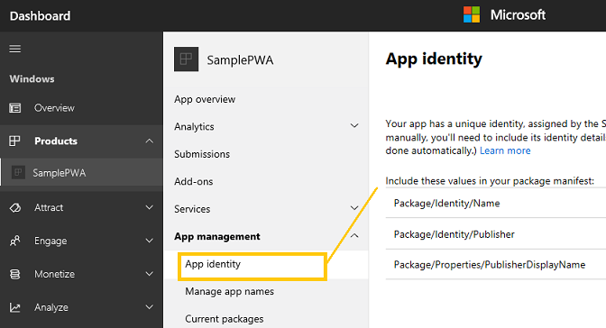

# <span data-ttu-id="f8ca3-104">Microsoft Store の段階的な Web アプリ</span><span class="sxs-lookup"><span data-stu-id="f8ca3-104">Progressive Web Apps in the Microsoft Store</span></span>

<span data-ttu-id="f8ca3-105">段階的な Web アプリ (PWA) を [Microsoft Store](https://developer.microsoft.com/store)に公開すると、アプリの対象ユーザーは、アクティブな毎月約 7 億人のユーザーの Windows 10 インストール ベース全体に拡大されます。</span><span class="sxs-lookup"><span data-stu-id="f8ca3-105">When you publish your Progressive Web App (PWA) to the [Microsoft Store](https://developer.microsoft.com/store), your potential app audience expands to the entire Windows 10 install base of nearly 700 million active monthly users!</span></span> 

<span data-ttu-id="f8ca3-106">Microsoft Store の PAS には、次のような多くの利点があります。</span><span class="sxs-lookup"><span data-stu-id="f8ca3-106">PWAs in the Microsoft Store enjoy a number of advantages:</span></span>

-   <span data-ttu-id="f8ca3-107">**検出可能性** - Microsoft Store のアプリは、さまざまなカテゴリ、選択されたコレクション、検索フィルターを通じて紹介され、アプリの潜在的なユーザーに簡単な閲覧とショッピングエクスペリエンスを提供します。</span><span class="sxs-lookup"><span data-stu-id="f8ca3-107">**Discoverability** - Apps in the Microsoft Store are showcased through different categories, curated collections, and search filters, providing an easy browsing and shopping experience for potential customers of your app.</span></span> <span data-ttu-id="f8ca3-108">スクリーンショット、 [ヒーロー画像、](/windows/uwp/publish/app-screenshots-and-images) ビデオ トレーラーを使って、ストア登録情報を強化することもできます。</span><span class="sxs-lookup"><span data-stu-id="f8ca3-108">You can even [enhance your Store listing](/windows/uwp/publish/app-screenshots-and-images) with screenshots, a hero image, and video trailers!</span></span>
-   <span data-ttu-id="f8ca3-109">**信頼性 -** Windows のお客様は、Microsoft Store の厳格な品質と安全性の基準に従っているため、Microsoft Store の購入とダウンロードを信頼できると [知っています](/legal/windows/agreements/store-policies)。</span><span class="sxs-lookup"><span data-stu-id="f8ca3-109">**Trustworthiness** - Windows customers know they can trust their Microsoft Store purchases and downloads because they adhere to Microsoft's rigorous [quality and safety standards](/legal/windows/agreements/store-policies).</span></span>
-   <span data-ttu-id="f8ca3-110">**簡単な** インストール - Microsoft Store は、 [すべての Windows 10](https://www.microsoft.com/store/apps/windows?icid=CNavAppsWindowsApps)アプリで一貫したユーザー フレンドリーなインストール エクスペリエンスを提供します。技術的な快適度に関係なく、すべてのユーザーが PWA を簡単にインストールできます。</span><span class="sxs-lookup"><span data-stu-id="f8ca3-110">**Easy install** - The Microsoft Store provides a consistent and user friendly install experience across [all Windows 10 apps](https://www.microsoft.com/store/apps/windows?icid=CNavAppsWindowsApps), making it easy for all customers to install your PWA, regardless of technical comfort level.</span></span>
-   <span data-ttu-id="f8ca3-111">**ビジネス**の分析情報 - Microsoft Store の Windows デベロッパー[](/windows/uwp/publish/analytics)センター ダッシュボードでは、PWA がアクセスした[Windows](/windows/uwp/publish/using-the-windows-dev-center-dashboard)ユーザーの数から、そのユーザーの使い方やユーザーの言い分まで、すべての詳細な分析が提供されます。</span><span class="sxs-lookup"><span data-stu-id="f8ca3-111">**Business insights** - The [Windows Dev Center dashboard](/windows/uwp/publish/using-the-windows-dev-center-dashboard) for the Microsoft Store provides you with [detailed analytics](/windows/uwp/publish/analytics) about everything from how many Windows customers your PWA has reached to how they're using it and what they have to say.</span></span> <span data-ttu-id="f8ca3-112">また、アプリの正常性や広告の使用状況に関する指標やテレメトリ データを確認することもできます。</span><span class="sxs-lookup"><span data-stu-id="f8ca3-112">You can also find metrics and telemetry data on app health, ad usage, and more.</span></span>
    
<span data-ttu-id="f8ca3-113">PWA を Microsoft Store に取り込むには、次の 2 つのオプションがあります。</span><span class="sxs-lookup"><span data-stu-id="f8ca3-113">There are two options for getting your PWA into the Microsoft Store:</span></span>

1.  <span data-ttu-id="f8ca3-114">手動で [送信するか](#submitting-your-pwa-manually)、または</span><span class="sxs-lookup"><span data-stu-id="f8ca3-114">You can [manually submit it](#submitting-your-pwa-manually), or</span></span>
2.  <span data-ttu-id="f8ca3-115">PWA が特定の条件を[満たしている](#criteria-for-automatic-submission)場合は[](#automatic-pwa-importing-with-bing)、Bing Web クローラーによって自動的にインデックスを作成できます。</span><span class="sxs-lookup"><span data-stu-id="f8ca3-115">If your PWA meets [certain criteria](#criteria-for-automatic-submission), it can be [automatically indexed](#automatic-pwa-importing-with-bing) by the Bing web crawler.</span></span> <span data-ttu-id="f8ca3-116">(自動送信を [オプトアウト](#opting-out-of-automatic-microsoft-store-import) することもできます)。</span><span class="sxs-lookup"><span data-stu-id="f8ca3-116">(You also have the option to [opt-out](#opting-out-of-automatic-microsoft-store-import) of auto-submission.)</span></span>
    
<span data-ttu-id="f8ca3-117">申請方法に関係なく、PWA が Microsoft Store に受け入れられると、上記のすべての特典にアクセスできます。</span><span class="sxs-lookup"><span data-stu-id="f8ca3-117">Regardless of submission method, once your PWA is accepted to the Microsoft Store you'll gain access to all the benefits outlined above.</span></span>

## <span data-ttu-id="f8ca3-118">PWA を手動で提出する</span><span class="sxs-lookup"><span data-stu-id="f8ca3-118">Submitting your PWA manually</span></span>

<span data-ttu-id="f8ca3-119">Microsoft Store を通じてアプリを配布して販売促進するには、Windows アプリ パッケージ ( .appx ファイル) としてアプリを*提出する必要* があります。</span><span class="sxs-lookup"><span data-stu-id="f8ca3-119">In order to distribute and promote an app through the Microsoft Store, you'll need to submit it as a Windows app package (*.appx* file).</span></span>  <span data-ttu-id="f8ca3-120">PAS などのサーバーホスト型 Web アプリの場合、このパッケージにはアプリのメタデータとホーム画面のアイコン (実際のアプリケーション コードは含めなし) が含まれます。</span><span class="sxs-lookup"><span data-stu-id="f8ca3-120">For server-hosted web apps such as PWAs, this package simply contains app metadata and home screen icons (and none of the actual application code).</span></span> <span data-ttu-id="f8ca3-121">これにより、Microsoft Edge のブラウザー ウィンドウから独立して、軽量なネイティブ アプリ ラッパー\* (WWAHost.exe\*プロセス) で実行することで、Web アプリを他の[Windows 10](/windows/uwp/get-started/whats-a-uwp)アプリと共にホーム画面からインストールして起動できます。</span><span class="sxs-lookup"><span data-stu-id="f8ca3-121">With this, your web app can be installed and launched from the home screen alongside other [Windows 10 apps](/windows/uwp/get-started/whats-a-uwp) by running in a lightweight native app wrapper (*WWAHost.exe* process), independent from the Microsoft Edge browser window.</span></span>  

> [!IMPORTANT]
> <span data-ttu-id="f8ca3-122">EdgeHTML Web プラットフォーム エンジンは、Microsoft Edge (Chromium) ベースの PWA の互換性の違いを生み出す可能性がある WWAHost アプリ ラッパーによって使用されます。</span><span class="sxs-lookup"><span data-stu-id="f8ca3-122">The EdgeHTML web platform engine is used by the WWAHost app wrapper which could introduce compatibility differences for your Microsoft Edge (Chromium) based PWA.</span></span>  <span data-ttu-id="f8ca3-123">EdgeHTML エンジンが新しい Web 標準で更新されなくなったので、Microsoft Store にアプリを提出する前に、Microsoft Edge (EdgeHTML) を使用してアプリケーションの完全なテスト パスを実行してください。</span><span class="sxs-lookup"><span data-stu-id="f8ca3-123">Be sure to do a full test pass on your application using Microsoft Edge (EdgeHTML) before submitting your app to the Microsoft store as the EdgeHTML engine is no longer being updated with newer web standards.</span></span>  

<span data-ttu-id="f8ca3-124">これを行う方法を次に示します。</span><span class="sxs-lookup"><span data-stu-id="f8ca3-124">Here's how to do it.</span></span>

### <span data-ttu-id="f8ca3-125">前提条件</span><span class="sxs-lookup"><span data-stu-id="f8ca3-125">Prerequisites</span></span>

-   <span data-ttu-id="f8ca3-126">**既存の PWA 。**</span><span class="sxs-lookup"><span data-stu-id="f8ca3-126">**An existing PWA**.</span></span> <span data-ttu-id="f8ca3-127">Web アプリを [PWA](./get-started.md) に変換していない場合の変換方法を次に示します。</span><span class="sxs-lookup"><span data-stu-id="f8ca3-127">Here's how to [convert your web app to a PWA](./get-started.md) if it isn't one already.</span></span> 
-   <span data-ttu-id="f8ca3-128">**PAS 用の Windows APPX パッケージ ツール**。</span><span class="sxs-lookup"><span data-stu-id="f8ca3-128">**A Windows APPX packaging tool for PWAs**.</span></span> <span data-ttu-id="f8ca3-129">Windows で [PWA をビルドして実行する方法は次](./windows-features.md) Visual Studio。</span><span class="sxs-lookup"><span data-stu-id="f8ca3-129">Here's how to [build and run your PWA on Windows](./windows-features.md) using Visual Studio.</span></span> <span data-ttu-id="f8ca3-130">PWA Builder [を使用して Windows](https://www.pwabuilder.com/) パッケージをビルドすることもできます。</span><span class="sxs-lookup"><span data-stu-id="f8ca3-130">You can also use [PWA Builder](https://www.pwabuilder.com/) to build a Windows package.</span></span>
-   <span data-ttu-id="f8ca3-131">[**Microsoft Store アプリの開発者アカウント**](/windows/uwp/publish/opening-a-developer-account)。</span><span class="sxs-lookup"><span data-stu-id="f8ca3-131">[**Microsoft Store app developer account**](/windows/uwp/publish/opening-a-developer-account).</span></span> <span data-ttu-id="f8ca3-132">選択したアカウント [の種類と](/windows/uwp/publish/account-types-locations-and-fees) 場所に応じて 1 回払い料金が発生し、登録には有効な Microsoft アカウントが [必要です](https://account.microsoft.com/)。</span><span class="sxs-lookup"><span data-stu-id="f8ca3-132">There is a [one-time fee](/windows/uwp/publish/account-types-locations-and-fees) depending on your chosen account type and location, and registration requires a valid [Microsoft Account](https://account.microsoft.com/).</span></span>
    
### <span data-ttu-id="f8ca3-133">ストアでの申請の *Visual Studio*</span><span class="sxs-lookup"><span data-stu-id="f8ca3-133">Store submission through *Visual Studio*</span></span> 

<span data-ttu-id="f8ca3-134">以下の手順に従 [って、PWA](/windows/uwp/packaging/packaging-uwp-apps#create-an-app-package-upload-file) 用のアプリ パッケージ アップロード ファイルを作成Visual Studio。</span><span class="sxs-lookup"><span data-stu-id="f8ca3-134">Follow these steps to [create an app package upload file](/windows/uwp/packaging/packaging-uwp-apps#create-an-app-package-upload-file) for your PWA in Visual Studio.</span></span> <span data-ttu-id="f8ca3-135">この [*プロセスの一般的な概要については*](/windows/uwp/packaging/packaging-uwp-apps) 、「Visual Studio UWP アプリをパッケージ化する」をご覧ください。</span><span class="sxs-lookup"><span data-stu-id="f8ca3-135">See [*Package a UWP app with Visual Studio*](/windows/uwp/packaging/packaging-uwp-apps) for a more general overview of this process.</span></span>

<span data-ttu-id="f8ca3-136">手順では、Windows アプリ認定キットを実行して [**、Microsoft**](https://developer.microsoft.com/windows/develop/app-certification-kit) Store の要件に準拠するためにアプリをテストする方法も説明します。</span><span class="sxs-lookup"><span data-stu-id="f8ca3-136">The instructions will also guide you through running the [**Windows App Certification Kit**](https://developer.microsoft.com/windows/develop/app-certification-kit) to test your app for compliance with Microsoft Store requirements.</span></span> <span data-ttu-id="f8ca3-137">これはオプションですが、強くお勧めします。</span><span class="sxs-lookup"><span data-stu-id="f8ca3-137">This is optional, but highly recommended.</span></span>

### <span data-ttu-id="f8ca3-138">Windows デベロッパー センターを *使ったストア申請*</span><span class="sxs-lookup"><span data-stu-id="f8ca3-138">Store submission through *Windows Dev Center*</span></span>

<span data-ttu-id="f8ca3-139">*PWA*ビルダーを使って、Windows デベロッパー センターにアップロードするアプリ パッケージを生成する方法を次に示します。</span><span class="sxs-lookup"><span data-stu-id="f8ca3-139">Here's how to use *PWA Builder* to generate an app package for upload to the Windows Dev Center.</span></span>

1.  <span data-ttu-id="f8ca3-140">Windows 10 アプリを生成します。</span><span class="sxs-lookup"><span data-stu-id="f8ca3-140">Generate your Windows 10 app.</span></span> <span data-ttu-id="f8ca3-141">PWA を Windows アプリとして実行する [方法は次](./windows-features.md)Visual Studio。</span><span class="sxs-lookup"><span data-stu-id="f8ca3-141">Here's how to run your [PWA as a Windows app with Visual Studio](./windows-features.md).</span></span> <span data-ttu-id="f8ca3-142">PWA Builder [を使用して Windows](https://www.pwabuilder.com/) 10 アプリを生成することもできます。</span><span class="sxs-lookup"><span data-stu-id="f8ca3-142">You can also use [PWA Builder](https://www.pwabuilder.com/) to generate your Windows 10 app.</span></span>
2.  <span data-ttu-id="f8ca3-143">アカウント情報を使って [Windows デベロッパー](https://developer.microsoft.com/dashboard/windows/overview) センター ダッシュボードにログインし、名前を予約してアプリを作成する手順に従って、Microsoft Store 用のアプリ名 [を予約します](/windows/uwp/publish/create-your-app-by-reserving-a-name)。</span><span class="sxs-lookup"><span data-stu-id="f8ca3-143">Reserve your app name for the Microsoft Store by logging into the [Windows Dev Center dashboard](https://developer.microsoft.com/dashboard/windows/overview) with your account info and following the steps to [create your app by reserving a name](/windows/uwp/publish/create-your-app-by-reserving-a-name).</span></span> <span data-ttu-id="f8ca3-144">予約する名前は、Microsoft Store 全体で一意にする必要があります。</span><span class="sxs-lookup"><span data-stu-id="f8ca3-144">Each reserved name must be unique throughout the Microsoft Store.</span></span>
3.  <span data-ttu-id="f8ca3-145">アプリのパッケージをアップロードする場合 *、.appxmanifest*ファイルの DisplayName、Name、Publisher、PublisherDisplayName の値は、名前の予約時に Windows デベロッパー センター ダッシュボードでアプリに割り当てられた値と一致する必要があります。    </span><span class="sxs-lookup"><span data-stu-id="f8ca3-145">When you upload your app's packages, the *DisplayName*, *Name*, *Publisher*, and *PublisherDisplayName* values in your *.appxmanifest* file must match the values assigned to your app in the Windows Dev Center dashboard upon reserving its name.</span></span> 
    
    <span data-ttu-id="f8ca3-146">Windows デベロッパー センター[ダッシュボードにログインし、](https://developer.microsoft.com/dashboard/windows/overview)アプリ管理アプリ ID の下でアプリ ID**の値**  >  **を探します**。</span><span class="sxs-lookup"><span data-stu-id="f8ca3-146">Log into the [Windows Dev Center dashboard](https://developer.microsoft.com/dashboard/windows/overview), and locate your app identity values under **App management** > **App identity**:</span></span>
    
    
    
    <span data-ttu-id="f8ca3-148">次に、ファイルを見つけて、次の値を Windows デベロッパー センター ダッシュボードで割り当てられた `appxmanifest.xml` 値に置き換します。</span><span class="sxs-lookup"><span data-stu-id="f8ca3-148">Then, locate your `appxmanifest.xml` file and replace the following values with the ones assigned in the Windows Dev Center dashboard:</span></span>
    
    -   <span data-ttu-id="f8ca3-149">**<Identity Name="** *Package/Identity/Name*</span><span class="sxs-lookup"><span data-stu-id="f8ca3-149">**<Identity Name="** *Package/Identity/Name*</span></span>
    -   <span data-ttu-id="f8ca3-150">**<Identity Publisher="** *Package/Identity/Publisher*</span><span class="sxs-lookup"><span data-stu-id="f8ca3-150">**<Identity Publisher="** *Package/Identity/Publisher*</span></span>
    -   <span data-ttu-id="f8ca3-151">**<DisplayName** \**>\*アプリ用に予約した名前*</span><span class="sxs-lookup"><span data-stu-id="f8ca3-151">**<DisplayName** **>** *Name you reserved for your app*</span></span> 
    -   <span data-ttu-id="f8ca3-152">**<PublisherDisplayName** **>***Package/Properties/PublisherDisplayName***</PublisherDisplayName>**</span><span class="sxs-lookup"><span data-stu-id="f8ca3-152">**<PublisherDisplayName** **>** *Package/Properties/PublisherDisplayName* **</PublisherDisplayName>**</span></span>
        
4.  <span data-ttu-id="f8ca3-153">これで、すべての PWA リソースを Microsoft Store にアップロードできる 1 つのファイルにコンパイル `.appx` する準備ができました。</span><span class="sxs-lookup"><span data-stu-id="f8ca3-153">Now you're ready to compile all your PWA resources into a single `.appx` file you can upload to the Microsoft Store.</span></span> <span data-ttu-id="f8ca3-154">コマンド プロンプトで、Web マニフェストのディレクトリに移動し、Windows 10 パッケージを作成します (以下に、オプションのデバッグ ログを示します)。</span><span class="sxs-lookup"><span data-stu-id="f8ca3-154">From a command prompt, navigate to the directory of your web manifest and create a Windows 10 package (specified below w/ optional debug logging):</span></span>
    
    ```shell
    pwabuilder package -p windows10 -l debug
    ```  
    
    <span data-ttu-id="f8ca3-155">.appx ファイルは次の場所に生成されます `PWA\Store packages\windows10\package\windows.appx` 。</span><span class="sxs-lookup"><span data-stu-id="f8ca3-155">Your .appx file will be generated to this location: `PWA\Store packages\windows10\package\windows.appx`.</span></span>
    
5.  <span data-ttu-id="f8ca3-156">Microsoft Store にアプリをアップロードする前に、Microsoft Store ポリシーに準拠するためにアプリをテストしてください。</span><span class="sxs-lookup"><span data-stu-id="f8ca3-156">Before you upload your app for submisison to the Microsoft Store, its a good idea to test your app for compliance with Microsoft Store policies.</span></span> <span data-ttu-id="f8ca3-157">これを行うには [**、Windows アプリ**](https://developer.microsoft.com/windows/develop/app-certification-kit)認定キットをダウンロードして起動し、テスト用にアプリ *の .appx* ファイルを選択します。</span><span class="sxs-lookup"><span data-stu-id="f8ca3-157">You can do this by downloading the [**Windows App Certification Kit**](https://developer.microsoft.com/windows/develop/app-certification-kit), launching it, and then selecting your app's *.appx* file for testing.</span></span> <span data-ttu-id="f8ca3-158">すべてのテストが完了すると、対処する領域のレポートが表示されます。</span><span class="sxs-lookup"><span data-stu-id="f8ca3-158">You will receive a report of areas to address once all the tests are complete.</span></span>
6.  <span data-ttu-id="f8ca3-159">パッケージをアップロードし[、Windows](https://developer.microsoft.com/dashboard/windows/overview)デベロッパー センター ダッシュボードにログインし **、[Submissions**  >  **Submisison 1]** パネルを展開して申請を完了します。</span><span class="sxs-lookup"><span data-stu-id="f8ca3-159">Upload your package and complete the submission by logging back into the [Windows Dev Center dashboard](https://developer.microsoft.com/dashboard/windows/overview) and expanding the **Submissions** > **Submisison 1** panel.</span></span> <span data-ttu-id="f8ca3-160">チェックリストに従って、必要な[ストア登録情報を入力し、](/windows/uwp/publish/app-submissions)[アプリ パッケージをアップロードします](/windows/uwp/publish/upload-app-packages)。</span><span class="sxs-lookup"><span data-stu-id="f8ca3-160">Follow the checklist to complete the [required store listing information](/windows/uwp/publish/app-submissions) and [upload your app package](/windows/uwp/publish/upload-app-packages).</span></span>
    
<span data-ttu-id="f8ca3-161">Microsoft Store アプリ開発者が利用できるすべての機能とサービスについて詳しくは、Windows デベロッパー センターで [*Windows*](https://developer.microsoft.com/store/publish-apps) アプリを公開するをご [覧ください](https://developer.microsoft.com/windows)。</span><span class="sxs-lookup"><span data-stu-id="f8ca3-161">For more on the all the features and services available to Microsoft Store app developers, see [*Publish Windows apps*](https://developer.microsoft.com/store/publish-apps) on the [Windows Dev Center](https://developer.microsoft.com/windows).</span></span>

## <span data-ttu-id="f8ca3-162">Bing による自動 PWA インポート</span><span class="sxs-lookup"><span data-stu-id="f8ca3-162">Automatic PWA importing with Bing</span></span>

<span data-ttu-id="f8ca3-163">PWA の [Web](https://developer.mozilla.org/docs/Web/Manifest) アプリ マニフェストが、アプリがオフライン対応であり、完全に統合されたアプリ エクスペリエンスとして表示できる状態にあるプラットフォームをサポートするためのシグナルであるのと同様に、PWA が Microsoft Store に自動的に含まれると見なされる必要がある Bing Web クローラーへのヒントにもなります。</span><span class="sxs-lookup"><span data-stu-id="f8ca3-163">Just as your PWA's [web app manifest](https://developer.mozilla.org/docs/Web/Manifest) is a signal to supporting platforms that your app is offline-capable and ready to be presented as a fully integrated app experience, it's also a hint to the Bing web crawler that your PWA should be considered for automatic inclusion in the Microsoft Store.</span></span> 

<span data-ttu-id="f8ca3-164">PWA が以下の要件を満たしている場合、Bing インデックス サービスは、Windows 10 へのインストールに必要な [*.appx*](#submitting-your-pwa-manually) 形式で PWA を自動的にパッケージ化し、Web アプリ マニフェストのメタデータに基づいてアプリのストア製品ページを組み立てます。</span><span class="sxs-lookup"><span data-stu-id="f8ca3-164">If your PWA meets the requirements below, the Bing indexing service will automatically package your PWA in the [*.appx*](#submitting-your-pwa-manually) format required for installation on Windows 10 and assemble your app's store product page based on the metadata in its web app manifest.</span></span> <span data-ttu-id="f8ca3-165">PWA を要求すると、ストア ページをさらにカスタマイズし、Windows デベロッパー センター ダッシュボードからユーザー分析や他のアプリ管理ツールにアクセスできます。</span><span class="sxs-lookup"><span data-stu-id="f8ca3-165">After claiming your PWA, you'll be able to further customize your store page and gain access to user analytics and other app management tools through the Windows Dev Center dashboard.</span></span>

### <span data-ttu-id="f8ca3-166">自動送信の条件</span><span class="sxs-lookup"><span data-stu-id="f8ca3-166">Criteria for automatic submission</span></span>

<span data-ttu-id="f8ca3-167">Microsoft Store 用に自動的にパッケージ化および一覧表示するには、PWA で次の項目が必要です。</span><span class="sxs-lookup"><span data-stu-id="f8ca3-167">To be automatically packaged and listed for the Microsoft Store, your PWA will need:</span></span>

-   <span data-ttu-id="f8ca3-168">少なくとも次の条件を満たした、空でない Web アプリ マニフェスト ファイル:</span><span class="sxs-lookup"><span data-stu-id="f8ca3-168">A non-empty web app manifest file, with at minimum:</span></span>
    
    -   <span data-ttu-id="f8ca3-169">名前</span><span class="sxs-lookup"><span data-stu-id="f8ca3-169">Name</span></span>
    -   <span data-ttu-id="f8ca3-170">説明</span><span class="sxs-lookup"><span data-stu-id="f8ca3-170">Description</span></span>
    -   <span data-ttu-id="f8ca3-171">512 x 512 ピクセル以上のアプリ アイコン</span><span class="sxs-lookup"><span data-stu-id="f8ca3-171">App icon that is at least 512 x 512 pixels</span></span>
        
-   <span data-ttu-id="f8ca3-172">固有のコア ロジック (アプリの定型テンプレートから最小限に変更 [された](https://en.wikipedia.org/wiki/Boilerplate_code) コードではない)</span><span class="sxs-lookup"><span data-stu-id="f8ca3-172">Unique core logic (not minimally modified code from an [app boilerplate](https://en.wikipedia.org/wiki/Boilerplate_code) template)</span></span>
-   <span data-ttu-id="f8ca3-173">セキュリティで保護された接続 (HTTPS) 経由で提供するには</span><span class="sxs-lookup"><span data-stu-id="f8ca3-173">To be served over a secure connection (HTTPS)</span></span>
-   <span data-ttu-id="f8ca3-174">サービス ワーカー スクリプト</span><span class="sxs-lookup"><span data-stu-id="f8ca3-174">Service worker script(s)</span></span>
-   <span data-ttu-id="f8ca3-175">法律または Microsoft Store のポリシーに [違反しない](/legal/windows/agreements/store-policies)。</span><span class="sxs-lookup"><span data-stu-id="f8ca3-175">To not violate any laws or [Microsoft Store policies](/legal/windows/agreements/store-policies).</span></span>
    
<span data-ttu-id="f8ca3-176">これらの条件を満たすすべてのアプリを取り込むのではなく、プログラムを段階的に拡張する際の候補の検討事項に含まれます。</span><span class="sxs-lookup"><span data-stu-id="f8ca3-176">We won't ingest every app that meets these criteria, but will be including them in our considerations for candidates as we gradually expand our program.</span></span>

### <span data-ttu-id="f8ca3-177">Microsoft Store の自動インポートをオプトアウトする</span><span class="sxs-lookup"><span data-stu-id="f8ca3-177">Opting out of automatic Microsoft Store import</span></span>

<span data-ttu-id="f8ca3-178">PWA は、次のファイルを提供することで、Microsoft Store への自動インポート `robots.txt` をオプトアウトできます。</span><span class="sxs-lookup"><span data-stu-id="f8ca3-178">Your PWA can opt out of automatic import to the Microsoft Store by serving a `robots.txt` file containing the following:</span></span>

```text
User-agent: bingbot
Disallow: /manifest.json
```  

<span data-ttu-id="f8ca3-179">これにより、Bing Web クローラー (Bingbot) は、PWA インデックス作成用の Web マニフェスト ファイルを無視します。</span><span class="sxs-lookup"><span data-stu-id="f8ca3-179">This directs the Bing web crawler (Bingbot) to disregard your web manifest file for PWA indexing purposes.</span></span> <span data-ttu-id="f8ca3-180">これは、Bing の通常の Web インデックス処理でのサイトの検索ランク付 [けには影響を与えいません](https://www.bing.com/webmaster/help/help-center-661b2d18)。</span><span class="sxs-lookup"><span data-stu-id="f8ca3-180">This will not affect your site's search ranking in Bing's regular [web indexing process](https://www.bing.com/webmaster/help/help-center-661b2d18).</span></span>
