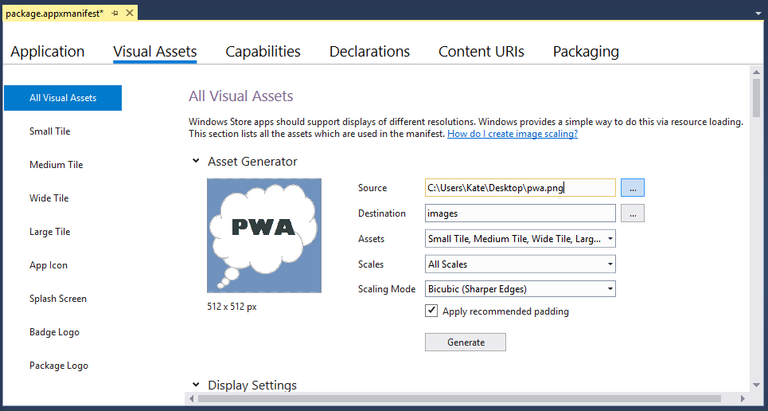
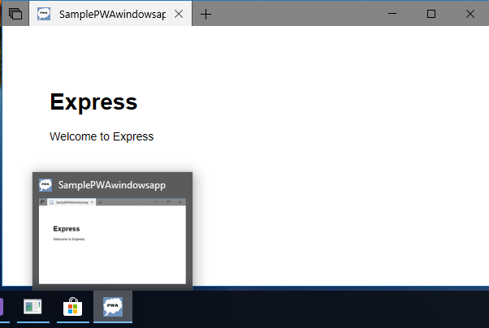
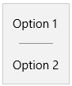

# <span data-ttu-id="84f10-104">Windows 用に PWA (EdgeHTML) を調整する</span><span class="sxs-lookup"><span data-stu-id="84f10-104">Tailor your PWA (EdgeHTML) for Windows</span></span>  

<span data-ttu-id="84f10-105">Windows 10 にインストールされている[][PwaIndexWindows10]PAS には、ユニバーサル[Windows プラットフォーム \(UWP\)][WindowsUWPGetStartedGuide]アプリとして実行する利点があります。たとえば、Windows アプリのサンドボックス セキュリティによる保護や[、Windows ランタイム \(WinRT\))][UwpApiIndex] API へのフル アクセスなど、次の機能を含むすべての利点があります。</span><span class="sxs-lookup"><span data-stu-id="84f10-105">PWAs installed on Windows 10 enjoy [all the benefits][PwaIndexWindows10] of running as [Universal Windows Platform \(UWP\)][WindowsUWPGetStartedGuide] apps, including protection through Windows app sandboxing security and full access to [Windows Runtime \(WinRT\))][UwpApiIndex] APIs, including those for:</span></span>  

*   <span data-ttu-id="84f10-106">デバイス機能の制御 \(カメラ、マイク、GPS\)</span><span class="sxs-lookup"><span data-stu-id="84f10-106">Controlling device features \(such as camera, microphone, GPS\)</span></span>  
*   <span data-ttu-id="84f10-107">ユーザー リソース \(予定表、連絡先、ドキュメント、音楽など) へのアクセス</span><span class="sxs-lookup"><span data-stu-id="84f10-107">Accessing user resources \(such as calendar, contacts, documents, music\)</span></span>  
*   <span data-ttu-id="84f10-108">Cortana 音声コマンドによるアプリの起動/ナビゲーション</span><span class="sxs-lookup"><span data-stu-id="84f10-108">Launching / navigating your app through Cortana voice commands</span></span>  
*   <span data-ttu-id="84f10-109">Windows OS との統合 \(Windows アクション センター、デスクトップ タスク バー、コンテキスト メニュー\)</span><span class="sxs-lookup"><span data-stu-id="84f10-109">Integrating with the Windows OS \(through the Windows Action Center, desktop taskbar, and context menus\)</span></span>  
    
<span data-ttu-id="84f10-110">これらは、Windows 上の PWA \(EdgeHTML\) 用に追加された可能性の一部に限定されます。</span><span class="sxs-lookup"><span data-stu-id="84f10-110">These are only a few of the added possibilities for your PWA \(EdgeHTML\) on Windows.</span></span>  

<span data-ttu-id="84f10-111">この記事では、クロスブラウザーとクロスプラットフォームの互換性を維持しながら、Windows 10 アプリとして PWA \(EdgeHTML\) をインストール、実行、拡張する方法について説明します。</span><span class="sxs-lookup"><span data-stu-id="84f10-111">This article shows you how to install, run, and enhance your PWA \(EdgeHTML\) as a Windows 10 app, while still ensuring cross-browser and cross-platform compatibility.</span></span>  

> [!IMPORTANT]
> <span data-ttu-id="84f10-112">この記事の例と手順では、2017 Visual Studio必要です。</span><span class="sxs-lookup"><span data-stu-id="84f10-112">The examples and steps in this article require Visual Studio 2017.</span></span> <span data-ttu-id="84f10-113">Visual Studio 2019 には、この記事で使用されるテンプレートは含めではありません。</span><span class="sxs-lookup"><span data-stu-id="84f10-113">Visual Studio 2019 does not include the template used in this article.</span></span> <span data-ttu-id="84f10-114">2017 Visual Studioダウンロードするには、「Visual Studio [Downloads - 2017, 2015 & Previous Versions」を参照してください][PreviousVSDownloads]。</span><span class="sxs-lookup"><span data-stu-id="84f10-114">To download Visual Studio 2017, see [Visual Studio Downloads - 2017, 2015 & Previous Versions][PreviousVSDownloads]</span></span>  


## <span data-ttu-id="84f10-115">前提条件</span><span class="sxs-lookup"><span data-stu-id="84f10-115">Prerequisites</span></span>  

*   <span data-ttu-id="84f10-116">既存の PWA \(またはホストされた Web アプリ\)、ライブ サイトまたは localhost サイト。</span><span class="sxs-lookup"><span data-stu-id="84f10-116">An existing PWA \(or hosted web app\), either a live or localhost site.</span></span>  <span data-ttu-id="84f10-117">このガイドでは、段階的な Web アプリの使用を開始するサンプル PWA [を使用します][PwaGetStarted]。</span><span class="sxs-lookup"><span data-stu-id="84f10-117">This guide uses the sample PWA from [Get started with Progressive Web Apps][PwaGetStarted].</span></span>  
*   <span data-ttu-id="84f10-118">コミュニティ [2017][MicrosoftVisualStudio|::ref1::|]の \(free\) Visual Studioダウンロードします。</span><span class="sxs-lookup"><span data-stu-id="84f10-118">Download the \(free\) [Visual Studio Community 2017][MicrosoftVisualStudio|::ref1::|].</span></span>  <span data-ttu-id="84f10-119">Professional エディション、Enterprise エディション、または Preview エディション [を使用][MicrosoftVisualStudioPreview] できます。</span><span class="sxs-lookup"><span data-stu-id="84f10-119">You are also able to use the Professional, Enterprise, or [Preview][MicrosoftVisualStudioPreview] editions.</span></span>  <span data-ttu-id="84f10-120">新しいVisual Studioから、次のワークロードを選択します。</span><span class="sxs-lookup"><span data-stu-id="84f10-120">From the Visual Studio Installer, choose the following Workloads:</span></span>  
    *   **<span data-ttu-id="84f10-121">ユニバーサル Windows プラットフォーム開発</span><span class="sxs-lookup"><span data-stu-id="84f10-121">Universal Windows Platform development</span></span>**  
        
## <span data-ttu-id="84f10-122">ユニバーサル Windows アプリをセットアップして実行する</span><span class="sxs-lookup"><span data-stu-id="84f10-122">Set up and run your Universal Windows app</span></span>  

<span data-ttu-id="84f10-123">Windows 10 アプリとしてインストールされた PWA \(EdgeHTML\) は、ブラウザーとは別に、スタンドアロン \( `WWAHost.exe` プロセス\) ウィンドウで実行されます。</span><span class="sxs-lookup"><span data-stu-id="84f10-123">A PWA \(EdgeHTML\) installed as a Windows 10 app runs independently from the browser, in a standalone \(`WWAHost.exe` process\) window.</span></span>  <span data-ttu-id="84f10-124">これを有効にする場合は、ホストされた Web アプリを含む軽量なアプリ ラッパーが必要です。このラッパーを使用すると、プロジェクト テンプレートを使用してすばやくVisual Studio `Progressive Web App (Universal Windows)` できます。</span><span class="sxs-lookup"><span data-stu-id="84f10-124">Enabling this simply requires a lightweight app wrapper that contains your hosted web app, which you are able to quickly set up using the Visual Studio `Progressive Web App (Universal Windows)` project template.</span></span>  <span data-ttu-id="84f10-125">\(ネイティブの Windows ランタイム API 要求の送信を含むすべてのアプリ ロジックは、元の Web アプリ コードで引き続き実行されます。\)</span><span class="sxs-lookup"><span data-stu-id="84f10-125">\(All your app logic, including sending native Windows Runtime API requests, still happens in your original web app code.\)</span></span>  

<span data-ttu-id="84f10-126">Windows アプリの開発環境を Visual Studio。</span><span class="sxs-lookup"><span data-stu-id="84f10-126">Set up your Windows app development environment in Visual Studio.</span></span>  

1.  <span data-ttu-id="84f10-127">Windows の設定で、開発者モードを [有効にします][WindowsUWPGetStartedEnable]。</span><span class="sxs-lookup"><span data-stu-id="84f10-127">In your Windows Settings, turn on [Developer mode][WindowsUWPGetStartedEnable].</span></span>  <span data-ttu-id="84f10-128">\(Windows `developer mode` 検索バーを入力して検索します。\)</span><span class="sxs-lookup"><span data-stu-id="84f10-128">\(Type `developer mode` in the Windows searchbar to find it.\)</span></span>  
1.  <span data-ttu-id="84f10-129">新しいVisual Studioを起動し、[ **新しいプロジェクトの作成] を選択します**。</span><span class="sxs-lookup"><span data-stu-id="84f10-129">Launch Visual Studio and select **Create a new project...**.</span></span>  
1.  <span data-ttu-id="84f10-130">**Javascript Windows ユニバーサル**  >  **を選択し**、Visual Studio 2017 のプロジェクトの種類の一覧から [段階的な Web アプリ (ユニバーサル**Windows)** ] を選択します。</span><span class="sxs-lookup"><span data-stu-id="84f10-130">Choose **Javascript** > **Windows Universal** and select **Progressive Web App (Universal Windows)** from the list of project types in Visual Studio 2017.</span></span>  
1.  <span data-ttu-id="84f10-131">既定の Windows 10 `Target version` \(最新リリース\) と `Minimum version` \(ビルド 10586 以上\) を選択し **、[OK]** を選択します。</span><span class="sxs-lookup"><span data-stu-id="84f10-131">Select the default Windows 10 `Target version` \(most recent release\) and `Minimum version` \(build 10586 or higher\) and choose **OK**.</span></span>  
    
      
    
    <span data-ttu-id="84f10-133">新しいプロジェクトが読み込まれると、package.appxmanifest デザイナーが開きます。</span><span class="sxs-lookup"><span data-stu-id="84f10-133">Your new project loads with the package.appxmanifest designer open.</span></span>  <span data-ttu-id="84f10-134">ここで、パッケージ ID、パッケージの依存関係、必要な機能、ビジュアル要素、拡張性ポイントなど、アプリの詳細を構成します。</span><span class="sxs-lookup"><span data-stu-id="84f10-134">This is where you configure the details of your app, including package identity, package dependencies, required capabilities, visual elements, and extensibility points.</span></span>  <span data-ttu-id="84f10-135">これは、アプリ開発時に使用されるアプリ パッケージ マニフェストの簡単に構成可能な一時的なバージョンです。</span><span class="sxs-lookup"><span data-stu-id="84f10-135">This is an easily configurable, temporary version of the app package manifest used during app development.</span></span>  
    <span data-ttu-id="84f10-136">アプリ プロジェクトをビルドすると、Visual Studioこのメタデータから [AppxManifest.xml][UwpSchemasAppxpackageUapmanifestschemaGeneratePackageManifest] ファイルが生成されます。このファイルは、アプリのインストールと実行に使用されます。</span><span class="sxs-lookup"><span data-stu-id="84f10-136">When you build your app project, [Visual Studio generates an AppxManifest.xml][UwpSchemasAppxpackageUapmanifestschemaGeneratePackageManifest] file from this metadata, which is used to install and run your app.</span></span>  <span data-ttu-id="84f10-137">ファイルを更新する場合は常に、プロジェクトをリビルドして、実行時に両方 `package.appxmanifest` が反映されます `AppxManifest.xml` 。</span><span class="sxs-lookup"><span data-stu-id="84f10-137">Whenever you update your `package.appxmanifest` file, be sure to rebuild the project so both are reflected in your `AppxManifest.xml` at runtime.</span></span>  
    
1.  <span data-ttu-id="84f10-138">マニフェスト デザイナーの **アプリケーション パネル** で、PWA の URL を次のように入力します `Start page` 。</span><span class="sxs-lookup"><span data-stu-id="84f10-138">In the manifest designer **Application** panel, enter the URL of your PWA as the `Start page`.</span></span>
    
    > [!NOTE]
    > <span data-ttu-id="84f10-139">サービス ワーカーは、次のように指定された https \(secure, remote\) URL すべてでサポートされています `StartPage` 。</span><span class="sxs-lookup"><span data-stu-id="84f10-139">Service workers are supported for all https \(secure, remote\) urls specified as the `StartPage`.</span></span>  <span data-ttu-id="84f10-140">サービス ワーカーは、既定では、ローカルのスタート ページを指定する Web アプリではサポートされていません。</span><span class="sxs-lookup"><span data-stu-id="84f10-140">Service workers are not supported by default for web apps that specify a local start page.</span></span>  <span data-ttu-id="84f10-141">これらのケースでサービス ワーカー サポートを有効にするには、マニフェストに明示的な [ApplicationContentUriRules](#set-application-content-uri-rules-acurs) エントリを追加します。次に例を示します。</span><span class="sxs-lookup"><span data-stu-id="84f10-141">To enable service worker support for these cases, add an explicit [ApplicationContentUriRules](#set-application-content-uri-rules-acurs) entry to the manifest, for example:</span></span> `<uap:Rule Match="http://web-platform.test/" Type="include" uap5:ServiceWorker="true"/>`  
    
      
    
    <span data-ttu-id="84f10-143">また、必要に応じて `Display name` `Description` 変更できます。</span><span class="sxs-lookup"><span data-stu-id="84f10-143">You are able to also modify the `Display name` and `Description` as you like.</span></span>  
1.  <span data-ttu-id="84f10-144">このファイル \(または選択した別の 512x512 イメージ\) をデスクトップに保存します。</span><span class="sxs-lookup"><span data-stu-id="84f10-144">Save this file \(or another 512x512 image of your choosing\) to your desktop.</span></span>  
    <span data-ttu-id="84f10-145">次に、マニフェスト デザイナーの **[ビジュアル 資産**] パネルで、フィールド ... ボタンをクリックし、ソース ファイルとして選択し、[生成] `Source` をクリック**します**。 </span><span class="sxs-lookup"><span data-stu-id="84f10-145">Then, in the manifest designer **Visual Assets** panel, click on the `Source` field **...** button, select it as your source file, and click **Generate**.</span></span>  <span data-ttu-id="84f10-146">**\([OK] をクリック**して既定のプレースホルダーイメージを上書きします\)。</span><span class="sxs-lookup"><span data-stu-id="84f10-146">\(Then click **OK** to overwrite the default placeholder images\).</span></span>  
    
      
    
    <span data-ttu-id="84f10-148">これにより、ストアにアプリをインストール、実行、起動、配布するための基本的なビジュアル アセットが生成されます。</span><span class="sxs-lookup"><span data-stu-id="84f10-148">This generates the basic visual assets for installing, running, launching, and distributing your app in the store.</span></span>  
    <span data-ttu-id="84f10-149">画像が見つからないことを示す赤い \( \) エラーが表示された場合は、... ボタンをクリックして、生成されたイメージからファイルを手動で選択 `X` できます。 </span><span class="sxs-lookup"><span data-stu-id="84f10-149">If you see any red \(`X`\) errors indicating missing images, you are able to click on the **...** buttons to manually select a file from the generated images.</span></span>  
1.  <span data-ttu-id="84f10-150">マニフェスト デザイナーの**コンテンツ URI パネル**で `http://example.com` 、PWA \(および \) の場所に `Rule`  =  `include` 置き `WinRT Access`  =  `All` 換えます。</span><span class="sxs-lookup"><span data-stu-id="84f10-150">In the manifest designer **Content URIs** panel, replace `http://example.com` with the location of your PWA \(such that `Rule` = `include` and `WinRT Access` = `All`\).</span></span>  
    <span data-ttu-id="84f10-151">これにより、Windows 10 アプリとして実行するときにネイティブの Windows ランタイム \(WinRT\) API 要求を送信するための PWA アクセス許可が付与されます。この API 要求については、少し後で説明します。</span><span class="sxs-lookup"><span data-stu-id="84f10-151">This grants your PWA permission to send native Windows Runtime \(WinRT\) API requests when running as a Windows 10 app, which is covered a bit later.</span></span>   <span data-ttu-id="84f10-152">実際の PWA が WinRT アクセスを必要としない場合は、値を次の値に `WinRT Access` 切り替えます `None` 。</span><span class="sxs-lookup"><span data-stu-id="84f10-152">If your actual PWA does not require WinRT access, you are able to switch the `WinRT Access` value to `None`.</span></span>  <span data-ttu-id="84f10-153">どちらの場合も、PWA の URI を使用して既定の文字列をサブアウトするか、アプリが実行時に適切に読み込 `http://example.com` めません。</span><span class="sxs-lookup"><span data-stu-id="84f10-153">Either way, be sure to sub out the default `http://example.com` string with the URI of your PWA, or your app is not able to properly load at runtime.</span></span>  
    <span data-ttu-id="84f10-154">PWA を Windows 10 アプリとして実行してデバッグする準備が整いました。</span><span class="sxs-lookup"><span data-stu-id="84f10-154">You are ready to run and debug your PWA as a Windows 10 app.</span></span>  <span data-ttu-id="84f10-155">このガイドの手順を実行するために localhost サイトを使用している場合は、それが実行されている必要があります。</span><span class="sxs-lookup"><span data-stu-id="84f10-155">If you are using a localhost site to step through this guide, make sure it is running.</span></span>  <span data-ttu-id="84f10-156">そうしたら</span><span class="sxs-lookup"><span data-stu-id="84f10-156">Then,</span></span>  
1.  <span data-ttu-id="84f10-157">PWA プロジェクト `Ctrl` + `Shift` + `F5` を \( \) ビルド `F5` して \( \) 実行します。</span><span class="sxs-lookup"><span data-stu-id="84f10-157">Build \(`Ctrl`+`Shift`+`F5`\) and Run \(`F5`\) your PWA project.</span></span>  <span data-ttu-id="84f10-158">これで、スタンドアロンのアプリ ウィンドウで Web サイトが起動する必要があります。</span><span class="sxs-lookup"><span data-stu-id="84f10-158">Your website should now launch in a standalone app window.</span></span>  <span data-ttu-id="84f10-159">ホストされた Web アプリであるだけでなく、Windows 10 にインストールされている段階的な Web アプリとして実行されています。</span><span class="sxs-lookup"><span data-stu-id="84f10-159">Not only is it a hosted web app; it is running as a Progressive Web App installed on Windows 10!</span></span>  
    
      
    
## <span data-ttu-id="84f10-161">PWA \(EdgeHTML\) を Windows アプリとしてデバッグする</span><span class="sxs-lookup"><span data-stu-id="84f10-161">Debug your PWA \(EdgeHTML\) as a Windows app</span></span>  

<span data-ttu-id="84f10-162">PWA \(EdgeHTML\) は単純に段階的に拡張されたホストされた Web アプリなので、通常の IDE とワークフローを使用して、任意の Web アプリと同じサーバー側コードをデバッグできます。</span><span class="sxs-lookup"><span data-stu-id="84f10-162">Because a PWA \(EdgeHTML\) is simply a progressively enhanced hosted web app, you are able to debug your server-side code the same as any web app, using your usual IDE and workflow.</span></span>  <span data-ttu-id="84f10-163">ライブで展開した変更は、次回起動した PWA に反映されます (ユニバーサル Windows アプリ パッケージを再展開する必要はありません)。</span><span class="sxs-lookup"><span data-stu-id="84f10-163">The changes you deploy live are reflected in your installed PWA the next time you launch it \(no need to redeploy your Universal Windows app package\).</span></span>

<span data-ttu-id="84f10-164">Windows 10 アプリ内でのクライアント側デバッグには、アプリが必要 `Microsoft Edge DevTools Preview` です。</span><span class="sxs-lookup"><span data-stu-id="84f10-164">For client-side debugging within your Windows 10 app, you must have the `Microsoft Edge DevTools Preview` app.</span></span>  <span data-ttu-id="84f10-165">このスタンドアロン アプリには、元のブラウザー内の Microsoft [Edge DevTools][DevToolsGuide] [][DevToolsGuideMicrosoftStoreApp] [][DevToolsProtocol01ClientsEdgePreview] [\(PWA][DevToolsGuideServiceWorkers]ツール \ を含む) のすべての機能に加えて、基本的なリモート デバッグ サポートと、EdgeHTML エンジンの実行中のインスタンスにアタッチするためのデバッグ ターゲットの選択 (Office、Cortana、アプリ Web ビュー、Windows で実行される PWA など) が含まれています。</span><span class="sxs-lookup"><span data-stu-id="84f10-165">This standalone app includes all the functionality of the original in-browser [Microsoft Edge DevTools][DevToolsGuide] \(including [PWA tools][DevToolsGuideServiceWorkers]\), plus basic [remote debugging][DevToolsProtocol01ClientsEdgePreview] support and a [Debug Target chooser][DevToolsGuideMicrosoftStoreApp] for attaching to any running instance of the EdgeHTML engine, including add-ins for Office, Cortana, app webviews, and of course, PWAs running on Windows.</span></span>  

<span data-ttu-id="84f10-166">PWA \(EdgeHTML\) のデバッグを設定する方法を次に示します。</span><span class="sxs-lookup"><span data-stu-id="84f10-166">Here is how to set up debugging for your PWA \(EdgeHTML\).</span></span>  

1.  <span data-ttu-id="84f10-167">Microsoft [Store から Microsoft Edge DevTools Preview][MicrosoftStoreEdgeDevtoolsPreview] アプリをまだインストールしていない場合はインストールします。</span><span class="sxs-lookup"><span data-stu-id="84f10-167">Install the [Microsoft Edge DevTools Preview][MicrosoftStoreEdgeDevtoolsPreview] app from the Microsoft Store if you do not already have it.</span></span>  
1.  <span data-ttu-id="84f10-168">PWA サイトを起動して実行した状態で、DevTools アプリを起動します。</span><span class="sxs-lookup"><span data-stu-id="84f10-168">With your PWA site up and running, launch the DevTools app.</span></span>  
1.  <span data-ttu-id="84f10-169">次Visual Studio、( ) コマンドを使って Windows 10 アプリ `Start Without Debugging` `Ctrl` + `F5` を起動します。</span><span class="sxs-lookup"><span data-stu-id="84f10-169">From Visual Studio, launch your Windows 10 app with the `Start Without Debugging` (`Ctrl`+`F5`) command.</span></span>  <span data-ttu-id="84f10-170">\(デバッガーがアクティブな場合、DevTools Visual Studioが正しくアタッチされません。\)</span><span class="sxs-lookup"><span data-stu-id="84f10-170">\(The DevTools app does not attach properly if the Visual Studio debugger is active.\)</span></span>  
1.  <span data-ttu-id="84f10-171">DevTools アプリで、[ローカル デバッグ ターゲットの選択] の [更新] ボタンをクリックします。</span><span class="sxs-lookup"><span data-stu-id="84f10-171">In the DevTools app, click the **Refresh** button in the Local debug target chooser.</span></span>  <span data-ttu-id="84f10-172">これで、PWA \(EdgeHTML\) サイトが一覧表示されます。</span><span class="sxs-lookup"><span data-stu-id="84f10-172">Your PWA \(EdgeHTML\) site should now be listed.</span></span>  <span data-ttu-id="84f10-173">\(ブラウザー ウィンドウでも実行されている場合は、リスト内のそのサイトの最後のインスタンスです。\)</span><span class="sxs-lookup"><span data-stu-id="84f10-173">\(If it is also running in a browser window, it is the last instance of that site in the list.\)</span></span>  
1.  <span data-ttu-id="84f10-174">PWA \(EdgeHTML\) サイト一覧をクリックして、新しい DevTools インスタンス タブを開き、デバッグを開始します。</span><span class="sxs-lookup"><span data-stu-id="84f10-174">Click on your PWA \(EdgeHTML\) site listing to open a new DevTools instance tab and start debugging.</span></span>  
    
      
    
1.  <span data-ttu-id="84f10-176">DevTools が PWA で実行されている Windows アプリとしてアタッチされているのを確認できます。</span><span class="sxs-lookup"><span data-stu-id="84f10-176">You are able to verify that DevTools is attached to your PWA-running-as-Windows-app.</span></span>  <span data-ttu-id="84f10-177">DevTools コンソールで **、次のコマンド**を入力します。</span><span class="sxs-lookup"><span data-stu-id="84f10-177">In the DevTools **Console**, type:</span></span>  
    
    ```shell
    window.Windows
    ```  
    
    <span data-ttu-id="84f10-178">これにより、すべてのトップ レベル WinRT 名前空間を含む `Windows Runtime` [グローバル オブジェクトが返されます](#find-windows-runtime-winrt-apis)。</span><span class="sxs-lookup"><span data-stu-id="84f10-178">This returns the global `Windows Runtime` object containing all of the [top-level WinRT namespaces](#find-windows-runtime-winrt-apis).</span></span>  <span data-ttu-id="84f10-179">これは、ユニバーサル [Windows][WindowsUWPIndex]プラットフォームへの PWA \(EdgeHTML\) エントリポイントであり、Windows 10 アプリとして実行される Web アプリ (ブラウザーの外部で実行中のプロセス) にのみ公開されます `WWAHost.exe` 。</span><span class="sxs-lookup"><span data-stu-id="84f10-179">This is your PWA \(EdgeHTML\) entrypoint to the [Universal Windows Platform][WindowsUWPIndex], and only exposed to web apps that run as Windows 10 apps (running outside the browser, in a `WWAHost.exe` process).</span></span>  
    
## <span data-ttu-id="84f10-180">Windows ランタイム (WinRT) API の検索</span><span class="sxs-lookup"><span data-stu-id="84f10-180">Find Windows Runtime (WinRT) APIs</span></span>  

<span data-ttu-id="84f10-181">インストールされている Windows アプリとして [、PWA \(EdgeHTML\)][WindowsRuntime]はネイティブの Windows ランタイム API にフル アクセスできます。使用する必要のある情報を特定し、必要なアクセス許可を取得し、機能検出を使用して、サポートされている環境で API 要求を送信します。</span><span class="sxs-lookup"><span data-stu-id="84f10-181">As an installed Windows app, your [PWA \(EdgeHTML\) has full access to native Windows Runtime APIs][WindowsRuntime]; identify what you need to use, obtain the requisite permissions, and employ feature detection to send that API request on supported environments.</span></span>  <span data-ttu-id="84f10-182">このプロセスを実行して、PWA の Windows デスクトップ ユーザー向け段階的な拡張機能を追加します。</span><span class="sxs-lookup"><span data-stu-id="84f10-182">Walk through this process to add a progressive enhancement for Windows desktop users of your PWA.</span></span>  

<span data-ttu-id="84f10-183">Windows PWA に必要なユニバーサル Windows プラットフォーム API を特定するには、包括的な [Windows デベロッパー センターでの UWP ドキュメント][uwp/api/] の検索、Visual Studio を使った [UWP](#uwp-code-samples) コード サンプルのダウンロードと実行、Windows 上の PWA の一般的なタスクのコード スニペットの参照など、さまざまな方法があります。</span><span class="sxs-lookup"><span data-stu-id="84f10-183">There are a number of ways to identify the Universal Windows Platform APIs you need for your Windows PWA, including searching the comprehensive [UWP docs on Windows Dev Center][uwp/api/], downloading and running [UWP code samples](#uwp-code-samples) with Visual Studio, and browsing code snippets for common tasks for PWAs on Windows.</span></span>

<span data-ttu-id="84f10-184">Windows PWA に必要なユニバーサル Windows プラットフォーム API を特定する方法は多数あります。たとえば、包括的な [Windows デベロッパー センターでの UWP ドキュメント][uwp/api/] の検索、Visual Studio を使った [UWP](#uwp-code-samples) コード サンプルのダウンロードと実行 [、Windows 10 (EdgeHTML)][PwaIndexWindows10]での PWA の一般的なタスクのコード スニペットの参照などです。</span><span class="sxs-lookup"><span data-stu-id="84f10-184">There are a number of ways to identify the Universal Windows Platform APIs you need for your Windows PWA, including searching the comprehensive [UWP docs on Windows Dev Center][uwp/api/], downloading and running [UWP code samples](#uwp-code-samples) with Visual Studio, and browsing code snippets for common tasks for [PWAs on Windows 10 (EdgeHTML)][PwaIndexWindows10].</span></span>  

<span data-ttu-id="84f10-185">全体として、WinRT API は C# の場合と同じように JavaScript で動作します。そのため、一般的なユニバーサル [Windows][WindowsUWPIndex] プラットフォームのドキュメントと [API][UwpApiIndex] リファレンスに従って使用できます。</span><span class="sxs-lookup"><span data-stu-id="84f10-185">Overall, WinRT APIs work in JavaScript the same way they do in C#, so you may follow the general [Universal Windows Platform documentation][WindowsUWPIndex] and [API Reference][UwpApiIndex] for usage.</span></span>  <span data-ttu-id="84f10-186">ただし、次の相違点に注意してください。</span><span class="sxs-lookup"><span data-stu-id="84f10-186">However, please note the following differences:</span></span>  

*   <span data-ttu-id="84f10-187">JavaScript の WinRT 機能では、異  [なる大文字と小文字の規則が使用されます。][ScriptingJsinrtUsingWinRTCasingConventions]</span><span class="sxs-lookup"><span data-stu-id="84f10-187">WinRT features in JavaScript use  [different casing conventions][ScriptingJsinrtUsingWinRTCasingConventions]</span></span>  
*   <span data-ttu-id="84f10-188">[イベントは、クラス メソッドに渡される][ScriptingJsinrtHandlingWinRTEvents]文字列識別子として `addEventListener` / `removeEventListener` 表されます。</span><span class="sxs-lookup"><span data-stu-id="84f10-188">[Events are represented as string identifiers][ScriptingJsinrtHandlingWinRTEvents] passed to class `addEventListener`/`removeEventListener` methods</span></span>  
*   <span data-ttu-id="84f10-189">[非同期メソッドで][ScriptingJsinrtUsingWinRT] JavaScript Promise モデルを使用する</span><span class="sxs-lookup"><span data-stu-id="84f10-189">[Asynchronous methods][ScriptingJsinrtUsingWinRT] use the JavaScript Promise model</span></span>  
*   <span data-ttu-id="84f10-190">名前空間内の API は、代わりに EdgeHTML エンジン Web レンダリング スタック `Windows.UI.Xaml` \(HTML, CSS\) を使用する JavaScript アプリではサポートされていません。 [][DevGuideWhatsNew]</span><span class="sxs-lookup"><span data-stu-id="84f10-190">APIs in the `Windows.UI.Xaml` namespace are not supported for JavaScript apps, which instead use the [EdgeHTML][DevGuideWhatsNew] engine web rendering stack \(HTML, CSS\)</span></span>  
    
<span data-ttu-id="84f10-191">詳しくは [、JavaScript での Windows ランタイムの使用に関するページをご覧ください][WindowRuntimeUsingJavascript]。</span><span class="sxs-lookup"><span data-stu-id="84f10-191">For more details, see [Using the Windows Runtime in JavaScript][WindowRuntimeUsingJavascript].</span></span>  

### <span data-ttu-id="84f10-192">UWP コード サンプル</span><span class="sxs-lookup"><span data-stu-id="84f10-192">UWP code samples</span></span>  

<span data-ttu-id="84f10-193">ユニバーサル [Windows プラットフォーム \(UWP\)][MicrosoftDeveloperWindowsSamples] コード サンプル のレポを参照して、Windows 10 アプリの一般的なシナリオの JavaScript の例を参照してください。</span><span class="sxs-lookup"><span data-stu-id="84f10-193">Check out the [Universal Windows Platform \(UWP\) Code Samples][MicrosoftDeveloperWindowsSamples] repo to browse JavaScript examples for common Windows 10 app scenarios.</span></span>  <span data-ttu-id="84f10-194">これらのサンプルの JS バージョンは [WinJS][GithubWinjsWinjs] ライブラリを使用してサンプル テンプレートを構造化しますが、これらのサンプルで示されている WinRT API 要求を送信するために WinJS は必要ありません。</span><span class="sxs-lookup"><span data-stu-id="84f10-194">Although the JS versions of these samples use the [WinJS][GithubWinjsWinjs] library to structure the sample template, WinJS is not required for sending the WinRT API requests demonstrated in these samples.</span></span>  

> [!NOTE]
> <span data-ttu-id="84f10-195">アプリのイベントをリッスンする必要がある場合は、次のネイティブ WinRT API を使用 [`activated`][UwpApiWindowsUiWebuiWebapplicationActivated] してこれを行います。</span><span class="sxs-lookup"><span data-stu-id="84f10-195">If you need to listen for the [`activated`][UwpApiWindowsUiWebuiWebapplicationActivated] event for the app, you are able to do this using the following native WinRT API:</span></span>  
> 
> **<span data-ttu-id="84f10-196">使用する</span><span class="sxs-lookup"><span data-stu-id="84f10-196">Use this</span></span>**  
> 
> ```javascript
> Windows.UI.WebUI.WebUIApplication.addEventListener("activated", function (activatedEventArgs) {
>     // Check activatedEventArgs.kind and respond as needed
> });
> ```  
> 
> <span data-ttu-id="84f10-197">...サンプルで使用される WinJS 要求とは対照的に、次の種類の WinJS 要求です。</span><span class="sxs-lookup"><span data-stu-id="84f10-197">... as opposed this type of WinJS request used in the samples:</span></span>  
> 
> **<span data-ttu-id="84f10-198">不適切な例</span><span class="sxs-lookup"><span data-stu-id="84f10-198">Not this</span></span>**  
> 
> ```javascript
>     var page = WinJS.UI.Pages.define("/html/scenario1-launched.html", {
>         ready: function (element, options) {
>             // Check options.activationKind and respond as needed
>         }
>     });
> ```  

## <span data-ttu-id="84f10-199">PWA (EdgeHTML) から WinRT API 要求を送信する</span><span class="sxs-lookup"><span data-stu-id="84f10-199">Send WinRT API requests from your PWA (EdgeHTML)</span></span>  

<span data-ttu-id="84f10-200">この時点で、PWA \(EdgeHTML\) の Windows ユーザー向けカスタム コンテキスト メニューを追加し [、Windows.UI.Popups][UwpApiWindowsUiPopups] 名前空間で必要な API を特定したとします。</span><span class="sxs-lookup"><span data-stu-id="84f10-200">At this point, pretend you want to add a custom context menu for Windows users of our PWA \(EdgeHTML\) and have identified the APIs you need in the [Windows.UI.Popups][UwpApiWindowsUiPopups] namespace.</span></span>  

<span data-ttu-id="84f10-201">PWA \(EdgeHTML\) から WinRT API 要求を送信するには、まず、Windows アプリ パッケージ マニフェスト \( \) ファイルに必要なアクセス許可[\(](#set-application-content-uri-rules-acurs)または、アプリケーション コンテンツ URI 規則\) を確立する必要があります。 `.appxmanifest`</span><span class="sxs-lookup"><span data-stu-id="84f10-201">In order to send any WinRT APIs requests from our PWA \(EdgeHTML\), you first need to [establish the requisite permissions](#set-application-content-uri-rules-acurs) \(or, Application Content URI Rules\) in your Windows app package manifest \(`.appxmanifest`\) file.</span></span>  

<span data-ttu-id="84f10-202">これらの API 要求の中に、画像や音楽のようなユーザー リソースへのアクセスや、カメラやマイクのようなデバイス機能へのアクセスが含まれる場合[](#app-capability-declarations)は、Windows がユーザーにアクセス許可を求めるメッセージを表示するために、アプリ機能の宣言をアプリ パッケージ マニフェストに追加する必要があります。</span><span class="sxs-lookup"><span data-stu-id="84f10-202">If any of these API requests involve access to user resources like pictures or music, or to device features like the camera or microphone, you also need to add [app capability declarations](#app-capability-declarations) to the app package manifest in order for Windows to prompt the user for permission.</span></span>  <span data-ttu-id="84f10-203">後で PWA \(EdgeHTML\) を Microsoft Store に[][MicrosoftSupportWindowsAppPermissions]公開する場合、必要なアプリのアクセス許可もストア登録情報に表示されます。</span><span class="sxs-lookup"><span data-stu-id="84f10-203">If you later publish your PWA \(EdgeHTML\) to the Microsoft Store, these required [App permissions][MicrosoftSupportWindowsAppPermissions] are also noted in your store listing.</span></span>  

#### <span data-ttu-id="84f10-204">アプリケーション コンテンツ URI ルール (ACURs) を設定する</span><span class="sxs-lookup"><span data-stu-id="84f10-204">Set Application Content URI Rules (ACURs)</span></span>  

<span data-ttu-id="84f10-205">ACUR (URL 許可一覧とも呼ばれる) を使用すると、PWA \(EdgeHTML\) の URL を Windows ランタイム API に直接アクセスできます。</span><span class="sxs-lookup"><span data-stu-id="84f10-205">Through ACURs, otherwise known as a URL allow list, you are able to give the URLs of your PWA \(EdgeHTML\) direct access to Windows Runtime APIs.</span></span>  <span data-ttu-id="84f10-206">Windows OS レベルでは、Web サーバーでホストされているコードがプラットフォーム API 要求を直接送信できる適切なポリシー境界が設定されています。</span><span class="sxs-lookup"><span data-stu-id="84f10-206">At the Windows OS level, the right policy bounds are set to allow code hosted on your web server to directly send platform API requests.</span></span>  <span data-ttu-id="84f10-207">PWA URL を次のように指定する場合は、アプリ パッケージ マニフェスト ファイルでこれらの境界を定義します `ApplicationContentUriRules` 。</span><span class="sxs-lookup"><span data-stu-id="84f10-207">You define these bounds in the app package manifest file when you specify your PWA URLs as `ApplicationContentUriRules`.</span></span>  

<span data-ttu-id="84f10-208">規則には、アプリの開始ページと、アプリ ページとして含めるその他のページを含める必要があります。</span><span class="sxs-lookup"><span data-stu-id="84f10-208">Your rules should include the start page for your app and any other pages you want included as app pages.</span></span>  <span data-ttu-id="84f10-209">ユーザーがルールに含まれていない URL に移動すると、Windows はスタンドアロンの PWA \(EdgeHTML\) ウィンドウ \( process\) ではなく、Microsoft Edge ブラウザーでターゲット URL を開きます。 `WWAHost.exe`</span><span class="sxs-lookup"><span data-stu-id="84f10-209">If your user navigates to a URL that is not included in your rules, Windows opens the target URL in the Microsoft Edge browser rather than your standalone PWA \(EdgeHTML\) window \(`WWAHost.exe` process\).</span></span>  <span data-ttu-id="84f10-210">特定の URL を除外する場合があります。</span><span class="sxs-lookup"><span data-stu-id="84f10-210">You may also exclude specific URLs.</span></span>  

<span data-ttu-id="84f10-211">ルールで URL を指定するには `Match` 、いくつかの方法があります。</span><span class="sxs-lookup"><span data-stu-id="84f10-211">There are several ways to specify a URL `Match` in your rules:</span></span>  

*   <span data-ttu-id="84f10-212">完全なホスト名</span><span class="sxs-lookup"><span data-stu-id="84f10-212">An exact hostname</span></span>  
*   <span data-ttu-id="84f10-213">任意のサブドメインを指定した URI を含むホスト名、またはサブドメインを指定した URI を除外したホスト名</span><span class="sxs-lookup"><span data-stu-id="84f10-213">A hostname for which a URI with any subdomain of that hostname is included or excluded</span></span>  
*   <span data-ttu-id="84f10-214">完全な URI</span><span class="sxs-lookup"><span data-stu-id="84f10-214">An exact URI</span></span>  
*   <span data-ttu-id="84f10-215">クエリ プロパティを含む正確な URI</span><span class="sxs-lookup"><span data-stu-id="84f10-215">An exact URI containing a query property</span></span>  
*   <span data-ttu-id="84f10-216">対象に含めるルールの場合は、部分的なパスと、特定のファイル拡張子を示すワイルドカード</span><span class="sxs-lookup"><span data-stu-id="84f10-216">A partial path and a wildcard to indicate a particular file extension for an include rule</span></span>  
*   <span data-ttu-id="84f10-217">対象から除外する規則の場合は、相対パス</span><span class="sxs-lookup"><span data-stu-id="84f10-217">Relative paths for exclude rules</span></span>  
    
<span data-ttu-id="84f10-218">ファイル内の ACURs の例を次に示 `.appxmanifest` します。</span><span class="sxs-lookup"><span data-stu-id="84f10-218">Here are a few examples of ACURs in a `.appxmanifest` file:</span></span>  

```xml
<Application
Id="App"
StartPage="https://contoso.com/home">
<uap:ApplicationContentUriRules>
    <uap:Rule Type="include" Match="https://contoso.com/" WindowsRuntimeAccess="all" />
    <uap:Rule Type="include" Match="https://*.contoso.com/" WindowsRuntimeAccess="all" />
    <uap:Rule Type="exclude" Match="https://contoso.com/excludethispage.aspx" />
</uap:ApplicationContentUriRules>
```  

<span data-ttu-id="84f10-219">アプリの ACUR 内で定義された URL は、次の値を受け入れる属性を通じて Windows ランタイムへのアクセス許可 `WindowsRuntimeAccess` を付与できます。</span><span class="sxs-lookup"><span data-stu-id="84f10-219">URLs defined within the ACURs for your app are able to be granted permission to the Windows Runtime through the `WindowsRuntimeAccess` attribute, which accepts the following values:</span></span>  

*   `all`<span data-ttu-id="84f10-220">: リモート JavaScript コードは、すべての WinRT API と任意のローカル パッケージ コンポーネントにアクセスできます。</span><span class="sxs-lookup"><span data-stu-id="84f10-220">: Remote JavaScript code has access to all WinRT APIs and any local packaged components.</span></span>  <span data-ttu-id="84f10-221">[Windows \(WinRT\))][UwpApiIndex]名前空間が挿入され、スクリプト エンジンに存在します。</span><span class="sxs-lookup"><span data-stu-id="84f10-221">The [Windows \(WinRT\))][UwpApiIndex] namespace is injected and present in the script engine.</span></span>  
*   `allowForWeb`<span data-ttu-id="84f10-222">: リモート JavaScript コード アクセスは、カスタム C++/C# コンポーネントを含むローカル パッケージ コンポーネントに限定されます。</span><span class="sxs-lookup"><span data-stu-id="84f10-222">: Remote JavaScript code access is limited to local packaged components, including custom C++/C# components.</span></span>  
*   `none`<span data-ttu-id="84f10-223">: 既定値です。</span><span class="sxs-lookup"><span data-stu-id="84f10-223">: Default.</span></span>  <span data-ttu-id="84f10-224">指定された URL はプラットフォームにアクセスできません。</span><span class="sxs-lookup"><span data-stu-id="84f10-224">The specified URL has no platform access.</span></span>  
    
<span data-ttu-id="84f10-225">このチュートリアルでは、シングルページ アプリに必要な唯一の ACUR (前の[](#set-up-and-run-your-universal-windows-app)[アプリのセットアップと実行] セクションの手順 6)を既に設定しています。</span><span class="sxs-lookup"><span data-stu-id="84f10-225">In this tutorial, you already set the only ACUR that you need \(Step 6 of the previous [Set up and run your app](#set-up-and-run-your-universal-windows-app) section\) for your single-page app.</span></span>  <span data-ttu-id="84f10-226">この確認は、アプリケーション デザイナーの **[コンテンツ URI]** Visual Studio `package.appxmanifest` できます。</span><span class="sxs-lookup"><span data-stu-id="84f10-226">You are able to confirm this from the **Content URIs** panel of the Visual Studio `package.appxmanifest` designer.</span></span>  

  

<span data-ttu-id="84f10-228">また、ソリューション エクスプローラーでファイルを右クリックし、[コードの表示] \( \) を選択Visual Studioマニフェストの生の XML を表示 `package.appxmanifest`  `F7` することもできます。</span><span class="sxs-lookup"><span data-stu-id="84f10-228">You are also able to view the raw XML of your manifest by right-clicking your `package.appxmanifest` file in Visual Studio Solution Explorer and selecting **View Code** \(`F7`\).</span></span>  <span data-ttu-id="84f10-229">デザイナー ビューに戻る場合は、ビュー**デザイナー** \( `Shift` + `F7` \) を選択します。</span><span class="sxs-lookup"><span data-stu-id="84f10-229">To toggle back to the Designer view, select **View Designer** \(`Shift`+`F7`\).</span></span>  

#### <span data-ttu-id="84f10-230">アプリ機能の宣言</span><span class="sxs-lookup"><span data-stu-id="84f10-230">App capability declarations</span></span>  

<span data-ttu-id="84f10-231">アプリで、画像や音楽などのユーザー リソースや、カメラやマイクなどのデバイスへのプログラムによるアクセスが必要な場合は、対応するアプリ[][WindowsUwpPackagingAppCapabilities]機能の宣言をアプリ パッケージ マニフェスト ファイルに含める必要があります。</span><span class="sxs-lookup"><span data-stu-id="84f10-231">If your app needs programmatic access to user resources like pictures or music, or to devices like a camera or a microphone, you must include the corresponding [App capability declarations][WindowsUwpPackagingAppCapabilities] in your app package manifest file.</span></span>  <span data-ttu-id="84f10-232">アプリ機能の宣言には次の 3 つのカテゴリがあります。</span><span class="sxs-lookup"><span data-stu-id="84f10-232">There are three app capability declaration categories:</span></span>  

*   <span data-ttu-id="84f10-233">ストア アプリのほとんどのシナリオに適用される[一般的な用途の機能][WindowsUwpPackagingAppCapabilitiesGeneralUse]。</span><span class="sxs-lookup"><span data-stu-id="84f10-233">[General-use capabilities][WindowsUwpPackagingAppCapabilitiesGeneralUse] that apply to most common app scenarios.</span></span>  
*   <span data-ttu-id="84f10-234">アプリが周辺機器と内部デバイスにアクセスできるようにする[デバイス機能][WindowsUwpPackagingAppCapabilitiesDevice]。</span><span class="sxs-lookup"><span data-stu-id="84f10-234">[Device capabilities][WindowsUwpPackagingAppCapabilitiesDevice] that allow your app to access peripheral and internal devices.</span></span>  
*   <span data-ttu-id="84f10-235">[エンタープライズ シナリオをサポートし、Microsoft][WindowsUwpPackagingAppCapabilitiesSpecialRestricted] Store の会社アカウントを必要とする特殊な使用機能。</span><span class="sxs-lookup"><span data-stu-id="84f10-235">[Special-use capabilities][WindowsUwpPackagingAppCapabilitiesSpecialRestricted] that support enterprise scenarios and require a Microsoft Store company account.</span></span>  <span data-ttu-id="84f10-236">会社のアカウントについて詳しくは、「[アカウントの種類、場所、料金][WindowsUwpPublishAccountTypesLocationsFees]」をご覧ください。</span><span class="sxs-lookup"><span data-stu-id="84f10-236">For more info about company accounts, see [Account types, locations, and fees][WindowsUwpPublishAccountTypesLocationsFees].</span></span>
    
<span data-ttu-id="84f10-237">Microsoft Store アプリ ページには、アプリ パッケージ マニフェストで宣言する機能すべてが一覧表示されます。そのため、アプリが実際に使用する機能のみを指定してください。</span><span class="sxs-lookup"><span data-stu-id="84f10-237">Your Microsoft Store app page lists all the capabilities you declare in your app package manifest, so be sure to only specify the capabilities that your app actually uses.</span></span>

<span data-ttu-id="84f10-238">一部の機能は、機密性の高いリソースへのアクセスをアプリに提供します。</span><span class="sxs-lookup"><span data-stu-id="84f10-238">Some capabilities provide apps access to sensitive resources.</span></span>  <span data-ttu-id="84f10-239">これらのリソースは、各リソースがユーザーの個人データにアクセスしたり、ユーザーにコストがかかるため、機密性の高いリソースと見なされます。</span><span class="sxs-lookup"><span data-stu-id="84f10-239">These resources are considered sensitive because each is able to access the user's personal data or cost the user money.</span></span>  <span data-ttu-id="84f10-240">Windows 10 設定アプリによって管理される[][BingResultsWindows10Settings]プライバシー設定により、ユーザーは機密性の高いリソースへのアクセスを動的に制御できます。</span><span class="sxs-lookup"><span data-stu-id="84f10-240">Privacy settings, managed by the Windows 10 [Settings][BingResultsWindows10Settings] app, let the user dynamically control access to sensitive resources.</span></span>  <span data-ttu-id="84f10-241">したがって、機密性の高いリソースが常に利用可能とアプリで想定されていないことが重要です。</span><span class="sxs-lookup"><span data-stu-id="84f10-241">Thus, it is important that your app does not assume a sensitive resource is always available.</span></span>  <span data-ttu-id="84f10-242">機密性の高いリソースへのアクセスについて詳しくは、「[個人データにアクセスするアプリのガイドライン][WindowsUwpSecurityIndex]」をご覧ください。</span><span class="sxs-lookup"><span data-stu-id="84f10-242">For more info about accessing sensitive resources, see [Guidelines for privacy-aware apps][WindowsUwpSecurityIndex].</span></span>  

<span data-ttu-id="84f10-243">アクセスを要求するには、アプリのパッケージ マニフェストで機能を宣言します。</span><span class="sxs-lookup"><span data-stu-id="84f10-243">You request access by declaring capabilities in the package manifest for your app.</span></span>  <span data-ttu-id="84f10-244">このVisual Studio、package.appxmanifest デザイナーの **[** 機能] パネルから実行できます。</span><span class="sxs-lookup"><span data-stu-id="84f10-244">In Visual Studio, you are able to do this from the **Capabilities** panel of the package.appxmanifest designer.</span></span>  

  

<span data-ttu-id="84f10-246">このチュートリアルでは、既定の Internet \(Client\) 機能だけが必要なので、それ以上の操作は必要ありません。</span><span class="sxs-lookup"><span data-stu-id="84f10-246">In this tutorial, only the default Internet \(Client\) capability is required, so no further action is needed.</span></span>  

### <span data-ttu-id="84f10-247">機能検出を使用して WinRT を呼び出す</span><span class="sxs-lookup"><span data-stu-id="84f10-247">Use feature detection to invoke WinRT</span></span>  

<span data-ttu-id="84f10-248">すべてのプラットフォームで PWA 対象ユーザーの品質基準エクスペリエンスを確保するには、WinRT 機能検出を使用して Windows での PWA エクスペリエンスを段階的に強化します。</span><span class="sxs-lookup"><span data-stu-id="84f10-248">To ensure a quality baseline experience for your PWA audience across all platforms, you progressively enhance your PWA experience on Windows using WinRT feature detection.</span></span>  <span data-ttu-id="84f10-249">これにより、Windows 固有のコードが WinRT API が利用可能で適用可能なコンテキストでのみ実行されるのを確認できます。</span><span class="sxs-lookup"><span data-stu-id="84f10-249">This way, you are able to be sure your Windows-specific code is only run in a context where WinRT APIs are available and applicable.</span></span>  

<span data-ttu-id="84f10-250">機能の検出は、次のようにオブジェクト \(WinRT 名前空間 \へのエントリ ポイント) を探すのと同 `Windows` じほど簡単な場合があります。 [][UwpApiIndex]</span><span class="sxs-lookup"><span data-stu-id="84f10-250">Feature detection may be as simple as looking for the `Windows` object \(the entrypoint to the [WinRT namespace][UwpApiIndex]\) as below:</span></span>  

```javascript
if(window.Windows){
    /*Run code that sends Windows API requests */
}
```  

<span data-ttu-id="84f10-251">ただし、すべての [Windows 10][UwpExtensionSdkDeviceFamiliesOverview]デバイスの種類ですべての Windows API が利用できるわけではありませんが、通常は、送信する API 要求の名前空間をさらに修飾するために、より具体的な機能検出を使用すると便利です。</span><span class="sxs-lookup"><span data-stu-id="84f10-251">However, given that not all Windows APIs are available on all [Windows 10 device types][UwpExtensionSdkDeviceFamiliesOverview], it is generally useful to use more specific feature detection to further qualify the namespace of the API request you are sending:</span></span>  

```javascript
if(window.Windows && Windows.Media.SpeechRecognition){
    /*Run code that sends Windows API requests */
}
```  

<span data-ttu-id="84f10-252">このバックグラウンドで、カスタム コンテキスト メニューを実装するための WinRT コードを追加する準備が整いました。</span><span class="sxs-lookup"><span data-stu-id="84f10-252">With that background, you are ready to add some WinRT code to implement a custom context menu.</span></span>  <span data-ttu-id="84f10-253">[段階的な Web アプリの使用を開始する] のサンプル PWA [を使用している場合][PwaGetStarted]:</span><span class="sxs-lookup"><span data-stu-id="84f10-253">If you are using the sample PWA from [Get started with Progressive Web Apps][PwaGetStarted]:</span></span>

1.  <span data-ttu-id="84f10-254">PWA Visual Studioプロジェクトを開きます。</span><span class="sxs-lookup"><span data-stu-id="84f10-254">Open Visual Studio to your PWA site project.</span></span>  
1.  <span data-ttu-id="84f10-255">ソリューション エクスプローラーでファイルを開き、サービス ワーカーの参照の下に次 `views\layout.pug` `script` の行を追加します。</span><span class="sxs-lookup"><span data-stu-id="84f10-255">In Solution Explorer, open the `views\layout.pug` file and add the following line, right below the `script` reference for your service worker:</span></span>
    
    ```xml
    script(src='/javascripts/site.js')
    ```  
    
1.  <span data-ttu-id="84f10-256">ソリューション エクスプローラーで、フォルダーを右クリックし、[ `javascripts` 新しいファイル**の**追加  >  **...] をクリックします**。</span><span class="sxs-lookup"><span data-stu-id="84f10-256">In Solution Explorer, right-click on the `javascripts` folder and **Add** > **New File...**.</span></span>
1.  <span data-ttu-id="84f10-257">ファイルに名前を `site.js` 付け、次のコードでコピーします。</span><span class="sxs-lookup"><span data-stu-id="84f10-257">Name your file: `site.js`, and copy in the following code:</span></span>
    
    ```javascript
    if (window.Windows && Windows.UI.Popups) {
        document.addEventListener('contextmenu', function (e) {

            // Build the context menu
            var menu = new Windows.UI.Popups.PopupMenu();
            menu.commands.append(new Windows.UI.Popups.UICommand("Option 1", null, 1));
            menu.commands.append(new Windows.UI.Popups.UICommandSeparator);
            menu.commands.append(new Windows.UI.Popups.UICommand("Option 2", null, 2));

            // Convert from webpage to WinRT coordinates
            function pageToWinRT(pageX, pageY) {
                var zoomFactor = document.documentElement.msContentZoomFactor;
                return {
                    x: (pageX - window.pageXOffset) * zoomFactor,
                    y: (pageY - window.pageYOffset) * zoomFactor
                };
            }

            // When the menu is invoked, execute the requested command
            menu.showAsync(pageToWinRT(e.pageX, e.pageY)).done(function (invokedCommand) {
                if (invokedCommand !== null) {
                    switch (invokedCommand.id) {
                        case 1:
                            console.log('Option 1 selected');
                            // Invoke code for option 1
                            break;
                        case 2:
                            console.log('Option 2 selected');
                            // Invoke code for option 2
                            break;
                        default:
                            break;
                    }
                } else {
                    // The command is null if no command was invoked.
                    console.log("Context menu dismissed");
                }
            });
        }, false);
    }
    ```
    
1.  <span data-ttu-id="84f10-258">PWA をブラウザー \( PWA サイト プロジェクト\ から) で実行する場合と Windows アプリ ウィンドウ \( ユニバーサル Windows アプリ プロジェクト\) 内から実行した場合のコンテキスト メニューの動作を比較します `F5` `F5` 。</span><span class="sxs-lookup"><span data-stu-id="84f10-258">Compare the context menu behavior when you run your PWA in the browser \(`F5` from your PWA site project\) versus from inside the Windows app window \(`F5` from your Universal Windows app project\).</span></span>  <span data-ttu-id="84f10-259">ブラウザーで右クリックすると Microsoft Edge の既定のコンテキスト メニューが表示され、プロセスではカスタム メニュー `WWAHost.exe` が表示されます。</span><span class="sxs-lookup"><span data-stu-id="84f10-259">In the browser, right-clicking gives you the Microsoft Edge default context menu, whereas in the `WWAHost.exe` process, your custom menu now appears.</span></span>  
    
    | <span data-ttu-id="84f10-260">Microsoft Edge</span><span class="sxs-lookup"><span data-stu-id="84f10-260">Microsoft Edge</span></span> | <span data-ttu-id="84f10-261">Windows 10 アプリ</span><span class="sxs-lookup"><span data-stu-id="84f10-261">Windows 10 app</span></span> |  
    |:--- |:---- |  
    |  |  |  
    
<span data-ttu-id="84f10-264">Windows で PAS を段階的に強化する確固な基盤が提供されたと思います。</span><span class="sxs-lookup"><span data-stu-id="84f10-264">Hopefully you now have a solid foundation for progressively enhancing your PWAs on Windows.</span></span>  <span data-ttu-id="84f10-265">質問や不明な点が不明な場合は、コメントを送信してください。</span><span class="sxs-lookup"><span data-stu-id="84f10-265">If you run into questions or anything is unclear, please send a comment!</span></span>  

## <span data-ttu-id="84f10-266">追加情報</span><span class="sxs-lookup"><span data-stu-id="84f10-266">Going further</span></span>

<span data-ttu-id="84f10-267">[Windows デベロッパー][MicrosoftDeveloperWindowsApps]センターは、Windows アプリの構築のすべての段階 (使い始めから、Microsoft [][MicrosoftDeveloperWindowsAppsDesign]Store[][MicrosoftDeveloperWindowsAppsDevelop]の設計、[][MicrosoftDeveloperStorePublishApps]開発、公開まで) の完全なリファレンスです。 [][MicrosoftDeveloperWindowsAppsGetStarted]</span><span class="sxs-lookup"><span data-stu-id="84f10-267">The [Windows Dev Center][MicrosoftDeveloperWindowsApps] is your complete reference for all stages of Windows app building, from [getting started][MicrosoftDeveloperWindowsAppsGetStarted], to [designing][MicrosoftDeveloperWindowsAppsDesign], [developing][MicrosoftDeveloperWindowsAppsDevelop], and [publishing][MicrosoftDeveloperStorePublishApps] to the Microsoft Store.</span></span>  

<span data-ttu-id="84f10-268">ユニバーサル Windows プラットフォーム \(UWP\) の概要と、さまざまな Windows 10 デバイス ファミリをターゲットとする方法については、「ユニバーサル Windows プラットフォームの概要」をご覧 [ください][WindowsUWPGetStartedGuide]。</span><span class="sxs-lookup"><span data-stu-id="84f10-268">For a general overview on the Universal Windows Platform \(UWP\) and how to target different Windows 10 device families, see [Intro to the Universal Windows Platform][WindowsUWPGetStartedGuide].</span></span>  

<span data-ttu-id="84f10-269">準備ができたら、Microsoft Store に PWA を提出する方法を次に [示します](./microsoft-store.md)。</span><span class="sxs-lookup"><span data-stu-id="84f10-269">And when you are ready, here is how \(and why!\) to [Submit your PWA to the Microsoft Store](./microsoft-store.md).</span></span>  

<!-- links -->  

[PwaGetStarted]: ./get-started.md "段階的な Web アプリの概要 |Microsoft Docs"  
[PwaIndexWindows10]: ./index.md#pwas-on-windows-10-edgehtml "Windows 10 の PAS (EdgeHTML) - Windows 上の段階的な Web アプリ |Microsoft Docs"  
[DevToolsGuide]: ../devtools-guide/index.md "Microsoft Edge (EdgeHTML) 開発者ツール |Microsoft Docs"  
[DevToolsGuideMicrosoftStoreApp]: ../devtools-guide/index.md#microsoft-store-app "Microsoft Store アプリ - Microsoft Edge (EdgeHTML) 開発者ツール |Microsoft Docs"  
[DevToolsGuideServiceWorkers]: ../devtools-guide/service-workers.md "サービス ワーカー |Microsoft Docs"  
[DevToolsProtocol01ClientsEdgePreview]: ../devtools-protocol/0.1/clients.md#microsoft-edge-devtools-preview "Microsoft Edge DevTools Preview - DevTools プロトコル クライアント |Microsoft Docs"  
[DevGuideWhatsNew]: ../dev-guide/whats-new.md "EdgeHTML の新機能 |Microsoft Docs"  
[WindowsRuntime]: ../windows-runtime/index.md "JavaScript 用 Windows ランタイム (WinRT) |Microsoft Docs"  
[WindowRuntimeUsingJavascript]: ../windows-runtime/using-the-windows-runtime-in-javascript.md "JavaScript での Windows ランタイムの使用 |Microsoft Docs"  

[ScriptingJsinrtHandlingWinRTEvents]: /scripting/jswinrt/handling-windows-runtime-events-in-javascript "JavaScript での Windows ランタイム イベントの処理 |Microsoft Docs"  
[ScriptingJsinrtUsingWinRT]: /scripting/jswinrt/using-windows-runtime-asynchronous-methods "Windows ランタイム非同期メソッドの使用 |Microsoft Docs"  
[ScriptingJsinrtUsingWinRTCasingConventions]:  /scripting/jswinrt/using-the-windows-runtime-in-javascript#casing-conventions-with-windows-runtime-features "Windows ランタイム機能での大文字と小文字の区別に関する規則 - JavaScript での Windows ランタイムの使用 |Microsoft Docs"  
[UwpApiIndex]: /uwp/api/index "Windows UWP 名前空間 |Microsoft Docs"  
[UwpApiWindowsUiPopups]: /uwp/api/windows.ui.popups "Windows.UI.Popups 名前空間 |Microsoft Docs"  
[UwpApiWindowsUiWebuiWebapplicationActivated]: /uwp/api/windows.ui.webui.webuiapplication.activated "WebUIApplication.Activated イベント |Microsoft Docs"  
[UwpExtensionSdkDeviceFamiliesOverview]: /uwp/extension-sdks/device-families-overview "デバイス ファミリの概要 |Microsoft Docs"  
[UwpSchemasAppxpackageUapmanifestschemaGeneratePackageManifest]: /uwp/schemas/appxpackage/uapmanifestschema/generate-package-manifest "アプリ Visual Studioマニフェストを生成する方法 |Microsoft Docs"  
[WindowsUWPIndex]: /windows/uwp/index "ユニバーサル Windows プラットフォームのドキュメント |Microsoft Docs"  
[WindowsUWPGetStartedGuide]: /windows/uwp/get-started/universal-application-platform-guide "ユニバーサル Windows プラットフォーム (UWP) アプリとは|Microsoft Docs"  
[WindowsUWPGetStartedEnable]: /windows/uwp/get-started/enable-your-device-for-development "デバイスを開発用に有効にする |Microsoft Docs"  
[WindowsUwpSecurityIndex]: /windows/uwp/security/index "セキュリティ |Microsoft Docs"  
[WindowsUwpPublishAccountTypesLocationsFees]: /windows/uwp/publish/account-types-locations-and-fees "アカウントの種類、場所、料金 |Microsoft Docs"  
[WindowsUwpPackagingAppCapabilitiesSpecialRestricted]: /windows/uwp/packaging/app-capability-declarations#special-and-restricted-capabilities "制限付き機能 |Microsoft Docs"  
[WindowsUwpPackagingAppCapabilitiesDevice]: /windows/uwp/packaging/app-capability-declarations#device-capabilities "デバイスの機能 |Microsoft Docs"  
[WindowsUwpPackagingAppCapabilitiesGeneralUse]: /windows/uwp/packaging/app-capability-declarations#general-use-capabilities "一般的な使用機能 |Microsoft Docs"  
[WindowsUwpPackagingAppCapabilities]: /windows/uwp/packaging/app-capability-declarations "アプリ機能の宣言 |Microsoft Docs"  

[BingResultsWindows10Settings]: https://binged.it/2lOGSH0 "Windows 10 の設定 - Bing"  
[GithubWinjsWinjs]: https://github.com/winjs/winjs "winjs/winjs |GitHub"  
[MicrosoftDeveloperStorePublishApps]: https://developer.microsoft.com/store/publish-apps/index "Windows アプリとゲームの公開"  
[MicrosoftDeveloperWindowsApps]: https://developer.microsoft.com/windows/apps/index "ユニバーサル Windows プラットフォームのドキュメント"  
[MicrosoftDeveloperWindowsAppsDesign]: https://developer.microsoft.com/windows/apps/design/index "Windows アプリの設計とコード作成"  
[MicrosoftDeveloperWindowsAppsDevelop]: https://developer.microsoft.com/windows/apps/develop/index "UWP アプリの開発"  
[MicrosoftDeveloperWindowsAppsGetStarted]: https://developer.microsoft.com/windows/apps/getstarted/index "Windows 10 アプリの使用を開始する"  
[MicrosoftDeveloperWindowsSamples]: https://developer.microsoft.com/windows/samples "コード サンプル"  
[MicrosoftStoreEdgeDevtoolsPreview]: https://www.microsoft.com/store/p/microsoft-edge-devtools-preview/9mzbfrmz0mnj "Microsoft Edge DevTools Preview"  
[MicrosoftSupportWindowsAppPermissions]: https://support.microsoft.com/help/10557/windows-10-app-permissions "アプリのアクセス許可"  
[MicrosoftVisualStudioDownloads]: https://visualstudio.microsoft.com/downloads "ダウンロード"  
[MicrosoftVisualStudioPreview]: https://visualstudio.microsoft.com/vs/preview "Visual Studio プレビュー"  
[PreviousVSDownloads]: https://visualstudio.microsoft.com/vs/older-downloads/ "Visual Studioダウンロード"  
