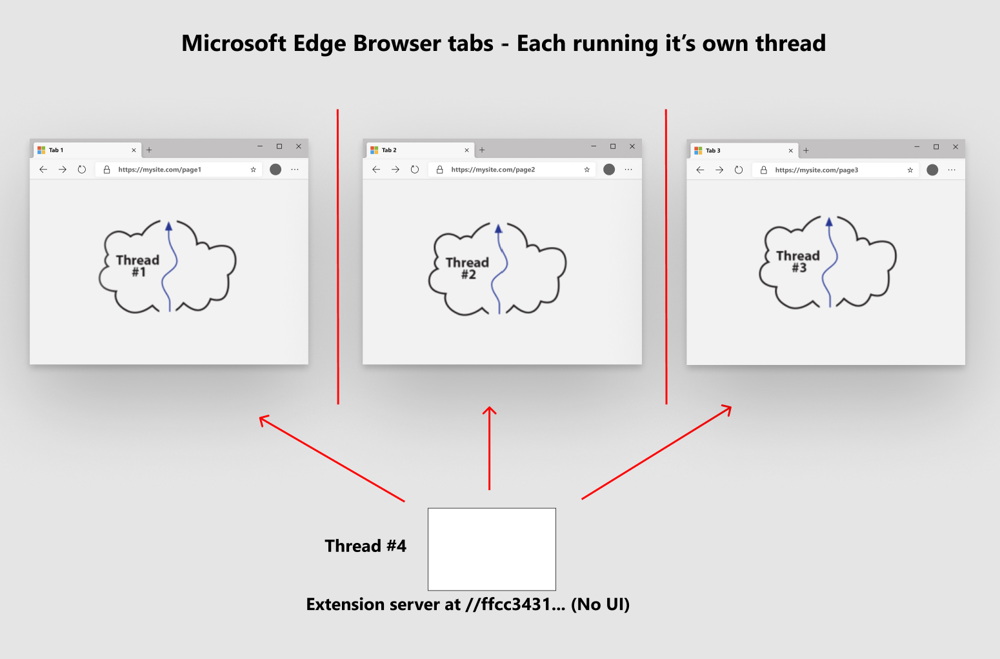

# Microsoft Edge \ (Chromium \) Extensions の概要  

最初の拡張機能の構築に直接ジャンプする場合は、「day Extension の NASA 写真の作成」のパート1に進みます。  

拡張機能の概念とアーキテクチャについて詳しく理解していない場合は、読み進めて、すべての拡張機能について学習してください。  この情報は、背後にある動機とアーキテクチャを理解してから、拡張機能の構築に役立ちます。  

## 日の内線番号の NASA 画像を作成する  

各セクションには、完了した拡張ソースインストールパッケージが含まれています。  

*   [その日の NASA の絵を飛び出すシンプルな拡張機能を構築する](part1-simple-extension.md)  
    *   マニフェストの作成  
    *   拡張機能のアイコンを割り当てる  
    *   ポップアップウィンドウの表示  
    *   ブラウザーで拡張機能をローカルで実行する (サイドローディング \)  

*   [ページ本文タグの下に、NASA 図を動的に挿入する](part2-content-scripts.md)  
    *   動的コンテンツスクリプトを挿入する JavaScript を作成する  
    *   コンテンツスクリプトを取得するページをマニフェストで定義する  
    *   コンテンツスクリプトを宣言して挿入する  
    *   ポップアップのボタンを追加してコンテンツスクリプトにメッセージを送信する  
    *   コンテンツスクリプト内でメッセージを受信する  

## 拡張子が導入される前のブラウザーについて  

### 各ブラウザータブは、他のすべてのタブから分離されます。  

Microsoft Edge \ (Chromium \) の拡張機能について理解するには、最初に、Microsoft Edge のような、複数のタブブラウザーを完全に理解している必要があります。  最初に、ブラウザーの各タブは、他のブラウザーのタブ \ (またはスレッド \) から効果的に分離される個々のスレッドで実行されます。  

![[ブラウザー] タブごとに1つのスレッド](media/index-image1-browsertabs.png)  

### 各タブは1つの GET 要求を処理します。  

各タブは、基本的に URL \ (uniform resource locator とも呼ばれます) を使って、通常は HTML ドキュメントである1つのデータストリームを取得します。  この1つのストリーム \ (またはページ \) には、(JavaScript にはタグ、画像参照、CSS 参照などのような) 命令が含まれていることがよくあります。  最終的には、必要なすべてのリソースが1つのタブページにダウンロードされ、通常は [ブラウザー] タブに表示される視覚エフェクトが完全に表示されます。  

### 各タブからのすべての通信がリモートサーバーになります。  

各タブが分離環境で実行されることを理解していると、これらのタブは互いに独立していますが、より多くのインターネットを利用できるわけではありません。  通常、これらのタブは、定義されたプログラミング言語として JavaScript を実行しているため、ブラウザータブの一番上の URL バーに入力された最初の GET 要求の元のサーバーとして考える必要があります。  

## 拡張モデルによって、すべての要素が逆になります。  

タブページと同様に、拡張機能は個々のスレッドで実行されます。これは、すべてのタブページスレッドから完全に分離されています。  通常、リモートサーバーに対して1つの GET 要求を発行して、そのデータの視覚エフェクトをブラウザーで表示すると、それ以外の場合は、ブラウザーのタブから確立されたインターネット接続の反対側にあるサーバーとなります。  

  

これは、理解することが非常に重要です。  拡張機能を作成してブラウザーにインストールすると、ブラウザー内に存在し、そのブラウザーで実行されているすべてのタブページから分離されているスタンドアロンの web サーバーが作成されます。  

### 拡張機能 web サーバーバンドル  

拡張機能とは Web リソースのバンドル \ (または zip ファイルとも呼ばれます) は、web 開発者が web サーバーに発行したものとは異なるものです。  

この zip ファイルには、HTML、CSS、JavaScript、画像、および web ページを作成するために必要なすべてのアセットが含まれています。  ただし、この zip ファイルのルートに必要な1つの追加ファイルと、そのファイルには名前が付いてい `manifest.json` ます。  これは拡張機能の青写真であり、拡張機能のバージョン、タイトル、実行する必要がある権限、その他の機能を含みます。  

  

### 拡張機能サーバーの起動  

Web サーバーに展開すると、その web サーバー (Apache、IIS、NGINX など) が web バンドルに含まれているかどうかに関係ありません。  ブラウザーがサーバー上の URL に移動すると、 `index.html` web サーバー上のファイルがダウンロードされます。  ブラウザーでは、証明書、構成ファイルなどを使用しています。  `index.html`ファイルは、web サーバー上の特定の場所に保存されます。   拡張機能について教えてください。  特に、使用しているブラウザーのタブページは、この zip ファイル (拡張子 \) にアクセスできますか?  これが、拡張ランタイムによって実行される操作です。  

拡張子は、名前の中の URL \ (uniform resource locator) からのすべてのファイルを提供し `extension://{some-long-unique-identifier}/index.html` ます。  角かっこで囲んだ名前は、インストールした `{some-long-unique-identifier}` 拡張機能に割り当てられている一意の識別子です。  つまり、10個の一意の拡張機能がブラウザーにインストールされている場合、各拡張機能には、ブラウザー内にインストールされている zip ファイル \ (または拡張バンドル \) を指す一意の識別子があります。  

<!--  -->  

<!--todo: add image for unique URLs  -->  

### 拡張機能は、タブとブラウザーのツールバーを使って管理および通信を行う  

拡張機能は、ブラウザーのツールバーに対応しており、すべての実行中のタブページを安全な方法で管理できるだけでなく、すべてのタブページの DOM を操作することもできます。  Chromium browser に組み込まれているメッセージ API は、拡張機能とタブページ間の通信を可能にして、これを適切に行うことができるようにするものです。  この API は、Extensions API とも呼ばれます。これには、通知管理、ストレージ管理など、多くの機能が用意されています。  

Web サーバーの場合と同様に、拡張機能は、ブラウザーが実行されているときに、常に (通知を待機している状態のまま) 実行することができます。  ブラウザーのオーケストレータとして拡張機能を考えることができます。  この場合も、拡張子はタブページから完全に分離されますが、Extensions API、および拡張機能に割り当てられているオプトインアクセス許可によって、ブラウザーで実行されているすべてのタブページを実質制御することができます。  

### 拡張機能は、インストール時のセキュリティモデルでオプトインを提供します。  

拡張子を指定すると、ファイル内の宣言によって、 `manifest.json` 拡張機能をインストールして、異なるレベルの権限を与えることができます。  この機関は、拡張機能がユーザーによってインストールされた場合に、拡張機能で任意の情報を抽出し、そのデータを拡張機能で処理できるようにします。  

<!-- image links -->  

<!-- links -->  
