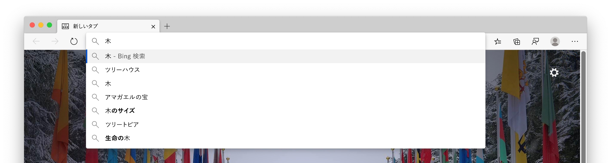
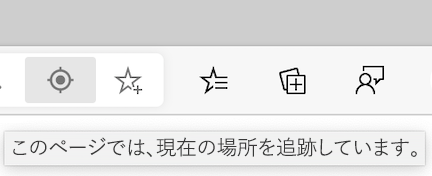
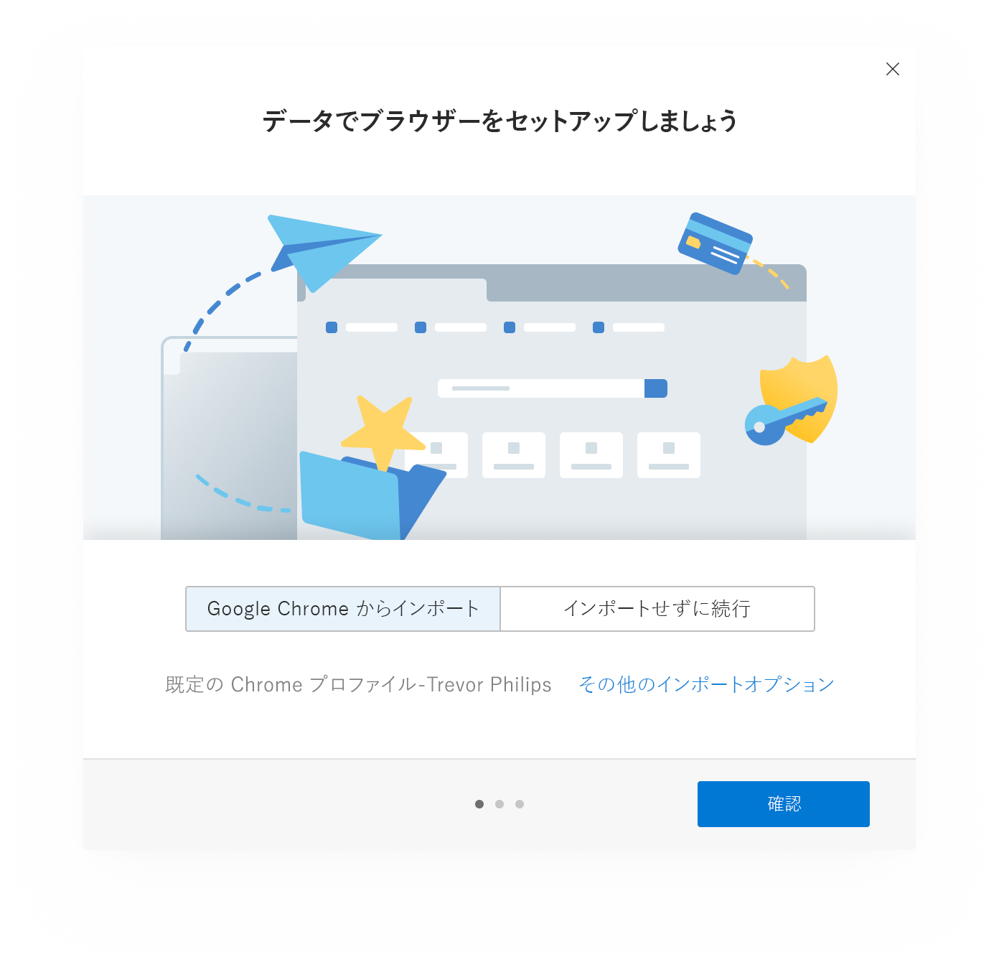
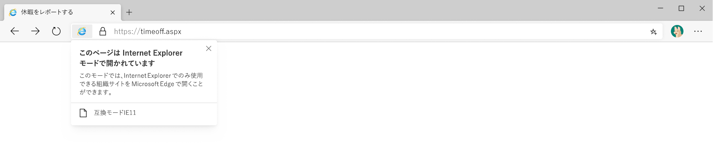
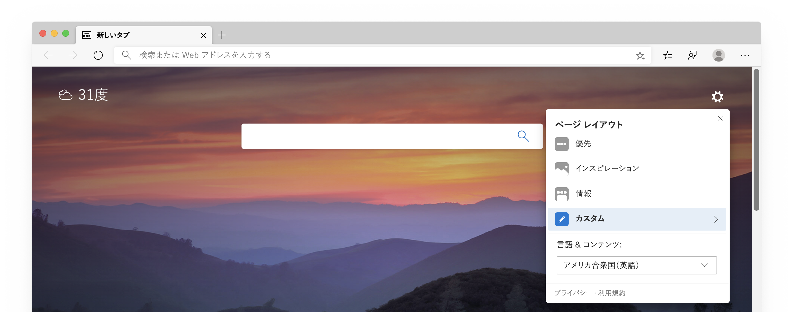
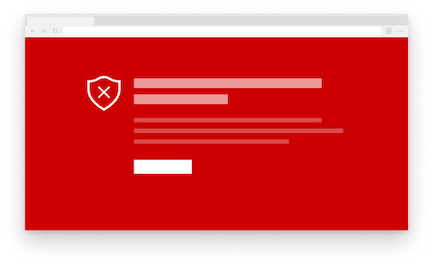
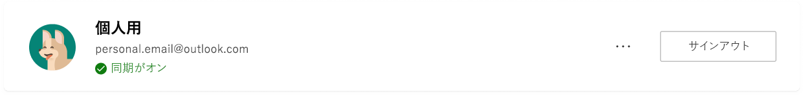
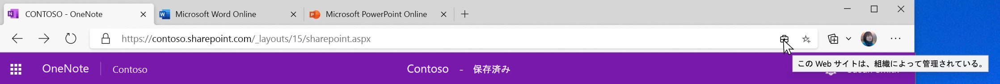

# Microsoft Edge プライバシー ホワイトペーパーMicrosoft Edge Privacy Whitepaper  

お客様にとって、お客様にとっては、お客様による保護、透明性、統制、敬意を得ることができます。Our browser privacy promise is to provide you with the protection, transparency, control and respect you deserve.  Microsoft Edge チームは、microsoft edge の機能とサービスのしくみ、およびそれぞれのプライバシーへの影響について、プライバシーに関するフィードバックを提供しています。To uphold commitments to give you transparency into Microsoft products, the Microsoft Edge team provided a privacy whitepaper that explains how Microsoft Edge features and services work and how each may affect your privacy.  Microsoft Edge チームの目標は、データの使用方法、さまざまな機能の制御方法、収集されたデータの管理方法を完全に理解しておくことを目的としています。そのため、適切なプライバシーの決定を行うために必要な情報を得ることができます。The goal of the Microsoft Edge team is to give you a full understanding into how your data is used, how to control the different features, and how to manage your collected data, so you have the info you need to make the right privacy decisions for you.  

Microsoft teams の一部のセクションでは、microsoft Edge の設定とその他のページに移動するための手順が提供されています。In certain sections of the paper, the Microsoft Team provide steps to go to Microsoft Edge settings and other pages.  一貫性を維持するために、Microsoft edge チームでは、次の `edge://` ような、 `edge://favorites` またはなどの方法で始まる url を表示する必要があり `edge://settings/privacy` ます。For consistency, the Microsoft edge team used a shortened format throughout the whitepaper: You should see URLs that begin with `edge://` such as `edge://favorites` or `edge://settings/privacy`.  ページに移動するには、太字のテキストを Microsoft Edge のアドレスバーに直接入力します。To go to the pages, type the bolded text directly into the Microsoft Edge address bar.  これらのページは、Microsoft Edge でのみ表示できます。These pages are only be viewable in Microsoft Edge.  

このホワイトペーパーでは、デスクトップ版の Microsoft Edge に重点を置いています。また、このホワイトペーパーには、すべてのユーザーが使用できない機能やエクスペリエンスが含まれている場合があります。The whitepaper focuses on the desktop version of Microsoft Edge, and parts of the paper may include features or experiences that are not available for all users.  また、このホワイトペーパーでは、現在製品に含まれている機能やサービスについて説明していますが、今後の変更の対象となる可能性があります。In addition, the whitepaper discusses features and services that exist in the product today, but may be subject to change in the future.  Microsoft プラクティスのデータ収集の最小化: データは最小限の時間で保持されますが、保持時間は使用されている機能やサービスによって異なる場合があるため、時間の経過と共に変化する可能性があります。Microsoft practices data collection minimization, which means your data is kept for the minimum amount of time, but retention times may vary depending on the feature or service being used and may change over time.  

## アドレスバーと提案Address bar and suggestions  

アドレスバーを使用すると、web サイトの Url を入力して web を検索することができます。The address bar allows you to enter website URLs and search the web.  既定では、入力した文字を使った検索とサイトの候補がアドレスバーに表示されます。By default, the address bar provides search and site suggestions using the characters you type.  お気に入り、閲覧履歴、以前の検索プロバイダー、および既定の検索プロバイダーの候補が表示されます。You should see suggestions from your favorites, browsing history, previous searches, and default search provider.  

  

アドレスバーに入力すると、入力した文字が既定の検索プロバイダーに送信され、候補の検索クエリが返送されるようになります。To make browsing and searching faster, as you type in the address bar, the typed characters are sent to your default search provider for the search provider to send back suggested search queries.  アドレスバーには、URL、検索、または不明な項目としてエントリが分類されます。The address bar categorizes your entry as a URL, search, or unknown.  選択した候補、選択の位置、その他のアドレスバーデータなどの情報が、既定の検索プロバイダーに送信されます。The information, along with which suggestion you select, position of selection, and other address bar data is sent to your default search provider.  検索プロバイダーが Bing の場合は、ブラウザーに固有の resettable 識別子がデータと共に送信され、検索クエリとクエリセッションを理解することができます。If your search provider is Bing, a resettable identifier unique to your browser is sent with the data to understand the search query and query session.  その他の候補サービス識別子は、検索候補を完了するために既定の検索エンジンに送信されます。Other autosuggest service identifiers are sent to your default search engine to complete the search suggestions.  検索結果の関連性を高めるために、IP アドレスと cookie が既定の検索プロバイダーに送信されます。Your IP address and cookies are sent to your default search provider to increase the relevance of the search results.  アドレスバーを選択すると、既定の検索プロバイダーに送信され、候補を表示するための準備ができます。A signal is sent to your default search provider when you select the address bar, to signal to the provider to get ready to provide suggestions.  入力した文字と検索クエリは、検索プロバイダーが Bing の場合を除き、Microsoft に送信されません。The typed characters and search queries are not sent to Microsoft unless your search provider is Bing.  このデータは、[入力した**文字] 設定を使用して [検索とサイトの候補を表示する]** 設定がオンになっている場合にのみ、既定の検索プロバイダーに送信されます。This data is only sent to your default search provider if you have the **Show me search and site suggestions using my typed characters** setting turned on.  この機能を無効にすると、入力した文字が既定の検索プロバイダーに送信されなくなります。Turning off the feature stops your typed characters from being sent to the default search provider.  検索クエリは、検索結果を提供するために、引き続き既定の検索プロバイダーに送信されます。Your search queries are still sent to your default search provider to provide search results.  Microsoft Edge で、アドレスバーに入力した情報に認証資格情報、ローカルファイル名、通常は暗号化されている URL データなどの機密情報が含まれている場合は、入力したテキストは送信されません。If Microsoft Edge detects that your typing in the address bar may contain sensitive information, such as authentication credentials, local file names, or URL data that is normally encrypted, it does not send the typed text.  **クラッシュレポートとブラウザーの設定の使い方に関するデータを送信して microsoft 製品を改善**した場合、microsoft Edge は、検索プロバイダーに関係なく、アドレスバーに関する診断データ (提供されたクエリの数など) を収集します。If you have **Improve Microsoft products by sending crash reports and data about how you use the browser** setting turned on, Microsoft Edge collects diagnostic data about the address bar, such as how many queries were offered, regardless of your search provider.  

キーボード操作とアクセスした web サイトは、プロファイルごとにデバイス上にローカルに保存されます。Keystrokes and the websites you visit are stored locally on the device per profile.  データを削除したり `edge://settings/clearBrowserData` 、**閲覧履歴**のチェックボックスをオンにしたり、[**今すぐクリア**] を選択したりすることができます。You may delete the data in `edge://settings/clearBrowserData`, selecting the check box for **Browsing history**, and selecting **Clear now**.  Bing が既定の検索プロバイダーであり、Bing にサインインしている場合は、 [Microsoft のプライバシーダッシュボード](https://account.microsoft.com/account/privacy?ref=privacy-edge-browse&ru=https%3A%2F%2Faccount.microsoft.com%2Fprivacy%2Fbrowse%3Fref%3Dprivacy-edge-browse&destrt=privacy-dashboard)で検索を削除することができます。If Bing is your default search provider and you are signed into Bing, you may delete your searches through the [Microsoft privacy dashboard](https://account.microsoft.com/account/privacy?ref=privacy-edge-browse&ru=https%3A%2F%2Faccount.microsoft.com%2Fprivacy%2Fbrowse%3Fref%3Dprivacy-edge-browse&destrt=privacy-dashboard).  `edge://history`アドレスバーに候補として表示されないようにするには、閲覧履歴をオフにします。You may clear your browsing history in `edge://history` to delete those websites from appearing as suggestions in the address bar.  Windows 10 では、Microsoft がアドレスバーから収集したデータをクリアし、 **Start**  >  [**設定**の  >  **プライバシー**に  >  **関する &** 声明] の [フィードバックの送信] で [削除] を選択して、[**診断データの削除**] の [**削除**] を選びます。On Windows 10, you may clear the data Microsoft collects from the address bar and search suggestions features by going to **Start** > **Settings** > **Privacy** > **Diagnostics \& feedback**, and selecting **Delete** under **Delete diagnostic data**.  その他のすべてのデータは、36か月後に削除されます。All other data is deleted after 36 months.  

Microsoft Edge に Microsoft の職場または学校のアカウントを使ってサインインしている場合、Microsoft Search が利用可能であれば、会社に固有の結果などのアカウント固有の機能を提供するために、お客様のアカウントを表す匿名トークンがクエリと共に送信されます。If you are signed into Microsoft Edge with a Microsoft work or school account, and Microsoft Search is available, an anonymized token representing your account is sent with the query to provide account-specific functionality such as results specific to your company.  

すべてのデータは HTTPS 経由で安全に送信されます。All data is transmitted securely over HTTPS.  [Bing](https://bing.com)が既定の検索プロバイダーである場合、検索と種類の文字が最大6か月間保存されます。If [Bing](https://bing.com) is your default search provider, the searches and types characters are saved for up to 6 months.  

[アドレス] ボックスで1つの単語を検索する場合、Microsoft Edge はその単語を DNS サーバーに送信して、ネットワーク上のホストに対応しているかどうかを確認し、対応するホストに接続しようとすることがあります。If you search for a single word in the address box, Microsoft Edge may send the single word to your DNS server to see whether it corresponds to a host on your network, and may try to connect to the corresponding host.  これにより、検索の代わりにそのホストに移動するオプションが表示されます。This gives you the option to navigate to that host instead of searching.  たとえば、使用しているルーターがホスト名になって `router` いて、アドレスバーに入力した場合、 `router` に移動するオプションが表示されます。また、その `https://router/` 単語を既定の検索プロバイダーで検索することもでき `router` ます。For example, if your router goes by the hostname `router` and you type `router` in the address bar, you are given the option to navigate to `https://router/`, as well as to search for the word `router` with your default search provider.  この機能は、既定の検索エンジンにデータを送信する必要がないため、入力された**文字設定を使用して、[検索とサイトの表示]** 設定によって制御されません。This feature is not controlled by the **Show me search and site suggestions using my typed characters** setting since it does not involve sending data to your default search engine.  

**[入力した文字] 設定を使用して、[検索とサイトの候補を表示する]** 設定をオフにして、の既定の検索エンジンを変更することができ `edge://settings/search` ます。You may turn off the **Show me search and site suggestions using my typed characters** setting and change your default search engine in `edge://settings/search`.  InPrivate ブラウズまたはゲストモードでは、自動修正候補はオフになっています。While browsing InPrivate or in Guest mode, autosuggestions are turned off.  InPrivate ブラウズでは、閲覧履歴や過去の検索など、ローカル閲覧の候補が表示されますが、既定の検索エンジンには入力した文字は送信されません。InPrivate shows suggestions from your local browsing such as browsing history or past searches, but no typed characters are sent to your default search engine.  ゲストモードでは、候補は表示されません。または、入力した文字が既定の検索エンジンに送信されます。Guest mode does not display any suggestions or send typed characters to your default search engine.  

他の検索プロバイダーによって収集されたデータは、会社のプライバシーポリシーに従っています。Data collected by other search providers follow the privacy policy of the company.  

## 自動Autofill  

Microsoft Edge でオートフィルを使うと、パスワード、支払い情報、住所などのフォーム入力データを保存して、生産性を高めることができます。Autofill in Microsoft Edge helps you be more productive by letting you save passwords, payment info, addresses, and other form entry data.  サイトにアクセスしてフォームの入力を開始すると、Microsoft Edge では、保存したオートフィルデータをフォームに照合するために、フォームの塗りつぶし情報が使用されます。When you visit a site and start to fill out a form, Microsoft Edge uses form fill info to match your saved autofill data to the form.  Microsoft Edge には、同じようなフォームを作成したときに、以前に保存したフォーム入力データが用意されています。Microsoft Edge offers form entry data you previously saved when you encounter similar forms.  パスワードとクレジットカード情報は、各パスワードとカードに対して明示的に許可した場合にのみ保存されます。Passwords and credit card info are only saved with your explicit permission for each password and card.  

住所およびその他のフォームのエントリは、既定で保存されます。Addresses and other form entries are saved by default.  ただし、の住所およびその他のフォームデータの保存およびオートフィルをオフにすることができ `edge://settings/addresses` ます。However, you may turn off saving and autofill of address and other form data in `edge://settings/addresses`.  

[**パスワードを保存する**] 設定を無効にして、パスワードの保存を促すメッセージが表示されないように `edge://settings/passwords` します。Prevent Microsoft Edge from prompting you to save passwords by turning off the **Offer to save passwords** setting in `edge://settings/passwords`.  Microsoft Edge が保存されている既存のパスワードにオートフィルしたくない場合は、保存されているパスワードを削除して `edge://settings/passwords` 、Microsoft edge のプライバシーとサービスの設定で [**閲覧データの消去**] 設定に移動することができます。If you do not want Microsoft Edge to autofill existing saved passwords, you may delete your saved passwords in `edge://settings/passwords`  To delete all autofill data go to the **Clear browsing data** setting in Microsoft Edge Privacy and services settings.  [**オートフィルフォームデータ**] を選択し、目的の時間範囲を選び、[今すぐ] を**オフ**にします。Select **Autofill form data**, the desired time range and then **Clear now**.  

プロファイルの [同期] をオンにしている場合は、同じ資格情報にサインインしているすべてのバージョンの Microsoft Edge で、オートフィルデータが同期されます。If you have turned on sync for your profile, your autofill data is synced across all versions of Microsoft Edge where you are signed into the same credentials.  同期をオンにすると、すべてのオートフィルデータが暗号化された Microsoft サーバーに保存されます。When sync is turned on, all autofill data is stored on encrypted Microsoft servers.  Microsoft サーバーに保存されているオートフィルデータは、同期目的でのみ使用されます。The autofill data stored on Microsoft servers is only used for sync purposes.  オートフィルデータの同期をオフにすることができ `edge://settings/profiles/sync` ます。You may turn off syncing of your autofill data in `edge://settings/profiles/sync`.  オートフィルの同期をオンにしている場合は、Microsoft Edge にサインインしているデバイスからオートフィルデータを削除すると、サインインしている他のデバイスからオートフィルデータが削除されます。If you turned on sync for autofill, deleting autofill data from a device where you are signed into Microsoft Edge removes the autofill data from other devices where you are signed-in.  

Web ページにアクセスしてフォームを送信すると、Microsoft Edge では、ホスト名とオートフィルエントリの種類のハッシュなどのフォームに関する情報が送信されます (たとえば、box 1 はメールアドレスを探し、box 2 はパスワードを探しているため、) Microsoft form fill サービスに送信します。When you visit a webpage and submit a form, Microsoft Edge sends info about the form such as a hash of the hostname and autofill entry types \(for example, box 1 is looking for an email address, box 2 is looking for a password, and so on\) to the Microsoft form fill service.  ユーザーが入力した情報やユーザー識別子は、サービスに送信されません。No user-entered info or user identifiers are sent to the service.  この情報は、Microsoft Edge がさまざまな web ページでフォームを正しく識別するのに役立ちます。This info helps Microsoft Edge correctly identify forms across different webpages.  このデータは、保存したオートフィルデータをフォームに照合するために使用されます。This data is used to help match your saved autofill data to the form.  

ゲストモードを使用している場合、オートフィルは利用できません。新しいオートフィルエントリは追加されません。When you use guest mode, autofill is not available and new autofill entries are not added.  InPrivate ブラウズでは、Microsoft Edge でオートフィルエントリが提供されますが、新しいオートフィルエントリは追加されません。When you browse InPrivate, Microsoft Edge offers autofill entries, but new autofill entries are not added.  

## キャストCast  

Microsoft Edge の Cast では、Google Cast を使ってメディアを別の画面に表示することができます。Cast in Microsoft Edge allows you to display your media to another screen using Google Cast.  この機能は、 **[設定] やその他のオプション (...)**  >  からアクセスできます。**その他のツール**  > **メディアをデバイスにキャスト**します。You may access the feature from **Settings and more (...)** > **More tools** > **Cast media to device**.  Cast では、Microsoft または Google サービスは使用されません。Cast does not use any Microsoft or Google services. 

## コレクションCollections  

Web 上のサイト、テキスト、画像を収集し、Microsoft Edge でコレクションを使ってコンテンツを整理できます。You may collect sites, text and images on the web, and organize the content with Collections in Microsoft Edge.  すべてのコレクションデータは、デバイス上にローカルに保存され、Microsoft Edge プロファイルごとに整理されます。All collections data is stored locally on the device and organized per Microsoft Edge profile.  コレクションに対して同期を有効にしている場合、すべてのメモやコメントを含めて作成されたコレクションは、サインインした Microsoft Edge のすべてのバージョンで利用できます。If you have sync turned on for Collections, your collections created, including any notes or comments, are available across all signed-in and syncing versions of Microsoft Edge.  

24時間ごとに、特別なエンティティ抽出テンプレートが存在する、サポートされているサイトのリストがダウンロードされます。Every 24 hours Microsoft Edge downloads a list of supported sites for which special entity extraction templates exists.  テンプレートは各 web サイトに固有のものです。The templates are specific to each website.  コレクションに新しい項目を作成すると、Microsoft Edge は、新しいコレクション項目を作成しているサイトが、サポートされているサイトの一覧にあることを確認します。When you create a new item in your collection, Microsoft Edge verifies that the site from which you are creating the new collection item is on the list of supported sites.  サイトが一覧に表示されている場合、Microsoft Edge は特定のサイトテンプレートのエンティティ抽出サービスを ping します。If the site is on the list, Microsoft Edge pings the entity extraction service for the specific sites template.  サービスへの要求に関連付けられているユーザー識別子はありません。No user identifiers are associated with the request to the service.  このテンプレートは、収集されるアイテムに関する名前、価格、評価、プライマリ画像、およびその他のデータを識別しようとします。This template attempts to identify the name, price, ratings, primary image, and other data about the item being collected.  新しいコレクションアイテムを作成しようとしているサイトが、サポートされているリストサイトにない場合、Microsoft Edge ではテンプレートはダウンロードされません。If the site from which you are creating a new collection item is not on the supported list site, Microsoft Edge does not download a template.  テンプレートによって、デバイス上のすべてのコレクション項目をローカルに作成できます。The templates enable the creation of all collection items locally on the device.  コレクションアイテムに関するデータは、コレクションを作成するためにサービスに送信されません。No data about the collection items are sent to the service to create the collection.  

デバイスに保存されているテンプレートは、の [ **Clear data** ] 設定でキャッシュデータをクリアすることによって削除されることがあり `edge://settings/privacy` ます。The templates stored on the device may be deleted by clearing the cache data under the **Clear browsing data** setting in `edge://settings/privacy`.

[**コレクション] で [おすすめ候補の表示]** をオンにすると、コレクションのタイトルを使用して Microsoft Bing 検索が実行され、関連する Pinterest のトピックページが検索されます。If you turn on **Show suggestions from Pinterest in Collections**, Collections perform a Microsoft Bing search using the title of your collection to find relevant Pinterest Topic pages.  Microsoft Edge では、コレクションに関するデータは Pinterest に送信されません。Microsoft Edge does not send data about your collections to Pinterest.  [ `edge://settings/privacy` **コレクションでのおすすめ候補を表示する]** に移動して、関心のあるトピックページの検索を終了することができます。You may remove the suggestions and stop searches for Pinterest Topic pages by going to `edge://settings/privacy` and turning off **Show suggestions from Pinterest in Collections**.  

InPrivate ブラウズまたはゲストモードを使用している場合、コレクションは使用できません。Collections is not available when using InPrivate browsing or Guest mode.  

## がクラッシュするCrashes  

クラッシュレポートを含むオプションの診断データが有効になっている場合は、Microsoft Edge がクラッシュしたときや他の信頼性の問題が発生したときに、診断データが収集されます。If optional diagnostic data including crash reports are turned on, Microsoft collects diagnostic data when Microsoft Edge crashes or encounters other reliability problems.  この診断データは、Microsoft Edge および他の Microsoft 製品およびサービスの信頼性の問題を診断し、解決するために使用されます。This diagnostic data is used to diagnose and fix reliability problems of Microsoft Edge and other Microsoft products and services.  

  

収集された診断データは、Microsoft Edge で信頼性の問題が発生したときにキャプチャされたデバイスとソフトウェアの状態を含むクラッシュダンプの形式になっています。The diagnostic data collected is in the form of crash dumps, which contains device and software state captured at the time Microsoft Edge encountered the reliability problem.  クラッシュダンプには、信頼性の問題が発生した時点で行われた事象に関する情報が含まれています。The crash dump contains information about what was happening at the time of the reliability problem.  クラッシュの発生時にアクセスした web サイトや CPU 使用率などの情報が診断データに含まれている可能性があります。Information such as the website you were visiting at the time of the crash or your CPU usage may be included in the diagnostic data.  クラッシュ診断データはデバイス上にローカルに保存され、クラッシュレポートが有効になっているときに、暗号化されたリンクを使用して Microsoft に送信されます。The crash diagnostic data is stored locally on the device and sent to Microsoft using an encrypted link when crash reporting is turned on.  クラッシュダンプごとに、お使いのデバイスに固有の識別子、ブラウザーに固有の resettable 識別子、およびその問題を特定するための追加診断データ (URL、CPU 使用率、ネットワーク使用率など) が含まれています。Each crash dump contains an identifier unique to your device, a resettable identifier unique to your browser and extra diagnostic data \(such as the URL, CPU usage, and network usage\) to help identify the problem.  この追加診断データは、問題が発生しているデバイスの数や重要度など、信頼性の問題を診断するために、クラッシュダンプにアタッチされます。This extra diagnostic data is attached to the crash dump to help diagnose the reliability problem, such as understanding how many devices are encountering the problem and the severity.  

クラッシュダンプは、Microsoft に送信され、最長で30日間、セキュリティで保護された Microsoft サーバーに保存されてから、削除されます。Crash dumps are sent to Microsoft and stored on secure Microsoft servers for up to 30 days and then deleted.  Windows 10 デバイスで診断データを削除するように依頼する**Start**には  >  **Settings**  >  **Privacy**  >  、[設定の開始] プライバシー **& 診断**に移動し、[**診断データの削除**] の [**削除**] を選択します。Request to delete the diagnostic data on Windows 10 devices by going to **Start** > **Settings** > **Privacy** > **Diagnostics \& feedback** and selecting **Delete** under the **Delete diagnostic data** setting.  発生するクラッシュの種類の数などの集計されたクラッシュ情報は、レポートや製品の改善のために保存されます。Aggregated crash information such as a count of types of crashes occurring are stored for reporting and product improvement purposes.  

デバイス上にローカルに保存されているクラッシュ診断データは、のファイルシステムからクリアされることがあり `edge://crashes` ます。Crash diagnostic data stored locally on the device may be cleared from the file system in `edge://crashes`.  

Windows 10 のクラッシュ診断データ収集をオフにするには、「Windows & 診断ツールでの**診断 \ &** のフィードバック設定」を参照してください。To turn off crash diagnostic data collection on Windows 10, go to **Diagnostics \& feedback** in Windows Diagnostics \& feedback settings.  他のすべてのプラットフォームの Microsoft Edge のバージョンについては、「 `edge://settings/privacy` **クラッシュレポートを送信して microsoft 製品を改善**する」と「ブラウザーの設定の使い方についてのデータ」を参照してください。For versions of Microsoft Edge on all other platforms go to `edge://settings/privacy` and turn off the **Improve Microsoft products by sending crash reports and data about how you use the browser** setting.  この診断データ収集は[、組織で管理](/deployedge/microsoft-edge-enterprise-privacy-settings)されているグループポリシーによって企業によって無効にされることもあります。This diagnostic data collection may also be turned off for enterprises through [group policies managed by your organization](/deployedge/microsoft-edge-enterprise-privacy-settings).  

## ブラウザーの使い方に関する診断データDiagnostic data about how you use the browser  

Microsoft は診断データを使用して、microsoft 製品とサービスを改善し、Microsoft 製品のセキュリティを確保して最新の状態に保つことができます。また、Microsoft 製品のパフォーマンスの詳細については、こちらを参照してください。Microsoft uses diagnostic data to improve Microsoft products and services, keep Microsoft products secure and up to date, and help to better understand how Microsoft products are performing.Microsoft Edge チームがデータを収集するたびに、決定は適切な選択肢として確認されます。 Whenever the Microsoft Edge team collect data, the decision is verified as the right choice for you.  Microsoft は、の情報収集の最小化について考えています。Microsoft believes in and practices information collection minimization.  Microsoft Edge チームは、必要な情報のみを収集し、Microsoft の製品とサービスを改善するために必要な限りそのために保存されます。The Microsoft Edge team strives to gather only the info that is needed and is stored only for as long as it is needed to improve Microsoft products and services.  

Microsoft Edge および Microsoft edge web platform を使用する他のアプリケーションで機能とサービスを使用する場合、これらの機能の使用方法に関する診断データは Microsoft に送信されます。As you use features and services in Microsoft Edge and other applications that use the Microsoft Edge web platform, diagnostic data about how you use those features is sent to Microsoft.  この診断データには、Microsoft Edge のインストール、機能の使用状況、パフォーマンス、メモリ使用量などの情報が含まれます。This diagnostic data includes information like your installation of Microsoft Edge, feature usage, performance, and memory usage.  たとえば、web サイトをお気に入りに追加した場合、Microsoft Edge チームは、[お気に入り] ボタンがクリックされ、お気に入りが正常に追加されたが、どのサイトもお気に入りとして設定されていないことを示す情報を受け取ります。For example, if you favorite a website, the Microsoft Edge team receives info that the favorite button was clicked and a favorite was successfully added, but not which site was set as a favorite.  この診断データには、新しいタブを開くのにかかったミリ秒数などのパフォーマンス情報も含まれます。 このホワイトペーパーで言及されている機能とサービスにより、診断データが収集されます。This diagnostic data also includes performance information, such as how many milliseconds it took to open a new tab.  The features and services mentioned in the whitepaper collect diagnostic data.  

  

さらに、Microsoft Edge は、製品を最新の状態に保ち、安全で適切に実行するために必要な一連の必要な診断データを収集します。In addition, Microsoft Edge collects a set of required diagnostic data necessary to keep the product up to date, secure and performing properly.  これには、デバイスの接続と、現在のデータコレクションの同意設定、アプリのバージョン、インストールの状態に関する構成情報が含まれます。This includes device connectivity and configuration information about the current data collection consent setting, app version, and installation state.  この設定は、組織で管理されているグループポリシーでのみオフにすることができます。You may only turn the setting off with group policies managed by your organization.  [詳細については、「組織の診断データ」を参照して](/windows/privacy/configure-windows-diagnostic-data-in-your-organization)ください。[Learn more about diagnostic data in your organization](/windows/privacy/configure-windows-diagnostic-data-in-your-organization).  

Microsoft Edge で診断データが生成され、ローカルに保存され、定期的に Microsoft に送信されます。Microsoft Edge generates the diagnostic data, stores it locally, and periodically sends it to Microsoft.  診断データは HTTPS を使って送信され、Microsoft サーバーに保存されます。The diagnostic data is sent using HTTPS and stored on Microsoft servers.  この診断データは、お使いのデバイスに固有の識別子と、お使いのブラウザーに固有の resettable 識別子に関連付けられています。This diagnostic data is associated with an identifier unique to your device and a resettable identifier unique to your browser.  この識別子には、個人情報が含まれていません。The identifiers do not contain your personal information.  Windows 10 デバイスで、使用しているブラウザーに固有の識別子を**Start**リセットするには、[  >  **設定**の  >  **プライバシー**に  >  **関する声明 \ & フィードバック**] に移動し、[ **Diagnostic data**診断データの**Full** **削除**] **Basic**設定で [**削除**] を選びます。To reset the identifier unique to your browser on Windows 10 devices, go to **Start** > **Settings** > **Privacy** > **Diagnostics \& feedback** and select **Delete** under the **Delete diagnostic data** setting or change your setting under **Diagnostic data** from **Full** to **Basic**.  その他のプラットフォームでは、ブラウザーに固有の resettable 識別子が、ブラウザーの [オン] から [オフ] に設定されている**方法に関するデータを送信して、Microsoft 製品の改善**を変更した場合に、再度生成され `edge://settings/privacy` ます。 **on** **off**On other platforms, the resettable identifier unique to your browser is generated again whenever you change the **Improve Microsoft products by sending data about how you use the browser** setting in `edge://settings/privacy` from **on** to **off**.  この再設定機能は、組織で設定したグループポリシーで管理されているデバイスによって異なる場合があります。This reset functionality may be different for devices managed with group policies set by your organization.  

Windows 10 バージョン 1803 \ (2018 年4月更新プログラム \) 以降を使用している場合、診断データビューアーで Microsoft と共有されている製品データを**表示するに**は、  >  **Settings**  >  **Privacy**  >  [**&** 設定の表示] をクリックし、[診断データの**表示**] の下にある [診断データ**ビューアーを開く**] を選択します。If you are using Windows 10 version 1803 \(April 2018 Update\) or above, you may view product data shared with Microsoft in the Diagnostic Data Viewer by going to **Start** > **Settings** > **Privacy** > **Diagnostics \& feedback** and selecting **Open Diagnostic Data Viewer** under the **View diagnostic data** setting.  

Windows 10 のバージョン1803よりも古いその他のプラットフォームまたはバージョンの場合は、「 `edge://data-viewer` 診断データを表示する」を参照してください。For other platforms or versions of Windows 10 lower than version 1803, go to `edge://data-viewer` to view the diagnostic data.  データは定期的に Microsoft に送信され、 `edge://data-viewer` 最後に viewer が開かれたとき以降、microsoft に送信されたデータのみが表示されます。Data is sent to Microsoft periodically, and `edge://data-viewer` only shows data that has been sent to Microsoft since the last time the viewer was opened.  指定したセッションで Microsoft に送信されたデータを確認するには、viewer の更新が必要になることがあります。You may need to refresh the viewer to see what data has been sent to Microsoft for your given session.  入力に使用されるデータ `edge://data-viewer` は、デバイス上にローカルに保存されます。The data used to populate `edge://data-viewer` is stored locally on the device.  ビューアーのデータをクリアするには、タブを閉じ `edge://data-viewer` ます。To clear the data in the viewer, simply close the `edge://data-viewer` tab.  

診断データは、最大18か月間は Microsoft サーバーに保存されます。The diagnostic data is stored on Microsoft servers for up to 18 months.  Windows 10 の場合、診断データを削除するには、「& 設定を**開始**する」にアクセスし、  >  **Settings**  >  **Privacy**  >  **Diagnostics \& feedback** 「**診断データの削除**」の「**削除**」を選択します。On Windows 10 you may delete the diagnostic data by going to **Start** > **Settings** > **Privacy** > **Diagnostics \& feedback** and selecting **Delete** under the **Delete diagnostic data** setting.  診断データの削除機能は、Windows 10 (2018 年4月の更新プログラム以降) でのみサポートされます。The Delete diagnostic data functionality is only supported on Windows 10, April 2018 update and newer.  詳細については[、「Windows 10 の診断、フィードバック、およびプライバシー](https://support.microsoft.com/help/4468236/diagnostics-feedback-and-privacy-in-windows-10-microsoft-privacy)」を参照してください。For more information see [Diagnostics, feedback, and privacy in Windows 10](https://support.microsoft.com/help/4468236/diagnostics-feedback-and-privacy-in-windows-10-microsoft-privacy).  

Windows 10 の Microsoft Edge では、設定は Windows 診断データ設定によって決まります。For Microsoft Edge on Windows 10, the setting is determined by your Windows diagnostic data setting.  これは、Microsoft Edge のプライバシーとサービスの設定に反映されます。This is reflected in your Microsoft Edge Privacy and services settings.  Windows の**設定を変更**するには、[  >  **設定**の  >  **プライバシー**に  >  **関する診断診断] \ & フィードバック**] に移動します。Change the Windows settings by going to **Start** > **Settings** > **Privacy** > **Diagnostics \& feedback**.  他のすべてのチャネルとプラットフォームでは、診断データの収集を制御 `edge://settings/privacy` し、**クラッシュレポートとブラウザーの設定の使い方についてのデータを送信して、Microsoft 製品の品質向上**を有効または無効にすることができます。On all other channels and platforms, you may control the diagnostic data collection in `edge://settings/privacy` and turning on or off the **Improve Microsoft products by sending crash reports and data about how you use the browser** setting.  この設定は、デバイス上の Microsoft Edge のインストールに関連付けられたすべてのプロファイルで同じです。This setting is the same for all profiles associated with the installation of Microsoft Edge on your device.  この設定はデバイス間で同期されません。This setting is not synced across devices.  この設定は、InPrivate ブラウズとゲスト モードに適用されます。The setting applies to InPrivate browsing and Guest mode.  組織で設定されたグループポリシーでデバイスを管理している場合は、に反映され `edge://settings/privacy` ます。If your device is managed with group policies set by your organization, it is reflected in `edge://settings/privacy`.  

## デジタル著作権管理およびメディアライセンスDigital Rights Management and Media Licenses  

Web サイトがデジタル著作権管理 (DRM \) で保護されたメディアコンテンツを提供している場合、Microsoft Edge はセキュリティで保護された再生パイプラインを使用して、コンテンツが不適切にコピーまたはアクセスされないようにします。When a website offers media content that is protected by Digital Rights Management \(DRM\), Microsoft Edge uses a secure playback pipeline to ensure the content is not copied or accessed improperly.  この機能の一部として、Microsoft Edge では、一意の識別子やメディアライセンスなどの DRM 関連データをデバイスに保存することができます。また、コンテンツプロバイダーによって指定されたメディアライセンスサーバーに一意の識別子を送信することがあります。As part of the feature, Microsoft Edge may store DRM-related data on your device, including a unique identifier and media licenses, and may transmit that unique identifier to a media licensing server specified by the content provider.  Web サイトを使用すると、Microsoft Edge は DRM 情報を取得し、そのコンテンツを使用するためのアクセス許可があることを確認します。When you use the website, Microsoft Edge retrieves the DRM info to make sure you have permission to use the content.  このデータは、保護されたコンテンツへのアクセスを検証し、シームレスなメディアエクスペリエンスを実現するために役立ちます。This data helps to validate access to the protected content and ensure a seamless media experience.  

Microsoft Edge は、HTML5 サイトの暗号化されたメディア拡張 API \ (EME API \) を使用した DRM をサポートしています。Microsoft Edge supports DRM using the Encrypted Media Extensions API \(EME API\) for HTML5 sites.  EME API を使うと、web サイトはコンテンツ暗号化解除モジュール \ (CDM \) と呼ばれる DRM プロバイダーと通信できます。The EME API allows websites to communicate with a DRM provider called a Content Decryption Module \(CDM\).  Microsoft による Widevine などのさまざまな DRM システムは、開発者の CDM 実装でサポートされている可能性があります。Different DRM systems, such as Widevine by Google or PlayReady by Microsoft, may be supported by the CDM implementation of the developer.  コンテンツプロバイダーは、1つまたは複数の潜在的な DRM システムをサポートし、EME API の機能を利用して、特定のクライアントに使用する DRM システムを決定することができます。Content providers may choose to support one or more potential DRM systems and may utilize the functionality of the EME API to decide which DRM system to use for a specific client.  [EME のプライバシーについて](https://w3.org/TR/encrypted-media/#privacy)は、こちらを参照してください。[Learn more about EME privacy](https://w3.org/TR/encrypted-media/#privacy).  

Microsoft Edge は、Windows 10 でのみ PlayReady DRM をサポートしています。Microsoft Edge supports PlayReady DRM only on Windows 10.  PlayReady は、4K ビデオや Dolby Atmos audio などのメディアエクスペリエンスを実現するための DRM 実装です。PlayReady is an DRM implementation to deliver media experiences such as 4K video and Dolby Atmos audio.  Microsoft Edge では、Windows プラットフォームメディアファンデーション Api を使って PlayReady をサポートしています。Microsoft Edge uses the Windows Platform Media Foundation APIs to support PlayReady.  保護されたコンテンツへのアクセスを検証するために、Microsoft Edge では、一意の識別子を使用する Windows 10 オペレーティングシステムを利用して、PlayReady サービスと通信します。To validate access to protected content, Microsoft Edge utilizes the Windows 10 operating system which uses a unique identifier and communicates that with the PlayReady service.  デバイスに保存されている PlayReady の EME、CDM、および browser のすべてのデータは、Microsoft Edge に保存され、管理されます。All EME, CDM, and browser data for PlayReady that persists on the device is stored and maintained on Microsoft Edge.  [PlayReady の詳細について](/playready/overview/simple-end-to-end-system)は、こちらを参照してください。[Learn more about PlayReady](/playready/overview/simple-end-to-end-system).  

Microsoft Edge では、Google DRM による Widevine がサポートされています。このオプションは既定でオンになっています。Microsoft Edge supports Widevine by Google DRM and the option is on by default.  Microsoft Edge は、Google サーバーからの Widevine の更新プログラムを定期的に取得します。Microsoft Edge periodically fetches updates for Widevine from Google servers.  Widevine の使用には、Google へのコミュニケーションが含まれている場合があります。The use of Widevine may include communications to Google.  ユーザーは、Microsoft Edge で widevine DRM フラグを無効にすることによって、Widevine を使用しないようにすることができ `edge://flags/#edge-widevine-drm` ます。Users may opt-out of using Widevine in Microsoft Edge by disabling the Widevine DRM flag in `edge://flags/#edge-widevine-drm`.  Widevine には、一意のデバイス識別子を作成して Google に送信する機能があります。Widevine has the capability to create a unique device identifier and transmit it to Google.  Widevine とプライバシーの詳細については、Google のプライバシーポリシーを参照してください。For more specific information on Widevine and privacy, see the Google privacy policy.  

Microsoft Edge は、HTML5 の代わりに一部のサイトで使用される、アドビシステムズ社の Flash Access DRM をサポートしています。Microsoft Edge supports the Flash Access DRM by Adobe, which is used by some sites instead of HTML5.  サイトから要求された場合は、Adobe Flash を許可する権限を付与する必要があります。You must give permission to allow Adobe Flash when a site requests it.  サイトでは、アドビシステムズ社が Flash Access DRM を使用している場合、Microsoft Edge によって固有のデバイス識別子への Adobe アクセスが提供されます。When a site uses the Flash Access DRM by Adobe, Microsoft Edge gives Adobe access to a unique device identifier.  ローカルに保存されている識別子のインスタンスは、で消去およびリセットでき `edge://settings/privacy` ます。You may clear and reset any locally stored instances of the identifier in `edge://settings/privacy`.  [**閲覧データのクリア**] で、[**クリアするもの**を選択します] を選択し、[ **cookie およびその他のサイトデータ**] のチェックボックスをオンにし、[**今すぐクリア**] を選択して、格納されている識別子を削除します。Under **Clear browsing data**, select **Choose what to clear**, select the check box for **Cookies and other site data**, and select **Clear now** to remove any stored identifiers.  Adobe Flash DRM の使用を停止 `edge://settings/content/flash` します。Stop Adobe Flash DRM from ever being used in `edge://settings/content/flash`.  

オンラインムービーなどの暗号化された HTML5 メディアへのアクセスを要求すると、Microsoft Edge は、メディアの暗号化を解除するためのライセンス要求を作成します。When you request access to encrypted HTML5 media like an online movie, Microsoft Edge creates a license request to decrypt the media.  使用されている CDM によって、要求 ID を含むライセンス要求が作成されます。The CDM being used creates the license request that contains a request ID.  この要求は、ライセンスサーバーに送信されます。This request is sent to the license server.  ライセンス要求の一部には、個人を特定できる情報が含まれておらず、ライセンス要求はデバイスに保存されていません。No part of the license request contains any personally identifiable information, and the license request is not stored on the device.  

メディアライセンスを取得すると、ユーザーとサイトに固有のメディア識別子が作成されます。When returning the media license, a media identifier is created which is unique to the user and the site.  この ID はサイト間で共有されず、サイトごとに異なります。This ID is not shared between sites and is different for each site.  再生セッションを識別するために使われるセッション ID は、メディア識別子と共に送信され、メディアの暗号化が解除されます。A session ID, used to identify a playback session, is sent with the media identifier to decrypt the media.  メディア識別子は、デバイスにローカルに保存され、コンテンツプロバイダーによって保存されている可能性があります。The media identifier is stored locally on the device and may be stored with the content provider.  

DRM およびコンテンツのすべての保護は、で無効にすることができ `edge://settings/content/protectedContent` ます。All DRM and content protections may be turned off in `edge://settings/content/protectedContent`.  

- [**保護されたコンテンツを再生できるように**する] 設定をオフにすると、PlayReady や Widevine などの CDM ベースの DRM システムの再生を無効にします。ただし、FLASH Access DRM などの CDM ベース以外のシステムについては再生できません。Turning off the **Allow sites to play protected content** setting disables playback for CDM-based DRM systems such as PlayReady and Widevine, but not for non-CDM-based systems like Flash Access DRM.  Flash は、の別のサイトアクセス許可によって管理され `edge://settings/content/flash` ます。Flash is managed by a separate site permission in `edge://settings/content/flash`.  設定を無効にすると、メディアの機能が正常に動作しなくなります。Turning off the setting causes media functionality to stop working properly.  
- [**保護されたコンテンツの識別子を許可**する] 設定をオフにすると、FLASH Access DRM の識別子は作成されず、Widevine では Google から定期的に更新が取得されません。Turning off the **Allow identifiers for protected content** setting prevents the creation of identifiers for Flash Access DRM and prevents Widevine from periodically fetching updates from Google.  これにより、一部のサイトで一部のメディア機能が正常に動作しなくなることがあります。This may cause some media functionality on some sites to stop working properly.  

## トラッキングしないDo Not Track  

**["追跡しない" 要求の送信**] 設定をオンにすると `edge://settings/privacy` 、Microsoft Edge は、アクセスした web サイトに対して、送信した http、HTTPS、spdy ブラウジングトラフィック要求との DNT: 1 HTTP ヘッダーを送信します。これにより、それぞれがトラッカーを使用しないことが要求されます。When you turn on the **Send "Do Not Track" requests** setting in `edge://settings/privacy`, Microsoft Edge sends a DNT:1 HTTP header with your outgoing HTTP, HTTPS and SPDY browsing traffic requests to websites you visit to request that each does not use trackers.  ただし、 **"追跡しない" 要求**設定をオンにしても、web サイトが自分を追跡できないことは保証されません。However, turning on the **Send "Do Not Track" requests** setting does not guarantee that websites are not able to track you.  一部のサイトでは、以前の閲覧に基づかない広告を表示することで、要求を受け入れることがあります。Some sites may honor the request by showing you ads not based on any previous browsing.  Microsoft Edge では、要求が受け入れられているかどうかを制御することはできません。Microsoft Edge does not have control if the request is honored or not.  Web サイトが管理されないようにするには、[**トラッキング防止**] の設定 `edge://settings/privacy` を [**バランス**] または [**厳格**] に変更します。To help prevent websites from tracking you, change your **Tracking prevention** setting in `edge://settings/privacy` to **Balanced** or **Strict**.  

ゲストモードを使用している場合、Microsoft Edge は "追跡しない" 要求を送信しません。When you use guest mode, Microsoft Edge does not send "Do Not Track" requests.  InPrivate ブラウズを使用している場合、使用しているプロファイルの **"追跡**しない" 要求の設定が有効になっていると、Microsoft Edge は "追跡しない" 要求を送信します。When you use InPrivate browsing, Microsoft Edge only sends "Do Not Track" requests if the **Send "Do Not Track" requests** setting is turned on for the profile you are using.  

## ダウンロードDownloads  

Microsoft Edge では、安全かつ安全にファイルをダウンロードできます。Microsoft Edge lets you download files safely and securely.  デバイス上のファイルをダウンロードする場所を選ぶことができ `edge://settings/downloads` ます。You may choose where files are downloaded on your device in `edge://settings/downloads`.  SmartScreen が有効になっている場合は、ファイル名や URL などのファイルに関する情報が SmartScreen に送信され、ファイルの評価が確認されます。If SmartScreen is enabled, info about your file, such as the file name and URL, are sent to SmartScreen to check the reputation of the file.  これにより、デバイスを障害が発生している既知のマルウェアをダウンロードしてしまうのを防ぐことができます。This helps you avoid accidentally downloading known malware that is known to hurt your device.  で SmartScreen を有効または無効にすることができ `edge://settings/privacy` ます。You may turn SmartScreen on or off in `edge://settings/privacy`.  [SmartScreen の詳細について](#smartscreen)は、こちらを参照してください。[Learn more about SmartScreen](#smartscreen).  

以前のダウンロードの履歴は、に表示されることがあり `edge://downloads` ます。A history of your previous downloads may be viewed in `edge://downloads`.  で参照データを消去 `edge://settings/clearBrowserData` すると、ダウンロード履歴を含む参照データが削除される可能性があります。Clearing your browsing data in `edge://settings/clearBrowserData` may be used to delete your browsing data, including your download history.  Microsoft Edge からダウンロード履歴を削除しても、デバイスからファイルが削除されることはありません。Deleting your download history from Microsoft Edge does not remove the files from your device.  ダウンロードしたファイルをデバイスから削除しても、ダウンロード履歴からファイルが削除されることはありません。Deleting downloaded files from your device does not remove the files from your download history.  InPrivate ブラウズまたはゲストモードを使用する場合、InPrivate またはゲストウィンドウを閉じると、そのセッションからのダウンロード履歴は消去されますが、ファイルはデバイス上に保存されます。When you use InPrivate browsing or Guest mode, the download history from that session is cleared when you close the InPrivate or Guest windows, but the files are saved on the device.  

## 拡張機能と Microsoft Edge アドオンExtensions and Microsoft Edge Add-ons  

Microsoft Edge で、ブラウザーに機能を追加する拡張機能をインストールすることができます。You may install extensions in Microsoft Edge that add functionality to the browser.  Microsoft Edge のアドオン web サイトまたは別の拡張ストアから拡張機能をインストールすると、Microsoft が、開発者と Microsoft が情報の使用方法を理解できるように、拡張機能に関する情報を収集します。When you install an extension from the Microsoft Edge Add-ons website or another extension store, Microsoft collects information about the extensions to help developers and Microsoft understand how the information is used.  Microsoft Edge では、拡張のダウンロード回数や、クラッシュデータなどの実行方法に関する情報など、集計データが収集されます。Microsoft Edge collects aggregated data including the number of times an extension was downloaded and information about how it is performing, such as crash data.  Microsoft は、統合されたデータを拡張機能の開発者と共有します。Microsoft shares the aggregated data with the developers of the extensions.  ユーザーからのコメントとレビューは、アドオンの web サイトで公開され、開発者とも共有されます。Comments and reviews from users are public on the Add-ons website and are also shared with the developers. Microsoft Edge にサインインしている場合は、Microsoft Edge のアドオン web サイトからインストールされた拡張機能は、アカウントに関連付けられ、拡張の推奨事項を提供します。If you are signed into Microsoft Edge, installed extensions from Microsoft Edge Add-ons website are associated with your account and provide extension recommendations.  このデータは、拡張機能の普及を理解するために、集計で使われます。This data is used in aggregate to understand the popularity of extensions.   

プロファイル設定で [拡張機能の同期] をオンにした場合、これらの拡張機能の拡張機能と設定は、すべてのサインインされた同期バージョンの Microsoft Edge で同期されます。If you turned on sync for extensions in your profile settings, your extensions and preferences for those extensions are synced across all your signed-in syncing versions of Microsoft Edge.   

拡張機能のインストールはオプションであり、Microsoft Edge に移動することで、すべての拡張機能をいつでもアンインストールできます `edge://extensions` 。Installing extensions is optional, and all extensions may be uninstalled at any time by going to `edge://extensions` in Microsoft Edge.  拡張機能をインストールすると、どのユーザーデータにアクセスする必要があるかが指定されます。 Microsoft Edge は、拡張機能をインストールする前に許可を求めます。When an extension is installed, it specifies what user data it needs to access, and Microsoft Edge asks for your permission before installing the extension.  常に、拡張子が信頼されていてセキュリティで保護されていることを確認してから、その拡張機能の開発者のプライバシーポリシーを確認してください。Always make sure an extension is credible and secure before installing it and review the developer's privacy policy for that extension.  

拡張機能は、Microsoft Edge 更新サービスを使用して更新されます。Extensions are updated using the Microsoft Edge update service.  Microsoft Edge は、更新プログラムが利用可能かどうかを確認するために、インストールされている拡張機能の一覧を更新サービスに送信します。Microsoft Edge sends a list of the installed extensions to the update service to check if an update is available.  Chrome Web ストアから拡張機能をインストールする場合、要求は、拡張機能の更新プログラムを確認するために、通常の間隔で Chrome の Web ストアに送信されます。If you install an extension from the Chrome Web Store, requests are sent to the Chrome Web Store at regular intervals to check for extension updates.  Microsoft Edge に関する拡張機能識別子、拡張バージョン、および情報は、更新プログラムを探している要求に含まれています。The extension identifier, extension version, and info about Microsoft Edge are included in the request looking for updates.  Chrome Web ストアへの要求を停止するには、**の [他のソースから**の拡張機能のアンインストール] を選び `edge://extensions` ます。To stop requests to the Chrome Web Store, uninstall extensions under **From other sources** in `edge://extensions`.   

Google Chrome などの他のブラウザーから拡張機能をインポートする場合、microsoft edge アドオンの web サイトで拡張機能を使用できる場合は、microsoft edge アドオンの web サイトから拡張機能が自動的にインストールされ、拡張機能を有効にしたことがある場合は有効になります。When importing extensions from other browsers like Google Chrome, if an extension is available in the Microsoft Edge Add-ons website, Microsoft Edge automatically installs the extension from the Microsoft Edge Add-ons website and turn it on if you previously had the extension turned on.  Microsoft Edge のアドオン web サイトから拡張機能を利用できない場合、Microsoft Edge は、その拡張機能を有効にしたり、Chrome Web ストアに接続したりすることなく、Google Chrome から拡張機能をローカルにコピーしてインストールします。If the extension is not available from the Microsoft Edge Add-ons website, Microsoft Edge locally copies and installs your extension from Google Chrome without turning it on or connecting to the Chrome Web Store.  Microsoft Edge では、拡張機能を有効にして、他のストアの内線番号を許可するためのアクセス許可を求められます。Microsoft Edge asks for your permission to turn on the extension and to allow extensions from other stores.  アクセス許可が付与されている場合、Microsoft Edge では、Chrome Web ストアを使用して、他のストアの拡張機能と拡張機能の更新プログラムをインストールできます。If you granted permission, Microsoft Edge allows installation of extensions from other stores and updates to your extensions using the Chrome Web Store.  [**他のストアからの内線**番号を許可する] をオンまたはオフにすることができ `edge://extensions` ます。You may turn on or off **Allow extensions from other stores** at `edge://extensions`.

## ファミリー セーフティFamily safety  

Microsoft では、Microsoft ラウンチャーを実行している Windows 10、Xbox、Android デバイスで、家族とのつながりを維持し、子供を安全にするための多数のツールを提供しています。Microsoft offers a number of tools to help families stay connected and keep kids safer on Windows 10, Xbox, and Android devices running Microsoft Launcher.  

ファミリーグループ内では、Microsoft Edge の使用中に子供に対して有効にする必要があるファミリー設定があります。Within a family group, there are family settings that should be enabled for children while using Microsoft Edge.  ファミリーグループの開催者は、グループ内のユーザに対してこれらの設定を有効にする必要があります。The family group organizer must enable these settings for users in the group.  ファミリーグループに提供される主な3つの機能は、web フィルタリング、アクティビティの報告、安全な検索です。The three main features offered to a family group are web filtering, activity reporting, and safe search.  

Web フィルター機能は、家族グループの子供を保護します。これは、家族の web サイトや、家族の開催者によってブロックされた web サイトになります。Web filtering protects children in the family group from going to mature websites or websites specifically blocked by the family organizer.  

アクティビティレポートには、子供たちの web サイトに関する情報、検索、画面の時刻、使用されているデバイス、ブロックされているサイトへのアクセスがあります。Activity reporting records info about the websites children visit, as well as searches, screen time, devices used, and attempts to visit blocked sites.  ファミリーグループの開催者には、 [family.microsoft.com](https://family.microsoft.com)の情報が表示されることがあります。The family group organizer may see the info at [family.microsoft.com](https://family.microsoft.com).  このデータは収集され、送信時に暗号化され、Microsoft に送信され、セキュリティで保護された Microsoft ストレージサーバーに保存されます。This data is collected, encrypted in transit, and sent to Microsoft and stored on secure Microsoft storage servers.  このデータは、お子様の Microsoft アカウントで収集されるため、管理されている可能性があります。This data is collected with the child's Microsoft account, so it may be managed.  アクティビティレポートは、30日以内に[family.microsoft.com](https://family.microsoft.com)に保存され、その後、削除されます。Activity reports are stored on [family.microsoft.com](https://family.microsoft.com) for up to 30 days and then deleted after.  

[安全な検索を行うと、検索エンジンへのヘッダー要求に安全なキーワードが追加されます。Safe search adds a safe keyword to the header request to search engines.  Bing は安全なキーワードを読み取り、子に返された検索結果をフィルター処理します。Bing reads the safe keyword and filters search results returned to the child.  その他の検索エンジンでも、キーワードによってフィルター処理された結果が返される場合があります。Other search engines may return filtered results due to the keyword as well.  すべての子検索が収集され、家族の開催者がアクティビティレポートまたは[family.microsoft.com](https://family.microsoft.com)で表示できるようになります。All of the child's searches are collected and made available for the family organizer to view in activity reports or at [family.microsoft.com](https://family.microsoft.com).  このデータは、お子様の Microsoft アカウントで収集されるため、適切に管理されている可能性があります。This data is collected with the child's Microsoft account so it may be properly managed.  

子の閲覧データは、Microsoft がセキュリティで保護されたサーバーに保存され、最大で30日間は親から利用可能になり、その後すぐに削除されます。The child's browsing data is stored on Microsoft-secured servers and made available to parents for up to 30 days, then immediately deleted.  このデータは、 [Microsoft のプライバシーダッシュボード](https://account.microsoft.com/account/privacy)からいつでも削除される可能性があります。This data may be deleted at any time from the [Microsoft privacy dashboard](https://account.microsoft.com/account/privacy).  デバイス上のローカルに保存されているデータを参照するには、Microsoft Edge の [参照データをクリアする必要があり `edge://settings/clearBrowserData` ます。Browsing data stored locally on a device must be Clear browsing data from Microsoft Edge in `edge://settings/clearBrowserData`.  

お子様は Microsoft アカウントを使って Windows 10 にサインインしている必要があります。また、アクティビティの報告設定は、家族の開催者によって有効になっている必要があります。データの収集を有効にして、家族グループの開催者と共有します。The child must be signed into Windows 10 with a Microsoft account, and the activity reporting setting must be turned on by the family organizer, to enable collection of the data and shared with the family group organizer.  データを収集するために Microsoft Edge にサインインした子は必要ありません。You do not need the child signed into Microsoft Edge for collection of the data.  使用しているバージョンの Windows 10 でファミリーセーフティ機能が利用できない場合、これらの機能を入手するには、最新バージョンの Windows に更新することができます。If family safety features are not available on your version of Windows 10, you may update to the most recent version of Windows to get these features.  

ゲストモードと InPrivate ブラウズは、web のフィルター処理またはアクティビティの報告が有効になっている場合は無効になります。Guest mode and InPrivate browsing are disabled if web filtering or activity reporting is turned on.  

ファミリーグループの開催者は、ファミリーセーフティポータルからデータ収集を停止することがあります。The family group organizer may stop the data collection from the family safety portal.  [Microsoft ファミリーの安全性機能の詳細について](https://support.microsoft.com/help/12413/microsoft-account-what-is-family-group)は、こちらを参照してください。[Learn more about Microsoft family safety features](https://support.microsoft.com/help/12413/microsoft-account-what-is-family-group).  

## フィードバックFeedback  

Microsoft Edge チームは常に顧客をリッスンし、フィードバックを送信します。The Microsoft Edge team is always listening to customers and value your feedback.  Microsoft Edge でフィードバックを提供するには、[**設定**] を選択し、[フィードバックの送信] をクリックし  >  **Help and feedback**  >  **Send feedback**ます。To provide feedback in Microsoft Edge, select the **Settings and more** > **Help and feedback** > **Send feedback**.  プログレッシブ Web アプリ (PWA \) の場合は、[設定] を選択し、[**その他**  >  ] を選びます。**Microsoft にフィードバックを送信**します。For Progressive Web Apps \(PWA\), select the **Settings and more ...** > **Send feedback to Microsoft**.  フィードバックの詳細は入力する必要がありますが、その他の情報はすべてオプションです。You must provide details about the feedback, but all other information is optional.  Microsoft Edge プロファイルから検出されたメールは、現在のサイトの現在の URL と、関連する診断データと共に事前に入力されます。If an email is detected from your Microsoft Edge profile it is pre-populated along with the current URL of the site you are on and relevant diagnostic data.  診断データには、有効にした機能とブラウザーの使用状況に関するデータが含まれている場合があります。The diagnostic data may include data about the features you turned on and your usage of the browser.  スクリーンショット、デバイスからのファイル、およびブラウザーの記録も、必要に応じて含めることができます。A screenshot, file from your device, and recording of your browser may also be optionally included.  提供するオプションの追加レコーディングには、個人を特定できる情報が含まれている場合があります。The optional additional recording you provide may include personally identifiable information.  このデータは、診断と製品の改善のためだけに使用されます。This data is only used for diagnostic and product improvement purposes.  

ユーザーフィードバックは、HTTPS を使用して Microsoft に安全に送信され、セキュリティで保護された Microsoft サーバーに保存されます。User feedback is securely sent to Microsoft using HTTPS and stored on secure Microsoft servers.  Microsoft Edge のプライバシー設定で、メールアドレスと、 **microsoft 製品を改善するために、クラッシュレポートとブラウザーの設定の使用方法に関するデータ**が含まれている場合は、お使いのデバイスのブラウザーインストールに固有の識別子が、お客様のフィードバックと関連付けられます。If you include your email address and  the **Improve Microsoft products by sending crash reports and data about how you use the browser** setting is turned on in your Microsoft Edge privacy settings, an identifier unique to your browser installation on your device is associated with your feedback.  診断ログ、記録、添付ファイルを含むすべての診断データは、最長30日間保存されます。All diagnostic data including diagnostic logs, recordings, and attachments are stored for up to 30 days.  省略可能なスクリーンショットを含む残りのフィードバックデータは、最長15か月間保存されます。The remaining feedback data including an optional screenshot is stored for up to 15 months.  フィードバック項目を含むメールを提供した場合は、フィードバックを削除するように[依頼](https://www.microsoft.com/concern/privacy)します。Make a [request](https://www.microsoft.com/concern/privacy) to delete your feedback if you provided an email with your feedback item.  

## 位置情報Geolocation  

Microsoft Edge は、[位置情報 API](https://w3.org/TR/geolocation-api)をサポートしています。これにより、web サイトは自分のアクセス許可で位置情報にアクセスできます。Microsoft Edge supports the [Geolocation API](https://w3.org/TR/geolocation-api), which allows websites to access your location information with your permission.  Web サイトによって、場所の確認を求める場合があります。たとえば、クローゼットのコーヒーショップを見つけようとしたときです。Websites may ask for your location, for example, when trying to find the closet coffee shop to you.  Microsoft Edge は、web サイトに自分の場所へのアクセスを許可する前に、常に許可を求めます。Microsoft Edge always asks for your permission before granting websites access to your location.  アクセス許可を管理するか、サイトにアクセスできないようにサイトをブロックするには、に移動 `edge://settings/content/location` します。To manage the permission or to always block sites from accessing your location, go to `edge://settings/content/location`.  

アドレスバーの右側に、お客様の所在地が共有されているかどうかが示されます。On the right side of the address bar, Microsoft Edge indicates when your location is or is not being shared.  

  

サイトで自分の場所の共有を許可している場合、Microsoft Edge は、IP アドレスや近くの Wi-fi アクセスポイントなどのローカルネットワーク情報を Microsoft の位置情報サービスに送信します。If you allow sharing of your location with a site, Microsoft Edge sends local network information such as your IP address and nearby Wi-Fi access points to the Microsoft location service.  Microsoft サービスは、情報を使用して位置情報の座標を推定します。The Microsoft service uses the info to estimate your geolocation coordinates.  位置情報の推定は、現在の場所を共有することに同意したサイトと共有されます。The geolocation estimate is shared with the site with which you agreed to share your location.  Windows 10 では、[**このデバイス上の場所へのアクセスを許可**する] をオンにして、 **windows**設定の [**場所**] 設定で**アプリが位置情報にアクセスすることを許可**している場合、Microsoft Edge により正確な場所でサイトが提供されます。On Windows 10, if you turn on **Allow access to location on this device** and **Allow apps to access your location** in the **Location** settings in the **Windows** settings, Microsoft Edge provides sites with a more precise location.  **[このデバイス上の場所へのアクセスを許可**する] をオフにして、**アプリが位置情報にアクセスすることを許可**した場合、サイトにはおおよその場所が提供されます。If you turn off **Allow access to location on this device** and **Allow apps to access your location**, an approximate location is provided to sites.  この情報は、以前に自分の場所を表示することを許可したサイトに対してのみ共有されます。The information is only shared with sites that you previously allowed to see your location.  [Windows の場所の設定](https://support.microsoft.com/help/4468240/windows-10-location-service-and-privacy)。[Windows location setting](https://support.microsoft.com/help/4468240/windows-10-location-service-and-privacy).  

Microsoft 位置情報サービスへの要求を作成するときに、ランダムに生成された新しい ID が使用されます。A new randomly generated ID is used when making requests to the Microsoft location service.  Microsoft Edge の位置情報サービスでは、位置情報の座標をいつでも保存することはできません。Microsoft Edge location service does not store your geolocation coordinates for any period of time.  

InPrivate ブラウズでは、InPrivate セッションが開始されたプロファイルの [場所のアクセス許可] の設定が使用されます。InPrivate browsing uses the location permission setting of the profile from which the InPrivate session was launched.  ゲストモードでは、サイトを自分の所在地に付与する前に、常に許可を求められます。Guest mode always asks you for permission before granting the site your location.  

## ブラウザーデータをインポートするImport browser data  

Microsoft Edge では、ブラウザーを初めて起動するときに、対話型でシームレスなエクスペリエンスを提供します。Microsoft Edge offers an interactive and seamless experience when you launch the browser for the first time.  エクスペリエンスの一部として、別のブラウザーから Microsoft Edge にブラウザーデータをインポートするオプションがあります。As part of the experience, you have the option to import your browser data to Microsoft Edge from another browser.  インポートの際には、インポートしたデータを保持するか、データを削除して、新しく始めることができます。During the import experience you may either keep your imported data or delete it and start fresh.  このデータには、お気に入り、閲覧履歴、オートフィルデータ、拡張機能、設定、その他の参照データが含まれます。This data includes your favorites, browsing history, autofill data, extensions, settings, and other browsing data.  旧バージョンの Microsoft Edge の閲覧データは、新しい Microsoft Edge に更新したときに自動的に含まれます。Your browsing data from older versions of Microsoft Edge is automatically included when you update to the new Microsoft Edge.  確認のため、Microsoft Edge は、Google Chrome、Mozilla Firefox、Internet Explorer などの他のブラウザーからブラウザーデータをインポートし、OS によって定義された最も使用されているブラウザーに基づいて決定されます。With your confirmation, Microsoft Edge imports browser data from other browsers such as Google Chrome, Mozilla Firefox and Internet Explorer and is determined based on your most used browser defined by your OS.  データのインポートは、デバイス上でローカルに実行され、ローカルに保存され、閲覧データの同期に同意しない限り、Microsoft に送信されません。Importing your data is all completed locally on your device, stored locally and is not sent to Microsoft unless you agree to syncing your browsing data.  

  

Microsoft Edge は、Google Chrome などの別のブラウザーから拡張機能をインポートするときに、ローカルコピーをインポートし、有効にする前に許可を求めます。When importing your extensions from a different browser such as Google Chrome, Microsoft Edge imports a local copy and asks for permission before it is turned on.  一部の拡張機能の権限が変更されている可能性があります。The permissions for some of the extensions may have changed.  拡張機能の権限を確認するには、にアクセスし `edge://extensions` ます。To review the extension permissions, go to `edge://extensions`.  

の任意の時点で、他のブラウザーからデータをインポートすることもでき `edge://settings/importData` ます。You may choose to import data from another browser at any time in `edge://settings/importData`.  

## インストールと更新Install and update  

Windows や macOS などのプラットフォームで Microsoft Edge をダウンロードしてインストールすることができます。You may download and install Microsoft Edge on platforms such as Windows and macOS.  Microsoft Edge は、更新されたバージョンの Microsoft Edge を最新の状態に維持するため、アップデーターサービスを使用します。Microsoft Edge uses the updater service to keep your version of Microsoft Edge up to date and secure.  

Microsoft Edge をダウンロードしてインストールすると、お使いのデバイスに関する情報 (リリースチャネル、基本的なハードウェア情報、更新識別子、デバイスに固有の識別子、お使いのブラウザーに固有の resettable 識別子) が、インストールプロセス中に Microsoft に送信されます。When you download and install Microsoft Edge, information about your device, such as your release channel, basic hardware information, update identifiers, an identifier unique to your device and a resettable identifier unique to your browser are sent to Microsoft during the installation process.  デバイスの IP アドレスは、updater サービスに送信されますが、最後の10進数は、プライバシー保護を追加するための scrubbed です。The IP address of the device is sent to the updater service, but the last decimal is scrubbed for added privacy protections.  各閲覧セッションの間に、新しくランダムに生成されたトークンが作成され、Microsoft Edge の更新バージョンがインストールされます。During each browsing session, a newly randomly generated token is created to install updated versions of Microsoft Edge.  トークンは、どの個人情報にも関連付けられておらず、インストールと更新のプロセスにのみ使用され、updater サービスを改善するためにのみ使われます。The token is not associated with any personal information and is only used for the installation and update process and to improve the updater service.  

Microsoft Edge は、インストールと更新のステージに関する Microsoft Edge アップデーターサービスに ping を行います。Microsoft Edge pings the Microsoft Edge updater service about the stages of installation and update.  インストールまたは更新に失敗し、クラッシュレポートが有効になっている場合は、ログが作成され、Microsoft に送信されます。If an installation or update fails and crash reporting is turned on, a log is created and sent to Microsoft.  [Microsoft へのクラッシュレポートの送信について説明](#crashes)します。[Learn about sending crash reports to Microsoft](#crashes).  Microsoft edge のダウンロードの成功について詳しく理解するために、microsoft Edge、インストールの成否、およびインストールの取り消しに関する情報を収集します。Microsoft collects info about how you downloaded Microsoft Edge, the success of the installation, and any un-installations to better understand the success of Microsoft Edge downloads.  

自動更新は、すべての Microsoft Edge ユーザーに対して既定で有効になっています。Automatic updates are turned on by default for all Microsoft Edge users.  すべてのプラットフォームで、Microsoft Edge では、起動時に更新プログラムがあるかどうかがチェックされます。On all platforms, Microsoft Edge checks for updates on startup and periodically while running.  MacOS デバイスでは、microsoft 製品の更新プログラムも定期的にチェックされます。On MacOS devices, Microsoft AutoUpdate checks for updates for Microsoft products periodically as well.  組織では、追加のコントロールと構成を利用できます。Additional controls and configurations are available for organizations.  [追加のコントロールと構成の詳細については、こちらを参照して](/deployedge/microsoft-edge-update-policies#update)ください。[Learn more about additional controls and configurations](/deployedge/microsoft-edge-update-policies#update).  

## Internet Explorer モードInternet Explorer mode  

Microsoft Edge では、Internet Explorer \ (IE \) との統合によって簡素化されたエクスペリエンスを提供します。Microsoft Edge offers a simplified experience with the integration of Internet Explorer \(IE\).  Microsoft Edge は、IE 11 と IE モードのみをサポートしており、Windows でのみ使用できます。Microsoft Edge only supports IE 11, and IE mode and is only available on Windows.  この機能は、グループポリシーを通じて組織で利用できます。This feature is available for organizations through group policies.  管理者は、Microsoft Edge の IE モードでサイトの一覧を開くことを選択します。The administrator chooses to open a list of sites in IE mode in Microsoft Edge.  

  

Microsoft Edge では、管理者によって定義された場所からポリシーを使ってサイトの一覧をダウンロードし、IE モードで開く必要があるサイトを特定するためにファイルをキャッシュします。Microsoft Edge downloads the list of sites from a location defined by the admin through a policy, and caches the file to determine which sites must be opened in IE mode.  Microsoft Edge は、Windows や IE 11 の設定に応じて、ユーザーがどのサイトに移動したか、パフォーマンスデータ、信頼性データ、機能の使用状況データなどの IE モードの使用に関する診断データを収集します。Depending on your Windows or IE 11 settings, Microsoft Edge collects diagnostic data about the use of IE mode, such as which sites users go to, performance data, reliability data, and feature usage data.  Windows 10 では、診断データは Windows 診断データの設定に従って収集されます。On Windows 10, the diagnostic data is collected according to your Windows Diagnostic data setting.  Windows 8.1 の場合、web サイトの情報は、ユーザーが IE で [今後フリップ] または [おすすめサイト] 機能をオンにした場合に収集されます。On Windows 8.1, website info is collected if the user has opted into the Flip Ahead or Suggested Sites feature in IE.  IE モードは、Microsoft Edge のプライバシーとサービスの設定では、同じデータ収集の切り替えには適用されない可能性があります。IE mode may not follow the same data collection toggles in the Microsoft Edge Privacy and services settings.  

管理者がエンタープライズサイトの検出を有効にしている場合、閲覧履歴データが収集され、ユーザーが定期的にアクセスしたサイトを管理者が確認できるようになり、システムのアップグレードによってそれらのサイトが引き続きサポートされるようになります。If your administrator turned on Enterprise Site Discovery, browsing history data is collected to help administrators review the sites that users visit periodically and ensure that any system upgrades continue to support those sites.  [エンタープライズサイトの検出の詳細については、IE11 を参照して](/internet-explorer/ie11-deploy-guide/collect-data-using-enterprise-site-discovery)ください。[Learn more about Enterprise Site Discovery in IE11](/internet-explorer/ie11-deploy-guide/collect-data-using-enterprise-site-discovery).  

Internet Explorer の参照は、Microsoft Edge と Internet Explorer にローカルに保存されています。Internet Explorer browsing is stored locally in Microsoft Edge and Internet Explorer.  このデータは、クリアな閲覧データをクリアして、Internet Explorer の Internet Explorer の閲覧データをクリアすることで消去でき `edge://settings/privacy` ます。This data may be cleared from Clear browsing data and Clear browsing data for Internet Explorer in `edge://settings/privacy`.  

## 割り込み広告Intrusive ads  

ブラウジングの操作性を向上させるために、Microsoft Edge には広告のブロックが用意されています。これにより、広告が邪魔になったり、誤解されたりすることを示すサイトでアドバタイズを読み込むことTo provide a better browsing experience, Microsoft Edge offers Ads Blocking, which prevents advertisements from loading on sites that show intrusive or misleading ads.  広告のブロックが有効になっている場合、Microsoft Edge は、Microsoft サーバーから定期的にダウンロードされます。邪魔または誤解される広告が表示され、デバイスにローカルに保存されている最新のサイトの一覧です。When Ads Blocking is turned on, Microsoft Edge periodically downloads, from Microsoft servers, the most recent list of sites that show intrusive or misleading ads and stores it locally on your device.  ダウンロード要求にはユーザー識別子は含まれません。No user identifiers are included in the download request.  リストにあるサイトにアクセスした場合、Microsoft Edge はそのサイトのすべての広告をブロックし、"広告はブロックされています" というメッセージを表示する必要があります。If you visit a site that is on the list, Microsoft Edge blocks all ads on that site, and you should see the message "Ads blocked".  の広告設定を管理して、サイトの広告を許可 `edge://settings/content/ads` します。Allow ads on the site, by managing Ads settings in `edge://settings/content/ads`.  広告ブロック機能を使用してサイトのリストをダウンロードする以外に、広告ブロック機能は、Microsoft に追加情報を送信したり、web の閲覧中に Microsoft から追加情報を要求したりすることはありません。Other than downloading the list of sites with intrusive ads, the Ads Blocking feature does not send additional information to Microsoft or request additional information from Microsoft while you are browsing the web.  

## ジャンプリストJump list  

Microsoft Edge のジャンプリストを使うと、タスクバーの Microsoft Edge アイコンを右クリックして、最近閉じたサイトを簡単に見つけることができます。The jump list in Microsoft Edge lets you easily find your most recently closed sites by right-clicking on the Microsoft Edge icon in the task bar.  最後の3つの閉じたタブは、各プロファイルのローカルに保存されます。The last three closed tabs are stored locally for each profile.  Windows 10 では、ページを右クリックして、ジャンプリストからサイトを削除することができます。You may delete sites from the jump list by right-clicking on each in Windows 10.  最近閉じたタブをジャンプリストに表示したくない場合は、ブラウザーを閉じるときに、[参照データをクリア](https://support.microsoft.com/help/10607)するか、または設定を変更して、閲覧データをクリアすることができます。If you do not want to display your recently closed tabs in the jump list, you may either [Clear your browsing data](https://support.microsoft.com/help/10607) or change your settings to Clear browsing data when you close the browser.  InPrivate ウィンドウを使用している場合、Microsoft Edge では、閉じたタブ情報はジャンプリストに追加されません。When using an InPrivate window, Microsoft Edge does not add closed tab information to the jump list.  ゲストモードを使用している場合、ジャンプリストは使用できません。When using Guest mode, the jump list is not available.  

## ネットワーク時間Network time  

Microsoft Edge は、Microsoft ネットワークタイムサービスを使用して、タイムサーバーなどの外部ソースから時間を追跡します。Microsoft Edge uses a Microsoft network time service to track time from an external source like a time server.  ランダムな間隔で、または Microsoft Edge が期限切れの SSL 証明書を検出した場合、microsoft Edge は、信頼できるソースから時刻を取得するために Microsoft に要求を送信することがあります。At random intervals or when Microsoft Edge encounters an expired SSL certificate, Microsoft Edge may send requests to Microsoft to obtain the time from a trusted source.  Microsoft Edge がシステムクロックを正しく認識できない場合、これらの要求はより頻繁に発生します。These requests occur more frequently if Microsoft Edge detects the system clock is inaccurate.  これは、ユーザーがオペレーティングシステムの時刻を変更し、正しいタイムゾーンと競合する場合に発生します。This happens if the user changes the time on the operating system and that conflicts with the correct time zone.  Microsoft ネットワークタイムサービスは、協定世界時 (UTC) を取得するために使用されます。The Microsoft network time service is used to get the Coordinated Universal Time \(UTC\).  これらの要求には cookie またはユーザー識別子は含まれず、データは記録されません。These requests contain no cookies or user identifiers, and no data is logged.  

## 新しいタブページNew tab page  

Microsoft Edge では、 [Bing.com](https://bing.com)を使用した検索ボックス、最も頻繁にアクセスするサイトのクイックリンクタイル、および microsoft News や Office 365 の関連コンテンツを含む、魅力的でユーザー中心の新しいタブページエクスペリエンスを提供します。Microsoft Edge provides an engaging and user centric new tab page experience with a search box powered by [Bing.com](https://bing.com), quick link tiles for the sites you visit most frequently, and relevant content from Microsoft News or Office 365.  [カスタマイズ] ボタンを選択して、新しいタブページの外観をカスタマイズします。Customize the appearance of the new tab page by selecting the customize button.  新しいタブページの環境設定が各プロファイルに設定され、デバイスにローカルに保存されます。これらの設定は、デバイス間で同期されません。Your new tab page preferences are set for each profile and stored locally on your device, and these preferences are not synced across devices.  

  

### Microsoft ニュースMicrosoft News  

操作や環境設定に合わせてコンテンツを調整するために、Microsoft Edge の新しいタブページでは、デバイス上でランダムに生成される識別子を持つ cookie を保存します。To tailor content to your interactions and preferences, the new tab page in Microsoft Edge stores cookies with randomly generated identifiers on the device.  Scrubbed バージョンの IP アドレスを使って、コンテンツを一般的な地域に合わせて調整することもできます。A scrubbed version of your IP address is also used to tailor the content to your general region.  Cookie は、でクリアされるまでデバイス上に保持され `edge://settings/siteData` ます。The cookies persist on your device until cleared in `edge://settings/siteData`.  

Microsoft のプライバシーダッシュボードの[広告設定](https://account.microsoft.com/privacy/ad-settings/signedout?ru=https:%2F%2Faccount.microsoft.com%2Fprivacy%2Fad-settings)に移動し、[**ブラウザーで個人用広告を表示**する] 設定をオフにして、広告がパーソナライズされないようにします。Prevent ads from being personalized by going to [Ad settings](https://account.microsoft.com/privacy/ad-settings/signedout?ru=https:%2F%2Faccount.microsoft.com%2Fprivacy%2Fad-settings) on the Microsoft privacy dashboard and turning off the **See personalized ads in your browser** setting.  [ユーザー設定 **] ボタン**を選択  >  **Custom**し、[**クイックリンクの表示**] の設定をオフにして、クイックリンクタイルをオフにすることもできます。You may also turn off the quick link tiles by selecting the **customize button** > **Custom** and turn off the **Show quick links** setting.  Microsoft Edge では、ローカルの閲覧履歴を使用してクイックリンクタイルをカスタマイズし、新しいタイルを削除または作成することができます。Microsoft Edge uses your local browsing history to personalize the quick link tiles, and you may delete or create new tiles.  このデータは、デバイスごとにローカルに保存されます。This data is only stored locally on the device, per profile.  

新しいタブページの [検索] ボックスでは、入力した検索クエリに基づいて Bing 検索が実行されます。The search box on the new tab page performs a Bing search based on the search query you type.  検索候補と結果を自動的に提供するために、Microsoft Edge では、入力した文字、検索クエリ、IP アドレス、検索識別子が Bing で共有されます。To automatically provide search suggestions and results, Microsoft Edge shares your typed characters, search query, IP address, and search identifiers with Bing.  検索ボックスは、Microsoft Search からの検索結果を提供するグループポリシーで構成され、ドキュメントやイントラネットコンテンツなどの組織の情報を返します。The search box may be configured with group policies to provide search results from Microsoft Search, returning information from your organization such as documents and intranet content.  統合された検索エクスペリエンスを提供するために、Microsoft Edge は cookie をデバイスにローカルに保存します。To provide an integrated search experience, Microsoft Edge stores cookies locally on the device.  

Microsoft アカウントで Microsoft Edge にサインインしている場合は、 [microsoft のプライバシーダッシュボード](https://account.microsoft.com/privacy/ad-settings/signedout?ru=https:%2F%2Faccount.microsoft.com%2Fprivacy%2Fad-settings)から、新しいタブページに関連付けられている閲覧アクティビティを管理することができます。If you are signed into Microsoft Edge with your Microsoft account, you may manage your browsing activity associated with the new tab page from the [Microsoft privacy dashboard](https://account.microsoft.com/privacy/ad-settings/signedout?ru=https:%2F%2Faccount.microsoft.com%2Fprivacy%2Fad-settings).  

Microsoft Edge では、新しいタブページの使用方法に関する診断データが収集されます。たとえば、**クラッシュレポートを送信して Microsoft 製品を改善し、ブラウザー設定の使用方法につい**てのデータをオンにしている場合は、[クイックリンクタイル] をクリックし `edge://settings/privacy` ます。Microsoft Edge collects diagnostic data about how you use the new tab page, such as interactions with the search box and clicks on quick link tiles, if the **Improve Microsoft products by sending crash reports and data about how you use the browser** setting is turned on in `edge://settings/privacy`.  ブラウザーは、microsoft News ページを Microsoft に使用した場合の診断データを送信して、ユーザーのニュースコンテンツの操作を理解し、Microsoft 製品を向上させる方法についての情報を提供します。The browser sends diagnostic data about how you use the Microsoft News page to Microsoft to help us understand user interactions with news content and improve Microsoft products.  [新規] タブページで [カスタマイズ] ボタンを選択して、Microsoft ニュースのコンテンツをオフにすることができます。You may turn off Microsoft News content by selecting the customize button on the new tab page.  ニュースデータは、HTTPS を使用して Microsoft に送信され、最大13か月間保存されます。その後、集計されて匿名で作成されます。News data is sent to Microsoft using HTTPS and stored for up to 13 months, after which it is aggregated and made anonymous.  

新しいタブページでは、カスタムイメージを背景として設定することもできます。The new tab page also allows you to set a custom image as the background.  この画像はデバイス上にローカルに保存され、画像を削除するか、または新しい画像をアップロードすることによって削除される可能性があります。This image is stored locally on the device and may be deleted by removing the image or uploading a new image.  画像に関する情報は Microsoft に送信されません。No info about the image is sent to Microsoft.  

### Office 365Office 365  

職場または学校のアカウントを使用して Microsoft Edge にサインインしている場合、組織では、新しいタブページのページコンテンツのオプションとして Office 365 を有効にすることができます。If you are signed into Microsoft Edge with a work or school account, your organization may turn on Office 365 as an option for page content on the new tab page.  この機能は、現在商用のお客様のみが利用できます。また、 [Microsoft オンラインサービス利用規約 (OST)](https://www.microsoft.com/licensing/product-licensing/products)で管理されます。This feature is currently available only for commercial customers, and is governed under the [Microsoft Online Services Terms (OST)](https://www.microsoft.com/licensing/product-licensing/products).  [Office 365 のプライバシーに関する詳細については、こちらを参照して](/deployoffice/privacy/overview-privacy-controls)ください。[Learn more about privacy for Office 365](/deployoffice/privacy/overview-privacy-controls).  

InPrivate ブラウズとゲストモードでは、別の新しいタブページのエクスペリエンスを提供します。InPrivate browsing and Guest mode offer alternative new tab page experiences.  

## On startup (起動時)On startup  

Microsoft Edge では、前の閲覧セッションから最後に開いたタブを開くことで、終了した場所を参照することができます。Microsoft Edge lets you pick up your browsing where you left off by opening your last open tabs from your previous browsing session.  [続行する] の設定を**オフ**にした場合、 `edge://settings/onStartup` 以前のセッションの情報 (セッション cookie を含む) は、以前のセッションからタブを復元して、自分がアクセスしたサイトにサインインしたままにしておくことができます。If you choose the **Continue where you left off** setting in `edge://settings/onStartup`, information from your previous session, including session cookies, remains available on startup to restore tabs from your previous session and keep you signed into sites you visited.  ブラウザーを閉じるたびに [データの閲覧] をオフにすると、指定したデータは削除されますが、次のセッションの場合は URL がその**まま残り**ます。If you clear browsing data each time you close the browser but selected the **Continue where you left off** setting, the data you specified is deleted but the URL persists for the next session.  

また、スタートアップ時に特定のページを開くように Microsoft Edge を設定することもできます。You may also set Microsoft Edge to open specific pages on startup.  指定したページは、デバイスにローカルに保存され、プロファイルに固有のものになります。The pages you specify are stored locally on your device and are profile specific.  の [設定の同期] をオンにした場合 `edge://settings/profiles/sync` 、指定したページは、サインインしているすべてのバージョンの Microsoft Edge で同期されます。If you turned on sync for Settings in `edge://settings/profiles/sync`, the specified pages are synced across all versions of Microsoft Edge where you are signed-in.  

InPrivate およびゲストのタブは、起動時に復元されません。InPrivate and guest tabs are not restored on startup.  

## パスワード モニターPassword Monitor
Microsoft Edge は、web 上の安全を維持するために取り組んでいます。Microsoft Edge is committed to keeping you safe on the web.  個人情報を公開し、セキュリティで保護するために、Microsoft Edge にサインインしている場合、資格情報がサードパーティのデータ漏洩で公開されているかどうかが、パスワードモニターによって通知されます。To help keep your personal information private and secure, if you are signed into Microsoft Edge, Password Monitor alerts you if your credentials have been exposed in a third-party data breach.  パスワードモニターが有効になっている場合、保存されている資格情報は、デバイス上でローカルにハッシュおよび暗号化され、HTTPS 経由で Microsoft サーバーに送信され、既知の違反資格情報の暗号化されたリストと比較されます。If Password Monitor is turned on, your saved credentials are hashed and encrypted locally on your device, sent to Microsoft servers over HTTPS, and compared against an encrypted list of known breached credentials.  サインインしたアカウント識別子は、ハッシュされて暗号化された資格情報と共に、パスワードモニターサービスに安全に送信されます。Your signed-in account identifier is securely sent along with your hashed and encrypted credentials to the Password Monitor service.  既知のブリーチの資格情報の一覧で資格情報が見つかると、microsoft Edge のバージョンに対して暗号化された返信が送信され、ユーザーの資格情報がハッキングまたは違反の一部として検出されたことを通知します。If a credential is found in the list of known breached credentials, Microsoft sends an encrypted response back to your version of Microsoft Edge to warn you that your credential was detected as part of a hack or breach.  チェックが完了した後、Microsoft サーバーにデータが保存されることはありません。No data is stored on Microsoft servers after the check is complete.   

この機能は、Microsoft Edge にサインインしているユーザーのみが使用できます。This feature is only available for users signed into Microsoft Edge.  Microsoft Edge では、パスワードモニターを有効にするためのアクセス許可を求められます。Microsoft Edge asks for your permission to turn on Password Monitor.  パスワードモニターのオンとオフを切り替えるには、に移動 `edge://passwords` します。To turn Password Monitor on or off, go to `edge://passwords`.

## 支払いPayments  

Microsoft Edge では、ブラウザープロファイルに支払い情報を保存して、閲覧中に必要に応じて情報を使用して支払いフォームに自動的に入力することができるため、生産性を高めることができます。Microsoft Edge helps you be more productive by letting you save your payment info to your browser profile and offering to automatically fill in payment forms with the info when you need it while browsing.  同様の支払いフォームに遭遇した場合、Microsoft Edge では、保存された情報を使用してフォームに入力することができます。When you encounter a similar payment form, Microsoft Edge offers to fill in the form with the saved info.  クレジットカードおよびその他の支払い情報は、明示的なアクセス許可のみで保存されます。Credit card and other payment info is only saved with your explicit permission.  

Microsoft Edge で支払いのオートフィルが有効になっている場合は、支払い情報を保存するかどうかを確認するメッセージが表示されます。Microsoft Edge ask you if you want to store your payment info, if payment autofill is turned on.  この情報は、デバイス上でローカルで暗号化されています。This info is encrypted locally on your device.  の保存されている支払情報は、削除することができ `edge://settings/payments` ます。You may delete any saved payment info in `edge://settings/payments`.  保存された支払い情報を削除すると、その情報はオートフィルの候補として表示されなくなります。When you delete saved payment info, that info no longer appears as an autofill suggestion.  の機能を無効にして、支払い情報を保存しないようにすることもでき `edge://settings/payments` ます。You may choose not to save any payment info by turning off the feature in `edge://settings/payments`.  

Microsoft Edge では、以前にオートフィルを使用して保存した支払い情報で購入の支払いを行うことで、PaymentRequest API がサポートされています。Microsoft Edge supports the PaymentRequest API by letting you pay for purchases with payment info you previously saved using autofill.  PaymentRequest API を使用すると、販売業者は以下の情報を要求することができます。クレジットカード番号、クレジットカードの有効期限、氏名、請求先住所、メールアドレス、電話番号、および配送先住所。PaymentRequest API allows the merchant to request the following information: credit card number, credit card expiration, full name, billing address, email address, phone number, and shipping address.  API は、ユーザーがクレジットカード情報を保存したことを販売業者に通知しますが、お客様が同意するまでは、その商人との情報は共有しません。The API tells the merchant that the user has credit card info saved but does not share any info with the merchant until you agree.  の機能をオフにすることができ `edge://settings/privacy` ます。You may turn off the feature in `edge://settings/privacy`.  

Microsoft アカウントに支払い情報を保存したことがある場合は、ブラウザーのオートフィルでも使用できます。If you previously saved payment info to your Microsoft account, it is also available for autofill in the browser.  Microsoft アカウントに保存されている支払情報は、デバイス間で同期されます。Payment info stored in your Microsoft account syncs across devices.  以前に Xbox または Microsoft ストアの購入を行ったことがある場合は、Microsoft アカウントに支払い情報が既に保存されている可能性があります。If you previously made any Xbox or Microsoft Store purchases, you may already have payment info saved to your Microsoft account.  支払いによるオートフィルでは、Microsoft アカウントのカードがマスクされ、2要素認証後にのみ完全に公開されます。During payment autofill, a card from your Microsoft account is masked and is only fully revealed after two-factor authentication.  これにより、支払い情報の取得中に追加のセキュリティが提供されます。This provides additional security while retrieving your payment info.  

## 広告、検索、ニュース、その他の Microsoft サービスをカスタマイズするPersonalizing advertising, search, news and other Microsoft services  

パーソナル化が許可されている場合、Microsoft Edge チームは Microsoft Edge の閲覧履歴を収集して使用して `Bing.com` 、Microsoft News やその他の microsoft サービスのエクスペリエンスと広告をカスタマイズします。If you allowed personalization, the Microsoft Edge team collects and uses your Microsoft Edge browsing history to personalize experiences and advertising on `Bing.com`, Microsoft News, and other Microsoft services.  これにより、より関連性の高い有用な検索結果、広告、ニュースコンテンツが提供されます。This provides more relevant and useful search results, ads, and news content.  たとえば、Microsoft Edge チームが、特定のストアでショッピングを希望している参照に基づいて推測された場合、表示される広告は、その店舗の製品に合わせてカスタマイズされることがあります。For example, if the Microsoft Edge team infers based on your browsing that you prefer shopping at a particular store, the ads you see may be tailored to products on that store.  同様に、旅行用ブログをよく見ていて、旅行の記事を読んでいる場合、ニュースフィードには旅行に関するより関連性の高いニュースコンテンツが含まれていることがあります。Similarly, if you frequently look at travel blogs and read travel articles, your news feed may include more relevant news content about traveling.  
 
この機能は、子以外の Microsoft アカウントを持つユーザーのみが利用できます。This feature is only available for users with a non-child Microsoft account.  この機能は、Microsoft Edge に職場のアカウントでサインインしているユーザーには使用できません。This feature is not available for users signed into Microsoft Edge with a work account.  

次の4つの条件がすべて満たされている場合にのみ、閲覧履歴が収集されて、個人用設定に使用されます。Your browsing history is collected and used for personalization only if all four conditions are met:  

*   ユーザーが非子 Microsoft アカウントにサインインしているThe user is signed into a non-child Microsoft account   
*   ユーザーは、パーソナル化のためのデータの収集および使用を許可しています。The user has granted permission for the collection and use of the data for personalization.  
*   組織によって管理されているユーザーのグループポリシー (雇用主、学校など) では、個人設定が可能です。The user's group policies managed by the organization \(employer, school, and so on\) allows personalization.  
*   ユーザーは、ゲストモードまたは InPrivate モードでブラウザーを使用していません。The user is not using the browser in Guest mode or InPrivate mode.  

閲覧履歴とその他の関連データが HTTPS 経由で転送され、Microsoft アカウントの情報に添付されます。Your browsing history and other relevant data is transferred over HTTPS and attached to your Microsoft account info.  閲覧履歴は、セキュリティで保護された Microsoft サーバーに保存されます。Your browsing history is stored on secure Microsoft servers.  [ [Microsoft のプライバシー] ダッシュボード](https://account.microsoft.com/account/privacy?ref=privacy-edge-browse&ru=https%3A%2F%2Faccount.microsoft.com%2Fprivacy%2Fbrowse%3Fref%3Dprivacy-edge-browse&destrt=privacy-dashboard)に移動して、共有されている閲覧履歴を表示したり、削除したりすることができます。You may view and delete previously shared browsing history by going to the [Microsoft privacy dashboard](https://account.microsoft.com/account/privacy?ref=privacy-edge-browse&ru=https%3A%2F%2Faccount.microsoft.com%2Fprivacy%2Fbrowse%3Fref%3Dprivacy-edge-browse&destrt=privacy-dashboard).  閲覧履歴は、最大45日間、セキュリティで保護された Microsoft サーバーに保存されます。Your browsing history is stored on secure Microsoft servers for up to 45 days.  45日以降、データは削除され、個人設定には使用されません。After 45 days the data is deleted and not used for personalization.  

Microsoft のプライバシーに関する[ダッシュボードの広告設定](https://account.microsoft.com/privacy/ad-settings/signedout?ru=https:%2F%2Faccount.microsoft.com%2Fprivacy%2Fad-settings)から、個人向け広告の趣味やオプトアウトを変更することができます。You may modify your interests or opt-out of personalized ads from the [Microsoft privacy dashboard ad settings](https://account.microsoft.com/privacy/ad-settings/signedout?ru=https:%2F%2Faccount.microsoft.com%2Fprivacy%2Fad-settings).  

> [!NOTE]
> Microsoft のプライバシーダッシュボードでパーソナライズされた広告をオフにしても、検索結果とニュースフィードのコンテンツのパーソナライズを行うための閲覧履歴の作成と使用が無効になるわけではありません。Opting out of personalized ads on the Microsoft privacy dashboard does not turn off the collection and use of your browsing history for personalization of search results and content in your news feed.  カスタマイズされた検索結果とニュースで Microsoft Edge の閲覧履歴の収集および使用を無効にするには、「 `edge://settings/privacy` **web エクスペリエンスをカスタマイズ**する」**の下の「広告、検索、ニュース、その他の Microsoft サービスのカスタマイズのためのアカウントからの閲覧履歴を使用できるよう**にする」を参照して、Web エクスペリエンスを向上させます。To turn off the collection and use of your Microsoft Edge browsing history for personalized search results and news, go to `edge://settings/privacy` and turn off the **Improve your web experience by allowing Microsoft to use your browsing history from the account for personalizing advertising, search, news and other Microsoft services** setting under **Personalize your web experience**.  データの共有を停止すると、Microsoft は閲覧履歴を収集して使用しなくなり、広告、検索結果、ニュースをパーソナライズすることができなくなります。If you stop sharing the data, Microsoft no longer collects and uses your browsing history to personalize ads, search results, and news.  [Microsoft Edge でのパーソナライズの詳細については、こちらを参照して](https://support.microsoft.com/help/4532583/microsoft-edge-browsing-history-personalized-advertising?ocid=EdgeUI-PersonalizedAds)ください。[Learn more about personalization in Microsoft Edge](https://support.microsoft.com/help/4532583/microsoft-edge-browsing-history-personalized-advertising?ocid=EdgeUI-PersonalizedAds).  

## PrintPrint  

Microsoft Edge では、さまざまなデバイスやアプリケーションを使用して web ページ、PDF ファイル、その他のコンテンツを印刷できます。Microsoft Edge lets you print webpages, PDF files, or other content using a variety of devices and applications.  プリンター、アプリケーション、または PDF に印刷すると、Microsoft Edge は、コマンドとファイル情報をデバイスのオペレーティングシステムに送信します。When you print to a printer, application, or PDF, Microsoft Edge sends the commands and file info to the operating system of your device.  この情報は Microsoft に送信されず、デバイスのオペレーティングシステムに送信されたすべてのデータは、印刷が完了または取り消された直後に削除されます。This info is not sent to Microsoft, and all data sent to the operating system of your device for printing is deleted immediately after printing is completed or cancelled.  印刷先を変更するには、に移動 `edge://settings/printing` します。To change your printing destination, go to `edge://settings/printing`.  

Microsoft Print to PDF を使用して web ページやファイルを PDF 形式で印刷することもできます。この場合、ファイルに関するデータは Microsoft に送信されません。You may also print webpages and files to PDF format using Microsoft Print to PDF, which does not send any data about the file back to Microsoft.  PDF ファイルに対して行った注釈は、ファイルにローカルに保存されます。Any annotations made to the PDF file are saved locally to the file.  

## プロファイルProfiles  

Microsoft Edge のプロファイルを使用すると、参照データを独立したプロファイルに分けることができます。Profiles in Microsoft Edge allow you to separate your browsing data into independent profiles.  1つのプロファイルに関連付けられたデータは、他のプロファイルに関連付けられているデータとは別です。Data associated with one profile is separate from data associated with other profiles.  たとえば、個人用のお気に入りと履歴は、別々のプロファイルで設定した場合、職場のアカウントと同期されません。Your personal favorites and history, for example, are not synchronized with your work account if you set each up in different profiles.  

ただし、ユーザーは、パスワードを必要とせずに、Microsoft Edge の既存のプロファイルを簡単に切り替えることができます。However, users are able to easily switch between existing profiles in Microsoft Edge without the need for passwords.  ユーザーが同じデバイスへのアクセス権を持っている場合、ユーザーは、プロファイル所有者の許可なしに、同じバージョンの Microsoft Edge 上の別のプロファイルに作成できます。If users have access to the same device, users may create to another profile on the same version of Microsoft Edge without the permission of the profile owner.  Microsoft Edge の設定からプロファイルを削除すると、閲覧履歴、お気に入り、フォームのフィルデータ、パスワードなど、デバイスに保存されている参照データが完全に削除されます。Removing the profile from Microsoft Edge settings permanently deletes browsing data stored on the device like browsing history, favorites, form fill data, and passwords.  アカウントに同期されたデータは、依然として Microsoft cloud に保存されている可能性があり、 [microsoft のプライバシーダッシュボード](https://support.microsoft.com/help/4532583/microsoft-edge-browsing-history-personalized-advertising?ocid=EdgeUI-PersonalizedAds)からクリアされている可能性があります。Data synced to your account may still be stored in the Microsoft cloud and may be cleared from the [Microsoft privacy dashboard](https://support.microsoft.com/help/4532583/microsoft-edge-browsing-history-personalized-advertising?ocid=EdgeUI-PersonalizedAds).  

ゲストモードは、新しいプロファイルの一時的なインスタンスです。Guest mode is a temporary instance of a fresh profile.  サインインしたプロファイルを変更せずに、別のユーザーのデバイスで参照することができます。It allows you to browse on another user's device without modifying the signed-in profile.  お気に入り、閲覧履歴、パスワード、フォームフィルデータなどのゲストモードからのデータの閲覧は、すべてのゲストモードのウィンドウを閉じた後も維持されません。Browsing data from Guest mode such as favorites, browsing history, passwords, and form fill data does not persist after you close all Guest mode windows.  ダウンロードはデバイスに保存されますが、ダウンロードの履歴は削除されます。Downloads are stored on the device, but the history of the downloads are deleted.  ゲストモードでは、他のサイトに自動的にサインインしなくても、web を参照できます。Guest mode allows you to browse the web without being signed into other sites automatically.  Microsoft Edge では、ユーザーがゲストモードで閲覧していることを示すために、情報が web サイトに送信されることはありません。Microsoft Edge does not send websites any info to indicate that the user is browsing in Guest mode.  ゲストモードを使用すると、閲覧したブラウザーと web サイトの使用方法に関する診断データを収集する権限が、ゲストモードセッションが開始された Microsoft Edge のプロファイルから取得されます。When you use Guest mode, permission to collect diagnostic data about how you use the browser and websites you visit is taken from the profile of Microsoft Edge from which the Guest mode session was launched.  すべてのゲストウィンドウが閉じられると、そのゲストモードセッションのすべての閲覧データが消去されます。All browsing data for that Guest mode session is cleared after all Guest windows are closed.  

InPrivate ブラウズは、閲覧履歴、ダウンロード履歴、cookie とサイトデータ、およびフォームのフィルデータが記録されないプライベート参照モードです。InPrivate browsing is a private browsing mode in which no browsing history, download history, cookies and site data, and form fill data are remembered.  Microsoft Edge では、InPrivate ブラウズで作成されたすべての新しいお気に入りと共に、ダウンロードしたファイルを保存します。Microsoft Edge saves downloaded files as well as any new favorites created while browsing InPrivate.  既定では、InPrivate ブラウズの際に、Microsoft は製品の改善のためにアクセスした web サイトに関する情報を収集しません。By default, while browsing InPrivate, Microsoft does not collect any info about websites you visit for product improvement purposes.  学校、職場、またはインターネットサービスプロバイダーが、閲覧アクティビティを見ることができる場合があります。Your school, workplace, or internet service provider may still be able to see your browsing activity.  すべての InPrivate ウィンドウが閉じられると、その InPrivate セッションのデータを参照することはできません。Browsing data for that InPrivate session is cleared after all InPrivate windows are closed.  入力および手描き入力のために Windows 入力システム (IME) キーボードを使用すると、データが収集され、言語の認識機能と提案機能が向上することがあります。When using the Windows Input Method Editor (IME) keyboard for typing and inking, data may be collected to improve language recognition and suggestion capabilities.  InPrivate および通常の参照ウィンドウで Windows IME キーボードを使用しているときに、Microsoft によって入力されたデータの入力を停止して、データの入力を停止するには、[Windows の設定] の [& > >] をクリックします。To stop inking and typing data from being collected by Microsoft while using the Windows IME keyboard in InPrivate and normal browsing windows, go to Windows settings > Privacy > Inking & typing personalization.  [InPrivate ブラウズの詳細について](https://support.microsoft.com/help/4533513)は、こちらを参照してください。[Learn more about InPrivate Browsing](https://support.microsoft.com/help/4533513).  
  

## 音声で読み上げるRead aloud  

Microsoft Edge では、音声読み上げが提供されます。これは、ユーザーに対して web ページのコンテンツを読み取ります。Microsoft Edge offers Read aloud, which reads the content of a webpage to the user.  ページの右クリックのコンテキストメニューか、[**設定]、[その他] (...)**   > に移動して、読み上げを開始する **音声**で読み上げることができます。Start Read aloud from either the right-click context menu on a page or by going to **Settings and more (...)** > **Read aloud**.  音声読み上げでは、web ページコンテンツの読み取りに使用できる複数のボイスが提供されます。Read Aloud offers multiple voices that may be used to read the webpage content.  Windows 10[にインストール](https://support.office.com/article/download-voices-for-immersive-reader-read-mode-and-read-aloud-4c83a8d8-7486-42f7-8e46-2b0fdf753130)されているボイスを windows 10 の設定の [**時刻 \ & 言語**] セクションの下に使用している場合、以前に使用したボイスはすべてローカルキャッシュに保存されています。オフになっている可能性があり `edge://settings/clearBrowserData` ます。If you are using voices that are [installed on Windows 10](https://support.office.com/article/download-voices-for-immersive-reader-read-mode-and-read-aloud-4c83a8d8-7486-42f7-8e46-2b0fdf753130) under the **Time \& Language** section of Windows 10 Settings, any voices you previously used are stored in the local cache and may be cleared in `edge://settings/clearBrowserData`.  

読み上げを開始すると、Microsoft Edge では[Web SPEECH API](https://wicg.github.io/speech-api/)が使用されます。When you start Read aloud, Microsoft Edge uses the [Web Speech API](https://wicg.github.io/speech-api/).  選択した音声に応じて、ページのコンテンツは、プラットフォームによって提供されるクライアント側ライブラリ (たとえば、オペレーティングシステムに固有のもの)、または Microsoft の認知サービスを利用するサーバー側ライブラリのいずれかを使用して、テキストから音声に変換されます。Depending on the voice you select, the content of the page are converted from text to speech using either a platform-supplied, client-side library \(for example, one specific to your operating system\) or a server-side library powered by Microsoft Cognitive Services.  クライアント側のライブラリを使用してコンテンツを音声に変換した場合、Microsoft サーバーに情報は送信されません。If your content is converted to speech using a client-side library, no information are sent to Microsoft servers.  Microsoft の認知サービス (任意の音声名で "Online" と表示される) を使用してコンテンツが音声に変換される場合、テキストはランダムに生成されたトークンと共に Microsoft に送信されます。If your content is converted to speech using Microsoft Cognitive Services \(as indicated by the word "Online" in any of the voice names\), the text, along with a randomly generated token, is sent to Microsoft.  変換が完了すると、オーディオファイル内の音声テキストがデバイスに返されます。Once conversion is complete, the service returns the spoken text in an audio file to your device.  すべてのデータは、デバイスから Microsoft およびその逆に転送されている間、暗号化されます。All data is encrypted while being transferred from your device to Microsoft and vice versa.  Microsoft に送信されたテキストと生成された音声ファイルは、変換の発生直後に削除されます。web コンテンツに関するその他のデータは、いつでも保存されることはありません。The text that is sent to Microsoft and the audio file that is generated are both deleted immediately after conversion occurs; no other data about your web content is stored for any period of time.  

## 新機能のリリースReleasing new functionality  

Microsoft Edge を改善するために、Microsoft Edge チームは常にユーザーから学習します。To improve Microsoft Edge, the Microsoft Edge team is always learning from users.  学習の一環として、すべてのユーザーが利用できるようになる前に、一部のユーザーが新しい機能を経験する可能性があります。As part of the learning, some users may experience new functionality before it is made available to everyone.  ランダムに選択されたユーザーのために新しい機能を有効にするために、Microsoft Edge では、オペレーティングシステム、チャネル、バージョン、国または地域、その他のデバイス構成データについて、必要な情報を定期的に Microsoft Edge 構成サービスに送信します。To enable new functionality for randomly selected users, Microsoft Edge regularly sends required info about your operating system, channel, version, country or region, and other device configuration data to the Microsoft Edge configuration service.  このデータは、お使いのブラウザーに固有の resettable 識別子で送信されます。This data is sent with a resettable identifier unique to your browser.  データは HTTPS 経由でサービスに転送されます。Data is transmitted to the service over HTTPS.  このデータは、新しい機能を有効にするために使用され、Microsoft Edge を最新の状態に保ち、適切に実行し、Microsoft 製品とサービスを強化するために使用されます。This data is used for receiving updates to enable new functionality, to keep Microsoft Edge up to date and performing properly, and to improve Microsoft products and services.  組織では、追加のコントロールと構成を利用できます。Additional controls and configurations are available for organizations.  [組織向けの追加のコントロールと構成の詳細については、こちらを参照して](/deployedge/edge-configuration-and-experiments)ください。[Learn more about additional controls and configurations for organizations](/deployedge/edge-configuration-and-experiments).  

ユーザーは、組織で管理または構成されたブラウザーの更新を無効にすることはできませんが、製品の利用状況データを Microsoft に送信するかどうかを制御し、 `edge://settings/privacy` [ **microsoft Edge の改善に役立てる**] の設定を変更することもできます。As a user, you are not able to turn off the browser updates controlled or configured by your organization, but you may control whether your product usage data is sent to Microsoft in `edge://settings/privacy` and changing the settings under the **Help improve Microsoft Edge** setting.  

新しい機能が Microsoft Edge と Microsoft サービスに与える影響を理解するために、Microsoft Edge では、ブラウザーに固有の resettable 識別子と、有効になっていた新機能を、Microsoft Edge と Microsoft サービスにエンコードする機能タグを送信します。To understand how new functionality affects Microsoft Edge and Microsoft services, Microsoft Edge sends a resettable identifier unique to your browser and a functionality tag that encodes what new functionality was enabled to Microsoft Edge and Microsoft services.  これにより、開発経験と、すべてのユーザーに最適なブラウザーがサポートされます。This helps us build experiences and the best browser for everyone.  機能タグは、Microsoft Edge のインストールに固有のものではなく、有効になっているのと同じ機能セットを共有する Microsoft Edge のすべてのインストールで共有されます。The functionality tag is not unique to your installation of Microsoft Edge and is shared across all Microsoft Edge installations that share the same set of functionality being enabled.  Microsoft Edge では、HTTPS ヘッダーの情報が Microsoft サービスのみに送信されます。Microsoft Edge sends the information in a HTTPS header to only Microsoft services.  InPrivate ブラウズまたはゲストモードでは、ヘッダーは送信されません。The browser does not send the header when you browse InPrivate or in Guest mode.  データが送信されるのを防ぐことができ `edge://settings/privacy` ます。また、**ブラウザーの設定の使い方についてのクラッシュレポートとデータを送信して、Microsoft 製品の品質を向上させる**ことができます。You may prevent the data from being sent in `edge://settings/privacy` and turning off the **Improve Microsoft products by sending crash reports and data about how you use the browser** setting.  [ブラウザーに固有の識別子をリセットする方法について説明](#diagnostic-data-about-how-you-use-the-browser)します。[Learn how to reset the identifier unique to your browser](#diagnostic-data-about-how-you-use-the-browser).  

## ナビゲーションエラーを解決するResolve navigation errors  

Microsoft Edge で、接続のタイムアウト、証明書エラー、または、専用ポータル (ホテルや空港などの Wi-fi ネットワークなど) が原因で発生する可能性があるネットワークの問題が検出された場合、Microsoft Edge は、応答コードへの要求を送信 `http://edge.microsoft.com/captiveportal/generate_204` し、確認します。If Microsoft Edge detects SSL connection timeouts, certificate errors,or other network issues that may be caused by a captive portal \(for example, a Wi-Fi network at a hotel or airport\), Microsoft Edge sends a requests to `http://edge.microsoft.com/captiveportal/generate_204` and check the response code.  要求が別の URL にリダイレクトされた場合、Microsoft Edge では、サインインページであることを前提として、新しいタブにその URL が表示されます。If the request is redirected to another URL, Microsoft Edge opens that URL in a new tab, assuming that it is a sign-in page.  専用ポータルの検出ページへの要求は、ステートレスのサービスであり、要求は記録されず、cookie は送信または保存されません。Requests to the captive portal detection page is a stateless service, and requests are not logged and cookies are not sent or saved.  Windows プラットフォームでは、Microsoft Edge は Windows 専用ポータルサービスを使用します。On Windows platforms, Microsoft Edge uses a Windows captive portal service.  それ以外の場合は、Microsoft Edge の専用ポータルサービスが使用されます。Otherwise, the Microsoft Edge captive portal service is used.  サービスを無効にするには、[ `edge://settings/privacy` **ナビゲーションエラーの解決に役立つ web サービスを使用**する] 設定に移動してオフにします。To turn the service off, go to `edge://settings/privacy` and turn off the **Use a web service to help resolve navigation errors** setting.  

## サインインと IdSign in and Identity  

Microsoft Edge にサインインすると、ブラウザーの生産性を高めるための追加機能が提供されます。Signing into Microsoft Edge provides additional features to make the browser more productive for you.  シームレスにサインインするために、Microsoft Edge を初めて起動したときに、Microsoft Edge チームはオペレーティングシステムから id を検出しようとします。To sign you in seamlessly, when you first launch Microsoft Edge, the Microsoft Edge team attempts to detect your identity from the operating system.  Microsoft edge チームがオペレーティングシステムから id を検出したが、Microsoft Edge にサインインしたままにしたくない場合は、Microsoft Edge のプロファイル設定で、[サインアウト] または [プロファイルの削除] をクリックします。If the Microsoft Edge team detects your identity from the operating system but you do not want to remain signed into Microsoft Edge, go to your Microsoft Edge profile settings and either sign out or remove your profile.  Microsoft Edge チームがオペレーティングシステムから id を検出できない場合は、プロファイルから Microsoft Edge にサインインすることができます。If the Microsoft Edge team does not detect your identity from the operating system, you may sign into Microsoft Edge from your profile.  

新しい id がオペレーティングシステムに追加されていて、Microsoft edge プロファイルに現在 id がない場合は、Microsoft Edge でその id がプロファイルに追加されます。If a new identity is added to the operating system and your Microsoft Edge profile does not currently have an identity, Microsoft Edge adds that identity to your profile.  Microsoft アカウントまたは職場または学校のアカウントを使用して Microsoft Edge にサインインしていて、Windows 10 プロファイルで id を取得していない場合は、サインイン中に windows 10 に追加しないように指定した場合を除き、そのアカウントが Windows 10 プロファイルに追加されます。If you sign into Microsoft Edge with a Microsoft account or a work or school account and do not have an identity on your Windows 10 profile, that account is added to your Windows 10 profile unless you specifically choose to not add it to Windows 10 while signing-in.  

サインインしたプロファイルでは、Microsoft Edge を初めて起動したとき、またはブラウザーにサインインしているときに、明示的なアクセス許可なしでデータの同期が開始されることはありません。Your signed-in profile does not begin syncing your data without your explicit permission while either launching Microsoft Edge for the first time or signing into the browser.  

Microsoft Edge にサインインすると、シングルサインオンが有効になります (などのサイトにアクセスした場合はサインインしてい `Bing.com\` ます)。また、同期などの id を備えたその他の操作を行うことができます。 [Bing.com](https://bing.com)などの他の microsoft サイトではなく、microsoft Edge にのみサインインする場合は、特定のサイトからサインアウトすることができます。Being signed into Microsoft Edge enables single sign-on \(you are signed-in when you visit sites such as `Bing.com\`) and other identity-powered experiences such as sync.  If you want to only sign into Microsoft Edge and not to other Microsoft sites such as [Bing.com](https://bing.com), you may sign out of the specific site.  Microsoft Edge チームは、今後の訪問のためにそのサイトにサインインしないように Microsoft Edge に指示するサインアウト cookie を作成します。The Microsoft Edge team creates a sign-out cookie that tells Microsoft Edge to not sign into that site for future visits.  ユーザー名とパスワードを入力するか、Microsoft Edge の [設定] から cookie をクリアして、もう一度このサイトにサインインすることができます。You may sign into that again site by either entering your user name and password or clearing your cookies from Microsoft Edge settings.  [詳細について](https://support.microsoft.com/help/10607)は、こちらを参照してください。[Learn more about clearing browsing data](https://support.microsoft.com/help/10607).  

Id が Microsoft Edge に関連付けられないようにするには、Microsoft edge プロファイルを削除するか、Microsoft Edge からサインアウトします。To prevent any identity from being associated with Microsoft Edge, remove your Microsoft Edge profile or sign out of Microsoft Edge.  デバイスで Microsoft Edge プロファイルに関連付けられているすべてのデータを削除するには、Microsoft Edge プロファイルを削除する必要があります。To delete all data associated with your Microsoft Edge profile on your device, you must remove your Microsoft Edge profile.  すべてのデータを削除しても、id に関連付けられていた同期済みのデータは削除されません。Deleting all data does not delete previously synced data associated with the identity.  

MacOS の Microsoft Edge での id は、Microsoft アプリ間で共有されます。Your identity in Microsoft Edge on MacOS is shared between Microsoft apps.  これにより、デバイス上の別の Microsoft アプリにサインインしている場合に、資格情報を個別に入力しなくても、Microsoft アプリにサインインできるようになります。This allows you to sign into a Microsoft app without having to separately enter your credentials if you are signed into another Microsoft app on the device.  MacOS では、別の Microsoft アプリの認証の状態に基づいて Microsoft Edge に自動的にサインインすることはできません。On MacOS, you are not automatically signed into Microsoft Edge based on your authentication state in another Microsoft app.  Microsoft edge にサインインしようとすると、microsoft edge チームは、別の Microsoft アプリの資格情報を使用して Microsoft Edge にシームレスにサインインすることを提供します。When you try to sign into Microsoft Edge, the Microsoft Edge team offers to use the credentials from another Microsoft app to sign into Microsoft Edge seamlessly.  同様に、microsoft Edge にサインインしたときに、他の Microsoft アプリにサインインしようとすると、資格情報をもう一度入力しなくても、デバイス上の他の Microsoft アプリにサインインするために Microsoft Edge の資格情報が使用されることがあります。Similarly, when you are signed into an account to Microsoft Edge, if you try to sign into other Microsoft apps, your Microsoft Edge credentials may be used to help you sign into the other Microsoft apps on the device without requiring you to enter your credentials again.  

ゲストモードまたは InPrivate ブラウズを使用している場合、Microsoft Edge にサインインすることはできません。You are not able to sign into Microsoft Edge when using Guest mode or InPrivate browsing.  

## SmartScreenSmartScreen  

SmartScreen は、web を安全に参照できるように設計されています。SmartScreen is designed to help you safely browse the web.  Web サイトにアクセスするか、ファイルをダウンロードすると、SmartScreen は URL またはファイルの評価を確認します。When you go to websites or download files, SmartScreen checks the reputation of the URL or file.  SmartScreen は、サイトまたはファイルが悪意のあるものであると判断すると、サイトへのアクセスやファイルのダウンロードをブロックします。If SmartScreen determines that the site or file is malicious, it blocks you from going to the site or downloading the file.  

  

Web を参照すると、SmartScreen は、上位のトラフィック、危険、または不明として web サイトやダウンロードを分類します。As you browse the web, SmartScreen categorizes websites and downloads as top traffic, dangerous, or unknown.  主なトラフィックとは、SmartScreen によって信頼されていることがわかっているサイトです。Top traffic is popular sites that SmartScreen has determined are trustworthy.  危険とマークされているサイトに移動しても、SmartScreen でサイトへのアクセスが即座にブロックされます。If you go to a site marked as dangerous, SmartScreen immediately blocks you from accessing the site.  不明なサイトに移動すると、SmartScreen は、サイトにアクセスする必要があるかどうかを判断するために評価を確認します。When you go to an unknown site, SmartScreen checks the reputation to determine if you should access the site.  

SmartScreen では、3種類の評価チェックが使用されます。SmartScreen uses three types of reputation checks.  まず、SmartScreen はローカルリストに対してアクセスしたサイトの URL をチェックして、サイトが上位トラフィックの一部であるか、既知の危険なサイトであるかを判断します。First, SmartScreen checks the URL of sites you visit against a local list to determine if the site is part of top traffic or is a known dangerous site.  トラフィックの上位のサイトにアクセスすると、SmartScreen は SmartScreen サービスに URL を送信しません。When you visit a top traffic site, SmartScreen does not send the URL to the SmartScreen service.  URL が危険なサイトのローカルリストにある場合は、SmartScreen はブロックします。これにより、悪意のある web コンテンツの一部が読み込まれなくなります。If the URL is on the local list of dangerous sites, SmartScreen blocks it, which prevents any portion of the malicious web content from loading.  Microsoft Edge は、最新の上位トラフィックと危険なサイトの一覧をデバイスに定期的にダウンロードします。Microsoft Edge periodically downloads an updated list of top traffic and dangerous sites to the device.  2番目の URL チェックは、SmartScreen サービスの非同期評価チェックです。The second type of URL check is an asynchronous reputation check to the SmartScreen service.  SmartScreen は、上位トラフィックとして分類されていないすべての Url でチェックを実行します。SmartScreen performs the check on all URLs that are not categorized as top traffic.  Microsoft Edge は、サイトに関する URL、関連する情報、デバイスに固有の識別子、および SmartScreen サービスへの一般的な場所を渡して、サイトの安全性を判断します。Microsoft Edge passes the URL, relevant info about the site, an identifier unique to your device, and general location to the SmartScreen service to determine the safety of the site.  これにより、サービスは新しい危険なサイトを特定し、最新のセキュリティ上の脅威を常に把握することができます。This allows the service to identify new dangerous sites and stay up to date with the latest security threats.  URL チェックの結果はデバイスにローカルに保存され、ブラウザーセッションの終了時に自動的にクリアされます。The results of URL checks are stored locally on the device and are automatically cleared at the end of the browser session.  SmartScreen サービスへの要求はすべて、TLS 暗号化を使用して行われます。All requests to the SmartScreen service are made with TLS encryption.  

最後に、SmartScreen は、デバイスに悪影響を与えるのを防ぐためにダウンロードされたファイルをチェックします。Third, SmartScreen checks downloaded files to help prevent harm your device.  ダウンロードが完了すると、SmartScreen は、バイナリファイルの評価チェックを同期的に実行します。SmartScreen performs a binary file reputation check synchronously as your download completes.  Microsoft Edge は、ファイルハッシュ、ファイル名、ダウンロード URI、デバイスに固有の識別子などのファイルに関する情報を、評価チェックを実行するために SmartScreen に送信します。Microsoft Edge sends info about the file such as the file hash, file name, download URI and an identifier unique to your device is sent to SmartScreen to perform the reputation check.  すべての SmartScreen 要求は、TLS 暗号化を使用して作成されます。All SmartScreen requests are made with TLS encryption.  SmartScreen サービスは、チェックの結果を返し、ファイルが完全にダウンロードされるかどうかを確認します。The SmartScreen service sends back the result of the check which allows the file to either fully download or not.  これらの結果は、デバイスのローカルに保存されます。These results are stored locally on the device.  

SmartScreen サービスは、評価チェックに関するデータを保存し、既知の悪意のある Url とファイルのデータベースを構築します。The SmartScreen service stores data about the reputation checks and builds a database of known malicious URLs and files.  このデータは安全な Microsoft サーバーに保存され、Microsoft セキュリティ サービスでのみ使用されます。This data is stored on secure Microsoft servers and is only used for Microsoft security services.  このデータは、任意の方法で特定またはターゲットを指定するために使用されることはありません。This data is never used to identify or target you in any way.  閲覧キャッシュをクリアすると、ローカルに保存されているすべての SmartScreen URL データが消去されます。Clearing your browsing cache clears all locally stored SmartScreen URL data.  ダウンロード履歴を消去すると、ファイルのダウンロードに関するローカルに保存されている SmartScreen データは削除されます。Clearing your download history removes any locally stored SmartScreen data about file downloads.  

Microsoft Edge では、SmartScreen は既定でオンになっています。SmartScreen is turned on by default for Microsoft Edge.  SmartScreen をオフにするには、[**サービス**  >  **Microsoft Defender SmartScreen** ] の下に `edge://settings/privacy` あります。To turn off SmartScreen, under **Services** > **Microsoft Defender SmartScreen** in `edge://settings/privacy`.  この設定は、デバイス上の Microsoft Edge のインストールに関連付けられたすべてのプロファイルで同じです。This setting is the same for all profiles associated with the installation of Microsoft Edge on your device.  この設定はデバイス間で同期されません。This setting is not synced across devices.  この設定は、InPrivate ブラウズとゲスト モードに適用されます。The setting applies to InPrivate browsing and Guest mode.  組織で設定されたグループポリシーでデバイスを管理している場合は、の設定がに反映され `edge://settings/privacy` ます。If your device is managed with group policies set by your organization, the setting is reflected in `edge://settings/privacy`.  [SmartScreen の詳細について](https://support.microsoft.com/help/17443)は、こちらを参照してください。[Learn more about SmartScreen](https://support.microsoft.com/help/17443).  

### 望ましくない可能性のあるアプリをブロックするBlock potentially unwanted apps  

必要に応じて、SmartScreen は、ダウンロードしたファイルの URL をチェックして、望ましくない可能性のあるアプリとして分類されているかどうかを確認します。Optionally, SmartScreen checks the URL of files you download to see if it is categorized as potentially unwanted apps.  望ましくない可能性のあるアプリをブロックすると、より生産性、パフォーマンス、および楽しいの Windows エクスペリエンスを提供できます。Blocking potentially unwanted apps helps deliver more productive, performant, and delightful Windows experiences.  この設定は、既定では無効になっており、Windows 10 デバイスでのみ使用できます。This setting is turned off by default and is only available on Windows 10 devices.  [望ましくない可能性のある**アプリのブロック**] 設定をオンにすることができ `edge://settings/privacy` ます。You may turn on the **Block potentially unwanted apps** setting in `edge://settings/privacy`.  [望ましくない可能性のあるアプリがどのように分類される](/windows/security/threat-protection/intelligence/criteria#potentially-unwanted-application-pua)か、または設定を[構成](/windows/security/threat-protection/windows-defender-antivirus/detect-block-potentially-unwanted-apps-windows-defender-antivirus)する方法について説明します。Learn [how potentially unwanted apps are categorized](/windows/security/threat-protection/intelligence/criteria#potentially-unwanted-application-pua) or how to [configure](/windows/security/threat-protection/windows-defender-antivirus/detect-block-potentially-unwanted-apps-windows-defender-antivirus) the setting.  

## スペルチェックSpellcheck  

Microsoft Edge は、ブラウザーで入力するときにスペルをチェックします。Microsoft Edge checks your spelling as you type in the browser.  スペルチェックサービスはデバイス上でローカルで完了します。 Microsoft Edge は、スペルチェックを行うために Microsoft への入力に関する情報を送信しません。The spellcheck service is completed locally on the device—Microsoft Edge does not send info about your typing to Microsoft for spellcheck.  のスペルチェックをオフにすることができ `edge://settings/languages` ます。You may turn off spellcheck in `edge://settings/languages`.  

Microsoft Edge に新しい言語を追加すると、ブラウザーは HTTPS を使用して新しい言語の辞書をデバイスにダウンロードします。When you add a new language to Microsoft Edge, the browser downloads the dictionary for the new language to the device using HTTPS.  辞書は組み込みのスペルチェックサービスに使用されます。The dictionary is used for the built-in spellcheck service.  また、内のローカル辞書に単語を追加したり、削除したりすることもでき `edge://settings/languages` ます。You may also add or remove words to your local dictionary in `edge://settings/languages`.  Microsoft Edge の [設定] から言語を削除すると、デバイスから辞書が削除されます。Deleting the language from your Microsoft Edge settings deletes the dictionary from the device.  ゲストモードでは、プロファイルや追加された言語のユーザー辞書は使用されません。Guest mode does not use the custom dictionary from the profile or any added languages.  

## 類似したサイトを提案するSuggest similar sites  

Web サイトのエラーにつながる URL 入力ミスをアドレスバーで解決するために、Microsoft Edge で修正された URL を提案することがあります。To help resolve URL typos in the address bar that result in a website error, Microsoft Edge may recommend a corrected URL.  Web サイトのナビゲーションエラーが発生すると、Microsoft Edge は、web アドレスのドメインを Microsoft サービスに送信して、正しい URL を提案します。When a website navigation error occurs, Microsoft Edge sends the domain of the web address to the Microsoft service to suggest a corrected URL.  Microsoft Edge には、ドメインの識別子またはトークンは含まれていません。Microsoft Edge does not include identifiers or tokens with the domain.  サービスが候補を見つけると、候補の URL が返されます。If the service finds a suggestion, it returns the suggested URL.  Microsoft は、サービスの向上に役立てるために、正しくないドメインと提案されたドメインを保存します。Microsoft stores the incorrect domain and suggested domain to help improve the service.  適切なサイトに移動するために、この機能は既定でオンになっています。To help you navigate to the correct sites, the feature is turned on by default.  この機能を無効にするには、 `edge://settings/privacy` web サイトが見つからない場合は、類似したサイトの候補を表示してオフにします。To turn off the feature, go to `edge://settings/privacy` and turn off Suggest similar sites when a website is not found.  

## 同期Sync  

Microsoft アカウントを使用して Microsoft Edge にサインインすると、microsoft Edge のすべてのサインインバージョンで参照データを同期できます。Signing into Microsoft Edge with a Microsoft account allows you to sync your browsing data across all your signed-in versions of Microsoft Edge.  お気に入り、設定、フォームの塗りつぶしのデータ (アドレスとその他 \)、パスワードを同期することができます。You may sync your favorites, settings, form fill data \(addresses and more\), and passwords.  Microsoft Edge で同期を有効にするには、アクセス許可を許可する必要があります。同期された各データ型は、個別にオンまたはオフにすることができます。You must allow permission to turn on sync in Microsoft Edge, and each synced data type may be turned on or off individually.  [お気に入り] には、以前に以前に使用した Microsoft Edge のバージョンで設定したすべてのタブが含まれます。また、お気に入りと共に同期します。Favorites includes any tabs you previously set aside in the legacy version of Microsoft Edge, and syncs along with your favorites.  [お気に入り] を削除または変更すると、Microsoft Edge の1つのサインインバージョンから他のバージョンの microsoft edge に同期されている他のすべてのバージョンの microsoft edge と同期されます。Deleting or modifications to favorites, and other data types from one signed-in version of Microsoft Edge syncs to all other signed-in versions of Microsoft Edge where sync is turned on.  同期構成は、で管理することができ `edge://settings/profiles/sync` ます。Sync configurations may be managed in `edge://settings/profiles/sync`.  

  

同期機能については、デバイスの接続と構成データ (デバイス名、製造元、モデルなど) があり、同期操作を提供するために必要です。For sync to function, there is additional device connectivity and config data such as name of your device, make and model, necessary to provide the sync experience.  このデータは、 [Microsoft device dashboard](https://account.microsoft.com/devices/)から削除することができます。This data may be deleted from the [Microsoft device dashboard](https://account.microsoft.com/devices/).  同期されたお気に入りは、で管理でき `edge://favorites` ます。You may manage synced favorites in `edge://favorites`.  その他のすべてのデータ型は、の Microsoft Edge プロファイル設定から管理でき `edge://settings/profiles` ます。All other data types may be managed from your Microsoft Edge profile settings in `edge://settings/profiles`.  

同期されたすべてのデータは、ブラウザーと Microsoft サーバーの間で転送される HTTPS 経由で送信されます。All synced data is encrypted in transit over HTTPS when transferred between the browser and Microsoft servers.  同期されたデータは、Microsoft サーバーの暗号化された状態でも保存されます。The synced data is also stored in an encrypted state in Microsoft servers.  アドレスやパスワードなどの機密性の高いデータ型は、同期される前にデバイス上でさらに暗号化されます。Sensitive data types such as addresses and passwords are further encrypted on the device before being synced.  職場のアカウントを使用している場合は、Microsoft Information Protection を使用して同期する前に、すべてのデータ型をさらに暗号化する必要があります。If you are using a work account, all data types are further encrypted before being synced using Microsoft Information Protection.  他のすべての同期されたデータ型は、データを削除するか、アカウントが削除されるか、アカウントが非アクティブになるまで保存されます。All other synced data types are stored until you delete the data, the account is deleted, or the account becomes inactive.  アカウント ID は、同期されたすべてのデータに関連付けられています。この ID は、複数のデバイス間で同期を実行するために必要です。An account ID is attached to all synced data, the ID is necessary to perform sync across multiple devices.  

InPrivate モードとゲストモードの閲覧データは、Microsoft アカウントと同期されません。InPrivate and Guest mode browsing data does not sync to your Microsoft account.  ただし、InPrivate セッション中に作成されたお気に入りは、同期が有効になっている、サインインしたバージョンの Microsoft Edge で同期されます。However, favorites created during InPrivate sessions are synced across your signed-in versions of Microsoft Edge where sync is turned on.  

## 追跡防止Tracking prevention  

Microsoft Edge は、既知のトラッカーを検出しブロックするように設計されています。Microsoft Edge is designed to detect and block known trackers.  ユーザーは、基本的、平衡、厳格度の3つのレベルのトラッキング防止を選ぶことができます。Users may choose from three levels of tracking prevention—Basic, Balanced, and Strict.  ユーザーのプライバシーを保護するために、[バランス] は既定で選択されています。To protect user's privacy, balanced is selected by default.  Microsoft Edge では、既知のトラッカーのオープンソースリストを使ってページに読み込まれる前に、トラッカーが検出されます。Microsoft Edge detects trackers before any are load on the page by using an open source list of known trackers.  リストが更新されると、このリストがデバイスに定期的にダウンロードされます。This list is downloaded on to the device periodically as the list is updated.  ブロックされるトラッカーの数と、それらのトラッカーの名前は、統計目的でデバイス上にローカルに保存されます。The number of trackers blocked and names of those trackers are stored locally on the device for statistical purposes.  このデータは、で消去されることがあり `edge://settings/privacy/blockedTrackers` ます。This data may be cleared in `edge://settings/privacy/blockedTrackers`.  トラッカーの検出とブロックは、デバイス上でローカルに行われます。The detection and blocking of trackers occurs locally on the device.  のトラッキング防止機能をオフにすることができ `edge://settings/privacy` ます。You may turn off tracking prevention in `edge://settings/privacy`.  [追跡防止の詳細について](https://support.microsoft.com/help/4533959)は、こちらを参照してください。[Learn more about Tracking prevention](https://support.microsoft.com/help/4533959).  

グループポリシーを使ってリストの更新をオフにすることができます。 [Microsoft Edge でコンポーネントの更新を有効に](/deployedge/microsoft-edge-policies#componentupdatesenabled)します。You may turn off list updates using the group policy: [Enable component updates in Microsoft Edge](/deployedge/microsoft-edge-policies#componentupdatesenabled).  

  

## 翻訳するTranslate  

Microsoft Edge では、web を参照し、web ページを選択した言語に翻訳することができます。In Microsoft Edge, you may browse the web and translate webpages into a language of your choice.  組み込みの翻訳機能では、web ページのランダムな部分を受け取り、元の言語を検出するデバイス上のサービスを使用します。The built-in translation feature uses a service on your device that takes random portions of a webpage to detect the original language.  検出された言語が既定の言語ではない場合、Microsoft Edge では、web ページを表示されている言語または選択した別の言語に翻訳することができます。If the detected language is not one of your default languages, Microsoft Edge offers to translate the webpage to your displayed language or another language you choose.  Microsoft Edge では、アクセス許可がない web ページは翻訳されません。Microsoft Edge does not translate a webpage without your permission.  ページを右クリックし、[**翻訳**] を選択して web ページを翻訳することもできます。You may also translate a webpage by right-clicking the page and selecting **Translate**.  Web ページを翻訳するために、Microsoft Edge は、セキュリティで保護された SSL 接続を介して、ページのコンテンツおよびランダムに生成されたトークンを Microsoft Azure translation service に送信します。To translate the webpage, Microsoft Edge sends the content of the page and a randomly generated token to the Microsoft Azure translation service over a secure SSL connection.  ページのコンテンツは、どのような目的でも保存されません。The content of the page is not stored for any purposes.  Microsoft Edge で web ページを翻訳するための提供を停止するには、[このページを表示しない] を `edge://settings/languages` オンにして、閲覧した**言語以外のページを翻訳**します。To stop Microsoft Edge from offering to translate webpages, go to `edge://settings/languages` and turn off **Offer to translate pages that are not in a language you read**.  

## Web アプリと固定されたサイトWeb apps and Pinned sites  

Microsoft Edge では、web サイトの開発者によって作成された web アプリをインストールして、お気に入りのサイトをピン留めすることができます。Microsoft Edge allows you to install web apps made by website developers and pin your favorite sites.  

サイトをピン留めすると、タスクバーまたは dock に追加されます。When you pin a site, it is added to your taskbar or dock.  このデータは、お使いのデバイスにローカルに保存されています。This data is stored locally on your device.  一部のサイトでは、サイトがピン留めされているかどうかに関する情報がサイトと共有されているため、このサイトでは、pin の入力を求められないことがわかっています。For some sites, info about whether the site has been pinned is shared with the site, so the site knows not to prompt to pin.  固定されたサイトは、タスクバーまたは dock から管理できます。You may manage your pinned sites from the taskbar or dock.  固定されたサイトは Microsoft Edge windows で開かれ、そのバージョンの Microsoft Edge としてアクセスするブラウザーとサイトの使用方法について、同じサイトのアクセス許可と診断データを使います。Pinned sites open in Microsoft Edge windows and use the same site permissions and diagnostic data about how you use the browser and sites you visit as that version of Microsoft Edge.  

## WebViewWebView

Microsoft Edge WebView を使うと、アプリの開発者は、Windows 10 と Windows 7 のネイティブアプリケーションで web コンテンツをホストすることができます。Microsoft Edge WebView allows app developers to host web content in native applications on Windows 10 and Windows 7.  Microsoft Edge WebView をホストしているアプリケーションは、microsoft Edge web プラットフォームとアプリケーションでアクセスしたサイトを Microsoft に使用する方法に関する診断データを送信することがあります。The applications hosting the Microsoft Edge WebView may send diagnostic data about how you use the Microsoft Edge web platform and sites you visit in the application to Microsoft.  この診断データの収集は、Microsoft Edge のプライバシーとサービスの設定で**Microsoft edge**の設定を改善するためのヘルプによって決定されます。This diagnostic data collection is determined by your **Help improve Microsoft Edge** settings in Microsoft Edge Privacy and services settings.  Windows 10 で Microsoft Edge の診断データ収集をオフにするには、[Windows 診断データの設定] に移動します。To turn off the diagnostic data collection for Microsoft Edge on Windows 10, go to Windows diagnostic data settings.  他のすべてのプラットフォームの診断データの収集をオフにするには、 `edge://settings/privacy` **microsoft Edge の [設定] でアクセスした web サイトに関する情報を送信**して、**クラッシュレポートとブラウザーの使い方につい**ての情報を送信して、クラッシュレポートと microsoft 製品の品質向上について説明します。To turn off the diagnostic data collection for all other platforms, go to `edge://settings/privacy` in a normal browsing session and turn off both the **Improve Microsoft products by sending crash reports and data about how you use the browser** and **Make searches and Microsoft products better by sending info about websites you visit in Microsoft Edge** settings.  Microsoft Edge WebView をホストしているアプリケーションは、他のデータを収集し、開発者とプライバシーポリシーのデータ収集管理を含めることができます。The applications hosting the Microsoft Edge WebView may collect other data and include data collection management of the developer and privacy policies.  

## 製品とサービスの改善のためにアクセスした web サイトWebsites you visit for product and service improvement  

検索やその他の Microsoft 製品やサービスの向上を選択した場合、microsoft Edge は、Microsoft にアクセスした web サイトに関する情報を送信します。If you chose to improve searches and other Microsoft products and services, Microsoft Edge sends info about websites you visit to Microsoft.  この診断データは、microsoft アカウントで収集または保存されるのではなく、すべてのユーザーを対象とした Microsoft 製品とサービスを強化するために集計で使用されます。This diagnostic data is used in aggregate to improve Microsoft products and services for all users and is not collected or stored with your Microsoft account.  Microsoft Edge でアクセスしたサイトに関する情報を送信すると、サイトの読み込みや検索結果の関連性の向上について理解するのに役立ちます。Sending info about sites you visit in Microsoft Edge helps us understand how quickly sites load and increases the relevance of search results.  

この診断データには、アクセスしたページの URL、web サイトの指標、ページのタイトル、ページにアクセスした方法、ページのコンテンツに関する情報、ページのナビゲーションに関するその他の関連情報が含まれます。This diagnostic data includes the URL of the page you visit, website metrics, title of the page, how you accessed the page, info about the page content, and other relevant info about the page navigation.  一部の診断データは、デバイスに固有の識別子に関連付けられています。Some diagnostic data is attached with an identifier unique to your device.  それ以外の場合、診断データは、使用しているブラウザーに固有の resettable 識別子に関連付けられます。Otherwise the diagnostic data is associated with a resettable identifier unique to your browser.  これらの識別子には、個人情報は含まれません。These identifiers do not contain your personal information.  Microsoft Edge チームは、データアクセスと、個人を特定できる情報のスクラビングを制限することにより、診断データの機密性を尊重します。The Microsoft Edge team respects the sensitivity of the diagnostic data by restricting data access and/or scrubbing of personally identifiable information.  Windows 10 デバイスで、使用しているブラウザーに固有の識別子をリセットするには、[**診断データ**] の設定を [**フル**から**Basic**] に変更します。To reset the identifier unique to your browser on Windows 10 devices, you may change your setting under **Diagnostic data** from **Full** to **Basic**.  他のプラットフォームでは、オンからオフに**Microsoft Edge の設定でアクセスした web サイトに関する情報を送信することにより**、お使いのブラウザーに固有の resettable 識別子が再生成され `edge://settings/privacy` ます。 **on** **off**On other platforms, the resettable identifier unique to your browser is generated again whenever you change the **Make searches and Microsoft products better by sending info about websites you visit in Microsoft Edge** setting in `edge://settings/privacy` from **on** to **off**.  この再設定機能は、組織で設定したグループポリシーで管理されているデバイスによって異なる場合があります。This reset functionality may be different for devices managed with group policies set by your organization.  

Windows 10 の Microsoft Edge では、設定は Windows 診断データ設定によって決まります。For Microsoft Edge on Windows 10, the setting is determined by your Windows diagnostic data setting.  これは、Microsoft Edge のプライバシーとサービスの設定に反映されます。This is reflected in your Microsoft Edge Privacy and services settings.  Windows の**設定を変更**するには、[  >  **設定**の  >  **プライバシー**に  >  **関する診断診断] \ &** を選びます。You may change the Windows settings by going to **Start** > **Settings** > **Privacy** > **Diagnostics \& feedback**.  その他のすべてのプラットフォームでは、 `edge://settings/privacy` **microsoft Edge の設定でアクセスした web サイトに関する情報を送信**することにより、診断データの収集を制御し、検索と Microsoft 製品の有効/無効を切り替えることができます。On all other platforms, you may control the diagnostic data collection in `edge://settings/privacy` and turning on or off the **Make searches and Microsoft products better by sending info about websites you visit in Microsoft Edge** setting.  この設定は、デバイス上の Microsoft Edge のインストールに関連付けられたすべてのプロファイルで同じです。This setting is the same for all profiles associated with the installation of Microsoft Edge on your device.  この設定はデバイス間で同期されません。This setting is not synced across devices.  組織で設定されたグループポリシーでデバイスを管理している場合は、の設定がに反映され `edge://settings/privacy` ます。If your device is managed with group policies set by your organization, the setting is reflected in `edge://settings/privacy`.  

この診断データは転送時に暗号化され、最長30日間、raw 形式でセキュリティで保護された Microsoft サーバーに保存されます。This diagnostic data is encrypted in transit and stored on secure Microsoft servers in raw form for up to 30 days.  診断データの重複を確認して集計した後、または生の診断データが削除された後。After the diagnostic data is de-identified and aggregated or the raw diagnostic data is deleted.  重複した診断データと集計された診断データは、継続的に Microsoft 製品とサービスの向上のために最大2年間保存されます。The de-identified and aggregated diagnostic data is stored for up to 2 years to continue to improve Microsoft products and services.  診断データは Microsoft アカウントから収集されていないか、Microsoft アカウントで保存されていないため、診断データは Microsoft のプライバシーダッシュボードから表示または削除されないことがあります。Because the diagnostic data is not collected from or stored with your Microsoft account, the diagnostic data may not be viewed or deleted from your Microsoft privacy dashboard.  Windows 10 デバイスでは、「& 設定を**開始**」に移動して、デバイスに関連付けられている診断データを削除するように要求することができます。フィードバックを送信して、  >  **Settings**  >  **Privacy**  >  **Diagnostics \& feedback** [**診断データの削除**] の [**削除**] を選択します。On Windows 10 devices, you may request to delete the diagnostic data associated with your device by going to **Start** > **Settings** > **Privacy** > **Diagnostics \& feedback** and selecting **Delete** under **Delete diagnostic data**.  他のプラットフォームでは、診断データは削除されるか、30日以内に完全に集計され、匿名で作成されます。On other platforms the diagnostic data is deleted or fully aggregated and made anonymous within 30 days.  

診断データビューアーを使用して、Windows 10 で収集された診断データを表示するには、[設定の**開始**] を選び  >  **Settings**  >  **Privacy**  >  ます。 [**フィードバック**の表示] の [  >  **診断データ**] を & します。View diagnostic data being collected on Windows 10 using the Diagnostic data viewer by going to **Start** > **Settings** > **Privacy** > **Diagnostics \& feedback** > **View diagnostic data**.  他のプラットフォームでは、 `edge://data-viewer` **microsoft Edge の設定でアクセスした web サイトに関する情報を送信して**、[検索の実行] を有効にしている場合は、データを表示でき `edge://settings/privacy` ます。On other platforms, you may view the data in `edge://data-viewer`, if you turned on **Make searches and Microsoft products better by sending info about websites you visit in Microsoft Edge** setting in `edge://settings/privacy`.  

この診断データは、InPrivate ブラウズまたはゲストモードでは送信されません。This diagnostic data is never sent while browsing InPrivate or in Guest mode.  

## Windows Defender Application GuardWindows Defender Application Guard  

Windows Defender Application Guard \ (WDAG \) は、組織で利用できる機能です。Windows Defender Application Guard \(WDAG\) is a feature available for organizations.  Windows Defender Application Guard が有効になっている場合、Microsoft Edge では、悪意のあるサイトやフィッシング攻撃から組織内のリソースを保護するために、独立したコンテナー内で信頼されていないサイトが開かれます。When Windows Defender Application Guard is turned on, Microsoft Edge opens untrusted sites inside an isolated container to protect the resources in your organization from malicious sites or phishing attacks.  この機能は、組織で管理されているグループポリシーでのみ有効になり、Windows 10 デバイスの最近のバージョンでのみ使用できます。This feature is only be turned on with group policies managed by your organization  and is only available on recent versions of Windows 10 devices.  WDAG は、新しいアプリケーションガードウィンドウを開くのにどれだけの時間がかかっているかなど、分離されたコンテナーで信頼されていないサイトを開く方法に関する製品改善診断データを収集します。WDAG collects product improvement diagnostic data about opening untrusted sites in the isolated container, such as how long it takes to open a new Application Guard window.  

WDAG は、アクセス許可を付与することで、ブラウザーの使用方法と、アクセスしたサイトに関する情報を収集します。With your permission, WDAG also collects info about how you use the browser and information about sites you visit.  Windows 10 で Microsoft Edge の診断データ収集をオフにするには、[Windows 診断データの設定] に移動します。To turn off the diagnostic data collection for Microsoft Edge on Windows 10, go to Windows diagnostic data settings.  他のすべてのプラットフォームの診断データの収集をオフにするには、 `edge://settings/privacy` **microsoft Edge の [設定] でアクセスした web サイトに関する情報を送信**して、**クラッシュレポートとブラウザーの使い方につい**ての情報を送信して、クラッシュレポートと microsoft 製品の品質向上について説明します。To turn off the diagnostic data collection for all other platforms, go to `edge://settings/privacy` in a normal browsing session and turn off both the **Improve Microsoft products by sending crash reports and data about how you use the browser** and **Make searches and Microsoft products better by sending info about websites you visit in Microsoft Edge** settings.  

## Windows 情報保護Windows Information Protection  

Windows 情報保護 (WIP \) は、企業情報の偶発的な漏洩を防ぐのに役立ちます。Windows Information Protection \(WIP\) helps prevent the accidental leaking of corporate information.  組織で管理されているグループポリシーを使用している組織でのみ利用可能です。It is only available for organizations through  group policies managed by your organization.  会社の資産として識別されたサイトでは、WIP が有効になっています。WIP is enabled for those sites that are identified as corporate assets.  会社の資産であるサイトを、アドレスバーの [管理] アイコンから特定します。Identify which sites are corporate assets from the management icon in the address bar.  WIP では、ブラウザーからのコピーと貼り付けの防止、または特定のファイルの組織外のサイトへのアップロードなどの機能が適用されます。WIP enforces features such as preventing copying and pasting from the browser or uploading certain files to sites outside your organization.  

  

ご使用のバージョンの Microsoft Edge で WIP がオンになっている場合、ブラウザーはイベント ログを収集し、組織に送信します。If WIP is turned on for your version of Microsoft Edge, the browser collects event logs and sends them to your organization.  [詳細については、「WIP によってキャプチャされるイベントログ](/windows/security/information-protection/windows-information-protection/collect-wip-audit-event-logs)」を参照してください。[Learn more about the event logs captured by WIP](/windows/security/information-protection/windows-information-protection/collect-wip-audit-event-logs).  WIP が有効になっている場合、データの収集をオフにすることはできません。If WIP is turned on, you are not able to opt-out of the data collection.  WIP は、2016年8月以降の Windows 10 のリリースでのみ使用できます。WIP is only available on releases of Windows 10 from August 2016 and newer.  

## ありがとうございました。Thank you!  

Microsoft Edge は、 [Chromium](https://www.chromium.org/) open source プロジェクトおよびその他のオープンソースソフトウェアによって可能になり `edge://credits/` ます。Microsoft Edge is made possible by the [Chromium](https://www.chromium.org/) open source project and other open source software `edge://credits/`.  [Google Chrome のプライバシー](https://www.google.com/chrome/privacy/whitepaper.html)に関する白書は、Chromium open source プロジェクトに関する関連情報を収集するためのソースとして使用されていました。[Google Chrome's Privacy Whitepaper](https://www.google.com/chrome/privacy/whitepaper.html) was used as a source for gathering related information about the Chromium open source project.  

Microsoft Edge は、お客様のプライバシーを保護して尊重することを目的としています。Microsoft Edge is committed to protecting and respecting your privacy, while giving the transparency and control you deserve.  Twitter での[@MSEdgeDev](https://twitter.com/MSEdgeDev)について、または **「設定」とその他 (...)**  >  に移動してフィードバックを送信する**ヘルプとフィードバック**  > 質問やコメントを使って**フィードバックを送信**します。Reach out to [@MSEdgeDev](https://twitter.com/MSEdgeDev) on Twitter or submit feedback by going to **Settings and more (...)** > **Help and feedback** > **Send feedback** with questions or comments.  
