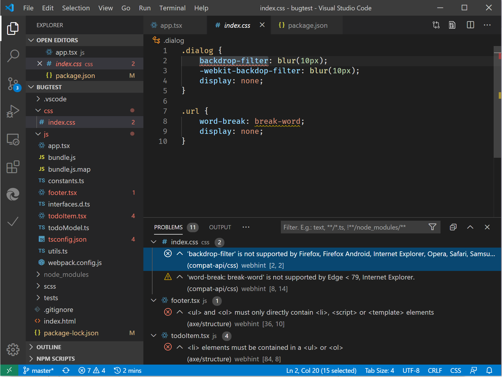

# Visual Studio CodeVisual Studio Code

[Visual Studio コード](https://code.visualstudio.com/Docs)は、デスクトップで実行される強力なソースコードエディターであり、Windows、MacOS、Linux で利用できます。[Visual Studio Code](https://code.visualstudio.com/Docs) is a lightweight but powerful source code editor which runs on your desktop and is available for Windows, macOS and Linux. JavaScript、TypeScript、および node.js の組み込みサポートが含まれているので、このボックスから直接、web 開発者に最適なツールです。It comes with built-in support for JavaScript, TypeScript and Node.js so it's a great tool for web developers right out of the box! まだ使用していない場合は、[このページ](https://code.visualstudio.com/)にアクセスして Visual Studio のコードをダウンロードします。Head to [this page](https://code.visualstudio.com/) to download Visual Studio Code if you aren't using it yet.

## 拡張機能Extensions

<!-- We want to put something like the tiles for extensions VS Code uses on this page https://code.visualstudio.com/Docs#top-extensions but I don't think this is a markdown page. I think it's a web page. I couldn't find anything in https://github.com/Microsoft/vscode-docs that looks like this page. In the meantime, here's what I've come up with: -->

以下で強調表示されている拡張機能を取得するには、 `Ctrl`  +  `Shift`  +  `X` `Command`  +  `Shift`  +  `X` VS コードの [拡張機能] (Windows または Mac の場合) に移動します。To acquire any of the extensions highlighted below, navigate to Extensions (`Ctrl` + `Shift` + `X` on Windows or `Command` + `Shift` + `X` on Mac) in VS Code.

市場で特定の拡張子を検索し、[**インストール**] を選択します。Search the Marketplace for the specific extension and select **Install**.

## Microsoft Edge 用デバッガーDebugger for Microsoft Edge

`console.log()`Microsoft Edge VS コード拡張機能[のデバッガー](https://marketplace.visualstudio.com/items?itemName=msjsdiag.debugger-for-edge)を使って、フロントエンド JavaScript コードを行単位でデバッグし、 [Visual Studio コード](https://code.visualstudio.com/)でステートメントを直接表示します。Debug your front-end JavaScript code line by line and display `console.log()` statements directly in [Visual Studio Code](https://code.visualstudio.com/) using the the [Debugger for Microsoft Edge](https://marketplace.visualstudio.com/items?itemName=msjsdiag.debugger-for-edge) VS Code extension!

Microsoft [edge VS のデバッガー](https://marketplace.visualstudio.com/items?itemName=msjsdiag.debugger-for-edge)を使って、microsoft Edge (EdgeHTML) と microsoft Edge (Chromium) の両方を起動またはアタッチします。Use the [Debugger for Microsoft Edge](https://marketplace.visualstudio.com/items?itemName=msjsdiag.debugger-for-edge) VS Code extension to launch or attach to both Microsoft Edge (EdgeHTML) and Microsoft Edge (Chromium). [このページ](./debugger-for-edge.md)では、VS コードからの Microsoft Edge のデバッグ方法と、サンプルの**起動. json**構成のチュートリアルについて説明します。Check out [this page](./debugger-for-edge.md) for a walkthrough of debugging Microsoft Edge from VS Code and sample **launch.json** configurations.

## Microsoft Edge の要素Elements for Microsoft Edge

Microsoft Edge VS コード拡張[用の要素](https://marketplace.visualstudio.com/items?itemName=ms-edgedevtools.vscode-edge-devtools)を追加することで、ブラウザーの要素ツールを Visual Studio コード内から使うことができます。By adding the [Elements for Microsoft Edge](https://marketplace.visualstudio.com/items?itemName=ms-edgedevtools.vscode-edge-devtools) VS Code extension, you can use the browser's Elements tool from within Visual Studio Code. 起動またはアタッチのどちらの場合も、要素ツールは Microsoft Edge のインスタンスに接続され、ランタイム HTML 構造を表示し、レイアウトを変更したり、スタイル設定の問題を修正したりすることができます。By either launching or attaching, the Elements tool will connect to an instance of Microsoft Edge, display the runtime HTML structure, and allow you to alter the layout or fix styling issues.

詳細については、[このページ](./elements-for-edge.md)をご覧ください。For more information, check out [this page](./elements-for-edge.md).

## web ヒントwebhint

カスタマイズ可能なカスタマイズされたカスタマイズされた機能[を使って](https://webhint.io)、アクセシビリティ、パフォーマンス、クロスブラウザーの互換性、PWA の互換性、およびサイトのセキュリティを向上させることができます。Use [webhint](https://webhint.io), a customizable linting tool, to improve the accessibility, performance, cross-browser compatibility, PWA compatibility, and security of your site. ベストプラクティスと一般的なエラーについてコードを確認します。It checks your code for best practices and common errors. このオープンソースプロジェクトは、最初に Microsoft Edge チームによって開発されたものであり、 [Openjs Foundation](https://openjsf.org/)に含まれています。This open-source project, initially developed by the Microsoft Edge team, is now part of the [OpenJS Foundation](https://openjsf.org/). Microsoft Edge チームは、コミュニティの web 開発者と共に web ヒントに投稿し続けています。The Microsoft Edge team continues to contribute to webhint alongside web developers in the community.

[VS コードの webhint 拡張機能](https://marketplace.visualstudio.com/items?itemName=webhint.vscode-webhint)を追加して、HTML、CSS、JavaScript、TypeScript などの問題を特定して修正します。Identify and fix problems in your HTML, CSS, JavaScript, TypeScript, and more by adding the [webhint extension for VS Code](https://marketplace.visualstudio.com/items?itemName=webhint.vscode-webhint). ヒントはインライン下線として表示され、[問題] ウィンドウに集計されます。Hints appear as inline underlines and are summarized in the Problems pane.

詳細については、「 [Visual Studio コードでの webhint](./webhint.md)の使い方」を参照してください。For more information, see [How to use webhint in Visual Studio Code](./webhint.md).
