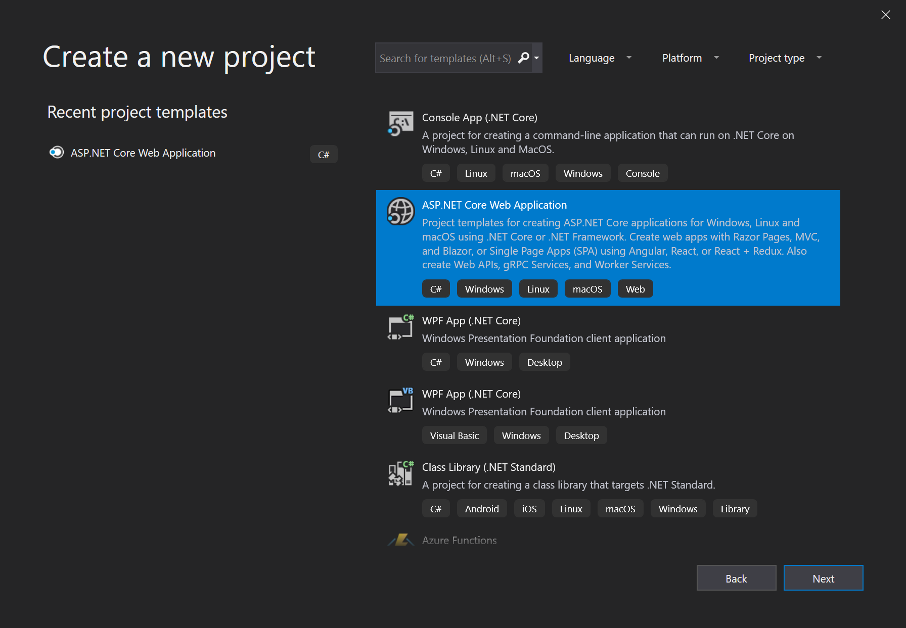
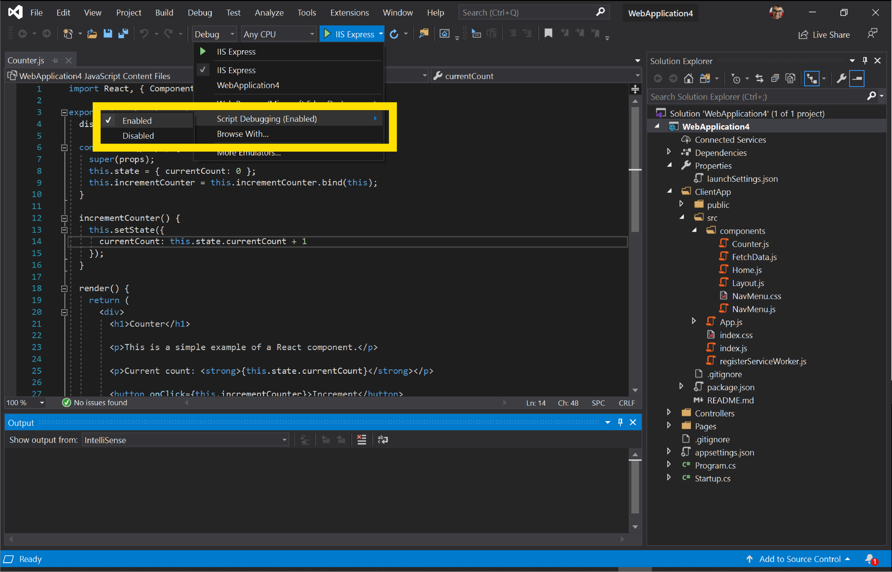
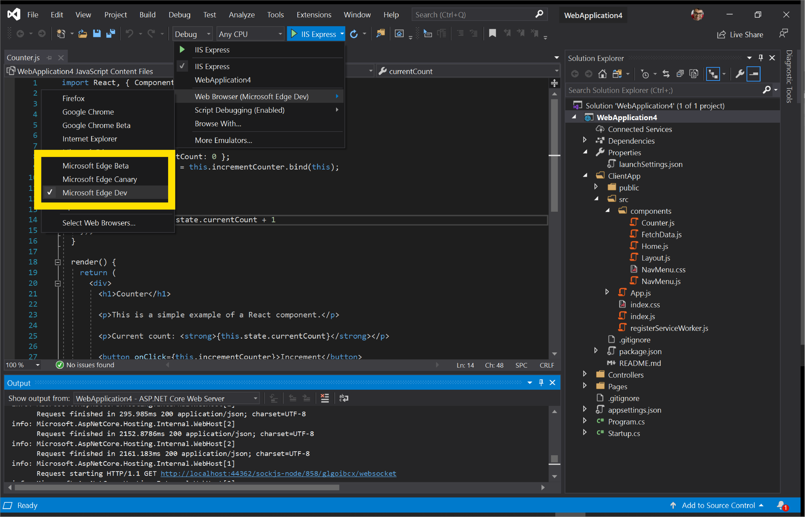
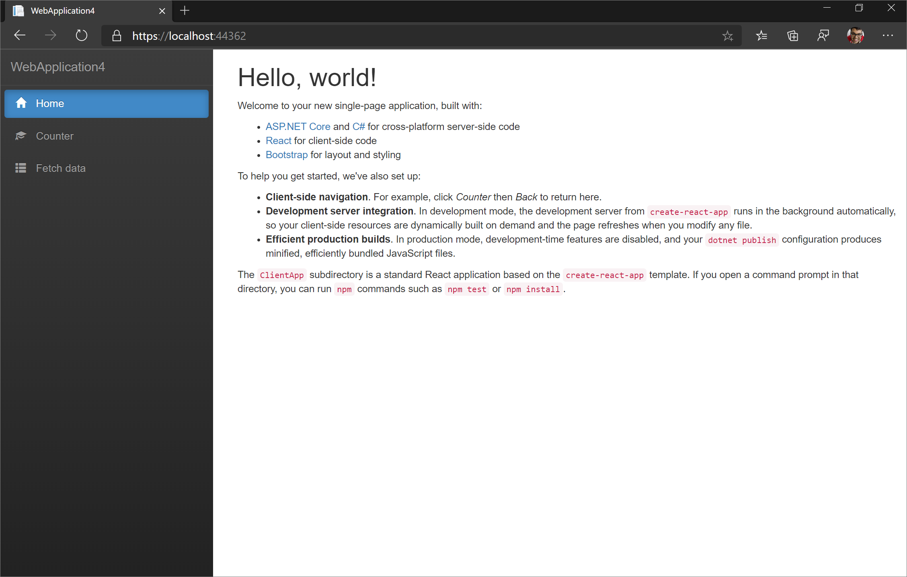
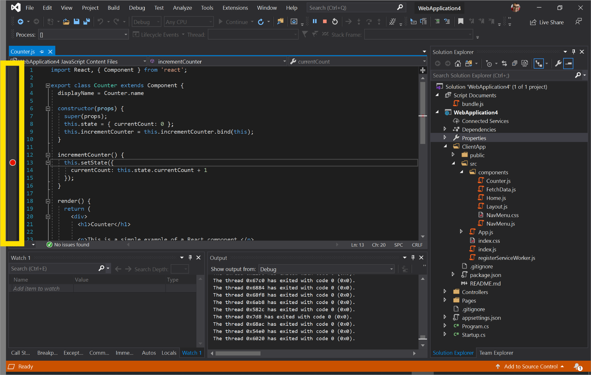
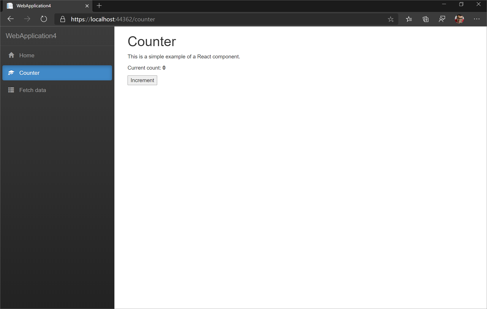
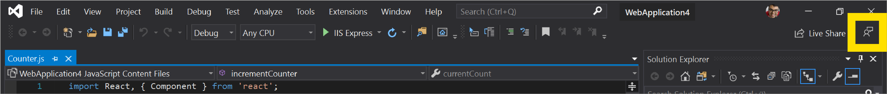

# Visual Studio

Microsoft [Visual Studio](https://visualstudio.microsoft.com/vs/) は、web アプリケーションの編集、デバッグ、ビルド、公開に使用できる統合開発環境 (IDE) です。 これは、web 開発のさまざまな側面に使用できる機能豊富なプログラムです。 Visual Studio には、ほとんどの Ide が提供する標準エディターとデバッガーが含まれています。 Visual Studio には、コンパイラ、コード補完ツール、グラフィカルデザイナーなど、開発プロセスを簡単にするための多くの機能が用意されています。 まだ使用していない場合は、 [このページ](https://visualstudio.microsoft.com/downloads/) にアクセスして Visual Studio をダウンロードします。

現時点では、Visual Studio 2019 は、ASP\ .NET Framework および ASP\ .NET Core アプリケーション向けの Microsoft Edge での JavaScript のデバッグをサポートしています。 Visual Studio から Microsoft Edge をデバッグするには、次の手順を実行します。

## Microsoft Edge を起動する
Visual Studio は、ASP\ .NET と ASP\ .NET コアアプリケーションをビルドし、web サーバーを起動し、Microsoft Edge を起動して、Visual Studio デバッガーを1つのボタンをクリックするだけで接続します。 これにより、Microsoft Edge で実行されている JavaScript を IDE から直接デバッグできます。

### 新しい ASP.NET Core web アプリケーションを作成する

Visual Studio 2019 を開いて、[ **新しいプロジェクトの作成**] を選択します。 次の画面で、[ **Asp\ .Net Core Web アプリケーション** ] を選択し、[ **次へ**] をクリックします。

> ##### 図 1  
> 新しい ASP.NET Core Web アプリケーションを作成する   

新しいプロジェクトの **プロジェクト名** を入力し、[ **作成**] をクリックします。 この例では、 **React.js** をテンプレートとして選んで、React.js を ASP.NET Core アプリケーションと統合する方法を示します。 [ **作成**] をクリックします。

### Visual Studio から Microsoft Edge を起動する

プロジェクトを作成したら、 **ClientApp/src/components/Counter.js**を開きます。 次に、緑色の **再生** ボタンと **IIS Express**の横にあるドロップダウンを選択して JavaScript をデバッグするように Visual Studio に指示します。 

> ##### 図 2  
> 緑色の [**再生**] ボタンの横にあるドロップ**ダウンと、** 緑色の [ 
> ![ 再生] ボタンと iis express の隣にあるドロップダウン](./media/vs-dropdown.png)  

[ **スクリプトのデバッグ** ] を選択し、[ **有効**] をクリックします。

> ##### 図 3  
> Visual Studio でスクリプトのデバッグを有効にする   

同じドロップダウンで、[ **Web ブラウザー** ] を選択し、Visual Studio で起動する microsoft edge のプレビューチャネルをクリックします。 Microsoft edge カナリア、Dev、またはベータ版です。 まだインストールしていない場合は、 [このページ](https://www.microsoftedgeinsider.com/download) にアクセスして Microsoft Edge preview チャネルをインストールしてください。

> ##### 図 4  
> Visual Studio で起動する Microsoft Edge のプレビューチャネルを選択します。   

> [!NOTE]
> [Microsoft Edge (EdgeHTML)] を選択した場合は、Microsoft Edge (Chromium) ではなく、Visual Studio によって起動されます。 [Microsoft edge のプレビューチャネルをインストール](https://www.microsoftedgeinsider.com/download) して選択するか、または microsoft Edge (EdgeHTML) ではなく、コンピューターにインストールされている microsoft edge のバージョンが microsoft Edge (Chromium) であることを確認します。

これで Visual Studio が適切に構成されたので、緑色の **再生** ボタンをクリックします。 Visual Studio は、アプリケーションをビルドし、web サーバーを起動し、Microsoft Edge を起動して、 `https://localhost:44362/` **launchSettings.js**で指定されているポートに移動します。

> ##### 図 5  
> Visual studio から起動された visual Studio からの microsoft edge の開始   

### Microsoft Edge で実行されている JavaScript のデバッグ

再び Visual Studio に切り替えます。 **Counter.js**で、行の横にある余白をクリックして、13行目にブレークポイントを設定します。

> ##### 図 6
> Visual Studio の [行 13] の横にある余白をクリックして visual studio のブレークポイントを設定し**Counter.js** 
>   

次に、Visual Studio が起動した Microsoft Edge のインスタンスに切り替えます。 ページの左側のナビゲーションメニューで、[ **カウンター** ] をクリックします。 次に、[ **増分**] をクリックします。

> ##### 図 7
> ASP.NET Core web アプリケーションのカウンターページ   

Visual Studio の JavaScript デバッガーでは、 **Counter.js**で設定したブレークポイントに移動します。 Visual Studio では、Microsoft Edge で実行されている JavaScript の実行が一時停止されたため、スクリプトを1行ずつステップ実行できます。

> ##### 図 8
> Visual Studio visual Studio で実行されている JavaScript の一時停止   

この例は、Visual Studio で利用できる機能のわずかなデモンストレーションです。 Visual Studio 2019 で実行できる操作の詳細については、 [そのドキュメント](https://docs.microsoft.com/visualstudio/windows/?view=vs-2019)を参照してください。

## Microsoft Edge にアタッチする
前のワークフローでは、Visual Studio によって Microsoft Edge が起動されます。 このワークフローを使って、既に実行されている Microsoft Edge のインスタンスに Visual Studio デバッガーをアタッチすることができます。 

まず、Microsoft Edge の実行中のインスタンスがないことを確認します。 次に、お使いの端末から次のコマンドを実行します。

```console
start msedge –remote-debugging-port=9222
```

Visual Studio で、[**デバッグ**] メニューを開き、[**プロセスにアタッチ**] またはをクリックし `Ctrl`  +  `Alt`  +  `P` ます。

> ##### 図 9
> Visual studio で [ **プロセスにアタッチ] を** 選ぶ ![ * * visual Studio で [プロセスにアタッチ] * *](./media/attach-to-process.png)  

[ **プロセスにアタッチ** ] ダイアログで、[ **接続の種類** ] を [ **Chrome devtools protocol websocket (認証なし)**] に設定します。 [ **接続先** ] ボックスに「in」と入力し、を `http://localhost:9222/` 押し `Enter` ます。 [ **プロセスにアタッチ** ] ダイアログに、Microsoft Edge で表示されている開いているタブの一覧が表示されます。

> ##### 図 10
> Visual Studio の [プロセスに **アタッチ** ] ダイアログを構成する ![ visual Studio で [プロセスにアタッチ] ダイアログを構成する](./media/attach-to-process-dialog.png)  

[ **選択] をクリックします。** **JavaScript (Microsoft Edge – Chromium)** を確認してください。 タブを追加したり、新しいタブに移動したり、タブを閉じたり、[**更新**] ボタンをクリックして [**プロセスにアタッチ**] ダイアログに反映された変更を確認したりすることができます。 デバッグするタブを選択し、[ **添付**] をクリックします。

Visual Studio デバッガーが Microsoft Edge にアタッチされるようになりました。 `console.log()`Visual Studio の [デバッグ出力] ウィンドウで、JavaScript の実行を一時停止し、ブレークポイントを設定し、ステートメントを直接参照することができます。

## Microsoft Visual Studio チームと連絡を取り合う  

Visual Studio で JavaScript を操作する方法の詳細については、こちらを参照してください。  Visual Studio で **フィードバック** アイコンをクリックするか、ツイート [@VisualStudio + @EdgeDevTools] をクリックしてフィードバックを送信してください @VisualStudio and @EdgeDevTools](https://twitter.com/intent/tweet?text= 。  

> ##### 図 11
> Visual studio の [フィードバック] アイコンの **[フィードバック]** アイコン   
