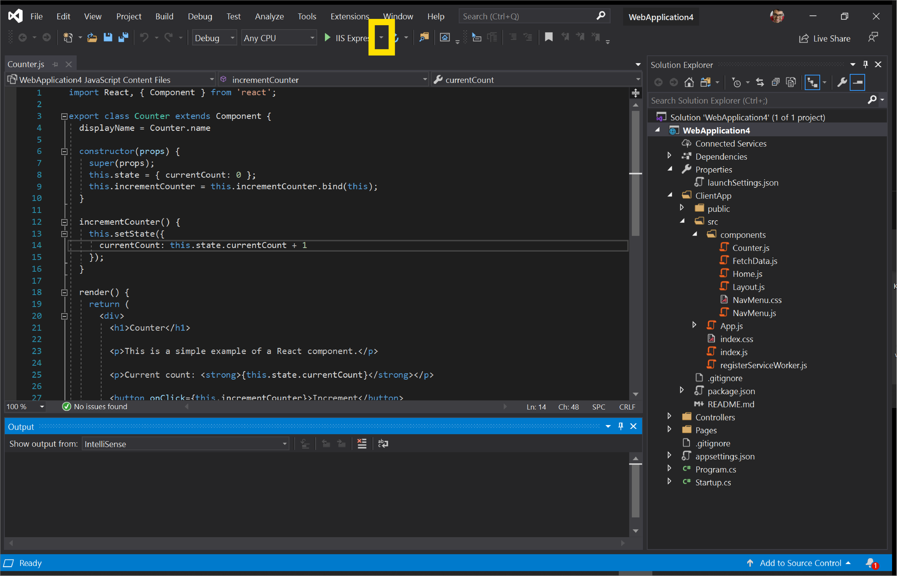

# <span data-ttu-id="5f8ce-104">Visual Studio</span><span class="sxs-lookup"><span data-stu-id="5f8ce-104">Visual Studio</span></span>

<span data-ttu-id="5f8ce-105">Microsoft [Visual Studio](https://visualstudio.microsoft.com/vs/) は、web アプリケーションの編集、デバッグ、ビルド、公開に使用できる統合開発環境 (IDE) です。</span><span class="sxs-lookup"><span data-stu-id="5f8ce-105">Microsoft [Visual Studio](https://visualstudio.microsoft.com/vs/) is an integrated development environment (IDE) that you can use to edit, debug, build, and publish your web applications.</span></span> <span data-ttu-id="5f8ce-106">これは、web 開発のさまざまな側面に使用できる機能豊富なプログラムです。</span><span class="sxs-lookup"><span data-stu-id="5f8ce-106">It is a feature-rich program that can be used for many aspects of your web development.</span></span> <span data-ttu-id="5f8ce-107">Visual Studio には、ほとんどの Ide が提供する標準エディターとデバッガーが含まれています。 Visual Studio には、コンパイラ、コード補完ツール、グラフィカルデザイナーなど、開発プロセスを簡単にするための多くの機能が用意されています。</span><span class="sxs-lookup"><span data-stu-id="5f8ce-107">Over and above the standard editor and debugger that most IDEs provide, Visual Studio includes compilers, code completion tools, graphical designers, and many more features to ease your development process.</span></span> <span data-ttu-id="5f8ce-108">まだ使用していない場合は、 [このページ](https://visualstudio.microsoft.com/downloads/) にアクセスして Visual Studio をダウンロードします。</span><span class="sxs-lookup"><span data-stu-id="5f8ce-108">Head to [this page](https://visualstudio.microsoft.com/downloads/) to download Visual Studio if you aren't using it yet.</span></span>

<span data-ttu-id="5f8ce-109">現時点では、Visual Studio 2019 は、ASP\ .NET Framework および ASP\ .NET Core アプリケーション向けの Microsoft Edge での JavaScript のデバッグをサポートしています。</span><span class="sxs-lookup"><span data-stu-id="5f8ce-109">Currently, Visual Studio 2019 supports debugging JavaScript in Microsoft Edge for your ASP\.NET Framework and ASP\.NET Core applications.</span></span> <span data-ttu-id="5f8ce-110">Visual Studio から Microsoft Edge をデバッグするには、次の手順を実行します。</span><span class="sxs-lookup"><span data-stu-id="5f8ce-110">Follow the steps below to debug Microsoft Edge from Visual Studio.</span></span>

## <span data-ttu-id="5f8ce-111">Microsoft Edge を起動する</span><span class="sxs-lookup"><span data-stu-id="5f8ce-111">Launch Microsoft Edge</span></span>
<span data-ttu-id="5f8ce-112">Visual Studio は、ASP\ .NET と ASP\ .NET コアアプリケーションをビルドし、web サーバーを起動し、Microsoft Edge を起動して、Visual Studio デバッガーを1つのボタンをクリックするだけで接続します。</span><span class="sxs-lookup"><span data-stu-id="5f8ce-112">Visual Studio builds your ASP\.NET and ASP\.NET Core application, starts your web server, launches Microsoft Edge, and connects the Visual Studio debugger all at the click of a single button.</span></span> <span data-ttu-id="5f8ce-113">これにより、Microsoft Edge で実行されている JavaScript を IDE から直接デバッグできます。</span><span class="sxs-lookup"><span data-stu-id="5f8ce-113">This enables you to debug JavaScript running in Microsoft Edge directly from your IDE!</span></span>

### <span data-ttu-id="5f8ce-114">新しい ASP.NET Core web アプリケーションを作成する</span><span class="sxs-lookup"><span data-stu-id="5f8ce-114">Create a new ASP.NET Core web application</span></span>

<span data-ttu-id="5f8ce-115">Visual Studio 2019 を開いて、[ **新しいプロジェクトの作成**] を選択します。</span><span class="sxs-lookup"><span data-stu-id="5f8ce-115">Open Visual Studio 2019 and select **Create a new project**.</span></span> <span data-ttu-id="5f8ce-116">次の画面で、[ **Asp\ .Net Core Web アプリケーション** ] を選択し、[ **次へ**] をクリックします。</span><span class="sxs-lookup"><span data-stu-id="5f8ce-116">On the next screen, select **ASP\.NET Core Web Application** and click **Next**.</span></span>

> ##### <span data-ttu-id="5f8ce-117">図 1</span><span class="sxs-lookup"><span data-stu-id="5f8ce-117">Figure 1</span></span>  
> <span data-ttu-id="5f8ce-118">新しい ASP.NET Core Web アプリケーションを作成する </span><span class="sxs-lookup"><span data-stu-id="5f8ce-118">Create a new ASP.NET Core Web Application </span></span>  

<span data-ttu-id="5f8ce-119">新しいプロジェクトの **プロジェクト名** を入力し、[ **作成**] をクリックします。</span><span class="sxs-lookup"><span data-stu-id="5f8ce-119">Provide a **Project name** for your new project and click **Create**.</span></span> <span data-ttu-id="5f8ce-120">この例では、 **React.js** をテンプレートとして選んで、React.js を ASP.NET Core アプリケーションと統合する方法を示します。 [ **作成**] をクリックします。</span><span class="sxs-lookup"><span data-stu-id="5f8ce-120">For the purposes of this example, select **React.js** as the template which shows you how to integrate React.js with an ASP.NET Core application and click **Create**.</span></span>

### <span data-ttu-id="5f8ce-121">Visual Studio から Microsoft Edge を起動する</span><span class="sxs-lookup"><span data-stu-id="5f8ce-121">Launch Microsoft Edge from Visual Studio</span></span>

<span data-ttu-id="5f8ce-122">プロジェクトを作成したら、 **ClientApp/src/components/Counter.js**を開きます。</span><span class="sxs-lookup"><span data-stu-id="5f8ce-122">Once your project has been created, open **ClientApp/src/components/Counter.js**.</span></span> <span data-ttu-id="5f8ce-123">次に、緑色の **再生** ボタンと **IIS Express**の横にあるドロップダウンを選択して JavaScript をデバッグするように Visual Studio に指示します。</span><span class="sxs-lookup"><span data-stu-id="5f8ce-123">Now, tell Visual Studio to debug JavaScript by selecting the dropdown next to the green **Play** button and **IIS Express**.</span></span> 

> ##### <span data-ttu-id="5f8ce-124">図 2</span><span class="sxs-lookup"><span data-stu-id="5f8ce-124">Figure 2</span></span>  
> <span data-ttu-id="5f8ce-125">緑色の [**再生**] ボタンの横にあるドロップ**ダウンと、** 緑色の [ 
> ![ 再生] ボタンと iis express の隣にあるドロップダウン](./media/vs-dropdown.png)</span><span class="sxs-lookup"><span data-stu-id="5f8ce-125">The dropdown next to the green **Play** button and **IIS Express**
</span></span>  

<span data-ttu-id="5f8ce-126">[ **スクリプトのデバッグ** ] を選択し、[ **有効**] をクリックします。</span><span class="sxs-lookup"><span data-stu-id="5f8ce-126">Select **Script Debugging** and click **Enabled**.</span></span>

> ##### <span data-ttu-id="5f8ce-127">図 3</span><span class="sxs-lookup"><span data-stu-id="5f8ce-127">Figure 3</span></span>  
> <span data-ttu-id="5f8ce-128">Visual Studio でスクリプトのデバッグを有効にする </span><span class="sxs-lookup"><span data-stu-id="5f8ce-128">Enable script debugging in Visual Studio </span></span>  

<span data-ttu-id="5f8ce-129">同じドロップダウンで、[ **Web ブラウザー** ] を選択し、Visual Studio で起動する microsoft edge のプレビューチャネルをクリックします。 Microsoft edge カナリア、Dev、またはベータ版です。</span><span class="sxs-lookup"><span data-stu-id="5f8ce-129">In the same dropdown, select **Web Browser** and click the preview channel of Microsoft Edge that you want Visual Studio to launch: Microsoft Edge Canary, Dev, or Beta.</span></span> <span data-ttu-id="5f8ce-130">まだインストールしていない場合は、 [このページ](https://www.microsoftedgeinsider.com/download) にアクセスして Microsoft Edge preview チャネルをインストールしてください。</span><span class="sxs-lookup"><span data-stu-id="5f8ce-130">If you haven't already, head to [this page](https://www.microsoftedgeinsider.com/download) to install the Microsoft Edge preview channels.</span></span>

> ##### <span data-ttu-id="5f8ce-131">図 4</span><span class="sxs-lookup"><span data-stu-id="5f8ce-131">Figure 4</span></span>  
> <span data-ttu-id="5f8ce-132">Visual Studio で起動する Microsoft Edge のプレビューチャネルを選択します。 </span><span class="sxs-lookup"><span data-stu-id="5f8ce-132">Select the preview channel of Microsoft Edge that you want Visual Studio to launch </span></span>  

> [!NOTE]
> <span data-ttu-id="5f8ce-133">[Microsoft Edge (EdgeHTML)] を選択した場合は、Microsoft Edge (Chromium) ではなく、Visual Studio によって起動されます。</span><span class="sxs-lookup"><span data-stu-id="5f8ce-133">If you select Microsoft Edge (EdgeHTML), Visual Studio will launch that instead of Microsoft Edge (Chromium).</span></span> <span data-ttu-id="5f8ce-134">[Microsoft edge のプレビューチャネルをインストール](https://www.microsoftedgeinsider.com/download) して選択するか、または microsoft Edge (EdgeHTML) ではなく、コンピューターにインストールされている microsoft edge のバージョンが microsoft Edge (Chromium) であることを確認します。</span><span class="sxs-lookup"><span data-stu-id="5f8ce-134">[Install the preview channels of Microsoft Edge](https://www.microsoftedgeinsider.com/download) and select them or ensure that the version of Microsoft Edge installed on your machine is Microsoft Edge (Chromium) and not Microsoft Edge (EdgeHTML).</span></span>

<span data-ttu-id="5f8ce-135">これで Visual Studio が適切に構成されたので、緑色の **再生** ボタンをクリックします。</span><span class="sxs-lookup"><span data-stu-id="5f8ce-135">Now that Visual Studio is correctly configured, click the green **Play** button.</span></span> <span data-ttu-id="5f8ce-136">Visual Studio は、アプリケーションをビルドし、web サーバーを起動し、Microsoft Edge を起動して、 `https://localhost:44362/` **launchSettings.js**で指定されているポートに移動します。</span><span class="sxs-lookup"><span data-stu-id="5f8ce-136">Visual Studio will build your application, start the web server, launch Microsoft Edge, and navigate to `https://localhost:44362/` or whatever port is specified in **launchSettings.json**.</span></span>

> ##### <span data-ttu-id="5f8ce-137">図 5</span><span class="sxs-lookup"><span data-stu-id="5f8ce-137">Figure 5</span></span>  
> <span data-ttu-id="5f8ce-138">Visual studio から起動された visual Studio からの microsoft edge の開始 </span><span class="sxs-lookup"><span data-stu-id="5f8ce-138">Microsoft Edge launched from Visual Studio </span></span>  

### <span data-ttu-id="5f8ce-139">Microsoft Edge で実行されている JavaScript のデバッグ</span><span class="sxs-lookup"><span data-stu-id="5f8ce-139">Debug JavaScript running in Microsoft Edge</span></span>

<span data-ttu-id="5f8ce-140">再び Visual Studio に切り替えます。</span><span class="sxs-lookup"><span data-stu-id="5f8ce-140">Switch back to Visual Studio.</span></span> <span data-ttu-id="5f8ce-141">**Counter.js**で、行の横にある余白をクリックして、13行目にブレークポイントを設定します。</span><span class="sxs-lookup"><span data-stu-id="5f8ce-141">In **Counter.js**, set a breakpoint on Line 13 by clicking in the gutter next to that line.</span></span>

> ##### <span data-ttu-id="5f8ce-142">図 6</span><span class="sxs-lookup"><span data-stu-id="5f8ce-142">Figure 6</span></span>
> <span data-ttu-id="5f8ce-143">Visual Studio の [行 13] の横にある余白をクリックして visual studio のブレークポイントを設定し**Counter.js** 
> </span><span class="sxs-lookup"><span data-stu-id="5f8ce-143">Setting a breakpoint in Visual Studio by clicking on the gutter next to Line 13 in **Counter.js**
</span></span>  

<span data-ttu-id="5f8ce-144">次に、Visual Studio が起動した Microsoft Edge のインスタンスに切り替えます。</span><span class="sxs-lookup"><span data-stu-id="5f8ce-144">Now switch back to the instance of Microsoft Edge that Visual Studio launched.</span></span> <span data-ttu-id="5f8ce-145">ページの左側のナビゲーションメニューで、[ **カウンター** ] をクリックします。</span><span class="sxs-lookup"><span data-stu-id="5f8ce-145">Click on **Counter** in the NavMenu on the left of the page.</span></span> <span data-ttu-id="5f8ce-146">次に、[ **増分**] をクリックします。</span><span class="sxs-lookup"><span data-stu-id="5f8ce-146">Now click **Increment**.</span></span>

> ##### <span data-ttu-id="5f8ce-147">図 7</span><span class="sxs-lookup"><span data-stu-id="5f8ce-147">Figure 7</span></span>
> <span data-ttu-id="5f8ce-148">ASP.NET Core web アプリケーションのカウンターページ </span><span class="sxs-lookup"><span data-stu-id="5f8ce-148">The Counter page in our ASP.NET Core web application </span></span>  

<span data-ttu-id="5f8ce-149">Visual Studio の JavaScript デバッガーでは、 **Counter.js**で設定したブレークポイントに移動します。</span><span class="sxs-lookup"><span data-stu-id="5f8ce-149">The JavaScript debugger in Visual Studio is going to hit the breakpoint we set in **Counter.js**.</span></span> <span data-ttu-id="5f8ce-150">Visual Studio では、Microsoft Edge で実行されている JavaScript の実行が一時停止されたため、スクリプトを1行ずつステップ実行できます。</span><span class="sxs-lookup"><span data-stu-id="5f8ce-150">Visual Studio has now paused execution of the JavaScript running in Microsoft Edge and you can step through the script line-by-line.</span></span>

> ##### <span data-ttu-id="5f8ce-151">図 8</span><span class="sxs-lookup"><span data-stu-id="5f8ce-151">Figure 8</span></span>
> <span data-ttu-id="5f8ce-152">Visual Studio visual Studio で実行されている JavaScript の一時停止 </span><span class="sxs-lookup"><span data-stu-id="5f8ce-152">Visual Studio pausing JavaScript running in Microsoft Edge </span></span>  

<span data-ttu-id="5f8ce-153">この例は、Visual Studio で利用できる機能のわずかなデモンストレーションです。</span><span class="sxs-lookup"><span data-stu-id="5f8ce-153">This example was just a minor demonstration of the functionality available in Visual Studio.</span></span> <span data-ttu-id="5f8ce-154">Visual Studio 2019 で実行できる操作の詳細については、 [そのドキュメント](https://docs.microsoft.com/visualstudio/windows/?view=vs-2019)を参照してください。</span><span class="sxs-lookup"><span data-stu-id="5f8ce-154">Learn more about all the things you can do in Visual Studio 2019 by reading [their documentation](https://docs.microsoft.com/visualstudio/windows/?view=vs-2019).</span></span>

## <span data-ttu-id="5f8ce-155">Microsoft Edge にアタッチする</span><span class="sxs-lookup"><span data-stu-id="5f8ce-155">Attach to Microsoft Edge</span></span>
<span data-ttu-id="5f8ce-156">前のワークフローでは、Visual Studio によって Microsoft Edge が起動されます。</span><span class="sxs-lookup"><span data-stu-id="5f8ce-156">In the previous workflow, Visual Studio launches Microsoft Edge.</span></span> <span data-ttu-id="5f8ce-157">このワークフローを使って、既に実行されている Microsoft Edge のインスタンスに Visual Studio デバッガーをアタッチすることができます。</span><span class="sxs-lookup"><span data-stu-id="5f8ce-157">With this workflow, you will be able to attach the Visual Studio debugger to an already running instance of Microsoft Edge.</span></span> 

<span data-ttu-id="5f8ce-158">まず、Microsoft Edge の実行中のインスタンスがないことを確認します。</span><span class="sxs-lookup"><span data-stu-id="5f8ce-158">First, ensure that there are no running instances of Microsoft Edge.</span></span> <span data-ttu-id="5f8ce-159">次に、お使いの端末から次のコマンドを実行します。</span><span class="sxs-lookup"><span data-stu-id="5f8ce-159">Now, from your terminal, run the following command:</span></span>

```console
start msedge –remote-debugging-port=9222
```

<span data-ttu-id="5f8ce-160">Visual Studio で、[**デバッグ**] メニューを開き、[**プロセスにアタッチ**] またはをクリックし `Ctrl`  +  `Alt`  +  `P` ます。</span><span class="sxs-lookup"><span data-stu-id="5f8ce-160">From Visual Studio, open the **Debug** menu and select **Attach to Process** or press `Ctrl` + `Alt` + `P`.</span></span>

> ##### <span data-ttu-id="5f8ce-161">図 9</span><span class="sxs-lookup"><span data-stu-id="5f8ce-161">Figure 9</span></span>
> <span data-ttu-id="5f8ce-162">Visual studio で [ **プロセスにアタッチ] を** 選ぶ ![ * * visual Studio で [プロセスにアタッチ] * *](./media/attach-to-process.png)</span><span class="sxs-lookup"><span data-stu-id="5f8ce-162">Selecting **Attach to Process** in Visual Studio </span></span>  

<span data-ttu-id="5f8ce-163">[ **プロセスにアタッチ** ] ダイアログで、[ **接続の種類** ] を [ **Chrome devtools protocol websocket (認証なし)**] に設定します。</span><span class="sxs-lookup"><span data-stu-id="5f8ce-163">From the **Attach to Process** dialog, set **Connection type** to **Chrome devtools protocol websocket (no authentication)**.</span></span> <span data-ttu-id="5f8ce-164">[ **接続先** ] ボックスに「in」と入力し、を `http://localhost:9222/` 押し `Enter` ます。</span><span class="sxs-lookup"><span data-stu-id="5f8ce-164">In the **Connecting target** textbox, type in `http://localhost:9222/` and press `Enter`.</span></span> <span data-ttu-id="5f8ce-165">[ **プロセスにアタッチ** ] ダイアログに、Microsoft Edge で表示されている開いているタブの一覧が表示されます。</span><span class="sxs-lookup"><span data-stu-id="5f8ce-165">You should see the list of open tabs you have in Microsoft Edge listed out in the **Attach to Process** dialog.</span></span>

> ##### <span data-ttu-id="5f8ce-166">図 10</span><span class="sxs-lookup"><span data-stu-id="5f8ce-166">Figure 10</span></span>
> <span data-ttu-id="5f8ce-167">Visual Studio の [プロセスに **アタッチ** ] ダイアログを構成する ![ visual Studio で [プロセスにアタッチ] ダイアログを構成する](./media/attach-to-process-dialog.png)</span><span class="sxs-lookup"><span data-stu-id="5f8ce-167">Configuring the **Attach to Process** dialog in Visual Studio </span></span>  

<span data-ttu-id="5f8ce-168">[ **選択] をクリックします。**</span><span class="sxs-lookup"><span data-stu-id="5f8ce-168">Click **Select…**</span></span> <span data-ttu-id="5f8ce-169">**JavaScript (Microsoft Edge – Chromium)** を確認してください。</span><span class="sxs-lookup"><span data-stu-id="5f8ce-169">and check **JavaScript (Microsoft Edge – Chromium)**.</span></span> <span data-ttu-id="5f8ce-170">タブを追加したり、新しいタブに移動したり、タブを閉じたり、[**更新**] ボタンをクリックして [**プロセスにアタッチ**] ダイアログに反映された変更を確認したりすることができます。</span><span class="sxs-lookup"><span data-stu-id="5f8ce-170">You can add tabs, navigate to new tabs, and close tabs and see those changes reflected in the **Attach to Process** dialog by clicking the **Refresh** button.</span></span> <span data-ttu-id="5f8ce-171">デバッグするタブを選択し、[ **添付**] をクリックします。</span><span class="sxs-lookup"><span data-stu-id="5f8ce-171">Select the tab you want to debug and click **Attach**.</span></span>

<span data-ttu-id="5f8ce-172">Visual Studio デバッガーが Microsoft Edge にアタッチされるようになりました。</span><span class="sxs-lookup"><span data-stu-id="5f8ce-172">The Visual Studio debugger is now attached to Microsoft Edge!</span></span> <span data-ttu-id="5f8ce-173">`console.log()`Visual Studio の [デバッグ出力] ウィンドウで、JavaScript の実行を一時停止し、ブレークポイントを設定し、ステートメントを直接参照することができます。</span><span class="sxs-lookup"><span data-stu-id="5f8ce-173">You can pause execution of JavaScript, set breakpoints, and see `console.log()` statements directly in the Debug Output window in Visual Studio.</span></span>

## <span data-ttu-id="5f8ce-174">Microsoft Visual Studio チームと連絡を取り合う</span><span class="sxs-lookup"><span data-stu-id="5f8ce-174">Getting in touch with the Microsoft Visual Studio team</span></span>  

<span data-ttu-id="5f8ce-175">Visual Studio で JavaScript を操作する方法の詳細については、こちらを参照してください。</span><span class="sxs-lookup"><span data-stu-id="5f8ce-175">We're eager to learn more about how you work with JavaScript in Visual Studio!</span></span>  <span data-ttu-id="5f8ce-176">Visual Studio で **フィードバック** アイコンをクリックするか、ツイート [@VisualStudio + @EdgeDevTools] をクリックしてフィードバックを送信してください @VisualStudio and @EdgeDevTools](https://twitter.com/intent/tweet?text= 。</span><span class="sxs-lookup"><span data-stu-id="5f8ce-176">Please send us feedback by clicking the **Feedback** icon in Visual Studio or by tweeting [@VisualStudio and @EdgeDevTools](https://twitter.com/intent/tweet?text=@VisualStudio+@EdgeDevTools).</span></span>  

> ##### <span data-ttu-id="5f8ce-177">図 11</span><span class="sxs-lookup"><span data-stu-id="5f8ce-177">Figure 11</span></span>
> <span data-ttu-id="5f8ce-178">Visual studio の [フィードバック] アイコンの **[フィードバック]** アイコン </span><span class="sxs-lookup"><span data-stu-id="5f8ce-178">The **Feedback** icon in Visual Studio </span></span>  
