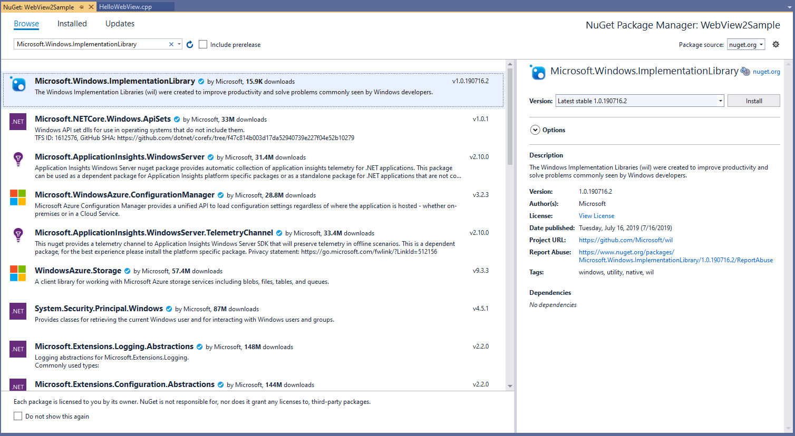
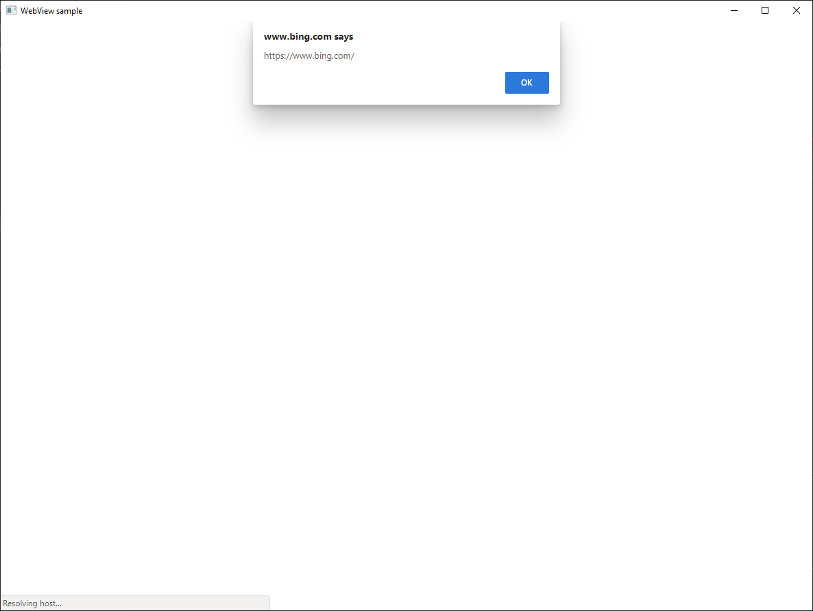

# WebView2 の概要 (開発者用プレビュー)

このチュートリアルでは、 [WebView2](https://aka.ms/webview)のよく使われる機能について説明します。ここでは、最初の WebView2 アプリの作成について説明します。 個々の Api について詳しくは、 [api リファレンス](../reference/win32/0-9-488-reference-webview2.md)をご覧ください。  

## 前提条件

* サポートされている OS (現在 Windows 10、Windows 8.1、Windows 7) には、 [Microsoft Edge (Chromium)](https://www.microsoftedgeinsider.com/download/)がインストールされています。 **カナリアチャネルを使うことをお勧めします。最低限必要なバージョンは 82.0.488.0**です。
* [Visual Studio](https://visualstudio.microsoft.com/) 2015 以降、C++ サポートがインストールされています。

## 手順 1-単一ウィンドウの win32 アプリを作成する

最初に、1つのメインウィンドウを含む基本的なデスクトッププロジェクトを開始します。 これは、このチュートリアルの主な焦点ではないため、 [「チュートリアル: 従来の Windows デスクトップアプリケーションを作成する (C++)](/cpp/windows/walkthrough-creating-windows-desktop-applications-cpp?view=vs-2019)」で説明した変更されたサンプルコードを使います。 更新されたサンプルを[ダウンロード](https://aka.ms/HelloWebView)して使い始めることができます。

Visual Studio で**WebView2GettingStarted**を開きます。 以前のバージョンの Visual Studio を使っている場合は、 **WebView2GettingStarted**プロジェクトを右クリックして、[**プロパティ**] をクリックします。 [**構成プロパティ**  >  の**全般**] で、 **Windows sdk のバージョン**とプラットフォームの**ツールセット**を変更して、Win10 SDK と VS ツールセットを使用できるようにします。


Visual Studio では、WebView2 header ファイルが見つからないことが原因でいくつかのエラーが表示されることがあります。これは、ステップ2が完了した後に発生します。

## 手順 2-WebView2 SDK をインストールする

次に、WebView2 SDK をプロジェクトに追加してみましょう。 開発者向けプレビューでは、Nuget を使って Win32 SDK をインストールできます。

1. プロジェクトを右クリックし、[ **Nuget パッケージの管理**] をクリックします。

    

2. 検索バーに「 **ImplementationLibrary** 」と入力し、結果から**ImplementationLibrary**をクリックし、右側のウィンドウで [**インストール**] をクリックして、最新の SDK をインストールします。 Nuget は、お使いのコンピューターに SDK をダウンロードします。 このチュートリアルでは、 [Windows 実装ライブラリ](https://github.com/Microsoft/wil)と[Windows ランタイム C++ テンプレートライブラリ](/cpp/cppcx/wrl/windows-runtime-cpp-template-library-wrl?view=vs-2019)を使って COM を簡単に操作できるようになっていますが、これらは完全にオプションです。

    

3. 検索バーに「 **WebView2** 」と入力し、結果から**WebView2**をクリックし、右側のウィンドウで [**インストール**] をクリックして、最新の SDK をインストールします。 Nuget は、お使いのコンピューターに SDK をダウンロードします。

    

4. WebView2 ヘッダーを含めます。 「**形式**」の .cpp で、s 行の下に追加し `#include "WebView2.h"` `#include` ます。

    ```cpp
    ...
    #include <wrl.h>
    #include <wil/com.h>
    // include WebView2 header
    #include "WebView2.h"
    ```

WebView2 API に対して使用およびビルドするように設定されています。 F5 キーを押して、サンプルアプリをビルドして実行します。 空のウィンドウが表示されたアプリが表示されます。


## 手順 3-親ウィンドウ内に1つの WebView を作成する

次に、メインウィンドウに WebView を追加してみましょう。 ここでは、環境を設定して、コントロールを電源投入している `CreateCoreWebView2Environment` Microsoft Edge (Chromium) ブラウザーについて説明します。 `CreateCoreWebView2EnvironmentWithOptions`既定の設定を使用する代わりに、ブラウザーの場所、ユーザーフォルダー、ブラウザーのフラグなどを指定する場合にも使用できます。 が完了する `CreateCoreWebView2Environment` `ICoreWebView2Environment::CreateCoreWebView2Controller` と、コールバックと呼び出しの内部で呼び出し `ICoreWebView2CreateCoreWebView2EnvironmentCompletedHandler` て、 `ICoreWebView2Controller::get_CoreWebView2` 関連付けられた WebView を取得できるようになります。

コールバックでは、いくつかの設定も設定して、WebView のサイズを変更して親ウィンドウの100% を取得し、Bing に移動します。

以下のコードをとの間にある**形式の .cpp**にコピーし `// <-- WebView2 sample code starts here -->` `// <-- WebView2 sample code ends here -->` ます。

```cpp
// Step 3 - Create a single WebView within the parent window
// Locate the browser and set up the environment for WebView
CreateCoreWebView2EnvironmentWithOptions(nullptr, nullptr, nullptr,
    Callback<ICoreWebView2CreateCoreWebView2EnvironmentCompletedHandler>(
        [hWnd](HRESULT result, ICoreWebView2Environment* env) -> HRESULT {

            // Create a CoreWebView2Controller and get the associated CoreWebView2 whose parent is the main window hWnd
            env->CreateCoreWebView2Controller(hWnd, Callback<ICoreWebView2CreateCoreWebView2ControllerCompletedHandler>(
                [hWnd](HRESULT result, ICoreWebView2Controller* controller) -> HRESULT {
                if (controller != nullptr) {
                    webviewController = controller;
                    webviewController->get_CoreWebView2(&webviewWindow);
                }

                // Add a few settings for the webview
                // this is a redundant demo step as they are the default settings values
                ICoreWebView2Settings* Settings;
                webviewWindow->get_Settings(&Settings);
                Settings->put_IsScriptEnabled(TRUE);
                Settings->put_AreDefaultScriptDialogsEnabled(TRUE);
                Settings->put_IsWebMessageEnabled(TRUE);

                // Resize WebView to fit the bounds of the parent window
                RECT bounds;
                GetClientRect(hWnd, &bounds);
                webviewController->put_Bounds(bounds);

                // Schedule an async task to navigate to Bing
                webviewWindow->Navigate(L"https://www.bing.com/");

                // Step 4 - Navigation events


                // Step 5 - Scripting


                // Step 6 - Communication between host and web content


                return S_OK;
            }).Get());
        return S_OK;
    }).Get());
```

F5 キーを押して、アプリをビルドし、実行します。 これで、Bing と表示された WebView ウィンドウができます。


## ステップ 4-ナビゲーションイベント

最後の手順では、URL への移動について説明しまし `ICoreWebView2::Navigate` た。 ナビゲーション中に、WebView は、、、、、の順にホストがリッスンできる一連のイベントを起動し `NavigationStarting` `SourceChanged` `ContentLoading` `HistoryChanged` `NavigationCompleted` ます。 詳細について[は、ここ](../reference/win32/0-9-488/ICoreWebView2.md#navigation-events)をクリックしてください。


エラーが発生した場合は、 `SourceChanged` `ContentLoading` `HistoryChanged` ナビゲーションがエラーページに続いているかどうかによって、、またはイベントが発生する可能性があります。 HTTP リダイレクトの場合、 `NavigationStarting` 1 つの行に複数のイベントが存在します。

これらのイベントを利用する例として、 `NavigationStarting` https 以外の要求をキャンセルするためのハンドラーを登録してください。 以下のコードを次の**形式**でコピーします。 `// Step 4 - Navigation events`

```cpp
// register an ICoreWebView2NavigationStartingEventHandler to cancel any non-https navigation
EventRegistrationToken token;
webviewWindow->add_NavigationStarting(Callback<ICoreWebView2NavigationStartingEventHandler>(
    [](ICoreWebView2* webview, ICoreWebView2NavigationStartingEventArgs * args) -> HRESULT {
        PWSTR uri;
        args->get_Uri(&uri);
        std::wstring source(uri);
        if (source.substr(0, 5) != L"https") {
            args->put_Cancel(true);
        }
        CoTaskMemFree(uri);
        return S_OK;
    }).Get(), &token);
```

これで、アプリは https 以外のサイトに移動しません。 同様のメカニズムを使って、独自のドメイン内でのナビゲーションの制限など、他のタスクを実行することができます。

## 手順 5-スクリプト

ホストアプリでは、JavaScript を WebView に挿入することもできます。 タスク WebView は、任意の JavaScript の実行や初期化スクリプトの追加を行うことができます。 追加された初期化スクリプトは、削除されるまでのすべての上位レベルのドキュメントと子フレームのナビゲーションに適用され、グローバルオブジェクトが作成された後で、その HTML ドキュメントに含まれている他のスクリプトが実行される前に実行されます。

以下のコードをコピー `// Step 5 - Scripting` します。

```cpp
// Schedule an async task to add initialization script that freezes the Object object
webviewWindow->AddScriptToExecuteOnDocumentCreated(L"Object.freeze(Object);", nullptr);
// Schedule an async task to get the document URL
webviewWindow->ExecuteScript(L"window.document.URL;", Callback<ICoreWebView2ExecuteScriptCompletedHandler>(
    [](HRESULT errorCode, LPCWSTR resultObjectAsJson) -> HRESULT {
        LPCWSTR URL = resultObjectAsJson;
        //doSomethingWithURL(URL);
        return S_OK;
    }).Get());
```

これで、WebView は常にオブジェクトオブジェクトを固定し、ページドキュメントを1回返します。

**これらのスクリプトインジェクション Api (およびその他のいくつかの WebView2 Api) は非同期であることに注意してください。特定の順序でコードを実行する場合は、コールバックを使う必要があります。**

## ステップ 6-ホストと web コンテンツ間の通信

ホストと web コンテンツも相互に通信でき `postMessage` ます。 WebView 内で実行されている web コンテンツは、ホストに送信でき `window.chrome.webview.postMessage` ます。また、メッセージはホストに登録されているすべてのメッセージによって処理され `ICoreWebView2WebMessageReceivedEventHandler` ます。 同様に、またはを通じて web コンテンツにメッセージを送信することもでき `ICoreWebView2::PostWebMessageAsString` `ICoreWebView2::PostWebMessageAsJSON` ます。これは、から追加されたハンドラーによって検出され `window.chrome.webview.addEventListener` ます。 通信メカニズムにより、web コンテンツは、ネイティブ Api を呼び出すように指示するメッセージを渡すことによってネイティブ機能を利用できます。

このメカニズムを理解するための例として、WebView でドキュメントの URL を少し detour で印刷してみましょう。

1. ホストは、受信したメッセージを web コンテンツに戻すためのハンドラーを登録します。
2. ホストは、ホストからメッセージを印刷するためのハンドラーを登録する web コンテンツにスクリプトを挿入します。
3. ホストは、URL をホストにポストする web コンテンツにスクリプトを挿入します。
4. ホストのハンドラーがトリガーされ、web コンテンツへのメッセージ (URL) が返されます。
5. web コンテンツのハンドラーがトリガーされ、ホストのメッセージ (URL) が出力されます。

以下のコードをコピーします。 `// Step 6 - Communication between host and web content`

```cpp
// Set an event handler for the host to return received message back to the web content
webviewWindow->add_WebMessageReceived(Callback<ICoreWebView2WebMessageReceivedEventHandler>(
    [](ICoreWebView2* webview, ICoreWebView2WebMessageReceivedEventArgs * args) -> HRESULT {
        PWSTR message;
        args->TryGetWebMessageAsString(&message);
        // processMessage(&message);
        webview->PostWebMessageAsString(message);
        CoTaskMemFree(message);
        return S_OK;
    }).Get(), &token);

// Schedule an async task to add initialization script that
// 1) Add an listener to print message from the host
// 2) Post document URL to the host
webviewWindow->AddScriptToExecuteOnDocumentCreated(
    L"window.chrome.webview.addEventListener(\'message\', event => alert(event.data));" \
    L"window.chrome.webview.postMessage(window.document.URL);",
nullptr);
```

F5 キーを押して、アプリをビルドし、実行します。 これで、ページに移動する前に Url が表示されるようになりました。



おめでとうございます。最初の WebView2 アプリを作成しました。

## 次のステップ

このチュートリアルではカバーされていない WebView2 の機能が多数あります。

詳細は次のページをご覧ください。

* WebView2's 機能の包括的な例については、「チェックアウト[WEBVIEW2 API のサンプル](https://github.com/MicrosoftEdge/WebView2Samples/tree/master/WebView2APISample)」をお探しください。
* WebView2 を使って構築されたアプリケーションをチェックアウト[WebView2Browser](https://github.com/MicrosoftEdge/WebView2Browser)します。
* Api に関する詳細については、api[リファレンスを参照](../reference/win32/0-9-488-reference-webview2.md)してください。  

## WebView2 チームと連絡を取り合う  

フィードバックを共有することで、より充実した WebView2 エクスペリエンスを構築できます。 [フィードバックリポジトリ](https://aka.ms/webviewfeedback)にアクセスして、機能要求またはバグレポートを送信するか、既知の問題を検索します。
