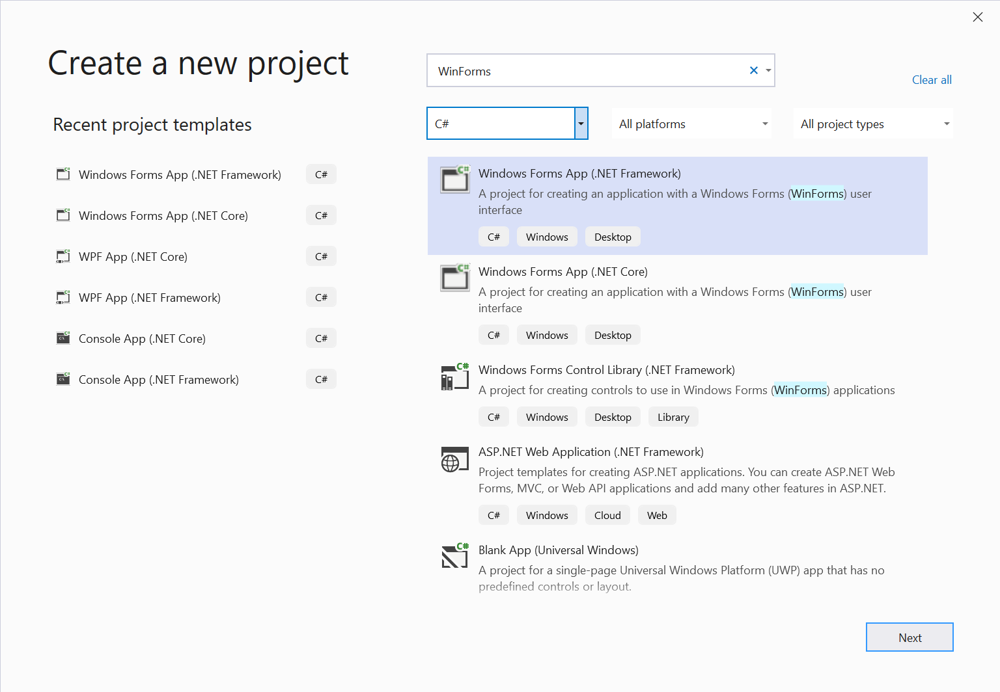
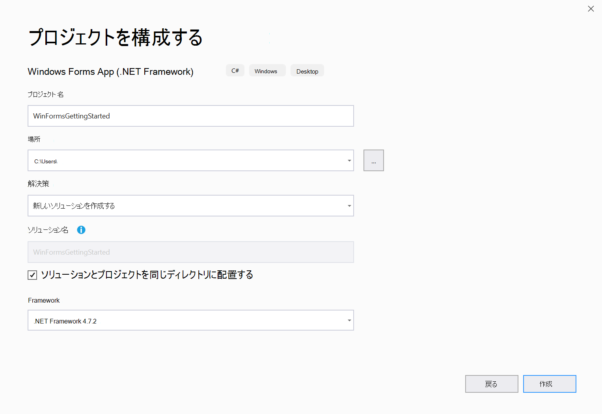
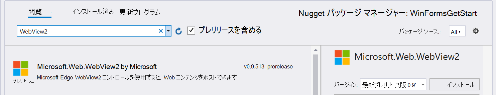
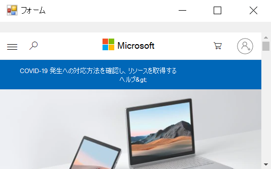
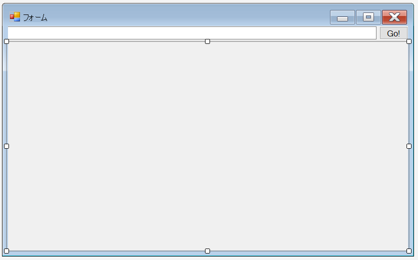
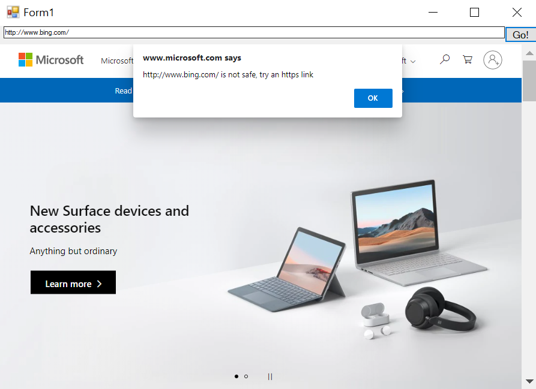
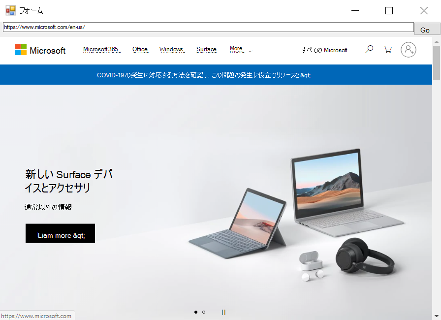

# Windows フォームでの WebView2 の概要 (プレビュー)  

この記事では、初めての WebView2 アプリの作成を開始し、 [WebView2 (preview)](/microsoft-edge/webview2/index)の主な機能について説明します。  個々の Api について詳しくは、 [api リファレンス](/dotnet/api/microsoft.web.webview2.winforms)をご覧ください。  

## 前提条件  

続行する前に、次の前提条件の一覧をインストールしていることを確認します。  

* [Microsoft Edge (Chromium) カナリアチャネル](https://www.microsoftedgeinsider.com/download) は、windows 10、windows 8.1、または windows 7 にインストールされています。 
* [Visual Studio](https://visualstudio.microsoft.com) 2017 以降。

> [!NOTE]
> 現時点では、WebView2 は .NET Core 3.0 の [デザイナー (preview)](https://visualstudio.microsoft.com/vs/preview)をサポートしていません。

## 手順 1-1 つのウィンドウアプリケーションを作成する

1つのメインウィンドウを含む基本的なデスクトッププロジェクトから始めます。  

1. **Visual Studio を開きます。**

1. [ **Windows Forms .Net Framework アプリ** ] を選び、[ **次へ**] を選びます。

    

1. **プロジェクト名**と**場所**の値を入力します。  **.Net Framework 4.6.2**以降を選択します。  

    

1. プロジェクトを作成するには、[ **作成** ] を選びます。

## 手順 2-WebView2 SDK をインストールする

次に、WebView2 SDK をプロジェクトに追加します。  プレビューでは、Nuget を使用して WebView2 SDK をインストールします。  

1. プロジェクトのコンテキストメニューを開き (\ [\] を右クリックし)、[ **NuGet パッケージの管理**] を選択します。  

    :::image type="complex" source="./media/wpf-gettingstarted-mngnuget.png" alt-text="NuGet パッケージを管理する":::
       NuGet パッケージを管理する :::image-end:::

1. `Microsoft.Web.WebView2`検索バーに入力します。  検索結果から **WebView2** を選びます。  

    > [!IMPORTANT]
    > [ **プレリリースを含める**] をオンにして、 **バージョン**でプレリリースパッケージを選択し、[ **インストール**] を選択します。  

    

WebView2 API を使用したアプリケーションの開発を開始するように設定されています。  `F5`プロジェクトをビルドして実行する場合に選択します。  実行中のプロジェクトに空のウィンドウが表示されます。  


## 手順 3-1 つの WebView を作成する  

次に、アプリケーションに WebView を追加します。  

1. **Windows フォームデザイナー**を開きます。  
1. **ツールボックス**で**WebView2**を検索します。 **WebView2**コントロールを Windows フォームアプリにドラッグアンドドロップします。
    
    :::image type="complex" source="./media/winforms-toolbox.png" alt-text="NuGet パッケージを管理する":::
       WebView2 が表示されたツールボックス :::image-end:::  

1. `Name`プロパティをに変更 `webView` します。
    
    :::image type="complex" source="./media/winforms-properties.png" alt-text="NuGet パッケージを管理する":::
       WebView2 コントロールのプロパティ :::image-end:::

1. この `Source` プロパティは、WebView2 コントロールに表示される初期 URI を設定します。 Source プロパティをに設定します。 <https://www.microsoft.com>
    
    :::image type="complex" source="./media/winforms-source.png" alt-text="NuGet パッケージを管理する":::
       WebView2 コントロールの Source プロパティ :::image-end:::

`F5`プロジェクトをビルドして実行する場合に選択します。  WebView2 コントロールが表示されていることを確認 [https://www.microsoft.com](https://www.microsoft.com) します。



> [!NOTE]
> 高 DPI モニターで作業している場合は、 [高 dpi サポートのために Windows フォームアプリを構成](/dotnet/framework/winforms/high-dpi-support-in-windows-forms#configuring-your-windows-forms-app-for-high-dpi-support)することが必要な場合があります。

## 手順 4-ウィンドウのサイズ変更イベントを処理する

ツールボックスからさらにいくつかのコントロールを追加し、ウィンドウのサイズ変更イベントを適切に処理します。

1. **Windows フォームデザイナー**で、**ツールボックス**を開きます。
1. **TextBox**を Windows フォームアプリにドラッグアンドドロップします。 [ **TextBox** `addressBar` **プロパティ] タブ**で、テキストボックスに名前を指定します。
1. **ボタン**をドラッグして、Windows フォームアプリにドロップします。 [ **Button** `Go!` **Button** `goButton` **プロパティ] タブ**で、ボタンのテキストを変更し、ボタンに名前を指定します。

    このアプリは、デザイナーで次のようになります。
    
    

1. **Form1.cs**では、 `Form_Resize` アプリのウィンドウのサイズが変更されたときに、コントロールを配置したままにします。

```csharp
public Form1()
{
    InitializeComponent();
    this.Resize += new System.EventHandler(this.Form_Resize);
}

private void Form_Resize(object sender, EventArgs e)
{
    webView.Size = this.ClientSize - new System.Drawing.Size(webView.Location);
    goButton.Left = this.ClientSize.Width - goButton.Width;
    addressBar.Width = goButton.Left - addressBar.Left;
}
```

`F5`プロジェクトをビルドして実行する場合に選択します。  アプリが次のスクリーンショットのように表示されることを確認します。


## ステップ 5-ナビゲーション

WebView2 コントロールに表示される URL をユーザーが変更できるようにする機能を追加するには、アドレスバーをアプリに追加します。

1. 「 `Form1.cs` 名前空間を追加する」 `CoreWebView2` の先頭に、次のコードスニペットを挿入し `Form1.cs` ます。  

    ```csharp
    using Microsoft.Web.WebView2.Core;
    ```

1. **Windows Forms Designer**で、ボタンをダブルクリックして `Go!` メソッドを作成 `goButton_Click` `Form1.cs` します。 関数内で次のスニペットをコピーして貼り付けます。 これで、この関数は、 `goButton_Click` アドレスバーに入力された URL に WebView を移動します。

    ```csharp
    private void goButton_Click(object sender, EventArgs e)
    {
        if (webView != null && webView.CoreWebView2 != null)
        {
            webView.CoreWebView2.Navigate(addressBar.Text);
        }
    }
    ```  

`F5`プロジェクトをビルドして実行する場合に選択します。  アドレスバーに新しい URL を入力し、[設定] **をクリックし**ます。  たとえば、と入力 `https://www.bing.com` します。  WebView2 コントロールが URL に移動することを確認します。  

> [!NOTE]
> アドレスバーに完全な URL が入力されていることを確認します。 `ArgumentException`URL が先頭以外の場合、 `http://` または `https://`


## ステップ 6-ナビゲーションイベント  

WebView2 コントロールをホストするアプリケーションは、web ページへのナビゲーション中に WebView2 コントロールによって発生する次のイベントをリッスンします。  

* `NavigationStarting`  
* `SourceChanged`  
* `ContentLoading`  
* `HistoryChanged`  
* `NavigationCompleted`  

詳細については、「 [ナビゲーションイベント](../concepts/navigation-events.md)」を参照してください。  

:::image type="complex" source="../media/navigation-events.png" alt-text="NuGet パッケージを管理する":::
   ナビゲーションイベント
:::image-end:::

エラーが発生した場合、次のイベントが発生し、エラーページへの移動に依存することがあります。  

* `SourceChanged`  
* `ContentLoading`  
* `HistoryChanged`  

HTTP リダイレクトがある場合は、複数のイベントがあり `NavigationStarting` ます。  

これらのイベントの使い方を示すには、HTTPS を使って `NavigationStarting` いない要求をキャンセルするためのハンドラーを登録します。  

で `Form1.cs` 、次に示すようにコンストラクターを変更し、関数を追加し `EnsureHttps` ます。  

```csharp
public Form1()
{
    InitializeComponent();
    this.Resize += new System.EventHandler(this.Form_Resize);

    webView.NavigationStarting += EnsureHttps;
}

void EnsureHttps(object sender, CoreWebView2NavigationStartingEventArgs args)
{
    String uri = args.Uri;
    if (!uri.StartsWith("https://"))
    {
        args.Cancel = true;
    }
}
```

コンストラクターでは、EnsureHttps は、WebView2 コントロールのイベントのイベントハンドラーとして登録され `NavigationStarting` ます。  

`F5`プロジェクトをビルドして実行する場合に選択します。 HTTP サイトに移動するときに、WebView の表示が変わらないことを確認します。 ただし、WebView は HTTPS サイトに移動します。

## 手順 7-スクリプト  

ホストアプリケーションを使って、実行時に WebView2 コントロールに JavaScript コードを挿入することができます。  挿入された JavaScript は、JavaScript が削除されるまで、すべての新しい最上位レベルのドキュメントとすべての子フレームに適用されます。  挿入された JavaScript は、グローバルオブジェクトの作成後、および HTML ドキュメントに含まれている他のスクリプトが実行される前に実行されます。  

スクリプトを使用して、HTTPS 以外のサイトに移動したときにユーザーに通知することができます。  `EnsureHttps` [Executesの]()メソッドを使って、スクリプトが web コンテンツに挿入されるように関数を変更します。  

```csharp
void EnsureHttps(object sender, CoreWebView2NavigationStartingEventArgs args)
{
    String uri = args.Uri;
    if (!uri.StartsWith("https://"))
    {
        webView.CoreWebView2.ExecuteScriptAsync($"alert('{uri} is not safe, try an https link')");
        args.Cancel = true;
    }
}
```  

`F5`プロジェクトをビルドして実行する場合に選択します。  HTTPS を使用していないサイトに移動したときに、アプリケーションにアラートが表示されることを確認します。  



## 手順 8-ホストと web コンテンツ間の通信  

ホストと web コンテンツは、次の方法で相互に通信でき `postMessage` ます。  

* WebView2 コントロールの Web コンテンツは、を使ってホストにメッセージを投稿でき `window.chrome.webview.postMessage` ます。  ホストは、ホストに登録されているメッセージを処理し `WebMessageReceived` ます。  
* ホストは、またはを使用して WebView2 コントロールの web コンテンツにメッセージを投稿し `CoreWebView2.PostWebMessageAsString` `CoreWebView2.PostWebMessageAsJSON` ます。  これらのメッセージは、ハンドラーが追加されることによって検出され `window.chrome.webview.addEventListener` ます。  

この通信メカニズムにより、web コンテンツはネイティブ機能を使ってホストにメッセージを渡すことができます。  

プロジェクトでは、WebView2 コントロールが URL に移動すると、アドレスバーに URL が表示され、WebView2 コントロールに表示される URL のユーザーに警告が表示されます。  

1. **Form1.cs**で、 `InitializeAsync` 次のコードスニペットに示すように、コンストラクターを更新し、関数を作成します。  `InitializeAsync`の初期化は非同期であるため、この関数は[EnsureCoreWebView2Async]()を待機し `CoreWebView2` ます。  

    ```csharp
    public Form1()
    {
        InitializeComponent();
        this.Resize += new System.EventHandler(this.Form_Resize);
        webView.NavigationStarting += EnsureHttps;
        InitializeAsync();
    }

    async void InitializeAsync()
    {
        await webView.EnsureCoreWebView2Async(null);
    }
    ```  

1. **CoreWebView2**が初期化されたら、イベントハンドラーを登録して応答 `WebMessageReceived` します。  [ `Form1.cs` 更新] と [追加] で `InitializeAsync` `UpdateAddressBar` 、次のコードスニペットを使用します。  

    ```csharp
    async void InitializeAsync()
    {
        await webView.EnsureCoreWebView2Async(null);
        webView.CoreWebView2.WebMessageReceived += UpdateAddressBar;
    }

    void UpdateAddressBar(object sender, CoreWebView2WebMessageReceivedEventArgs args)
    {
        String uri = args.TryGetWebMessageAsString();
        addressBar.Text = uri;
        webView.CoreWebView2.PostWebMessageAsString(uri);
    }
    ```  

1. WebView が web メッセージを送信して応答するためには、が初期化された後、 `CoreWebView2` 次のように、ホストが web コンテンツにスクリプトを挿入します。  

    1. を使って、ホストに URL を送信し `postMessage` ます。
    1. イベントハンドラーを登録して、ホストから送信されたメッセージを出力します。  

`Form1.cs` `InitializeAsync` 次のコードスニペットに示すように、を更新します。  

```csharp
async void InitializeAsync()
{
    await webView.EnsureCoreWebView2Async(null);
    webView.CoreWebView2.WebMessageReceived += UpdateAddressBar;

    await webView.CoreWebView2.AddScriptToExecuteOnDocumentCreatedAsync("window.chrome.webview.postMessage(window.document.URL);");
    await webView.CoreWebView2.AddScriptToExecuteOnDocumentCreatedAsync("window.chrome.webview.addEventListener(\'message\', event => alert(event.data));");
}
```  

`F5`アプリをビルドして実行することを選択します。  アドレスバーに、WebView に表示されているサイトの URL が表示されていることを確認します。 また、新しい URL に正常に移動すると、webview に表示された URL のユーザーに対して WebView が通知されます。  



おめでとうございます。最初の WebView2 アプリを作成しました。  

## 次のステップ 

* WebView2's 機能の包括的な例については、 [WebView2Samples リポジトリ](https://github.com/MicrosoftEdge/WebView2Samples) をチェックアウトする
* Api についての詳細情報を参照するための[api 参照](/dotnet/api/microsoft.web.webview2.winforms.webview2)
* WebView2 の詳細については、 [WebView2 のリソース](../index.md#next-steps) の一覧をチェックアウトする


## Microsoft Edge WebView チームと連絡を取り合う  

[!INCLUDE [contact WebView team note](../includes/contact-webview-team-note.md)]  
