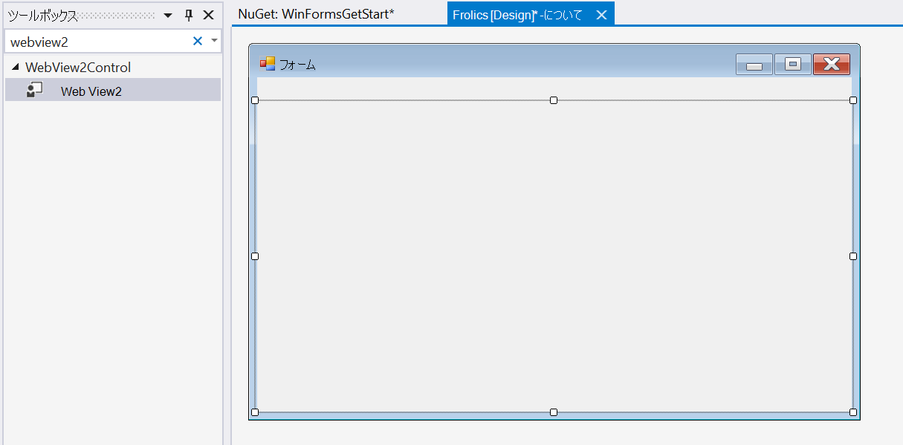
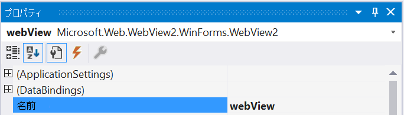
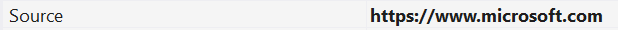

# <span data-ttu-id="5c59c-104">Windows Forms アプリでの WebView2 の概要 (プレビュー)</span><span class="sxs-lookup"><span data-stu-id="5c59c-104">Getting Started with WebView2 in Windows Forms apps (Preview)</span></span>  

<span data-ttu-id="5c59c-105">この記事では、初めての WebView2 アプリの作成を開始し、 [WebView2 (preview)](/microsoft-edge/hosting/webview2/index)の主な機能について説明します。</span><span class="sxs-lookup"><span data-stu-id="5c59c-105">In this article, get started creating your first WebView2 app and learn about the main features of [WebView2 (preview)](/microsoft-edge/hosting/webview2/index).</span></span>  <span data-ttu-id="5c59c-106">個々の Api について詳しくは、 [api リファレンス](../reference/dotnet/0-9-515-reference-webview2.md)をご覧ください。</span><span class="sxs-lookup"><span data-stu-id="5c59c-106">For more information on individual APIs, see [API reference](../reference/dotnet/0-9-515-reference-webview2.md).</span></span>  

## <span data-ttu-id="5c59c-107">前提条件</span><span class="sxs-lookup"><span data-stu-id="5c59c-107">Prerequisites</span></span>  

<span data-ttu-id="5c59c-108">続行する前に、次の前提条件の一覧をインストールしていることを確認します。</span><span class="sxs-lookup"><span data-stu-id="5c59c-108">Ensure you installed the following list of pre-requisites before proceeding:</span></span>  

* <span data-ttu-id="5c59c-109">[Microsoft Edge (Chromium) カナリアチャネル](https://www.microsoftedgeinsider.com/download/)は、windows 10、windows 8.1、または windows 7 にインストールされています。</span><span class="sxs-lookup"><span data-stu-id="5c59c-109">[Microsoft Edge (Chromium) Canary channel](https://www.microsoftedgeinsider.com/download/) installed on Windows 10, Windows 8.1, or Windows 7.</span></span> 
* <span data-ttu-id="5c59c-110">[Visual Studio](https://visualstudio.microsoft.com/) 2015 以降。</span><span class="sxs-lookup"><span data-stu-id="5c59c-110">[Visual Studio](https://visualstudio.microsoft.com/) 2015 or later.</span></span>

> [!NOTE]
> <span data-ttu-id="5c59c-111">**Windows Forms .Net Core 3.0 または .net 5**で開発している場合は、 [Visual Studio (Preview)](https://visualstudio.microsoft.com/vs/preview/)をダウンロードします。</span><span class="sxs-lookup"><span data-stu-id="5c59c-111">If developing with **Windows Forms .NET Core 3.0 or .NET 5**, download [Visual Studio (Preview)](https://visualstudio.microsoft.com/vs/preview/)</span></span>

## <span data-ttu-id="5c59c-112">手順 1-1 つのウィンドウアプリケーションを作成する</span><span class="sxs-lookup"><span data-stu-id="5c59c-112">Step 1 - Create a single window application</span></span>

<span data-ttu-id="5c59c-113">1つのメインウィンドウを含む基本的なデスクトッププロジェクトから始めます。</span><span class="sxs-lookup"><span data-stu-id="5c59c-113">Start with a basic desktop project containing a single main window.</span></span>  

1. <span data-ttu-id="5c59c-114">**Visual Studio を開きます。**</span><span class="sxs-lookup"><span data-stu-id="5c59c-114">Open **Visual Studio.**</span></span>

2. <span data-ttu-id="5c59c-115">**Windows forms .Net Framework アプリ**または**Windows Forms .net Core アプリ**を選択し、[**次へ**] を選択します。</span><span class="sxs-lookup"><span data-stu-id="5c59c-115">Choose **Windows Forms .NET Framework App** or **Windows Forms .NET Core App**, and then choose **Next**.</span></span>

    

3. <span data-ttu-id="5c59c-117">**プロジェクト名**と**場所**の値を入力します。</span><span class="sxs-lookup"><span data-stu-id="5c59c-117">Enter values for **Project name** and **Location**.</span></span>  <span data-ttu-id="5c59c-118">**.Net Framework 4.6.2**以降、または **.net Core 3.0**以降を選択します。</span><span class="sxs-lookup"><span data-stu-id="5c59c-118">Select **.NET Framework 4.6.2** or later, or **.NET Core 3.0** or later.</span></span>  

    

4. <span data-ttu-id="5c59c-120">プロジェクトを作成するには、[**作成**] を選びます。</span><span class="sxs-lookup"><span data-stu-id="5c59c-120">Choose **Create** to create your project.</span></span>

## <span data-ttu-id="5c59c-121">手順 2-WebView2 SDK をインストールする</span><span class="sxs-lookup"><span data-stu-id="5c59c-121">Step 2 - Install WebView2 SDK</span></span>

<span data-ttu-id="5c59c-122">次に、WebView2 SDK をプロジェクトに追加します。</span><span class="sxs-lookup"><span data-stu-id="5c59c-122">Next add the WebView2 SDK to the project.</span></span>  <span data-ttu-id="5c59c-123">プレビューでは、Nuget を使用して WebView2 SDK をインストールします。</span><span class="sxs-lookup"><span data-stu-id="5c59c-123">For the preview, install the WebView2 SDK using Nuget.</span></span>  

1. <span data-ttu-id="5c59c-124">プロジェクトのコンテキストメニューを開き (\ [\] を右クリックし)、[ **NuGet パッケージの管理**] を選択します。</span><span class="sxs-lookup"><span data-stu-id="5c59c-124">Open the context menu on the project \(right-click\), and choose **Manage NuGet Packages...**.</span></span>  

    :::image type="complex" source="./media/wpf-gettingstarted-mngnuget.png" alt-text="Nuget.exe":::
       <span data-ttu-id="5c59c-126">Nuget.exe</span><span class="sxs-lookup"><span data-stu-id="5c59c-126">Nuget</span></span> :::image-end:::

2. <span data-ttu-id="5c59c-127">`Microsoft.Web.WebView2`検索バーに入力します。</span><span class="sxs-lookup"><span data-stu-id="5c59c-127">Enter `Microsoft.Web.WebView2` in the search bar.</span></span>  <span data-ttu-id="5c59c-128">検索結果から**WebView2**を選びます。</span><span class="sxs-lookup"><span data-stu-id="5c59c-128">Choose **Microsoft.Web.WebView2** from the search results.</span></span>  <span data-ttu-id="5c59c-129">パッケージバージョンを**プレリリース**に設定して、[**インストール**] を選択します。</span><span class="sxs-lookup"><span data-stu-id="5c59c-129">Set the package version to **pre-release**, and then choose **Install**.</span></span>  

    

<span data-ttu-id="5c59c-131">WebView2 API を使用したアプリケーションの開発を開始するように設定されています。</span><span class="sxs-lookup"><span data-stu-id="5c59c-131">You are all set to start developing applications using the WebView2 API.</span></span>  <span data-ttu-id="5c59c-132">`F5`プロジェクトをビルドして実行する場合に選択します。</span><span class="sxs-lookup"><span data-stu-id="5c59c-132">Select `F5` to build and run the project.</span></span>  <span data-ttu-id="5c59c-133">実行中のプロジェクトに空のウィンドウが表示されます。</span><span class="sxs-lookup"><span data-stu-id="5c59c-133">The running project displays an empty window.</span></span>  


## <span data-ttu-id="5c59c-135">手順 3-1 つの WebView を作成する</span><span class="sxs-lookup"><span data-stu-id="5c59c-135">Step 3 - Create a single WebView</span></span>  

<span data-ttu-id="5c59c-136">次に、アプリケーションに WebView を追加します。</span><span class="sxs-lookup"><span data-stu-id="5c59c-136">Next add a WebView to your application.</span></span>  

1. <span data-ttu-id="5c59c-137">**Windows フォームデザイナー**を開きます。</span><span class="sxs-lookup"><span data-stu-id="5c59c-137">Open the **Windows Forms Designer**.</span></span>  
2. <span data-ttu-id="5c59c-138">**ツールボックス**で**WebView2**を検索します。</span><span class="sxs-lookup"><span data-stu-id="5c59c-138">Search for **WebView2** in the **Toolbox**.</span></span> <span data-ttu-id="5c59c-139">**WebView2**コントロールを Windows フォームアプリにドラッグアンドドロップする</span><span class="sxs-lookup"><span data-stu-id="5c59c-139">Drag and drop the **WebView2** control into the Windows Forms App</span></span>

    

3. <span data-ttu-id="5c59c-141">`Name`プロパティをに変更 `webView` します。</span><span class="sxs-lookup"><span data-stu-id="5c59c-141">Change the `Name` property to `webView`.</span></span>

    

4. <span data-ttu-id="5c59c-143">この `Source` プロパティは、WebView2 コントロールに表示される初期 URI を設定します。</span><span class="sxs-lookup"><span data-stu-id="5c59c-143">The `Source` property sets the initial URI displayed in the WebView2 control.</span></span> <span data-ttu-id="5c59c-144">Source プロパティをに設定します。</span><span class="sxs-lookup"><span data-stu-id="5c59c-144">Set the Source property to</span></span> <https://www.microsoft.com>

    

<span data-ttu-id="5c59c-146">`F5`プロジェクトをビルドして実行する場合に選択します。</span><span class="sxs-lookup"><span data-stu-id="5c59c-146">Select `F5` to build and run your project.</span></span>  <span data-ttu-id="5c59c-147">WebView2 コントロールが表示されていることを確認 [https://www.microsoft.com](https://www.microsoft.com) します。</span><span class="sxs-lookup"><span data-stu-id="5c59c-147">Confirm that your WebView2 control displays [https://www.microsoft.com](https://www.microsoft.com).</span></span>


> [!NOTE]
> <span data-ttu-id="5c59c-149">高 DPI モニターで作業している場合は、[高 dpi サポートのために Windows フォームアプリを構成](https://docs.microsoft.com/dotnet/framework/winforms/high-dpi-support-in-windows-forms#configuring-your-windows-forms-app-for-high-dpi-support)することが必要な場合があります。</span><span class="sxs-lookup"><span data-stu-id="5c59c-149">If you are working on a high DPI monitor, you may have to [configure your Windows Forms app for high DPI support](https://docs.microsoft.com/dotnet/framework/winforms/high-dpi-support-in-windows-forms#configuring-your-windows-forms-app-for-high-dpi-support).</span></span>

## <span data-ttu-id="5c59c-150">手順 4-ウィンドウのサイズ変更イベントを処理する</span><span class="sxs-lookup"><span data-stu-id="5c59c-150">Step 4 - Handle Window Resize Events</span></span>

<span data-ttu-id="5c59c-151">ツールボックスからさらにいくつかのコントロールを追加し、ウィンドウのサイズ変更イベントを適切に処理します。</span><span class="sxs-lookup"><span data-stu-id="5c59c-151">Add a few more controls to your Windows Forms from the toolbox, and then handle window resize events appropriately.</span></span>

1. <span data-ttu-id="5c59c-152">**Windows フォームデザイナー**で、**ツールボックス**を開きます。</span><span class="sxs-lookup"><span data-stu-id="5c59c-152">In the **Windows Forms Designer** open the **Toolbox**</span></span>
2. <span data-ttu-id="5c59c-153">**TextBox**を Windows フォームアプリにドラッグアンドドロップします。</span><span class="sxs-lookup"><span data-stu-id="5c59c-153">Drag and Drop a **TextBox** into the Windows Forms App.</span></span> <span data-ttu-id="5c59c-154">[ **TextBox** `addressBar` **プロパティ] タブ**で、テキストボックスに名前を指定します。</span><span class="sxs-lookup"><span data-stu-id="5c59c-154">Name the **TextBox** `addressBar` in the **Properties Tab**.</span></span>
3. <span data-ttu-id="5c59c-155">**ボタン**をドラッグして、Windows フォームアプリにドロップします。</span><span class="sxs-lookup"><span data-stu-id="5c59c-155">Drag and Drop a **Button** into the Windows Forms App.</span></span> <span data-ttu-id="5c59c-156">[ **Button** `Go!` **Button** `goButton` **プロパティ] タブ**で、ボタンのテキストを変更し、ボタンに名前を指定します。</span><span class="sxs-lookup"><span data-stu-id="5c59c-156">Change the text in the **Button** to `Go!` and name the **Button** `goButton` in the **Properties Tab**.</span></span>

<span data-ttu-id="5c59c-157">このアプリは、デザイナーで次のようになります。</span><span class="sxs-lookup"><span data-stu-id="5c59c-157">The app should look like the following in the designer:</span></span>


4. <span data-ttu-id="5c59c-159">**Form1.cs**では、 `Form_Resize` アプリのウィンドウのサイズが変更されたときに、コントロールを配置したままにします。</span><span class="sxs-lookup"><span data-stu-id="5c59c-159">In **Form1.cs** define `Form_Resize` to keep the controls in place when the App Window is resized.</span></span>

```csharp
public Form1()
{
    InitializeComponent();
    this.Resize += new System.EventHandler(this.Form_Resize);
}

private void Form_Resize(object sender, EventArgs e)
{
    webView.Size = this.ClientSize - new System.Drawing.Size(webView.Location);
    goButton.Left = this.ClientSize.Width - goButton.Width;
    addressBar.Width = goButton.Left - addressBar.Left;
}
```

<span data-ttu-id="5c59c-160">`F5`プロジェクトをビルドして実行する場合に選択します。</span><span class="sxs-lookup"><span data-stu-id="5c59c-160">Select `F5` to build and run your project.</span></span>  <span data-ttu-id="5c59c-161">アプリが次のスクリーンショットのように表示されることを確認します。</span><span class="sxs-lookup"><span data-stu-id="5c59c-161">Confirm that the app displays similar to the following screenshot.</span></span>


## <span data-ttu-id="5c59c-163">ステップ 5-ナビゲーション</span><span class="sxs-lookup"><span data-stu-id="5c59c-163">Step 5 - Navigation</span></span>

<span data-ttu-id="5c59c-164">WebView2 コントロールに表示される URL をユーザーが変更できるようにする機能を追加するには、アドレスバーをアプリに追加します。</span><span class="sxs-lookup"><span data-stu-id="5c59c-164">Add the ability to allow users to change the URL that the WebView2 control displays by adding an address bar to the app.</span></span>

1. <span data-ttu-id="5c59c-165">「 `Form1.cs` 名前空間を追加する」 `CoreWebView2` の先頭に、次のコードスニペットを挿入し `Form1.cs` ます。</span><span class="sxs-lookup"><span data-stu-id="5c59c-165">In `Form1.cs` add the `CoreWebView2` namespace by inserting the following code snippet at the top of `Form1.cs`.</span></span>  

    ```csharp
    using Microsoft.Web.WebView2.Core;
    ```

2. <span data-ttu-id="5c59c-166">**Windows Forms Designer**で、ボタンをダブルクリックして `Go!` メソッドを作成 `goButton_Click` `Form1.cs` します。</span><span class="sxs-lookup"><span data-stu-id="5c59c-166">In the **Windows Forms Designer**, double-click on the `Go!` button to create the `goButton_Click` method in `Form1.cs`.</span></span> <span data-ttu-id="5c59c-167">関数内で次のスニペットをコピーして貼り付けます。</span><span class="sxs-lookup"><span data-stu-id="5c59c-167">Copy and paste the following snippet inside the function.</span></span> <span data-ttu-id="5c59c-168">これで、この関数は、 `goButton_Click` アドレスバーに入力された URL に WebView を移動します。</span><span class="sxs-lookup"><span data-stu-id="5c59c-168">Now, the `goButton_Click` function navigates the WebView to the URL entered in the address bar.</span></span>

    ```csharp
    private void goButton_Click(object sender, EventArgs e)
    {
        if (webView != null && webView.CoreWebView2 != null)
        {
            webView.CoreWebView2.Navigate(addressBar.Text);
        }
    }
    ```  

<span data-ttu-id="5c59c-169">`F5`プロジェクトをビルドして実行する場合に選択します。</span><span class="sxs-lookup"><span data-stu-id="5c59c-169">Select `F5` to build and run your project.</span></span>  <span data-ttu-id="5c59c-170">アドレスバーに新しい URL を入力し、[設定]**をクリックし**ます。</span><span class="sxs-lookup"><span data-stu-id="5c59c-170">Enter a new URL in the address bar, and click **Go**.</span></span>  <span data-ttu-id="5c59c-171">たとえば、と入力 `https://www.bing.com` します。</span><span class="sxs-lookup"><span data-stu-id="5c59c-171">For example, enter `https://www.bing.com`.</span></span>  <span data-ttu-id="5c59c-172">WebView2 コントロールが URL に移動することを確認します。</span><span class="sxs-lookup"><span data-stu-id="5c59c-172">Confirm that the WebView2 control navigates to the URL.</span></span>  

> [!NOTE]
> <span data-ttu-id="5c59c-173">アドレスバーに完全な URL が入力されていることを確認します。</span><span class="sxs-lookup"><span data-stu-id="5c59c-173">Ensure a complete URL is entered in the address bar.</span></span> <span data-ttu-id="5c59c-174">`ArgumentException`URL が先頭以外の場合、 `http://` または</span><span class="sxs-lookup"><span data-stu-id="5c59c-174">An `ArgumentException` is thrown if the URL does not start with `http://` or</span></span> `https://`


## <span data-ttu-id="5c59c-176">ステップ 6-ナビゲーションイベント</span><span class="sxs-lookup"><span data-stu-id="5c59c-176">Step 6 - Navigation events</span></span>  

<span data-ttu-id="5c59c-177">WebView2 コントロールをホストするアプリケーションは、web ページへのナビゲーション中に WebView2 コントロールによって発生する次のイベントをリッスンします。</span><span class="sxs-lookup"><span data-stu-id="5c59c-177">The application that hosts WebView2 controls listens to the following events that are raised by the WebView2 control during navigation to web pages.</span></span>  

* `NavigationStarting`  
* `SourceChanged`  
* `ContentLoading`  
* `HistoryChanged`  
* `NavigationCompleted`  

<span data-ttu-id="5c59c-178">詳細については、「[ナビゲーションイベント](../reference/win32/0-9-488/icorewebview2.md#navigation-events)」を参照してください。</span><span class="sxs-lookup"><span data-stu-id="5c59c-178">For more information, see [Navigation Events](../reference/win32/0-9-488/icorewebview2.md#navigation-events).</span></span>  

:::image type="complex" source="../media/navigation-events.png" alt-text="ナビゲーションイベント":::
   <span data-ttu-id="5c59c-180">ナビゲーションイベント</span><span class="sxs-lookup"><span data-stu-id="5c59c-180">Navigation events</span></span>
:::image-end:::

<span data-ttu-id="5c59c-181">エラーが発生した場合、次のイベントが発生し、エラーページへの移動に依存することがあります。</span><span class="sxs-lookup"><span data-stu-id="5c59c-181">When an error occurs, the following events are raised and may depend on navigation to an error page.</span></span>  

* `SourceChanged`  
* `ContentLoading`  
* `HistoryChanged`  

<span data-ttu-id="5c59c-182">HTTP リダイレクトがある場合は、複数のイベントがあり `NavigationStarting` ます。</span><span class="sxs-lookup"><span data-stu-id="5c59c-182">When there is an HTTP redirect, there are multiple `NavigationStarting` events.</span></span>  

<span data-ttu-id="5c59c-183">これらのイベントの使い方を示すには、HTTPS を使って `NavigationStarting` いない要求をキャンセルするためのハンドラーを登録します。</span><span class="sxs-lookup"><span data-stu-id="5c59c-183">To demonstrate how to use these events, start by registering a handler for `NavigationStarting` that cancels any requests that do not use HTTPS.</span></span>  

<span data-ttu-id="5c59c-184">で `Form1.cs` 、次に示すようにコンストラクターを変更し、関数を追加し `EnsureHttps` ます。</span><span class="sxs-lookup"><span data-stu-id="5c59c-184">In `Form1.cs`, modify the constructor as shown below and add the `EnsureHttps` function.</span></span>  

```csharp
public Form1()
{
    InitializeComponent();
    this.Resize += new System.EventHandler(this.Form_Resize);

    webView.NavigationStarting += EnsureHttps;
}

void EnsureHttps(object sender, CoreWebView2NavigationStartingEventArgs args)
{
    String uri = args.Uri;
    if (!uri.StartsWith("https://"))
    {
        args.Cancel = true;
    }
}
```

<span data-ttu-id="5c59c-185">コンストラクターでは、EnsureHttps は、WebView2 コントロールのイベントのイベントハンドラーとして登録され `NavigationStarting` ます。</span><span class="sxs-lookup"><span data-stu-id="5c59c-185">In the constructor, EnsureHttps is registered as the event handler on the `NavigationStarting` event on the WebView2 control.</span></span>  

<span data-ttu-id="5c59c-186">`F5`プロジェクトをビルドして実行する場合に選択します。</span><span class="sxs-lookup"><span data-stu-id="5c59c-186">Select `F5` to build and run your project.</span></span> <span data-ttu-id="5c59c-187">HTTP サイトに移動するときに、WebView の表示が変わらないことを確認します。</span><span class="sxs-lookup"><span data-stu-id="5c59c-187">Confirm that when navigating to an HTTP site, the WebView remains unchanged.</span></span> <span data-ttu-id="5c59c-188">ただし、WebView は HTTPS サイトに移動します。</span><span class="sxs-lookup"><span data-stu-id="5c59c-188">However, the WebView will navigate to HTTPS sites.</span></span>

## <span data-ttu-id="5c59c-189">手順 7-スクリプト</span><span class="sxs-lookup"><span data-stu-id="5c59c-189">Step 7 - Scripting</span></span>  

<span data-ttu-id="5c59c-190">ホストアプリケーションを使って、実行時に WebView2 コントロールに JavaScript コードを挿入することができます。</span><span class="sxs-lookup"><span data-stu-id="5c59c-190">You may use host applications to inject JavaScript code into WebView2 controls at runtime.</span></span>  <span data-ttu-id="5c59c-191">挿入された JavaScript は、JavaScript が削除されるまで、すべての新しい最上位レベルのドキュメントとすべての子フレームに適用されます。</span><span class="sxs-lookup"><span data-stu-id="5c59c-191">The injected JavaScript applies to all new top level documents and any child frames until the JavaScript is removed.</span></span>  <span data-ttu-id="5c59c-192">挿入された JavaScript は、グローバルオブジェクトの作成後、および HTML ドキュメントに含まれている他のスクリプトが実行される前に実行されます。</span><span class="sxs-lookup"><span data-stu-id="5c59c-192">The injected JavaScript is run after creation of the global object, and before any other script included in the HTML document is run.</span></span>  

<span data-ttu-id="5c59c-193">スクリプトを使用して、HTTPS 以外のサイトに移動したときにユーザーに通知することができます。</span><span class="sxs-lookup"><span data-stu-id="5c59c-193">You can use scripting to alert the user when navigating to a non-HTTPS site.</span></span>  <span data-ttu-id="5c59c-194">`EnsureHttps` [Executesの]()メソッドを使って、スクリプトが web コンテンツに挿入されるように関数を変更します。</span><span class="sxs-lookup"><span data-stu-id="5c59c-194">Modify the `EnsureHttps` function so that it injects script into the web content using the [ExecuteScriptAsync]() method.</span></span>  

```csharp
void EnsureHttps(object sender, CoreWebView2NavigationStartingEventArgs args)
{
    String uri = args.Uri;
    if (!uri.StartsWith("https://"))
    {
        webView.CoreWebView2.ExecuteScriptAsync($"alert('{uri} is not safe, try an https link')");
        args.Cancel = true;
    }
}
```  

<span data-ttu-id="5c59c-195">`F5`プロジェクトをビルドして実行する場合に選択します。</span><span class="sxs-lookup"><span data-stu-id="5c59c-195">Select `F5` to build and run your project.</span></span>  <span data-ttu-id="5c59c-196">HTTPS を使用していないサイトに移動したときに、アプリケーションにアラートが表示されることを確認します。</span><span class="sxs-lookup"><span data-stu-id="5c59c-196">Confirm that the application displays an alert when you navigate to a site that does not use HTTPS.</span></span>  


## <span data-ttu-id="5c59c-198">手順 8-ホストと web コンテンツ間の通信</span><span class="sxs-lookup"><span data-stu-id="5c59c-198">Step 8 - Communication between host and web content</span></span>  

<span data-ttu-id="5c59c-199">ホストと web コンテンツは、次の方法で相互に通信でき `postMessage` ます。</span><span class="sxs-lookup"><span data-stu-id="5c59c-199">The host and web content may communicate with each other using `postMessage` as follows:</span></span>  

* <span data-ttu-id="5c59c-200">WebView2 コントロールの Web コンテンツは、を使ってホストにメッセージを投稿でき `window.chrome.webview.postMessage` ます。</span><span class="sxs-lookup"><span data-stu-id="5c59c-200">Web content in a WebView2 control may post a message to the host using `window.chrome.webview.postMessage`.</span></span>  <span data-ttu-id="5c59c-201">ホストは、ホストに登録されているメッセージを処理し `WebMessageReceived` ます。</span><span class="sxs-lookup"><span data-stu-id="5c59c-201">The host handles the message using any registered `WebMessageReceived` on the host.</span></span>  
* <span data-ttu-id="5c59c-202">ホストは、またはを使用して WebView2 コントロールの web コンテンツにメッセージを投稿し `CoreWebView2.PostWebMessageAsString` `CoreWebView2.PostWebMessageAsJSON` ます。</span><span class="sxs-lookup"><span data-stu-id="5c59c-202">Hosts post messages to web content in a WebView2 control using `CoreWebView2.PostWebMessageAsString` or `CoreWebView2.PostWebMessageAsJSON`.</span></span>  <span data-ttu-id="5c59c-203">これらのメッセージは、ハンドラーが追加されることによって検出され `window.chrome.webview.addEventListener` ます。</span><span class="sxs-lookup"><span data-stu-id="5c59c-203">These messages are caught by handlers added to `window.chrome.webview.addEventListener`.</span></span>  

<span data-ttu-id="5c59c-204">この通信メカニズムにより、web コンテンツはネイティブ機能を使ってホストにメッセージを渡すことができます。</span><span class="sxs-lookup"><span data-stu-id="5c59c-204">This communication mechanism allows web content to pass messages to the host using native capabilities.</span></span>  

<span data-ttu-id="5c59c-205">プロジェクトでは、WebView2 コントロールが URL に移動すると、アドレスバーに URL が表示され、WebView2 コントロールに表示される URL のユーザーに警告が表示されます。</span><span class="sxs-lookup"><span data-stu-id="5c59c-205">In your project, when the WebView2 control navigates to a URL, it displays the URL in the address bar and alerts the user of the URL displayed in the WebView2 control.</span></span>  

1. <span data-ttu-id="5c59c-206">**Form1.cs**で、 `InitializeAsync` 次のコードスニペットに示すように、コンストラクターを更新し、関数を作成します。</span><span class="sxs-lookup"><span data-stu-id="5c59c-206">In **Form1.cs**, update your constructor and create an `InitializeAsync` function as shown in the following code snippet.</span></span>  <span data-ttu-id="5c59c-207">`InitializeAsync`の初期化は非同期であるため、この関数は[EnsureCoreWebView2Async]()を待機し `CoreWebView2` ます。</span><span class="sxs-lookup"><span data-stu-id="5c59c-207">The `InitializeAsync` function awaits [EnsureCoreWebView2Async]() because the initialization of `CoreWebView2` is asynchronous.</span></span>  

    ```csharp
    public Form1()
    {
        InitializeComponent();
        this.Resize += new System.EventHandler(this.Form_Resize);
        webView.NavigationStarting += EnsureHttps;
        InitializeAsync();
    }

    async void InitializeAsync()
    {
        await webView.EnsureCoreWebView2Async(null);
    }
    ```  

2. <span data-ttu-id="5c59c-208">**CoreWebView2**が初期化されたら、イベントハンドラーを登録して応答 `WebMessageReceived` します。</span><span class="sxs-lookup"><span data-stu-id="5c59c-208">After **CoreWebView2** is initialized, register an event handler to respond to `WebMessageReceived`.</span></span>  <span data-ttu-id="5c59c-209">[ `Form1.cs` 更新] と [追加] で `InitializeAsync` `UpdateAddressBar` 、次のコードスニペットを使用します。</span><span class="sxs-lookup"><span data-stu-id="5c59c-209">In `Form1.cs` update `InitializeAsync` and add `UpdateAddressBar` using the following code snippet.</span></span>  

    ```csharp
    async void InitializeAsync()
    {
        await webView.EnsureCoreWebView2Async(null);
        webView.CoreWebView2.WebMessageReceived += UpdateAddressBar;
    }

    void UpdateAddressBar(object sender, CoreWebView2WebMessageReceivedEventArgs args)
    {
        String uri = args.TryGetWebMessageAsString();
        addressBar.Text = uri;
        webView.CoreWebView2.PostWebMessageAsString(uri);
    }
    ```  

3. <span data-ttu-id="5c59c-210">WebView が web メッセージを送信して応答するためには、が初期化された後、 `CoreWebView2` 次のように、ホストが web コンテンツにスクリプトを挿入します。</span><span class="sxs-lookup"><span data-stu-id="5c59c-210">In order for the WebView to send and respond to the web message, after `CoreWebView2` is initialized, the host injects a script in the web content to:</span></span>  

    1. <span data-ttu-id="5c59c-211">を使って、ホストに URL を送信し `postMessage` ます。</span><span class="sxs-lookup"><span data-stu-id="5c59c-211">Send the URL to the host using `postMessage`.</span></span>
    2. <span data-ttu-id="5c59c-212">イベントハンドラーを登録して、ホストから送信されたメッセージを出力します。</span><span class="sxs-lookup"><span data-stu-id="5c59c-212">Register an event handler to print a message sent from the host.</span></span>  

<span data-ttu-id="5c59c-213">`Form1.cs` `InitializeAsync` 次のコードスニペットに示すように、を更新します。</span><span class="sxs-lookup"><span data-stu-id="5c59c-213">In `Form1.cs`, update `InitializeAsync` as shown in the following code snippet.</span></span>  

```csharp
async void InitializeAsync()
{
    await webView.EnsureCoreWebView2Async(null);
    webView.CoreWebView2.WebMessageReceived += UpdateAddressBar;

    await webView.CoreWebView2.AddScriptToExecuteOnDocumentCreatedAsync("window.chrome.webview.postMessage(window.document.URL);");
    await webView.CoreWebView2.AddScriptToExecuteOnDocumentCreatedAsync("window.chrome.webview.addEventListener(\'message\', event => alert(event.data));");
}
```  

<span data-ttu-id="5c59c-214">`F5`アプリをビルドして実行することを選択します。</span><span class="sxs-lookup"><span data-stu-id="5c59c-214">Select `F5` to build and run the app.</span></span>  <span data-ttu-id="5c59c-215">アドレスバーに、WebView に表示されているサイトの URL が表示されていることを確認します。</span><span class="sxs-lookup"><span data-stu-id="5c59c-215">Confirm that the address bar displays the URL of the site displayed in the WebView.</span></span> <span data-ttu-id="5c59c-216">また、新しい URL に正常に移動すると、webview に表示された URL のユーザーに対して WebView が通知されます。</span><span class="sxs-lookup"><span data-stu-id="5c59c-216">Also, when you successfully navigate to a new URL, the WebView alerts the user of the URL displayed in the WebView.</span></span>  


<span data-ttu-id="5c59c-218">おめでとうございます。最初の WebView2 アプリを作成しました。</span><span class="sxs-lookup"><span data-stu-id="5c59c-218">Congratulations, you built your first WebView2 app!</span></span>  

## <span data-ttu-id="5c59c-219">次のステップ</span><span class="sxs-lookup"><span data-stu-id="5c59c-219">Next Steps</span></span>  

<span data-ttu-id="5c59c-220">このチュートリアルで取り上げていない WebView2 機能の詳細については、 [API リファレンス](../reference/dotnet/0-9-515-reference-webview2.md)を参照してください。</span><span class="sxs-lookup"><span data-stu-id="5c59c-220">For more information on WebView2 features not covered in this walkthrough, see the [API reference](../reference/dotnet/0-9-515-reference-webview2.md).</span></span>

## <span data-ttu-id="5c59c-221">Microsoft Edge WebView チームと連絡を取り合う</span><span class="sxs-lookup"><span data-stu-id="5c59c-221">Getting in touch with the Microsoft Edge WebView team</span></span>  

<span data-ttu-id="5c59c-222">フィードバックを共有して、より充実した WebView2 エクスペリエンスを構築できます。</span><span class="sxs-lookup"><span data-stu-id="5c59c-222">Help build a richer WebView2 experience by sharing your feedback!</span></span>  <span data-ttu-id="5c59c-223">Microsoft Edge WebView[フィードバックリポジトリ](https://aka.ms/webviewfeedback)にアクセスして、機能要求またはバグレポートを送信するか、既知の問題を検索します。</span><span class="sxs-lookup"><span data-stu-id="5c59c-223">Visit the Microsoft Edge WebView [feedback repo](https://aka.ms/webviewfeedback) to submit feature requests or bug reports or search for known issues.</span></span>  
