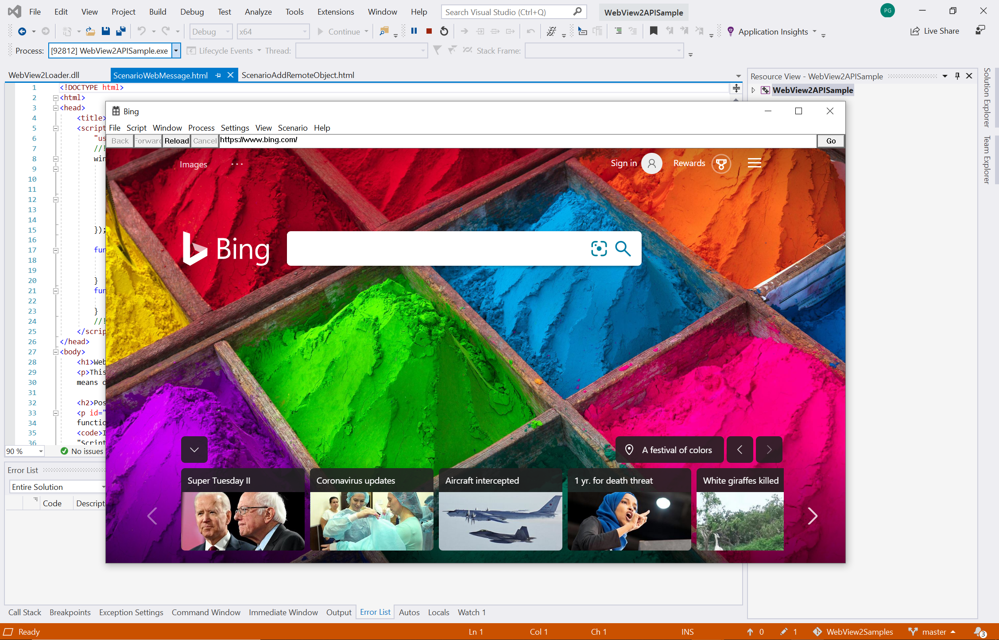

# Microsoft Edge ドライバーを使用した WebView2 の自動化とテスト

WebView2 は Chromium web プラットフォームを利用しているため、WebView2 の開発者は、デバッグとオートメーション用の標準的な web ツールを利用できます。 このようなツールの1つは Selenium であり、W3C [Webdriver](https://www.w3.org/TR/webdriver2/) API を実装します。この API を使って、ユーザー操作をシミュレートする自動テストを作成できます。

手順は次のとおりです。

## 手順 1: WebView2API のサンプルをダウンロードする

既存の WebView2 プロジェクトがない場合は、最新の WebView2 SDK の包括的なサンプルである、 [WebView2API サンプルアプリケーション](https://github.com/MicrosoftEdge/WebView2Samples/tree/master/WebView2APISample#webview2-api-sample)をダウンロードしてください。 これらの[前提条件](https://github.com/MicrosoftEdge/WebView2Samples/tree/master/WebView2APISample#prerequisites)を満たしていることをもう一度確認してください。

リポジトリを複製したら、Visual Studio でプロジェクトをビルドします。 次のような表示になります。



## 手順 2: Microsoft Edge ドライバーをインストールする

指示に従って、 [Microsoft Edge driver](https://docs.microsoft.com/microsoft-edge/webdriver-chromium#download-microsoft-edge-driver)をインストールします。 Selenium では、WebView2 を自動化してテストするために必要なブラウザー固有のドライバーです。

Microsoft Edge ドライバーのバージョンが、アプリケーションで使用されている Microsoft Edge のバージョンと一致していることを確認することが重要です。 WebView2API サンプルを使用するには、お使いの Microsoft Edge のバージョンが、サポートされている最新の SDK リリースの[リリースノートに含ま](https://docs.microsoft.com/microsoft-edge/hosting/webview2/releasenotes)れるバージョン以上であることを確認してください。 現在使用している Microsoft Edge のバージョンを確認するには、 `edge://settings/help` ブラウザーで読み込みます。

## 手順 3: Selenium を WebView2API サンプルに追加する

この時点で、Microsoft Edge をインストールして、WebView2 プロジェクトを構築し、Microsoft Edge ドライバーをインストールする必要があります。 それでは、Selenium を使い始めましょう。

> [!NOTE]
> Selenium は、C#、Java、Python、Javascript、および Ruby をサポートしています。 ただし、このガイドは C# で説明されています。

1. まず、 **Visual Studio**で新しい**C# .net Framework**プロジェクトを作成します。 右下隅にある [**次へ**] をクリックして続行します。


2. プロジェクトに**名前**を付け、希望の**場所**に保存して、[**作成**] をクリックします。


3. 新しいプロジェクトが作成されます。 このガイドでは、すべてのコードが**Program.cs**ファイルに書き込まれます。


4. それでは、プロジェクトに**Selenium**を追加しましょう。 Selenium は、 **Selenium ドライバー NuGet パッケージ**を使ってインストールできます。

**Selenium ドライバーの nuget パッケージ**をダウンロードするには、 **Visual Studio**で**プロジェクト**をマウスでポイントし、[ **NuGet パッケージの管理**] を選択します。 次の画面が表示されます。


5. 検索バーに**Selenium ドライバー**を入力し、結果から [ **Selenium** ] をクリックして、[**プレリリースを含める**] の横にあるチェックボックスをオンにします。 右側のウィンドウで、**バージョン**が**4.0.0 をインストール**するように設定されていることを確認し、[**インストール**] をクリックします。 Nuget は、Selenium をコンピューターにダウンロードします。

[Selenium ドライバー NuGet パッケージの詳細については、こちらを参照してください。](https://www.nuget.org/packages/Selenium.WebDriver/4.0.0-alpha04)


6. **OpenQA.Selenium.Edge** ```using OpenQA.Selenium.Edge;``` **Program.cs**の先頭に、次のステートメントを追加して Selenium を使います。

```csharp
using OpenQA.Selenium.Edge;

using System;
using System.Collections.Generic;
using System.Linq;
using System.Text;
using System.Threading.Tasks;
```

## 手順 4: Selenium と Microsoft EdgeDriver のドライブ WebView2

1. まず、 `EdgeOptions` 次のコードをコピーしてオブジェクトを作成します。

```csharp
static void Main(string[] args)
{
    // EdgeOptions() requires using OpenQA.Selenium.Edge
    // Construct EdgeOptions with is_legacy = false and the string "webview2"
    EdgeOptions edgeOptions = new EdgeOptions(false, "webview2");
```

この `EdgeOptions` オブジェクトには、次の2つのパラメーターがあります。
\
    **引き**
    1. `is_legacy`: を設定すると `false` 、新しい Chromium ベースの Microsoft Edge ブラウザーを運転していることが Selenium に指示されます。
    2. `"webview2"`: **WebView2**を運転している Selenium を示す文字列

2. 次に、 `edgeOptions.BinaryLocation` WebView2 プロジェクトの実行可能ファイルのファイルパスを設定して、 `msedgedriverDir` [microsoft edge ドライバー](https://developer.microsoft.com/microsoft-edge/tools/webdriver/#downloads)をインストールした場所へのファイルパスを提供する文字列を作成し、 `msedgedriverExe` microsoft edge ドライバーの実行可能ファイルの名前を格納するために呼び出される文字列を作成します。 既定では、実行可能ファイルが呼び出され `"msedgedriver.exe"` ます。 次に示すように、これら2つの文字列を使っ `EdgeDriverService` てオブジェクトを作成します。 最後に、and を使用してオブジェクトを作成し `EdgeDriver` `EdgeDriverService` `EdgeOptions` ます。

以下のコードをコピーして貼り付けることができ `edgeOptions` ます。 使用しているコンピューターで、プロジェクトの実行可能ファイルと Microsoft Edge ドライバーの実行可能ファイルに適切なファイルパスを指定していることを確認してください。

```csharp
    //Set the BinaryLocation to the filepath of the WebView2API Sample's executable
    edgeOptions.BinaryLocation = @"C:\path\to\your\webview2\project.exe";

    //Set msedgedriverDir to the filepath of the directory housing msedgedriver.exe
    string msedgedriverDir = @"C:\path\to\your\msededriver.exe's\directory";

    //Set msedgedriverExe to the name of the Edge Driver. By default it is:
    string msedgedriverExe = @"msedgedriver.exe";

    // Construct EdgeDriverService with is_legacy = false  
    EdgeDriverService service = EdgeDriverService.CreateDefaultService(msedgedriverDir, msedgedriverExe, false);

    EdgeDriver e = new EdgeDriver(service, edgeOptions);
```

3. これで、 **EdgeDriver**は、プロジェクトで**WebView2**を設定するように構成されています。 たとえば、 **WebView2API サンプル**を使っている場合は、に**移動**でき <https://microsoft.com> ```e.Url = @"https://www.microsoft.com";``` ます。 この行にブレークポイントを設定し、プロジェクトを実行して、 **Selenium** drive **WebView2**を視聴することができます。

```csharp
    //The following will Navigate the WebView2API Sample from bing.com to microsoft.com
    e.Url = @"https://www.microsoft.com";

    //This exits the edge driver
    e.Quit();
}
```


お疲れさまでした。 Selenium および Microsoft Edge ドライバーを使用して、WebView2 プロジェクトとドリブン WebView2 を正常に自動化しました。

## 次のステップ

詳細は次のページをご覧ください。

- [Selenium のドキュメント](https://www.selenium.dev/documentation/en/webdriver/)を参照して、WebView2 または Microsoft Edge (Chromium) で利用できる api Selenium の概要をご覧ください。
- [WebView2](https://docs.microsoft.com/microsoft-edge/hosting/webview2)コントロールの詳細と、ネイティブアプリに web コンテンツを埋め込むときの使い方について説明します。
- Microsoft edge ドライバーの概要 (Chromium) の詳細については、 [Microsoft Edge ドライバーのドキュメント](https://docs.microsoft.com/microsoft-edge/webdriver-chromium)を参照してください。

## WebView2 チームと連絡を取り合う  

フィードバックを共有することで、より充実した WebView2 エクスペリエンスを構築できます。 [フィードバックリポジトリ](https://github.com/MicrosoftEdge/WebViewFeedback)にアクセスして、機能のリクエストやバグレポートを送信したり、既知の問題を検索したりします。
