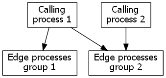
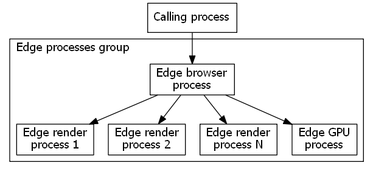

# <span data-ttu-id="1de11-104">インターフェイス ICoreWebView2</span><span class="sxs-lookup"><span data-stu-id="1de11-104">interface ICoreWebView2</span></span> 

```
interface ICoreWebView2
  : public IUnknown
```

<span data-ttu-id="1de11-105">WebView2 では、最新の Edge web ブラウザー技術を使用して、web コンテンツをホストすることができます。</span><span class="sxs-lookup"><span data-stu-id="1de11-105">WebView2 enables you to host web content using the latest Edge web browser technology.</span></span>

## <span data-ttu-id="1de11-106">まとめ</span><span class="sxs-lookup"><span data-stu-id="1de11-106">Summary</span></span>

 <span data-ttu-id="1de11-107">Members</span><span class="sxs-lookup"><span data-stu-id="1de11-107">Members</span></span>                        | <span data-ttu-id="1de11-108">説明</span><span class="sxs-lookup"><span data-stu-id="1de11-108">Descriptions</span></span>
--------------------------------|---------------------------------------------
[<span data-ttu-id="1de11-109">add_ContainsFullScreenElementChanged</span><span class="sxs-lookup"><span data-stu-id="1de11-109">add_ContainsFullScreenElementChanged</span></span>](#add_containsfullscreenelementchanged) | <span data-ttu-id="1de11-110">"の場合、要素のプロパティが変更されたときに通知します。</span><span class="sxs-lookup"><span data-stu-id="1de11-110">Notifies when the ContainsFullScreenElement property changes.</span></span>
[<span data-ttu-id="1de11-111">add_ContentLoading</span><span class="sxs-lookup"><span data-stu-id="1de11-111">add_ContentLoading</span></span>](#add_contentloading) | <span data-ttu-id="1de11-112">ContentLoading イベントのイベントハンドラーを追加します。</span><span class="sxs-lookup"><span data-stu-id="1de11-112">Add an event handler for the ContentLoading event.</span></span>
[<span data-ttu-id="1de11-113">add_DocumentTitleChanged</span><span class="sxs-lookup"><span data-stu-id="1de11-113">add_DocumentTitleChanged</span></span>](#add_documenttitlechanged) | <span data-ttu-id="1de11-114">Documentechanged Lechanged イベントのイベントハンドラーを追加します。</span><span class="sxs-lookup"><span data-stu-id="1de11-114">Add an event handler for the DocumentTitleChanged event.</span></span>
[<span data-ttu-id="1de11-115">add_FrameNavigationCompleted</span><span class="sxs-lookup"><span data-stu-id="1de11-115">add_FrameNavigationCompleted</span></span>](#add_framenavigationcompleted) | <span data-ttu-id="1de11-116">FrameNavigationCompleted イベントのイベントハンドラーを追加します。</span><span class="sxs-lookup"><span data-stu-id="1de11-116">Add an event handler for the FrameNavigationCompleted event.</span></span>
[<span data-ttu-id="1de11-117">add_FrameNavigationStarting</span><span class="sxs-lookup"><span data-stu-id="1de11-117">add_FrameNavigationStarting</span></span>](#add_framenavigationstarting) | <span data-ttu-id="1de11-118">FrameNavigationStarting イベントのイベントハンドラーを追加します。</span><span class="sxs-lookup"><span data-stu-id="1de11-118">Add an event handler for the FrameNavigationStarting event.</span></span>
[<span data-ttu-id="1de11-119">add_HistoryChanged</span><span class="sxs-lookup"><span data-stu-id="1de11-119">add_HistoryChanged</span></span>](#add_historychanged) | <span data-ttu-id="1de11-120">履歴は、トップレベルのドキュメントのナビゲーション履歴の変更をリッスンします。</span><span class="sxs-lookup"><span data-stu-id="1de11-120">HistoryChange listen to the change of navigation history for the top level document.</span></span>
[<span data-ttu-id="1de11-121">add_NavigationCompleted</span><span class="sxs-lookup"><span data-stu-id="1de11-121">add_NavigationCompleted</span></span>](#add_navigationcompleted) | <span data-ttu-id="1de11-122">NavigationCompleted イベントのイベントハンドラーを追加します。</span><span class="sxs-lookup"><span data-stu-id="1de11-122">Add an event handler for the NavigationCompleted event.</span></span>
[<span data-ttu-id="1de11-123">add_NavigationStarting</span><span class="sxs-lookup"><span data-stu-id="1de11-123">add_NavigationStarting</span></span>](#add_navigationstarting) | <span data-ttu-id="1de11-124">NavigationStarting イベントのイベントハンドラーを追加します。</span><span class="sxs-lookup"><span data-stu-id="1de11-124">Add an event handler for the NavigationStarting event.</span></span>
[<span data-ttu-id="1de11-125">add_NewWindowRequested</span><span class="sxs-lookup"><span data-stu-id="1de11-125">add_NewWindowRequested</span></span>](#add_newwindowrequested) | <span data-ttu-id="1de11-126">NewWindowRequested イベントのイベントハンドラーを追加します。</span><span class="sxs-lookup"><span data-stu-id="1de11-126">Add an event handler for the NewWindowRequested event.</span></span>
[<span data-ttu-id="1de11-127">add_PermissionRequested</span><span class="sxs-lookup"><span data-stu-id="1de11-127">add_PermissionRequested</span></span>](#add_permissionrequested) | <span data-ttu-id="1de11-128">PermissionRequested されたイベントのイベントハンドラーを追加します。</span><span class="sxs-lookup"><span data-stu-id="1de11-128">Add an event handler for the PermissionRequested event.</span></span>
[<span data-ttu-id="1de11-129">add_ProcessFailed</span><span class="sxs-lookup"><span data-stu-id="1de11-129">add_ProcessFailed</span></span>](#add_processfailed) | <span data-ttu-id="1de11-130">ProcessFailed イベントのイベントハンドラーを追加します。</span><span class="sxs-lookup"><span data-stu-id="1de11-130">Add an event handler for the ProcessFailed event.</span></span>
[<span data-ttu-id="1de11-131">add_ScriptDialogOpening</span><span class="sxs-lookup"><span data-stu-id="1de11-131">add_ScriptDialogOpening</span></span>](#add_scriptdialogopening) | <span data-ttu-id="1de11-132">Scriptの開始イベントのイベントハンドラーを追加します。</span><span class="sxs-lookup"><span data-stu-id="1de11-132">Add an event handler for the ScriptDialogOpening event.</span></span>
[<span data-ttu-id="1de11-133">add_SourceChanged</span><span class="sxs-lookup"><span data-stu-id="1de11-133">add_SourceChanged</span></span>](#add_sourcechanged) | <span data-ttu-id="1de11-134">SourceChanged Source プロパティが変更されたときに発生します。</span><span class="sxs-lookup"><span data-stu-id="1de11-134">SourceChanged fires when the Source property changes.</span></span>
[<span data-ttu-id="1de11-135">add_WebMessageReceived</span><span class="sxs-lookup"><span data-stu-id="1de11-135">add_WebMessageReceived</span></span>](#add_webmessagereceived) | <span data-ttu-id="1de11-136">このイベントは、IsWebMessageEnabled 設定が設定され、webview 呼び出しの最上位のドキュメントになったときに発生 `window.chrome.webview.postMessage` します。</span><span class="sxs-lookup"><span data-stu-id="1de11-136">This event fires when the IsWebMessageEnabled setting is set and the top level document of the webview calls `window.chrome.webview.postMessage`.</span></span>
[<span data-ttu-id="1de11-137">add_WebResourceRequested</span><span class="sxs-lookup"><span data-stu-id="1de11-137">add_WebResourceRequested</span></span>](#add_webresourcerequested) | <span data-ttu-id="1de11-138">WebResourceRequested イベントのイベントハンドラーを追加します。</span><span class="sxs-lookup"><span data-stu-id="1de11-138">Add an event handler for the WebResourceRequested event.</span></span>
[<span data-ttu-id="1de11-139">add_WindowCloseRequested</span><span class="sxs-lookup"><span data-stu-id="1de11-139">add_WindowCloseRequested</span></span>](#add_windowcloserequested) | <span data-ttu-id="1de11-140">WindowCloseRequested イベントのイベントハンドラーを追加します。</span><span class="sxs-lookup"><span data-stu-id="1de11-140">Add an event handler for the WindowCloseRequested event.</span></span>
[<span data-ttu-id="1de11-141">AddHostObjectToScript</span><span class="sxs-lookup"><span data-stu-id="1de11-141">AddHostObjectToScript</span></span>](#addhostobjecttoscript) | <span data-ttu-id="1de11-142">指定された名前を持つ WebView で実行されているスクリプトに、指定されたホストオブジェクトを追加します。</span><span class="sxs-lookup"><span data-stu-id="1de11-142">Add the provided host object to script running in the WebView with the specified name.</span></span>
[<span data-ttu-id="1de11-143">AddScriptToExecuteOnDocumentCreated</span><span class="sxs-lookup"><span data-stu-id="1de11-143">AddScriptToExecuteOnDocumentCreated</span></span>](#addscripttoexecuteondocumentcreated) | <span data-ttu-id="1de11-144">グローバルオブジェクトの作成後、HTML ドキュメントが解析されてから、HTML ドキュメントに含まれている他のスクリプトが実行される前に、指定された JavaScript を実行する必要があるスクリプトのリストに追加します。</span><span class="sxs-lookup"><span data-stu-id="1de11-144">Add the provided JavaScript to a list of scripts that should be executed after the global object has been created, but before the HTML document has been parsed and before any other script included by the HTML document is executed.</span></span>
[<span data-ttu-id="1de11-145">AddWebResourceRequestedFilter</span><span class="sxs-lookup"><span data-stu-id="1de11-145">AddWebResourceRequestedFilter</span></span>](#addwebresourcerequestedfilter) | <span data-ttu-id="1de11-146">URI とリソースのコンテキストフィルターを WebResourceRequested イベントに追加します。</span><span class="sxs-lookup"><span data-stu-id="1de11-146">Adds a URI and resource context filter to the WebResourceRequested event.</span></span>
[<span data-ttu-id="1de11-147">Calldevon Protocolメソッド</span><span class="sxs-lookup"><span data-stu-id="1de11-147">CallDevToolsProtocolMethod</span></span>](#calldevtoolsprotocolmethod) | <span data-ttu-id="1de11-148">非同期の Devて Protocol メソッドを呼び出します。</span><span class="sxs-lookup"><span data-stu-id="1de11-148">Call an asynchronous DevToolsProtocol method.</span></span>
[<span data-ttu-id="1de11-149">CapturePreview</span><span class="sxs-lookup"><span data-stu-id="1de11-149">CapturePreview</span></span>](#capturepreview) | <span data-ttu-id="1de11-150">WebView が表示されている画像をキャプチャします。</span><span class="sxs-lookup"><span data-stu-id="1de11-150">Capture an image of what WebView is displaying.</span></span>
[<span data-ttu-id="1de11-151">Execuスクリプト</span><span class="sxs-lookup"><span data-stu-id="1de11-151">ExecuteScript</span></span>](#executescript) | <span data-ttu-id="1de11-152">WebView でレンダリングされた現在のトップレベルドキュメントの javascript パラメーターから JavaScript コードを実行します。</span><span class="sxs-lookup"><span data-stu-id="1de11-152">Execute JavaScript code from the javascript parameter in the current top level document rendered in the WebView.</span></span>
[<span data-ttu-id="1de11-153">get_BrowserProcessId</span><span class="sxs-lookup"><span data-stu-id="1de11-153">get_BrowserProcessId</span></span>](#get_browserprocessid) | <span data-ttu-id="1de11-154">WebView をホストしているブラウザープロセスのプロセス id。</span><span class="sxs-lookup"><span data-stu-id="1de11-154">The process id of the browser process that hosts the WebView.</span></span>
[<span data-ttu-id="1de11-155">get_CanGoBack</span><span class="sxs-lookup"><span data-stu-id="1de11-155">get_CanGoBack</span></span>](#get_cangoback) | <span data-ttu-id="1de11-156">ナビゲーション履歴で前のページに移動できる場合は true を返します。</span><span class="sxs-lookup"><span data-stu-id="1de11-156">Returns true if the webview can navigate to a previous page in the navigation history.</span></span>
[<span data-ttu-id="1de11-157">get_CanGoForward</span><span class="sxs-lookup"><span data-stu-id="1de11-157">get_CanGoForward</span></span>](#get_cangoforward) | <span data-ttu-id="1de11-158">ナビゲーション履歴の次のページに移動できる場合は true を返します。</span><span class="sxs-lookup"><span data-stu-id="1de11-158">Returns true if the webview can navigate to a next page in the navigation history.</span></span>
[<span data-ttu-id="1de11-159">get_ContainsFullScreenElement</span><span class="sxs-lookup"><span data-stu-id="1de11-159">get_ContainsFullScreenElement</span></span>](#get_containsfullscreenelement) | <span data-ttu-id="1de11-160">WebView にフルスクリーン HTML 要素が含まれているかどうかを示します。</span><span class="sxs-lookup"><span data-stu-id="1de11-160">Indicates if the WebView contains a fullscreen HTML element.</span></span>
[<span data-ttu-id="1de11-161">get_DocumentTitle</span><span class="sxs-lookup"><span data-stu-id="1de11-161">get_DocumentTitle</span></span>](#get_documenttitle) | <span data-ttu-id="1de11-162">現在のトップレベルドキュメントのタイトル。</span><span class="sxs-lookup"><span data-stu-id="1de11-162">The title for the current top level document.</span></span>
[<span data-ttu-id="1de11-163">get_Settings</span><span class="sxs-lookup"><span data-stu-id="1de11-163">get_Settings</span></span>](#get_settings) | <span data-ttu-id="1de11-164">[ICoreWebView2Settings](icorewebview2settings.md)オブジェクトには、実行中の WebView のさまざまな変更可能な設定が含まれています。</span><span class="sxs-lookup"><span data-stu-id="1de11-164">The [ICoreWebView2Settings](icorewebview2settings.md) object contains various modifiable settings for the running WebView.</span></span>
[<span data-ttu-id="1de11-165">get_Source</span><span class="sxs-lookup"><span data-stu-id="1de11-165">get_Source</span></span>](#get_source) | <span data-ttu-id="1de11-166">現在の最上位レベルのドキュメントの URI。</span><span class="sxs-lookup"><span data-stu-id="1de11-166">The URI of the current top level document.</span></span>
[<span data-ttu-id="1de11-167">GetDevToolsProtocolEventReceiver</span><span class="sxs-lookup"><span data-stu-id="1de11-167">GetDevToolsProtocolEventReceiver</span></span>](#getdevtoolsprotocoleventreceiver) | <span data-ttu-id="1de11-168">DevTools プロトコルイベントをサブスクライブできる DevTools プロトコルイベントレシーバーを入手します。</span><span class="sxs-lookup"><span data-stu-id="1de11-168">Get a DevTools Protocol event receiver that allows you to subscribe to a DevTools Protocol event.</span></span>
[<span data-ttu-id="1de11-169">GoBack</span><span class="sxs-lookup"><span data-stu-id="1de11-169">GoBack</span></span>](#goback) | <span data-ttu-id="1de11-170">ナビゲーション履歴で、WebView を前のページに移動します。</span><span class="sxs-lookup"><span data-stu-id="1de11-170">Navigates the WebView to the previous page in the navigation history.</span></span>
[<span data-ttu-id="1de11-171">GoForward</span><span class="sxs-lookup"><span data-stu-id="1de11-171">GoForward</span></span>](#goforward) | <span data-ttu-id="1de11-172">WebView をナビゲーション履歴の次のページに移動します。</span><span class="sxs-lookup"><span data-stu-id="1de11-172">Navigates the WebView to the next page in the navigation history.</span></span>
[<span data-ttu-id="1de11-173">検索</span><span class="sxs-lookup"><span data-stu-id="1de11-173">Navigate</span></span>](#navigate) | <span data-ttu-id="1de11-174">最上位レベルのドキュメントを指定した URI に移動します。</span><span class="sxs-lookup"><span data-stu-id="1de11-174">Cause a navigation of the top level document to the specified URI.</span></span>
[<span data-ttu-id="1de11-175">NavigateToString</span><span class="sxs-lookup"><span data-stu-id="1de11-175">NavigateToString</span></span>](#navigatetostring) | <span data-ttu-id="1de11-176">新しい文書のソース HTML として、htmlContent へのナビゲーションを開始します。</span><span class="sxs-lookup"><span data-stu-id="1de11-176">Initiates a navigation to htmlContent as source HTML of a new document.</span></span>
[<span data-ttu-id="1de11-177">Opendevツールウィンドウ</span><span class="sxs-lookup"><span data-stu-id="1de11-177">OpenDevToolsWindow</span></span>](#opendevtoolswindow) | <span data-ttu-id="1de11-178">WebView で現在のドキュメントの [DevTools] ウィンドウを開きます。</span><span class="sxs-lookup"><span data-stu-id="1de11-178">Opens the DevTools window for the current document in the WebView.</span></span>
[<span data-ttu-id="1de11-179">PostWebMessageAsJson</span><span class="sxs-lookup"><span data-stu-id="1de11-179">PostWebMessageAsJson</span></span>](#postwebmessageasjson) | <span data-ttu-id="1de11-180">指定した webMessage をこの WebView のトップレベルドキュメントに投稿します。</span><span class="sxs-lookup"><span data-stu-id="1de11-180">Post the specified webMessage to the top level document in this WebView.</span></span>
[<span data-ttu-id="1de11-181">PostWebMessageAsString</span><span class="sxs-lookup"><span data-stu-id="1de11-181">PostWebMessageAsString</span></span>](#postwebmessageasstring) | <span data-ttu-id="1de11-182">これは、JavaScript オブジェクトの JSON 文字列表現ではなく、単純な文字列のメッセージを投稿するためのヘルパーです。</span><span class="sxs-lookup"><span data-stu-id="1de11-182">This is a helper for posting a message that is a simple string rather than a JSON string representation of a JavaScript object.</span></span>
[<span data-ttu-id="1de11-183">再</span><span class="sxs-lookup"><span data-stu-id="1de11-183">Reload</span></span>](#reload) | <span data-ttu-id="1de11-184">現在のページを再読み込みします。</span><span class="sxs-lookup"><span data-stu-id="1de11-184">Reload the current page.</span></span>
[<span data-ttu-id="1de11-185">remove_ContainsFullScreenElementChanged</span><span class="sxs-lookup"><span data-stu-id="1de11-185">remove_ContainsFullScreenElementChanged</span></span>](#remove_containsfullscreenelementchanged) | <span data-ttu-id="1de11-186">対応する add_ イベントメソッドを使用して、前に追加したイベントハンドラーを削除します。</span><span class="sxs-lookup"><span data-stu-id="1de11-186">Remove an event handler previously added with the corresponding add_ event method.</span></span>
[<span data-ttu-id="1de11-187">remove_ContentLoading</span><span class="sxs-lookup"><span data-stu-id="1de11-187">remove_ContentLoading</span></span>](#remove_contentloading) | <span data-ttu-id="1de11-188">Add_ContentLoading で以前に追加されたイベントハンドラーを削除します。</span><span class="sxs-lookup"><span data-stu-id="1de11-188">Remove an event handler previously added with add_ContentLoading.</span></span>
[<span data-ttu-id="1de11-189">remove_DocumentTitleChanged</span><span class="sxs-lookup"><span data-stu-id="1de11-189">remove_DocumentTitleChanged</span></span>](#remove_documenttitlechanged) | <span data-ttu-id="1de11-190">Add_DocumentTitleChanged で以前に追加されたイベントハンドラーを削除します。</span><span class="sxs-lookup"><span data-stu-id="1de11-190">Remove an event handler previously added with add_DocumentTitleChanged.</span></span>
[<span data-ttu-id="1de11-191">remove_FrameNavigationCompleted</span><span class="sxs-lookup"><span data-stu-id="1de11-191">remove_FrameNavigationCompleted</span></span>](#remove_framenavigationcompleted) | <span data-ttu-id="1de11-192">Add_FrameNavigationCompleted で以前に追加されたイベントハンドラーを削除します。</span><span class="sxs-lookup"><span data-stu-id="1de11-192">Remove an event handler previously added with add_FrameNavigationCompleted.</span></span>
[<span data-ttu-id="1de11-193">remove_FrameNavigationStarting</span><span class="sxs-lookup"><span data-stu-id="1de11-193">remove_FrameNavigationStarting</span></span>](#remove_framenavigationstarting) | <span data-ttu-id="1de11-194">Add_FrameNavigationStarting で以前に追加されたイベントハンドラーを削除します。</span><span class="sxs-lookup"><span data-stu-id="1de11-194">Remove an event handler previously added with add_FrameNavigationStarting.</span></span>
[<span data-ttu-id="1de11-195">remove_HistoryChanged</span><span class="sxs-lookup"><span data-stu-id="1de11-195">remove_HistoryChanged</span></span>](#remove_historychanged) | <span data-ttu-id="1de11-196">Add_HistoryChanged で以前に追加されたイベントハンドラーを削除します。</span><span class="sxs-lookup"><span data-stu-id="1de11-196">Remove an event handler previously added with add_HistoryChanged.</span></span>
[<span data-ttu-id="1de11-197">remove_NavigationCompleted</span><span class="sxs-lookup"><span data-stu-id="1de11-197">remove_NavigationCompleted</span></span>](#remove_navigationcompleted) | <span data-ttu-id="1de11-198">Add_NavigationCompleted で以前に追加されたイベントハンドラーを削除します。</span><span class="sxs-lookup"><span data-stu-id="1de11-198">Remove an event handler previously added with add_NavigationCompleted.</span></span>
[<span data-ttu-id="1de11-199">remove_NavigationStarting</span><span class="sxs-lookup"><span data-stu-id="1de11-199">remove_NavigationStarting</span></span>](#remove_navigationstarting) | <span data-ttu-id="1de11-200">Add_NavigationStarting で以前に追加されたイベントハンドラーを削除します。</span><span class="sxs-lookup"><span data-stu-id="1de11-200">Remove an event handler previously added with add_NavigationStarting.</span></span>
[<span data-ttu-id="1de11-201">remove_NewWindowRequested</span><span class="sxs-lookup"><span data-stu-id="1de11-201">remove_NewWindowRequested</span></span>](#remove_newwindowrequested) | <span data-ttu-id="1de11-202">Add_NewWindowRequested で以前に追加されたイベントハンドラーを削除します。</span><span class="sxs-lookup"><span data-stu-id="1de11-202">Remove an event handler previously added with add_NewWindowRequested.</span></span>
[<span data-ttu-id="1de11-203">remove_PermissionRequested</span><span class="sxs-lookup"><span data-stu-id="1de11-203">remove_PermissionRequested</span></span>](#remove_permissionrequested) | <span data-ttu-id="1de11-204">Add_PermissionRequested で以前に追加されたイベントハンドラーを削除します。</span><span class="sxs-lookup"><span data-stu-id="1de11-204">Remove an event handler previously added with add_PermissionRequested.</span></span>
[<span data-ttu-id="1de11-205">remove_ProcessFailed</span><span class="sxs-lookup"><span data-stu-id="1de11-205">remove_ProcessFailed</span></span>](#remove_processfailed) | <span data-ttu-id="1de11-206">Add_ProcessFailed で以前に追加されたイベントハンドラーを削除します。</span><span class="sxs-lookup"><span data-stu-id="1de11-206">Remove an event handler previously added with add_ProcessFailed.</span></span>
[<span data-ttu-id="1de11-207">remove_ScriptDialogOpening</span><span class="sxs-lookup"><span data-stu-id="1de11-207">remove_ScriptDialogOpening</span></span>](#remove_scriptdialogopening) | <span data-ttu-id="1de11-208">Add_ScriptDialogOpening で以前に追加されたイベントハンドラーを削除します。</span><span class="sxs-lookup"><span data-stu-id="1de11-208">Remove an event handler previously added with add_ScriptDialogOpening.</span></span>
[<span data-ttu-id="1de11-209">remove_SourceChanged</span><span class="sxs-lookup"><span data-stu-id="1de11-209">remove_SourceChanged</span></span>](#remove_sourcechanged) | <span data-ttu-id="1de11-210">Add_SourceChanged で以前に追加されたイベントハンドラーを削除します。</span><span class="sxs-lookup"><span data-stu-id="1de11-210">Remove an event handler previously added with add_SourceChanged.</span></span>
[<span data-ttu-id="1de11-211">remove_WebMessageReceived</span><span class="sxs-lookup"><span data-stu-id="1de11-211">remove_WebMessageReceived</span></span>](#remove_webmessagereceived) | <span data-ttu-id="1de11-212">Add_WebMessageReceived で以前に追加されたイベントハンドラーを削除します。</span><span class="sxs-lookup"><span data-stu-id="1de11-212">Remove an event handler previously added with add_WebMessageReceived.</span></span>
[<span data-ttu-id="1de11-213">remove_WebResourceRequested</span><span class="sxs-lookup"><span data-stu-id="1de11-213">remove_WebResourceRequested</span></span>](#remove_webresourcerequested) | <span data-ttu-id="1de11-214">Add_WebResourceRequested で以前に追加されたイベントハンドラーを削除します。</span><span class="sxs-lookup"><span data-stu-id="1de11-214">Remove an event handler previously added with add_WebResourceRequested.</span></span>
[<span data-ttu-id="1de11-215">remove_WindowCloseRequested</span><span class="sxs-lookup"><span data-stu-id="1de11-215">remove_WindowCloseRequested</span></span>](#remove_windowcloserequested) | <span data-ttu-id="1de11-216">Add_WindowCloseRequested で以前に追加されたイベントハンドラーを削除します。</span><span class="sxs-lookup"><span data-stu-id="1de11-216">Remove an event handler previously added with add_WindowCloseRequested.</span></span>
[<span data-ttu-id="1de11-217">RemoveHostObjectFromScript</span><span class="sxs-lookup"><span data-stu-id="1de11-217">RemoveHostObjectFromScript</span></span>](#removehostobjectfromscript) | <span data-ttu-id="1de11-218">名前で指定されたホストオブジェクトを削除して、WebView の JavaScript コードからアクセスできなくなるようにします。</span><span class="sxs-lookup"><span data-stu-id="1de11-218">Remove the host object specified by the name so that it is no longer accessible from JavaScript code in the WebView.</span></span>
[<span data-ttu-id="1de11-219">RemoveScriptToExecuteOnDocumentCreated</span><span class="sxs-lookup"><span data-stu-id="1de11-219">RemoveScriptToExecuteOnDocumentCreated</span></span>](#removescripttoexecuteondocumentcreated) | <span data-ttu-id="1de11-220">AddScriptToExecuteOnDocumentCreated によって追加された、対応する JavaScript を削除します。</span><span class="sxs-lookup"><span data-stu-id="1de11-220">Remove the corresponding JavaScript added via AddScriptToExecuteOnDocumentCreated.</span></span>
[<span data-ttu-id="1de11-221">RemoveWebResourceRequestedFilter</span><span class="sxs-lookup"><span data-stu-id="1de11-221">RemoveWebResourceRequestedFilter</span></span>](#removewebresourcerequestedfilter) | <span data-ttu-id="1de11-222">以前に WebResourceRequested イベントに追加された、一致する WebResource フィルターを削除します。</span><span class="sxs-lookup"><span data-stu-id="1de11-222">Removes a matching WebResource filter that was previously added for the WebResourceRequested event.</span></span>
[<span data-ttu-id="1de11-223">Stop</span><span class="sxs-lookup"><span data-stu-id="1de11-223">Stop</span></span>](#stop) | <span data-ttu-id="1de11-224">すべてのナビゲーションと保留中のリソースフェッチを停止します。</span><span class="sxs-lookup"><span data-stu-id="1de11-224">Stop all navigations and pending resource fetches.</span></span>
[<span data-ttu-id="1de11-225">COREWEBVIEW2_CAPTURE_PREVIEW_IMAGE_FORMAT</span><span class="sxs-lookup"><span data-stu-id="1de11-225">COREWEBVIEW2_CAPTURE_PREVIEW_IMAGE_FORMAT</span></span>](#corewebview2_capture_preview_image_format) | <span data-ttu-id="1de11-226">ICoreWebView2:: CapturePreview メソッドで使用されている画像形式。</span><span class="sxs-lookup"><span data-stu-id="1de11-226">Image format used by the ICoreWebView2::CapturePreview method.</span></span>
[<span data-ttu-id="1de11-227">COREWEBVIEW2_KEY_EVENT_KIND</span><span class="sxs-lookup"><span data-stu-id="1de11-227">COREWEBVIEW2_KEY_EVENT_KIND</span></span>](#corewebview2_key_event_kind) | <span data-ttu-id="1de11-228">AcceleratorKeyPressed イベントをトリガーしたキーイベントの種類です。</span><span class="sxs-lookup"><span data-stu-id="1de11-228">The type of key event that triggered an AcceleratorKeyPressed event.</span></span>
[<span data-ttu-id="1de11-229">COREWEBVIEW2_MOVE_FOCUS_REASON</span><span class="sxs-lookup"><span data-stu-id="1de11-229">COREWEBVIEW2_MOVE_FOCUS_REASON</span></span>](#corewebview2_move_focus_reason) | <span data-ttu-id="1de11-230">フォーカスを移動する理由。</span><span class="sxs-lookup"><span data-stu-id="1de11-230">Reason for moving focus.</span></span>
[<span data-ttu-id="1de11-231">COREWEBVIEW2_PERMISSION_KIND</span><span class="sxs-lookup"><span data-stu-id="1de11-231">COREWEBVIEW2_PERMISSION_KIND</span></span>](#corewebview2_permission_kind) | <span data-ttu-id="1de11-232">アクセス許可要求の種類。</span><span class="sxs-lookup"><span data-stu-id="1de11-232">The type of a permission request.</span></span>
[<span data-ttu-id="1de11-233">COREWEBVIEW2_PERMISSION_STATE</span><span class="sxs-lookup"><span data-stu-id="1de11-233">COREWEBVIEW2_PERMISSION_STATE</span></span>](#corewebview2_permission_state) | <span data-ttu-id="1de11-234">アクセス許可要求に対する応答。</span><span class="sxs-lookup"><span data-stu-id="1de11-234">Response to a permission request.</span></span>
[<span data-ttu-id="1de11-235">COREWEBVIEW2_PHYSICAL_KEY_STATUS</span><span class="sxs-lookup"><span data-stu-id="1de11-235">COREWEBVIEW2_PHYSICAL_KEY_STATUS</span></span>](#corewebview2_physical_key_status) | <span data-ttu-id="1de11-236">Win32 キーイベントに指定された LPARAM にパックされた情報を表す構造体。</span><span class="sxs-lookup"><span data-stu-id="1de11-236">A structure representing the information packed into the LPARAM given to a Win32 key event.</span></span>
[<span data-ttu-id="1de11-237">COREWEBVIEW2_PROCESS_FAILED_KIND</span><span class="sxs-lookup"><span data-stu-id="1de11-237">COREWEBVIEW2_PROCESS_FAILED_KIND</span></span>](#corewebview2_process_failed_kind) | <span data-ttu-id="1de11-238">ICoreWebView2ProcessFailedEventHandler インターフェイスで使用されているプロセスエラーの種類。</span><span class="sxs-lookup"><span data-stu-id="1de11-238">Kind of process failure used in the ICoreWebView2ProcessFailedEventHandler interface.</span></span>
[<span data-ttu-id="1de11-239">COREWEBVIEW2_SCRIPT_DIALOG_KIND</span><span class="sxs-lookup"><span data-stu-id="1de11-239">COREWEBVIEW2_SCRIPT_DIALOG_KIND</span></span>](#corewebview2_script_dialog_kind) | <span data-ttu-id="1de11-240">ICoreWebView2ScriptDialogOpeningEventHandler インターフェイスで使用される JavaScript ダイアログの種類。</span><span class="sxs-lookup"><span data-stu-id="1de11-240">Kind of JavaScript dialog used in the ICoreWebView2ScriptDialogOpeningEventHandler interface.</span></span>
[<span data-ttu-id="1de11-241">COREWEBVIEW2_WEB_ERROR_STATUS</span><span class="sxs-lookup"><span data-stu-id="1de11-241">COREWEBVIEW2_WEB_ERROR_STATUS</span></span>](#corewebview2_web_error_status) | <span data-ttu-id="1de11-242">Web ナビゲーションのエラー状態の値。</span><span class="sxs-lookup"><span data-stu-id="1de11-242">Error status values for web navigations.</span></span>
[<span data-ttu-id="1de11-243">COREWEBVIEW2_WEB_RESOURCE_CONTEXT</span><span class="sxs-lookup"><span data-stu-id="1de11-243">COREWEBVIEW2_WEB_RESOURCE_CONTEXT</span></span>](#corewebview2_web_resource_context) | <span data-ttu-id="1de11-244">Web リソース要求コンテキストの列挙。</span><span class="sxs-lookup"><span data-stu-id="1de11-244">Enum for web resource request contexts.</span></span>

## <span data-ttu-id="1de11-245">ナビゲーションイベント</span><span class="sxs-lookup"><span data-stu-id="1de11-245">Navigation events</span></span>

<span data-ttu-id="1de11-246">ナビゲーションイベントの通常のシーケンスは、NavigationStarting、SourceChanged、ContentLoading、Navigationstarting です。</span><span class="sxs-lookup"><span data-stu-id="1de11-246">The normal sequence of navigation events is NavigationStarting, SourceChanged, ContentLoading and then NavigationCompleted.</span></span> <span data-ttu-id="1de11-247">次のイベントは、各ナビゲーション中の WebView の状態を示しています。 NavigationStarting: WebView はナビゲートを開始し、ナビゲーションはネットワーク要求になります。</span><span class="sxs-lookup"><span data-stu-id="1de11-247">The following events describe the state of WebView during each navigation: NavigationStarting: WebView is starting to navigate and the navigation will result in a network request.</span></span> <span data-ttu-id="1de11-248">この時点では、ホストは要求を許可することはできません。</span><span class="sxs-lookup"><span data-stu-id="1de11-248">The host can disallow the request at this time.</span></span> <span data-ttu-id="1de11-249">SourceChanged: WebView のソースが新しい URL に変更されます。</span><span class="sxs-lookup"><span data-stu-id="1de11-249">SourceChanged: The source of WebView is changed to a new URL.</span></span> <span data-ttu-id="1de11-250">これは、フラグメントナビゲーションなどのネットワーク要求が発生しないナビゲーションが原因である場合もあります。</span><span class="sxs-lookup"><span data-stu-id="1de11-250">This may also be due to a navigation that doesn't cause a network request such as a fragment navigation.</span></span> <span data-ttu-id="1de11-251">履歴が変更されました: WebView の履歴はナビゲーションの結果として更新されています。</span><span class="sxs-lookup"><span data-stu-id="1de11-251">HistoryChanged: WebView's history has been updated as a result of the navigation.</span></span> <span data-ttu-id="1de11-252">ContentLoading: WebView が新しいコンテンツの読み込みを開始しました。</span><span class="sxs-lookup"><span data-stu-id="1de11-252">ContentLoading: WebView has started loading new content.</span></span> <span data-ttu-id="1de11-253">NavigationCompleted: WebView は、新しいページのコンテンツの読み込みを完了しました。</span><span class="sxs-lookup"><span data-stu-id="1de11-253">NavigationCompleted: WebView has completed loading content on the new page.</span></span> <span data-ttu-id="1de11-254">開発者はナビゲーション ID を使用して、新しいドキュメントごとにナビゲーションを追跡できます。</span><span class="sxs-lookup"><span data-stu-id="1de11-254">Developers can track navigations to each new document by the navigation ID.</span></span> <span data-ttu-id="1de11-255">新しいドキュメントへのナビゲーションが正常に完了するたびに、WebView のナビゲーション ID が変更されます。</span><span class="sxs-lookup"><span data-stu-id="1de11-255">WebView's navigation ID changes every time there is a successful navigation to a new document.</span></span>


<span data-ttu-id="1de11-257">これは、同じ NavigationId イベント arg を持つナビゲーションイベント用であることに注意してください。</span><span class="sxs-lookup"><span data-stu-id="1de11-257">Note that this is for navigation events with the same NavigationId event arg.</span></span> <span data-ttu-id="1de11-258">異なる NavigationId イベント引数を持つナビゲーションイベントは、重複する可能性があります。</span><span class="sxs-lookup"><span data-stu-id="1de11-258">Navigations events with different NavigationId event args may overlap.</span></span> <span data-ttu-id="1de11-259">たとえば、ナビゲーションを開始したときに NavigationStarting イベントが発生してから別のナビゲーションを開始した場合は、最初のナビで開始される navigationstarting 後に、2番目のナビゲーションのナビゲートが続いて、2番目のナビゲーションについて、該当するすべてのナビゲーションイベントが表示されます。</span><span class="sxs-lookup"><span data-stu-id="1de11-259">For instance, if you start a navigation wait for its NavigationStarting event and then start another navigation you'll see the NavigationStarting for the first navigate followed by the NavigationStarting of the second navigate, followed by the NavigationCompleted for the first navigation and then all the rest of the appropriate navigation events for the second navigation.</span></span> <span data-ttu-id="1de11-260">エラーが発生した場合は、ナビゲーションがエラーページに続いているかどうかによって、ContentLoading イベントになることもあります。</span><span class="sxs-lookup"><span data-stu-id="1de11-260">In error cases there may or may not be a ContentLoading event depending on whether the navigation is continued to an error page.</span></span> <span data-ttu-id="1de11-261">HTTP リダイレクトの場合、1つの行に複数の NavigationStarting イベントが存在します。最初の列の後には IsRedirect フラグが設定されますが、ナビゲーション ID は変わりません。</span><span class="sxs-lookup"><span data-stu-id="1de11-261">In case of an HTTP redirect, there will be multiple NavigationStarting events in a row, with ones following the first will have their IsRedirect flag set, however navigation ID remains the same.</span></span> <span data-ttu-id="1de11-262">同じドキュメントナビゲーションでは、NavigationStarting イベントは発生せず、ナビゲーション ID もインクリメントされません。</span><span class="sxs-lookup"><span data-stu-id="1de11-262">Same document navigations do not result in NavigationStarting event and also do not increment the navigation ID.</span></span>

<span data-ttu-id="1de11-263">WebView でサブフレーム内のナビゲーションを監視またはキャンセルするには、FrameNavigationStarting を使用します。</span><span class="sxs-lookup"><span data-stu-id="1de11-263">To monitor or cancel navigations inside subframes in the WebView, use FrameNavigationStarting.</span></span>

## <span data-ttu-id="1de11-264">プロセスモデル</span><span class="sxs-lookup"><span data-stu-id="1de11-264">Process model</span></span>

<span data-ttu-id="1de11-265">WebView2 は、Edge web ブラウザーと同じプロセスモデルを使用します。</span><span class="sxs-lookup"><span data-stu-id="1de11-265">WebView2 uses the same process model as the Edge web browser.</span></span> <span data-ttu-id="1de11-266">ユーザーデータディレクトリを指定する WebView2 の呼び出しプロセスを提供するユーザーセッションの指定したユーザーデータディレクトリごとに、1つの Edge ブラウザープロセスが存在します。</span><span class="sxs-lookup"><span data-stu-id="1de11-266">There is one Edge browser process per specified user data directory in a user session that will serve any WebView2 calling process that specifies that user data directory.</span></span> <span data-ttu-id="1de11-267">つまり、1つの Edge ブラウザープロセスが複数の通話プロセスを処理している可能性があり、1つの呼び出しプロセスが複数の Edge ブラウザープロセスを使用している可能性があります。</span><span class="sxs-lookup"><span data-stu-id="1de11-267">This means one Edge browser process may be serving multiple calling processes and one calling process may be using multiple Edge browser processes.</span></span>



<span data-ttu-id="1de11-269">ブラウザープロセスが表示されない場合は、いくつかのレンダラープロセスが存在します。</span><span class="sxs-lookup"><span data-stu-id="1de11-269">Off of a browser process there will be some number of renderer processes.</span></span> <span data-ttu-id="1de11-270">これらは、さまざまな WebViews で複数のフレームを処理するために必要に応じて作成されます。</span><span class="sxs-lookup"><span data-stu-id="1de11-270">These are created as necessary to service potentially multiple frames in different WebViews.</span></span> <span data-ttu-id="1de11-271">レンダラープロセスの数は、サイト分離ブラウザー機能と、関連付けられている WebViews でレンダリングされた個別の切断元の数によって異なります。</span><span class="sxs-lookup"><span data-stu-id="1de11-271">The number of renderer processes varies based on the site isolation browser feature and the number of distinct disconnected origins rendered in associated WebViews.</span></span>



<span data-ttu-id="1de11-273">クラッシュとハングに対処するには、これらのブラウザーと ProcessFailure イベントを使ってプロセスをレンダリングします。</span><span class="sxs-lookup"><span data-stu-id="1de11-273">You can react to crashes and hangs in these browser and renderer processes using the ProcessFailure event.</span></span>

<span data-ttu-id="1de11-274">Close メソッドを使用して、関連するブラウザーとレンダラープロセスを安全にシャットダウンできます。</span><span class="sxs-lookup"><span data-stu-id="1de11-274">You can safely shutdown associated browser and renderer processes using the Close method.</span></span>

## <span data-ttu-id="1de11-275">スレッドモデル</span><span class="sxs-lookup"><span data-stu-id="1de11-275">Threading model</span></span>

<span data-ttu-id="1de11-276">WebView2 は、UI スレッドで作成する必要があります。</span><span class="sxs-lookup"><span data-stu-id="1de11-276">The WebView2 must be created on a UI thread.</span></span> <span data-ttu-id="1de11-277">特にメッセージポンプを持つスレッド。</span><span class="sxs-lookup"><span data-stu-id="1de11-277">Specifically a thread with a message pump.</span></span> <span data-ttu-id="1de11-278">すべてのコールバックがそのスレッドで発生し、WebView への呼び出しはそのスレッドで実行する必要があります。</span><span class="sxs-lookup"><span data-stu-id="1de11-278">All callbacks will occur on that thread and calls into the WebView must be done on that thread.</span></span> <span data-ttu-id="1de11-279">他のスレッドから WebView を使うことは安全ではありません。</span><span class="sxs-lookup"><span data-stu-id="1de11-279">It is not safe to use the WebView from another thread.</span></span>

<span data-ttu-id="1de11-280">イベントハンドラーと完了ハンドラーを含むコールバックは逐次実行されます。</span><span class="sxs-lookup"><span data-stu-id="1de11-280">Callbacks including event handlers and completion handlers execute serially.</span></span> <span data-ttu-id="1de11-281">つまり、イベントハンドラーを実行していて、メッセージループを開始した場合、他のイベントハンドラーまたは完了コールバックによって reentrantly の実行が開始されません。</span><span class="sxs-lookup"><span data-stu-id="1de11-281">That is, if you have an event handler running and begin a message loop no other event handlers or completion callbacks will begin executing reentrantly.</span></span>

## <span data-ttu-id="1de11-282">セキュリティ</span><span class="sxs-lookup"><span data-stu-id="1de11-282">Security</span></span>

<span data-ttu-id="1de11-283">実行前に、必ず WebView の Source プロパティを確認してください。 Executesscript、PostWebMessageAsJson、Postwebmessageasjson などのメソッドを使って、WebView に情報を送信します。</span><span class="sxs-lookup"><span data-stu-id="1de11-283">Always check the Source property of the WebView before using ExecuteScript, PostWebMessageAsJson, PostWebMessageAsString, or any other method to send information into the WebView.</span></span> <span data-ttu-id="1de11-284">ナビゲーションを引き起こしているページのページまたはスクリプトをエンドユーザーが操作している場合、WebView が別のページに移動している可能性があります。</span><span class="sxs-lookup"><span data-stu-id="1de11-284">The WebView may have navigated to another page via the end user interacting with the page or script in the page causing navigation.</span></span> <span data-ttu-id="1de11-285">同様に、AddScriptToExecuteOnDocumentCreated には細心の注意を払ってください。</span><span class="sxs-lookup"><span data-stu-id="1de11-285">Similarly, be very careful with AddScriptToExecuteOnDocumentCreated.</span></span> <span data-ttu-id="1de11-286">今後のすべてのナビゲーションでは、このスクリプトが実行され、特定の元にのみ意図した情報へのアクセスを提供している場合、HTML ドキュメントはすべて、アクセス権を持つ可能性があります。</span><span class="sxs-lookup"><span data-stu-id="1de11-286">All future navigations will run this script and if it provides access to information intended only for a certain origin, any HTML document may have access.</span></span>

<span data-ttu-id="1de11-287">ExecuteScript の呼び出しの結果を調べるとき、WebMessageReceived イベントが発生した場合、または WebView の HTML ドキュメントから情報を受信するその他のメカニズムを確認する場合は、HTML ドキュメントの URI が予期したとおりであることを確認します。</span><span class="sxs-lookup"><span data-stu-id="1de11-287">When examining the result of an ExecuteScript method call, a WebMessageReceived event, always check the Source of the sender, or any other mechanism of receiving information from an HTML document in a WebView validate the URI of the HTML document is what you expect.</span></span>

<span data-ttu-id="1de11-288">WebView に送信するメッセージを構築する場合は、PostWebMessageAsJson の使用をお勧めし、JSON ライブラリを使って JSON 文字列パラメーターを構築します。</span><span class="sxs-lookup"><span data-stu-id="1de11-288">When constructing a message to send into a WebView, prefer using PostWebMessageAsJson and construct the JSON string parameter using a JSON library.</span></span> <span data-ttu-id="1de11-289">これにより、JSON 文字列またはスクリプトへのエンコード情報の発生を回避することができます。また、攻撃者によって制御される入力によって、残りの JSON メッセージを変更したり、任意のスクリプトを実行したりすることはできません。</span><span class="sxs-lookup"><span data-stu-id="1de11-289">This will avoid any potential accidents of encoding information into a JSON string or script and ensure no attacker controlled input can modify the rest of the JSON message or run arbitrary script.</span></span>

## <span data-ttu-id="1de11-290">文字列型</span><span class="sxs-lookup"><span data-stu-id="1de11-290">String types</span></span>

<span data-ttu-id="1de11-291">文字列 out パラメーターは、LPWSTR null で終了された文字列です。</span><span class="sxs-lookup"><span data-stu-id="1de11-291">String out parameters are LPWSTR null terminated strings.</span></span> <span data-ttu-id="1de11-292">呼び出し先は、、Cotaskmemalloc を使って文字列を割り当てます。</span><span class="sxs-lookup"><span data-stu-id="1de11-292">The callee allocates the string using CoTaskMemAlloc.</span></span> <span data-ttu-id="1de11-293">所有権は、呼び出し元に転送され、CoTaskMemFree を使ってメモリを解放することができます。</span><span class="sxs-lookup"><span data-stu-id="1de11-293">Ownership is transferred to the caller and it is up to the caller to free the memory using CoTaskMemFree.</span></span>

<span data-ttu-id="1de11-294">パラメーター内の文字列は、LPCWSTR null で終了する文字列です。</span><span class="sxs-lookup"><span data-stu-id="1de11-294">String in parameters are LPCWSTR null terminated strings.</span></span> <span data-ttu-id="1de11-295">呼び出し元は、同期関数呼び出しの間、文字列が有効であることを保証します。</span><span class="sxs-lookup"><span data-stu-id="1de11-295">The caller ensures the string is valid for the duration of the synchronous function call.</span></span> <span data-ttu-id="1de11-296">呼び出し先がその値を関数呼び出しが完了した後のある時点まで保持する必要がある場合、呼び出し元は、その値の文字列値のコピーを割り当てる必要があります。</span><span class="sxs-lookup"><span data-stu-id="1de11-296">If the callee needs to retain that value to some point after the function call completes, the callee must allocate its own copy of the string value.</span></span>

## <span data-ttu-id="1de11-297">URI と JSON の解析</span><span class="sxs-lookup"><span data-stu-id="1de11-297">URI and JSON parsing</span></span>

<span data-ttu-id="1de11-298">さまざまなメソッドで Uri と JSON を文字列として指定または受け入れます。</span><span class="sxs-lookup"><span data-stu-id="1de11-298">Various methods provide or accept URIs and JSON as strings.</span></span> <span data-ttu-id="1de11-299">これらの文字列の解析と生成には、独自の好みのライブラリを使用してください。</span><span class="sxs-lookup"><span data-stu-id="1de11-299">Please use your own preferred library for parsing and generating these strings.</span></span>

<span data-ttu-id="1de11-300">アプリで WinRT が利用できる場合は `RuntimeClass_Windows_Data_Json_JsonObject` 、 `IJsonObjectStatics` JSON 文字列の解析または生成、 `RuntimeClass_Windows_Foundation_Uri` および uri の解析と生成を行うことができ `IUriRuntimeClassFactory` ます。</span><span class="sxs-lookup"><span data-stu-id="1de11-300">If WinRT is available for your app you can use `RuntimeClass_Windows_Data_Json_JsonObject` and `IJsonObjectStatics` to parse or produce JSON strings or `RuntimeClass_Windows_Foundation_Uri` and `IUriRuntimeClassFactory` to parse and produce URIs.</span></span> <span data-ttu-id="1de11-301">これらはどちらも Win32 アプリで動作します。</span><span class="sxs-lookup"><span data-stu-id="1de11-301">Both of these work in Win32 apps.</span></span>

<span data-ttu-id="1de11-302">IUri と CreateUri を使って Uri を解析する場合は、次の URI の作成フラグを使って、WebView の URI 解析とより厳密に一致するようにします。</span><span class="sxs-lookup"><span data-stu-id="1de11-302">If you use IUri and CreateUri to parse URIs you may want to use the following URI creation flags to have CreateUri behavior more closely match the URI parsing in the WebView:</span></span> `Uri_CREATE_ALLOW_IMPLICIT_FILE_SCHEME | Uri_CREATE_NO_DECODE_EXTRA_INFO`

## <span data-ttu-id="1de11-303">デバッグ</span><span class="sxs-lookup"><span data-stu-id="1de11-303">Debugging</span></span>

<span data-ttu-id="1de11-304">標準のショートカット (または) で DevTools を開く。 `F12` `Ctrl+Shift+I`</span><span class="sxs-lookup"><span data-stu-id="1de11-304">Open DevTools with the normal shortcuts: `F12` or `Ctrl+Shift+I`.</span></span> <span data-ttu-id="1de11-305">`--auto-open-devtools-for-tabs`コマンド引数スイッチを使うと、WebView を最初に作成したときに、DevTools ウィンドウをすぐに開くことができます。</span><span class="sxs-lookup"><span data-stu-id="1de11-305">You can use the `--auto-open-devtools-for-tabs` command argument switch to have the DevTools window open immediately when first creating a WebView.</span></span> <span data-ttu-id="1de11-306">ブラウザープロセスに追加のコマンドライン引数を指定する方法については、「CreateCoreWebView2Controller のドキュメント」を参照してください。</span><span class="sxs-lookup"><span data-stu-id="1de11-306">See CreateCoreWebView2Controller documentation for how to provide additional command line arguments to the browser process.</span></span> <span data-ttu-id="1de11-307">WebView2 のさまざまなビルドを実行する方法については、CreateCoreWebView2Controller のドキュメントの LoaderOverride を参照してください。</span><span class="sxs-lookup"><span data-stu-id="1de11-307">Check out the LoaderOverride registry key for trying out different builds of WebView2 without modifying your application in the CreateCoreWebView2Controller documentation.</span></span>

## <span data-ttu-id="1de11-308">バージョン</span><span class="sxs-lookup"><span data-stu-id="1de11-308">Versioning</span></span>

<span data-ttu-id="1de11-309">特定のバージョンの SDK を使ってアプリをビルドすると、アプリは、インストールされているブラウザーバイナリの以前のバージョンまたは新しいバージョンで終了する可能性があります。</span><span class="sxs-lookup"><span data-stu-id="1de11-309">After you've used a particular version of the SDK to build your app, your app may end up running with an older or newer version of installed browser binaries.</span></span> <span data-ttu-id="1de11-310">WebView2 のバージョン1.0.0.0 以降では、更新中に、SDK がインストールされているブラウザーバイナリのさまざまなバージョンで動作しなくなる可能性があります。</span><span class="sxs-lookup"><span data-stu-id="1de11-310">Until version 1.0.0.0 of WebView2 there may be breaking changes during updates that will prevent your SDK from working with different versions of installed browser binaries.</span></span> <span data-ttu-id="1de11-311">バージョン1.0.0.0 以降の SDK では、次のベストプラクティスに従って、インストールされているブラウザーのさまざまなバージョンを使用できます。</span><span class="sxs-lookup"><span data-stu-id="1de11-311">After version 1.0.0.0 different versions of the SDK can work with different versions of the installed browser by following these best practices:</span></span>

<span data-ttu-id="1de11-312">API への変更を考慮するために、DLL エクスポート CreateCoreWebView2Environment を呼び出すときや、いずれかの CoreWebView2 オブジェクトで QueryInterface を呼び出す場合は、エラーかどうかを確認してください。</span><span class="sxs-lookup"><span data-stu-id="1de11-312">To account for breaking changes to the API be sure to check for failure when calling the DLL export CreateCoreWebView2Environment and when calling QueryInterface on any CoreWebView2 object.</span></span> <span data-ttu-id="1de11-313">E_NOINTERFACE の戻り値は、SDK が Edge ブラウザーのバイナリと互換性がないことを示します。</span><span class="sxs-lookup"><span data-stu-id="1de11-313">A return value of E_NOINTERFACE can indicate the SDK is not compatible with the Edge browser binaries.</span></span>

<span data-ttu-id="1de11-314">QueryInterface からのエラーのチェックは、SDK が Edge ブラウザーのバージョンよりも新しい場合や、アプリが Edge ブラウザーに認識されないインターフェイスを使用しようとした場合にも考慮されます。</span><span class="sxs-lookup"><span data-stu-id="1de11-314">Checking for failure from QueryInterface will also account for cases where the SDK is newer than the version of the Edge browser and your app attempts to use an interface of which the Edge browser is unaware.</span></span>

<span data-ttu-id="1de11-315">インターフェイスが利用できない場合は、可能であれば関連する機能を無効にするか、ブラウザーを更新する必要があることをエンドユーザーに知らせることができます。</span><span class="sxs-lookup"><span data-stu-id="1de11-315">When an interface is unavailable, you can consider disabling the associated feature if possible, or otherwise informing the end user they need to update their browser.</span></span>

## <span data-ttu-id="1de11-316">Members</span><span class="sxs-lookup"><span data-stu-id="1de11-316">Members</span></span>

#### <span data-ttu-id="1de11-317">add_ContainsFullScreenElementChanged</span><span class="sxs-lookup"><span data-stu-id="1de11-317">add_ContainsFullScreenElementChanged</span></span> 

<span data-ttu-id="1de11-318">"の場合、要素のプロパティが変更されたときに通知します。</span><span class="sxs-lookup"><span data-stu-id="1de11-318">Notifies when the ContainsFullScreenElement property changes.</span></span>

> <span data-ttu-id="1de11-319">パブリック HRESULT [add_ContainsFullScreenElementChanged](#add_containsfullscreenelementchanged)([ICoreWebView2ContainsFullScreenElementChangedEventHandler](icorewebview2containsfullscreenelementchangedeventhandler.md) \* eventHandler、EventRegistrationToken \* token)</span><span class="sxs-lookup"><span data-stu-id="1de11-319">public HRESULT [add_ContainsFullScreenElementChanged](#add_containsfullscreenelementchanged)([ICoreWebView2ContainsFullScreenElementChangedEventHandler](icorewebview2containsfullscreenelementchangedeventhandler.md) \* eventHandler, EventRegistrationToken \* token)</span></span>

<span data-ttu-id="1de11-320">これは、WebView 内の HTML 要素が、WebView のサイズまたはフルスクリーンのままであることを意味します。</span><span class="sxs-lookup"><span data-stu-id="1de11-320">This means that an HTML element inside the WebView is entering fullscreen to the size of the WebView or leaving fullscreen.</span></span> <span data-ttu-id="1de11-321">このイベントは、たとえば、ビデオ要素が全画面表示になっている要求の場合に便利です。</span><span class="sxs-lookup"><span data-stu-id="1de11-321">This event is useful when, for example, a video element requests to go fullscreen.</span></span> <span data-ttu-id="1de11-322">次に、Fullfullscreenelementelementのリスナーが、応答で WebView のサイズを変更できます。</span><span class="sxs-lookup"><span data-stu-id="1de11-322">The listener of ContainsFullScreenElementChanged can then resize the WebView in response.</span></span>

```cpp
    // Register a handler for the ContainsFullScreenChanged event.
    CHECK_FAILURE(m_webView->add_ContainsFullScreenElementChanged(
        Callback<ICoreWebView2ContainsFullScreenElementChangedEventHandler>(
            [this](ICoreWebView2* sender, IUnknown* args) -> HRESULT {
                if (m_fullScreenAllowed)
                {
                    CHECK_FAILURE(
                        sender->get_ContainsFullScreenElement(&m_containsFullscreenElement));
                    if (m_containsFullscreenElement)
                    {
                        EnterFullScreen();
                    }
                    else
                    {
                        ExitFullScreen();
                    }
                }
                return S_OK;
            })
            .Get(),
        nullptr));
```

#### <span data-ttu-id="1de11-323">add_ContentLoading</span><span class="sxs-lookup"><span data-stu-id="1de11-323">add_ContentLoading</span></span> 

<span data-ttu-id="1de11-324">ContentLoading イベントのイベントハンドラーを追加します。</span><span class="sxs-lookup"><span data-stu-id="1de11-324">Add an event handler for the ContentLoading event.</span></span>

> <span data-ttu-id="1de11-325">パブリック HRESULT [add_ContentLoading](#add_contentloading)([ICoreWebView2ContentLoadingEventHandler](icorewebview2contentloadingeventhandler.md) \* eventHandler、EventRegistrationToken \* token)</span><span class="sxs-lookup"><span data-stu-id="1de11-325">public HRESULT [add_ContentLoading](#add_contentloading)([ICoreWebView2ContentLoadingEventHandler](icorewebview2contentloadingeventhandler.md) \* eventHandler, EventRegistrationToken \* token)</span></span>

<span data-ttu-id="1de11-326">ContentLoading は、コンテンツが読み込まれる前に発生します。 AddScriptToExecuteOnDocumentCreated ContentLoading によって追加されたスクリプトは、同じページナビゲーション (フラグメントナビゲーションや履歴の推移など) が発生した場合には発生しません。</span><span class="sxs-lookup"><span data-stu-id="1de11-326">ContentLoading fires before any content is loaded, including scripts added with AddScriptToExecuteOnDocumentCreated ContentLoading will not fire if a same page navigation occurs (such as through fragment navigations or history.pushState navigations).</span></span> <span data-ttu-id="1de11-327">これは、NavigationStarting イベントと SourceChanged イベントの後で、履歴の変更イベントと Navigationstarting イベントの前に発生します。</span><span class="sxs-lookup"><span data-stu-id="1de11-327">This follows the NavigationStarting and SourceChanged events and precedes the HistoryChanged and NavigationCompleted events.</span></span>

#### <span data-ttu-id="1de11-328">add_DocumentTitleChanged</span><span class="sxs-lookup"><span data-stu-id="1de11-328">add_DocumentTitleChanged</span></span> 

<span data-ttu-id="1de11-329">Documentechanged Lechanged イベントのイベントハンドラーを追加します。</span><span class="sxs-lookup"><span data-stu-id="1de11-329">Add an event handler for the DocumentTitleChanged event.</span></span>

> <span data-ttu-id="1de11-330">パブリック HRESULT [add_DocumentTitleChanged](#add_documenttitlechanged)([ICoreWebView2DocumentTitleChangedEventHandler](icorewebview2documenttitlechangedeventhandler.md) \* eventHandler、EventRegistrationToken \* token)</span><span class="sxs-lookup"><span data-stu-id="1de11-330">public HRESULT [add_DocumentTitleChanged](#add_documenttitlechanged)([ICoreWebView2DocumentTitleChangedEventHandler](icorewebview2documenttitlechangedeventhandler.md) \* eventHandler, EventRegistrationToken \* token)</span></span>

<span data-ttu-id="1de11-331">イベントは、WebView の DocumentTitle プロパティが変更されたとき、または NavigationCompleted イベントの前または後に発生する可能性があるときに発生します。</span><span class="sxs-lookup"><span data-stu-id="1de11-331">The event fires when the DocumentTitle property of the WebView changes and may fire before or after the NavigationCompleted event.</span></span>

```cpp
    // Register a handler for the DocumentTitleChanged event.
    // This handler just announces the new title on the window's title bar.
    CHECK_FAILURE(m_webView->add_DocumentTitleChanged(
        Callback<ICoreWebView2DocumentTitleChangedEventHandler>(
            [this](ICoreWebView2* sender, IUnknown* args) -> HRESULT {
                wil::unique_cotaskmem_string title;
                CHECK_FAILURE(sender->get_DocumentTitle(&title));
                SetWindowText(m_appWindow->GetMainWindow(), title.get());
                return S_OK;
            })
            .Get(),
        &m_documentTitleChangedToken));
```

#### <span data-ttu-id="1de11-332">add_FrameNavigationCompleted</span><span class="sxs-lookup"><span data-stu-id="1de11-332">add_FrameNavigationCompleted</span></span> 

<span data-ttu-id="1de11-333">FrameNavigationCompleted イベントのイベントハンドラーを追加します。</span><span class="sxs-lookup"><span data-stu-id="1de11-333">Add an event handler for the FrameNavigationCompleted event.</span></span>

> <span data-ttu-id="1de11-334">パブリック HRESULT [add_FrameNavigationCompleted](#add_framenavigationcompleted)([ICoreWebView2NavigationCompletedEventHandler](icorewebview2navigationcompletedeventhandler.md) \* eventHandler、EventRegistrationToken \* token)</span><span class="sxs-lookup"><span data-stu-id="1de11-334">public HRESULT [add_FrameNavigationCompleted](#add_framenavigationcompleted)([ICoreWebView2NavigationCompletedEventHandler](icorewebview2navigationcompletedeventhandler.md) \* eventHandler, EventRegistrationToken \* token)</span></span>

<span data-ttu-id="1de11-335">FrameNavigationCompleted イベントが発生するのは、子フレームが完全に読み込まれた (読み込みが開始された) か、エラーが発生して読み込みを停止したときです。</span><span class="sxs-lookup"><span data-stu-id="1de11-335">FrameNavigationCompleted event fires when a child frame has completely loaded (body.onload has fired) or loading stopped with error.</span></span>

```cpp
    // Register a handler for the FrameNavigationCompleted event.
    // Check whether the navigation succeeded, and if not, do something.
    CHECK_FAILURE(m_webView->add_FrameNavigationCompleted(
        Callback<ICoreWebView2NavigationCompletedEventHandler>(
            [this](ICoreWebView2* sender, ICoreWebView2NavigationCompletedEventArgs* args)
                -> HRESULT {
                BOOL success;
                CHECK_FAILURE(args->get_IsSuccess(&success));
                if (!success)
                {
                    COREWEBVIEW2_WEB_ERROR_STATUS webErrorStatus;
                    CHECK_FAILURE(args->get_WebErrorStatus(&webErrorStatus));
                    std::wstring error_msg = WebErrorStatusToString(webErrorStatus);
                    MessageBox(nullptr,
                       (std::wstring(L"IFrame navigation failed with the ") +
                         L"give in error " + error_msg).c_str(),
                       L"Navigation Failure", MB_OK);
                    if (webErrorStatus == COREWEBVIEW2_WEB_ERROR_STATUS_DISCONNECTED)
                    {
                        // Do something here if you want to handle a specific error case.
                        // In most cases this isn't necessary, because the WebView will
                        // display its own error page automatically.
                    }
                }
                return S_OK;
            })
            .Get(),
        &m_frameNavigationCompletedToken));
```

#### <span data-ttu-id="1de11-336">add_FrameNavigationStarting</span><span class="sxs-lookup"><span data-stu-id="1de11-336">add_FrameNavigationStarting</span></span> 

<span data-ttu-id="1de11-337">FrameNavigationStarting イベントのイベントハンドラーを追加します。</span><span class="sxs-lookup"><span data-stu-id="1de11-337">Add an event handler for the FrameNavigationStarting event.</span></span>

> <span data-ttu-id="1de11-338">パブリック HRESULT [add_FrameNavigationStarting](#add_framenavigationstarting)([ICoreWebView2NavigationStartingEventHandler](icorewebview2navigationstartingeventhandler.md) \* eventHandler、EventRegistrationToken \* token)</span><span class="sxs-lookup"><span data-stu-id="1de11-338">public HRESULT [add_FrameNavigationStarting](#add_framenavigationstarting)([ICoreWebView2NavigationStartingEventHandler](icorewebview2navigationstartingeventhandler.md) \* eventHandler, EventRegistrationToken \* token)</span></span>

<span data-ttu-id="1de11-339">FrameNavigationStarting は、WebView の子フレームが別の URI に移動するためのアクセス許可を要求しているときに発生します。</span><span class="sxs-lookup"><span data-stu-id="1de11-339">FrameNavigationStarting fires when a child frame in the WebView requesting permission to navigate to a different URI.</span></span> <span data-ttu-id="1de11-340">これは、リダイレクトの場合にも発生します。</span><span class="sxs-lookup"><span data-stu-id="1de11-340">This will fire for redirects as well.</span></span>

```cpp
    // Register a handler for the FrameNavigationStarting event.
    // This handler will prevent a frame from navigating to a blocked domain.
    CHECK_FAILURE(m_webView->add_FrameNavigationStarting(
        Callback<ICoreWebView2NavigationStartingEventHandler>(
            [this](ICoreWebView2* sender,
                   ICoreWebView2NavigationStartingEventArgs* args) -> HRESULT
    {
        wil::unique_cotaskmem_string uri;
        CHECK_FAILURE(args->get_Uri(&uri));

        if (ShouldBlockUri(uri.get()))
        {
            CHECK_FAILURE(args->put_Cancel(true));
        }
        return S_OK;
    }).Get(), &m_frameNavigationStartingToken));
```

#### <span data-ttu-id="1de11-341">add_HistoryChanged</span><span class="sxs-lookup"><span data-stu-id="1de11-341">add_HistoryChanged</span></span> 

<span data-ttu-id="1de11-342">履歴は、トップレベルのドキュメントのナビゲーション履歴の変更をリッスンします。</span><span class="sxs-lookup"><span data-stu-id="1de11-342">HistoryChange listen to the change of navigation history for the top level document.</span></span>

> <span data-ttu-id="1de11-343">パブリック HRESULT [add_HistoryChanged](#add_historychanged)([ICoreWebView2HistoryChangedEventHandler](icorewebview2historychangedeventhandler.md) \* eventHandler、EventRegistrationToken \* token)</span><span class="sxs-lookup"><span data-stu-id="1de11-343">public HRESULT [add_HistoryChanged](#add_historychanged)([ICoreWebView2HistoryChangedEventHandler](icorewebview2historychangedeventhandler.md) \* eventHandler, EventRegistrationToken \* token)</span></span>

<span data-ttu-id="1de11-344">履歴の変更を使って、CanGoBack/CanGoForward の値が変更されたかどうかを確認します。</span><span class="sxs-lookup"><span data-stu-id="1de11-344">Use HistoryChange to check if CanGoBack/CanGoForward value has changed.</span></span> <span data-ttu-id="1de11-345">GoBack/GoForward を使用する場合にも変更履歴が発生します。</span><span class="sxs-lookup"><span data-stu-id="1de11-345">HistoryChanged also fires for using GoBack/GoForward.</span></span> <span data-ttu-id="1de11-346">変更履歴は、SourceChanged と ContentLoading の後に発生します。</span><span class="sxs-lookup"><span data-stu-id="1de11-346">HistoryChanged fires after SourceChanged and ContentLoading.</span></span> <span data-ttu-id="1de11-347">履歴変更イベントのイベントハンドラーを追加します。</span><span class="sxs-lookup"><span data-stu-id="1de11-347">Add an event handler for the HistoryChanged event.</span></span> 
```cpp
    // Register a handler for the HistoryChanged event.
    // Update the Back, Forward buttons.
    CHECK_FAILURE(m_webView->add_HistoryChanged(
        Callback<ICoreWebView2HistoryChangedEventHandler>(
            [this](ICoreWebView2* sender, IUnknown* args) -> HRESULT {
                BOOL canGoBack;
                BOOL canGoForward;
                sender->get_CanGoBack(&canGoBack);
                sender->get_CanGoForward(&canGoForward);
                EnableWindow(m_toolbar->backWindow, canGoBack);
                EnableWindow(m_toolbar->forwardWindow, canGoForward);

                return S_OK;
            })
            .Get(),
        &m_historyChangedToken));
```

#### <span data-ttu-id="1de11-348">add_NavigationCompleted</span><span class="sxs-lookup"><span data-stu-id="1de11-348">add_NavigationCompleted</span></span> 

<span data-ttu-id="1de11-349">NavigationCompleted イベントのイベントハンドラーを追加します。</span><span class="sxs-lookup"><span data-stu-id="1de11-349">Add an event handler for the NavigationCompleted event.</span></span>

> <span data-ttu-id="1de11-350">パブリック HRESULT [add_NavigationCompleted](#add_navigationcompleted)([ICoreWebView2NavigationCompletedEventHandler](icorewebview2navigationcompletedeventhandler.md) \* eventHandler、EventRegistrationToken \* token)</span><span class="sxs-lookup"><span data-stu-id="1de11-350">public HRESULT [add_NavigationCompleted](#add_navigationcompleted)([ICoreWebView2NavigationCompletedEventHandler](icorewebview2navigationcompletedeventhandler.md) \* eventHandler, EventRegistrationToken \* token)</span></span>

<span data-ttu-id="1de11-351">NavigationCompleted イベントは、WebView が完全に読み込まれたとき (読み込みが開始された場合)、またはエラーが発生して読み込みを停止したときに発生します。</span><span class="sxs-lookup"><span data-stu-id="1de11-351">NavigationCompleted event fires when the WebView has completely loaded (body.onload has fired) or loading stopped with error.</span></span>

```cpp
    // Register a handler for the NavigationCompleted event.
    // Check whether the navigation succeeded, and if not, do something.
    // Also update the Cancel buttons.
    CHECK_FAILURE(m_webView->add_NavigationCompleted(
        Callback<ICoreWebView2NavigationCompletedEventHandler>(
            [this](ICoreWebView2* sender, ICoreWebView2NavigationCompletedEventArgs* args)
                -> HRESULT {
                BOOL success;
                CHECK_FAILURE(args->get_IsSuccess(&success));
                if (!success)
                {
                    COREWEBVIEW2_WEB_ERROR_STATUS webErrorStatus;
                    CHECK_FAILURE(args->get_WebErrorStatus(&webErrorStatus));
                    if (webErrorStatus == COREWEBVIEW2_WEB_ERROR_STATUS_DISCONNECTED)
                    {
                        // Do something here if you want to handle a specific error case.
                        // In most cases this isn't necessary, because the WebView will
                        // display its own error page automatically.
                    }
                }
                EnableWindow(m_toolbar->cancelWindow, FALSE);
                return S_OK;
            })
            .Get(),
        &m_navigationCompletedToken));
```

#### <span data-ttu-id="1de11-352">add_NavigationStarting</span><span class="sxs-lookup"><span data-stu-id="1de11-352">add_NavigationStarting</span></span> 

<span data-ttu-id="1de11-353">NavigationStarting イベントのイベントハンドラーを追加します。</span><span class="sxs-lookup"><span data-stu-id="1de11-353">Add an event handler for the NavigationStarting event.</span></span>

> <span data-ttu-id="1de11-354">パブリック HRESULT [add_NavigationStarting](#add_navigationstarting)([ICoreWebView2NavigationStartingEventHandler](icorewebview2navigationstartingeventhandler.md) \* eventHandler、EventRegistrationToken \* token)</span><span class="sxs-lookup"><span data-stu-id="1de11-354">public HRESULT [add_NavigationStarting](#add_navigationstarting)([ICoreWebView2NavigationStartingEventHandler](icorewebview2navigationstartingeventhandler.md) \* eventHandler, EventRegistrationToken \* token)</span></span>

<span data-ttu-id="1de11-355">NavigationStarting は、WebView メインフレームが別の URI に移動するためのアクセス許可を要求しているときに発生します。</span><span class="sxs-lookup"><span data-stu-id="1de11-355">NavigationStarting fires when the WebView main frame is requesting permission to navigate to a different URI.</span></span> <span data-ttu-id="1de11-356">これは、リダイレクトの場合にも発生します。</span><span class="sxs-lookup"><span data-stu-id="1de11-356">This will fire for redirects as well.</span></span>

```cpp
    // Register a handler for the NavigationStarting event.
    // This handler will check the domain being navigated to, and if the domain
    // matches a list of blocked sites, it will cancel the navigation and
    // possibly display a warning page.  It will also disable JavaScript on
    // selected websites.
    CHECK_FAILURE(m_webView->add_NavigationStarting(
        Callback<ICoreWebView2NavigationStartingEventHandler>(
            [this](ICoreWebView2* sender,
                   ICoreWebView2NavigationStartingEventArgs* args) -> HRESULT
    {
        wil::unique_cotaskmem_string uri;
        CHECK_FAILURE(args->get_Uri(&uri));

        if (ShouldBlockUri(uri.get()))
        {
            CHECK_FAILURE(args->put_Cancel(true));

            // If the user clicked a link to navigate, show a warning page.
            BOOL userInitiated;
            CHECK_FAILURE(args->get_IsUserInitiated(&userInitiated));
            static const PCWSTR htmlContent =
              L"<h1>Domain Blocked</h1>"
              L"<p>You've attempted to navigate to a domain in the blocked "
              L"sites list. Press back to return to the previous page.</p>";
            CHECK_FAILURE(sender->NavigateToString(htmlContent));
        }
        // Changes to settings will apply at the next navigation, which includes the
        // navigation after a NavigationStarting event.  We can use this to change
        // settings according to what site we're visiting.
        if (ShouldBlockScriptForUri(uri.get()))
        {
            m_settings->put_IsScriptEnabled(FALSE);
        }
        else
        {
            m_settings->put_IsScriptEnabled(m_isScriptEnabled);
        }
        return S_OK;
    }).Get(), &m_navigationStartingToken));
```

#### <span data-ttu-id="1de11-357">add_NewWindowRequested</span><span class="sxs-lookup"><span data-stu-id="1de11-357">add_NewWindowRequested</span></span> 

<span data-ttu-id="1de11-358">NewWindowRequested イベントのイベントハンドラーを追加します。</span><span class="sxs-lookup"><span data-stu-id="1de11-358">Add an event handler for the NewWindowRequested event.</span></span>

> <span data-ttu-id="1de11-359">パブリック HRESULT [add_NewWindowRequested](#add_newwindowrequested)([ICoreWebView2NewWindowRequestedEventHandler](icorewebview2newwindowrequestedeventhandler.md) \* eventHandler、EventRegistrationToken \* token)</span><span class="sxs-lookup"><span data-stu-id="1de11-359">public HRESULT [add_NewWindowRequested](#add_newwindowrequested)([ICoreWebView2NewWindowRequestedEventHandler](icorewebview2newwindowrequestedeventhandler.md) \* eventHandler, EventRegistrationToken \* token)</span></span>

<span data-ttu-id="1de11-360">ウィンドウを開くなど、WebView 内のコンテンツが新しいウィンドウを開くように要求したときに発生します。</span><span class="sxs-lookup"><span data-stu-id="1de11-360">Fires when content inside the WebView requested to open a new window, such as through window.open.</span></span> <span data-ttu-id="1de11-361">アプリは、開かれたウィンドウと見なされるターゲット webview を渡すことができます。</span><span class="sxs-lookup"><span data-stu-id="1de11-361">The app can pass a target webview that will be considered the opened window.</span></span>

```cpp
    // Register a handler for the NewWindowRequested event.
    // This handler will defer the event, create a new app window, and then once the
    // new window is ready, it'll provide that new window's WebView as the response to
    // the request.
    CHECK_FAILURE(m_webView->add_NewWindowRequested(
        Callback<ICoreWebView2NewWindowRequestedEventHandler>(
            [this](ICoreWebView2* sender, ICoreWebView2NewWindowRequestedEventArgs* args) {
                wil::com_ptr<ICoreWebView2Deferral> deferral;
                CHECK_FAILURE(args->GetDeferral(&deferral));
                AppWindow* newAppWindow;

                wil::com_ptr<ICoreWebView2ExperimentalNewWindowRequestedEventArgs>
                    experimentalArgs;
                CHECK_FAILURE(args->QueryInterface(IID_PPV_ARGS(&experimentalArgs)));
                wil::com_ptr<ICoreWebView2ExperimentalWindowFeatures> windowFeatures;
                CHECK_FAILURE(experimentalArgs->get_WindowFeatures(&windowFeatures));

                RECT windowRect = {0};
                UINT32 left = 0;
                UINT32 top = 0;
                UINT32 height = 0;
                UINT32 width = 0;
                BOOL shouldHaveToolbar = true;

                BOOL hasPosition = FALSE;
                BOOL hasSize = FALSE;
                CHECK_FAILURE(windowFeatures->HasPosition(&hasPosition));
                CHECK_FAILURE(windowFeatures->HasSize(&hasSize));

                bool useDefaultWindow = true;

                if (!!hasPosition && !!hasSize)
                {
                    CHECK_FAILURE(windowFeatures->get_Left(&left));
                    CHECK_FAILURE(windowFeatures->get_Top(&top));
                    CHECK_FAILURE(windowFeatures->get_Height(&height));
                    CHECK_FAILURE(windowFeatures->get_Width(&width));
                    useDefaultWindow = false;
                }
                CHECK_FAILURE(windowFeatures->get_Toolbar(&shouldHaveToolbar));

                windowRect.left = left;
                windowRect.right = left + (width < s_minNewWindowSize  s_minNewWindowSize : width);
                windowRect.top = top;
                windowRect.bottom = top + (height < s_minNewWindowSize  s_minNewWindowSize : height);

                if (!useDefaultWindow)
                {
                  newAppWindow = new AppWindow(m_creationModeId, L"", nullptr, true, windowRect, !!shouldHaveToolbar);
                }
                else
                {
                  newAppWindow = new AppWindow(m_creationModeId, L"");
                }
                newAppWindow->m_isPopupWindow = true;
                newAppWindow->m_onWebViewFirstInitialized = [args, deferral, newAppWindow]() {
                    CHECK_FAILURE(args->put_NewWindow(newAppWindow->m_webView.get()));
                    CHECK_FAILURE(args->put_Handled(TRUE));
                    CHECK_FAILURE(deferral->Complete());
                };

                return S_OK;
            })
            .Get(),
        nullptr));
```

#### <span data-ttu-id="1de11-362">add_PermissionRequested</span><span class="sxs-lookup"><span data-stu-id="1de11-362">add_PermissionRequested</span></span> 

<span data-ttu-id="1de11-363">PermissionRequested されたイベントのイベントハンドラーを追加します。</span><span class="sxs-lookup"><span data-stu-id="1de11-363">Add an event handler for the PermissionRequested event.</span></span>

> <span data-ttu-id="1de11-364">パブリック HRESULT [add_PermissionRequested](#add_permissionrequested)([ICoreWebView2PermissionRequestedEventHandler](icorewebview2permissionrequestedeventhandler.md) \* eventHandler、EventRegistrationToken \* token)</span><span class="sxs-lookup"><span data-stu-id="1de11-364">public HRESULT [add_PermissionRequested](#add_permissionrequested)([ICoreWebView2PermissionRequestedEventHandler](icorewebview2permissionrequestedeventhandler.md) \* eventHandler, EventRegistrationToken \* token)</span></span>

<span data-ttu-id="1de11-365">WebView のコンテンツが権限のある一部のリソースにアクセスするためのアクセス許可を要求したときに発生します。</span><span class="sxs-lookup"><span data-stu-id="1de11-365">Fires when content in a WebView requests permission to access some privileged resources.</span></span>

```cpp
    // Register a handler for the PermissionRequested event.
    // This handler prompts the user to allow or deny the request.
    CHECK_FAILURE(m_webView->add_PermissionRequested(
        Callback<ICoreWebView2PermissionRequestedEventHandler>(
            [this](
                ICoreWebView2* sender,
                ICoreWebView2PermissionRequestedEventArgs* args) -> HRESULT
    {
        wil::unique_cotaskmem_string uri;
        COREWEBVIEW2_PERMISSION_KIND kind = COREWEBVIEW2_PERMISSION_KIND_UNKNOWN_PERMISSION;
        BOOL userInitiated = FALSE;

        CHECK_FAILURE(args->get_Uri(&uri));
        CHECK_FAILURE(args->get_PermissionKind(&kind));
        CHECK_FAILURE(args->get_IsUserInitiated(&userInitiated));

        std::wstring message = L"Do you want to grant permission for ";
        message += NameOfPermissionKind(kind);
        message += L" to the website at ";
        message += uri.get();
        message += L"?\n\n";
        message += (userInitiated
             L"This request came from a user gesture."
            : L"This request did not come from a user gesture.");

        int response = MessageBox(nullptr, message.c_str(), L"Permission Request",
                                   MB_YESNOCANCEL | MB_ICONWARNING);

        COREWEBVIEW2_PERMISSION_STATE state =
              response == IDYES  COREWEBVIEW2_PERMISSION_STATE_ALLOW
            : response == IDNO   COREWEBVIEW2_PERMISSION_STATE_DENY
            :                     COREWEBVIEW2_PERMISSION_STATE_DEFAULT;
        CHECK_FAILURE(args->put_State(state));

        return S_OK;
    }).Get(), &m_permissionRequestedToken));
```

#### <span data-ttu-id="1de11-366">add_ProcessFailed</span><span class="sxs-lookup"><span data-stu-id="1de11-366">add_ProcessFailed</span></span> 

<span data-ttu-id="1de11-367">ProcessFailed イベントのイベントハンドラーを追加します。</span><span class="sxs-lookup"><span data-stu-id="1de11-367">Add an event handler for the ProcessFailed event.</span></span>

> <span data-ttu-id="1de11-368">パブリック HRESULT [add_ProcessFailed](#add_processfailed)([ICoreWebView2ProcessFailedEventHandler](icorewebview2processfailedeventhandler.md) \* eventHandler、EventRegistrationToken \* token)</span><span class="sxs-lookup"><span data-stu-id="1de11-368">public HRESULT [add_ProcessFailed](#add_processfailed)([ICoreWebView2ProcessFailedEventHandler](icorewebview2processfailedeventhandler.md) \* eventHandler, EventRegistrationToken \* token)</span></span>

<span data-ttu-id="1de11-369">WebView プロセスが予期せず終了した場合、または応答不能になったときに発生します。</span><span class="sxs-lookup"><span data-stu-id="1de11-369">Fires when a WebView process terminated unexpectedly or become unresponsive.</span></span>

```cpp
    // Register a handler for the ProcessFailed event.
    // This handler checks if the browser process failed, and asks the user if
    // they want to recreate the webview.
    CHECK_FAILURE(m_webView->add_ProcessFailed(
        Callback<ICoreWebView2ProcessFailedEventHandler>(
            [this](ICoreWebView2* sender,
                ICoreWebView2ProcessFailedEventArgs* args) -> HRESULT
    {
        COREWEBVIEW2_PROCESS_FAILED_KIND failureType;
        CHECK_FAILURE(args->get_ProcessFailedKind(&failureType));
        if (failureType == COREWEBVIEW2_PROCESS_FAILED_KIND_BROWSER_PROCESS_EXITED)
        {
            int button = MessageBox(
                m_appWindow->GetMainWindow(),
                L"Browser process exited unexpectedly.  Recreate webview?",
                L"Browser process exited",
                MB_YESNO);
            if (button == IDYES)
            {
                m_appWindow->ReinitializeWebView();
            }
        }
        else if (failureType == COREWEBVIEW2_PROCESS_FAILED_KIND_RENDER_PROCESS_UNRESPONSIVE)
        {
            int button = MessageBox(
                m_appWindow->GetMainWindow(),
                L"Browser render process has stopped responding.  Recreate webview?",
                L"Web page unresponsive", MB_YESNO);
            if (button == IDYES)
            {
                m_appWindow->ReinitializeWebView();
            }
        }
        else if (failureType == COREWEBVIEW2_PROCESS_FAILED_KIND_RENDER_PROCESS_EXITED)
        {
            int button = MessageBox(
                m_appWindow->GetMainWindow(),
                L"Browser render process exited unexpectedly. Reload page?",
                L"Web page unresponsive", MB_YESNO);
            if (button == IDYES)
            {
                CHECK_FAILURE(m_webView->Reload());
            }
        }
        return S_OK;
    }).Get(), &m_processFailedToken));
```

#### <span data-ttu-id="1de11-370">add_ScriptDialogOpening</span><span class="sxs-lookup"><span data-stu-id="1de11-370">add_ScriptDialogOpening</span></span> 

<span data-ttu-id="1de11-371">Scriptの開始イベントのイベントハンドラーを追加します。</span><span class="sxs-lookup"><span data-stu-id="1de11-371">Add an event handler for the ScriptDialogOpening event.</span></span>

> <span data-ttu-id="1de11-372">パブリック HRESULT [add_ScriptDialogOpening](#add_scriptdialogopening)([ICoreWebView2ScriptDialogOpeningEventHandler](icorewebview2scriptdialogopeningeventhandler.md) \* eventHandler、EventRegistrationToken \* token)</span><span class="sxs-lookup"><span data-stu-id="1de11-372">public HRESULT [add_ScriptDialogOpening](#add_scriptdialogopening)([ICoreWebView2ScriptDialogOpeningEventHandler](icorewebview2scriptdialogopeningeventhandler.md) \* eventHandler, EventRegistrationToken \* token)</span></span>

<span data-ttu-id="1de11-373">イベントは、webview の JavaScript ダイアログ (警告、確認、またはプロンプト) が表示されたときに発生します。</span><span class="sxs-lookup"><span data-stu-id="1de11-373">The event fires when a JavaScript dialog (alert, confirm, or prompt) will show for the webview.</span></span> <span data-ttu-id="1de11-374">このイベントは、ICoreWebView2Settings:: Aredefaultscript プロパティが false に設定されている場合にのみ発生します。</span><span class="sxs-lookup"><span data-stu-id="1de11-374">This event only fires if the ICoreWebView2Settings::AreDefaultScriptDialogsEnabled property is set to false.</span></span> <span data-ttu-id="1de11-375">Scriptdialogs 左中イベントを使うと、ダイアログを非表示にしたり、既定のダイアログをカスタムダイアログに置き換えたりすることができます。</span><span class="sxs-lookup"><span data-stu-id="1de11-375">The ScriptDialogOpening event can be used to suppress dialogs or replace default dialogs with custom dialogs.</span></span>

```cpp
    // Register a handler for the ScriptDialogOpening event.
    // This handler will set up a custom prompt dialog for the user,
    // and may defer the event if the setting to defer dialogs is enabled.
    CHECK_FAILURE(m_webView->add_ScriptDialogOpening(
        Callback<ICoreWebView2ScriptDialogOpeningEventHandler>(
            [this](
                ICoreWebView2* sender,
                ICoreWebView2ScriptDialogOpeningEventArgs* args) -> HRESULT
    {
        wil::com_ptr<ICoreWebView2ScriptDialogOpeningEventArgs> eventArgs = args;
        auto showDialog = [this, eventArgs]
        {
            wil::unique_cotaskmem_string uri;
            COREWEBVIEW2_SCRIPT_DIALOG_KIND type;
            wil::unique_cotaskmem_string message;
            wil::unique_cotaskmem_string defaultText;

            CHECK_FAILURE(eventArgs->get_Uri(&uri));
            CHECK_FAILURE(eventArgs->get_Kind(&type));
            CHECK_FAILURE(eventArgs->get_Message(&message));
            CHECK_FAILURE(eventArgs->get_DefaultText(&defaultText));

            std::wstring promptString = std::wstring(L"The page at '")
                + uri.get() + L"' says:";
            TextInputDialog dialog(
                m_appWindow->GetMainWindow(),
                L"Script Dialog",
                promptString.c_str(),
                message.get(),
                defaultText.get(),
                /* readonly */ type != COREWEBVIEW2_SCRIPT_DIALOG_KIND_PROMPT);
            if (dialog.confirmed)
            {
                CHECK_FAILURE(eventArgs->put_ResultText(dialog.input.c_str()));
                CHECK_FAILURE(eventArgs->Accept());
            }
        };

        if (m_deferScriptDialogs)
        {
            wil::com_ptr<ICoreWebView2Deferral> deferral;
            CHECK_FAILURE(args->GetDeferral(&deferral));
            m_completeDeferredDialog = [showDialog, deferral]
            {
                showDialog();
                CHECK_FAILURE(deferral->Complete());
            };
        }
        else
        {
            showDialog();
        }

        return S_OK;
    }).Get(), &m_scriptDialogOpeningToken));
```

#### <span data-ttu-id="1de11-376">add_SourceChanged</span><span class="sxs-lookup"><span data-stu-id="1de11-376">add_SourceChanged</span></span> 

<span data-ttu-id="1de11-377">SourceChanged Source プロパティが変更されたときに発生します。</span><span class="sxs-lookup"><span data-stu-id="1de11-377">SourceChanged fires when the Source property changes.</span></span>

> <span data-ttu-id="1de11-378">パブリック HRESULT [add_SourceChanged](#add_sourcechanged)([ICoreWebView2SourceChangedEventHandler](icorewebview2sourcechangedeventhandler.md) \* eventHandler、EventRegistrationToken \* token)</span><span class="sxs-lookup"><span data-stu-id="1de11-378">public HRESULT [add_SourceChanged](#add_sourcechanged)([ICoreWebView2SourceChangedEventHandler](icorewebview2sourcechangedeventhandler.md) \* eventHandler, EventRegistrationToken \* token)</span></span>

<span data-ttu-id="1de11-379">SourceChanged のサイトまたはフラグメントナビゲーションに移動する場合に発生します。</span><span class="sxs-lookup"><span data-stu-id="1de11-379">SourceChanged fires for navigating to a different site or fragment navigations.</span></span> <span data-ttu-id="1de11-380">ページの再読み込みや、現在のページと同じ URL を持つ、他の種類のナビゲーションについては、このような操作は発生しません。</span><span class="sxs-lookup"><span data-stu-id="1de11-380">It will not fires for other types of navigations such as page reloads or history.pushState with the same URL as the current page.</span></span> <span data-ttu-id="1de11-381">SourceChanged ドキュメントへのナビゲーションのためにコンテンツを読み込む前に、SourceChanged が呼び出されます。</span><span class="sxs-lookup"><span data-stu-id="1de11-381">SourceChanged fires before ContentLoading for navigation to a new document.</span></span> <span data-ttu-id="1de11-382">SourceChanged イベントのイベントハンドラーを追加します。</span><span class="sxs-lookup"><span data-stu-id="1de11-382">Add an event handler for the SourceChanged event.</span></span> 
```cpp
    // Register a handler for the SourceChanged event.
    // This handler will read the webview's source URI and update
    // the app's address bar.
    CHECK_FAILURE(m_webView->add_SourceChanged(
        Callback<ICoreWebView2SourceChangedEventHandler>(
            [this](ICoreWebView2* sender, ICoreWebView2SourceChangedEventArgs* args)
                -> HRESULT {
                wil::unique_cotaskmem_string uri;
                sender->get_Source(&uri);
                if (wcscmp(uri.get(), L"about:blank") == 0)
                {
                    uri = wil::make_cotaskmem_string(L"");
                }
                SetWindowText(m_toolbar->addressBarWindow, uri.get());

                return S_OK;
            })
            .Get(),
        &m_sourceChangedToken));
```

#### <span data-ttu-id="1de11-383">add_WebMessageReceived</span><span class="sxs-lookup"><span data-stu-id="1de11-383">add_WebMessageReceived</span></span> 

<span data-ttu-id="1de11-384">このイベントは、IsWebMessageEnabled 設定が設定され、webview 呼び出しの最上位のドキュメントになったときに発生 `window.chrome.webview.postMessage` します。</span><span class="sxs-lookup"><span data-stu-id="1de11-384">This event fires when the IsWebMessageEnabled setting is set and the top level document of the webview calls `window.chrome.webview.postMessage`.</span></span>

> <span data-ttu-id="1de11-385">パブリック HRESULT [add_WebMessageReceived](#add_webmessagereceived)([ICoreWebView2WebMessageReceivedEventHandler](icorewebview2webmessagereceivedeventhandler.md) \* handler、EventRegistrationToken \* token)</span><span class="sxs-lookup"><span data-stu-id="1de11-385">public HRESULT [add_WebMessageReceived](#add_webmessagereceived)([ICoreWebView2WebMessageReceivedEventHandler](icorewebview2webmessagereceivedeventhandler.md) \* handler, EventRegistrationToken \* token)</span></span>

<span data-ttu-id="1de11-386">PostMessage 関数は、 `void postMessage(object)` JSON 変換でサポートされているオブジェクトです。</span><span class="sxs-lookup"><span data-stu-id="1de11-386">The postMessage function is `void postMessage(object)` where object is any object supported by JSON conversion.</span></span>

```html
        window.chrome.webview.addEventListener('message', arg => {
            if ("SetColor" in arg.data) {
                document.getElementById("colorable").style.color = arg.data.SetColor;
            }
            if ("WindowBounds" in arg.data) {
                document.getElementById("window-bounds").value = arg.data.WindowBounds;
            }
        });

        function SetTitleText() {
            let titleText = document.getElementById("title-text");
            window.chrome.webview.postMessage(`SetTitleText ${titleText.value}`);
        }
        function GetWindowBounds() {
            window.chrome.webview.postMessage("GetWindowBounds");
        }
```
 <span data-ttu-id="1de11-387">PostMessage が呼び出されると、この SetWebMessageReceivedEventHandler メソッドによって設定された[ICoreWebView2WebMessageReceivedEventHandler](icorewebview2webmessagereceivedeventhandler.md)が、postMessage のオブジェクトパラメーターを JSON 文字列に変換して呼び出されます。</span><span class="sxs-lookup"><span data-stu-id="1de11-387">When postMessage is called, the [ICoreWebView2WebMessageReceivedEventHandler](icorewebview2webmessagereceivedeventhandler.md) set via this SetWebMessageReceivedEventHandler method will be invoked with the postMessage's object parameter converted to a JSON string.</span></span>

```cpp
    // Setup the web message received event handler before navigating to
    // ensure we don't miss any messages.
    CHECK_FAILURE(m_webView->add_WebMessageReceived(
        Microsoft::WRL::Callback<ICoreWebView2WebMessageReceivedEventHandler>(
            [this](ICoreWebView2* sender, ICoreWebView2WebMessageReceivedEventArgs* args)
    {
        wil::unique_cotaskmem_string uri;
        CHECK_FAILURE(args->get_Source(&uri));

        // Always validate that the origin of the message is what you expect.
        if (uri.get() != m_sampleUri)
        {
            return S_OK;
        }
        wil::unique_cotaskmem_string messageRaw;
        CHECK_FAILURE(args->TryGetWebMessageAsString(&messageRaw));
        std::wstring message = messageRaw.get();

        if (message.compare(0, 13, L"SetTitleText ") == 0)
        {
            m_appWindow->SetTitleText(message.substr(13).c_str());
        }
        else if (message.compare(L"GetWindowBounds") == 0)
        {
            RECT bounds = m_appWindow->GetWindowBounds();
            std::wstring reply =
                L"{\"WindowBounds\":\"Left:" + std::to_wstring(bounds.left)
                + L"\\nTop:" + std::to_wstring(bounds.top)
                + L"\\nRight:" + std::to_wstring(bounds.right)
                + L"\\nBottom:" + std::to_wstring(bounds.bottom)
                + L"\"}";
            CHECK_FAILURE(sender->PostWebMessageAsJson(reply.c_str()));
        }
        return S_OK;
    }).Get(), &m_webMessageReceivedToken));
```

#### <span data-ttu-id="1de11-388">add_WebResourceRequested</span><span class="sxs-lookup"><span data-stu-id="1de11-388">add_WebResourceRequested</span></span> 

<span data-ttu-id="1de11-389">WebResourceRequested イベントのイベントハンドラーを追加します。</span><span class="sxs-lookup"><span data-stu-id="1de11-389">Add an event handler for the WebResourceRequested event.</span></span>

> <span data-ttu-id="1de11-390">パブリック HRESULT [add_WebResourceRequested](#add_webresourcerequested)([ICoreWebView2WebResourceRequestedEventHandler](icorewebview2webresourcerequestedeventhandler.md) \* eventHandler、EventRegistrationToken \* token)</span><span class="sxs-lookup"><span data-stu-id="1de11-390">public HRESULT [add_WebResourceRequested](#add_webresourcerequested)([ICoreWebView2WebResourceRequestedEventHandler](icorewebview2webresourcerequestedeventhandler.md) \* eventHandler, EventRegistrationToken \* token)</span></span>

<span data-ttu-id="1de11-391">AddWebResourceRequestedFilter で追加された一致する URL とリソースコンテキストフィルターへの HTTP 要求を WebView が実行しているときに発生します。</span><span class="sxs-lookup"><span data-stu-id="1de11-391">Fires when the WebView is performing an HTTP request to a matching URL and resource context filter that was added with AddWebResourceRequestedFilter.</span></span> <span data-ttu-id="1de11-392">イベントを発生させるには、少なくとも1つのフィルターを追加する必要があります。</span><span class="sxs-lookup"><span data-stu-id="1de11-392">At least one filter must be added for the event to fire.</span></span>

```cpp
        if (m_blockImages)
        {
            m_webView->AddWebResourceRequestedFilter(L"*", COREWEBVIEW2_WEB_RESOURCE_CONTEXT_IMAGE);
            CHECK_FAILURE(m_webView->add_WebResourceRequested(
                Callback<ICoreWebView2WebResourceRequestedEventHandler>(
                    [this](
                        ICoreWebView2* sender,
                        ICoreWebView2WebResourceRequestedEventArgs* args) {
                        COREWEBVIEW2_WEB_RESOURCE_CONTEXT resourceContext;
                        CHECK_FAILURE(
                            args->get_ResourceContext(&resourceContext));
                        // Ensure that the type is image
                        if (resourceContext != COREWEBVIEW2_WEB_RESOURCE_CONTEXT_IMAGE)
                        {
                            return E_INVALIDARG;
                        }
                        // Override the response with an empty one to block the image.
                        // If put_Response is not called, the request will continue as normal.
                        wil::com_ptr<ICoreWebView2WebResourceResponse> response;
                        CHECK_FAILURE(m_webViewEnvironment->CreateWebResourceResponse(
                            nullptr, 403 /*NoContent*/, L"Blocked", L"", &response));
                        CHECK_FAILURE(args->put_Response(response.get()));
                        return S_OK;
                    })
                    .Get(),
                &m_webResourceRequestedTokenForImageBlocking));
        }
        else
        {
            CHECK_FAILURE(m_webView->remove_WebResourceRequested(
                m_webResourceRequestedTokenForImageBlocking));
        }
```

#### <span data-ttu-id="1de11-393">add_WindowCloseRequested</span><span class="sxs-lookup"><span data-stu-id="1de11-393">add_WindowCloseRequested</span></span> 

<span data-ttu-id="1de11-394">WindowCloseRequested イベントのイベントハンドラーを追加します。</span><span class="sxs-lookup"><span data-stu-id="1de11-394">Add an event handler for the WindowCloseRequested event.</span></span>

> <span data-ttu-id="1de11-395">パブリック HRESULT [add_WindowCloseRequested](#add_windowcloserequested)([ICoreWebView2WindowCloseRequestedEventHandler](icorewebview2windowcloserequestedeventhandler.md) \* eventHandler、EventRegistrationToken \* token)</span><span class="sxs-lookup"><span data-stu-id="1de11-395">public HRESULT [add_WindowCloseRequested](#add_windowcloserequested)([ICoreWebView2WindowCloseRequestedEventHandler](icorewebview2windowcloserequestedeventhandler.md) \* eventHandler, EventRegistrationToken \* token)</span></span>

<span data-ttu-id="1de11-396">ウィンドウを閉じるために、WebView 内のコンテンツが要求されたときに発生します。たとえば、close の後に呼び出されます。</span><span class="sxs-lookup"><span data-stu-id="1de11-396">Fires when content inside the WebView requested to close the window, such as after window.close is called.</span></span> <span data-ttu-id="1de11-397">アプリが適切である場合は、アプリで WebView と関連するアプリのウィンドウを閉じる必要があります。</span><span class="sxs-lookup"><span data-stu-id="1de11-397">The app should close the WebView and related app window if that makes sense to the app.</span></span>

```cpp
    // Register a handler for the WindowCloseRequested event.
    // This handler will close the app window if it is not the main window.
    CHECK_FAILURE(m_webView->add_WindowCloseRequested(
        Callback<ICoreWebView2WindowCloseRequestedEventHandler>([this](
                                                                    ICoreWebView2* sender,
                                                                    IUnknown* args) {
            if (m_isPopupWindow)
            {
                CloseAppWindow();
            }
            return S_OK;
        }).Get(),
        nullptr));
```

#### <span data-ttu-id="1de11-398">AddHostObjectToScript</span><span class="sxs-lookup"><span data-stu-id="1de11-398">AddHostObjectToScript</span></span> 

<span data-ttu-id="1de11-399">指定された名前を持つ WebView で実行されているスクリプトに、指定されたホストオブジェクトを追加します。</span><span class="sxs-lookup"><span data-stu-id="1de11-399">Add the provided host object to script running in the WebView with the specified name.</span></span>

> <span data-ttu-id="1de11-400">パブリック HRESULT [Addhostobjecttoscript](#addhostobjecttoscript)(LPCWSTR NAME, VARIANT \* object)</span><span class="sxs-lookup"><span data-stu-id="1de11-400">public HRESULT [AddHostObjectToScript](#addhostobjecttoscript)(LPCWSTR name, VARIANT \* object)</span></span>

<span data-ttu-id="1de11-401">ホストオブジェクトは、でホストオブジェクトプロキシとして公開され `window.chrome.webview.hostObjects.<name>` ます。</span><span class="sxs-lookup"><span data-stu-id="1de11-401">Host objects are exposed as host object proxies via `window.chrome.webview.hostObjects.<name>`.</span></span> <span data-ttu-id="1de11-402">ホストオブジェクトプロキシは保証され、ホストオブジェクトを表すオブジェクトに解決されます。</span><span class="sxs-lookup"><span data-stu-id="1de11-402">Host object proxies are promises and will resolve to an object representing the host object.</span></span> <span data-ttu-id="1de11-403">アプリが名前付きのオブジェクトを追加していない場合、promise は拒否されます。</span><span class="sxs-lookup"><span data-stu-id="1de11-403">The promise is rejected if the app has not added an object with the name.</span></span> <span data-ttu-id="1de11-404">JavaScript コードがオブジェクトのプロパティまたはメソッドにアクセスする場合、promise が返されます。これは、ホストからプロパティやメソッドに対して返された値に解決されます。また、オブジェクトやパラメーターのプロパティやメソッドが無効であるなどのエラーが発生した場合には拒否されます。</span><span class="sxs-lookup"><span data-stu-id="1de11-404">When JavaScript code access a property or method of the object, a promise is return, which will resolve to the value returned from the host for the property or method, or rejected in case of error such as there is no such property or method on the object or parameters are invalid.</span></span> <span data-ttu-id="1de11-405">たとえば、次のようなアプリケーションコードを実行するとします。</span><span class="sxs-lookup"><span data-stu-id="1de11-405">For example, when the application code does the following:</span></span>

```
VARIANT object;
object.vt = VT_DISPATCH;
object.pdispVal = appObject;
webview->AddHostObjectToScript(L"host_object", &host);
```

<span data-ttu-id="1de11-406">WebView の JavaScript コードは、appObject に次の方法でアクセスして、appObject の属性とメソッドにアクセスできます。</span><span class="sxs-lookup"><span data-stu-id="1de11-406">JavaScript code in the WebView will be able to access appObject as following and then access attributes and methods of appObject:</span></span>

```
let app_object = await window.chrome.webview.hostObjects.host_object;
let attr1 = await app_object.attr1;
let result = await app_object.method1(parameters);
```

<span data-ttu-id="1de11-407">単純型、IDispatch、配列はサポートされていますが、ジェネリック IUnknown、VT_DECIMAL、または VT_RECORD variant はサポートされていないことに注意してください。</span><span class="sxs-lookup"><span data-stu-id="1de11-407">Note that while simple types, IDispatch and array are supported, generic IUnknown, VT_DECIMAL, or VT_RECORD variant is not supported.</span></span> <span data-ttu-id="1de11-408">コールバック関数などのリモート JavaScript オブジェクトは、IDispatch を実装するオブジェクトと共に VT_DISPATCH VARIANT として表されます。</span><span class="sxs-lookup"><span data-stu-id="1de11-408">Remote JavaScript objects like callback functions are represented as an VT_DISPATCH VARIANT with the object implementing IDispatch.</span></span> <span data-ttu-id="1de11-409">JavaScript のコールバックメソッドは、DISPID の DISPID_VALUE を使って呼び出すことができます。</span><span class="sxs-lookup"><span data-stu-id="1de11-409">The JavaScript callback method may be invoked using DISPID_VALUE for the DISPID.</span></span> <span data-ttu-id="1de11-410">入れ子になった配列は、最大3レベルまでサポートされます。</span><span class="sxs-lookup"><span data-stu-id="1de11-410">Nested arrays are supported up to a depth of 3.</span></span> <span data-ttu-id="1de11-411">参照型での配列はサポートされていません。</span><span class="sxs-lookup"><span data-stu-id="1de11-411">Arrays of by reference types are not supported.</span></span> <span data-ttu-id="1de11-412">VT_EMPTY と VT_NULL は JavaScript に NULL としてマッピングされます。</span><span class="sxs-lookup"><span data-stu-id="1de11-412">VT_EMPTY and VT_NULL are mapped into JavaScript as null.</span></span> <span data-ttu-id="1de11-413">JavaScript は null で、undefined は VT_EMPTY にマップされます。</span><span class="sxs-lookup"><span data-stu-id="1de11-413">In JavaScript null and undefined are mapped to VT_EMPTY.</span></span>

<span data-ttu-id="1de11-414">さらに、すべてのホストオブジェクトがとして公開され `window.chrome.webview.hostObjects.sync.<name>` ます。</span><span class="sxs-lookup"><span data-stu-id="1de11-414">Additionally, all host objects are exposed as `window.chrome.webview.hostObjects.sync.<name>`.</span></span> <span data-ttu-id="1de11-415">ここでは、ホストオブジェクトが同期ホストオブジェクトプロキシとして公開されています。</span><span class="sxs-lookup"><span data-stu-id="1de11-415">Here the host objects are exposed as synchronous host object proxies.</span></span> <span data-ttu-id="1de11-416">これらは、ホストコードが実行されるためのクロスプロセスとの通信を待機している、実行中のスクリプトの実行を待機していて、機能やプロパティへのアクセスを同期することはできません。</span><span class="sxs-lookup"><span data-stu-id="1de11-416">These are not promises and calls to functions or property access synchronously block running script waiting to communicate cross process for the host code to run.</span></span> <span data-ttu-id="1de11-417">これにより、信頼性の問題が発生する可能性があり、上記で説明した promise ベースの非同期 API を使うことをお勧めし `window.chrome.webview.hostObjects.<name>` ます。</span><span class="sxs-lookup"><span data-stu-id="1de11-417">Accordingly this can result in reliability issues and it is recommended that you use the promise based asynchronous `window.chrome.webview.hostObjects.<name>` API described above.</span></span>

<span data-ttu-id="1de11-418">同期ホストオブジェクトプロキシと非同期ホストオブジェクトプロキシは、どちらも同じホストオブジェクトをプロキシすることができます。</span><span class="sxs-lookup"><span data-stu-id="1de11-418">Synchronous host object proxies and asynchronous host object proxies can both proxy the same host object.</span></span> <span data-ttu-id="1de11-419">1つのプロキシによって加えられたリモートの変更は、他のプロキシと同期か非同期かにかかわらず、同じホストオブジェクトの他のプロキシにも反映されます。</span><span class="sxs-lookup"><span data-stu-id="1de11-419">Remote changes made by one proxy will be reflected in any other proxy of that same host object whether the other proxies and synchronous or asynchronous.</span></span>

<span data-ttu-id="1de11-420">JavaScript はネイティブコードへの同期呼び出しでブロックされますが、ネイティブコードは JavaScript にコールバックすることはできません。</span><span class="sxs-lookup"><span data-stu-id="1de11-420">While JavaScript is blocked on a synchronous call to native code, that native code is unable to call back to JavaScript.</span></span> <span data-ttu-id="1de11-421">これを実行しようとすると、HRESULT_FROM_WIN32 (ERROR_POSSIBLE_DEADLOCK) で失敗します。</span><span class="sxs-lookup"><span data-stu-id="1de11-421">Attempts to do so will fail with HRESULT_FROM_WIN32(ERROR_POSSIBLE_DEADLOCK).</span></span>

<span data-ttu-id="1de11-422">ホストオブジェクトプロキシは、すべてのプロパティ get、プロパティセット、メソッド呼び出しを受け取る JavaScript プロキシオブジェクトです。</span><span class="sxs-lookup"><span data-stu-id="1de11-422">Host object proxies are JavaScript Proxy objects that intercept all property get, property set, and method invocations.</span></span> <span data-ttu-id="1de11-423">関数またはオブジェクトプロトタイプの一部であるプロパティまたはメソッドはローカルで実行されます。</span><span class="sxs-lookup"><span data-stu-id="1de11-423">Properties or methods that are a part of the Function or Object prototype are run locally.</span></span> <span data-ttu-id="1de11-424">さらに、配列内のすべてのプロパティまたはメソッド `chrome.webview.hostObjects.options.forceLocalProperties` もローカルで実行されます。</span><span class="sxs-lookup"><span data-stu-id="1de11-424">Additionally any property or method in the array `chrome.webview.hostObjects.options.forceLocalProperties` will also be run locally.</span></span> <span data-ttu-id="1de11-425">これは既定で、JavaScript のような、というようなオプションのメソッドが含まれてい `toJSON` `Symbol.toPrimitive` ます。</span><span class="sxs-lookup"><span data-stu-id="1de11-425">This defaults to including optional methods that have meaning in JavaScript like `toJSON` and `Symbol.toPrimitive`.</span></span> <span data-ttu-id="1de11-426">必要に応じて、この配列に追加することができます。</span><span class="sxs-lookup"><span data-stu-id="1de11-426">You can add more to this array as required.</span></span>

<span data-ttu-id="1de11-427">最善の手段と `chrome.webview.hostObjects.cleanupSome` して、ガベージコレクションのホストオブジェクトプロキシを収集する方法があります。</span><span class="sxs-lookup"><span data-stu-id="1de11-427">There's a method `chrome.webview.hostObjects.cleanupSome` that will best effort garbage collect host object proxies.</span></span>

<span data-ttu-id="1de11-428">ホストオブジェクトプロキシには、ローカルで実行される次のメソッドがあります。</span><span class="sxs-lookup"><span data-stu-id="1de11-428">Host object proxies additionally have the following methods which run locally:</span></span>

* <span data-ttu-id="1de11-429">applyHostFunction、getHostProperty、setHostProperty: ホストオブジェクトでメソッドの呼び出し、プロパティの取得、プロパティの設定を実行します。</span><span class="sxs-lookup"><span data-stu-id="1de11-429">applyHostFunction, getHostProperty, setHostProperty: Perform a method invocation, property get, or property set on the host object.</span></span> <span data-ttu-id="1de11-430">これらのメソッドを使うと、競合するローカルメソッドまたはプロパティがある場合に、メソッドまたはプロパティを明示的に強制的に実行できます。</span><span class="sxs-lookup"><span data-stu-id="1de11-430">You can use these to explicitly force a method or property to run remotely if there is a conflicting local method or property.</span></span> <span data-ttu-id="1de11-431">たとえば、 `proxy.toString()` はプロキシオブジェクトに対してローカル toString メソッドを実行します。</span><span class="sxs-lookup"><span data-stu-id="1de11-431">For instance, `proxy.toString()` will run the local toString method on the proxy object.</span></span> <span data-ttu-id="1de11-432">ただし `proxy.applyHostFunction('toString')` `toString` 、代わりに host プロキシオブジェクトで実行されます。</span><span class="sxs-lookup"><span data-stu-id="1de11-432">But `proxy.applyHostFunction('toString')` runs `toString` on the host proxied object instead.</span></span>

* <span data-ttu-id="1de11-433">getLocalProperty、setLocalProperty: プロパティ get、またはローカルにプロパティを設定します。</span><span class="sxs-lookup"><span data-stu-id="1de11-433">getLocalProperty, setLocalProperty: Perform property get, or property set locally.</span></span> <span data-ttu-id="1de11-434">これらのメソッドを使うと、ホストオブジェクトプロキシ自体でプロパティを取得または設定することができます。</span><span class="sxs-lookup"><span data-stu-id="1de11-434">You can use these methods to force getting or setting a property on the host object proxy itself rather than on the host object it represents.</span></span> <span data-ttu-id="1de11-435">たとえば、 `proxy.unknownProperty` は、host プロキシオブジェクトから名前が付けられたプロパティを取得し `unknownProperty` ます。</span><span class="sxs-lookup"><span data-stu-id="1de11-435">For instance, `proxy.unknownProperty` will get the property named `unknownProperty` from the host proxied object.</span></span> <span data-ttu-id="1de11-436">ただし、この `proxy.getLocalProperty('unknownProperty')` プロパティの値は `unknownProperty` プロキシオブジェクト自体で取得されます。</span><span class="sxs-lookup"><span data-stu-id="1de11-436">But `proxy.getLocalProperty('unknownProperty')` will get the value of the property `unknownProperty` on the proxy object itself.</span></span>

* <span data-ttu-id="1de11-437">同期: 非同期ホストオブジェクトプロキシは、同じホストオブジェクトの同期ホストオブジェクトプロキシの promise を返す同期メソッドを公開します。</span><span class="sxs-lookup"><span data-stu-id="1de11-437">sync: Asynchronous host object proxies expose a sync method which returns a promise for a synchronous host object proxy for the same host object.</span></span> <span data-ttu-id="1de11-438">たとえば、 `chrome.webview.hostObjects.sample.methodCall()` 非同期ホストオブジェクトプロキシを返します。</span><span class="sxs-lookup"><span data-stu-id="1de11-438">For example, `chrome.webview.hostObjects.sample.methodCall()` returns an asynchronous host object proxy.</span></span> <span data-ttu-id="1de11-439">代わりに、メソッドを使用して `sync` 同期ホストオブジェクトプロキシを取得できます。</span><span class="sxs-lookup"><span data-stu-id="1de11-439">You can use the `sync` method to obtain a synchronous host object proxy instead:</span></span> `const syncProxy = await chrome.webview.hostObjects.sample.methodCall().sync()`

* <span data-ttu-id="1de11-440">非同期: 同期ホストオブジェクトプロキシは、同じホストオブジェクトの非同期ホストオブジェクトプロキシをブロックして返す async メソッドを公開します。</span><span class="sxs-lookup"><span data-stu-id="1de11-440">async: Synchronous host object proxies expose an async method which blocks and returns an asynchronous host object proxy for the same host object.</span></span> <span data-ttu-id="1de11-441">たとえば、 `chrome.webview.hostObjects.sync.sample.methodCall()` 同期ホストオブジェクトプロキシを返します。</span><span class="sxs-lookup"><span data-stu-id="1de11-441">For example, `chrome.webview.hostObjects.sync.sample.methodCall()` returns a synchronous host object proxy.</span></span> <span data-ttu-id="1de11-442">このブロックに対してメソッドを呼び出す `async` と、同じホストオブジェクトの非同期ホストオブジェクトプロキシが返されます。</span><span class="sxs-lookup"><span data-stu-id="1de11-442">Calling the `async` method on this blocks and then returns an asynchronous host object proxy for the same host object:</span></span> `const asyncProxy = chrome.webview.hostObjects.sync.sample.methodCall().async()`

* <span data-ttu-id="1de11-443">次に、非同期ホストオブジェクトプロキシには then メソッドがあります。</span><span class="sxs-lookup"><span data-stu-id="1de11-443">then: Asynchronous host object proxies have a then method.</span></span> <span data-ttu-id="1de11-444">これにより、awaitable を行うことができます。</span><span class="sxs-lookup"><span data-stu-id="1de11-444">This allows them to be awaitable.</span></span> `then` <span data-ttu-id="1de11-445">は、host オブジェクトの表現によって解決される promise を返します。</span><span class="sxs-lookup"><span data-stu-id="1de11-445">will return a promise that resolves with a representation of the host object.</span></span> <span data-ttu-id="1de11-446">プロキシが JavaScript リテラルを表す場合は、そのリテラルのコピーがローカルに返されます。</span><span class="sxs-lookup"><span data-stu-id="1de11-446">If the proxy represents a JavaScript literal then a copy of that is returned locally.</span></span> <span data-ttu-id="1de11-447">プロキシが関数を表す場合は、awaitable 以外のプロキシが返されます。</span><span class="sxs-lookup"><span data-stu-id="1de11-447">If the proxy represents a function then a non-awaitable proxy is returned.</span></span> <span data-ttu-id="1de11-448">プロキシがリテラルプロパティと関数プロパティが混在した JavaScript オブジェクトを表している場合、オブジェクトのコピーが、一部のプロパティをホストオブジェクトプロキシとして返します。</span><span class="sxs-lookup"><span data-stu-id="1de11-448">If the proxy represents a JavaScript object with a mix of literal properties and function properties, then the a copy of the object is returned with some properties as host object proxies.</span></span>

<span data-ttu-id="1de11-449">その他のすべてのプロパティとメソッドの呼び出し (上記のリモートオブジェクトプロキシメソッド、forceLocalProperties リスト、関数およびオブジェクトプロトタイプのプロパティ以外) は、リモートで実行されます。</span><span class="sxs-lookup"><span data-stu-id="1de11-449">All other property and method invocations (other than the above Remote object proxy methods, forceLocalProperties list, and properties on Function and Object prototypes) are run remotely.</span></span> <span data-ttu-id="1de11-450">非同期ホストオブジェクトプロキシは、メソッドのリモート呼び出しまたはプロパティの取得の非同期完了を表す promise を返します。</span><span class="sxs-lookup"><span data-stu-id="1de11-450">Asynchronous host object proxies return a promise representing asynchronous completion of remotely invoking the method, or getting the property.</span></span> <span data-ttu-id="1de11-451">この保証は、リモート操作が完了した後に解決され、その約束が、演算の結果値に解決されます。</span><span class="sxs-lookup"><span data-stu-id="1de11-451">The promise resolves after the remote operations complete and the promises resolve to the resulting value of the operation.</span></span> <span data-ttu-id="1de11-452">同期ホストオブジェクトプロキシは、同じように動作しますが、JavaScript の実行をブロックし、リモート操作が完了するまで待機します。</span><span class="sxs-lookup"><span data-stu-id="1de11-452">Synchronous host object proxies work similarly but block JavaScript execution and wait for the remote operation to complete.</span></span>

<span data-ttu-id="1de11-453">非同期ホストオブジェクトプロキシのプロパティの設定は、若干異なります。</span><span class="sxs-lookup"><span data-stu-id="1de11-453">Setting a property on an asynchronous host object proxy works slightly differently.</span></span> <span data-ttu-id="1de11-454">Set はすぐに戻り値として設定されます。</span><span class="sxs-lookup"><span data-stu-id="1de11-454">The set returns immediately and the return value is the value that will be set.</span></span> <span data-ttu-id="1de11-455">これは JavaScript プロキシオブジェクトの要件です。</span><span class="sxs-lookup"><span data-stu-id="1de11-455">This is a requirement of the JavaScript Proxy object.</span></span> <span data-ttu-id="1de11-456">プロパティセットが完了するのを非同期的に待つ必要がある場合は、上記のように、setHostProperty メソッドを使って、promise を返します。</span><span class="sxs-lookup"><span data-stu-id="1de11-456">If you need to asynchronously wait for the property set to complete, use the setHostProperty method which returns a promise as described above.</span></span> <span data-ttu-id="1de11-457">同期オブジェクトプロパティセットプロパティは、プロパティが設定されるまで同期的にブロックされます。</span><span class="sxs-lookup"><span data-stu-id="1de11-457">Synchronous object property set property synchronously blocks until the property is set.</span></span>

<span data-ttu-id="1de11-458">たとえば、次のインターフェイスを持つ COM オブジェクトがあるとします。</span><span class="sxs-lookup"><span data-stu-id="1de11-458">For example, suppose you have a COM object with the following interface</span></span>

```idl
    [uuid(3a14c9c0-bc3e-453f-a314-4ce4a0ec81d8), object, local]
    interface IHostObjectSample : IUnknown
    {
        // Demonstrate basic method call with some parameters and a return value.
        HRESULT MethodWithParametersAndReturnValue([in] BSTR stringParameter, [in] INT integerParameter, [out, retval] BSTR* stringResult);

        // Demonstrate getting and setting a property.
        [propget] HRESULT Property([out, retval] BSTR* stringResult);
        [propput] HRESULT Property([in] BSTR stringValue);

        [propget] HRESULT IndexedProperty(INT index, [out, retval] BSTR * stringResult);
        [propput] HRESULT IndexedProperty(INT index, [in] BSTR stringValue);

        // Demonstrate native calling back into JavaScript.
        HRESULT CallCallbackAsynchronously([in] IDispatch* callbackParameter);

    };
```
 <span data-ttu-id="1de11-459">このインターフェイスのインスタンスは、の JavaScript に追加することができ `AddHostObjectToScript` ます。</span><span class="sxs-lookup"><span data-stu-id="1de11-459">We can add an instance of this interface into our JavaScript with `AddHostObjectToScript`.</span></span> <span data-ttu-id="1de11-460">この場合は、次のように名前を指定し `sample` ます。</span><span class="sxs-lookup"><span data-stu-id="1de11-460">In this case we name it `sample`:</span></span>

```cpp
            VARIANT remoteObjectAsVariant = {};
            m_hostObject.query_to<IDispatch>(&remoteObjectAsVariant.pdispVal);
            remoteObjectAsVariant.vt = VT_DISPATCH;

            // We can call AddHostObjectToScript multiple times in a row without
            // calling RemoveHostObject first. This will replace the previous object
            // with the new object. In our case this is the same object and everything
            // is fine.
            CHECK_FAILURE(
                m_webView->AddHostObjectToScript(L"sample", &remoteObjectAsVariant));
            remoteObjectAsVariant.pdispVal->Release();
```
 <span data-ttu-id="1de11-461">HTML 文書では、次の方法でこの COM オブジェクトを使うことができ `chrome.webview.hostObjects.sample` ます。</span><span class="sxs-lookup"><span data-stu-id="1de11-461">Then in the HTML document we can use this COM object via `chrome.webview.hostObjects.sample`:</span></span>

```html
        document.getElementById("getPropertyAsyncButton").addEventListener("click", async () => {
        const propertyValue = await chrome.webview.hostObjects.sample.property;
        document.getElementById("getPropertyAsyncOutput").textContent = propertyValue;
        });

        document.getElementById("getPropertySyncButton").addEventListener("click", () => {
        const propertyValue = chrome.webview.hostObjects.sync.sample.property;
        document.getElementById("getPropertySyncOutput").textContent = propertyValue;
        });

        document.getElementById("setPropertyAsyncButton").addEventListener("click", async () => {
        const propertyValue = document.getElementById("setPropertyAsyncInput").value;
        // The following line will work but it will return immediately before the property value has actually been set.
        // If you need to set the property and wait for the property to change value, use the setRemote function.
        chrome.webview.hostObjects.sample.property = propertyValue;
        document.getElementById("setPropertyAsyncOutput").textContent = "Set";
        });

        document.getElementById("setPropertyExplicitAsyncButton").addEventListener("click", async () => {
        const propertyValue = document.getElementById("setPropertyExplicitAsyncInput").value;
        // If you care about waiting until the property has actually changed value use the setRemote function.
        await chrome.webview.hostObjects.sample.setRemote("property", propertyValue);
        document.getElementById("setPropertyExplicitAsyncOutput").textContent = "Set";
        });

        document.getElementById("setPropertySyncButton").addEventListener("click", () => {
        const propertyValue = document.getElementById("setPropertySyncInput").value;
        chrome.webview.hostObjects.sync.sample.property = propertyValue;
        document.getElementById("setPropertySyncOutput").textContent = "Set";
        });

        document.getElementById("getIndexedPropertyAsyncButton").addEventListener("click", async () => {
        const index = parseInt(document.getElementById("getIndexedPropertyAsyncParam").value);
        const resultValue = await chrome.webview.hostObjects.sample.IndexedProperty[index];
        document.getElementById("getIndexedPropertyAsyncOutput").textContent = resultValue;
        });
        document.getElementById("setIndexedPropertyAsyncButton").addEventListener("click", async () => {
        const index = parseInt(document.getElementById("setIndexedPropertyAsyncParam1").value);
        const value = document.getElementById("setIndexedPropertyAsyncParam2").value;;
        chrome.webview.hostObjects.sample.IndexedProperty[index] = value;
        document.getElementById("setIndexedPropertyAsyncOutput").textContent = "Set";
        });
        document.getElementById("invokeMethodAsyncButton").addEventListener("click", async () => {
        const paramValue1 = document.getElementById("invokeMethodAsyncParam1").value;
        const paramValue2 = parseInt(document.getElementById("invokeMethodAsyncParam2").value);
        const resultValue = await chrome.webview.hostObjects.sample.MethodWithParametersAndReturnValue(paramValue1, paramValue2);
        document.getElementById("invokeMethodAsyncOutput").textContent = resultValue;
        });

        document.getElementById("invokeMethodSyncButton").addEventListener("click", () => {
        const paramValue1 = document.getElementById("invokeMethodSyncParam1").value;
        const paramValue2 = parseInt(document.getElementById("invokeMethodSyncParam2").value);
        const resultValue = chrome.webview.hostObjects.sync.sample.MethodWithParametersAndReturnValue(paramValue1, paramValue2);
        document.getElementById("invokeMethodSyncOutput").textContent = resultValue;
        });

        let callbackCount = 0;
        document.getElementById("invokeCallbackButton").addEventListener("click", async () => {
        chrome.webview.hostObjects.sample.CallCallbackAsynchronously(() => {
        document.getElementById("invokeCallbackOutput").textContent = "Native object called the callback " + (++callbackCount) + " time(s).";
        });
        });
```

#### <span data-ttu-id="1de11-462">AddScriptToExecuteOnDocumentCreated</span><span class="sxs-lookup"><span data-stu-id="1de11-462">AddScriptToExecuteOnDocumentCreated</span></span> 

<span data-ttu-id="1de11-463">グローバルオブジェクトの作成後、HTML ドキュメントが解析されてから、HTML ドキュメントに含まれている他のスクリプトが実行される前に、指定された JavaScript を実行する必要があるスクリプトのリストに追加します。</span><span class="sxs-lookup"><span data-stu-id="1de11-463">Add the provided JavaScript to a list of scripts that should be executed after the global object has been created, but before the HTML document has been parsed and before any other script included by the HTML document is executed.</span></span>

> <span data-ttu-id="1de11-464">パブリック HRESULT [AddScriptToExecuteOnDocumentCreated](#addscripttoexecuteondocumentcreated)(LPCWSTR JavaScript、 [ICoreWebView2AddScriptToExecuteOnDocumentCreatedCompletedHandler](icorewebview2addscripttoexecuteondocumentcreatedcompletedhandler.md) \* handler)</span><span class="sxs-lookup"><span data-stu-id="1de11-464">public HRESULT [AddScriptToExecuteOnDocumentCreated](#addscripttoexecuteondocumentcreated)(LPCWSTR javaScript, [ICoreWebView2AddScriptToExecuteOnDocumentCreatedCompletedHandler](icorewebview2addscripttoexecuteondocumentcreatedcompletedhandler.md) \* handler)</span></span>

<span data-ttu-id="1de11-465">このメソッドは、すべてのトップレベルのドキュメントと子フレームのページナビゲーションで実行されるスクリプトを挿入します。</span><span class="sxs-lookup"><span data-stu-id="1de11-465">This method injects a script that runs on all top-level document and child frame page navigations.</span></span> <span data-ttu-id="1de11-466">このメソッドは非同期的に実行されるため、挿入されたスクリプトを実行できるようになるには、完了ハンドラーが終了するまで待機する必要があります。</span><span class="sxs-lookup"><span data-stu-id="1de11-466">This method runs asynchronously, and you must wait for the completion handler to finish before the injected script is ready to run.</span></span> <span data-ttu-id="1de11-467">このメソッドが完了すると、ハンドラーの `Invoke` メソッドが、挿入されたスクリプトので呼び出され `id` ます。</span><span class="sxs-lookup"><span data-stu-id="1de11-467">When this method completes, the handler's `Invoke` method is called with the `id` of the injected script.</span></span> `id` <span data-ttu-id="1de11-468">は文字列です。</span><span class="sxs-lookup"><span data-stu-id="1de11-468">is a string.</span></span> <span data-ttu-id="1de11-469">挿入されたスクリプトを削除するには、を使用 `RemoveScriptToExecuteOnDocumentCreated` します。</span><span class="sxs-lookup"><span data-stu-id="1de11-469">To remove the injected script, use `RemoveScriptToExecuteOnDocumentCreated`.</span></span>

<span data-ttu-id="1de11-470">[サンドボックス](https://developer.mozilla.org/en-US/docs/Web/HTML/Element/iframe#attr-sandbox)のプロパティまたは[コンテンツセキュリティポリシーの HTTP ヘッダー](https://developer.mozilla.org/en-US/docs/Web/HTTP/Headers/Content-Security-Policy)によって、HTML ドキュメントに何らかのサンドボックスが含まれている場合は、このスクリプトの実行に影響します。</span><span class="sxs-lookup"><span data-stu-id="1de11-470">Note that if an HTML document has sandboxing of some kind via [sandbox](https://developer.mozilla.org/en-US/docs/Web/HTML/Element/iframe#attr-sandbox) properties or the [Content-Security-Policy HTTP header](https://developer.mozilla.org/en-US/docs/Web/HTTP/Headers/Content-Security-Policy) this will affect the script run here.</span></span> <span data-ttu-id="1de11-471">たとえば、' allow als ' キーワードが設定されていない場合、関数への呼び出し `alert` は無視されます。</span><span class="sxs-lookup"><span data-stu-id="1de11-471">So, for example, if the 'allow-modals' keyword is not set then calls to the `alert` function will be ignored.</span></span>

```cpp
// Prompt the user for some script and register it to execute whenever a new page loads.
void ScriptComponent::AddInitializeScript()
{
    TextInputDialog dialog(
        m_appWindow->GetMainWindow(),
        L"Add Initialize Script",
        L"Initialization Script:",
        L"Enter the JavaScript code to run as the initialization script that "
            L"runs before any script in the HTML document.",
    // This example script stops child frames from opening new windows.  Because
    // the initialization script runs before any script in the HTML document, we
    // can trust the results of our checks on window.parent and window.top.
        L"if (window.parent !== window.top) {\r\n"
        L"    delete window.open;\r\n"
        L"}");
    if (dialog.confirmed)
    {
        m_webView->AddScriptToExecuteOnDocumentCreated(
            dialog.input.c_str(),
            Callback<ICoreWebView2AddScriptToExecuteOnDocumentCreatedCompletedHandler>(
                [this](HRESULT error, PCWSTR id) -> HRESULT
        {
            m_lastInitializeScriptId = id;
            MessageBox(nullptr, id, L"AddScriptToExecuteOnDocumentCreated Id", MB_OK);
            return S_OK;
        }).Get());

    }
}
```

#### <span data-ttu-id="1de11-472">AddWebResourceRequestedFilter</span><span class="sxs-lookup"><span data-stu-id="1de11-472">AddWebResourceRequestedFilter</span></span> 

<span data-ttu-id="1de11-473">URI とリソースのコンテキストフィルターを WebResourceRequested イベントに追加します。</span><span class="sxs-lookup"><span data-stu-id="1de11-473">Adds a URI and resource context filter to the WebResourceRequested event.</span></span>

> <span data-ttu-id="1de11-474">パブリック HRESULT [AddWebResourceRequestedFilter](#addwebresourcerequestedfilter)(LPCWSTR const uri、 [COREWEBVIEW2_WEB_RESOURCE_CONTEXT](#corewebview2_web_resource_context) const resourcecontext)</span><span class="sxs-lookup"><span data-stu-id="1de11-474">public HRESULT [AddWebResourceRequestedFilter](#addwebresourcerequestedfilter)(LPCWSTR const uri, [COREWEBVIEW2_WEB_RESOURCE_CONTEXT](#corewebview2_web_resource_context) const resourceContext)</span></span>

<span data-ttu-id="1de11-475">URI パラメーターは、ワイルドカード文字列 (0 以上、"?": 完全に1つ) にすることができます。</span><span class="sxs-lookup"><span data-stu-id="1de11-475">URI parameter can be a wildcard string ('': zero or more, '?': exactly one).</span></span> <span data-ttu-id="1de11-476">nullptr は、L "" と同じです。</span><span class="sxs-lookup"><span data-stu-id="1de11-476">nullptr is equivalent to L"".</span></span> <span data-ttu-id="1de11-477">リソースコンテキストフィルターの説明については、「enum の COREWEBVIEW2_WEB_RESOURCE_CONTEXT」を参照してください。</span><span class="sxs-lookup"><span data-stu-id="1de11-477">See COREWEBVIEW2_WEB_RESOURCE_CONTEXT enum for description of resource context filters.</span></span>

#### <span data-ttu-id="1de11-478">Calldevon Protocolメソッド</span><span class="sxs-lookup"><span data-stu-id="1de11-478">CallDevToolsProtocolMethod</span></span> 

<span data-ttu-id="1de11-479">非同期の Devて Protocol メソッドを呼び出します。</span><span class="sxs-lookup"><span data-stu-id="1de11-479">Call an asynchronous DevToolsProtocol method.</span></span>

> <span data-ttu-id="1de11-480">パブリック HRESULT[呼び出し DevLPCWSTR Protocolmethod](#calldevtoolsprotocolmethod)(METHODNAME、LPCWSTR ParametersAsJson、 [ICoreWebView2CallDevToolsProtocolMethodCompletedHandler](icorewebview2calldevtoolsprotocolmethodcompletedhandler.md) \* handler)</span><span class="sxs-lookup"><span data-stu-id="1de11-480">public HRESULT [CallDevToolsProtocolMethod](#calldevtoolsprotocolmethod)(LPCWSTR methodName, LPCWSTR parametersAsJson, [ICoreWebView2CallDevToolsProtocolMethodCompletedHandler](icorewebview2calldevtoolsprotocolmethodcompletedhandler.md) \* handler)</span></span>

<span data-ttu-id="1de11-481">使用できるメソッドの一覧と説明については、「 [Devtools プロトコルビューアー](https://aka.ms/DevToolsProtocolDocs) 」をご覧ください。</span><span class="sxs-lookup"><span data-stu-id="1de11-481">See the [DevTools Protocol Viewer](https://aka.ms/DevToolsProtocolDocs) for a list and description of available methods.</span></span> <span data-ttu-id="1de11-482">MethodName パラメーターは、書式のメソッドの完全な名前です `{domain}.{method}` 。</span><span class="sxs-lookup"><span data-stu-id="1de11-482">The methodName parameter is the full name of the method in the format `{domain}.{method}`.</span></span> <span data-ttu-id="1de11-483">ParametersAsJson パラメーターは、対応するメソッドのパラメーターを含む JSON 形式の文字列です。</span><span class="sxs-lookup"><span data-stu-id="1de11-483">The parametersAsJson parameter is a JSON formatted string containing the parameters for the corresponding method.</span></span> <span data-ttu-id="1de11-484">メソッドが非同期的に完了すると、ハンドラーの Invoke メソッドが呼び出されます。</span><span class="sxs-lookup"><span data-stu-id="1de11-484">The handler's Invoke method will be called when the method asynchronously completes.</span></span> <span data-ttu-id="1de11-485">Invoke は、JSON 文字列としてメソッドの戻りオブジェクトを使って呼び出されます。</span><span class="sxs-lookup"><span data-stu-id="1de11-485">Invoke will be called with the method's return object as a JSON string.</span></span>

```cpp
// Prompt the user for the name and parameters of a CDP method, then call it.
void ScriptComponent::CallCdpMethod()
{
    TextInputDialog dialog(
        m_appWindow->GetMainWindow(),
        L"Call CDP Method",
        L"CDP method name:",
        L"Enter the CDP method name to call, followed by a space,\r\n"
            L"followed by the parameters in JSON format.",
        L"Runtime.evaluate {\"expression\":\"alert(\\\"test\\\")\"}");
    if (dialog.confirmed)
    {
        size_t delimiterPos = dialog.input.find(L' ');
        std::wstring methodName = dialog.input.substr(0, delimiterPos);
        std::wstring methodParams =
            (delimiterPos < dialog.input.size()
                 dialog.input.substr(delimiterPos + 1)
                : L"{}");

        m_webView->CallDevToolsProtocolMethod(
            methodName.c_str(),
            methodParams.c_str(),
            Callback<ICoreWebView2CallDevToolsProtocolMethodCompletedHandler>(
                [](HRESULT error, PCWSTR resultJson) -> HRESULT
                {
                    MessageBox(nullptr, resultJson, L"CDP Method Result", MB_OK);
                    return S_OK;
                }).Get());
    }
}
```

#### <span data-ttu-id="1de11-486">CapturePreview</span><span class="sxs-lookup"><span data-stu-id="1de11-486">CapturePreview</span></span> 

<span data-ttu-id="1de11-487">WebView が表示されている画像をキャプチャします。</span><span class="sxs-lookup"><span data-stu-id="1de11-487">Capture an image of what WebView is displaying.</span></span>

> <span data-ttu-id="1de11-488">パブリック HRESULT [CapturePreview](#capturepreview)([COREWEBVIEW2_CAPTURE_PREVIEW_IMAGE_FORMAT](#corewebview2_capture_preview_image_format) imageformat、IStream \* imagestream、 [ICoreWebView2CapturePreviewCompletedHandler](icorewebview2capturepreviewcompletedhandler.md) \* handler)</span><span class="sxs-lookup"><span data-stu-id="1de11-488">public HRESULT [CapturePreview](#capturepreview)([COREWEBVIEW2_CAPTURE_PREVIEW_IMAGE_FORMAT](#corewebview2_capture_preview_image_format) imageFormat, IStream \* imageStream, [ICoreWebView2CapturePreviewCompletedHandler](icorewebview2capturepreviewcompletedhandler.md) \* handler)</span></span>

<span data-ttu-id="1de11-489">ImageFormat パラメーターを使用して、画像の形式を指定します。</span><span class="sxs-lookup"><span data-stu-id="1de11-489">Specify the format of the image with the imageFormat parameter.</span></span> <span data-ttu-id="1de11-490">結果のイメージバイナリデータは、指定された imageStream パラメーターに書き込まれます。</span><span class="sxs-lookup"><span data-stu-id="1de11-490">The resulting image binary data is written to the provided imageStream parameter.</span></span> <span data-ttu-id="1de11-491">CapturePreview がストリームへの書き込みを終了すると、指定された handler パラメーターの Invoke メソッドが呼び出されます。</span><span class="sxs-lookup"><span data-stu-id="1de11-491">When CapturePreview finishes writing to the stream, the Invoke method on the provided handler parameter is called.</span></span>

```cpp
// Show the user a file selection dialog, then save a screenshot of the WebView
// to the selected file.
void FileComponent::SaveScreenshot()
{
    OPENFILENAME openFileName = {};
    openFileName.lStructSize = sizeof(openFileName);
    openFileName.hwndOwner = nullptr;
    openFileName.hInstance = nullptr;
    WCHAR fileName[MAX_PATH] = L"WebView2_Screenshot.png";
    openFileName.lpstrFile = fileName;
    openFileName.lpstrFilter = L"PNG File\0*.png\0";
    openFileName.nMaxFile = ARRAYSIZE(fileName);
    openFileName.Flags = OFN_OVERWRITEPROMPT;

    if (GetSaveFileName(&openFileName))
    {
        wil::com_ptr<IStream> stream;
        CHECK_FAILURE(SHCreateStreamOnFileEx(
            fileName, STGM_READWRITE | STGM_CREATE, FILE_ATTRIBUTE_NORMAL, TRUE, nullptr,
            &stream));

        HWND mainWindow = m_appWindow->GetMainWindow();

        CHECK_FAILURE(m_webView->CapturePreview(
            COREWEBVIEW2_CAPTURE_PREVIEW_IMAGE_FORMAT_PNG, stream.get(),
            Callback<ICoreWebView2CapturePreviewCompletedHandler>(
                [mainWindow](HRESULT error_code) -> HRESULT {
                    CHECK_FAILURE(error_code);

                    MessageBox(mainWindow, L"Preview Captured", L"Preview Captured", MB_OK);
                    return S_OK;
                })
                .Get()));
    }
}
```

#### <span data-ttu-id="1de11-492">Execuスクリプト</span><span class="sxs-lookup"><span data-stu-id="1de11-492">ExecuteScript</span></span> 

<span data-ttu-id="1de11-493">WebView でレンダリングされた現在のトップレベルドキュメントの javascript パラメーターから JavaScript コードを実行します。</span><span class="sxs-lookup"><span data-stu-id="1de11-493">Execute JavaScript code from the javascript parameter in the current top level document rendered in the WebView.</span></span>

> <span data-ttu-id="1de11-494">パブリック HRESULT の[Executescript](#executescript)(LPCWSTR JavaScript、 [ICoreWebView2ExecuteScriptCompletedHandler](icorewebview2executescriptcompletedhandler.md) \* handler)</span><span class="sxs-lookup"><span data-stu-id="1de11-494">public HRESULT [ExecuteScript](#executescript)(LPCWSTR javaScript, [ICoreWebView2ExecuteScriptCompletedHandler](icorewebview2executescriptcompletedhandler.md) \* handler)</span></span>

<span data-ttu-id="1de11-495">これは非同期的に実行されます。完了すると、ExecuteScriptCompletedHandler パラメーターでハンドラーが指定されると、指定された JavaScript を評価した結果を使って Invoke メソッドが呼び出されます。</span><span class="sxs-lookup"><span data-stu-id="1de11-495">This will execute asynchronously and when complete, if a handler is provided in the ExecuteScriptCompletedHandler parameter, its Invoke method will be called with the result of evaluating the provided JavaScript.</span></span> <span data-ttu-id="1de11-496">結果値は、JSON でエンコードされた文字列です。</span><span class="sxs-lookup"><span data-stu-id="1de11-496">The result value is a JSON encoded string.</span></span> <span data-ttu-id="1de11-497">結果が定義されていない場合、参照循環が含まれている場合、または JSON にエンコードできない場合は、JSON null 値が文字列 ' null ' として返されます。</span><span class="sxs-lookup"><span data-stu-id="1de11-497">If the result is undefined, contains a reference cycle, or otherwise cannot be encoded into JSON, the JSON null value will be returned as the string 'null'.</span></span> <span data-ttu-id="1de11-498">明示的な戻り値のない関数は undefined を返します。</span><span class="sxs-lookup"><span data-stu-id="1de11-498">Note that a function that has no explicit return value returns undefined.</span></span> <span data-ttu-id="1de11-499">実行されたスクリプトが未処理の例外をスローした場合、結果は ' null ' にもなります。</span><span class="sxs-lookup"><span data-stu-id="1de11-499">If the executed script throws an unhandled exception, then the result is also 'null'.</span></span> <span data-ttu-id="1de11-500">このメソッドは非同期的に適用されます。</span><span class="sxs-lookup"><span data-stu-id="1de11-500">This method is applied asynchronously.</span></span> <span data-ttu-id="1de11-501">ナビゲーション中に、メソッドが NavigationStarting イベントの後で呼び出される場合、スクリプトは、コンテンツの読み込み時に新しいドキュメントで実行されます。これは、ContentLoading が呼び出されたときに発生します。</span><span class="sxs-lookup"><span data-stu-id="1de11-501">If the method is called after NavigationStarting event during a navigation, the script will be executed in the new document when loading it, around the time ContentLoading is fired.</span></span> <span data-ttu-id="1de11-502">実行方法 IsScriptEnabled が FALSE に設定されている場合でも、スクリプトは機能します。</span><span class="sxs-lookup"><span data-stu-id="1de11-502">ExecuteScript will work even if IsScriptEnabled is set to FALSE.</span></span>

```cpp
// Prompt the user for some script and then execute it.
void ScriptComponent::InjectScript()
{
    TextInputDialog dialog(
        m_appWindow->GetMainWindow(),
        L"Inject Script",
        L"Enter script code:",
        L"Enter the JavaScript code to run in the webview.",
        L"window.getComputedStyle(document.body).backgroundColor");
    if (dialog.confirmed)
    {
        m_webView->ExecuteScript(dialog.input.c_str(),
            Callback<ICoreWebView2ExecuteScriptCompletedHandler>(
                [](HRESULT error, PCWSTR result) -> HRESULT
        {
            if (error != S_OK) {
                ShowFailure(error, L"ExecuteScript failed");
            }
            MessageBox(nullptr, result, L"ExecuteScript Result", MB_OK);
            return S_OK;
        }).Get());
    }
}
```

#### <span data-ttu-id="1de11-503">get_BrowserProcessId</span><span class="sxs-lookup"><span data-stu-id="1de11-503">get_BrowserProcessId</span></span> 

<span data-ttu-id="1de11-504">WebView をホストしているブラウザープロセスのプロセス id。</span><span class="sxs-lookup"><span data-stu-id="1de11-504">The process id of the browser process that hosts the WebView.</span></span>

> <span data-ttu-id="1de11-505">パブリック HRESULT [get_BrowserProcessId](#get_browserprocessid)(UINT32 \* 値)</span><span class="sxs-lookup"><span data-stu-id="1de11-505">public HRESULT [get_BrowserProcessId](#get_browserprocessid)(UINT32 \* value)</span></span>

#### <span data-ttu-id="1de11-506">get_CanGoBack</span><span class="sxs-lookup"><span data-stu-id="1de11-506">get_CanGoBack</span></span> 

<span data-ttu-id="1de11-507">ナビゲーション履歴で前のページに移動できる場合は true を返します。</span><span class="sxs-lookup"><span data-stu-id="1de11-507">Returns true if the webview can navigate to a previous page in the navigation history.</span></span>

> <span data-ttu-id="1de11-508">パブリック HRESULT [get_CanGoBack](#get_cangoback)(BOOL \* CanGoBack)</span><span class="sxs-lookup"><span data-stu-id="1de11-508">public HRESULT [get_CanGoBack](#get_cangoback)(BOOL \* canGoBack)</span></span>

<span data-ttu-id="1de11-509">CanGoBack の値が変更されると、履歴変更イベントが発生します。</span><span class="sxs-lookup"><span data-stu-id="1de11-509">The HistoryChanged event will fire if CanGoBack changes value.</span></span>

#### <span data-ttu-id="1de11-510">get_CanGoForward</span><span class="sxs-lookup"><span data-stu-id="1de11-510">get_CanGoForward</span></span> 

<span data-ttu-id="1de11-511">ナビゲーション履歴の次のページに移動できる場合は true を返します。</span><span class="sxs-lookup"><span data-stu-id="1de11-511">Returns true if the webview can navigate to a next page in the navigation history.</span></span>

> <span data-ttu-id="1de11-512">パブリック HRESULT [get_CanGoForward](#get_cangoforward)(BOOL \* CanGoForward)</span><span class="sxs-lookup"><span data-stu-id="1de11-512">public HRESULT [get_CanGoForward](#get_cangoforward)(BOOL \* canGoForward)</span></span>

<span data-ttu-id="1de11-513">CanGoForward の値が変更されると、履歴変更イベントが発生します。</span><span class="sxs-lookup"><span data-stu-id="1de11-513">The HistoryChanged event will fire if CanGoForward changes value.</span></span>

#### <span data-ttu-id="1de11-514">get_ContainsFullScreenElement</span><span class="sxs-lookup"><span data-stu-id="1de11-514">get_ContainsFullScreenElement</span></span> 

<span data-ttu-id="1de11-515">WebView にフルスクリーン HTML 要素が含まれているかどうかを示します。</span><span class="sxs-lookup"><span data-stu-id="1de11-515">Indicates if the WebView contains a fullscreen HTML element.</span></span>

> <span data-ttu-id="1de11-516">パブリック HRESULT [get_ContainsFullScreenElement](#get_containsfullscreenelement)(BOOL \* Fullfullscreenelement)</span><span class="sxs-lookup"><span data-stu-id="1de11-516">public HRESULT [get_ContainsFullScreenElement](#get_containsfullscreenelement)(BOOL \* containsFullScreenElement)</span></span>

#### <span data-ttu-id="1de11-517">get_DocumentTitle</span><span class="sxs-lookup"><span data-stu-id="1de11-517">get_DocumentTitle</span></span> 

<span data-ttu-id="1de11-518">現在のトップレベルドキュメントのタイトル。</span><span class="sxs-lookup"><span data-stu-id="1de11-518">The title for the current top level document.</span></span>

> <span data-ttu-id="1de11-519">パブリック HRESULT [get_DocumentTitle](#get_documenttitle)(LPWSTR \* title)</span><span class="sxs-lookup"><span data-stu-id="1de11-519">public HRESULT [get_DocumentTitle](#get_documenttitle)(LPWSTR \* title)</span></span>

<span data-ttu-id="1de11-520">ドキュメントに明示的なタイトルが含まれていない場合、または空の場合は、ドキュメントの URI と一致しないかもしれない既定値が使用されます。</span><span class="sxs-lookup"><span data-stu-id="1de11-520">If the document has no explicit title or is otherwise empty, a default that may or may not match the URI of the document will be used.</span></span>

#### <span data-ttu-id="1de11-521">get_Settings</span><span class="sxs-lookup"><span data-stu-id="1de11-521">get_Settings</span></span> 

<span data-ttu-id="1de11-522">[ICoreWebView2Settings](icorewebview2settings.md)オブジェクトには、実行中の WebView のさまざまな変更可能な設定が含まれています。</span><span class="sxs-lookup"><span data-stu-id="1de11-522">The [ICoreWebView2Settings](icorewebview2settings.md) object contains various modifiable settings for the running WebView.</span></span>

> <span data-ttu-id="1de11-523">パブリック HRESULT [get_Settings](#get_settings)([ICoreWebView2Settings](icorewebview2settings.md) \* \* 設定)</span><span class="sxs-lookup"><span data-stu-id="1de11-523">public HRESULT [get_Settings](#get_settings)([ICoreWebView2Settings](icorewebview2settings.md) \*\* settings)</span></span>

#### <span data-ttu-id="1de11-524">get_Source</span><span class="sxs-lookup"><span data-stu-id="1de11-524">get_Source</span></span> 

<span data-ttu-id="1de11-525">現在の最上位レベルのドキュメントの URI。</span><span class="sxs-lookup"><span data-stu-id="1de11-525">The URI of the current top level document.</span></span>

> <span data-ttu-id="1de11-526">パブリック HRESULT [get_Source](#get_source)(LPWSTR \* uri)</span><span class="sxs-lookup"><span data-stu-id="1de11-526">public HRESULT [get_Source](#get_source)(LPWSTR \* uri)</span></span>

<span data-ttu-id="1de11-527">この値は、別のサイトやフラグメントナビゲーションへの移動などの場合に、SourceChanged イベント発生の一部として変更される可能性があります。</span><span class="sxs-lookup"><span data-stu-id="1de11-527">This value potentially changes as a part of the SourceChanged event firing for some cases such as navigating to a different site or fragment navigations.</span></span> <span data-ttu-id="1de11-528">ページの再読み込みや、現在のページと同じ URL を持つ、他の種類のナビゲーションにも同じように表示されます。</span><span class="sxs-lookup"><span data-stu-id="1de11-528">It will remain the same for other types of navigations such as page reloads or history.pushState with the same URL as the current page.</span></span>

```cpp
    // Register a handler for the SourceChanged event.
    // This handler will read the webview's source URI and update
    // the app's address bar.
    CHECK_FAILURE(m_webView->add_SourceChanged(
        Callback<ICoreWebView2SourceChangedEventHandler>(
            [this](ICoreWebView2* sender, ICoreWebView2SourceChangedEventArgs* args)
                -> HRESULT {
                wil::unique_cotaskmem_string uri;
                sender->get_Source(&uri);
                if (wcscmp(uri.get(), L"about:blank") == 0)
                {
                    uri = wil::make_cotaskmem_string(L"");
                }
                SetWindowText(m_toolbar->addressBarWindow, uri.get());

                return S_OK;
            })
            .Get(),
        &m_sourceChangedToken));
```

#### <span data-ttu-id="1de11-529">GetDevToolsProtocolEventReceiver</span><span class="sxs-lookup"><span data-stu-id="1de11-529">GetDevToolsProtocolEventReceiver</span></span> 

<span data-ttu-id="1de11-530">DevTools プロトコルイベントをサブスクライブできる DevTools プロトコルイベントレシーバーを入手します。</span><span class="sxs-lookup"><span data-stu-id="1de11-530">Get a DevTools Protocol event receiver that allows you to subscribe to a DevTools Protocol event.</span></span>

> <span data-ttu-id="1de11-531">パブリック HRESULT [GetDevToolsProtocolEventReceiver](#getdevtoolsprotocoleventreceiver)(LPCWSTR EventName, [ICoreWebView2DevToolsProtocolEventReceiver](icorewebview2devtoolsprotocoleventreceiver.md) \* \* レシーバー)</span><span class="sxs-lookup"><span data-stu-id="1de11-531">public HRESULT [GetDevToolsProtocolEventReceiver](#getdevtoolsprotocoleventreceiver)(LPCWSTR eventName, [ICoreWebView2DevToolsProtocolEventReceiver](icorewebview2devtoolsprotocoleventreceiver.md) \*\* receiver)</span></span>

<span data-ttu-id="1de11-532">EventName パラメーターは、形式におけるイベントの完全な名前です `{domain}.{event}` 。</span><span class="sxs-lookup"><span data-stu-id="1de11-532">The eventName parameter is the full name of the event in the format `{domain}.{event}`.</span></span> <span data-ttu-id="1de11-533">Devtools プロトコル[ビューアー](https://aka.ms/DevToolsProtocolDocs)を参照して、devtools プロトコルイベントの説明とイベント引数の一覧を確認してください。</span><span class="sxs-lookup"><span data-stu-id="1de11-533">See the [DevTools Protocol Viewer](https://aka.ms/DevToolsProtocolDocs) for a list of DevTools Protocol events description, and event args.</span></span>

```cpp
// Prompt the user to name a CDP event, and then subscribe to that event.
void ScriptComponent::SubscribeToCdpEvent()
{
    TextInputDialog dialog(
        m_appWindow->GetMainWindow(),
        L"Subscribe to CDP Event",
        L"CDP event name:",
        L"Enter the name of the CDP event to subscribe to.\r\n"
            L"You may also have to call the \"enable\" method of the\r\n"
            L"event's domain to receive events (for example \"Log.enable\").\r\n",
        L"Log.entryAdded");
    if (dialog.confirmed)
    {
        std::wstring eventName = dialog.input;
        wil::com_ptr<ICoreWebView2DevToolsProtocolEventReceiver> receiver;
        CHECK_FAILURE(
            m_webView->GetDevToolsProtocolEventReceiver(eventName.c_str(), &receiver));

        // If we are already subscribed to this event, unsubscribe first.
        auto preexistingToken = m_devToolsProtocolEventReceivedTokenMap.find(eventName);
        if (preexistingToken != m_devToolsProtocolEventReceivedTokenMap.end())
        {
            CHECK_FAILURE(receiver->remove_DevToolsProtocolEventReceived(
                preexistingToken->second));
        }

        CHECK_FAILURE(receiver->add_DevToolsProtocolEventReceived(
            Callback<ICoreWebView2DevToolsProtocolEventReceivedEventHandler>(
                [eventName](
                    ICoreWebView2* sender,
                    ICoreWebView2DevToolsProtocolEventReceivedEventArgs* args) -> HRESULT {
                    wil::unique_cotaskmem_string parameterObjectAsJson;
                    CHECK_FAILURE(args->get_ParameterObjectAsJson(&parameterObjectAsJson));
                    MessageBox(
                        nullptr, parameterObjectAsJson.get(),
                        (L"CDP Event Fired: " + eventName).c_str(), MB_OK);
                    return S_OK;
                })
                .Get(),
            &m_devToolsProtocolEventReceivedTokenMap[eventName]));
    }
}
```

#### <span data-ttu-id="1de11-534">GoBack</span><span class="sxs-lookup"><span data-stu-id="1de11-534">GoBack</span></span> 

<span data-ttu-id="1de11-535">ナビゲーション履歴で、WebView を前のページに移動します。</span><span class="sxs-lookup"><span data-stu-id="1de11-535">Navigates the WebView to the previous page in the navigation history.</span></span>

> <span data-ttu-id="1de11-536">パブリック HRESULT [GoBack](#goback)()</span><span class="sxs-lookup"><span data-stu-id="1de11-536">public HRESULT [GoBack](#goback)()</span></span>

#### <span data-ttu-id="1de11-537">GoForward</span><span class="sxs-lookup"><span data-stu-id="1de11-537">GoForward</span></span> 

<span data-ttu-id="1de11-538">WebView をナビゲーション履歴の次のページに移動します。</span><span class="sxs-lookup"><span data-stu-id="1de11-538">Navigates the WebView to the next page in the navigation history.</span></span>

> <span data-ttu-id="1de11-539">パブリック HRESULT [Goforward](#goforward)()</span><span class="sxs-lookup"><span data-stu-id="1de11-539">public HRESULT [GoForward](#goforward)()</span></span>

#### <span data-ttu-id="1de11-540">検索</span><span class="sxs-lookup"><span data-stu-id="1de11-540">Navigate</span></span> 

<span data-ttu-id="1de11-541">最上位レベルのドキュメントを指定した URI に移動します。</span><span class="sxs-lookup"><span data-stu-id="1de11-541">Cause a navigation of the top level document to the specified URI.</span></span>

> <span data-ttu-id="1de11-542">パブリック HRESULT[移動](#navigate)(LPCWSTR uri)</span><span class="sxs-lookup"><span data-stu-id="1de11-542">public HRESULT [Navigate](#navigate)(LPCWSTR uri)</span></span>

<span data-ttu-id="1de11-543">詳細については、ナビゲーションイベントを参照してください。</span><span class="sxs-lookup"><span data-stu-id="1de11-543">See the navigation events for more information.</span></span> <span data-ttu-id="1de11-544">これによってナビゲーションが開始されることに注意してください。この操作が完了すると、対応する NavigationStarting イベントが発生します。</span><span class="sxs-lookup"><span data-stu-id="1de11-544">Note that this starts a navigation and the corresponding NavigationStarting event will fire sometime after this Navigate call completes.</span></span>

```cpp
void ControlComponent::NavigateToAddressBar()
{
    int length = GetWindowTextLength(m_toolbar->addressBarWindow);
    std::wstring uri(length, 0);
    PWSTR buffer = const_cast<PWSTR>(uri.data());
    GetWindowText(m_toolbar->addressBarWindow, buffer, length + 1);

    HRESULT hr = m_webView->Navigate(uri.c_str());
    if (hr == E_INVALIDARG)
    {
        // An invalid URI was provided.
        if (uri.find(L' ') == std::wstring::npos
            && uri.find(L'.') != std::wstring::npos)
        {
            // If it contains a dot and no spaces, try tacking http:// on the front.
            hr = m_webView->Navigate((L"http://" + uri).c_str());
        }
        else
        {
            // Otherwise treat it as a web search. We aren't bothering to escape
            // URL syntax characters such as & and #
            hr = m_webView->Navigate((L"https://bing.com/search?q=" + uri).c_str());
        }
    }
    if (hr != E_INVALIDARG) {
        CHECK_FAILURE(hr);
    }
}
```

#### <span data-ttu-id="1de11-545">NavigateToString</span><span class="sxs-lookup"><span data-stu-id="1de11-545">NavigateToString</span></span> 

<span data-ttu-id="1de11-546">新しい文書のソース HTML として、htmlContent へのナビゲーションを開始します。</span><span class="sxs-lookup"><span data-stu-id="1de11-546">Initiates a navigation to htmlContent as source HTML of a new document.</span></span>

> <span data-ttu-id="1de11-547">パブリック HRESULT [NavigateToString](#navigatetostring)(LPCWSTR htmlcontent)</span><span class="sxs-lookup"><span data-stu-id="1de11-547">public HRESULT [NavigateToString](#navigatetostring)(LPCWSTR htmlContent)</span></span>

<span data-ttu-id="1de11-548">HtmlContent パラメーターの文字数は 2 MB 以下でなければなりません。</span><span class="sxs-lookup"><span data-stu-id="1de11-548">The htmlContent parameter may not be larger than 2 MB of characters.</span></span> <span data-ttu-id="1de11-549">新しいページの起点は "空白" になります。</span><span class="sxs-lookup"><span data-stu-id="1de11-549">The origin of the new page will be about:blank.</span></span>

```cpp
            static const PCWSTR htmlContent =
              L"<h1>Domain Blocked</h1>"
              L"<p>You've attempted to navigate to a domain in the blocked "
              L"sites list. Press back to return to the previous page.</p>";
            CHECK_FAILURE(sender->NavigateToString(htmlContent));
```

#### <span data-ttu-id="1de11-550">Opendevツールウィンドウ</span><span class="sxs-lookup"><span data-stu-id="1de11-550">OpenDevToolsWindow</span></span> 

<span data-ttu-id="1de11-551">WebView で現在のドキュメントの [DevTools] ウィンドウを開きます。</span><span class="sxs-lookup"><span data-stu-id="1de11-551">Opens the DevTools window for the current document in the WebView.</span></span>

> <span data-ttu-id="1de11-552">パブリック HRESULT [Opendevツールウィンドウ](#opendevtoolswindow)()</span><span class="sxs-lookup"><span data-stu-id="1de11-552">public HRESULT [OpenDevToolsWindow](#opendevtoolswindow)()</span></span>

<span data-ttu-id="1de11-553">DevTools ウィンドウが既に開いているときに、何も呼び出されません。</span><span class="sxs-lookup"><span data-stu-id="1de11-553">Does nothing if called when the DevTools window is already open</span></span>

#### <span data-ttu-id="1de11-554">PostWebMessageAsJson</span><span class="sxs-lookup"><span data-stu-id="1de11-554">PostWebMessageAsJson</span></span> 

<span data-ttu-id="1de11-555">指定した webMessage をこの WebView のトップレベルドキュメントに投稿します。</span><span class="sxs-lookup"><span data-stu-id="1de11-555">Post the specified webMessage to the top level document in this WebView.</span></span>

> <span data-ttu-id="1de11-556">パブリック HRESULT [Postwebmessageasjson](#postwebmessageasjson)(LPCWSTR webmessageasjson)</span><span class="sxs-lookup"><span data-stu-id="1de11-556">public HRESULT [PostWebMessageAsJson](#postwebmessageasjson)(LPCWSTR webMessageAsJson)</span></span>

<span data-ttu-id="1de11-557">最上位のドキュメントのウィンドウには、"." というメッセージイベントが発生します。</span><span class="sxs-lookup"><span data-stu-id="1de11-557">The top level document's window.chrome.webview's message event fires.</span></span> <span data-ttu-id="1de11-558">このドキュメントの JavaScript は、次のようにしてイベントをサブスクライブし、サブスクライブを取り消すことができます。</span><span class="sxs-lookup"><span data-stu-id="1de11-558">JavaScript in that document may subscribe and unsubscribe to the event via the following:</span></span>

```
window.chrome.webview.addEventListener('message', handler)
window.chrome.webview.removeEventListener('message', handler)
```

<span data-ttu-id="1de11-559">イベント引数は、のインスタンス `MessageEvent` です。</span><span class="sxs-lookup"><span data-stu-id="1de11-559">The event args is an instance of `MessageEvent`.</span></span> <span data-ttu-id="1de11-560">ICoreWebView2Settings:: IsWebMessageEnabled の設定は true である必要があります。また、このメソッドは E_INVALIDARG で失敗します。</span><span class="sxs-lookup"><span data-stu-id="1de11-560">The ICoreWebView2Settings::IsWebMessageEnabled setting must be true or this method will fail with E_INVALIDARG.</span></span> <span data-ttu-id="1de11-561">イベント arg の data プロパティは、JSON 文字列として JavaScript オブジェクトに解析された webMessage 文字列のパラメーターです。</span><span class="sxs-lookup"><span data-stu-id="1de11-561">The event arg's data property is the webMessage string parameter parsed as a JSON string into a JavaScript object.</span></span> <span data-ttu-id="1de11-562">イベント arg の source プロパティは、オブジェクトへの参照です `window.chrome.webview` 。</span><span class="sxs-lookup"><span data-stu-id="1de11-562">The event arg's source property is a reference to the `window.chrome.webview` object.</span></span> <span data-ttu-id="1de11-563">Webview の HTML ドキュメントからホストにメッセージを送信する方法については、「SetWebMessageReceivedEventHandler」を参照してください。</span><span class="sxs-lookup"><span data-stu-id="1de11-563">See SetWebMessageReceivedEventHandler for information on sending messages from the HTML document in the webview to the host.</span></span> <span data-ttu-id="1de11-564">このメッセージは非同期的に送信されます。</span><span class="sxs-lookup"><span data-stu-id="1de11-564">This message is sent asynchronously.</span></span> <span data-ttu-id="1de11-565">メッセージがページに投稿される前にナビゲーションが発生した場合、メッセージは送信されません。</span><span class="sxs-lookup"><span data-stu-id="1de11-565">If a navigation occurs before the message is posted to the page, then the message will not be sent.</span></span>

```cpp
    // Setup the web message received event handler before navigating to
    // ensure we don't miss any messages.
    CHECK_FAILURE(m_webView->add_WebMessageReceived(
        Microsoft::WRL::Callback<ICoreWebView2WebMessageReceivedEventHandler>(
            [this](ICoreWebView2* sender, ICoreWebView2WebMessageReceivedEventArgs* args)
    {
        wil::unique_cotaskmem_string uri;
        CHECK_FAILURE(args->get_Source(&uri));

        // Always validate that the origin of the message is what you expect.
        if (uri.get() != m_sampleUri)
        {
            return S_OK;
        }
        wil::unique_cotaskmem_string messageRaw;
        CHECK_FAILURE(args->TryGetWebMessageAsString(&messageRaw));
        std::wstring message = messageRaw.get();

        if (message.compare(0, 13, L"SetTitleText ") == 0)
        {
            m_appWindow->SetTitleText(message.substr(13).c_str());
        }
        else if (message.compare(L"GetWindowBounds") == 0)
        {
            RECT bounds = m_appWindow->GetWindowBounds();
            std::wstring reply =
                L"{\"WindowBounds\":\"Left:" + std::to_wstring(bounds.left)
                + L"\\nTop:" + std::to_wstring(bounds.top)
                + L"\\nRight:" + std::to_wstring(bounds.right)
                + L"\\nBottom:" + std::to_wstring(bounds.bottom)
                + L"\"}";
            CHECK_FAILURE(sender->PostWebMessageAsJson(reply.c_str()));
        }
        return S_OK;
    }).Get(), &m_webMessageReceivedToken));
```

#### <span data-ttu-id="1de11-566">PostWebMessageAsString</span><span class="sxs-lookup"><span data-stu-id="1de11-566">PostWebMessageAsString</span></span> 

<span data-ttu-id="1de11-567">これは、JavaScript オブジェクトの JSON 文字列表現ではなく、単純な文字列のメッセージを投稿するためのヘルパーです。</span><span class="sxs-lookup"><span data-stu-id="1de11-567">This is a helper for posting a message that is a simple string rather than a JSON string representation of a JavaScript object.</span></span>

> <span data-ttu-id="1de11-568">パブリック HRESULT [Postwebmessageasstring](#postwebmessageasstring)(LPCWSTR webmessageasstring)</span><span class="sxs-lookup"><span data-stu-id="1de11-568">public HRESULT [PostWebMessageAsString](#postwebmessageasstring)(LPCWSTR webMessageAsString)</span></span>

<span data-ttu-id="1de11-569">これは、PostWebMessageAsJson とまったく同じように動作し `window.chrome.webview` ますが、message イベント arg の data プロパティは、webMessageAsString と同じ値を持つ文字列になります。</span><span class="sxs-lookup"><span data-stu-id="1de11-569">This behaves in exactly the same manner as PostWebMessageAsJson but the `window.chrome.webview` message event arg's data property will be a string with the same value as webMessageAsString.</span></span> <span data-ttu-id="1de11-570">JSON オブジェクトではなく単純な文字列を使って通信する場合は、PostWebMessageAsJson の代わりに、これを使います。</span><span class="sxs-lookup"><span data-stu-id="1de11-570">Use this instead of PostWebMessageAsJson if you want to communicate via simple strings rather than JSON objects.</span></span>

#### <span data-ttu-id="1de11-571">再</span><span class="sxs-lookup"><span data-stu-id="1de11-571">Reload</span></span> 

<span data-ttu-id="1de11-572">現在のページを再読み込みします。</span><span class="sxs-lookup"><span data-stu-id="1de11-572">Reload the current page.</span></span>

> <span data-ttu-id="1de11-573">パブリック HRESULT [Reload](#reload)()</span><span class="sxs-lookup"><span data-stu-id="1de11-573">public HRESULT [Reload](#reload)()</span></span>

<span data-ttu-id="1de11-574">これは、すべてのナビゲーションイベント (HTTP キャッシュ内のエントリを含む) を含む、現在のトップレベルドキュメントの URI に移動する操作と似ています。</span><span class="sxs-lookup"><span data-stu-id="1de11-574">This is similar to navigating to the URI of current top level document including all navigation events firing and respecting any entries in the HTTP cache.</span></span> <span data-ttu-id="1de11-575">ただし、戻る/forward 履歴は変更されません。</span><span class="sxs-lookup"><span data-stu-id="1de11-575">But, the back/forward history will not be modified.</span></span>

#### <span data-ttu-id="1de11-576">remove_ContainsFullScreenElementChanged</span><span class="sxs-lookup"><span data-stu-id="1de11-576">remove_ContainsFullScreenElementChanged</span></span> 

<span data-ttu-id="1de11-577">対応する add_ イベントメソッドを使用して、前に追加したイベントハンドラーを削除します。</span><span class="sxs-lookup"><span data-stu-id="1de11-577">Remove an event handler previously added with the corresponding add_ event method.</span></span>

> <span data-ttu-id="1de11-578">パブリック HRESULT [remove_ContainsFullScreenElementChanged](#remove_containsfullscreenelementchanged)(EventRegistrationToken token)</span><span class="sxs-lookup"><span data-stu-id="1de11-578">public HRESULT [remove_ContainsFullScreenElementChanged](#remove_containsfullscreenelementchanged)(EventRegistrationToken token)</span></span>

#### <span data-ttu-id="1de11-579">remove_ContentLoading</span><span class="sxs-lookup"><span data-stu-id="1de11-579">remove_ContentLoading</span></span> 

<span data-ttu-id="1de11-580">Add_ContentLoading で以前に追加されたイベントハンドラーを削除します。</span><span class="sxs-lookup"><span data-stu-id="1de11-580">Remove an event handler previously added with add_ContentLoading.</span></span>

> <span data-ttu-id="1de11-581">パブリック HRESULT [remove_ContentLoading](#remove_contentloading)(EventRegistrationToken token)</span><span class="sxs-lookup"><span data-stu-id="1de11-581">public HRESULT [remove_ContentLoading](#remove_contentloading)(EventRegistrationToken token)</span></span>

#### <span data-ttu-id="1de11-582">remove_DocumentTitleChanged</span><span class="sxs-lookup"><span data-stu-id="1de11-582">remove_DocumentTitleChanged</span></span> 

<span data-ttu-id="1de11-583">Add_DocumentTitleChanged で以前に追加されたイベントハンドラーを削除します。</span><span class="sxs-lookup"><span data-stu-id="1de11-583">Remove an event handler previously added with add_DocumentTitleChanged.</span></span>

> <span data-ttu-id="1de11-584">パブリック HRESULT [remove_DocumentTitleChanged](#remove_documenttitlechanged)(EventRegistrationToken token)</span><span class="sxs-lookup"><span data-stu-id="1de11-584">public HRESULT [remove_DocumentTitleChanged](#remove_documenttitlechanged)(EventRegistrationToken token)</span></span>

#### <span data-ttu-id="1de11-585">remove_FrameNavigationCompleted</span><span class="sxs-lookup"><span data-stu-id="1de11-585">remove_FrameNavigationCompleted</span></span> 

<span data-ttu-id="1de11-586">Add_FrameNavigationCompleted で以前に追加されたイベントハンドラーを削除します。</span><span class="sxs-lookup"><span data-stu-id="1de11-586">Remove an event handler previously added with add_FrameNavigationCompleted.</span></span>

> <span data-ttu-id="1de11-587">パブリック HRESULT [remove_FrameNavigationCompleted](#remove_framenavigationcompleted)(EventRegistrationToken token)</span><span class="sxs-lookup"><span data-stu-id="1de11-587">public HRESULT [remove_FrameNavigationCompleted](#remove_framenavigationcompleted)(EventRegistrationToken token)</span></span>

#### <span data-ttu-id="1de11-588">remove_FrameNavigationStarting</span><span class="sxs-lookup"><span data-stu-id="1de11-588">remove_FrameNavigationStarting</span></span> 

<span data-ttu-id="1de11-589">Add_FrameNavigationStarting で以前に追加されたイベントハンドラーを削除します。</span><span class="sxs-lookup"><span data-stu-id="1de11-589">Remove an event handler previously added with add_FrameNavigationStarting.</span></span>

> <span data-ttu-id="1de11-590">パブリック HRESULT [remove_FrameNavigationStarting](#remove_framenavigationstarting)(EventRegistrationToken token)</span><span class="sxs-lookup"><span data-stu-id="1de11-590">public HRESULT [remove_FrameNavigationStarting](#remove_framenavigationstarting)(EventRegistrationToken token)</span></span>

#### <span data-ttu-id="1de11-591">remove_HistoryChanged</span><span class="sxs-lookup"><span data-stu-id="1de11-591">remove_HistoryChanged</span></span> 

<span data-ttu-id="1de11-592">Add_HistoryChanged で以前に追加されたイベントハンドラーを削除します。</span><span class="sxs-lookup"><span data-stu-id="1de11-592">Remove an event handler previously added with add_HistoryChanged.</span></span>

> <span data-ttu-id="1de11-593">パブリック HRESULT [remove_HistoryChanged](#remove_historychanged)(EventRegistrationToken token)</span><span class="sxs-lookup"><span data-stu-id="1de11-593">public HRESULT [remove_HistoryChanged](#remove_historychanged)(EventRegistrationToken token)</span></span>

#### <span data-ttu-id="1de11-594">remove_NavigationCompleted</span><span class="sxs-lookup"><span data-stu-id="1de11-594">remove_NavigationCompleted</span></span> 

<span data-ttu-id="1de11-595">Add_NavigationCompleted で以前に追加されたイベントハンドラーを削除します。</span><span class="sxs-lookup"><span data-stu-id="1de11-595">Remove an event handler previously added with add_NavigationCompleted.</span></span>

> <span data-ttu-id="1de11-596">パブリック HRESULT [remove_NavigationCompleted](#remove_navigationcompleted)(EventRegistrationToken token)</span><span class="sxs-lookup"><span data-stu-id="1de11-596">public HRESULT [remove_NavigationCompleted](#remove_navigationcompleted)(EventRegistrationToken token)</span></span>

#### <span data-ttu-id="1de11-597">remove_NavigationStarting</span><span class="sxs-lookup"><span data-stu-id="1de11-597">remove_NavigationStarting</span></span> 

<span data-ttu-id="1de11-598">Add_NavigationStarting で以前に追加されたイベントハンドラーを削除します。</span><span class="sxs-lookup"><span data-stu-id="1de11-598">Remove an event handler previously added with add_NavigationStarting.</span></span>

> <span data-ttu-id="1de11-599">パブリック HRESULT [remove_NavigationStarting](#remove_navigationstarting)(EventRegistrationToken token)</span><span class="sxs-lookup"><span data-stu-id="1de11-599">public HRESULT [remove_NavigationStarting](#remove_navigationstarting)(EventRegistrationToken token)</span></span>

#### <span data-ttu-id="1de11-600">remove_NewWindowRequested</span><span class="sxs-lookup"><span data-stu-id="1de11-600">remove_NewWindowRequested</span></span> 

<span data-ttu-id="1de11-601">Add_NewWindowRequested で以前に追加されたイベントハンドラーを削除します。</span><span class="sxs-lookup"><span data-stu-id="1de11-601">Remove an event handler previously added with add_NewWindowRequested.</span></span>

> <span data-ttu-id="1de11-602">パブリック HRESULT [remove_NewWindowRequested](#remove_newwindowrequested)(EventRegistrationToken token)</span><span class="sxs-lookup"><span data-stu-id="1de11-602">public HRESULT [remove_NewWindowRequested](#remove_newwindowrequested)(EventRegistrationToken token)</span></span>

#### <span data-ttu-id="1de11-603">remove_PermissionRequested</span><span class="sxs-lookup"><span data-stu-id="1de11-603">remove_PermissionRequested</span></span> 

<span data-ttu-id="1de11-604">Add_PermissionRequested で以前に追加されたイベントハンドラーを削除します。</span><span class="sxs-lookup"><span data-stu-id="1de11-604">Remove an event handler previously added with add_PermissionRequested.</span></span>

> <span data-ttu-id="1de11-605">パブリック HRESULT [remove_PermissionRequested](#remove_permissionrequested)(EventRegistrationToken token)</span><span class="sxs-lookup"><span data-stu-id="1de11-605">public HRESULT [remove_PermissionRequested](#remove_permissionrequested)(EventRegistrationToken token)</span></span>

#### <span data-ttu-id="1de11-606">remove_ProcessFailed</span><span class="sxs-lookup"><span data-stu-id="1de11-606">remove_ProcessFailed</span></span> 

<span data-ttu-id="1de11-607">Add_ProcessFailed で以前に追加されたイベントハンドラーを削除します。</span><span class="sxs-lookup"><span data-stu-id="1de11-607">Remove an event handler previously added with add_ProcessFailed.</span></span>

> <span data-ttu-id="1de11-608">パブリック HRESULT [remove_ProcessFailed](#remove_processfailed)(EventRegistrationToken token)</span><span class="sxs-lookup"><span data-stu-id="1de11-608">public HRESULT [remove_ProcessFailed](#remove_processfailed)(EventRegistrationToken token)</span></span>

#### <span data-ttu-id="1de11-609">remove_ScriptDialogOpening</span><span class="sxs-lookup"><span data-stu-id="1de11-609">remove_ScriptDialogOpening</span></span> 

<span data-ttu-id="1de11-610">Add_ScriptDialogOpening で以前に追加されたイベントハンドラーを削除します。</span><span class="sxs-lookup"><span data-stu-id="1de11-610">Remove an event handler previously added with add_ScriptDialogOpening.</span></span>

> <span data-ttu-id="1de11-611">パブリック HRESULT [remove_ScriptDialogOpening](#remove_scriptdialogopening)(EventRegistrationToken token)</span><span class="sxs-lookup"><span data-stu-id="1de11-611">public HRESULT [remove_ScriptDialogOpening](#remove_scriptdialogopening)(EventRegistrationToken token)</span></span>

#### <span data-ttu-id="1de11-612">remove_SourceChanged</span><span class="sxs-lookup"><span data-stu-id="1de11-612">remove_SourceChanged</span></span> 

<span data-ttu-id="1de11-613">Add_SourceChanged で以前に追加されたイベントハンドラーを削除します。</span><span class="sxs-lookup"><span data-stu-id="1de11-613">Remove an event handler previously added with add_SourceChanged.</span></span>

> <span data-ttu-id="1de11-614">パブリック HRESULT [remove_SourceChanged](#remove_sourcechanged)(EventRegistrationToken token)</span><span class="sxs-lookup"><span data-stu-id="1de11-614">public HRESULT [remove_SourceChanged](#remove_sourcechanged)(EventRegistrationToken token)</span></span>

#### <span data-ttu-id="1de11-615">remove_WebMessageReceived</span><span class="sxs-lookup"><span data-stu-id="1de11-615">remove_WebMessageReceived</span></span> 

<span data-ttu-id="1de11-616">Add_WebMessageReceived で以前に追加されたイベントハンドラーを削除します。</span><span class="sxs-lookup"><span data-stu-id="1de11-616">Remove an event handler previously added with add_WebMessageReceived.</span></span>

> <span data-ttu-id="1de11-617">パブリック HRESULT [remove_WebMessageReceived](#remove_webmessagereceived)(EventRegistrationToken token)</span><span class="sxs-lookup"><span data-stu-id="1de11-617">public HRESULT [remove_WebMessageReceived](#remove_webmessagereceived)(EventRegistrationToken token)</span></span>

#### <span data-ttu-id="1de11-618">remove_WebResourceRequested</span><span class="sxs-lookup"><span data-stu-id="1de11-618">remove_WebResourceRequested</span></span> 

<span data-ttu-id="1de11-619">Add_WebResourceRequested で以前に追加されたイベントハンドラーを削除します。</span><span class="sxs-lookup"><span data-stu-id="1de11-619">Remove an event handler previously added with add_WebResourceRequested.</span></span>

> <span data-ttu-id="1de11-620">パブリック HRESULT [remove_WebResourceRequested](#remove_webresourcerequested)(EventRegistrationToken token)</span><span class="sxs-lookup"><span data-stu-id="1de11-620">public HRESULT [remove_WebResourceRequested](#remove_webresourcerequested)(EventRegistrationToken token)</span></span>

#### <span data-ttu-id="1de11-621">remove_WindowCloseRequested</span><span class="sxs-lookup"><span data-stu-id="1de11-621">remove_WindowCloseRequested</span></span> 

<span data-ttu-id="1de11-622">Add_WindowCloseRequested で以前に追加されたイベントハンドラーを削除します。</span><span class="sxs-lookup"><span data-stu-id="1de11-622">Remove an event handler previously added with add_WindowCloseRequested.</span></span>

> <span data-ttu-id="1de11-623">パブリック HRESULT [remove_WindowCloseRequested](#remove_windowcloserequested)(EventRegistrationToken token)</span><span class="sxs-lookup"><span data-stu-id="1de11-623">public HRESULT [remove_WindowCloseRequested](#remove_windowcloserequested)(EventRegistrationToken token)</span></span>

#### <span data-ttu-id="1de11-624">RemoveHostObjectFromScript</span><span class="sxs-lookup"><span data-stu-id="1de11-624">RemoveHostObjectFromScript</span></span> 

<span data-ttu-id="1de11-625">名前で指定されたホストオブジェクトを削除して、WebView の JavaScript コードからアクセスできなくなるようにします。</span><span class="sxs-lookup"><span data-stu-id="1de11-625">Remove the host object specified by the name so that it is no longer accessible from JavaScript code in the WebView.</span></span>

> <span data-ttu-id="1de11-626">パブリック HRESULT [Removehostobjectfromscript](#removehostobjectfromscript)(LPCWSTR name)</span><span class="sxs-lookup"><span data-stu-id="1de11-626">public HRESULT [RemoveHostObjectFromScript](#removehostobjectfromscript)(LPCWSTR name)</span></span>

<span data-ttu-id="1de11-627">新しいアクセスの試行は拒否されますが、そのオブジェクトが WebView の JavaScript コードによって既に取得されている場合は、JavaScript コードはそのオブジェクトに引き続きアクセスできます。</span><span class="sxs-lookup"><span data-stu-id="1de11-627">While new access attempts will be denied, if the object is already obtained by JavaScript code in the WebView, the JavaScript code will continue to have access to that object.</span></span> <span data-ttu-id="1de11-628">既に削除されているか追加されていない名前に対してこのメソッドを呼び出すと、エラーが発生します。</span><span class="sxs-lookup"><span data-stu-id="1de11-628">Calling this method for a name that is already removed or never added will fail.</span></span>

#### <span data-ttu-id="1de11-629">RemoveScriptToExecuteOnDocumentCreated</span><span class="sxs-lookup"><span data-stu-id="1de11-629">RemoveScriptToExecuteOnDocumentCreated</span></span> 

<span data-ttu-id="1de11-630">指定したスクリプト id で、によって追加された対応する JavaScript を削除し `AddScriptToExecuteOnDocumentCreated` ます。</span><span class="sxs-lookup"><span data-stu-id="1de11-630">Remove the corresponding JavaScript added using `AddScriptToExecuteOnDocumentCreated` with the specified script id.</span></span>

> <span data-ttu-id="1de11-631">パブリック HRESULT [RemoveScriptToExecuteOnDocumentCreated](#removescripttoexecuteondocumentcreated)(LPCWSTR id)</span><span class="sxs-lookup"><span data-stu-id="1de11-631">public HRESULT [RemoveScriptToExecuteOnDocumentCreated](#removescripttoexecuteondocumentcreated)(LPCWSTR id)</span></span>

#### <span data-ttu-id="1de11-632">RemoveWebResourceRequestedFilter</span><span class="sxs-lookup"><span data-stu-id="1de11-632">RemoveWebResourceRequestedFilter</span></span> 

<span data-ttu-id="1de11-633">以前に WebResourceRequested イベントに追加された、一致する WebResource フィルターを削除します。</span><span class="sxs-lookup"><span data-stu-id="1de11-633">Removes a matching WebResource filter that was previously added for the WebResourceRequested event.</span></span>

> <span data-ttu-id="1de11-634">パブリック HRESULT [RemoveWebResourceRequestedFilter](#removewebresourcerequestedfilter)(LPCWSTR const uri、 [COREWEBVIEW2_WEB_RESOURCE_CONTEXT](#corewebview2_web_resource_context) const resourcecontext)</span><span class="sxs-lookup"><span data-stu-id="1de11-634">public HRESULT [RemoveWebResourceRequestedFilter](#removewebresourcerequestedfilter)(LPCWSTR const uri, [COREWEBVIEW2_WEB_RESOURCE_CONTEXT](#corewebview2_web_resource_context) const resourceContext)</span></span>

<span data-ttu-id="1de11-635">同じフィルターが複数回追加された場合は、削除が有効になるまで何度も削除する必要があります。</span><span class="sxs-lookup"><span data-stu-id="1de11-635">If the same filter was added multiple times, then it will need to be removed as many times as it was added for the removal to be effective.</span></span> <span data-ttu-id="1de11-636">追加されていないフィルターの E_INVALIDARG を返します。</span><span class="sxs-lookup"><span data-stu-id="1de11-636">Returns E_INVALIDARG for a filter that was never added.</span></span>

#### <span data-ttu-id="1de11-637">Stop</span><span class="sxs-lookup"><span data-stu-id="1de11-637">Stop</span></span> 

<span data-ttu-id="1de11-638">すべてのナビゲーションと保留中のリソースフェッチを停止します。</span><span class="sxs-lookup"><span data-stu-id="1de11-638">Stop all navigations and pending resource fetches.</span></span>

> <span data-ttu-id="1de11-639">パブリック HRESULT [Stop](#stop)()</span><span class="sxs-lookup"><span data-stu-id="1de11-639">public HRESULT [Stop](#stop)()</span></span>

<span data-ttu-id="1de11-640">スクリプトは停止されません。</span><span class="sxs-lookup"><span data-stu-id="1de11-640">Does not stop scripts.</span></span>

#### <span data-ttu-id="1de11-641">COREWEBVIEW2_CAPTURE_PREVIEW_IMAGE_FORMAT</span><span class="sxs-lookup"><span data-stu-id="1de11-641">COREWEBVIEW2_CAPTURE_PREVIEW_IMAGE_FORMAT</span></span> 

<span data-ttu-id="1de11-642">ICoreWebView2:: CapturePreview メソッドで使用されている画像形式。</span><span class="sxs-lookup"><span data-stu-id="1de11-642">Image format used by the ICoreWebView2::CapturePreview method.</span></span>

> <span data-ttu-id="1de11-643">列挙型[COREWEBVIEW2_CAPTURE_PREVIEW_IMAGE_FORMAT](#corewebview2_capture_preview_image_format)</span><span class="sxs-lookup"><span data-stu-id="1de11-643">enum [COREWEBVIEW2_CAPTURE_PREVIEW_IMAGE_FORMAT](#corewebview2_capture_preview_image_format)</span></span>

 <span data-ttu-id="1de11-644">値</span><span class="sxs-lookup"><span data-stu-id="1de11-644">Values</span></span>                         | <span data-ttu-id="1de11-645">説明</span><span class="sxs-lookup"><span data-stu-id="1de11-645">Descriptions</span></span>
--------------------------------|---------------------------------------------
<span data-ttu-id="1de11-646">COREWEBVIEW2_CAPTURE_PREVIEW_IMAGE_FORMAT_PNG</span><span class="sxs-lookup"><span data-stu-id="1de11-646">COREWEBVIEW2_CAPTURE_PREVIEW_IMAGE_FORMAT_PNG</span></span>            | <span data-ttu-id="1de11-647">PNG 画像形式。</span><span class="sxs-lookup"><span data-stu-id="1de11-647">PNG image format.</span></span>
<span data-ttu-id="1de11-648">COREWEBVIEW2_CAPTURE_PREVIEW_IMAGE_FORMAT_JPEG</span><span class="sxs-lookup"><span data-stu-id="1de11-648">COREWEBVIEW2_CAPTURE_PREVIEW_IMAGE_FORMAT_JPEG</span></span>            | <span data-ttu-id="1de11-649">JPEG イメージ形式。</span><span class="sxs-lookup"><span data-stu-id="1de11-649">JPEG image format.</span></span>

#### <span data-ttu-id="1de11-650">COREWEBVIEW2_KEY_EVENT_KIND</span><span class="sxs-lookup"><span data-stu-id="1de11-650">COREWEBVIEW2_KEY_EVENT_KIND</span></span> 

<span data-ttu-id="1de11-651">AcceleratorKeyPressed イベントをトリガーしたキーイベントの種類です。</span><span class="sxs-lookup"><span data-stu-id="1de11-651">The type of key event that triggered an AcceleratorKeyPressed event.</span></span>

> <span data-ttu-id="1de11-652">列挙型[COREWEBVIEW2_KEY_EVENT_KIND](#corewebview2_key_event_kind)</span><span class="sxs-lookup"><span data-stu-id="1de11-652">enum [COREWEBVIEW2_KEY_EVENT_KIND](#corewebview2_key_event_kind)</span></span>

 <span data-ttu-id="1de11-653">値</span><span class="sxs-lookup"><span data-stu-id="1de11-653">Values</span></span>                         | <span data-ttu-id="1de11-654">説明</span><span class="sxs-lookup"><span data-stu-id="1de11-654">Descriptions</span></span>
--------------------------------|---------------------------------------------
<span data-ttu-id="1de11-655">COREWEBVIEW2_KEY_EVENT_KIND_KEY_DOWN</span><span class="sxs-lookup"><span data-stu-id="1de11-655">COREWEBVIEW2_KEY_EVENT_KIND_KEY_DOWN</span></span>            | <span data-ttu-id="1de11-656">ウィンドウメッセージ WM_KEYDOWN に対応します。</span><span class="sxs-lookup"><span data-stu-id="1de11-656">Correspond to window message WM_KEYDOWN.</span></span>
<span data-ttu-id="1de11-657">COREWEBVIEW2_KEY_EVENT_KIND_KEY_UP</span><span class="sxs-lookup"><span data-stu-id="1de11-657">COREWEBVIEW2_KEY_EVENT_KIND_KEY_UP</span></span>            | <span data-ttu-id="1de11-658">ウィンドウメッセージ WM_KEYUP に対応します。</span><span class="sxs-lookup"><span data-stu-id="1de11-658">Correspond to window message WM_KEYUP.</span></span>
<span data-ttu-id="1de11-659">COREWEBVIEW2_KEY_EVENT_KIND_SYSTEM_KEY_DOWN</span><span class="sxs-lookup"><span data-stu-id="1de11-659">COREWEBVIEW2_KEY_EVENT_KIND_SYSTEM_KEY_DOWN</span></span>            | <span data-ttu-id="1de11-660">ウィンドウメッセージ WM_SYSKEYDOWN に対応します。</span><span class="sxs-lookup"><span data-stu-id="1de11-660">Correspond to window message WM_SYSKEYDOWN.</span></span>
<span data-ttu-id="1de11-661">COREWEBVIEW2_KEY_EVENT_KIND_SYSTEM_KEY_UP</span><span class="sxs-lookup"><span data-stu-id="1de11-661">COREWEBVIEW2_KEY_EVENT_KIND_SYSTEM_KEY_UP</span></span>            | <span data-ttu-id="1de11-662">ウィンドウメッセージ WM_SYSKEYUP に対応します。</span><span class="sxs-lookup"><span data-stu-id="1de11-662">Correspond to window message WM_SYSKEYUP.</span></span>

#### <span data-ttu-id="1de11-663">COREWEBVIEW2_MOVE_FOCUS_REASON</span><span class="sxs-lookup"><span data-stu-id="1de11-663">COREWEBVIEW2_MOVE_FOCUS_REASON</span></span> 

<span data-ttu-id="1de11-664">フォーカスを移動する理由。</span><span class="sxs-lookup"><span data-stu-id="1de11-664">Reason for moving focus.</span></span>

> <span data-ttu-id="1de11-665">列挙型[COREWEBVIEW2_MOVE_FOCUS_REASON](#corewebview2_move_focus_reason)</span><span class="sxs-lookup"><span data-stu-id="1de11-665">enum [COREWEBVIEW2_MOVE_FOCUS_REASON](#corewebview2_move_focus_reason)</span></span>

 <span data-ttu-id="1de11-666">値</span><span class="sxs-lookup"><span data-stu-id="1de11-666">Values</span></span>                         | <span data-ttu-id="1de11-667">説明</span><span class="sxs-lookup"><span data-stu-id="1de11-667">Descriptions</span></span>
--------------------------------|---------------------------------------------
<span data-ttu-id="1de11-668">COREWEBVIEW2_MOVE_FOCUS_REASON_PROGRAMMATIC</span><span class="sxs-lookup"><span data-stu-id="1de11-668">COREWEBVIEW2_MOVE_FOCUS_REASON_PROGRAMMATIC</span></span>            | <span data-ttu-id="1de11-669">コード設定による WebView へのフォーカス。</span><span class="sxs-lookup"><span data-stu-id="1de11-669">Code setting focus into WebView.</span></span>
<span data-ttu-id="1de11-670">COREWEBVIEW2_MOVE_FOCUS_REASON_NEXT</span><span class="sxs-lookup"><span data-stu-id="1de11-670">COREWEBVIEW2_MOVE_FOCUS_REASON_NEXT</span></span>            | <span data-ttu-id="1de11-671">タブトラバーサルを前方に移動するためにフォーカスを移動する。</span><span class="sxs-lookup"><span data-stu-id="1de11-671">Moving focus due to Tab traversal forward.</span></span>
<span data-ttu-id="1de11-672">COREWEBVIEW2_MOVE_FOCUS_REASON_PREVIOUS</span><span class="sxs-lookup"><span data-stu-id="1de11-672">COREWEBVIEW2_MOVE_FOCUS_REASON_PREVIOUS</span></span>            | <span data-ttu-id="1de11-673">タブトラバーサルに戻るためにフォーカスを移動する。</span><span class="sxs-lookup"><span data-stu-id="1de11-673">Moving focus due to Tab traversal backward.</span></span>

#### <span data-ttu-id="1de11-674">COREWEBVIEW2_PERMISSION_KIND</span><span class="sxs-lookup"><span data-stu-id="1de11-674">COREWEBVIEW2_PERMISSION_KIND</span></span> 

<span data-ttu-id="1de11-675">アクセス許可要求の種類。</span><span class="sxs-lookup"><span data-stu-id="1de11-675">The type of a permission request.</span></span>

> <span data-ttu-id="1de11-676">列挙型[COREWEBVIEW2_PERMISSION_KIND](#corewebview2_permission_kind)</span><span class="sxs-lookup"><span data-stu-id="1de11-676">enum [COREWEBVIEW2_PERMISSION_KIND](#corewebview2_permission_kind)</span></span>

 <span data-ttu-id="1de11-677">値</span><span class="sxs-lookup"><span data-stu-id="1de11-677">Values</span></span>                         | <span data-ttu-id="1de11-678">説明</span><span class="sxs-lookup"><span data-stu-id="1de11-678">Descriptions</span></span>
--------------------------------|---------------------------------------------
<span data-ttu-id="1de11-679">COREWEBVIEW2_PERMISSION_KIND_UNKNOWN_PERMISSION</span><span class="sxs-lookup"><span data-stu-id="1de11-679">COREWEBVIEW2_PERMISSION_KIND_UNKNOWN_PERMISSION</span></span>            | <span data-ttu-id="1de11-680">不明な権限。</span><span class="sxs-lookup"><span data-stu-id="1de11-680">Unknown permission.</span></span>
<span data-ttu-id="1de11-681">COREWEBVIEW2_PERMISSION_KIND_MICROPHONE</span><span class="sxs-lookup"><span data-stu-id="1de11-681">COREWEBVIEW2_PERMISSION_KIND_MICROPHONE</span></span>            | <span data-ttu-id="1de11-682">オーディオをキャプチャするためのアクセス許可。</span><span class="sxs-lookup"><span data-stu-id="1de11-682">Permission to capture audio.</span></span>
<span data-ttu-id="1de11-683">COREWEBVIEW2_PERMISSION_KIND_CAMERA</span><span class="sxs-lookup"><span data-stu-id="1de11-683">COREWEBVIEW2_PERMISSION_KIND_CAMERA</span></span>            | <span data-ttu-id="1de11-684">ビデオをキャプチャするためのアクセス許可。</span><span class="sxs-lookup"><span data-stu-id="1de11-684">Permission to capture video.</span></span>
<span data-ttu-id="1de11-685">COREWEBVIEW2_PERMISSION_KIND_GEOLOCATION</span><span class="sxs-lookup"><span data-stu-id="1de11-685">COREWEBVIEW2_PERMISSION_KIND_GEOLOCATION</span></span>            | <span data-ttu-id="1de11-686">位置情報へのアクセス許可。</span><span class="sxs-lookup"><span data-stu-id="1de11-686">Permission to access geolocation.</span></span>
<span data-ttu-id="1de11-687">COREWEBVIEW2_PERMISSION_KIND_NOTIFICATIONS</span><span class="sxs-lookup"><span data-stu-id="1de11-687">COREWEBVIEW2_PERMISSION_KIND_NOTIFICATIONS</span></span>            | <span data-ttu-id="1de11-688">Web 通知を送信するためのアクセス許可。</span><span class="sxs-lookup"><span data-stu-id="1de11-688">Permission to send web notifications.</span></span>
<span data-ttu-id="1de11-689">COREWEBVIEW2_PERMISSION_KIND_OTHER_SENSORS</span><span class="sxs-lookup"><span data-stu-id="1de11-689">COREWEBVIEW2_PERMISSION_KIND_OTHER_SENSORS</span></span>            | <span data-ttu-id="1de11-690">汎用センサーへのアクセス許可。</span><span class="sxs-lookup"><span data-stu-id="1de11-690">Permission to access generic sensor.</span></span>
<span data-ttu-id="1de11-691">COREWEBVIEW2_PERMISSION_KIND_CLIPBOARD_READ</span><span class="sxs-lookup"><span data-stu-id="1de11-691">COREWEBVIEW2_PERMISSION_KIND_CLIPBOARD_READ</span></span>            | <span data-ttu-id="1de11-692">ユーザーのジェスチャを使わずにシステムクリップボードを読み取る権限。</span><span class="sxs-lookup"><span data-stu-id="1de11-692">Permission to read system clipboard without a user gesture.</span></span>

#### <span data-ttu-id="1de11-693">COREWEBVIEW2_PERMISSION_STATE</span><span class="sxs-lookup"><span data-stu-id="1de11-693">COREWEBVIEW2_PERMISSION_STATE</span></span> 

<span data-ttu-id="1de11-694">アクセス許可要求に対する応答。</span><span class="sxs-lookup"><span data-stu-id="1de11-694">Response to a permission request.</span></span>

> <span data-ttu-id="1de11-695">列挙型[COREWEBVIEW2_PERMISSION_STATE](#corewebview2_permission_state)</span><span class="sxs-lookup"><span data-stu-id="1de11-695">enum [COREWEBVIEW2_PERMISSION_STATE](#corewebview2_permission_state)</span></span>

 <span data-ttu-id="1de11-696">値</span><span class="sxs-lookup"><span data-stu-id="1de11-696">Values</span></span>                         | <span data-ttu-id="1de11-697">説明</span><span class="sxs-lookup"><span data-stu-id="1de11-697">Descriptions</span></span>
--------------------------------|---------------------------------------------
<span data-ttu-id="1de11-698">COREWEBVIEW2_PERMISSION_STATE_DEFAULT</span><span class="sxs-lookup"><span data-stu-id="1de11-698">COREWEBVIEW2_PERMISSION_STATE_DEFAULT</span></span>            | <span data-ttu-id="1de11-699">既定のブラウザー動作を使用します。通常はユーザーに判断を求めます。</span><span class="sxs-lookup"><span data-stu-id="1de11-699">Use default browser behavior, which normally prompt users for decision.</span></span>
<span data-ttu-id="1de11-700">COREWEBVIEW2_PERMISSION_STATE_ALLOW</span><span class="sxs-lookup"><span data-stu-id="1de11-700">COREWEBVIEW2_PERMISSION_STATE_ALLOW</span></span>            | <span data-ttu-id="1de11-701">権限の要求を許可します。</span><span class="sxs-lookup"><span data-stu-id="1de11-701">Grant the permission request.</span></span>
<span data-ttu-id="1de11-702">COREWEBVIEW2_PERMISSION_STATE_DENY</span><span class="sxs-lookup"><span data-stu-id="1de11-702">COREWEBVIEW2_PERMISSION_STATE_DENY</span></span>            | <span data-ttu-id="1de11-703">権限の要求を拒否します。</span><span class="sxs-lookup"><span data-stu-id="1de11-703">Deny the permission request.</span></span>

#### <span data-ttu-id="1de11-704">COREWEBVIEW2_PHYSICAL_KEY_STATUS</span><span class="sxs-lookup"><span data-stu-id="1de11-704">COREWEBVIEW2_PHYSICAL_KEY_STATUS</span></span> 

<span data-ttu-id="1de11-705">Win32 キーイベントに指定された LPARAM にパックされた情報を表す構造体。</span><span class="sxs-lookup"><span data-stu-id="1de11-705">A structure representing the information packed into the LPARAM given to a Win32 key event.</span></span>

> <span data-ttu-id="1de11-706">typedef [COREWEBVIEW2_PHYSICAL_KEY_STATUS](#corewebview2_physical_key_status)</span><span class="sxs-lookup"><span data-stu-id="1de11-706">typedef [COREWEBVIEW2_PHYSICAL_KEY_STATUS](#corewebview2_physical_key_status)</span></span>

<span data-ttu-id="1de11-707">詳細については、WM_KEYDOWN のドキュメントを参照してください。[https://docs.microsoft.com/windows/win32/inputdev/wm-keydown](https://docs.microsoft.com/windows/win32/inputdev/wm-keydown)</span><span class="sxs-lookup"><span data-stu-id="1de11-707">See the documentation for WM_KEYDOWN for details at [https://docs.microsoft.com/windows/win32/inputdev/wm-keydown](https://docs.microsoft.com/windows/win32/inputdev/wm-keydown)</span></span>

#### <span data-ttu-id="1de11-708">COREWEBVIEW2_PROCESS_FAILED_KIND</span><span class="sxs-lookup"><span data-stu-id="1de11-708">COREWEBVIEW2_PROCESS_FAILED_KIND</span></span> 

<span data-ttu-id="1de11-709">ICoreWebView2ProcessFailedEventHandler インターフェイスで使用されているプロセスエラーの種類。</span><span class="sxs-lookup"><span data-stu-id="1de11-709">Kind of process failure used in the ICoreWebView2ProcessFailedEventHandler interface.</span></span>

> <span data-ttu-id="1de11-710">列挙型[COREWEBVIEW2_PROCESS_FAILED_KIND](#corewebview2_process_failed_kind)</span><span class="sxs-lookup"><span data-stu-id="1de11-710">enum [COREWEBVIEW2_PROCESS_FAILED_KIND](#corewebview2_process_failed_kind)</span></span>

 <span data-ttu-id="1de11-711">値</span><span class="sxs-lookup"><span data-stu-id="1de11-711">Values</span></span>                         | <span data-ttu-id="1de11-712">説明</span><span class="sxs-lookup"><span data-stu-id="1de11-712">Descriptions</span></span>
--------------------------------|---------------------------------------------
<span data-ttu-id="1de11-713">COREWEBVIEW2_PROCESS_FAILED_KIND_BROWSER_PROCESS_EXITED</span><span class="sxs-lookup"><span data-stu-id="1de11-713">COREWEBVIEW2_PROCESS_FAILED_KIND_BROWSER_PROCESS_EXITED</span></span>            | <span data-ttu-id="1de11-714">ブラウザープロセスが予期せず終了したことを示します。</span><span class="sxs-lookup"><span data-stu-id="1de11-714">Indicates the browser process terminated unexpectedly.</span></span>
<span data-ttu-id="1de11-715">COREWEBVIEW2_PROCESS_FAILED_KIND_RENDER_PROCESS_EXITED</span><span class="sxs-lookup"><span data-stu-id="1de11-715">COREWEBVIEW2_PROCESS_FAILED_KIND_RENDER_PROCESS_EXITED</span></span>            | <span data-ttu-id="1de11-716">レンダープロセスが予期せず終了したことを示します。</span><span class="sxs-lookup"><span data-stu-id="1de11-716">Indicates the render process terminated unexpectedly.</span></span>
<span data-ttu-id="1de11-717">COREWEBVIEW2_PROCESS_FAILED_KIND_RENDER_PROCESS_UNRESPONSIVE</span><span class="sxs-lookup"><span data-stu-id="1de11-717">COREWEBVIEW2_PROCESS_FAILED_KIND_RENDER_PROCESS_UNRESPONSIVE</span></span>            | <span data-ttu-id="1de11-718">レンダープロセスが応答しなくなったことを示します。</span><span class="sxs-lookup"><span data-stu-id="1de11-718">Indicates the render process becomes unresponsive.</span></span>

#### <span data-ttu-id="1de11-719">COREWEBVIEW2_SCRIPT_DIALOG_KIND</span><span class="sxs-lookup"><span data-stu-id="1de11-719">COREWEBVIEW2_SCRIPT_DIALOG_KIND</span></span> 

<span data-ttu-id="1de11-720">ICoreWebView2ScriptDialogOpeningEventHandler インターフェイスで使用される JavaScript ダイアログの種類。</span><span class="sxs-lookup"><span data-stu-id="1de11-720">Kind of JavaScript dialog used in the ICoreWebView2ScriptDialogOpeningEventHandler interface.</span></span>

> <span data-ttu-id="1de11-721">列挙型[COREWEBVIEW2_SCRIPT_DIALOG_KIND](#corewebview2_script_dialog_kind)</span><span class="sxs-lookup"><span data-stu-id="1de11-721">enum [COREWEBVIEW2_SCRIPT_DIALOG_KIND](#corewebview2_script_dialog_kind)</span></span>

 <span data-ttu-id="1de11-722">値</span><span class="sxs-lookup"><span data-stu-id="1de11-722">Values</span></span>                         | <span data-ttu-id="1de11-723">説明</span><span class="sxs-lookup"><span data-stu-id="1de11-723">Descriptions</span></span>
--------------------------------|---------------------------------------------
<span data-ttu-id="1de11-724">COREWEBVIEW2_SCRIPT_DIALOG_KIND_ALERT</span><span class="sxs-lookup"><span data-stu-id="1de11-724">COREWEBVIEW2_SCRIPT_DIALOG_KIND_ALERT</span></span>            | <span data-ttu-id="1de11-725">ウィンドウで呼び出されるダイアログ。警告 JavaScript 関数。</span><span class="sxs-lookup"><span data-stu-id="1de11-725">A dialog invoked via the window.alert JavaScript function.</span></span>
<span data-ttu-id="1de11-726">COREWEBVIEW2_SCRIPT_DIALOG_KIND_CONFIRM</span><span class="sxs-lookup"><span data-stu-id="1de11-726">COREWEBVIEW2_SCRIPT_DIALOG_KIND_CONFIRM</span></span>            | <span data-ttu-id="1de11-727">ウィンドウを通じて呼び出されるダイアログ。 JavaScript 関数を確認してください。</span><span class="sxs-lookup"><span data-stu-id="1de11-727">A dialog invoked via the window.confirm JavaScript function.</span></span>
<span data-ttu-id="1de11-728">COREWEBVIEW2_SCRIPT_DIALOG_KIND_PROMPT</span><span class="sxs-lookup"><span data-stu-id="1de11-728">COREWEBVIEW2_SCRIPT_DIALOG_KIND_PROMPT</span></span>            | <span data-ttu-id="1de11-729">Window というプロンプトで呼び出されるダイアログ。</span><span class="sxs-lookup"><span data-stu-id="1de11-729">A dialog invoked via the window.prompt JavaScript function.</span></span>
<span data-ttu-id="1de11-730">COREWEBVIEW2_SCRIPT_DIALOG_KIND_BEFOREUNLOAD</span><span class="sxs-lookup"><span data-stu-id="1de11-730">COREWEBVIEW2_SCRIPT_DIALOG_KIND_BEFOREUNLOAD</span></span>            | <span data-ttu-id="1de11-731">Beforeunload JavaScript イベントによって呼び出されるダイアログ。</span><span class="sxs-lookup"><span data-stu-id="1de11-731">A dialog invoked via the beforeunload JavaScript event.</span></span>

#### <span data-ttu-id="1de11-732">COREWEBVIEW2_WEB_ERROR_STATUS</span><span class="sxs-lookup"><span data-stu-id="1de11-732">COREWEBVIEW2_WEB_ERROR_STATUS</span></span> 

<span data-ttu-id="1de11-733">Web ナビゲーションのエラー状態の値。</span><span class="sxs-lookup"><span data-stu-id="1de11-733">Error status values for web navigations.</span></span>

> <span data-ttu-id="1de11-734">列挙型[COREWEBVIEW2_WEB_ERROR_STATUS](#corewebview2_web_error_status)</span><span class="sxs-lookup"><span data-stu-id="1de11-734">enum [COREWEBVIEW2_WEB_ERROR_STATUS](#corewebview2_web_error_status)</span></span>

 <span data-ttu-id="1de11-735">値</span><span class="sxs-lookup"><span data-stu-id="1de11-735">Values</span></span>                         | <span data-ttu-id="1de11-736">説明</span><span class="sxs-lookup"><span data-stu-id="1de11-736">Descriptions</span></span>
--------------------------------|---------------------------------------------
<span data-ttu-id="1de11-737">COREWEBVIEW2_WEB_ERROR_STATUS_UNKNOWN</span><span class="sxs-lookup"><span data-stu-id="1de11-737">COREWEBVIEW2_WEB_ERROR_STATUS_UNKNOWN</span></span>            | <span data-ttu-id="1de11-738">不明なエラーが発生しました。</span><span class="sxs-lookup"><span data-stu-id="1de11-738">An unknown error occurred.</span></span>
<span data-ttu-id="1de11-739">COREWEBVIEW2_WEB_ERROR_STATUS_CERTIFICATE_COMMON_NAME_IS_INCORRECT</span><span class="sxs-lookup"><span data-stu-id="1de11-739">COREWEBVIEW2_WEB_ERROR_STATUS_CERTIFICATE_COMMON_NAME_IS_INCORRECT</span></span>            | <span data-ttu-id="1de11-740">SSL 証明書の共通名が web アドレスと一致しません。</span><span class="sxs-lookup"><span data-stu-id="1de11-740">The SSL certificate common name does not match the web address.</span></span>
<span data-ttu-id="1de11-741">COREWEBVIEW2_WEB_ERROR_STATUS_CERTIFICATE_EXPIRED</span><span class="sxs-lookup"><span data-stu-id="1de11-741">COREWEBVIEW2_WEB_ERROR_STATUS_CERTIFICATE_EXPIRED</span></span>            | <span data-ttu-id="1de11-742">SSL 証明書の有効期限が切れています。</span><span class="sxs-lookup"><span data-stu-id="1de11-742">The SSL certificate has expired.</span></span>
<span data-ttu-id="1de11-743">COREWEBVIEW2_WEB_ERROR_STATUS_CLIENT_CERTIFICATE_CONTAINS_ERRORS</span><span class="sxs-lookup"><span data-stu-id="1de11-743">COREWEBVIEW2_WEB_ERROR_STATUS_CLIENT_CERTIFICATE_CONTAINS_ERRORS</span></span>            | <span data-ttu-id="1de11-744">SSL クライアント証明書にエラーが含まれています。</span><span class="sxs-lookup"><span data-stu-id="1de11-744">The SSL client certificate contains errors.</span></span>
<span data-ttu-id="1de11-745">COREWEBVIEW2_WEB_ERROR_STATUS_CERTIFICATE_REVOKED</span><span class="sxs-lookup"><span data-stu-id="1de11-745">COREWEBVIEW2_WEB_ERROR_STATUS_CERTIFICATE_REVOKED</span></span>            | <span data-ttu-id="1de11-746">SSL 証明書が失効しています。</span><span class="sxs-lookup"><span data-stu-id="1de11-746">The SSL certificate has been revoked.</span></span>
<span data-ttu-id="1de11-747">COREWEBVIEW2_WEB_ERROR_STATUS_CERTIFICATE_IS_INVALID</span><span class="sxs-lookup"><span data-stu-id="1de11-747">COREWEBVIEW2_WEB_ERROR_STATUS_CERTIFICATE_IS_INVALID</span></span>            | <span data-ttu-id="1de11-748">SSL 証明書が無効になっている可能性があります。これは、 &ndash; 証明書がホスト名の公開キーピンと一致しなかったことを意味します。証明書が信頼されていない機関によって署名されている、または脆弱な署名アルゴリズムを使用している場合、証明書が名前の制限を超えている証明書、証明書の有効期間が長い、証明書の透過情報がない、証明書が[従来のシマンテックルート](https://security.googleblog.com/2018/03/distrust-of-symantec-pki-immediate.html)にチェーンされている。</span><span class="sxs-lookup"><span data-stu-id="1de11-748">The SSL certificate is invalid &ndash; this could mean the certificate did not match the public key pins for the host name, the certificate is signed by an untrusted authority or using a weak sign algorithm, the certificate claimed DNS names violate name constraints, the certificate contains a weak key, the certificate's validity period is too long, lack of revocation information or revocation mechanism, non-unique host name, lack of certificate transparency information, or the certificate is chained to a [legacy Symantec root](https://security.googleblog.com/2018/03/distrust-of-symantec-pki-immediate.html).</span></span>
<span data-ttu-id="1de11-749">COREWEBVIEW2_WEB_ERROR_STATUS_SERVER_UNREACHABLE</span><span class="sxs-lookup"><span data-stu-id="1de11-749">COREWEBVIEW2_WEB_ERROR_STATUS_SERVER_UNREACHABLE</span></span>            | <span data-ttu-id="1de11-750">ホストに到達できません。</span><span class="sxs-lookup"><span data-stu-id="1de11-750">The host is unreachable.</span></span>
<span data-ttu-id="1de11-751">COREWEBVIEW2_WEB_ERROR_STATUS_TIMEOUT</span><span class="sxs-lookup"><span data-stu-id="1de11-751">COREWEBVIEW2_WEB_ERROR_STATUS_TIMEOUT</span></span>            | <span data-ttu-id="1de11-752">接続がタイムアウトしました。</span><span class="sxs-lookup"><span data-stu-id="1de11-752">The connection has timed out.</span></span>
<span data-ttu-id="1de11-753">COREWEBVIEW2_WEB_ERROR_STATUS_ERROR_HTTP_INVALID_SERVER_RESPONSE</span><span class="sxs-lookup"><span data-stu-id="1de11-753">COREWEBVIEW2_WEB_ERROR_STATUS_ERROR_HTTP_INVALID_SERVER_RESPONSE</span></span>            | <span data-ttu-id="1de11-754">サーバーが無効または認識不能な応答を返しました。</span><span class="sxs-lookup"><span data-stu-id="1de11-754">The server returned an invalid or unrecognized response.</span></span>
<span data-ttu-id="1de11-755">COREWEBVIEW2_WEB_ERROR_STATUS_CONNECTION_ABORTED</span><span class="sxs-lookup"><span data-stu-id="1de11-755">COREWEBVIEW2_WEB_ERROR_STATUS_CONNECTION_ABORTED</span></span>            | <span data-ttu-id="1de11-756">接続が中止されました。</span><span class="sxs-lookup"><span data-stu-id="1de11-756">The connection was aborted.</span></span>
<span data-ttu-id="1de11-757">COREWEBVIEW2_WEB_ERROR_STATUS_CONNECTION_RESET</span><span class="sxs-lookup"><span data-stu-id="1de11-757">COREWEBVIEW2_WEB_ERROR_STATUS_CONNECTION_RESET</span></span>            | <span data-ttu-id="1de11-758">接続がリセットされました。</span><span class="sxs-lookup"><span data-stu-id="1de11-758">The connection was reset.</span></span>
<span data-ttu-id="1de11-759">COREWEBVIEW2_WEB_ERROR_STATUS_DISCONNECTED</span><span class="sxs-lookup"><span data-stu-id="1de11-759">COREWEBVIEW2_WEB_ERROR_STATUS_DISCONNECTED</span></span>            | <span data-ttu-id="1de11-760">インターネット接続が切断されました。</span><span class="sxs-lookup"><span data-stu-id="1de11-760">The Internet connection has been lost.</span></span>
<span data-ttu-id="1de11-761">COREWEBVIEW2_WEB_ERROR_STATUS_CANNOT_CONNECT</span><span class="sxs-lookup"><span data-stu-id="1de11-761">COREWEBVIEW2_WEB_ERROR_STATUS_CANNOT_CONNECT</span></span>            | <span data-ttu-id="1de11-762">宛先に接続できません。</span><span class="sxs-lookup"><span data-stu-id="1de11-762">Cannot connect to destination.</span></span>
<span data-ttu-id="1de11-763">COREWEBVIEW2_WEB_ERROR_STATUS_HOST_NAME_NOT_RESOLVED</span><span class="sxs-lookup"><span data-stu-id="1de11-763">COREWEBVIEW2_WEB_ERROR_STATUS_HOST_NAME_NOT_RESOLVED</span></span>            | <span data-ttu-id="1de11-764">指定されたホスト名を解決できませんでした。</span><span class="sxs-lookup"><span data-stu-id="1de11-764">Could not resolve provided host name.</span></span>
<span data-ttu-id="1de11-765">COREWEBVIEW2_WEB_ERROR_STATUS_OPERATION_CANCELED</span><span class="sxs-lookup"><span data-stu-id="1de11-765">COREWEBVIEW2_WEB_ERROR_STATUS_OPERATION_CANCELED</span></span>            | <span data-ttu-id="1de11-766">操作が取り消されました。</span><span class="sxs-lookup"><span data-stu-id="1de11-766">The operation was canceled.</span></span>
<span data-ttu-id="1de11-767">COREWEBVIEW2_WEB_ERROR_STATUS_REDIRECT_FAILED</span><span class="sxs-lookup"><span data-stu-id="1de11-767">COREWEBVIEW2_WEB_ERROR_STATUS_REDIRECT_FAILED</span></span>            | <span data-ttu-id="1de11-768">要求のリダイレクトに失敗しました。</span><span class="sxs-lookup"><span data-stu-id="1de11-768">The request redirect failed.</span></span>
<span data-ttu-id="1de11-769">COREWEBVIEW2_WEB_ERROR_STATUS_UNEXPECTED_ERROR</span><span class="sxs-lookup"><span data-stu-id="1de11-769">COREWEBVIEW2_WEB_ERROR_STATUS_UNEXPECTED_ERROR</span></span>            | <span data-ttu-id="1de11-770">予期しないエラーが発生しました。</span><span class="sxs-lookup"><span data-stu-id="1de11-770">An unexpected error occurred.</span></span>

#### <span data-ttu-id="1de11-771">COREWEBVIEW2_WEB_RESOURCE_CONTEXT</span><span class="sxs-lookup"><span data-stu-id="1de11-771">COREWEBVIEW2_WEB_RESOURCE_CONTEXT</span></span> 

<span data-ttu-id="1de11-772">Web リソース要求コンテキストの列挙。</span><span class="sxs-lookup"><span data-stu-id="1de11-772">Enum for web resource request contexts.</span></span>

> <span data-ttu-id="1de11-773">列挙型[COREWEBVIEW2_WEB_RESOURCE_CONTEXT](#corewebview2_web_resource_context)</span><span class="sxs-lookup"><span data-stu-id="1de11-773">enum [COREWEBVIEW2_WEB_RESOURCE_CONTEXT](#corewebview2_web_resource_context)</span></span>

 <span data-ttu-id="1de11-774">値</span><span class="sxs-lookup"><span data-stu-id="1de11-774">Values</span></span>                         | <span data-ttu-id="1de11-775">説明</span><span class="sxs-lookup"><span data-stu-id="1de11-775">Descriptions</span></span>
--------------------------------|---------------------------------------------
<span data-ttu-id="1de11-776">COREWEBVIEW2_WEB_RESOURCE_CONTEXT_ALL</span><span class="sxs-lookup"><span data-stu-id="1de11-776">COREWEBVIEW2_WEB_RESOURCE_CONTEXT_ALL</span></span>            | <span data-ttu-id="1de11-777">すべてのリソース。</span><span class="sxs-lookup"><span data-stu-id="1de11-777">All resources.</span></span>
<span data-ttu-id="1de11-778">COREWEBVIEW2_WEB_RESOURCE_CONTEXT_DOCUMENT</span><span class="sxs-lookup"><span data-stu-id="1de11-778">COREWEBVIEW2_WEB_RESOURCE_CONTEXT_DOCUMENT</span></span>            | <span data-ttu-id="1de11-779">ドキュメントリソース。</span><span class="sxs-lookup"><span data-stu-id="1de11-779">Document resources.</span></span>
<span data-ttu-id="1de11-780">COREWEBVIEW2_WEB_RESOURCE_CONTEXT_STYLESHEET</span><span class="sxs-lookup"><span data-stu-id="1de11-780">COREWEBVIEW2_WEB_RESOURCE_CONTEXT_STYLESHEET</span></span>            | <span data-ttu-id="1de11-781">CSS リソース。</span><span class="sxs-lookup"><span data-stu-id="1de11-781">CSS resources.</span></span>
<span data-ttu-id="1de11-782">COREWEBVIEW2_WEB_RESOURCE_CONTEXT_IMAGE</span><span class="sxs-lookup"><span data-stu-id="1de11-782">COREWEBVIEW2_WEB_RESOURCE_CONTEXT_IMAGE</span></span>            | <span data-ttu-id="1de11-783">画像リソース。</span><span class="sxs-lookup"><span data-stu-id="1de11-783">Image resources.</span></span>
<span data-ttu-id="1de11-784">COREWEBVIEW2_WEB_RESOURCE_CONTEXT_MEDIA</span><span class="sxs-lookup"><span data-stu-id="1de11-784">COREWEBVIEW2_WEB_RESOURCE_CONTEXT_MEDIA</span></span>            | <span data-ttu-id="1de11-785">その他のメディアリソース (ビデオなど)。</span><span class="sxs-lookup"><span data-stu-id="1de11-785">Other media resources such as videos.</span></span>
<span data-ttu-id="1de11-786">COREWEBVIEW2_WEB_RESOURCE_CONTEXT_FONT</span><span class="sxs-lookup"><span data-stu-id="1de11-786">COREWEBVIEW2_WEB_RESOURCE_CONTEXT_FONT</span></span>            | <span data-ttu-id="1de11-787">フォントリソース。</span><span class="sxs-lookup"><span data-stu-id="1de11-787">Font resources.</span></span>
<span data-ttu-id="1de11-788">COREWEBVIEW2_WEB_RESOURCE_CONTEXT_SCRIPT</span><span class="sxs-lookup"><span data-stu-id="1de11-788">COREWEBVIEW2_WEB_RESOURCE_CONTEXT_SCRIPT</span></span>            | <span data-ttu-id="1de11-789">スクリプトリソース。</span><span class="sxs-lookup"><span data-stu-id="1de11-789">Script resources.</span></span>
<span data-ttu-id="1de11-790">COREWEBVIEW2_WEB_RESOURCE_CONTEXT_XML_HTTP_REQUEST</span><span class="sxs-lookup"><span data-stu-id="1de11-790">COREWEBVIEW2_WEB_RESOURCE_CONTEXT_XML_HTTP_REQUEST</span></span>            | <span data-ttu-id="1de11-791">XML HTTP 要求。</span><span class="sxs-lookup"><span data-stu-id="1de11-791">XML HTTP requests.</span></span>
<span data-ttu-id="1de11-792">COREWEBVIEW2_WEB_RESOURCE_CONTEXT_FETCH</span><span class="sxs-lookup"><span data-stu-id="1de11-792">COREWEBVIEW2_WEB_RESOURCE_CONTEXT_FETCH</span></span>            | <span data-ttu-id="1de11-793">API 通信を取得します。</span><span class="sxs-lookup"><span data-stu-id="1de11-793">Fetch API communication.</span></span>
<span data-ttu-id="1de11-794">COREWEBVIEW2_WEB_RESOURCE_CONTEXT_TEXT_TRACK</span><span class="sxs-lookup"><span data-stu-id="1de11-794">COREWEBVIEW2_WEB_RESOURCE_CONTEXT_TEXT_TRACK</span></span>            | <span data-ttu-id="1de11-795">TextTrack のリソース。</span><span class="sxs-lookup"><span data-stu-id="1de11-795">TextTrack resources.</span></span>
<span data-ttu-id="1de11-796">COREWEBVIEW2_WEB_RESOURCE_CONTEXT_EVENT_SOURCE</span><span class="sxs-lookup"><span data-stu-id="1de11-796">COREWEBVIEW2_WEB_RESOURCE_CONTEXT_EVENT_SOURCE</span></span>            | <span data-ttu-id="1de11-797">EventSource API の通信。</span><span class="sxs-lookup"><span data-stu-id="1de11-797">EventSource API communication.</span></span>
<span data-ttu-id="1de11-798">COREWEBVIEW2_WEB_RESOURCE_CONTEXT_WEBSOCKET</span><span class="sxs-lookup"><span data-stu-id="1de11-798">COREWEBVIEW2_WEB_RESOURCE_CONTEXT_WEBSOCKET</span></span>            | <span data-ttu-id="1de11-799">WebSocket API 通信。</span><span class="sxs-lookup"><span data-stu-id="1de11-799">WebSocket API communication.</span></span>
<span data-ttu-id="1de11-800">COREWEBVIEW2_WEB_RESOURCE_CONTEXT_MANIFEST</span><span class="sxs-lookup"><span data-stu-id="1de11-800">COREWEBVIEW2_WEB_RESOURCE_CONTEXT_MANIFEST</span></span>            | <span data-ttu-id="1de11-801">Web App マニフェスト。</span><span class="sxs-lookup"><span data-stu-id="1de11-801">Web App Manifests.</span></span>
<span data-ttu-id="1de11-802">COREWEBVIEW2_WEB_RESOURCE_CONTEXT_SIGNED_EXCHANGE</span><span class="sxs-lookup"><span data-stu-id="1de11-802">COREWEBVIEW2_WEB_RESOURCE_CONTEXT_SIGNED_EXCHANGE</span></span>            | <span data-ttu-id="1de11-803">署名された HTTP 交換。</span><span class="sxs-lookup"><span data-stu-id="1de11-803">Signed HTTP Exchanges.</span></span>
<span data-ttu-id="1de11-804">COREWEBVIEW2_WEB_RESOURCE_CONTEXT_PING</span><span class="sxs-lookup"><span data-stu-id="1de11-804">COREWEBVIEW2_WEB_RESOURCE_CONTEXT_PING</span></span>            | <span data-ttu-id="1de11-805">Ping 要求。</span><span class="sxs-lookup"><span data-stu-id="1de11-805">Ping requests.</span></span>
<span data-ttu-id="1de11-806">COREWEBVIEW2_WEB_RESOURCE_CONTEXT_CSP_VIOLATION_REPORT</span><span class="sxs-lookup"><span data-stu-id="1de11-806">COREWEBVIEW2_WEB_RESOURCE_CONTEXT_CSP_VIOLATION_REPORT</span></span>            | <span data-ttu-id="1de11-807">CSP 違反レポート。</span><span class="sxs-lookup"><span data-stu-id="1de11-807">CSP Violation Reports.</span></span>
<span data-ttu-id="1de11-808">COREWEBVIEW2_WEB_RESOURCE_CONTEXT_OTHER</span><span class="sxs-lookup"><span data-stu-id="1de11-808">COREWEBVIEW2_WEB_RESOURCE_CONTEXT_OTHER</span></span>            | <span data-ttu-id="1de11-809">その他のリソース。</span><span class="sxs-lookup"><span data-stu-id="1de11-809">Other resources.</span></span>
